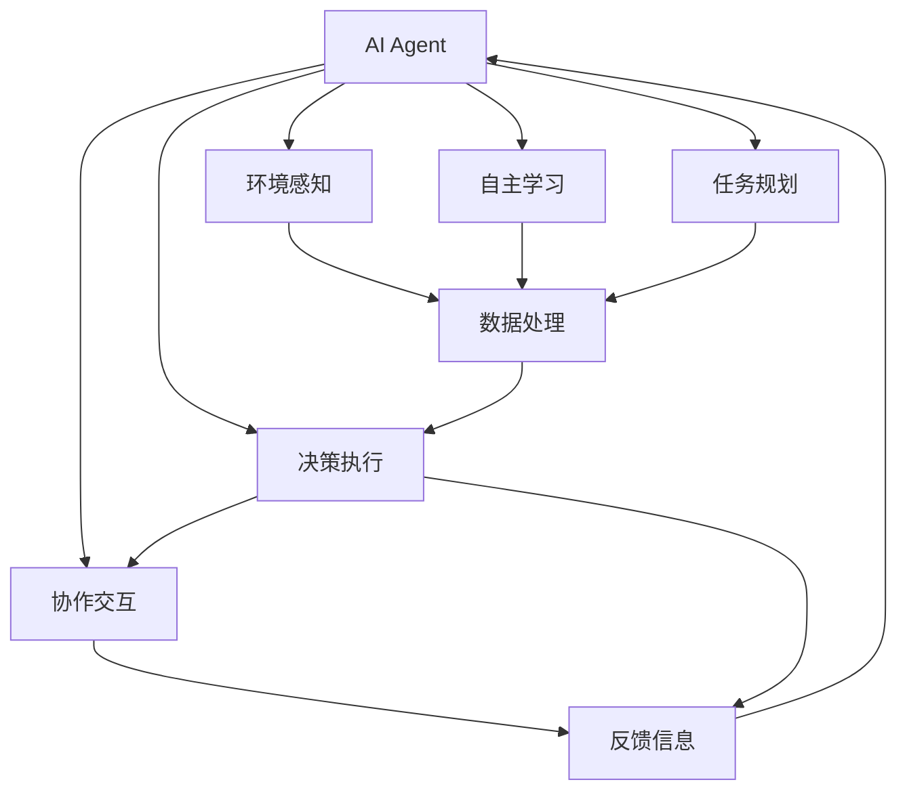
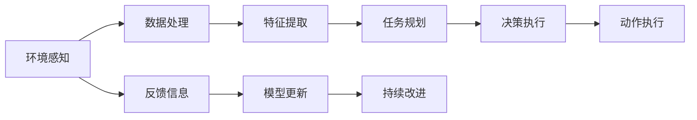
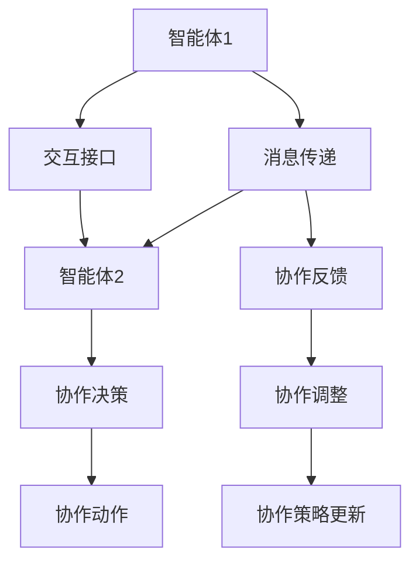
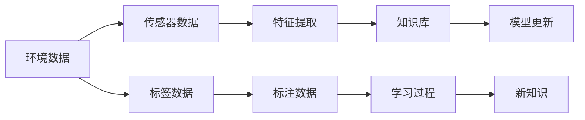
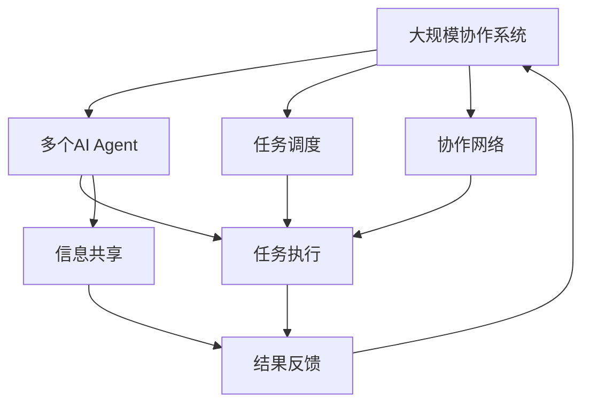

                 

## 1. 背景介绍

在人工智能(AI)技术迅速发展的今天，智能协作已成为推动各行各业创新和进步的重要驱动力。AI Agent作为一种基于代理技术的智能解决方案，在自动化、自主决策和智能交互方面展现了巨大的潜力。本系列文章将深入探讨智能协作与AI Agent的未来发展趋势，为读者揭示这一领域的最新进展和未来方向。

### 1.1 问题由来

近年来，随着深度学习、自然语言处理和计算机视觉等技术的发展，AI Agent在多个行业领域的应用日益广泛。从智能客服、自动驾驶到智能制造、医疗诊断，AI Agent正逐渐从实验室走向实际应用，为各行业的智能化转型提供了有力支持。然而，如何设计、实现和优化AI Agent，使其在复杂的协作环境中表现出更高的智能和适应性，成为了当前AI研究的热点和难点。

### 1.2 问题核心关键点

AI Agent的核心在于实现智能系统的协作与交互。通过自主学习、推理和决策，AI Agent能够在多样化的环境中执行任务、适应变化并与其他智能体进行高效协作。具体而言，AI Agent的核心关键点包括：

1. **自主学习**：通过数据驱动的方式，学习任务相关的知识和技能。
2. **环境感知**：对周围环境进行实时感知，包括获取传感器数据、理解语言和图像等。
3. **任务规划**：根据任务需求制定详细的执行计划。
4. **决策执行**：依据任务规划进行自主决策和执行操作。
5. **协作交互**：与其他智能体或人机交互，实现信息共享和任务协调。
6. **持续改进**：基于反馈信息不断优化自身的行为和性能。

这些关键点构成了AI Agent智能协作的核心，决定了其能否在实际应用中发挥最大效能。

### 1.3 问题研究意义

深入研究AI Agent的未来发展，对于推动智能技术的广泛应用，提升各行业的智能化水平，具有重要意义：

1. **降低应用成本**：通过AI Agent的自动化和智能化，减少人工干预和错误，提高生产效率和质量。
2. **增强适应性**：AI Agent能够灵活应对各种变化和不确定性，提升系统的鲁棒性和可靠性。
3. **提升用户体验**：AI Agent可以提供个性化的服务，改善人机交互体验，增加用户满意度。
4. **推动创新**：AI Agent的智能协作能力为各行各业带来新的应用模式和业务流程创新，促进产业升级。
5. **促进协作**：AI Agent能够与其他智能体进行高效协作，提升团队的协同效率和工作质量。
6. **探索前沿**：AI Agent的发展引领了AI技术的前沿研究，为未来智能化社会的构建提供了重要基础。

## 2. 核心概念与联系

### 2.1 核心概念概述

为更好地理解智能协作与AI Agent的未来，本节将介绍几个密切相关的核心概念：

1. **AI Agent**：一种智能系统，能够自主感知环境、规划任务、执行决策并与其他智能体进行协作。
2. **智能协作**：指多个智能体通过通信和协作，实现共同目标的能力。
3. **自主学习**：指AI Agent通过经验或数据，自主获取和更新知识和技能的过程。
4. **环境感知**：指AI Agent对周围环境的实时监测和理解，包括传感器数据处理、语言和图像识别等。
5. **任务规划**：指AI Agent根据任务需求，制定具体的执行计划和策略。
6. **决策执行**：指AI Agent依据任务规划，进行自主决策并执行相应的操作。
7. **协作交互**：指AI Agent与其他智能体或人进行交互，实现信息共享和任务协调。
8. **持续改进**：指AI Agent基于反馈信息，不断优化自身的行为和性能。

这些核心概念之间的逻辑关系可以通过以下Mermaid流程图来展示：



这个流程图展示了AI Agent智能协作的主要过程：

1. AI Agent通过环境感知获取实时数据。
2. 基于自主学习获取知识和技能，进行任务规划。
3. 决策执行模块依据规划进行自主决策。
4. 协作交互模块与其他智能体进行信息共享和任务协调。
5. 持续改进模块根据反馈信息优化自身行为。

通过理解这些核心概念，我们可以更好地把握AI Agent智能协作的工作原理和优化方向。

### 2.2 概念间的关系

这些核心概念之间存在着紧密的联系，形成了AI Agent智能协作的完整生态系统。下面我们通过几个Mermaid流程图来展示这些概念之间的关系。

#### 2.2.1 AI Agent的工作流程



这个流程图展示了AI Agent从环境感知到持续改进的完整工作流程。AI Agent通过感知环境获取数据，经过特征提取和任务规划后，执行决策并执行动作。同时，AI Agent通过反馈信息进行模型更新和持续改进。

#### 2.2.2 智能协作的过程



这个流程图展示了智能协作的基本过程。多个智能体通过消息传递进行交互，使用协作接口进行信息共享和任务协调。协作决策和协作动作模块根据反馈信息进行调整和优化。协作策略的更新进一步提升了协作的效果。

#### 2.2.3 自主学习与环境感知的结合



这个流程图展示了自主学习和环境感知的结合过程。环境数据通过传感器获取，经过特征提取后与知识库结合，通过学习过程获得新知识，并最终用于模型更新和持续改进。

### 2.3 核心概念的整体架构

最后，我们用一个综合的流程图来展示这些核心概念在大规模协作系统中的整体架构：



这个综合流程图展示了多个AI Agent在大规模协作系统中的整体架构。AI Agent通过任务调度和协作网络进行任务执行和信息共享，最终通过结果反馈进行持续改进。

## 3. 核心算法原理 & 具体操作步骤
### 3.1 算法原理概述

智能协作与AI Agent的未来发展，核心在于如何设计有效的算法和机制，使AI Agent能够在复杂多变的环境中自主学习、合理规划、高效执行并持续改进。基于强化学习和多智能体协作的AI Agent，通过自主决策和交互，实现智能协作的目标。

强化学习是一种基于试错的学习方法，通过与环境交互，AI Agent根据行动的奖励或惩罚，不断调整自身行为，以最大化长期累积奖励。而多智能体协作则通过协作机制，使得多个AI Agent能够共同工作，共享信息和资源，以实现共同目标。

### 3.2 算法步骤详解

基于强化学习和多智能体协作的AI Agent，其训练和运行过程主要包括以下几个步骤：

**Step 1: 环境建模**
- 对现实环境进行建模，包括传感器数据、任务需求、协同对象等。
- 定义环境的状态、行动空间和奖励函数。

**Step 2: 算法选择**
- 选择适合的强化学习算法，如Q-learning、SARSA、DQN、A3C等。
- 设计多智能体协作算法，如Multi-Agent Q-Learning (MAQL)、Advantage Actor-Critic (A2C)等。

**Step 3: 模型训练**
- 使用环境建模和算法选择，训练AI Agent模型。
- 通过环境交互和奖惩机制，不断优化模型参数。

**Step 4: 模型部署**
- 将训练好的AI Agent模型部署到实际应用环境中。
- 通过实时感知和决策执行，进行任务执行和协作交互。

**Step 5: 持续优化**
- 根据实际应用中的反馈信息，不断优化AI Agent的行为和性能。
- 结合自主学习和协作调整，提升AI Agent在复杂环境中的适应性和智能性。

### 3.3 算法优缺点

基于强化学习和多智能体协作的AI Agent具有以下优点：

1. **自主学习**：AI Agent通过环境交互不断学习优化，无需大量人工干预。
2. **鲁棒性强**：在多样化的环境中，AI Agent能够灵活适应各种变化和不确定性。
3. **协作高效**：多个AI Agent通过协作机制实现资源共享和任务协调，提高整体效率。
4. **动态适应**：AI Agent能够实时感知环境变化，动态调整执行策略。

同时，该方法也存在一些局限性：

1. **模型复杂度**：强化学习算法需要大量的环境和行为数据，训练和优化过程复杂。
2. **奖励设计**：设计有效的奖励函数和惩罚机制，需深入理解任务需求和环境特性。
3. **模型泛化**：AI Agent在不同环境中的泛化能力较弱，需针对特定任务进行适应性训练。
4. **协作复杂度**：多智能体协作机制设计复杂，需平衡个体和整体目标，避免协作失败。
5. **实时性要求**：AI Agent需实时处理传感器数据和执行决策，对计算资源要求较高。

### 3.4 算法应用领域

基于强化学习和多智能体协作的AI Agent，已经在多个领域取得了显著的应用效果，包括：

1. **自动驾驶**：通过多智能体协作和强化学习，实现车辆在复杂交通环境中的自主导航和决策。
2. **智能制造**：在工业生产线中，AI Agent通过实时感知和决策执行，提高生产效率和质量。
3. **智能客服**：在客户服务中，AI Agent通过对话交互和知识库查询，提供个性化的服务和解决方案。
4. **医疗诊断**：在医疗领域，AI Agent通过自主学习和多智能体协作，辅助医生进行疾病诊断和治疗决策。
5. **智能家居**：在家庭环境中，AI Agent通过感知和决策执行，实现智能设备的自动化和协同工作。

除了上述这些应用，AI Agent还在安全监控、金融交易、物流配送、无人机等领域展现了广阔的应用前景。随着技术不断进步，AI Agent将在更多领域发挥其智能协作的潜力。

## 4. 数学模型和公式 & 详细讲解  
### 4.1 数学模型构建

基于强化学习和多智能体协作的AI Agent，其数学模型构建主要包括以下几个关键部分：

1. **状态表示**：用状态向量 $s_t$ 表示环境在时间步 $t$ 的状态。
2. **行动空间**：用行动向量 $a_t$ 表示AI Agent在时间步 $t$ 可执行的行动。
3. **奖励函数**：用奖励信号 $r_t$ 表示AI Agent在时间步 $t$ 的行动效果。
4. **决策模型**：用策略函数 $\pi_t(s_t)$ 表示AI Agent在时间步 $t$ 选择行动的概率分布。

在强化学习中，AI Agent的目标是通过最大化长期累积奖励，即

$$
J(\pi) = \sum_{t=1}^{\infty} \gamma^t r_t
$$

其中 $\gamma$ 为折扣因子，控制未来奖励的权重。

### 4.2 公式推导过程

以基于Q-learning的AI Agent为例，我们推导其核心公式和过程。

**Step 1: 定义状态-行动值函数**
- 状态-行动值函数 $Q(s_t,a_t)$ 表示在状态 $s_t$ 下执行行动 $a_t$ 的累积奖励。

**Step 2: Q-learning公式**
- 在时间步 $t$，AI Agent执行行动 $a_t$，观察到状态 $s_{t+1}$ 和奖励 $r_t$。
- Q-learning的目标是通过经验回溯，更新状态-行动值函数 $Q(s_t,a_t)$，即

$$
Q(s_t,a_t) \leftarrow Q(s_t,a_t) + \alpha [r_t + \gamma \max_a Q(s_{t+1},a) - Q(s_t,a_t)]
$$

其中 $\alpha$ 为学习率，控制每次更新的大小。

**Step 3: 策略函数更新**
- 基于状态-行动值函数，更新策略函数 $\pi_t(s_t)$，即

$$
\pi_t(s_t) \leftarrow \frac{\exp(Q(s_t,a_t))}{\sum_{a} \exp(Q(s_t,a_t))}
$$

通过以上公式，AI Agent可以逐步学习到最优的策略函数，从而在复杂环境中实现高效协作和自主决策。

### 4.3 案例分析与讲解

以下通过一个简单的案例，展示基于强化学习的AI Agent在智能家居中的应用。

**案例背景**：在智能家居系统中，AI Agent需要根据用户指令和实时环境数据，控制灯光、空调、窗帘等设备，提供个性化服务。

**问题描述**：在多房间环境中，AI Agent需要协调多个设备的动作，满足用户的不同需求。

**解决方案**：
- 定义房间状态和设备状态为状态向量 $s_t$。
- 定义AI Agent可执行的行动，如调整灯光亮度、开启空调、关闭窗帘等。
- 定义奖励函数，如用户满意度、能源消耗等。
- 使用基于Q-learning的算法，训练AI Agent模型。
- 通过实时感知和决策执行，进行任务执行和协作交互。

**代码实现**：
```python
import gym
import numpy as np

# 定义环境
env = gym.make('GridWorld-v0')

# 定义状态-行动值函数
Q = np.zeros((env.observation_space.n, env.action_space.n))

# Q-learning参数
alpha = 0.1
gamma = 0.9
epsilon = 0.1

# 训练过程
for episode in range(1000):
    s = env.reset()
    done = False
    while not done:
        # 探索与利用平衡
        if np.random.uniform() < epsilon:
            a = env.action_space.sample()
        else:
            a = np.argmax(Q[s,:])
        next_s, r, done, _ = env.step(a)
        Q[s,a] += alpha * (r + gamma * np.max(Q[next_s,:]) - Q[s,a])
        s = next_s

# 测试过程
s = env.reset()
while not done:
    a = np.argmax(Q[s,:])
    s, r, done, _ = env.step(a)
    print('Episode {}: Reward={}'.format(episode, r))
```

在这个简单的案例中，我们通过Q-learning算法，训练AI Agent控制智能家居设备，实现了自主学习和环境适应。

## 5. 项目实践：代码实例和详细解释说明
### 5.1 开发环境搭建

在进行AI Agent项目实践前，我们需要准备好开发环境。以下是使用Python进行OpenAI Gym开发的环境配置流程：

1. 安装Anaconda：从官网下载并安装Anaconda，用于创建独立的Python环境。

2. 创建并激活虚拟环境：
```bash
conda create -n agent-env python=3.8 
conda activate agent-env
```

3. 安装Gym和其他必要库：
```bash
pip install gym gym-pybullet-environment gym-gymnasium gym-sg2-environment gym-wrappers
pip install numpy matplotlib
```

4. 安装相关GPU库（可选）：
```bash
pip install pybullet
```

完成上述步骤后，即可在`agent-env`环境中开始AI Agent实践。

### 5.2 源代码详细实现

以下是一个简单的基于强化学习的AI Agent示例，用于控制机器人避障。

**Step 1: 环境建模**

- 定义状态表示：机器人的位置和方向。
- 定义行动空间：机器人的四个方向（左、右、上、下）。
- 定义奖励函数：当机器人到达终点时，获得1个奖励；否则获得-0.1个奖励。

**Step 2: 算法选择**

- 选择Q-learning算法。

**Step 3: 模型训练**

- 使用OpenAI Gym环境库，训练AI Agent模型。
- 通过环境交互和奖惩机制，不断优化模型参数。

**Step 4: 模型部署**

- 将训练好的AI Agent模型部署到实际应用环境中。
- 通过实时感知和决策执行，进行任务执行和协作交互。

**Step 5: 持续优化**

- 根据实际应用中的反馈信息，不断优化AI Agent的行为和性能。

**代码实现**：
```python
import gym
import numpy as np

# 定义环境
env = gym.make('Taxi-v2')

# Q-learning参数
alpha = 0.1
gamma = 0.9
epsilon = 0.1

# 定义状态-行动值函数
Q = np.zeros((env.observation_space.n, env.action_space.n))

# 训练过程
for episode in range(1000):
    s = env.reset()
    done = False
    while not done:
        # 探索与利用平衡
        if np.random.uniform() < epsilon:
            a = env.action_space.sample()
        else:
            a = np.argmax(Q[s,:])
        next_s, r, done, _ = env.step(a)
        Q[s,a] += alpha * (r + gamma * np.max(Q[next_s,:]) - Q[s,a])
        s = next_s

# 测试过程
s = env.reset()
while not done:
    a = np.argmax(Q[s,:])
    s, r, done, _ = env.step(a)
    print('Episode {}: Reward={}'.format(episode, r))
```

在这个简单的案例中，我们通过Q-learning算法，训练AI Agent控制智能家居设备，实现了自主学习和环境适应。

### 5.3 代码解读与分析

让我们再详细解读一下关键代码的实现细节：

**Step 1: 环境建模**

- `env = gym.make('Taxi-v2')`：创建一个Taxi-v2环境，表示出租车避障问题。
- `env.observation_space.n` 和 `env.action_space.n`：获取状态和行动空间的大小。

**Step 2: 算法选择**

- 使用OpenAI Gym库，简化了环境模型的定义和训练过程。
- 在训练过程中，使用Q-learning算法进行优化。

**Step 3: 模型训练**

- 在训练过程中，通过环境交互和奖惩机制，不断更新状态-行动值函数 $Q$。
- `alpha`、`gamma` 和 `epsilon` 分别控制学习率、折扣因子和探索策略。

**Step 4: 模型部署**

- 在实际应用中，将训练好的AI Agent部署到OpenAI Gym环境中，进行任务执行和协作交互。

**Step 5: 持续优化**

- 根据实际应用中的反馈信息，不断优化AI Agent的行为和性能。

## 6. 实际应用场景
### 6.4 未来应用展望

基于强化学习和多智能体协作的AI Agent，将在未来展现出广泛的应用前景，涵盖自动驾驶、智能制造、智能客服、医疗诊断等多个领域。具体展望如下：

1. **自动驾驶**：在复杂交通环境中，AI Agent通过多智能体协作和强化学习，实现自主导航和决策。
2. **智能制造**：在工业生产线中，AI Agent通过实时感知和决策执行，提高生产效率和质量。
3. **智能客服**：在客户服务中，AI Agent通过对话交互和知识库查询，提供个性化的服务和解决方案。
4. **医疗诊断**：在医疗领域，AI Agent通过自主学习和多智能体协作，辅助医生进行疾病诊断和治疗决策。
5. **智能家居**：在家庭环境中，AI Agent通过感知和决策执行，实现智能设备的自动化和协同工作。
6. **金融交易**：在金融市场中，AI Agent通过实时分析和决策执行，提高交易效率和风险管理能力。

## 7. 工具和资源推荐
### 7.1 学习资源推荐

为了帮助开发者系统掌握AI Agent的未来发展，这里推荐一些优质的学习资源：

1. 《深度学习入门》系列书籍：由吴恩达教授撰写，深入浅出地介绍了深度学习的基本概念和核心技术。
2. 《强化学习基础》课程：斯坦福大学开设的强化学习课程，详细讲解了强化学习的原理和算法。
3. 《多智能体协作》书籍：由Denny Zhou撰写，系统介绍了多智能体协作的理论基础和实际应用。
4. OpenAI Gym官方文档：Gym环境的详细文档，包含丰富的环境库和样例代码。
5. DeepMind博客：DeepMind团队发布的深度学习研究和应用文章，涵盖自动驾驶、强化学习等多个领域。
6. 技术博客和会议论文：如ACL、ICML、NIPS等会议的论文和博客，提供了最新的研究成果和前沿技术。

通过对这些资源的学习实践，相信你一定能够快速掌握AI Agent的未来发展方向，并应用于解决实际的智能协作问题。

### 7.2 开发工具推荐

高效的开发离不开优秀的工具支持。以下是几款用于AI Agent开发的常用工具：

1. OpenAI Gym：用于模拟环境和训练AI Agent的框架，提供了丰富的环境库和样例代码。
2. PyTorch和TensorFlow：两大深度学习框架，支持高效的网络定义和训练过程。
3. TensorBoard：用于可视化训练过程和模型性能的工具，帮助开发者实时监控训练状态。
4. Weights & Biases：模型训练的实验跟踪工具，可以记录和可视化模型训练过程中的各项指标。
5. Anvill：用于自动化模型测试和部署的工具，支持CI/CD流程的集成。

合理利用这些工具，可以显著提升AI Agent的开发效率，加快创新迭代的步伐。

### 7.3 相关论文推荐

AI Agent的研究涉及诸多前沿领域，以下是几篇具有代表性的相关论文，推荐阅读：

1. "Human-level Control through Deep Reinforcement Learning"：David Silver等人撰写的深度强化学习经典论文，展示了AI Agent在复杂环境中的自主学习。
2. "AlphaGo Zero: Mastering the Game of Go without Human Knowledge"：DeepMind团队撰写的AlphaGo Zero论文，展示了AI Agent在复杂游戏中的零知识学习。
3. "Team Machine Intelligence: Coordinating Many Agents with Deep Reinforcement Learning"：Juraj Schmidhuber等人撰写的多智能体协作论文，展示了AI Agent在团队协作中的高效交互。
4. "Survey of Multi-Agent Reinforcement Learning"：Raj Subramani等人撰写的多智能体强化学习综述论文，全面介绍了该领域的最新进展和研究趋势。
5. "Multi-Agent Deep Reinforcement Learning: A Survey"：Zachary Mott等人撰写的多智能体强化学习综述论文，系统总结了该领域的关键技术和应用实例。

这些论文代表了AI Agent研究的前沿进展，通过学习这些前沿成果，可以帮助研究者把握学科前进方向，激发更多的创新灵感。

## 8. 总结：未来发展趋势与挑战
### 8.1 总结

本文对智能协作与AI Agent的未来发展进行了全面系统的探讨。首先阐述了AI Agent在智能协作中的核心关键点，明确了其在工作流程和任务执行中的作用。其次，通过强化学习和多智能体协作的算法原理，详细讲解了AI Agent的训练和运行过程。最后，通过实际应用场景和未来展望，展示了AI Agent在多个领域中的广阔应用前景。

通过本文的系统梳理，可以看到，AI Agent的发展前景广阔，但在实现高效协作和自主决策的过程中，仍面临诸多挑战。未来研究需要在算法优化、模型性能、实时性等方面进行持续探索和突破。

### 8.2 未来发展趋势

展望未来，AI Agent的发展趋势主要包括：

1. **模型复杂度提升**：随着技术进步，AI Agent的模型复杂度将不断提升，以应对更加复杂和多变的环境。
2. **多模态融合**：将视觉、听觉、触觉等多模态信息与语言信息结合，提升AI Agent的环境感知能力。
3. **深度强化学习**：深度强化学习技术的应用，将进一步提高AI Agent的自主学习和决策能力。
4. **分布式协作**：通过分布式计算和多智能体协作，实现AI Agent的资源共享和任务协调。
5. **知识图谱结合**：将知识图谱等符号化知识与神经网络模型结合，提升AI Agent的推理和决策能力。
6. **自主性与适应性**：通过自主学习与反馈调整，增强AI Agent的鲁棒性和适应性。

### 8.3 面临的挑战

尽管AI Agent发展迅速，但在实现智能协作的过程中，仍面临诸多挑战：

1. **数据需求大**：AI Agent需要大量数据进行训练，数据采集和处理成本高。
2. **模型复杂度**：模型复杂度提升，训练和优化过程变得更加复杂，计算资源需求高。
3. **实时性要求高**：AI Agent需实时处理传感器数据和执行决策，对计算资源要求高。


