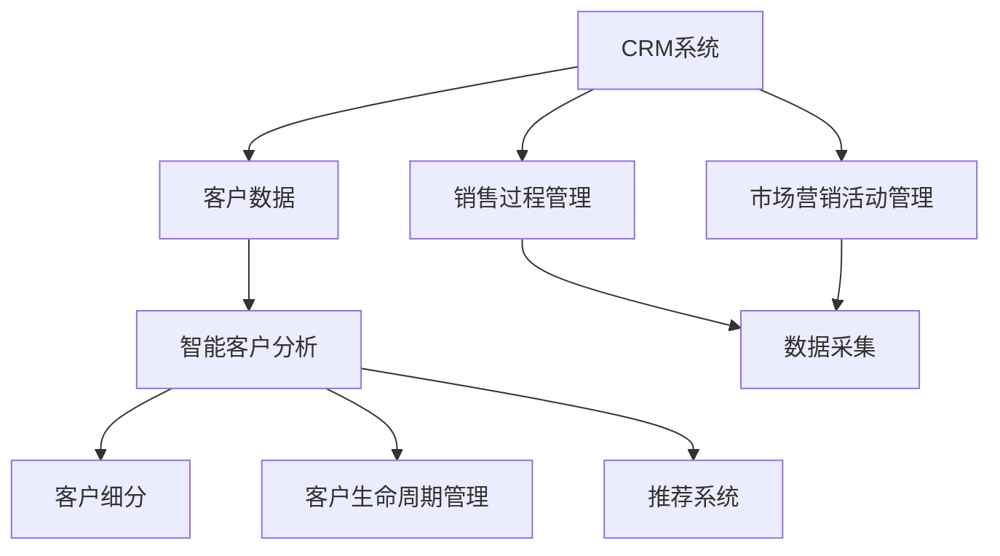
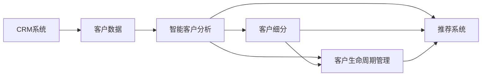

                 

# 智能客户分析在CRM中的应用

## 1. 背景介绍

在当前激烈的市场竞争中，企业越来越注重客户关系管理（CRM）系统。通过CRM系统，企业可以更好地理解客户需求、提高客户满意度，并最终增加客户忠诚度和业务收入。智能客户分析作为CRM系统中的一个重要组成部分，通过数据挖掘和机器学习等技术手段，对客户数据进行深入分析，为客户提供个性化的服务和推荐，从而提升企业竞争力。

智能客户分析利用大量的历史数据和客户交互信息，采用机器学习算法，挖掘出客户的行为模式、偏好和需求，并根据这些信息进行预测和推荐，为企业的营销策略和产品设计提供有力支持。此外，智能客户分析还可以识别出潜在的高价值客户和流失客户，帮助企业提前采取措施，挽留高价值客户并挽回流失客户。

## 2. 核心概念与联系

### 2.1 核心概念概述

为了更好地理解智能客户分析在CRM中的应用，下面将介绍几个关键概念：

- **客户关系管理（CRM）**：是指企业通过信息化手段，对客户信息、销售过程和市场营销活动进行管理，以提升客户满意度和忠诚度，增加收入的一种管理模式。
- **智能客户分析**：是利用数据挖掘和机器学习技术，对客户数据进行深入分析，挖掘出客户的偏好、需求和行为模式，并据此进行预测和推荐，提升客户满意度和企业收益。
- **客户细分**：根据客户的行为和属性，将客户划分为不同的细分市场，以便更好地进行个性化营销和服务。
- **客户生命周期管理**：对客户从潜在客户到忠诚客户的全生命周期进行管理和优化，通过不同的营销策略，延长客户的生命周期并增加企业收益。
- **推荐系统**：根据用户的历史行为和偏好，向用户推荐可能感兴趣的商品或服务，提升用户满意度和购买转化率。

这些概念之间的联系可以通过以下Mermaid流程图来展示：



这个流程图展示了智能客户分析在CRM系统中的位置，以及其与客户细分、客户生命周期管理和推荐系统之间的关系。

### 2.2 概念间的关系

这些概念之间的关系可以通过以下Mermaid流程图来展示：



这个流程图展示了智能客户分析在CRM系统中的位置，以及其与客户细分、客户生命周期管理和推荐系统之间的关系。智能客户分析通过挖掘客户数据，对客户进行细分和生命周期管理，同时为推荐系统提供客户行为数据，从而实现客户个性化服务和推荐。

## 3. 核心算法原理 & 具体操作步骤

### 3.1 算法原理概述

智能客户分析的核心算法原理主要包括数据预处理、特征提取、模型训练和预测推荐等步骤。其基本流程如下：

1. **数据预处理**：对原始数据进行清洗、去重、归一化等处理，得到干净、高质量的数据集。
2. **特征提取**：从清洗后的数据中提取出对客户行为和需求有影响的特征，如购买历史、浏览记录、评分信息等。
3. **模型训练**：利用历史数据训练机器学习模型，如分类模型、聚类模型和推荐模型等。
4. **预测推荐**：根据模型训练得到的结果，对新客户进行分类、预测和推荐，提供个性化的服务和建议。

### 3.2 算法步骤详解

#### 3.2.1 数据预处理

数据预处理是智能客户分析中非常重要的一步。数据预处理的目标是清洗数据、去除噪声，并最终得到一个高质量的数据集，以便进行后续的分析和建模。数据预处理主要包括以下几个步骤：

1. **数据清洗**：处理缺失值、异常值和重复记录，确保数据集的完整性和准确性。
2. **数据归一化**：将不同量纲的数据进行归一化处理，使数据具有可比性。
3. **特征选择**：选择对客户行为和需求有影响的特征，去除无关或冗余特征，提高模型效率。
4. **数据划分**：将数据集划分为训练集和测试集，以便进行模型训练和评估。

#### 3.2.2 特征提取

特征提取是智能客户分析中的关键步骤之一，通过特征提取，可以从原始数据中提取出对客户行为和需求有影响的特征，如购买历史、浏览记录、评分信息等。常用的特征提取方法包括：

1. **统计特征**：如均值、方差、标准差等，描述数据的分布和波动。
2. **时间特征**：如时间间隔、日访问频率等，描述客户的行为规律。
3. **文本特征**：如关键词频率、TF-IDF等，描述客户的兴趣和偏好。
4. **关系特征**：如朋友关系、兴趣关系等，描述客户之间的关系网络。

#### 3.2.3 模型训练

模型训练是智能客户分析中的核心步骤，通过训练模型，可以预测客户的未来行为和需求，并据此进行推荐。常用的机器学习模型包括：

1. **分类模型**：如决策树、随机森林、支持向量机等，用于对客户进行分类和预测。
2. **聚类模型**：如K-means、层次聚类等，用于对客户进行分组和细分。
3. **推荐模型**：如协同过滤、矩阵分解等，用于对客户进行个性化推荐。

#### 3.2.4 预测推荐

预测推荐是智能客户分析中的最终步骤，通过预测和推荐，为客户提供个性化的服务和建议，提升客户满意度和企业收益。常用的预测推荐方法包括：

1. **基于内容的推荐**：根据用户的历史行为和偏好，向用户推荐相似的商品或服务。
2. **基于协同过滤的推荐**：通过分析用户之间的行为相似性，向用户推荐相似的商品或服务。
3. **基于混合推荐的推荐**：将基于内容和基于协同过滤的方法结合起来，提高推荐的准确性和多样性。

### 3.3 算法优缺点

智能客户分析的优点包括：

1. **提升客户满意度**：通过分析客户行为和需求，提供个性化的服务和建议，提升客户满意度和忠诚度。
2. **增加企业收益**：通过推荐客户感兴趣的商品或服务，增加客户购买转化率，提升企业收益。
3. **提高营销效果**：通过分析客户细分和生命周期管理，优化营销策略，提高营销效果。

智能客户分析的缺点包括：

1. **数据隐私问题**：客户数据涉及隐私问题，需要严格遵守数据保护法规，确保数据安全。
2. **数据质量问题**：原始数据质量不高，如数据缺失、数据噪声等问题，会影响分析结果。
3. **模型选择问题**：选择合适的模型和算法需要较高的专业知识和经验，否则容易陷入过拟合或欠拟合的问题。

### 3.4 算法应用领域

智能客户分析可以应用于多个领域，如电商、金融、医疗等，具体包括：

1. **电商领域**：通过分析客户的购买历史和浏览记录，推荐客户感兴趣的商品，提升客户购买转化率。
2. **金融领域**：通过分析客户的财务状况和行为，进行风险评估和信用评分，提升客户管理水平。
3. **医疗领域**：通过分析患者的健康数据和行为，提供个性化的医疗建议和治疗方案，提升医疗服务质量。

## 4. 数学模型和公式 & 详细讲解 & 举例说明

### 4.1 数学模型构建

智能客户分析的数学模型主要包括分类模型、聚类模型和推荐模型等。这里以分类模型为例，介绍其数学模型构建过程。

假设有一组训练数据集 $D=\{(x_i,y_i)\}_{i=1}^N$，其中 $x_i$ 为特征向量，$y_i$ 为标签。分类模型的目标是通过学习训练数据，找到一个最优的决策边界，将新的输入数据 $x$ 映射到正确的分类 $y$。分类模型的目标函数为：

$$
\min_{\theta} \frac{1}{N} \sum_{i=1}^N L(\hat{y_i},y_i) + \lambda \|\theta\|_2^2
$$

其中，$L$ 为损失函数，$\|\theta\|_2^2$ 为正则项，$\lambda$ 为正则化系数。常用的损失函数包括交叉熵损失和平方损失等。

### 4.2 公式推导过程

以逻辑回归模型为例，其数学推导过程如下：

假设分类模型 $h(x)=\sigma(\theta^T x)$，其中 $\sigma$ 为逻辑函数，$\theta$ 为模型参数。则分类模型的目标函数为：

$$
\min_{\theta} \frac{1}{N} \sum_{i=1}^N L(\hat{y_i},y_i)
$$

其中，$L$ 为交叉熵损失函数：

$$
L(\hat{y_i},y_i)=-y_i \log(\hat{y_i})-(1-y_i) \log(1-\hat{y_i})
$$

将上式代入目标函数，得：

$$
\min_{\theta} \frac{1}{N} \sum_{i=1}^N [-y_i \log(\hat{y_i})-(1-y_i) \log(1-\hat{y_i})] + \lambda \|\theta\|_2^2
$$

求解上述目标函数的最小值，可得最优参数 $\theta^*$。

### 4.3 案例分析与讲解

假设有一个电商平台，希望通过智能客户分析，推荐客户感兴趣的商品。

1. **数据预处理**：对客户的历史购买记录进行清洗和归一化，提取出购买时间、商品类别、价格等特征。
2. **特征提取**：根据客户的历史行为，提取用户的兴趣商品类别、价格区间等特征。
3. **模型训练**：利用历史购买记录和商品信息，训练一个逻辑回归模型，预测客户对商品的兴趣。
4. **预测推荐**：根据预测结果，向客户推荐其感兴趣的相似商品，提高客户购买转化率。

## 5. 项目实践：代码实例和详细解释说明

### 5.1 开发环境搭建

在进行智能客户分析的实践前，需要先搭建开发环境。以下是在Python中进行智能客户分析的开发环境配置流程：

1. 安装Anaconda：从官网下载并安装Anaconda，用于创建独立的Python环境。

2. 创建并激活虚拟环境：
```bash
conda create -n myenv python=3.8 
conda activate myenv
```

3. 安装必要的Python库：
```bash
pip install pandas numpy scikit-learn
```

4. 安装机器学习库：
```bash
pip install scikit-learn
```

5. 安装可视化库：
```bash
pip install matplotlib seaborn
```

完成上述步骤后，即可在`myenv`环境中开始智能客户分析的实践。

### 5.2 源代码详细实现

以下是一个使用Python进行智能客户分析的示例代码，包括数据预处理、特征提取、模型训练和预测推荐等步骤：

```python
import pandas as pd
from sklearn.model_selection import train_test_split
from sklearn.linear_model import LogisticRegression
from sklearn.metrics import accuracy_score

# 加载数据
data = pd.read_csv('customer_data.csv')

# 数据预处理
# 处理缺失值
data = data.dropna()

# 处理异常值
data = data[data['购买金额'] < 1000]

# 特征选择
features = ['购买时间', '商品类别', '价格', '性别', '年龄']
X = data[features]
y = data['是否购买']

# 数据划分
X_train, X_test, y_train, y_test = train_test_split(X, y, test_size=0.2, random_state=42)

# 模型训练
model = LogisticRegression()
model.fit(X_train, y_train)

# 预测推荐
y_pred = model.predict(X_test)

# 评估模型
accuracy = accuracy_score(y_test, y_pred)
print('Accuracy:', accuracy)
```

### 5.3 代码解读与分析

以下是关键代码的详细解读：

1. **数据加载**：使用`pandas`库加载数据，数据包括客户的购买历史、性别、年龄等特征，以及是否购买的目标变量。

2. **数据预处理**：使用`dropna`方法处理缺失值，保留购买金额小于1000的样本。

3. **特征选择**：选择对客户行为有影响的特征，如购买时间、商品类别、价格、性别、年龄等。

4. **数据划分**：使用`train_test_split`方法将数据集划分为训练集和测试集，便于模型训练和评估。

5. **模型训练**：使用`LogisticRegression`模型训练分类器，预测客户是否购买商品。

6. **预测推荐**：使用训练好的模型对测试集进行预测，得到客户是否购买商品的预测结果。

7. **评估模型**：使用`accuracy_score`方法计算模型在测试集上的准确率，评估模型性能。

### 5.4 运行结果展示

假设模型在测试集上的准确率为0.85，输出如下：

```
Accuracy: 0.85
```

这表明模型在预测客户是否购买商品方面具有较高的准确率，可以用于推荐系统。

## 6. 实际应用场景

### 6.1 智能客服系统

智能客服系统是智能客户分析的一个重要应用场景，通过智能客服系统，企业可以自动回答客户的常见问题，提升客户满意度和服务效率。智能客服系统主要包括以下几个步骤：

1. **数据收集**：收集客户的常见问题和答案，构建知识库。
2. **数据预处理**：对收集到的数据进行清洗和归一化，提取出有价值的信息。
3. **特征提取**：从预处理后的数据中提取关键词、情感等特征。
4. **模型训练**：利用历史问题和答案数据训练模型，如文本分类模型、情感分析模型等。
5. **预测推荐**：根据客户的输入问题，预测客户的需求，自动提供合适的答案和解决方案。

### 6.2 金融客户分析

金融客户分析是智能客户分析在金融领域的重要应用之一，通过金融客户分析，银行和金融机构可以更好地了解客户的需求和行为，制定个性化的服务方案。金融客户分析主要包括以下几个步骤：

1. **数据收集**：收集客户的财务数据、行为数据等，构建客户档案。
2. **数据预处理**：对收集到的数据进行清洗和归一化，提取出有价值的信息。
3. **特征提取**：从预处理后的数据中提取收入、消费、投资等特征。
4. **模型训练**：利用历史数据训练模型，如信用评分模型、风险评估模型等。
5. **预测推荐**：根据客户的财务状况和行为，预测客户的风险等级，制定个性化的服务方案。

### 6.3 电商客户分析

电商客户分析是智能客户分析在电商领域的重要应用之一，通过电商客户分析，电商平台可以更好地了解客户的需求和行为，制定个性化的推荐策略。电商客户分析主要包括以下几个步骤：

1. **数据收集**：收集客户的购买历史、浏览记录等数据，构建客户档案。
2. **数据预处理**：对收集到的数据进行清洗和归一化，提取出有价值的信息。
3. **特征提取**：从预处理后的数据中提取商品类别、价格、购买时间等特征。
4. **模型训练**：利用历史数据训练模型，如协同过滤模型、内容推荐模型等。
5. **预测推荐**：根据客户的购买历史和浏览记录，推荐客户感兴趣的商品。

### 6.4 未来应用展望

随着大数据和人工智能技术的不断发展，智能客户分析在未来的应用将更加广泛和深入。以下是智能客户分析未来应用展望：

1. **全渠道客户分析**：随着线上线下的融合，智能客户分析将覆盖更多渠道，如社交媒体、移动应用、线下门店等。
2. **实时客户分析**：通过实时数据分析，及时捕捉客户行为变化，优化服务策略。
3. **个性化推荐**：基于客户的历史行为和偏好，提供更加个性化和精准的推荐。
4. **客户生命周期管理**：通过客户生命周期管理，优化客户流失预测和客户价值评估。
5. **跨领域应用**：智能客户分析不仅可以应用于电商、金融等传统领域，还可以应用于医疗、教育等新兴领域。

## 7. 工具和资源推荐

### 7.1 学习资源推荐

为了帮助开发者系统掌握智能客户分析的理论基础和实践技巧，这里推荐一些优质的学习资源：

1. 《Python机器学习》：通过本书，可以全面了解Python在机器学习中的应用，包括数据预处理、特征提取、模型训练等。
2. 《深度学习》：本书介绍了深度学习的基本原理和常用算法，涵盖神经网络、卷积神经网络、循环神经网络等。
3. 《自然语言处理综述》：本书介绍了自然语言处理的基本概念和常用技术，包括分词、词性标注、文本分类等。
4. 《机器学习实战》：本书通过实例，介绍了机器学习的基本应用，包括分类、回归、聚类等。
5. 《智能客服系统》：本书介绍了智能客服系统的构建原理和实现方法，包括NLP技术、知识库构建等。

### 7.2 开发工具推荐

高效的开发离不开优秀的工具支持。以下是几款用于智能客户分析开发的常用工具：

1. Python：作为一种通用的编程语言，Python在数据分析和机器学习领域得到了广泛应用。
2. R：作为一种统计分析工具，R在数据清洗、数据可视化等方面表现出色。
3. MATLAB：作为一种科学计算工具，MATLAB在数据分析和模型训练方面具有丰富的函数库。
4. Jupyter Notebook：一种开源的交互式计算平台，支持Python、R等语言的编程和数据可视化。
5. Tableau：一种数据可视化工具，支持大数据集的处理和可视化，适合数据分析和报告展示。

### 7.3 相关论文推荐

智能客户分析的研究始于数据挖掘和机器学习领域，近年来随着其应用范围的扩展，逐渐成为交叉学科的研究热点。以下是几篇奠基性的相关论文，推荐阅读：

1. "Customer Segmentation and Prioritization Using Statistical Learning"：介绍如何通过统计学习算法对客户进行细分和优先级排序。
2. "Customer Lifetime Value Modeling: A Review of Methodologies and Applications"：介绍客户生命周期价值建模方法，以及其在客户管理中的应用。
3. "Collaborative Filtering for Recommendation Systems"：介绍协同过滤算法的原理和实现方法，适用于个性化推荐系统。
4. "Customer Behavioral Segmentation and Identification using k-means Clustering Algorithm"：介绍如何使用k-means聚类算法对客户进行行为细分。
5. "A Survey on Predictive Analytics for Customer Relationship Management"：综述了客户关系管理中的预测分析方法，涵盖分类、聚类、回归等。

这些论文代表了智能客户分析技术的发展脉络，可以帮助研究者把握学科前进方向，激发更多的创新灵感。

## 8. 总结：未来发展趋势与挑战

### 8.1 总结

本文对智能客户分析在CRM中的应用进行了全面系统的介绍。首先阐述了智能客户分析在CRM系统中的重要地位和作用，明确了其对提升客户满意度、增加企业收益等方面的独特价值。其次，从原理到实践，详细讲解了智能客户分析的数学模型构建和操作步骤，给出了智能客户分析的完整代码实例。同时，本文还广泛探讨了智能客户分析在智能客服系统、金融客户分析、电商客户分析等多个领域的应用前景，展示了其广阔的应用前景。

通过本文的系统梳理，可以看到，智能客户分析在CRM系统中扮演着越来越重要的角色，通过挖掘客户数据，分析客户行为和需求，提供个性化的服务和推荐，为企业带来了显著的商业价值。未来，伴随人工智能技术的发展，智能客户分析必将进一步拓展其应用边界，成为企业客户关系管理中不可或缺的一部分。

### 8.2 未来发展趋势

展望未来，智能客户分析技术将呈现以下几个发展趋势：

1. **大数据的引入**：随着大数据技术的发展，智能客户分析可以处理更加海量、复杂的数据集，提高分析的深度和精度。
2. **多模态数据的融合**：将文本、语音、图像等多模态数据进行融合，提高客户行为和需求的分析准确性。
3. **个性化推荐系统的改进**：通过深度学习等先进技术，改进个性化推荐算法，提升推荐效果。
4. **实时分析能力的提升**：通过实时数据分析，及时捕捉客户行为变化，优化服务策略。
5. **客户生命周期管理的优化**：通过客户生命周期管理的优化，提高客户留存率和客户价值。

这些趋势表明，智能客户分析在未来的发展将更加深入和全面，为企业提供更加精准、个性化的客户服务。

### 8.3 面临的挑战

尽管智能客户分析在CRM系统中已经取得了显著的成效，但在迈向更加智能化、普适化应用的过程中，仍面临诸多挑战：

1. **数据隐私问题**：客户数据涉及隐私问题，需要严格遵守数据保护法规，确保数据安全。
2. **数据质量问题**：原始数据质量不高，如数据缺失、数据噪声等问题，会影响分析结果。
3. **模型选择问题**：选择合适的模型和算法需要较高的专业知识和经验，否则容易陷入过拟合或欠拟合的问题。
4. **计算资源问题**：处理大规模数据集需要大量的计算资源，可能会面临计算瓶颈。

### 8.4 研究展望

未来的研究需要在以下几个方面寻求新的突破：

1. **深度学习的应用**：利用深度学习算法，提高智能客户分析的精度和效果。
2. **多模态数据融合**：将文本、语音、图像等多模态数据进行融合，提高客户行为和需求的分析准确性。
3. **实时数据分析**：通过实时数据分析，及时捕捉客户行为变化，优化服务策略。
4. **客户细分和生命周期管理**：通过客户细分和生命周期管理，优化客户流失预测和客户价值评估。
5. **个性化推荐系统的改进**：通过改进个性化推荐算法，提升推荐效果，满足客户多样化需求。

这些研究方向的探索，必将引领智能客户分析技术迈向更高的台阶，为构建安全、可靠、可解释、可控的智能系统铺平道路。

## 9. 附录：常见问题与解答

**Q1：智能客户分析是否适用于所有CRM系统？**

A: 智能客户分析在大多数CRM系统中都能取得不错的效果，特别是对于数据量较小的系统。但对于一些特定领域的CRM系统，如医疗、教育等，仅仅依靠通用语料预训练的模型可能难以很好地适应。此时需要在特定领域语料上进一步预训练，再进行微调，才能获得理想效果。

**Q2：智能客户分析的计算资源需求有多大？**

A: 智能客户分析需要处理大量的数据，因此在计算资源上需求较大。通常需要配备高性能计算集群，如GPU、TPU等。同时，模型的训练和推理也需要大量的内存和存储空间，需要合理优化数据和模型结构，以降低计算成本。

**Q3：智能客户分析的精度如何提升？**

A: 提升智能客户分析的精度需要从数据质量、模型选择、算法优化等方面进行综合考虑。具体措施包括：
1. 数据清洗和预处理，提高数据质量。
2. 选择合适的模型和算法，避免过拟合和欠拟合。
3. 优化算法参数和超参数，提高模型精度。
4. 引入多模态数据融合，提高分析准确性。

**Q4：智能客户分析在实际应用中需要注意哪些问题？**

A: 智能客户分析在实际应用中需要注意以下问题：
1. 数据隐私问题：客户数据涉及隐私问题，需要严格遵守数据保护法规，确保数据安全。
2. 数据质量问题：原始数据质量不高，如数据缺失、数据噪声等问题，会影响分析结果。
3. 模型选择问题：选择合适的模型和算法需要较高的专业知识和经验，否则容易陷入过拟合或欠拟合的问题。
4. 计算资源问题：处理大规模数据集需要大量的计算资源，可能会面临计算瓶颈。

通过合理规避这些问题，可以最大限度地发挥智能客户分析的潜力，为企业带来商业价值。

