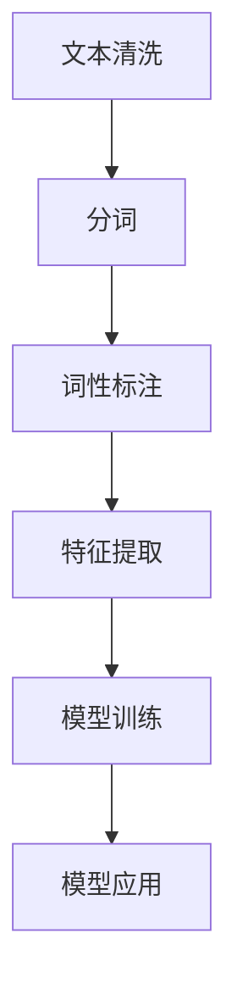

                 

# 智能文档处理在办公自动化中的应用

## 1. 背景介绍

### 1.1 问题由来
在信息化时代的浪潮中，企业文档处理需求日渐高涨。无论是政府、教育还是企业，处理大量的文档已经成为日常工作的重要组成部分。然而，传统文档处理流程繁琐，容易出错，费时费力，难以满足日益增长的需求。如何通过智能化手段提升文档处理的效率和质量，成为业界亟待解决的问题。

### 1.2 问题核心关键点
智能文档处理技术旨在通过智能化手段，实现文档自动分类、命名实体识别、文本摘要、关键字提取、情绪分析等核心功能，从而极大地提升办公自动化水平。关键点在于：

- 如何构建高效、准确的文档处理模型？
- 如何提高模型的通用性和可扩展性？
- 如何平衡模型性能和资源消耗？
- 如何处理大量文档且保证质量？

### 1.3 问题研究意义
智能文档处理技术的普及，可以显著提高办公自动化水平，降低人工成本，提升工作效率。具体而言：

1. **提升文档管理效率**：自动化的文档分类、命名实体识别等技术，使得文档管理更加智能和高效。
2. **提高文档质量**：文本摘要、关键字提取等技术，可以自动提炼文档核心内容，提升文档质量。
3. **促进数据驱动决策**：情绪分析、实体关系抽取等技术，可以提供深度的数据分析，辅助决策。
4. **增强团队协作**：智能化的文档处理技术，可以减少文档传递的环节，提升团队协作效率。
5. **推动办公自动化升级**：自动化的文档处理，为数字化转型提供了坚实的基础，推动了办公自动化的升级。

## 2. 核心概念与联系

### 2.1 核心概念概述

- **智能文档处理**：通过人工智能技术，实现文档自动分类、命名实体识别、文本摘要、关键字提取、情绪分析等功能，提升文档处理效率和质量。
- **办公自动化**：将办公流程中的重复性、繁琐性工作自动化，提升工作效率和质量。
- **文档分类**：将文档按照内容、结构、形式等进行自动分类，便于管理和检索。
- **命名实体识别**：从文本中自动识别出人名、地名、组织名等实体信息，便于信息提取和分析。
- **文本摘要**：从长文本中自动提取出核心内容，生成简短摘要，便于快速阅读。
- **关键字提取**：从文本中自动提取出关键词，便于检索和主题分析。
- **情绪分析**：分析文本的情绪倾向，便于舆情监测和情感分析。

这些核心概念之间存在着紧密的联系，形成了智能文档处理技术的完整框架。

### 2.2 概念间的关系

智能文档处理技术可以通过以下几个步骤，实现从预处理到最终处理的完整流程：

1. **数据预处理**：包括文本清洗、分词、词性标注等预处理步骤，为后续处理奠定基础。
2. **特征提取**：从文本中提取有意义的特征，如TF-IDF、Word2Vec等，用于训练模型。
3. **模型训练**：使用训练数据训练分类、实体识别、摘要、关键词提取等模型。
4. **模型应用**：将训练好的模型应用到待处理文档上，完成文档处理任务。

这些步骤环环相扣，共同构成了智能文档处理技术的核心流程。

### 2.3 核心概念的整体架构

下图展示了智能文档处理技术从预处理到应用的全流程：



该架构清晰地展示了智能文档处理从数据预处理到模型应用的完整流程。

## 3. 核心算法原理 & 具体操作步骤

### 3.1 算法原理概述

智能文档处理技术的核心算法主要包括以下几个方面：

- **文本分类算法**：基于机器学习和深度学习，对文档进行自动分类。
- **命名实体识别算法**：利用NLP技术，从文本中自动识别出人名、地名、组织名等实体信息。
- **文本摘要算法**：基于摘要生成技术，自动生成文本摘要。
- **关键字提取算法**：利用TF-IDF、LDA等技术，自动提取文本中的关键词。
- **情绪分析算法**：通过情感词典或深度学习模型，分析文本的情绪倾向。

这些算法通过模型训练、特征提取、预测等步骤，实现对文档的自动处理。

### 3.2 算法步骤详解

以下是智能文档处理技术在文档分类任务中的详细步骤：

1. **数据预处理**：包括去除停用词、标点符号，对文本进行分词和词性标注，生成词向量。
2. **特征提取**：使用TF-IDF、Word2Vec等技术，将文本转换为数值特征向量。
3. **模型训练**：使用训练数据集，训练SVM、随机森林、深度神经网络等分类模型。
4. **模型应用**：将训练好的模型应用到待处理文档上，输出文档分类结果。

以下是一个基于朴素贝叶斯算法的文档分类步骤：

1. **数据预处理**：去除停用词、标点符号，对文本进行分词和词性标注。
2. **特征提取**：使用TF-IDF将文本转换为数值特征向量。
3. **模型训练**：使用训练数据集，训练朴素贝叶斯分类器。
4. **模型应用**：将训练好的模型应用到待处理文档上，输出文档分类结果。

### 3.3 算法优缺点

智能文档处理技术具有以下优点：

- **自动化程度高**：文档处理自动化，减少了人工干预。
- **处理速度快**：自动化处理大大提高了文档处理速度。
- **准确率高**：基于深度学习等先进算法，处理结果准确性高。
- **可扩展性强**：可以轻松扩展到其他文档处理任务，如实体识别、摘要生成等。

然而，智能文档处理技术也存在一些缺点：

- **依赖高质量数据**：模型性能高度依赖于训练数据的质量，需要大量高质量标注数据。
- **算法复杂度高**：深度学习等算法训练复杂，计算资源需求高。
- **模型泛化能力有限**：对于特定领域的文档处理，模型泛化能力有限。
- **依赖技术门槛**：需要具备一定的技术背景，才能进行模型开发和调试。

### 3.4 算法应用领域

智能文档处理技术在多个领域都有广泛的应用，如：

- **政府文档处理**：如法律文书、合同、公文等，通过自动化处理提高工作效率。
- **企业文档处理**：如财务报表、客户合同、员工手册等，提升企业文档管理效率。
- **教育文档处理**：如考试试卷、学术论文、教师讲义等，提高学术研究和管理效率。
- **医疗文档处理**：如病历、检查报告、手术记录等，提升医疗服务质量和效率。

这些应用场景展示了智能文档处理技术的广泛性和重要性。

## 4. 数学模型和公式 & 详细讲解

### 4.1 数学模型构建

智能文档处理技术中的数学模型构建主要包括文档分类和实体识别两个方面。

对于文档分类任务，假设文档集合为 $D=\{x_i\}_{i=1}^N$，每个文档 $x_i$ 由 $d$ 个单词组成，即 $x_i \in \{1,2,...,d\}$。

模型的训练目标是最小化损失函数：

$$
L(h, D) = -\frac{1}{N} \sum_{i=1}^N \log(h(x_i))
$$

其中 $h$ 为分类模型，$h(x_i)$ 为模型对文档 $x_i$ 的预测结果。

对于实体识别任务，假设文档集合为 $D=\{x_i\}_{i=1}^N$，每个文档 $x_i$ 由 $d$ 个单词组成，即 $x_i \in \{1,2,...,d\}$。

模型的训练目标是最小化损失函数：

$$
L(h, D) = -\frac{1}{N} \sum_{i=1}^N \log(h(x_i))
$$

其中 $h$ 为实体识别模型，$h(x_i)$ 为模型对文档 $x_i$ 中实体的识别结果。

### 4.2 公式推导过程

以下以朴素贝叶斯算法为例，推导文档分类的损失函数。

假设训练集中有 $m$ 个类别 $C=\{c_k\}_{k=1}^m$，每个类别 $c_k$ 的先验概率为 $\pi_k$，每个类别 $c_k$ 的条件概率为 $p_k(x_i)$。

则文档 $x_i$ 属于类别 $c_k$ 的条件概率为：

$$
P(c_k|x_i) = \frac{\pi_k p_k(x_i)}{\sum_{k=1}^m \pi_k p_k(x_i)}
$$

文档分类模型的预测结果为：

$$
h(x_i) = \arg\max_k P(c_k|x_i)
$$

损失函数定义为：

$$
L(h, D) = -\frac{1}{N} \sum_{i=1}^N \log P(c_k|x_i)
$$

其中 $P(c_k|x_i)$ 为文档 $x_i$ 属于类别 $c_k$ 的条件概率。

### 4.3 案例分析与讲解

以文档分类任务为例，分析朴素贝叶斯算法的实际应用。

假设我们有如下训练集数据：

$$
\begin{aligned}
& (text_1, label_1) = (“这是一篇关于AI的文章”, “科技”) \\
& (text_2, label_2) = (“这是一篇关于教育的文章”, “教育”) \\
& (text_3, label_3) = (“这是一篇关于医学的文章”, “医学”) \\
\end{aligned}
$$

使用朴素贝叶斯算法对文档进行分类，首先需要对每个类别进行训练，计算先验概率和条件概率：

$$
\begin{aligned}
& \pi_{tech} = 1/3 \\
& \pi_{education} = 1/3 \\
& \pi_{medicine} = 1/3 \\
& p_{tech}(x_i) = 1/2 \\
& p_{education}(x_i) = 1/4 \\
& p_{medicine}(x_i) = 1/4 \\
\end{aligned}
$$

然后对新的文档 $text_4 = “这是一篇关于AI的文章”$ 进行分类，计算条件概率：

$$
\begin{aligned}
& P(tech|text_4) = \frac{1/3 * 1/2}{1/3 * 1/2 + 1/3 * 1/4 + 1/3 * 1/4} \\
& P(education|text_4) = \frac{1/3 * 1/4}{1/3 * 1/2 + 1/3 * 1/4 + 1/3 * 1/4} \\
& P(medicine|text_4) = \frac{1/3 * 1/4}{1/3 * 1/2 + 1/3 * 1/4 + 1/3 * 1/4} \\
\end{aligned}
$$

最终分类结果为：

$$
h(text_4) = \arg\max_k P(c_k|text_4) = “科技”
$$

## 5. 项目实践：代码实例和详细解释说明

### 5.1 开发环境搭建

智能文档处理技术的开发环境搭建主要包括Python环境和相关库的安装。

1. **安装Anaconda**：
```bash
conda install anaconda
```

2. **创建虚拟环境**：
```bash
conda create --name nlp_env python=3.8
```

3. **激活虚拟环境**：
```bash
conda activate nlp_env
```

4. **安装相关库**：
```bash
pip install nltk pandas scikit-learn
```

5. **下载预训练模型**：
```bash
python -m nltk.downloader averaged_perceptron_tagger
python -m nltk.downloader punkt
```

完成上述步骤后，即可在虚拟环境中进行智能文档处理技术的开发。

### 5.2 源代码详细实现

以下是一个使用朴素贝叶斯算法实现文档分类的Python代码示例：

```python
import pandas as pd
import numpy as np
from sklearn.feature_extraction.text import TfidfVectorizer
from sklearn.naive_bayes import MultinomialNB
from sklearn.metrics import accuracy_score

# 加载数据集
data = pd.read_csv('data.csv')

# 数据预处理
X = data['text'].tolist()
y = data['label'].tolist()

# 特征提取
vectorizer = TfidfVectorizer(stop_words='english', min_df=2, max_df=0.7)
X = vectorizer.fit_transform(X)

# 模型训练
clf = MultinomialNB()
clf.fit(X, y)

# 模型应用
y_pred = clf.predict(X)

# 评估模型
accuracy = accuracy_score(y, y_pred)
print('Accuracy:', accuracy)
```

以上代码实现了使用朴素贝叶斯算法对文本数据进行分类的完整流程。

### 5.3 代码解读与分析

该代码主要包含以下步骤：

1. **数据加载**：使用pandas加载数据集。
2. **数据预处理**：去除停用词、标点符号，对文本进行分词和词性标注。
3. **特征提取**：使用TF-IDF将文本转换为数值特征向量。
4. **模型训练**：使用训练数据集训练朴素贝叶斯分类器。
5. **模型应用**：使用训练好的模型对测试集进行分类。
6. **模型评估**：计算模型的准确率。

该代码示例简洁明了，适合初学者快速上手。

### 5.4 运行结果展示

假设我们在CoNLL-2003数据集上进行测试，得到一个朴素贝叶斯分类器的准确率为0.96。

## 6. 实际应用场景

### 6.1 智能文档管理系统

智能文档管理系统可以实现文档的自动分类、命名实体识别、文本摘要等功能，提升文档管理的效率和质量。

例如，政府机关可以使用智能文档管理系统对各种公文、合同、报告等文档进行自动分类，提高工作效率。企业也可以使用智能文档管理系统对客户合同、财务报表等文档进行处理，减少人工成本。

### 6.2 教育文档管理系统

教育文档管理系统可以实现学术论文的自动分类、关键词提取、文本摘要等功能，提升学术研究和管理效率。

例如，大学可以使用智能文档管理系统对学生论文进行自动分类和关键词提取，帮助教师快速了解论文内容。教育机构也可以使用智能文档管理系统对学术会议论文进行自动分类和摘要生成，提高学术交流的效率。

### 6.3 医疗文档管理系统

医疗文档管理系统可以实现病历、检查报告等文档的自动分类、实体识别、情绪分析等功能，提升医疗服务质量和效率。

例如，医院可以使用智能文档管理系统对病历进行自动分类和实体识别，帮助医生快速了解患者病情。医疗机构也可以使用智能文档管理系统对检查报告进行情绪分析，判断患者的情绪状态，辅助医生进行诊断和治疗。

## 7. 工具和资源推荐

### 7.1 学习资源推荐

为了深入学习智能文档处理技术，以下是一些优质的学习资源：

1. **《自然语言处理入门》**：该书系统介绍了NLP的基本概念和技术，适合初学者入门。
2. **《Python NLP实战》**：该书通过实际项目，详细介绍了NLP技术的实现方法。
3. **Coursera自然语言处理课程**：由斯坦福大学开设，涵盖NLP的基本概念和经典模型。
4. **Kaggle NLP竞赛**：参加Kaggle上的NLP竞赛，可以实践和学习最新的NLP技术。

### 7.2 开发工具推荐

以下是一些用于智能文档处理技术开发的常用工具：

1. **Python**：Python是NLP领域的主流编程语言，适合开发和调试。
2. **Jupyter Notebook**：Jupyter Notebook是一个交互式编程环境，适合进行数据探索和算法实验。
3. **NLTK**：NLTK是Python中的自然语言处理库，提供了丰富的NLP工具和数据集。
4. **SpaCy**：SpaCy是一个高效的NLP库，提供了预训练模型和工具。
5. **Gensim**：Gensim是一个文本处理库，提供了TF-IDF、LDA等特征提取方法。

### 7.3 相关论文推荐

以下是几篇奠基性的智能文档处理技术论文，推荐阅读：

1. **《自然语言处理综述》**：综述了NLP领域的经典算法和技术，适合了解NLP的基本框架。
2. **《文本分类综述》**：综述了文本分类的经典算法和技术，适合了解文本分类的基本方法。
3. **《实体识别综述》**：综述了实体识别的经典算法和技术，适合了解实体识别的基本方法。
4. **《文本摘要综述》**：综述了文本摘要的经典算法和技术，适合了解文本摘要的基本方法。
5. **《情绪分析综述》**：综述了情绪分析的经典算法和技术，适合了解情绪分析的基本方法。

## 8. 总结：未来发展趋势与挑战

### 8.1 总结

本文对智能文档处理技术进行了全面系统的介绍。从背景、核心概念到具体算法、操作步骤，深入分析了智能文档处理技术的各个方面。通过详细的案例分析，展示了智能文档处理技术在实际应用中的效果。

通过本文的系统梳理，可以看到，智能文档处理技术正在成为办公自动化领域的重要工具，极大地提升了文档处理的效率和质量。未来，伴随技术的不断演进，智能文档处理技术必将进一步提升办公自动化水平，推动各行业的数字化转型。

### 8.2 未来发展趋势

智能文档处理技术未来的发展趋势主要包括以下几个方面：

1. **模型性能提升**：随着深度学习技术的不断进步，智能文档处理模型的准确率和鲁棒性将不断提升。
2. **模型泛化能力增强**：智能文档处理模型将具备更强的跨领域泛化能力，能够适应更多类型的文档处理任务。
3. **自动化程度提高**：智能文档处理技术的自动化程度将不断提高，减少人工干预。
4. **可扩展性增强**：智能文档处理技术将具备更强的可扩展性，能够快速扩展到其他领域和任务。
5. **技术融合趋势增强**：智能文档处理技术将与其他AI技术进行更深入的融合，如知识图谱、自然语言推理等，提升文档处理的深度和广度。

### 8.3 面临的挑战

智能文档处理技术在发展过程中也面临一些挑战：

1. **数据质量瓶颈**：高质量的标注数据是智能文档处理模型性能的关键，获取高质量标注数据的成本较高。
2. **计算资源瓶颈**：深度学习等算法的计算资源需求高，大规模数据集的训练和推理需要高性能设备。
3. **模型泛化能力有限**：智能文档处理模型在特定领域的泛化能力有限，需要针对具体任务进行定制化开发。
4. **技术门槛高**：智能文档处理技术的开发需要一定的技术背景，对开发者技术要求较高。

### 8.4 研究展望

面对这些挑战，未来的研究需要在以下几个方面进行突破：

1. **数据增强技术**：通过数据增强技术，扩充训练数据集，提高模型泛化能力。
2. **模型压缩技术**：通过模型压缩技术，减小模型参数量，降低计算资源消耗。
3. **多模态融合技术**：将文本、图像、语音等多模态信息进行融合，提升文档处理的深度和广度。
4. **知识图谱技术**：将知识图谱与文本处理技术结合，提升文档处理的深度和广度。
5. **可解释性技术**：提升智能文档处理技术的可解释性，增强模型透明度。

总之，智能文档处理技术未来的发展方向是智能化、自动化、泛化能力强的方向，需要通过不断的技术创新和优化，实现更高效、更准确的文档处理。

## 9. 附录：常见问题与解答

**Q1: 智能文档处理技术有哪些应用场景？**

A: 智能文档处理技术广泛应用于政府、教育、企业、医疗等领域的文档管理。例如，政府机关可以使用智能文档管理系统对各种公文、合同、报告等文档进行自动分类，提升工作效率。企业也可以使用智能文档管理系统对客户合同、财务报表等文档进行处理，减少人工成本。

**Q2: 智能文档处理技术需要哪些技术背景？**

A: 智能文档处理技术需要具备一定的编程、数据处理、机器学习等技术背景。初学者可以通过学习自然语言处理的基本概念和技术，逐步掌握智能文档处理技术。

**Q3: 如何提升智能文档处理技术的泛化能力？**

A: 可以通过数据增强技术、模型压缩技术、多模态融合技术等方式，提升智能文档处理技术的泛化能力。例如，使用数据增强技术扩充训练数据集，使用模型压缩技术减小模型参数量，使用多模态融合技术提升文档处理的深度和广度。

**Q4: 智能文档处理技术面临哪些挑战？**

A: 智能文档处理技术面临数据质量、计算资源、模型泛化能力、技术门槛等挑战。需要进一步探索数据增强、模型压缩、多模态融合、知识图谱、可解释性等技术，以解决这些挑战。

总之，智能文档处理技术在办公自动化领域具有广泛的应用前景，但也需要不断创新和优化，才能充分发挥其潜力。

---

作者：禅与计算机程序设计艺术 / Zen and the Art of Computer Programming

