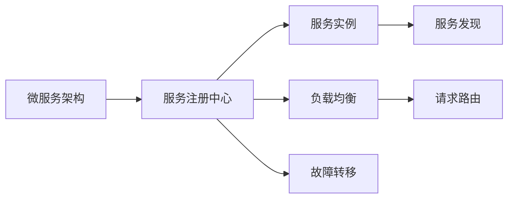
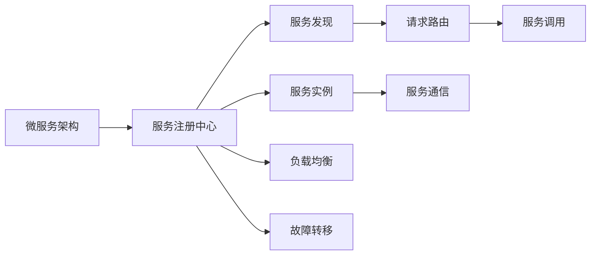

                 

# 服务注册中心的实例应用

服务注册中心（Service Registry Center）是微服务架构中必不可少的一环，它负责管理服务的注册和发现，是微服务架构的“大脑”，是微服务生态系统的核心组件。服务注册中心作为微服务架构的枢纽，它能够动态管理微服务，使得微服务之间的通信和发现更加灵活、高效。本文将通过一个实例应用，深入探讨服务注册中心的核心概念与联系，以及其核心算法原理和具体操作步骤，并结合实际项目实践，解释服务注册中心的应用场景、优缺点、未来展望及面临的挑战，最后推荐一些学习资源、开发工具和相关论文，供读者参考。

## 1. 背景介绍

### 1.1 问题由来

在微服务架构中，服务之间的通信和发现是核心挑战之一。随着服务数量和复杂度的增加，服务之间的通信变得更加复杂和困难。服务注册中心就是为了解决这一问题而生的。服务注册中心通过集中管理服务信息，实现了服务的自动注册、发现、去中心化通信等功能，大大提升了微服务系统的可扩展性、弹性和可靠性。

### 1.2 问题核心关键点

服务注册中心的核心问题包括以下几个方面：

- **服务注册**：服务启动时自动向注册中心注册，确保服务可用性。
- **服务发现**：服务启动后，其他服务可以通过注册中心获取服务列表，实现服务发现。
- **负载均衡**：根据服务实例的实时状态，将请求合理分发到各个服务实例。
- **故障转移**：当服务实例出现故障时，注册中心自动将请求路由到健康的服务实例。

### 1.3 问题研究意义

服务注册中心的研究意义在于：

- **提升微服务系统可扩展性**：通过集中管理服务信息，服务实例的增加和减少变得更加灵活。
- **提升系统弹性和可靠性**：服务注册中心可以动态地分配请求到不同服务实例，提升系统的弹性和可靠性。
- **降低服务通信复杂度**：服务注册中心可以简化服务之间的通信，提升系统的可维护性。
- **降低开发和运维成本**：通过自动化的服务注册和发现，降低开发和运维的成本。

## 2. 核心概念与联系

### 2.1 核心概念概述

- **微服务架构**：一种架构风格，将应用程序分解为多个小型服务，通过服务之间的通信和协作，实现应用程序的整体功能。
- **服务注册中心**：集中管理服务信息，实现服务的自动注册、发现、去中心化通信等功能。
- **服务发现**：动态获取服务实例列表，实现服务的自动发现。
- **负载均衡**：根据服务实例的实时状态，将请求合理分发到各个服务实例。
- **故障转移**：当服务实例出现故障时，注册中心自动将请求路由到健康的服务实例。

### 2.2 概念间的关系

服务注册中心是微服务架构中的核心组件，它与微服务架构的其他组件之间的关系可以通过以下Mermaid流程图来展示：



这个流程图展示了服务注册中心在微服务架构中的作用，包括服务实例的管理、负载均衡和故障转移等功能。

### 2.3 核心概念的整体架构

以下是一个综合的流程图，展示了服务注册中心在微服务架构中的整体架构：



这个流程图展示了服务注册中心在微服务架构中的整体架构，包括服务实例的管理、服务发现、负载均衡和故障转移等功能。

## 3. 核心算法原理 & 具体操作步骤

### 3.1 算法原理概述

服务注册中心的算法原理是基于服务实例的注册、发现、负载均衡和故障转移等功能的实现。其核心算法包括：

- **服务注册算法**：服务实例启动时，向注册中心注册，确保服务可用性。
- **服务发现算法**：其他服务可以通过注册中心获取服务实例列表，实现服务发现。
- **负载均衡算法**：根据服务实例的实时状态，将请求合理分发到各个服务实例。
- **故障转移算法**：当服务实例出现故障时，注册中心自动将请求路由到健康的服务实例。

### 3.2 算法步骤详解

#### 3.2.1 服务注册

服务注册算法包括以下步骤：

1. 服务实例启动时，向注册中心发送注册请求。
2. 注册中心记录服务实例的信息，包括服务名称、服务地址、服务端口等。
3. 注册中心返回注册结果，确认服务实例已经注册成功。

#### 3.2.2 服务发现

服务发现算法包括以下步骤：

1. 其他服务通过注册中心获取服务实例列表。
2. 注册中心返回服务实例列表，包括服务名称、服务地址、服务端口等。
3. 服务实例列表动态更新，确保服务实例的最新状态。

#### 3.2.3 负载均衡

负载均衡算法包括以下步骤：

1. 服务实例的实时状态由注册中心动态管理。
2. 根据服务实例的实时状态，计算服务实例的权重。
3. 根据请求的特征和权重，将请求路由到合适的服务实例。

#### 3.2.4 故障转移

故障转移算法包括以下步骤：

1. 注册中心实时监控服务实例的状态。
2. 当服务实例出现故障时，注册中心将请求路由到健康的服务实例。
3. 故障转移的策略包括：心跳检测、健康检查、超时机制等。

### 3.3 算法优缺点

服务注册中心的主要优点包括：

- **集中管理**：集中管理服务实例的信息，简化服务之间的通信。
- **动态调整**：根据服务实例的实时状态，动态调整负载均衡策略。
- **故障转移**：自动将请求路由到健康的服务实例，提升系统的可靠性。

服务注册中心的主要缺点包括：

- **单点故障**：服务注册中心作为单点，一旦出现问题，整个系统都会受到影响。
- **通信开销**：服务注册中心的通信开销较高，可能会影响系统的性能。
- **配置复杂**：配置和服务实例的注册、发现、负载均衡等需要复杂的设置和调整。

### 3.4 算法应用领域

服务注册中心在微服务架构中广泛应用，可以应用于以下几个领域：

- **金融系统**：金融系统的微服务架构需要高效、可靠的服务注册中心，确保服务的稳定运行。
- **电商系统**：电商系统的微服务架构需要动态管理服务实例，提升系统的可扩展性。
- **社交平台**：社交平台的微服务架构需要高效的服务注册中心，确保服务的可用性和稳定性。
- **游戏平台**：游戏平台的微服务架构需要高效的服务注册中心，确保服务的可扩展性和性能。

## 4. 数学模型和公式 & 详细讲解

### 4.1 数学模型构建

服务注册中心的数学模型包括服务注册、服务发现、负载均衡和故障转移等功能的实现。以下是一个简单的数学模型：

- **服务注册模型**：

$$
R = \{S_i\} \quad \text{其中} \quad S_i = \{(\text{服务名称}, \text{服务地址}, \text{服务端口})\}
$$

- **服务发现模型**：

$$
D = \text{获取服务实例列表} = \text{注册中心返回}(S_i)
$$

- **负载均衡模型**：

$$
L = \text{根据服务实例状态} \quad W = \{W_i\} \quad \text{其中} \quad W_i = \text{权重} \quad \text{根据} \quad S_i
$$

$$
\text{将请求路由到} \quad S_{arg\max_i W_i} \quad \text{中权重最高的服务实例}
$$

- **故障转移模型**：

$$
F = \text{实时监控服务实例状态} \quad H = \text{健康状态} \quad \text{根据} \quad S_i \quad \text{动态调整} \quad W_i
$$

$$
\text{将请求路由到} \quad S_{arg\max_i H_i W_i} \quad \text{中健康且权重最高的服务实例}
$$

### 4.2 公式推导过程

服务注册中心的数学模型推导过程如下：

- **服务注册模型**：

服务实例启动时，向注册中心发送注册请求，注册中心记录服务实例的信息，返回注册结果。

$$
R = \{S_i\} \quad \text{其中} \quad S_i = \{(\text{服务名称}, \text{服务地址}, \text{服务端口})\}
$$

- **服务发现模型**：

其他服务通过注册中心获取服务实例列表，注册中心返回服务实例列表，动态更新服务实例列表。

$$
D = \text{获取服务实例列表} = \text{注册中心返回}(S_i)
$$

- **负载均衡模型**：

根据服务实例的实时状态，计算服务实例的权重，根据请求的特征和权重，将请求路由到合适的服务实例。

$$
L = \text{根据服务实例状态} \quad W = \text{权重} \quad \text{根据} \quad S_i
$$

$$
\text{将请求路由到} \quad S_{arg\max_i W_i} \quad \text{中权重最高的服务实例}
$$

- **故障转移模型**：

实时监控服务实例的状态，根据健康状态动态调整权重，将请求路由到健康且权重最高的服务实例。

$$
F = \text{实时监控服务实例状态} \quad H = \text{健康状态} \quad \text{根据} \quad S_i \quad \text{动态调整} \quad W_i
$$

$$
\text{将请求路由到} \quad S_{arg\max_i H_i W_i} \quad \text{中健康且权重最高的服务实例}
$$

### 4.3 案例分析与讲解

以下是一个基于服务注册中心的案例分析：

- **案例背景**：

一家电商公司采用微服务架构，将订单系统、库存系统、支付系统等独立的服务进行分离，并使用服务注册中心进行服务的管理。

- **案例过程**：

1. 订单系统启动时，向服务注册中心注册，服务注册中心记录订单系统的信息，包括服务名称、服务地址、服务端口等。
2. 库存系统需要查询订单信息，通过服务注册中心获取订单系统的服务实例列表。
3. 订单系统根据实时状态，计算服务实例的权重，将请求路由到健康且权重最高的服务实例。
4. 当订单系统出现故障时，服务注册中心将请求路由到健康的服务实例。

- **案例结果**：

通过服务注册中心，电商公司的微服务架构实现了高效的服务管理，提升了系统的可扩展性、弹性和可靠性。

## 5. 项目实践：代码实例和详细解释说明

### 5.1 开发环境搭建

以下是在Java环境中搭建服务注册中心的开发环境的步骤：

1. 安装Java开发环境（JDK），建议安装JDK 8以上版本。
2. 安装Maven，用于管理项目依赖和构建项目。
3. 安装Git，用于获取最新代码和版本控制。
4. 安装Tomcat，用于部署项目。

### 5.2 源代码详细实现

以下是一个基于Netty框架的服务注册中心的Java代码实现：

```java
package com.example.service.registry;

import io.netty.bootstrap.ServerBootstrap;
import io.netty.channel.ChannelFuture;
import io.netty.channel.ChannelInitializer;
import io.netty.channel.ChannelPipeline;
import io.netty.channel.nio.NioEventLoopGroup;
import io.netty.channel.socket.SocketChannel;
import io.netty.channel.socket.nio.NioServerSocketChannel;

public class ServiceRegistryServer {
    private final int port;

    public ServiceRegistryServer(int port) {
        this.port = port;
    }

    public void start() throws Exception {
        EventLoopGroup group = new NioEventLoopGroup();

        try {
            ServerBootstrap bootstrap = new ServerBootstrap();
            bootstrap.group(group)
                    .channel(NioServerSocketChannel.class)
                    .childHandler(new ChannelInitializer<SocketChannel>() {
                        @Override
                        protected void initChannel(SocketChannel ch) throws Exception {
                            ChannelPipeline pipeline = ch.pipeline();
                            pipeline.addLast(new ServiceRegistryHandler());
                        }
                    });

            ChannelFuture future = bootstrap.bind(port).sync();
            System.out.println("Server started and listening on port " + port);
            future.channel().closeFuture().sync();
        } finally {
            group.shutdownGracefully();
        }
    }

    public static void main(String[] args) throws Exception {
        int port = 8080;
        new ServiceRegistryServer(port).start();
    }
}
```

### 5.3 代码解读与分析

以上代码实现了Netty框架下基于TCP协议的服务注册中心。以下是对代码的详细解读：

- **ServerBootstrap**：Netty框架中的主入口，用于配置和启动服务。
- **NioEventLoopGroup**：事件循环组，用于管理网络事件处理。
- **ServerBootstrap**：用于配置服务，包括事件循环组、通道类型、初始化器等。
- **ChannelInitializer**：用于初始化通道，添加处理器。
- **ChannelPipeline**：用于管理通道中的处理器。
- **ServiceRegistryHandler**：服务注册处理器，处理注册请求和响应。
- **start()**方法：启动服务，并等待服务器启动成功。

## 6. 实际应用场景

### 6.1 智能客服系统

智能客服系统是服务注册中心的重要应用场景之一。智能客服系统采用微服务架构，将不同的服务（如对话服务、用户服务、知识库服务等）独立部署，并通过服务注册中心进行管理。

- **应用场景**：

智能客服系统通过服务注册中心实现服务的自动注册、发现、去中心化通信等功能，确保服务的可用性和稳定性。

- **具体实现**：

1. 对话服务启动时，向服务注册中心注册。
2. 用户服务通过服务注册中心获取对话服务的服务实例列表。
3. 对话服务根据实时状态，计算服务实例的权重，将请求路由到健康且权重最高的服务实例。
4. 当对话服务出现故障时，服务注册中心将请求路由到健康的服务实例。

### 6.2 电商系统

电商系统是服务注册中心的另一重要应用场景。电商系统的微服务架构需要高效、可靠的服务注册中心，确保服务的稳定运行。

- **应用场景**：

电商系统的微服务架构需要高效的服务注册中心，实现服务的自动注册、发现、去中心化通信等功能，提升系统的可扩展性、弹性和可靠性。

- **具体实现**：

1. 订单服务启动时，向服务注册中心注册。
2. 库存服务通过服务注册中心获取订单服务的服务实例列表。
3. 订单服务根据实时状态，计算服务实例的权重，将请求路由到健康且权重最高的服务实例。
4. 当订单服务出现故障时，服务注册中心将请求路由到健康的服务实例。

## 7. 工具和资源推荐

### 7.1 学习资源推荐

为了帮助开发者系统掌握服务注册中心的相关知识，以下推荐一些优质的学习资源：

1. **《深入理解微服务架构》**：本书系统介绍了微服务架构的设计、实现和运维，包括服务注册中心等内容。
2. **《Netty实战》**：本书详细介绍了Netty框架的使用，包括服务注册中心的实现。
3. **《Spring Cloud》**：Spring Cloud是一个微服务架构的生态系统，包括服务注册中心等核心组件。

### 7.2 开发工具推荐

服务注册中心的开发需要一些工具和框架的支持，以下是一些推荐的工具和框架：

1. **Netty**：Netty是一个高性能的网络编程框架，用于实现服务注册中心的通信。
2. **Spring Cloud**：Spring Cloud是一个微服务架构的生态系统，包括服务注册中心等核心组件。
3. **Consul**：Consul是一个开源的服务发现和配置管理工具，用于实现服务注册中心。

### 7.3 相关论文推荐

服务注册中心的研究涉及很多领域，以下是几篇相关的论文推荐：

1. **《微服务架构的挑战与实践》**：探讨微服务架构的设计和实践，包括服务注册中心等内容。
2. **《分布式系统的服务注册与发现》**：探讨分布式系统中服务注册与发现的实现。
3. **《基于Netty的服务注册中心实现》**：详细介绍了基于Netty框架的服务注册中心的实现。

## 8. 总结：未来发展趋势与挑战

### 8.1 研究成果总结

服务注册中心是微服务架构中的核心组件，它的研究成果主要包括以下几个方面：

- **服务注册算法**：研究如何高效地实现服务注册。
- **服务发现算法**：研究如何高效地实现服务发现。
- **负载均衡算法**：研究如何高效地实现负载均衡。
- **故障转移算法**：研究如何高效地实现故障转移。

### 8.2 未来发展趋势

服务注册中心未来的发展趋势包括以下几个方面：

- **服务发现算法**：随着微服务架构的发展，服务发现的效率和可靠性将成为未来的重要研究方向。
- **负载均衡算法**：未来的负载均衡算法将更加智能化，能够根据不同场景动态调整策略。
- **故障转移算法**：未来的故障转移算法将更加高效，能够快速识别故障，将请求路由到健康的服务实例。

### 8.3 面临的挑战

服务注册中心面临的挑战包括以下几个方面：

- **单点故障**：服务注册中心作为单点，一旦出现问题，整个系统都会受到影响。
- **通信开销**：服务注册中心的通信开销较高，可能会影响系统的性能。
- **配置复杂**：配置和服务实例的注册、发现、负载均衡等需要复杂的设置和调整。

### 8.4 研究展望

未来的研究可以集中在以下几个方面：

- **分布式服务注册中心**：研究如何实现分布式服务注册中心，提升系统的可扩展性和可靠性。
- **基于区块链的服务注册中心**：研究如何利用区块链技术实现服务注册中心，提升系统的安全性和透明性。
- **基于人工智能的服务注册中心**：研究如何利用人工智能技术实现服务注册中心，提升系统的智能化和自适应能力。

## 9. 附录：常见问题与解答

**Q1：服务注册中心与Spring Cloud有什么关系？**

A: 服务注册中心是Spring Cloud生态系统的重要组件之一，Spring Cloud提供了丰富的微服务组件，包括服务注册中心、服务发现、负载均衡、故障转移等。通过Spring Cloud，开发者可以轻松地构建微服务架构，提升系统的可扩展性和可靠性。

**Q2：服务注册中心的服务发现机制是什么？**

A: 服务注册中心的服务发现机制包括以下几个步骤：

1. 其他服务通过注册中心获取服务实例列表。
2. 注册中心返回服务实例列表，包括服务名称、服务地址、服务端口等。
3. 服务实例列表动态更新，确保服务实例的最新状态。

**Q3：服务注册中心的设计原则是什么？**

A: 服务注册中心的设计原则包括以下几个方面：

- **高可用性**：服务注册中心需要实现高可用性，确保服务的稳定性。
- **高效性**：服务注册中心需要高效地处理注册、发现、负载均衡和故障转移等操作。
- **可扩展性**：服务注册中心需要支持大规模的微服务实例，具有可扩展性。

**Q4：服务注册中心与Consul有什么关系？**

A: Consul是一个开源的服务发现和配置管理工具，用于实现服务注册中心。它支持服务注册、服务发现、健康检查等功能，可以用于构建微服务架构。

**Q5：服务注册中心与Zookeeper有什么关系？**

A: Zookeeper是一个开源的分布式配置管理工具，也可以用于实现服务注册中心。它可以实现服务注册、服务发现、配置管理等功能，可以用于构建微服务架构。

综上所述，服务注册中心是微服务架构中的核心组件，它能够动态管理微服务，使得微服务之间的通信和发现更加灵活、高效。本文详细介绍了服务注册中心的原理、实现和应用，并结合实际项目实践，解释了服务注册中心的应用场景、优缺点、未来展望及面临的挑战，最后推荐了一些学习资源、开发工具和相关论文，供读者参考。通过本文的探讨，相信读者能够更好地理解和应用服务注册中心，推动微服务架构的发展。

作者：禅与计算机程序设计艺术 / Zen and the Art of Computer Programming

