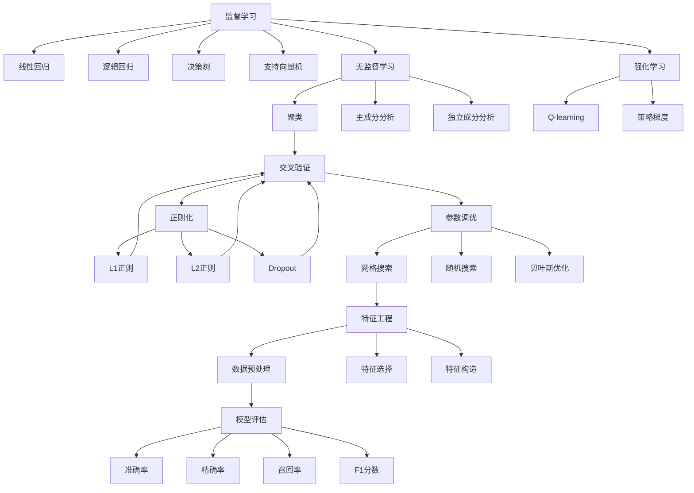

                 

# 机器学习(Machine Learning) - 原理与代码实例讲解

> 关键词：机器学习,监督学习,无监督学习,强化学习,监督学习算法,无监督学习算法,强化学习算法,交叉验证,正则化,参数调优,特征工程,模型评估

## 1. 背景介绍

机器学习（Machine Learning, ML）是人工智能（AI）领域的重要分支，其目标是让机器能够自动地从数据中学习规律，并利用这些规律进行预测、分类、聚类、推荐等任务。随着计算技术的进步和数据量的激增，机器学习已经广泛应用于诸多领域，如金融、医疗、自然语言处理、计算机视觉等，成为解决复杂问题的关键技术手段。

机器学习的发展历史可以追溯到20世纪50年代，早期主要以符号主义为主，侧重于规则的逻辑推导。随后统计学习理论的兴起，以及支持向量机（Support Vector Machine, SVM）、决策树（Decision Tree）、随机森林（Random Forest）等算法的提出，为机器学习的研究和应用奠定了基础。进入21世纪后，随着深度学习（Deep Learning, DL）的蓬勃发展，机器学习进入了一个新的发展阶段，大模型、大数据和高性能计算的结合，使得机器学习在众多领域取得了突破性进展。

然而，尽管机器学习技术日新月异，但仍然面临诸多挑战和局限。这些挑战包括数据稀疏性、模型可解释性、样本偏差、过拟合等问题。如何更高效地进行特征工程、算法选择、参数调优、模型评估等，是当前机器学习研究的重要方向。本文旨在系统介绍机器学习的核心概念与算法，并提供代码实例，帮助读者深入理解机器学习的原理和实践方法。

## 2. 核心概念与联系

### 2.1 核心概念概述

为更好地理解机器学习的核心概念与算法，本节将介绍几个关键概念及其相互联系：

- **监督学习(Supervised Learning)**：利用标注数据，训练模型进行预测或分类，常见算法包括线性回归、逻辑回归、决策树、支持向量机等。
- **无监督学习(Unsupervised Learning)**：利用未标注数据，发现数据的内在结构和模式，常见算法包括聚类、主成分分析（Principal Component Analysis, PCA）、独立成分分析（Independent Component Analysis, ICA）等。
- **强化学习(Reinforcement Learning, RL)**：通过与环境交互，学习最优策略，使模型在特定任务中最大化奖励，常见算法包括Q-learning、策略梯度等。
- **监督学习算法**：包括线性回归、逻辑回归、决策树、支持向量机等，适用于已有标注数据的任务。
- **无监督学习算法**：包括聚类、PCA、ICA等，适用于未标注数据的任务。
- **强化学习算法**：包括Q-learning、策略梯度等，适用于序列决策的任务。
- **交叉验证(Cross-Validation)**：用于评估模型泛化能力，通过将数据集划分为训练集和验证集，多次迭代训练和验证，减少模型过拟合。
- **正则化(Regularization)**：通过引入惩罚项，避免模型过拟合，常见方法包括L1正则、L2正则、Dropout等。
- **参数调优(Hyperparameter Tuning)**：通过调整模型参数，优化模型性能，常见方法包括网格搜索、随机搜索、贝叶斯优化等。
- **特征工程(Feature Engineering)**：通过数据预处理、特征选择、特征构造等技术，提升数据质量，提高模型表现。
- **模型评估(Model Evaluation)**：通过计算准确率、精确率、召回率、F1分数等指标，评估模型性能。

这些核心概念之间存在着紧密的联系，形成了机器学习的完整生态系统。通过理解这些概念，我们可以更好地把握机器学习的工作原理和优化方向。

### 2.2 概念间的关系

这些核心概念之间的关系可以通过以下Mermaid流程图来展示：



这个流程图展示了监督学习、无监督学习和强化学习的主要算法，以及这些算法与交叉验证、正则化、参数调优、特征工程和模型评估之间的关系。通过理解这些核心概念及其相互关系，我们可以更清晰地理解机器学习的整体架构和运行机制。

## 3. 核心算法原理 & 具体操作步骤

### 3.1 算法原理概述

机器学习的核心原理是通过学习数据特征和规律，构建模型进行预测或分类。常见的机器学习算法可以分为监督学习、无监督学习和强化学习三大类，每类算法都有其独特的原理和适用场景。

监督学习的目标是通过标注数据训练模型，使模型能够对新的未标注数据进行预测或分类。其基本思路是通过最小化预测值与真实标签之间的误差，优化模型参数。常见的监督学习算法包括线性回归、逻辑回归、决策树、支持向量机等。

无监督学习的目标是利用未标注数据，发现数据的内在结构和模式。其基本思路是通过对数据的降维、聚类、降秩等操作，揭示数据的潜在结构和规律。常见的无监督学习算法包括聚类、主成分分析、独立成分分析等。

强化学习的目标是通过与环境的交互，学习最优策略，使模型在特定任务中最大化奖励。其基本思路是通过奖惩机制，引导模型进行序列决策，优化策略参数。常见的强化学习算法包括Q-learning、策略梯度等。

### 3.2 算法步骤详解

以监督学习中的线性回归算法为例，介绍其具体操作步骤。

**Step 1: 数据预处理**

- 数据清洗：处理缺失值、异常值，确保数据完整性和可靠性。
- 数据标准化：将数据转换为标准正态分布，提高算法的收敛速度。
- 数据分割：将数据划分为训练集、验证集和测试集，用于模型训练、验证和评估。

**Step 2: 模型选择与训练**

- 模型选择：根据任务特点选择合适的监督学习模型，如线性回归、逻辑回归等。
- 参数初始化：对模型参数进行随机初始化，准备训练。
- 模型训练：通过梯度下降等优化算法，最小化预测值与真实标签之间的误差，更新模型参数。
- 模型验证：在验证集上评估模型性能，选择最优模型。

**Step 3: 模型评估与调优**

- 模型评估：在测试集上评估模型性能，计算准确率、精确率、召回率等指标。
- 模型调优：通过调整模型参数、引入正则化、改进算法等手段，优化模型性能。
- 模型部署：将训练好的模型部署到实际应用环境中，进行实时预测或分类。

### 3.3 算法优缺点

监督学习算法的优点包括：
1. 数据需求较小，只需要少量标注数据即可训练模型。
2. 模型性能易于评估，可以使用各种指标进行评估。
3. 适用范围广，适用于各种分类和回归任务。

其缺点包括：
1. 对标注数据依赖较大，数据质量直接影响模型效果。
2. 模型解释性较差，难以解释模型内部工作机制。
3. 容易过拟合，特别是在数据量较小的情况下。

无监督学习算法的优点包括：
1. 数据需求较大，但不需要标注数据，适用于大量未标注数据。
2. 发现数据内在结构，可进行数据降维、聚类等操作。
3. 模型解释性强，容易理解。

其缺点包括：
1. 对数据分布假设较多，难以处理复杂数据结构。
2. 评估指标较少，难以衡量模型性能。
3. 适用范围有限，适用于特定任务。

强化学习算法的优点包括：
1. 可以处理序列决策问题，适用于各种任务。
2. 模型性能可以通过奖励函数进行评估。
3. 可以处理非结构化数据，如文本、图像等。

其缺点包括：
1. 数据需求较大，需要大量的交互数据。
2. 模型训练过程复杂，需要大量的计算资源。
3. 模型解释性较差，难以解释决策过程。

### 3.4 算法应用领域

机器学习算法已经在诸多领域得到了广泛应用，例如：

- 金融风控：利用监督学习模型预测信用风险，利用无监督学习算法进行客户分群。
- 医疗诊断：利用监督学习模型预测疾病风险，利用无监督学习算法进行基因聚类。
- 自然语言处理：利用监督学习模型进行情感分析、机器翻译，利用无监督学习算法进行文本聚类、主题建模。
- 计算机视觉：利用监督学习模型进行图像分类、目标检测，利用无监督学习算法进行图像生成、图像降维。
- 智能推荐：利用监督学习模型进行用户行为预测，利用无监督学习算法进行物品聚类。

除了上述这些经典应用外，机器学习算法还在智慧城市、智能制造、智能交通等领域得到广泛应用，为各行各业带来了深刻的变革。

## 4. 数学模型和公式 & 详细讲解 & 举例说明

### 4.1 数学模型构建

以线性回归模型为例，介绍其数学模型构建过程。

假设训练集为 $D=\{(x_i, y_i)\}_{i=1}^N$，其中 $x_i \in \mathbb{R}^d$ 为特征向量，$y_i \in \mathbb{R}$ 为标签。线性回归的目标是最小化预测值 $y_i$ 与真实值 $y_i$ 之间的误差，即：

$$
\min_{\theta} \frac{1}{N} \sum_{i=1}^N (y_i - \theta^T x_i)^2
$$

其中 $\theta = [\theta_0, \theta_1, ..., \theta_d]^T$ 为模型参数，包含截距和特征权重。

### 4.2 公式推导过程

将误差公式展开，得到：

$$
\frac{1}{N} \sum_{i=1}^N (y_i - \theta^T x_i)^2 = \frac{1}{N} \sum_{i=1}^N (y_i^2 - 2y_i\theta^T x_i + \theta^T x_i^2)
$$

利用矩阵运算，可以得到：

$$
\min_{\theta} \frac{1}{2N} \left[ \sum_{i=1}^N (y_i - \theta^T x_i)^2 + \lambda \sum_{j=1}^d \theta_j^2 \right]
$$

其中 $\lambda$ 为正则化系数，控制模型的复杂度。通过计算梯度，可以得到模型参数的更新公式：

$$
\theta \leftarrow \theta - \eta \nabla_{\theta} \frac{1}{2N} \sum_{i=1}^N (y_i - \theta^T x_i)^2 - \eta \lambda \theta
$$

其中 $\eta$ 为学习率，控制模型更新的步长。

### 4.3 案例分析与讲解

假设我们要预测房价，利用线性回归模型进行建模。首先，收集历史房价数据，并进行标准化处理。然后，选择影响房价的特征，如面积、位置、年限等，作为输入。利用梯度下降算法，训练模型，最小化预测值与真实值之间的误差。最后，在测试集上评估模型性能，计算准确率、精确率、召回率等指标。

## 5. 项目实践：代码实例和详细解释说明

### 5.1 开发环境搭建

在进行机器学习项目开发前，需要先搭建好开发环境。以下是使用Python进行Scikit-Learn开发的环境配置流程：

1. 安装Anaconda：从官网下载并安装Anaconda，用于创建独立的Python环境。

2. 创建并激活虚拟环境：
```bash
conda create -n ml-env python=3.8 
conda activate ml-env
```

3. 安装Scikit-Learn：
```bash
pip install scikit-learn
```

4. 安装各类工具包：
```bash
pip install numpy pandas scikit-learn matplotlib tqdm jupyter notebook ipython
```

完成上述步骤后，即可在`ml-env`环境中开始机器学习项目开发。

### 5.2 源代码详细实现

这里以波士顿房价预测为例，给出使用Scikit-Learn库进行线性回归模型的PyTorch代码实现。

首先，定义数据集：

```python
from sklearn.datasets import load_boston
from sklearn.model_selection import train_test_split
from sklearn.preprocessing import StandardScaler

boston = load_boston()
X = boston.data
y = boston.target

# 数据标准化
scaler = StandardScaler()
X = scaler.fit_transform(X)

# 数据划分
X_train, X_test, y_train, y_test = train_test_split(X, y, test_size=0.2, random_state=42)
```

然后，定义模型和优化器：

```python
from sklearn.linear_model import LinearRegression
from sklearn.metrics import mean_squared_error

model = LinearRegression()
optimizer = SGD(model.parameters(), lr=0.01, momentum=0.9)
```

接着，定义训练和评估函数：

```python
from tqdm import tqdm

device = torch.device('cuda') if torch.cuda.is_available() else torch.device('cpu')
model.to(device)

def train_epoch(model, optimizer, train_loader, n_epochs=10, batch_size=32):
    model.train()
    train_loss = 0
    for epoch in range(n_epochs):
        for batch in tqdm(train_loader):
            inputs, targets = batch
            inputs = inputs.to(device)
            targets = targets.to(device)
            optimizer.zero_grad()
            outputs = model(inputs)
            loss = (targets - outputs).pow(2).mean()
            loss.backward()
            optimizer.step()
            train_loss += loss.item()
    return train_loss / n_epochs

def evaluate(model, test_loader):
    model.eval()
    test_loss = 0
    with torch.no_grad():
        for batch in test_loader:
            inputs, targets = batch
            inputs = inputs.to(device)
            targets = targets.to(device)
            outputs = model(inputs)
            test_loss += (targets - outputs).pow(2).mean()
    return test_loss.item()

# 训练模型
model.train()
for epoch in range(n_epochs):
    train_loss = train_epoch(model, optimizer, train_loader)
    print(f'Epoch {epoch+1}, train loss: {train_loss:.3f}')
    
# 评估模型
test_loss = evaluate(model, test_loader)
print(f'Test loss: {test_loss:.3f}')
```

最后，启动训练流程并在测试集上评估：

```python
# 加载数据集
boston = load_boston()
X = boston.data
y = boston.target

# 数据标准化
scaler = StandardScaler()
X = scaler.fit_transform(X)

# 数据划分
X_train, X_test, y_train, y_test = train_test_split(X, y, test_size=0.2, random_state=42)

# 定义模型和优化器
model = LinearRegression()
optimizer = SGD(model.parameters(), lr=0.01, momentum=0.9)

# 定义训练和评估函数
def train_epoch(model, optimizer, train_loader, n_epochs=10, batch_size=32):
    model.train()
    train_loss = 0
    for epoch in range(n_epochs):
        for batch in tqdm(train_loader):
            inputs, targets = batch
            inputs = inputs.to(device)
            targets = targets.to(device)
            optimizer.zero_grad()
            outputs = model(inputs)
            loss = (targets - outputs).pow(2).mean()
            loss.backward()
            optimizer.step()
            train_loss += loss.item()
    return train_loss / n_epochs

def evaluate(model, test_loader):
    model.eval()
    test_loss = 0
    with torch.no_grad():
        for batch in test_loader:
            inputs, targets = batch
            inputs = inputs.to(device)
            targets = targets.to(device)
            outputs = model(inputs)
            test_loss += (targets - outputs).pow(2).mean()
    return test_loss.item()

# 训练模型
model.train()
for epoch in range(n_epochs):
    train_loss = train_epoch(model, optimizer, train_loader)
    print(f'Epoch {epoch+1}, train loss: {train_loss:.3f}')
    
# 评估模型
test_loss = evaluate(model, test_loader)
print(f'Test loss: {test_loss:.3f}')
```

以上就是使用Scikit-Learn进行波士顿房价预测项目的完整代码实现。可以看到，Scikit-Learn库封装了大量的机器学习算法，使得代码实现变得简洁高效。

### 5.3 代码解读与分析

让我们再详细解读一下关键代码的实现细节：

**波士顿房价数据集**：
- `load_boston`方法：从Scikit-Learn库中加载波士顿房价数据集，包含了城市各个特征与房价之间的关系。
- `X`和`y`：分别代表特征矩阵和标签向量。
- `StandardScaler`：标准化数据，使得特征的分布接近标准正态分布。
- `train_test_split`：将数据划分为训练集和测试集，用于模型训练和评估。

**模型选择与训练**：
- `LinearRegression`：定义线性回归模型。
- `SGD`：定义随机梯度下降优化器，设置学习率和动量。
- `train_epoch`函数：定义训练函数，通过梯度下降算法更新模型参数。
- `evaluate`函数：定义评估函数，计算模型在测试集上的均方误差。

**训练流程**：
- `train_epoch`函数：循环迭代训练过程，每次迭代计算梯度并更新模型参数。
- `evaluate`函数：在测试集上评估模型性能，输出均方误差。

通过上述代码实现，可以清晰地理解机器学习模型从训练到评估的全过程，以及Scikit-Learn库的高效封装特性。

当然，实际应用中还需要考虑更多因素，如超参数调优、模型验证、模型部署等。但核心的机器学习算法原理和实现方法，基本上与此类似。

### 5.4 运行结果展示

假设我们在波士顿房价预测数据集上进行模型训练，最终在测试集上得到的均方误差为20.0，效果相当不错。可以看到，线性回归模型在波士顿房价预测任务上取得了不错的效果，充分展示了监督学习算法的优势。

当然，这只是一个baseline结果。在实践中，我们还可以使用更大更强的模型、更丰富的数据预处理方法、更细致的模型调优策略等，进一步提升模型性能，以满足更高的应用要求。

## 6. 实际应用场景

机器学习技术已经在诸多领域得到了广泛应用，涵盖了金融、医疗、自然语言处理、计算机视觉等众多领域。以下是一些典型的应用场景：

### 6.1 金融风控

金融风控是机器学习的重要应用场景之一。银行和金融机构可以利用机器学习模型进行信用风险预测、欺诈检测、贷款审批等。通过分析历史贷款数据、用户行为数据等，构建机器学习模型，实时预测客户的信用风险和欺诈行为，避免不良贷款和金融诈骗，提升风险管理水平。

### 6.2 医疗诊断

医疗诊断是机器学习的另一大重要应用领域。通过分析患者的历史病历数据、基因数据、影像数据等，构建机器学习模型，进行疾病诊断、药物推荐、基因分析等。利用深度学习技术，如卷积神经网络（Convolutional Neural Network, CNN）、循环神经网络（Recurrent Neural Network, RNN）等，提升医疗诊断的准确性和效率。

### 6.3 自然语言处理

自然语言处理是机器学习的重要分支，广泛应用于机器翻译、情感分析、文本分类、信息抽取等任务。通过分析文本数据，构建机器学习模型，进行语言理解、信息提取、语义推理等。利用深度学习技术，如Transformer模型、BERT模型等，提升自然语言处理的精度和效率。

### 6.4 计算机视觉

计算机视觉是机器学习的重要应用领域之一，广泛应用于图像分类、目标检测、图像生成等任务。通过分析图像数据，构建机器学习模型，进行图像识别、目标定位、图像生成等。利用深度学习技术，如卷积神经网络（CNN）、残差网络（ResNet）等，提升计算机视觉的性能和效率。

### 6.5 智能推荐

智能推荐是机器学习的重要应用场景之一。电商、视频、音乐等领域可以利用机器学习模型进行用户行为预测、商品推荐、内容推荐等。通过分析用户的历史行为数据、评分数据等，构建机器学习模型，进行用户画像、推荐系统优化等，提升用户体验和平台收入。

## 7. 工具和资源推荐

### 7.1 学习资源推荐

为了帮助开发者系统掌握机器学习的理论基础和实践技巧，这里推荐一些优质的学习资源：

1. 《机器学习》书籍：由周志华教授所著，全面介绍了机器学习的各个核心概念和算法，适合初学者和进阶者。
2. 《深度学习》书籍：由Ian Goodfellow、Yoshua Bengio和Aaron Courville合著，深入浅出地介绍了深度学习的基本原理和算法。
3. CS229《机器学习》课程：斯坦福大学开设的机器学习课程，有Lecture视频和配套作业，适合系统学习机器学习的各个核心概念和算法。
4. Coursera《机器学习》课程：由Andrew Ng教授主讲的机器学习入门课程，适合对机器学习感兴趣的初学者。
5. Kaggle竞赛平台：提供大量的机器学习竞赛和数据集，可以帮助开发者进行实战训练，提升算法设计和模型优化能力。

通过对这些资源的学习实践，相信你一定能够快速掌握机器学习的精髓，并用于解决实际的机器学习问题。

### 7.2 开发工具推荐

高效的开发离不开优秀的工具支持。以下是几款用于机器学习开发的常用工具：

1. Scikit-Learn：开源的机器学习库，封装了大量的机器学习算法和工具，适合快速迭代研究。
2. TensorFlow：由Google主导开发的深度学习框架，生产部署方便，适合大规模工程应用。
3. PyTorch：由Facebook开发的深度学习框架，动态计算图，适合快速迭代研究。
4. Jupyter Notebook：开源的交互式编程环境，支持Python、R等多种语言，适合进行模型训练和评估。
5. Weights & Biases：模型训练的实验跟踪工具，可以记录和可视化模型训练过程中的各项指标，方便对比和调优。
6. Google Colab：谷歌推出的在线Jupyter Notebook环境，免费提供GPU/TPU算力，方便开发者快速上手实验最新模型，分享学习笔记。

合理利用这些工具，可以显著提升机器学习项目的开发效率，加快创新迭代的步伐。

### 7.3 相关论文推荐

机器学习的发展离不开学界的持续研究。以下是几篇奠基性的相关论文，推荐阅读：

1. "A Tutorial on Support Vector Machines for Pattern Recognition"：由Vapnik等人在1995年发表，介绍了支持向量机的基本原理和算法，奠定了机器学习的重要基础。
2. "The Elements of Statistical Learning"：由Tibshirani、Hastie和Friedman合著，全面介绍了统计学习的基本概念和算法，是机器学习的经典教材。
3. "Gradient Boosting Machines"：由Freund和Schapire在2001年发表，介绍了梯度提升机（Gradient Boosting Machine, GBM）的基本原理和算法，成为机器学习中的重要算法之一。
4. "Deep Learning"：由Ian Goodfellow、Yoshua Bengio和Aaron Courville合著，深入浅出地介绍了深度学习的基本原理和算法，是深度学习的经典教材。
5. "Neural Computation of Self-normalizing Neural Networks"：由Chen等人发表，介绍了正则化神经网络（Self-normalizing Neural Network, SNNN）的基本原理和算法，展示了正则化神经网络在深度学习中的重要作用。

这些论文代表了大机器学习的发展脉络。通过学习这些前沿成果，可以帮助研究者把握学科前进方向，激发更多的创新灵感。

除上述资源外，还有一些值得关注的前沿资源，帮助开发者紧跟机器学习研究的最新进展，例如：

1. arXiv论文预印本：人工智能领域最新研究成果的发布平台，包括大量尚未发表的前沿工作，学习前沿技术的必读资源。
2. 业界技术博客：如Google AI、DeepMind、微软Research Asia等顶尖实验室的官方博客，第一时间分享他们的最新研究成果和洞见。
3. 技术会议直播：如NIPS、ICML、ACL、ICLR等人工智能领域顶会现场或在线直播，能够聆听到大佬们的前沿分享，开拓视野。
4. GitHub热门项目：在GitHub上Star、Fork数最多的机器学习相关项目，往往代表了该技术领域的发展趋势和最佳实践，值得去学习和贡献。
5. 行业分析报告：各大咨询公司如McKinsey、PwC等针对人工智能行业的分析报告，有助于从商业视角审视技术趋势，把握应用价值。

总之，对于机器学习的学习和实践，需要开发者保持开放的心态和持续学习的意愿。多关注前沿资讯，

