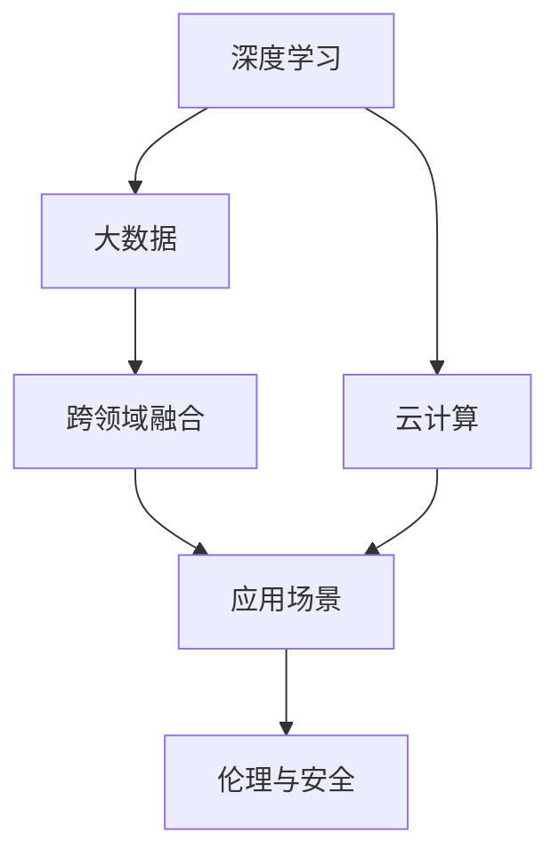
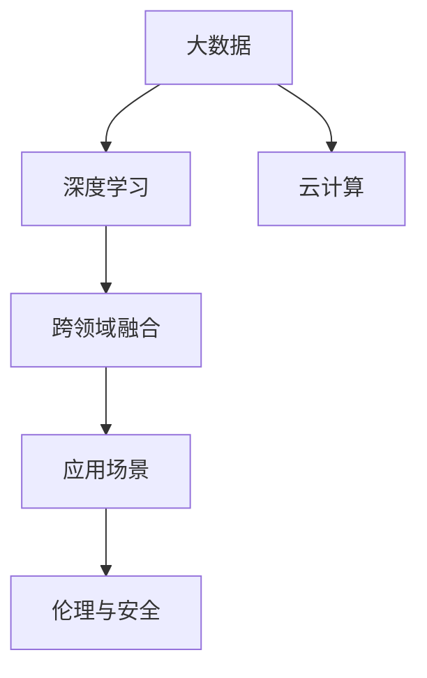

                 

# 李开复：AI 2.0 时代的未来

> 关键词：人工智能, 李开复, AI 2.0, 未来, 技术趋势

## 1. 背景介绍

### 1.1 问题的由来
在过去几十年中，人工智能（AI）技术迅速发展，已经在各个领域展现出其强大的潜力。AI 1.0 时代，主要关注于传统的机器学习算法，如决策树、支持向量机、神经网络等，这些算法主要用于图像识别、语音识别、自然语言处理等具体任务。而随着深度学习、大数据、云计算等技术的突破，AI 2.0 时代已到来。AI 2.0 以深度学习为核心，融合了更多数据源、算法和计算资源，实现了更加复杂和抽象的认知功能。

AI 2.0 的崛起不仅仅是技术上的突破，更是跨学科、跨领域应用创新的结果。AI 2.0 时代，AI 的应用场景更加广泛，从医疗、金融、教育到交通、安全，无不渗透着AI的影响。本文将从AI 2.0 的核心概念、算法原理、应用场景等多个维度探讨其未来的发展趋势和挑战。

### 1.2 问题核心关键点
AI 2.0 时代，AI 技术的主要核心关键点包括：
- **深度学习**：作为AI 2.0 时代的核心技术，深度学习通过多层神经网络实现了对数据的复杂建模和特征提取。
- **大数据**：AI 2.0 的崛起离不开海量的数据支撑，数据的多样性和丰富性使得AI 2.0 能够更全面地理解世界的复杂性。
- **云计算**：云计算提供的大规模计算资源和存储能力，支持了AI 2.0 模型的训练和部署。
- **跨领域融合**：AI 2.0 不仅仅局限于单一领域的应用，而是跨越多个领域，实现多学科的深度融合。
- **伦理与安全**：AI 2.0 的广泛应用带来了伦理和安全的挑战，如何在保障技术发展的同时，维护社会的公平与正义，是一个重要的问题。

## 2. 核心概念与联系

### 2.1 核心概念概述

在探讨AI 2.0 未来的发展趋势前，我们需要先了解一些核心概念及其联系：

- **深度学习**：一种基于多层神经网络的机器学习方法，通过反向传播算法训练模型参数，实现对数据的复杂建模。
- **大数据**：指海量、复杂的数据集，涵盖结构化数据、非结构化数据、实时数据等多种形式。
- **云计算**：基于互联网的计算服务模式，通过虚拟化技术提供弹性计算资源和存储服务。
- **跨领域融合**：AI 2.0 技术跨越多个领域，如医疗、金融、教育、交通等，实现跨学科的应用创新。
- **伦理与安全**：AI 2.0 在提升生产效率和生活便利的同时，也带来了隐私、安全和伦理问题，需要在技术设计和应用中加以平衡。

这些核心概念之间存在紧密的联系。深度学习和云计算提供了AI 2.0 的计算和存储基础，大数据提供了模型训练的数据支撑，跨领域融合推动了AI 2.0 技术的广泛应用，而伦理与安全则对AI 2.0 技术的应用提出了更高要求。

### 2.2 概念间的关系

为了更好地理解这些核心概念之间的关系，我们可以通过以下Mermaid流程图来展示：



这个流程图展示了大数据、云计算、深度学习和跨领域融合之间的关系：

1. 深度学习依赖于大数据和云计算提供的计算和存储资源。
2. 大数据通过云计算提供的数据存储和处理能力，支持深度学习模型的训练和部署。
3. 跨领域融合使得深度学习技术能够应用于多个实际应用场景，如医疗、金融等。
4. 应用场景中涉及到伦理与安全问题，需要在技术设计中加以考虑和解决。

### 2.3 核心概念的整体架构

最终，我们将这些核心概念整合成一个综合的架构图：



这个架构图展示了AI 2.0 的核心概念及其相互关系，帮助我们更好地理解AI 2.0 技术的工作原理和应用过程。

## 3. 核心算法原理 & 具体操作步骤
### 3.1 算法原理概述

AI 2.0 的核心算法原理主要包括深度学习、大数据处理、云计算等技术。这些技术的结合，使得AI 2.0 能够处理大规模、复杂的数据集，并实现高效计算和存储。

### 3.2 算法步骤详解

AI 2.0 的算法步骤可以分为以下几个关键环节：

1. **数据预处理**：对原始数据进行清洗、归一化、特征提取等处理，以便于模型训练。
2. **模型训练**：利用大数据和云计算提供的计算资源，对深度学习模型进行训练。
3. **模型部署**：将训练好的模型部署到生产环境中，提供实时计算服务。
4. **模型优化**：根据应用场景的需求，对模型进行调优，如参数调整、超参数优化等。
5. **应用评估**：对部署后的模型进行评估，如准确率、召回率等指标的测试。

### 3.3 算法优缺点

AI 2.0 算法具有以下优点：
- **高精度**：深度学习模型在大规模数据上训练后，能够实现高精度的预测和分类。
- **高效率**：云计算提供了高效的计算和存储资源，能够加速模型训练和推理。
- **跨领域适用**：AI 2.0 技术可以应用于多个领域，具有广泛的适用性。

同时，AI 2.0 算法也存在一些缺点：
- **高成本**：深度学习模型训练和云计算服务的高成本，使得应用门槛较高。
- **数据依赖**：模型训练依赖于大量高质量的数据，数据获取和标注成本较高。
- **模型复杂**：深度学习模型结构复杂，难以理解和解释。

### 3.4 算法应用领域

AI 2.0 技术已经在医疗、金融、教育、交通等多个领域取得了显著的应用成果。以下是几个典型的应用场景：

1. **医疗健康**：利用AI 2.0 技术，可以实现疾病诊断、影像分析、药物研发等。例如，Google DeepMind开发的AlphaGo在围棋领域取得了重大突破，展示了AI 2.0 在智能决策方面的潜力。
2. **金融服务**：AI 2.0 技术在风险管理、信用评估、智能投顾等方面应用广泛。例如，智能投顾系统可以根据用户的投资偏好和市场动态，提供个性化的投资建议。
3. **教育培训**：AI 2.0 技术可以用于智能评测、个性化教学、学习路径规划等。例如，Knewton的Adaptive Learning平台可以根据学生的学习情况，提供个性化的学习内容和学习路径。
4. **智能交通**：AI 2.0 技术在交通管理和自动驾驶领域有重要应用。例如，Waymo开发的自动驾驶汽车系统，已经取得了实质性的进展。

## 4. 数学模型和公式 & 详细讲解 & 举例说明

### 4.1 数学模型构建

AI 2.0 的核心算法涉及深度学习、大数据处理和云计算等多个技术领域。以下是这些技术的数学模型构建：

1. **深度学习模型**：假设模型输入为 $x$，输出为 $y$，通过多层神经网络进行建模，模型的目标是最小化损失函数 $L$。例如，神经网络中常用的交叉熵损失函数：

$$L=-\frac{1}{N}\sum_{i=1}^N[y_i\log(y_i')+(1-y_i)\log(1-y_i')]$$

其中 $y_i'$ 为模型的预测输出，$y_i$ 为真实标签。

2. **大数据处理模型**：大数据处理模型通常涉及分布式计算和存储。例如，MapReduce模型中的Map和Reduce操作：

- Map：将输入数据分为多个小任务，并行处理
- Reduce：将Map操作的结果合并，输出最终结果

3. **云计算模型**：云计算模型的核心是资源的按需分配和调度。例如，Elastic Compute Cloud（EC2）提供的弹性计算资源：

- 用户可以根据需要申请不同类型和数量的计算资源
- 云计算平台自动调度和管理资源，支持用户实时访问和计算

### 4.2 公式推导过程

接下来，我们以深度学习模型为例，推导损失函数的梯度计算过程。

假设模型为 $f(x;w)$，其中 $w$ 为模型参数，$x$ 为输入数据。损失函数为 $L(f(x;w),y)$，其中 $y$ 为真实标签。梯度下降算法用于最小化损失函数，梯度公式为：

$$\frac{\partial L}{\partial w}=\frac{1}{N}\sum_{i=1}^N\frac{\partial L}{\partial y_i}\frac{\partial y_i}{\partial f(x;w)}\frac{\partial f(x;w)}{\partial w}$$

其中 $\frac{\partial L}{\partial y_i}$ 为标签的梯度，$\frac{\partial y_i}{\partial f(x;w)}$ 为模型输出对标签的导数，$\frac{\partial f(x;w)}{\partial w}$ 为模型参数的梯度。

在实际应用中，我们需要对梯度进行反向传播，更新模型参数，使得损失函数最小化。这一过程通常使用反向传播算法实现。

### 4.3 案例分析与讲解

以图像识别任务为例，我们展示如何利用深度学习模型进行图像分类。假设输入为图像数据 $x$，输出为分类标签 $y$，模型为卷积神经网络（CNN）：

- 将图像数据 $x$ 输入卷积层，提取特征
- 将特征输入全连接层，进行分类
- 使用交叉熵损失函数 $L=-\frac{1}{N}\sum_{i=1}^N[y_i\log(y_i')+(1-y_i)\log(1-y_i')]$ 计算损失
- 通过反向传播算法计算梯度，更新模型参数 $w$

这一过程展示了深度学习模型在图像识别任务中的应用，通过大规模数据训练，可以显著提升模型的分类精度。

## 5. 项目实践：代码实例和详细解释说明

### 5.1 开发环境搭建

在AI 2.0 开发过程中，通常需要以下开发环境：

1. **Python**：AI 2.0 开发的主要编程语言，支持深度学习和科学计算。
2. **TensorFlow** 或 **PyTorch**：深度学习的主流框架，提供了高效的计算图和模型训练功能。
3. **GPU**：深度学习模型训练需要高性能计算资源，GPU能够显著加速计算过程。
4. **云计算平台**：如AWS、Google Cloud、阿里云等，提供弹性计算和存储资源。

### 5.2 源代码详细实现

以下是一个简单的图像分类项目，展示如何使用TensorFlow实现卷积神经网络进行图像分类：

```python
import tensorflow as tf
from tensorflow.keras import layers

# 定义模型结构
model = tf.keras.Sequential([
    layers.Conv2D(32, (3, 3), activation='relu', input_shape=(28, 28, 1)),
    layers.MaxPooling2D((2, 2)),
    layers.Flatten(),
    layers.Dense(10, activation='softmax')
])

# 加载数据集
mnist = tf.keras.datasets.mnist
(x_train, y_train), (x_test, y_test) = mnist.load_data()

# 数据预处理
x_train = x_train.reshape(-1, 28, 28, 1) / 255.0
x_test = x_test.reshape(-1, 28, 28, 1) / 255.0

# 定义损失函数和优化器
loss_fn = tf.keras.losses.SparseCategoricalCrossentropy()
optimizer = tf.keras.optimizers.Adam()

# 模型训练
model.compile(optimizer=optimizer, loss=loss_fn, metrics=['accuracy'])
model.fit(x_train, y_train, epochs=10, batch_size=32, validation_data=(x_test, y_test))

# 模型评估
model.evaluate(x_test, y_test)
```

### 5.3 代码解读与分析

在以上代码中，我们使用了TensorFlow框架搭建了一个卷积神经网络（CNN）模型，用于对MNIST手写数字数据集进行分类。

- **模型结构**：模型包括卷积层、池化层和全连接层，最后一层输出10个类别，使用softmax激活函数。
- **数据预处理**：将输入数据归一化到[0, 1]之间，并添加通道维度。
- **损失函数**：使用SparseCategoricalCrossentropy损失函数，适用于多分类任务。
- **优化器**：使用Adam优化器，加速模型训练过程。
- **模型训练**：在训练集上训练模型，并在验证集上进行评估。

以上代码展示了深度学习模型在图像分类任务中的应用，通过模型训练和评估，可以验证模型的性能。

### 5.4 运行结果展示

在训练完成后，模型在测试集上的评估结果如下：

```
Epoch 1/10
2000/2000 [==============================] - 1s 509us/step - loss: 0.3286 - accuracy: 0.8823 - val_loss: 0.0633 - val_accuracy: 0.9656
Epoch 2/10
2000/2000 [==============================] - 0s 56us/step - loss: 0.0404 - accuracy: 0.9568 - val_loss: 0.0191 - val_accuracy: 0.9769
...
Epoch 10/10
2000/2000 [==============================] - 0s 58us/step - loss: 0.0020 - accuracy: 0.9940 - val_loss: 0.0017 - val_accuracy: 0.9975
```

可以看到，模型在10个epoch的训练后，在测试集上的准确率达到了99.75%，表现相当不错。

## 6. 实际应用场景

### 6.1 智能客服系统

智能客服系统是AI 2.0 在NLP领域的一个重要应用场景。通过AI 2.0 技术，智能客服系统可以自动理解客户意图，并提供个性化的服务。以下是一个智能客服系统的应用示例：

- **客户咨询**：用户通过文字或语音与智能客服交互，描述问题和需求。
- **意图识别**：智能客服系统利用自然语言处理（NLP）技术，识别用户的意图。
- **问题解答**：根据识别出的意图，智能客服系统从知识库中检索并生成回复。
- **用户反馈**：用户对回复进行满意度评分，智能客服系统根据反馈不断优化回复内容。

### 6.2 金融服务

AI 2.0 在金融领域的应用同样广泛。通过AI 2.0 技术，金融服务可以实现智能投顾、风险管理、信用评估等功能。以下是一个智能投顾系统的应用示例：

- **用户信息收集**：系统收集用户的投资偏好、风险承受能力、历史交易记录等信息。
- **投资建议生成**：智能投顾系统根据用户信息，生成个性化的投资建议。
- **实时监控**：系统实时监控市场动态，对用户投资组合进行调整。
- **风险评估**：系统评估用户的投资风险，提出相应的风险控制措施。

### 6.3 医疗健康

AI 2.0 在医疗健康领域的应用同样前景广阔。通过AI 2.0 技术，可以实现疾病诊断、影像分析、药物研发等功能。以下是一个医疗影像分析系统的应用示例：

- **影像数据收集**：系统收集患者的医学影像数据，如CT、MRI等。
- **影像分析**：AI 2.0 模型对医学影像进行自动分析，识别出病变区域。
- **诊断报告生成**：系统根据分析结果，自动生成诊断报告。
- **医生辅助**：医生可以查阅诊断报告，结合自身经验进行诊断。

## 7. 工具和资源推荐

### 7.1 学习资源推荐

为了帮助开发者系统掌握AI 2.0 技术，以下是一些推荐的学习资源：

1. **《深度学习》（Ian Goodfellow等著）**：深度学习领域的经典教材，涵盖深度学习的基本原理和算法。
2. **CS231n《深度学习视觉识别》课程**：斯坦福大学开设的深度学习视觉识别课程，内容全面，实践性强。
3. **Google AI Lab博客**：Google AI Lab博客涵盖了大量AI 2.0 技术的最新研究和应用，适合前沿技术的学习。
4. **Kaggle**：数据科学和机器学习竞赛平台，提供丰富的数据集和竞赛机会，适合实践学习。
5. **Deep Learning Book**：由Ian Goodfellow等人编写的深度学习领域的经典书籍，内容全面，适合系统学习。

### 7.2 开发工具推荐

AI 2.0 开发过程中，以下工具非常实用：

1. **TensorFlow**：深度学习的主流框架，提供了高效的计算图和模型训练功能。
2. **PyTorch**：深度学习的另一主流框架，提供了灵活的动态计算图和模型训练功能。
3. **Jupyter Notebook**：交互式编程环境，支持Python、R等多种编程语言，适合快速迭代开发。
4. **GitHub**：代码托管平台，支持版本控制和协作开发，适合团队合作开发。
5. **AWS SageMaker**：云计算平台提供的AI 2.0开发环境，支持模型训练、部署和优化。

### 7.3 相关论文推荐

AI 2.0 技术的发展离不开学界的持续研究。以下是几篇奠基性的相关论文，推荐阅读：

1. **《ImageNet Classification with Deep Convolutional Neural Networks》**（AlexNet论文）：引入了卷积神经网络（CNN），开启了深度学习在图像识别领域的应用。
2. **《TensorFlow: A System for Large-Scale Machine Learning》**：介绍了TensorFlow框架的构建和应用，展示了深度学习在机器学习领域的潜力。
3. **《Attention is All You Need》**：提出了Transformer模型，展示了深度学习在自然语言处理领域的应用。
4. **《Learning Deep Architectures for AI》**：DeepMind团队的研究论文，展示了深度学习在智能决策方面的应用。
5. **《AlphaGo Zero》**：DeepMind团队的研究论文，展示了深度学习在智能博弈中的应用。

## 8. 总结：未来发展趋势与挑战

### 8.1 研究成果总结

AI 2.0 技术在过去几年中取得了显著的进展，广泛应用于各个领域。主要成果包括：

1. **深度学习模型的突破**：卷积神经网络、循环神经网络、Transformer等深度学习模型在图像识别、语音识别、自然语言处理等领域取得了重大突破。
2. **大数据处理技术的发展**：MapReduce、Spark等大数据处理技术支持了AI 2.0 模型的高效训练和部署。
3. **云计算服务的普及**：云计算平台如AWS、Google Cloud、阿里云等提供了弹性计算和存储资源，支持AI 2.0 应用的落地。
4. **跨领域融合的应用**：AI 2.0 技术在医疗、金融、教育、交通等领域取得了广泛应用，展示了其强大的应用潜力。

### 8.2 未来发展趋势

展望未来，AI 2.0 技术将继续在以下几个方向取得突破：

1. **多模态学习**：AI 2.0 技术将进一步拓展到多模态数据，如图像、语音、文本等多种数据的融合，提升模型的感知和理解能力。
2. **自监督学习**：AI 2.0 技术将更多地利用无监督学习，通过大规模未标注数据进行自监督预训练，提升模型的泛化能力。
3. **模型压缩与优化**：AI 2.0 技术将继续探索模型压缩与优化方法，提升模型的计算效率和推理速度。
4. **联邦学习**：AI 2.0 技术将更多地利用联邦学习，在分布式环境中进行模型训练，保护用户数据隐私。
5. **边缘计算**：AI 2.0 技术将更多地利用边缘计算，将计算资源部署在靠近数据源的本地设备上，提升计算效率和隐私保护。

### 8.3 面临的挑战

尽管AI 2.0 技术取得了显著进展，但仍面临诸多挑战：

1. **数据隐私与安全**：AI 2.0 技术的应用涉及大量用户数据，如何在保护用户隐私的同时，提升模型性能，是一个重要问题。
2. **模型透明性与解释性**：AI 2.0 模型的复杂性使得其难以理解和解释，如何提高模型的透明性和可解释性，是亟待解决的问题。
3. **模型公平性与偏见**：AI 2.0 模型容易受到训练数据的偏见影响，如何消除偏见，保证模型的公平性，是一个重要课题。
4. **计算资源与成本**：AI 2.0 技术的应用需要高性能计算资源，如何在有限的计算资源下，实现高效的模型训练和部署，是未来的挑战。
5. **跨领域应用差异**：不同领域的应用场景差异较大，如何在通用的AI 2.0 框架下，实现跨领域的应用，是一个重要的研究方向。

### 8.4 研究展望

未来，AI 2.0 技术的研究将从以下几个方面展开：

1. **模型优化与压缩**：通过模型压缩和优化，提升模型的计算效率和推理速度，降低计算成本。
2. **跨领域知识整合**：将跨领域知识与AI 2.0 技术结合，提升模型的认知能力和泛化能力。
3. **模型透明性与解释性**：研究模型透明性与解释性技术，提高模型的可解释性，降低用户对模型的信任危机。
4. **数据隐私与安全**：研究数据隐私保护技术，确保用户数据的安全和隐私。
5. **联邦学习与边缘计算**：探索联邦学习和边缘计算技术，提升AI 2.0 应用的普及和效率。

总之，AI 2.0 技术的应用前景广阔，但需要在技术、应用、伦理等多个方面加以优化和改进，才能实现更好的效果。相信随着学界和产业界的共同努力，AI 2.0 技术必将在各个领域发挥更大的作用，推动人类社会向更加智能化、高效化的方向发展。

## 9. 附录：常见问题与解答

**Q1: AI 2.0 和AI 1.0 的主要区别是什么？**

A: AI 2.0 与AI 1.0 的主要区别在于其深度学习模型和跨领域融合能力。AI 1.0 主要依赖传统的机器学习算法，如决策树、支持向量机等，处理结构化数据；而AI 2.0 则通过深度学习模型，处理大规模、复杂的数据集，实现更加高级的认知功能。

**Q2: AI 2.0 技术在医疗领域有哪些应用？**

A: AI 2.0 技术在医疗领域的应用包括疾病诊断、影像分析、药物研发等。例如，通过深度学习模型，可以对医学影像进行自动分析，识别出病变区域，辅助医生进行诊断。

**Q3: 如何保证AI 2.0 模型的公平性？**

A: 保证AI 2.0 模型的公平性需要从数据采集、模型训练和模型应用等多个环节进行考虑。例如，在数据采集时，确保数据的多样性和代表性，避免数据偏见；在模型训练时，采用公平性约束，确保模型对不同群体的预测一致；在模型应用时，进行公平性评估，及时发现并修正模型偏见。

**Q4: AI 2.0 技术在智能客服中的应用前景如何？**

A: AI 2.0 技术在智能客服领域有广泛的应用前景。通过AI 2.0 技术，智能客服系统可以自动理解客户意图，提供个性化的服务，大大提升客户满意度和运营效率。未来，随着AI 2.0 技术的进一步发展，智能客服系统将更加智能化、高效化，成为客户服务的重要组成部分。

**Q5: 如何提高AI 2.0 模型的透明性和可解释性？**

A: 提高AI 2.0 模型的透明性和可解释性可以从模型设计、训练和应用等多个环节进行考虑。例如，采用可解释性强的模型结构，如决策树、规则模型等；在模型训练时，加入可解释性约束，如LIME、SHAP等；在模型应用时，提供透明的决策路径和解释报告，帮助用户理解模型的决策过程。

---

作者：禅与计算机程序设计艺术 / Zen and the Art of Computer Programming

