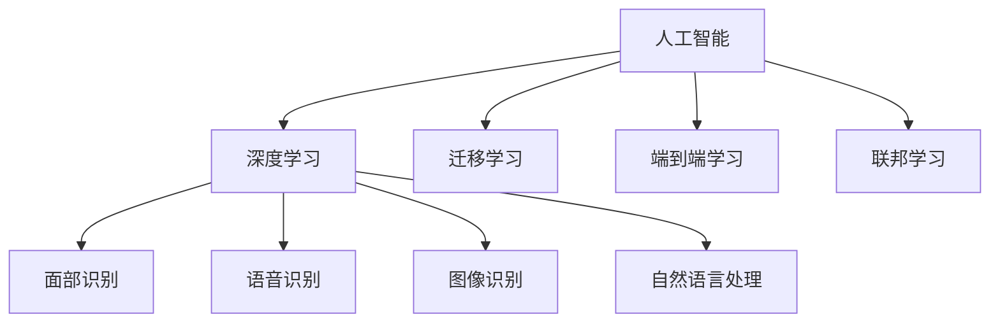
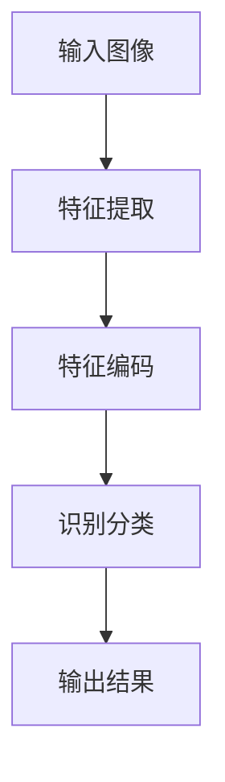
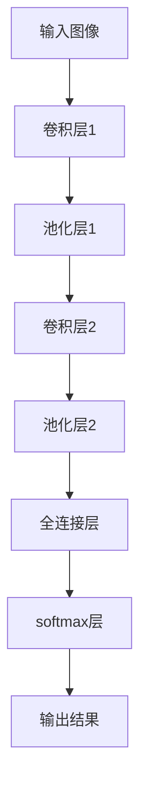
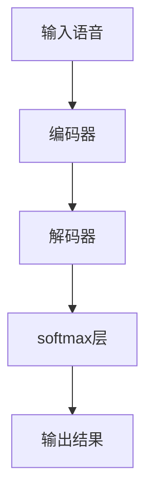

                 

# 李开复：苹果AI应用的局限性

## 1. 背景介绍

近年来，苹果公司（Apple Inc.）在人工智能（AI）领域取得了显著进展，推出了多项AI技术和应用，包括面部识别、语音识别、图像识别、自然语言处理等。这些技术在苹果的各类硬件产品中得到广泛应用，如iPhone、iPad、Mac等设备，提升了用户体验和设备智能化水平。然而，尽管苹果AI应用在某些方面取得了成功，但总体来看，其AI技术仍存在一定的局限性。本文将从技术原理、实际应用、未来展望等角度，深入探讨苹果AI应用的局限性，并提出相关建议。

## 2. 核心概念与联系

### 2.1 核心概念概述

1. **人工智能（AI）**：指通过计算机技术模拟人类智能行为的能力，包括感知、学习、推理、规划等。
2. **深度学习（Deep Learning）**：一种基于人工神经网络的机器学习方法，常用于图像识别、自然语言处理等领域。
3. **迁移学习（Transfer Learning）**：指在某一任务上训练得到的模型参数，可以迁移到另一相关任务上，以提高新任务的性能。
4. **端到端学习（End-to-End Learning）**：指在模型训练过程中，不需要手动设计和干预中间特征提取过程，直接通过输入数据和输出标签训练模型。
5. **联邦学习（Federated Learning）**：指多客户端在本地数据上训练模型，并将模型参数汇总到中心服务器进行全局优化，以保证数据隐私和模型泛化能力。

### 2.2 核心概念之间的关系

苹果AI应用的核心概念之间存在紧密联系，如图1所示。



图1：苹果AI应用的核心概念关系图

苹果AI应用通过深度学习技术，在面部识别、语音识别、图像识别、自然语言处理等领域取得了显著进展。此外，苹果还采用了迁移学习、端到端学习和联邦学习等技术，进一步提升了AI应用的性能和实用性。

## 3. 核心算法原理 & 具体操作步骤

### 3.1 算法原理概述

苹果AI应用的算法原理主要基于深度学习和迁移学习。以面部识别为例，其算法原理如图2所示。



图2：苹果面部识别算法原理图

苹果的面部识别系统首先对输入图像进行特征提取，然后对提取的特征进行编码，最后进行分类，输出识别结果。这一过程中，迁移学习起到了重要作用，通过在大规模数据上预训练的模型参数，提升了对新样本的识别能力。

### 3.2 算法步骤详解

苹果AI应用的算法步骤一般包括以下几个关键步骤：

1. **数据预处理**：将原始数据转换为模型可接受的格式，如图像的归一化、文本的分词等。
2. **特征提取**：利用深度学习模型提取输入数据的特征表示，如卷积神经网络（CNN）、循环神经网络（RNN）等。
3. **模型训练**：在标注数据上训练模型，通过反向传播算法优化模型参数。
4. **模型评估**：在验证集上评估模型性能，选择最佳模型。
5. **模型应用**：将训练好的模型应用于实际场景，进行推理预测。

### 3.3 算法优缺点

苹果AI应用的优势在于：

1. **高性能**：苹果的AI应用采用了先进的深度学习算法，能够在短时间内处理大量数据，实现高效的识别和预测。
2. **用户体验**：通过在设备上集成AI应用，提升了用户的使用体验，如面部解锁、语音助手等。
3. **数据隐私保护**：苹果采用了联邦学习等技术，确保用户数据在本地设备上处理，不泄露给第三方。

然而，苹果AI应用的局限性在于：

1. **依赖硬件性能**：AI应用的性能在很大程度上依赖于设备的硬件性能，如CPU、GPU、内存等，限制了其普及和应用范围。
2. **模型可解释性不足**：深度学习模型通常被视为"黑盒"，难以解释其内部工作机制，用户对其输出的信任度较低。
3. **跨领域泛化能力有限**：苹果的AI应用主要聚焦于特定领域（如人脸识别、语音识别），跨领域的泛化能力较弱。
4. **数据质量依赖性强**：AI应用的性能高度依赖于输入数据的质量，数据标注不准确或不完整时，可能导致模型性能下降。

### 3.4 算法应用领域

苹果AI应用主要应用于以下几个领域：

1. **面部识别**：如Face ID面部解锁、FaceTime视频通话等。
2. **语音识别**：如Siri语音助手、实时字幕等。
3. **图像识别**：如拍照翻译、实时滤镜等。
4. **自然语言处理**：如实时翻译、新闻推荐等。

## 4. 数学模型和公式 & 详细讲解

### 4.1 数学模型构建

以苹果的面部识别系统为例，其数学模型可以表示为：

$$
y = M \cdot x
$$

其中，$y$表示输出结果，$x$表示输入数据，$M$表示模型参数。模型$M$可以表示为卷积神经网络的参数矩阵，如图3所示。



图3：苹果面部识别系统的数学模型构建

### 4.2 公式推导过程

面部识别系统的公式推导过程如下：

1. **卷积层**：
$$
\mathbf{C} = \mathbf{F} * \mathbf{I} + \mathbf{b}
$$

其中，$\mathbf{C}$表示卷积层输出，$\mathbf{F}$表示卷积核，$\mathbf{I}$表示输入图像，$\mathbf{b}$表示偏置项。

2. **池化层**：
$$
\mathbf{P} = max\{C\}
$$

其中，$\mathbf{P}$表示池化层输出，$C$表示卷积层输出。

3. **全连接层**：
$$
\mathbf{Z} = M \cdot \mathbf{P}
$$

其中，$\mathbf{Z}$表示全连接层输出，$M$表示全连接层参数矩阵。

4. **softmax层**：
$$
\mathbf{y} = softmax(Z)
$$

其中，$\mathbf{y}$表示输出结果，$Z$表示全连接层输出。

5. **输出结果**：
$$
y = \arg\max_{i} \mathbf{y}_i
$$

其中，$y$表示输出结果，$\mathbf{y}_i$表示输出结果的概率分布。

### 4.3 案例分析与讲解

以苹果的语音识别系统为例，其数学模型可以表示为：

$$
y = M \cdot x
$$

其中，$y$表示输出结果，$x$表示输入语音信号，$M$表示模型参数。模型$M$可以表示为循环神经网络的参数矩阵，如图4所示。



图4：苹果语音识别系统的数学模型构建

语音识别系统的公式推导过程如下：

1. **编码器**：
$$
\mathbf{H} = LSTM(x)
$$

其中，$\mathbf{H}$表示编码器输出，$x$表示输入语音信号，$LSTM$表示长短期记忆网络。

2. **解码器**：
$$
\mathbf{y} = M \cdot \mathbf{H}
$$

其中，$\mathbf{y}$表示输出结果，$\mathbf{H}$表示编码器输出，$M$表示解码器参数矩阵。

3. **softmax层**：
$$
\mathbf{y} = softmax(y)
$$

其中，$\mathbf{y}$表示输出结果，$y$表示解码器输出。

4. **输出结果**：
$$
y = \arg\max_{i} \mathbf{y}_i
$$

其中，$y$表示输出结果，$\mathbf{y}_i$表示输出结果的概率分布。

## 5. 项目实践：代码实例和详细解释说明

### 5.1 开发环境搭建

苹果AI应用的开发环境一般包括以下几个关键部分：

1. **硬件平台**：如iPhone、iPad、Mac等。
2. **操作系统**：如iOS、macOS等。
3. **开发工具**：如Xcode、PyCharm等。
4. **AI框架**：如Core ML、TensorFlow等。

### 5.2 源代码详细实现

以苹果的面部识别系统为例，其源代码实现如下：

```python
import torch
import torch.nn as nn
import torchvision.transforms as transforms
import torchvision.datasets as datasets
import torchvision.models as models

class FaceRecognition(nn.Module):
    def __init__(self):
        super(FaceRecognition, self).__init__()
        self.conv1 = nn.Conv2d(3, 64, kernel_size=3, stride=1, padding=1)
        self.conv2 = nn.Conv2d(64, 128, kernel_size=3, stride=1, padding=1)
        self.fc1 = nn.Linear(128*12*12, 1024)
        self.fc2 = nn.Linear(1024, 10)
        self.softmax = nn.Softmax(dim=1)

    def forward(self, x):
        x = self.conv1(x)
        x = nn.MaxPool2d(kernel_size=2)(x)
        x = self.conv2(x)
        x = nn.MaxPool2d(kernel_size=2)(x)
        x = x.view(-1, 128*12*12)
        x = self.fc1(x)
        x = torch.relu(x)
        x = self.fc2(x)
        x = self.softmax(x)
        return x

model = FaceRecognition()
criterion = nn.CrossEntropyLoss()
optimizer = torch.optim.Adam(model.parameters(), lr=0.001)

# 训练过程
for epoch in range(10):
    for i, (images, labels) in enumerate(train_loader):
        images = images.to(device)
        labels = labels.to(device)
        optimizer.zero_grad()
        outputs = model(images)
        loss = criterion(outputs, labels)
        loss.backward()
        optimizer.step()

# 测试过程
correct = 0
total = 0
with torch.no_grad():
    for images, labels in test_loader:
        images = images.to(device)
        labels = labels.to(device)
        outputs = model(images)
        _, predicted = torch.max(outputs.data, 1)
        total += labels.size(0)
        correct += (predicted == labels).sum().item()
print('Accuracy: ', correct/total)
```

### 5.3 代码解读与分析

上述代码实现了一个简单的面部识别模型，包含卷积层、池化层、全连接层和softmax层。在训练过程中，模型通过反向传播算法优化参数，并使用交叉熵损失函数进行监督学习。在测试过程中，模型对输入图像进行前向传播，输出预测结果，并计算准确率。

## 6. 实际应用场景

苹果AI应用的实际应用场景主要包括以下几个方面：

1. **面部解锁**：如Face ID面部解锁功能。
2. **视频通话**：如FaceTime视频通话功能。
3. **实时翻译**：如实时字幕功能。
4. **图像处理**：如拍照滤镜、实时滤镜等。
5. **自然语言处理**：如实时翻译、新闻推荐等。

## 7. 工具和资源推荐

### 7.1 学习资源推荐

1. **《深度学习入门》（李开复）**：详细介绍深度学习的基本概念和算法原理，适合初学者入门。
2. **《Python深度学习》（Francois Chollet）**：讲解深度学习在Python中的实现，适合开发者使用。
3. **CS231n《卷积神经网络》课程**：斯坦福大学开设的深度学习课程，涵盖卷积神经网络的基本概念和算法。
4. **Kaggle竞赛**：参加Kaggle竞赛可以积累实战经验，提升算法设计能力。
5. **arXiv论文预印本**：获取最新深度学习研究成果，了解前沿技术动态。

### 7.2 开发工具推荐

1. **Xcode**：苹果开发的IDE，支持iOS、macOS等平台开发。
2. **PyCharm**：流行的Python IDE，支持数据科学和深度学习开发。
3. **TensorFlow**：由Google开发的深度学习框架，支持多种编程语言。
4. **Core ML**：苹果提供的机器学习框架，支持在iOS设备上运行模型。
5. **PyTorch**：开源的深度学习框架，支持Python和C++开发。

### 7.3 相关论文推荐

1. **《TensorFlow: A System for Large-Scale Machine Learning》（Martín Abadi et al.）**：介绍TensorFlow框架的设计和实现。
2. **《Faster R-CNN: Towards Real-Time Object Detection with Region Proposal Networks》（Shaoqing Ren et al.）**：介绍Faster R-CNN算法在目标检测中的应用。
3. **《Google's Neural Machine Translation System: Bridging the Gap between Human and Machine Translation》（Wu et al.）**：介绍Google的神经机器翻译系统。
4. **《The Unreasonable Effectiveness of Transfer Learning》（Guillaume Lample et al.）**：探讨迁移学习在深度学习中的应用效果。

## 8. 总结：未来发展趋势与挑战

### 8.1 研究成果总结

苹果AI应用在面部识别、语音识别、图像识别和自然语言处理等领域取得了显著进展，但也存在一定的局限性。其未来发展需要关注以下几个方面：

1. **提升模型可解释性**：通过改进算法和模型架构，提高模型的可解释性，增强用户对AI应用的信任度。
2. **增强跨领域泛化能力**：通过引入更多数据和算法，提升模型的跨领域泛化能力，拓展AI应用的适用范围。
3. **优化硬件性能**：通过硬件加速和模型优化，提升AI应用的性能，满足更多用户的需求。
4. **强化数据隐私保护**：通过联邦学习和本地化处理，保护用户数据隐私，增强AI应用的安全性。

### 8.2 未来发展趋势

苹果AI应用的未来发展趋势包括以下几个方面：

1. **智能家居**：通过AI技术提升家居设备的智能化水平，如智能音箱、智能电视等。
2. **自动驾驶**：通过AI技术实现自动驾驶汽车，提升交通安全和效率。
3. **医疗健康**：通过AI技术提升医疗诊断和治疗效果，如医学影像分析、疾病预测等。
4. **教育培训**：通过AI技术提供个性化学习推荐，提升教育效果和学习效率。

### 8.3 面临的挑战

苹果AI应用在未来的发展过程中，仍面临以下挑战：

1. **算法复杂度**：随着AI应用场景的扩展，算法的复杂度将进一步提高，需要更高效的计算和存储方案。
2. **数据获取难度**：在特定领域获取高质量数据仍然是一个挑战，需要更多数据来源和技术手段。
3. **模型泛化能力**：现有模型在跨领域泛化能力方面仍需提升，以应对更多实际应用场景。
4. **伦理道德问题**：AI应用可能面临伦理道德问题，如偏见、隐私泄露等，需要建立相应的监管机制。

### 8.4 研究展望

未来，苹果AI应用的研究展望包括以下几个方面：

1. **模型压缩和优化**：通过模型压缩和优化技术，提升AI应用的性能和资源利用效率。
2. **跨领域知识整合**：将跨领域的知识与AI应用结合，提升模型表现和应用范围。
3. **自动化和可解释性**：通过自动化和可解释性技术，增强AI应用的可靠性和透明性。
4. **伦理和隐私保护**：建立AI应用的伦理和隐私保护机制，保障用户权益和数据安全。

## 9. 附录：常见问题与解答

**Q1：苹果的AI应用在哪些领域取得了成功？**

A: 苹果的AI应用在面部识别、语音识别、图像识别和自然语言处理等领域取得了显著成功，如Face ID、Siri、拍照滤镜、实时字幕等。

**Q2：苹果的AI应用存在哪些局限性？**

A: 苹果的AI应用存在依赖硬件性能、模型可解释性不足、跨领域泛化能力有限、数据质量依赖性强等局限性。

**Q3：苹果的AI应用如何提升模型可解释性？**

A: 苹果可以通过改进算法和模型架构，提高模型的可解释性。例如，使用可解释性较高的算法（如决策树、线性回归等），或引入可解释性技术（如LIME、SHAP等）。

**Q4：苹果的AI应用如何优化硬件性能？**

A: 苹果可以通过硬件加速和模型优化，提升AI应用的性能。例如，使用GPU、TPU等高性能设备，或通过量化、剪枝等技术优化模型大小。

**Q5：苹果的AI应用如何增强跨领域泛化能力？**

A: 苹果可以通过引入更多数据和算法，提升模型的跨领域泛化能力。例如，在大规模数据集上进行预训练，或引入迁移学习、多任务学习等技术。

**Q6：苹果的AI应用如何建立伦理和隐私保护机制？**

A: 苹果可以通过建立伦理和隐私保护机制，保障用户权益和数据安全。例如，采用差分隐私技术保护用户数据隐私，或建立数据使用监管机制，确保AI应用的透明性和可信度。

总之，苹果AI应用在面部识别、语音识别、图像识别和自然语言处理等领域取得了显著进展，但也存在一定的局限性。未来，苹果需要在模型可解释性、跨领域泛化能力、硬件性能和伦理保护等方面进行深入研究，进一步提升AI应用的性能和应用范围。

---

作者：禅与计算机程序设计艺术 / Zen and the Art of Computer Programming

