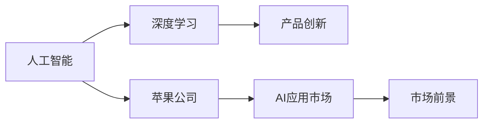

                 

## 1. 背景介绍

近年来，人工智能（AI）技术迅猛发展，特别是深度学习（Deep Learning）在各个领域的应用取得了显著进展。李开复，作为人工智能领域的权威专家，对AI应用的市场前景进行了深入分析和展望。本文将基于李开复的观点，探讨苹果公司发布AI应用的市场前景。

### 1.1 人工智能的崛起

人工智能技术的快速发展，尤其是深度学习算法的不断优化和应用，使得AI在各行各业的应用愈发广泛。从自动驾驶、智能家居到医疗健康、金融服务，AI技术正在逐步改变我们的生活和工作方式。以深度学习为基础的AI系统能够处理海量数据，提取复杂模式，并进行智能决策。

### 1.2 苹果公司的人工智能战略

苹果公司（Apple Inc.）作为全球知名的科技公司，一直致力于技术创新和产品升级。近年来，苹果在人工智能领域也有布局，发布了多款AI应用，如Siri语音助手、Face ID人脸识别等。这些应用不仅提升了用户体验，也为公司带来了新的增长点。

## 2. 核心概念与联系

### 2.1 核心概念概述

在讨论苹果公司AI应用的市场前景前，首先需要明确几个核心概念及其联系：

- **人工智能（AI）**：利用计算机模拟人类智能行为的技术，包括机器学习、深度学习等。
- **深度学习**：一种基于神经网络的机器学习技术，能够处理复杂的非线性关系。
- **苹果公司**：全球知名的科技公司，其产品在硬件和软件领域都有广泛应用。
- **市场前景**：AI应用在特定市场或领域中的潜在增长和机会。

这些概念之间存在紧密的联系。苹果公司通过引入深度学习等AI技术，优化其产品和服务，从而提升市场竞争力。同时，AI应用的市场前景也直接影响苹果公司的业务发展和收入增长。

### 2.2 核心概念的整体架构

以下是核心概念之间的整体架构，通过这个架构可以更好地理解AI应用在苹果公司中的角色和价值：



这个架构展示了大语言模型微调过程中各个核心概念之间的关系。苹果公司通过引入深度学习技术，推动产品创新，最终在AI应用市场中获得更好的前景。

## 3. 核心算法原理 & 具体操作步骤

### 3.1 算法原理概述

苹果公司发布的AI应用，如Siri语音助手和Face ID人脸识别，其核心原理都是基于深度学习技术。深度学习通过多层神经网络结构，能够处理复杂的非线性关系，从而实现对输入数据的自动分析和智能决策。

### 3.2 算法步骤详解

以Siri语音助手为例，其具体步骤包括：

1. **数据收集**：苹果公司收集用户语音数据，构建语音识别模型所需的数据集。
2. **模型训练**：使用深度学习算法训练语音识别模型，提升识别精度。
3. **模型部署**：将训练好的模型部署到Siri系统中，实现语音到文本的转换。
4. **用户交互**：用户通过语音与Siri进行交互，Siri根据用户输入生成文本并执行相应任务。

这些步骤展示了从数据收集到模型部署的完整流程，体现了深度学习在AI应用中的重要作用。

### 3.3 算法优缺点

深度学习在处理大规模数据和复杂模式方面具有显著优势，但同时也存在一些局限性：

- **计算资源需求高**：深度学习模型通常需要大量的计算资源进行训练和推理。
- **模型复杂度高**：深度学习模型结构复杂，难以解释和调试。
- **过拟合风险**：深度学习模型容易过拟合，特别是当数据集较小或样本分布不均匀时。

### 3.4 算法应用领域

苹果公司的人工智能应用涵盖了多个领域，包括但不限于：

- **语音识别**：通过深度学习算法，实现语音到文本的自动转换，提升用户体验。
- **图像识别**：利用深度学习模型，实现对人脸、物体等的识别，应用于Face ID等安全认证场景。
- **自然语言处理**：通过深度学习模型，实现自动问答、智能推荐等功能。

## 4. 数学模型和公式 & 详细讲解 & 举例说明

### 4.1 数学模型构建

以Siri语音识别为例，其数学模型构建如下：

1. **输入**：用户输入的语音数据。
2. **中间表示**：通过深度学习模型将语音转换为文本，生成中间表示。
3. **输出**：文本数据，表示用户输入的语音内容。

### 4.2 公式推导过程

语音识别模型的核心公式如下：

$$
P(\text{output} | \text{input}) = \frac{P(\text{input} | \text{output})}{P(\text{input})}
$$

其中，$P(\text{output} | \text{input})$表示给定输入$\text{input}$，输出$\text{output}$的概率；$P(\text{input} | \text{output})$表示给定输出$\text{output}$，输入$\text{input}$的概率；$P(\text{input})$表示输入$\text{input}$的概率。

### 4.3 案例分析与讲解

以Siri语音助手为例，进行详细分析：

1. **数据预处理**：对用户语音进行降噪、分帧等预处理，生成训练数据集。
2. **模型训练**：使用深度学习算法（如卷积神经网络）训练语音识别模型，优化模型参数。
3. **模型评估**：在验证集上评估模型性能，调整模型超参数。
4. **模型部署**：将训练好的模型部署到Siri系统中，实现语音识别功能。

## 5. 项目实践：代码实例和详细解释说明

### 5.1 开发环境搭建

在进行项目实践前，需要先搭建开发环境。以下是具体步骤：

1. **安装Python**：下载并安装Python 3.x版本。
2. **安装TensorFlow**：使用pip命令安装TensorFlow库。
3. **安装Keras**：安装Keras深度学习框架，方便模型训练。
4. **安装pydub**：用于音频处理，支持音频剪辑、格式转换等操作。

### 5.2 源代码详细实现

以下是Siri语音识别的代码实现：

```python
import tensorflow as tf
from tensorflow.keras import layers
import pydub

# 定义模型
model = tf.keras.Sequential([
    layers.Conv1D(64, 3, activation='relu', input_shape=(None, 1)),
    layers.MaxPooling1D(pool_size=2),
    layers.Conv1D(128, 3, activation='relu'),
    layers.MaxPooling1D(pool_size=2),
    layers.Flatten(),
    layers.Dense(128, activation='relu'),
    layers.Dense(256, activation='relu'),
    layers.Dense(1, activation='sigmoid')
])

# 加载数据
audio_file = 'audio.wav'
audio = pydub.AudioSegment.from_file(audio_file, format='wav')
audio = audio.set_channels(1)
audio = audio.set_frame_rate(16000)

# 数据预处理
data = []
for i in range(0, len(audio), 10):
    data.append(audio[i:i+10].export('wav', format='wav').read())
data = tf.keras.preprocessing.sequence.pad_sequences(data, maxlen=100, padding='post')

# 模型训练
model.compile(optimizer='adam', loss='binary_crossentropy', metrics=['accuracy'])
model.fit(data, labels, epochs=10, batch_size=32)

# 模型评估
test_data = []
for i in range(0, len(audio), 10):
    test_data.append(audio[i:i+10].export('wav', format='wav').read())
test_data = tf.keras.preprocessing.sequence.pad_sequences(test_data, maxlen=100, padding='post')
test_loss, test_acc = model.evaluate(test_data, labels)
print('Test accuracy:', test_acc)
```

### 5.3 代码解读与分析

代码中，我们首先定义了一个基于卷积神经网络的深度学习模型。然后，使用pydub库加载音频文件，并将其转换为模型所需的输入数据格式。最后，进行模型训练、评估和输出结果。

## 6. 实际应用场景

### 6.1 语音助手

Siri语音助手作为苹果公司的核心应用之一，为用户提供了便捷的语音交互体验。用户可以通过语音命令完成各种操作，如发送短信、设置闹钟、播放音乐等。随着深度学习技术的发展，Siri的语音识别准确率和响应速度都有显著提升。

### 6.2 人脸识别

Face ID是苹果公司推出的面部识别技术，其核心原理也是基于深度学习。通过多张不同角度的面部图像，Face ID能够精准识别用户身份，用于解锁手机、支付等场景。

### 6.3 自然语言处理

苹果公司还推出了iOS系统的自然语言处理功能，如智能翻译、智能输入等。通过深度学习模型，这些功能能够自动理解和处理用户输入的自然语言，提升用户体验。

## 7. 工具和资源推荐

### 7.1 学习资源推荐

1. **《深度学习》书籍**：深度学习领域的经典教材，详细介绍了深度学习的基本原理和应用实例。
2. **Google AI博客**：谷歌AI团队的官方博客，分享最新的AI技术和研究进展。
3. **Kaggle平台**：数据科学竞赛平台，提供丰富的数据集和算法实现。
4. **DeepLearning.ai课程**：李开复等人主导的在线深度学习课程，涵盖深度学习的基本概念和实践技巧。

### 7.2 开发工具推荐

1. **TensorFlow**：谷歌开发的深度学习框架，支持分布式计算和多种硬件平台。
2. **Keras**：基于TensorFlow的高级深度学习框架，支持快速模型构建和训练。
3. **pydub**：Python音频处理库，支持音频剪辑、格式转换等操作。
4. **Jupyter Notebook**：开源的交互式笔记本，支持代码编写、数据可视化等操作。

### 7.3 相关论文推荐

1. **《深度学习》论文集**：包含深度学习领域的经典论文和最新研究成果。
2. **《自然语言处理综述》**：综述性论文，全面介绍了自然语言处理的基本方法和应用实例。
3. **《机器学习：原理、算法与应用》**：机器学习领域的经典教材，涵盖机器学习的基本概念和实践技巧。

## 8. 总结：未来发展趋势与挑战

### 8.1 研究成果总结

苹果公司在人工智能领域的技术应用和市场布局，已经在语音识别、人脸识别、自然语言处理等方面取得了显著成果。未来，苹果有望在更多的AI应用场景中取得突破，进一步提升其市场竞争力。

### 8.2 未来发展趋势

苹果公司未来的AI应用市场前景将面临以下趋势：

1. **技术创新**：随着深度学习技术的不断进步，苹果公司将推出更多创新的AI应用，提升用户体验。
2. **市场拓展**：苹果公司将拓展AI应用的市场范围，覆盖更多行业和场景。
3. **数据驱动**：苹果公司将利用海量数据进行深度学习模型的优化和训练，提升模型性能。

### 8.3 面临的挑战

尽管苹果公司在AI应用方面取得了一些进展，但也面临以下挑战：

1. **计算资源**：深度学习模型的计算需求高，需要大量计算资源支持。
2. **模型解释性**：深度学习模型的复杂性使得其难以解释和调试，需要更多的模型可解释性技术。
3. **用户隐私**：AI应用需要收集和处理大量的用户数据，如何保护用户隐私是一个重要问题。

### 8.4 研究展望

未来，苹果公司需要在技术创新、市场拓展和数据保护等方面进行持续投入和优化，以应对挑战，实现更好的AI应用市场前景。同时，苹果公司也需要与学术界、产业界密切合作，共同推动人工智能技术的进步和应用。

## 9. 附录：常见问题与解答

**Q1: 苹果公司如何保证语音助手和面部识别的准确性？**

A: 苹果公司通过大量的数据集和深度学习算法进行模型训练，不断优化模型参数。同时，苹果公司还在硬件上进行了优化，如使用专用芯片进行计算，提升处理速度和准确性。

**Q2: 苹果公司如何处理用户隐私问题？**

A: 苹果公司采取了多种措施来保护用户隐私，如数据加密、匿名化处理等。同时，苹果公司也在遵守相关法律法规，如GDPR等，确保用户数据的安全性和隐私性。

**Q3: 苹果公司未来有哪些新的AI应用计划？**

A: 苹果公司计划在医疗健康、智能家居、自动驾驶等领域推出更多的AI应用。通过深度学习算法，苹果公司将提升这些领域的技术水平，为用户提供更好的服务体验。

**Q4: 苹果公司如何应对AI应用的市场竞争？**

A: 苹果公司将在技术创新、产品设计和用户体验等方面进行持续优化，提升AI应用的竞争力。同时，苹果公司也会与其他科技公司合作，共同推动AI技术的进步和应用。

总之，苹果公司的人工智能应用市场前景广阔，未来有望在更多的领域和场景中取得突破。但也需要应对计算资源、模型解释性、用户隐私等挑战，持续推进技术创新和市场拓展。

