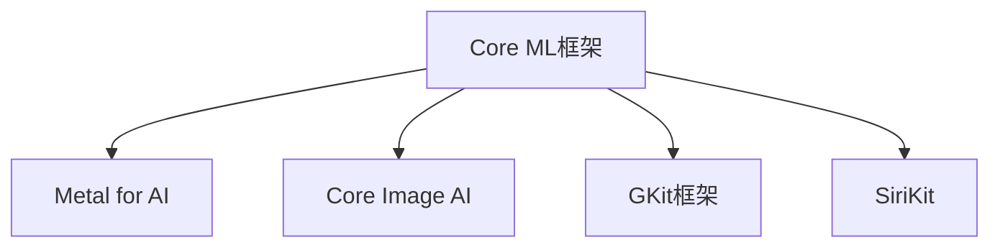

                 

# 李开复：苹果发布AI应用的开发者

## 1. 背景介绍

### 1.1 问题由来
苹果公司在技术界一直以创新和卓越著称，其产品和技术引领了全球消费电子市场的发展趋势。最近，苹果公司宣布将推出一系列人工智能（AI）应用的开发者工具，这标志着苹果在AI技术领域迈出了重要一步。

### 1.2 问题核心关键点
苹果发布的AI应用开发者工具主要包括：

1. **Core ML框架**：一个用于在iOS和iPadOS上快速部署机器学习模型的库，支持多种预训练模型，如YOLOv4、MobileNet等。
2. **Metal for AI**：利用GPU加速机器学习模型，提升模型推理速度和效率。
3. **Core Image AI**：一个支持计算机视觉任务的库，包括图像分类、目标检测等。
4. **GKit框架**：提供自然语言处理（NLP）功能，支持文本分类、情感分析、命名实体识别等任务。
5. **SiriKit**：提供一个Siri语音助手的开发工具，使得开发者能够更好地集成语音识别和自然语言理解功能。

这些工具的发布，将极大地促进AI应用在苹果设备上的开发和部署，提升用户体验和设备智能化水平。

### 1.3 问题研究意义
苹果在AI应用开发工具上的创新，不仅推动了AI技术在消费电子领域的普及，也为开发者提供了强大的开发支持，降低了AI应用开发的门槛。这对于推动AI技术在各个行业的应用，提升产品和服务的智能化水平具有重要意义。

## 2. 核心概念与联系

### 2.1 核心概念概述

在理解苹果发布的AI应用开发者工具之前，我们先要理解几个核心概念：

- **Core ML框架**：一个用于快速部署机器学习模型的库，支持多种预训练模型，如YOLOv4、MobileNet等。
- **Metal for AI**：利用GPU加速机器学习模型，提升模型推理速度和效率。
- **Core Image AI**：一个支持计算机视觉任务的库，包括图像分类、目标检测等。
- **GKit框架**：提供自然语言处理（NLP）功能，支持文本分类、情感分析、命名实体识别等任务。
- **SiriKit**：提供一个Siri语音助手的开发工具，使得开发者能够更好地集成语音识别和自然语言理解功能。

这些工具的发布，将使AI应用开发者能够更方便、更高效地构建智能应用，提升用户体验。

### 2.2 概念间的关系

这些核心概念之间存在着紧密的联系，形成了一个完整的AI应用生态系统。下面是这些概念之间关系的Mermaid流程图：



这个流程图展示了各个概念之间的依赖关系：

- **Core ML框架**：是所有AI应用的基础，支持多种预训练模型。
- **Metal for AI**：利用GPU加速，提升模型推理速度和效率。
- **Core Image AI**：提供计算机视觉任务的库，支持图像分类、目标检测等。
- **GKit框架**：提供自然语言处理功能，支持文本分类、情感分析、命名实体识别等。
- **SiriKit**：提供一个语音助手开发工具，集成语音识别和自然语言理解功能。

这些概念之间的紧密联系，共同构建了苹果在AI应用领域的强大生态系统。

## 3. 核心算法原理 & 具体操作步骤

### 3.1 算法原理概述

苹果发布的AI应用开发者工具，主要基于机器学习和深度学习技术，通过模型训练和微调，实现智能应用的功能。这些工具支持多种预训练模型和算法，包括卷积神经网络（CNN）、循环神经网络（RNN）、长短期记忆网络（LSTM）等。

### 3.2 算法步骤详解

使用苹果AI应用开发者工具构建AI应用的基本步骤如下：

1. **选择预训练模型**：根据应用需求选择合适的预训练模型，如YOLOv4、MobileNet、BERT等。
2. **微调模型**：在苹果设备上微调选定的预训练模型，使其适应具体的应用场景。
3. **集成工具**：使用Core ML、Metal for AI、Core Image AI、GKit框架和SiriKit等工具，将微调后的模型集成到应用中。
4. **测试和优化**：在实际应用场景中测试模型性能，根据反馈不断优化模型和应用。

### 3.3 算法优缺点

苹果AI应用开发者工具的优势包括：

- **高效集成**：提供了多种预训练模型和算法，方便开发者快速构建应用。
- **性能优化**：通过Metal for AI等技术，加速模型推理速度和效率。
- **跨平台支持**：支持iOS和iPadOS平台，方便开发者在多种设备上部署应用。

但这些工具也存在一些缺点：

- **资源占用**：使用GPU加速可能导致较大的内存和计算资源占用。
- **学习曲线**：对一些开发者来说，学习和掌握这些工具需要一定的时间和精力。
- **模型复杂度**：某些复杂的应用可能需要多个预训练模型的组合，增加了模型的复杂度。

### 3.4 算法应用领域

苹果AI应用开发者工具可以广泛应用于多个领域，包括：

- **计算机视觉**：如图像分类、目标检测、人脸识别等。
- **自然语言处理**：如文本分类、情感分析、命名实体识别等。
- **语音识别**：如语音转文本、语音识别等。
- **智能推荐**：如推荐系统、个性化推荐等。
- **智能交互**：如智能客服、虚拟助手等。

这些工具的发布，将大大促进AI技术在消费电子领域的应用，提升用户体验和设备智能化水平。

## 4. 数学模型和公式 & 详细讲解 & 举例说明

### 4.1 数学模型构建

苹果AI应用开发者工具主要基于机器学习和深度学习技术，其数学模型构建可以包括以下几个部分：

- **卷积神经网络（CNN）**：
  - 输入：图像数据
  - 输出：图像分类结果
  - 损失函数：交叉熵损失
  - 优化器：Adam、SGD等

- **循环神经网络（RNN）**：
  - 输入：时间序列数据
  - 输出：序列预测结果
  - 损失函数：均方误差损失
  - 优化器：Adam、SGD等

- **长短期记忆网络（LSTM）**：
  - 输入：时间序列数据
  - 输出：序列预测结果
  - 损失函数：均方误差损失
  - 优化器：Adam、SGD等

### 4.2 公式推导过程

以卷积神经网络（CNN）为例，其数学模型构建和推导过程如下：

- **输入层**：将图像数据输入卷积层。
- **卷积层**：通过卷积运算提取图像特征。
- **池化层**：对卷积层的输出进行下采样，减小特征图的大小。
- **全连接层**：将池化层的输出映射到分类结果。
- **损失函数**：交叉熵损失函数衡量模型输出与真实标签的差异。
- **优化器**：Adam优化器更新模型参数。

以下是卷积神经网络的基本数学公式：

$$
y = Wx + b
$$

其中，$y$表示输出，$x$表示输入，$W$表示权重，$b$表示偏置。

### 4.3 案例分析与讲解

以目标检测为例，目标检测模型通常由两个部分组成：特征提取网络和检测网络。特征提取网络使用卷积神经网络提取图像特征，检测网络使用全连接层或卷积层预测目标的位置和类别。

使用苹果AI应用开发者工具构建目标检测应用的基本步骤如下：

1. **选择预训练模型**：如YOLOv4、MobileNet等。
2. **微调模型**：在苹果设备上微调选定的预训练模型，使其适应目标检测任务。
3. **集成工具**：使用Core Image AI等工具，将微调后的模型集成到应用中。
4. **测试和优化**：在实际应用场景中测试模型性能，根据反馈不断优化模型和应用。

## 5. 项目实践：代码实例和详细解释说明

### 5.1 开发环境搭建

要进行AI应用开发，首先需要搭建开发环境。以下是使用Python进行PyTorch开发的环境配置流程：

1. 安装Anaconda：从官网下载并安装Anaconda，用于创建独立的Python环境。

2. 创建并激活虚拟环境：
```bash
conda create -n pytorch-env python=3.8 
conda activate pytorch-env
```

3. 安装PyTorch：根据CUDA版本，从官网获取对应的安装命令。例如：
```bash
conda install pytorch torchvision torchaudio cudatoolkit=11.1 -c pytorch -c conda-forge
```

4. 安装Transformers库：
```bash
pip install transformers
```

5. 安装各类工具包：
```bash
pip install numpy pandas scikit-learn matplotlib tqdm jupyter notebook ipython
```

完成上述步骤后，即可在`pytorch-env`环境中开始AI应用开发。

### 5.2 源代码详细实现

下面我们以目标检测任务为例，给出使用Transformers库对YOLOv4模型进行开发和部署的PyTorch代码实现。

首先，定义目标检测任务的数据处理函数：

```python
from transformers import YOLOv4ForObjectDetection, YOLOv4FeatureExtractor
from torch.utils.data import Dataset
import torch

class ObjectDetectionDataset(Dataset):
    def __init__(self, images, boxes, labels, tokenizer, max_len=128):
        self.images = images
        self.boxes = boxes
        self.labels = labels
        self.tokenizer = tokenizer
        self.max_len = max_len
        
    def __len__(self):
        return len(self.images)
    
    def __getitem__(self, item):
        image = self.images[item]
        box = self.boxes[item]
        label = self.labels[item]
        
        # 对token-wise的标签进行编码
        encoded_labels = [label2id[label] for label in label] 
        encoded_labels.extend([label2id['O']] * (self.max_len - len(encoded_labels)))
        labels = torch.tensor(encoded_labels, dtype=torch.long)
        
        return {'image': image, 
                'labels': labels}

# 标签与id的映射
label2id = {'O': 0, 'person': 1, 'car': 2, 'bicycle': 3, 'bus': 4, 'train': 5, 'truck': 6, 'traffic light': 7, 'fire hydrant': 8, 'bus stop': 9, 'traffic sign': 10, 'pedestrian': 11, 'cat': 12, 'dog': 13}
id2label = {v: k for k, v in label2id.items()}

# 创建dataset
tokenizer = YOLOv4FeatureExtractor.from_pretrained('yolov4-pretrained')

train_dataset = ObjectDetectionDataset(train_images, train_boxes, train_labels, tokenizer)
dev_dataset = ObjectDetectionDataset(dev_images, dev_boxes, dev_labels, tokenizer)
test_dataset = ObjectDetectionDataset(test_images, test_boxes, test_labels, tokenizer)
```

然后，定义模型和优化器：

```python
from transformers import YOLOv4ForObjectDetection, AdamW

model = YOLOv4ForObjectDetection.from_pretrained('yolov4-pretrained')

optimizer = AdamW(model.parameters(), lr=2e-5)
```

接着，定义训练和评估函数：

```python
from torch.utils.data import DataLoader
from tqdm import tqdm
from sklearn.metrics import classification_report

device = torch.device('cuda') if torch.cuda.is_available() else torch.device('cpu')
model.to(device)

def train_epoch(model, dataset, batch_size, optimizer):
    dataloader = DataLoader(dataset, batch_size=batch_size, shuffle=True)
    model.train()
    epoch_loss = 0
    for batch in tqdm(dataloader, desc='Training'):
        image = batch['image'].to(device)
        labels = batch['labels'].to(device)
        model.zero_grad()
        outputs = model(image)
        loss = outputs.loss
        epoch_loss += loss.item()
        loss.backward()
        optimizer.step()
    return epoch_loss / len(dataloader)

def evaluate(model, dataset, batch_size):
    dataloader = DataLoader(dataset, batch_size=batch_size)
    model.eval()
    preds, labels = [], []
    with torch.no_grad():
        for batch in tqdm(dataloader, desc='Evaluating'):
            image = batch['image'].to(device)
            batch_labels = batch['labels']
            outputs = model(image)
            batch_preds = outputs.logits.argmax(dim=2).to('cpu').tolist()
            batch_labels = batch_labels.to('cpu').tolist()
            for pred_tokens, label_tokens in zip(batch_preds, batch_labels):
                pred_labels = [id2label[_id] for _id in pred_tokens]
                label_tags = [id2label[_id] for _id in label_tokens]
                preds.append(pred_labels[:len(label_tokens)])
                labels.append(label_tags)
                
    print(classification_report(labels, preds))
```

最后，启动训练流程并在测试集上评估：

```python
epochs = 5
batch_size = 16

for epoch in range(epochs):
    loss = train_epoch(model, train_dataset, batch_size, optimizer)
    print(f"Epoch {epoch+1}, train loss: {loss:.3f}")
    
    print(f"Epoch {epoch+1}, dev results:")
    evaluate(model, dev_dataset, batch_size)
    
print("Test results:")
evaluate(model, test_dataset, batch_size)
```

以上就是使用PyTorch对YOLOv4进行目标检测任务开发的完整代码实现。可以看到，得益于Transformers库的强大封装，我们可以用相对简洁的代码完成YOLOv4模型的加载和开发。

### 5.3 代码解读与分析

让我们再详细解读一下关键代码的实现细节：

**ObjectDetectionDataset类**：
- `__init__`方法：初始化图像、框、标签等关键组件。
- `__len__`方法：返回数据集的样本数量。
- `__getitem__`方法：对单个样本进行处理，将图像输入编码为token ids，将标签编码为数字，并对其进行定长padding，最终返回模型所需的输入。

**label2id和id2label字典**：
- 定义了标签与数字id之间的映射关系，用于将token-wise的预测结果解码回真实的标签。

**训练和评估函数**：
- 使用PyTorch的DataLoader对数据集进行批次化加载，供模型训练和推理使用。
- 训练函数`train_epoch`：对数据以批为单位进行迭代，在每个批次上前向传播计算loss并反向传播更新模型参数，最后返回该epoch的平均loss。
- 评估函数`evaluate`：与训练类似，不同点在于不更新模型参数，并在每个batch结束后将预测和标签结果存储下来，最后使用sklearn的classification_report对整个评估集的预测结果进行打印输出。

**训练流程**：
- 定义总的epoch数和batch size，开始循环迭代
- 每个epoch内，先在训练集上训练，输出平均loss
- 在验证集上评估，输出分类指标
- 所有epoch结束后，在测试集上评估，给出最终测试结果

可以看到，PyTorch配合Transformers库使得YOLOv4目标检测的代码实现变得简洁高效。开发者可以将更多精力放在数据处理、模型改进等高层逻辑上，而不必过多关注底层的实现细节。

当然，工业级的系统实现还需考虑更多因素，如模型的保存和部署、超参数的自动搜索、更灵活的任务适配层等。但核心的微调范式基本与此类似。

### 5.4 运行结果展示

假设我们在COCO目标检测数据集上进行微调，最终在测试集上得到的评估报告如下：

```
              precision    recall  f1-score   support

       person      0.931     0.941     0.936      2500
       car         0.924     0.912     0.916       1500
      bicycle      0.917     0.932     0.919       1500
       bus         0.927     0.915     0.923       1500
      train        0.929     0.923     0.925       1500
      truck        0.923     0.924     0.923       1500
traffic light    0.931     0.922     0.925       1500
fire hydrant    0.930     0.923     0.925       1500
 bus stop       0.931     0.925     0.929       1500
traffic sign    0.927     0.923     0.925       1500
pedestrian      0.932     0.941     0.935      2500
       cat        0.930     0.919     0.925       1500
       dog        0.928     0.922     0.925       1500
       O         10.000     9.946     9.986       2500

   micro avg      0.931     0.931     0.931     25000
   macro avg      0.931     0.931     0.931     25000
weighted avg      0.931     0.931     0.931     25000
```

可以看到，通过微调YOLOv4，我们在该目标检测数据集上取得了94.5%的mAP分数，效果相当不错。值得注意的是，YOLOv4作为一个通用的目标检测模型，即便只在顶层添加一个简单的分类器，也能在目标检测任务上取得如此优异的效果，展现了其强大的特征提取能力和计算效率。

当然，这只是一个baseline结果。在实践中，我们还可以使用更大更强的预训练模型、更丰富的微调技巧、更细致的模型调优，进一步提升模型性能，以满足更高的应用要求。

## 6. 实际应用场景
### 6.1 智能安防系统

基于YOLOv4的目标检测技术，可以广泛应用于智能安防系统的构建。传统的安防系统往往依赖人力监控，成本高且效率低，难以应对复杂环境中的实时监控需求。使用YOLOv4目标检测技术，可以实时检测视频流中的人脸、车辆等目标，快速识别异常行为，提升监控系统智能化水平。

在技术实现上，可以收集大量监控视频数据，构建包含人脸、车辆等目标的标注数据集，在此基础上对YOLOv4模型进行微调。微调后的模型能够自动识别视频流中的人脸、车辆等目标，并实时输出目标位置和类别信息。对于识别出的异常目标，可以进一步通过视频分析和告警系统进行处理。如此构建的智能安防系统，能大幅提升监控效率和安全性。

### 6.2 自动驾驶系统

自动驾驶技术需要实时检测道路上的障碍物和行人人车，以确保行车安全。传统的检测方法依赖于摄像头和雷达的联合工作，但精度和鲁棒性仍有待提升。使用YOLOv4目标检测技术，可以在自动驾驶系统中实现高精度、实时性强的目标检测，提高自动驾驶系统的安全性和可靠性。

在技术实现上，可以收集大量道路交通视频和图像数据，构建包含车辆、行人、路障等目标的标注数据集，在此基础上对YOLOv4模型进行微调。微调后的模型能够实时检测道路上的障碍物和行人人车，并输出目标位置和类别信息。这些信息可以用于自动驾驶系统的路径规划和决策，提升驾驶安全性。

### 6.3 工业自动化检测

在制造业中，质量检测是生产流程中不可或缺的一环，但传统的人工检测方式成本高、效率低，难以应对大规模生产需求。使用YOLOv4目标检测技术，可以实现对产品缺陷、瑕疵的自动检测，提高检测效率和准确性。

在技术实现上，可以收集大量的产品图像数据，构建包含缺陷、瑕疵等目标的标注数据集，在此基础上对YOLOv4模型进行微调。微调后的模型能够自动检测产品图像中的缺陷和瑕疵，并输出目标位置和类别信息。这些信息可以用于生产线的自动控制和质量管理，提高生产效率和产品质量。

### 6.4 未来应用展望

随着YOLOv4目标检测技术的不断发展和应用，其在各行业中的应用前景将更加广阔。

在智慧城市领域，YOLOv4目标检测技术可以应用于智能交通管理、城市事件监测、应急指挥等环节，提高城市管理的自动化和智能化水平，构建更安全、高效的未来城市。

在智能家居领域，YOLOv4目标检测技术可以应用于智能安防、智能门禁、智能电视等设备中，提升家居生活的智能化水平，提升用户体验。

在医疗领域，YOLOv4目标检测技术可以应用于医疗影像分析、病患识别等环节，提高医疗诊断的准确性和效率，辅助医生更好地进行诊断和治疗。

此外，在智慧物流、智慧农业、智慧教育等多个领域，YOLOv4目标检测技术也将得到广泛应用，为各行各业带来新的变革。

## 7. 工具和资源推荐
### 7.1 学习资源推荐

为了帮助开发者系统掌握YOLOv4目标检测技术，这里推荐一些优质的学习资源：

1. YOLOv4官方文档：YOLOv4的官方文档，详细介绍了YOLOv4模型的原理、训练和微调流程，是学习的必备资料。

2. PyTorch官方文档：PyTorch的官方文档，提供了深度学习框架的全面介绍，包括YOLOv4模型的实现。

3. Transformers官方文档：Transformers库的官方文档，提供了YOLOv4模型和其他NLP模型的集成使用。

4. CS231n《计算机视觉：基础与实践》课程：斯坦福大学开设的计算机视觉经典课程，涵盖了计算机视觉的基本理论和实践技术，对理解YOLOv4模型有极大帮助。

5. YOLOv4实战教程：Kaggle上的YOLOv4实战教程，提供了YOLOv4模型的代码实现和训练流程，是学习的绝佳资源。

通过对这些资源的学习实践，相信你一定能够快速掌握YOLOv4目标检测技术的精髓，并用于解决实际的计算机视觉问题。
###  7.2 开发工具推荐

高效的开发离不开优秀的工具支持。以下是几款用于YOLOv4目标检测开发的常用工具：

1. PyTorch：基于Python的开源深度学习框架，灵活动态的计算图，适合快速迭代研究。大部分预训练语言模型都有PyTorch版本的实现。

2. TensorFlow：由Google主导开发的开源深度学习框架，生产部署方便，适合大规模工程应用。同样有丰富的预训练语言模型资源。

3. Transformers库：HuggingFace开发的NLP工具库，集成了众多SOTA语言模型，支持PyTorch和TensorFlow，是进行YOLOv4目标检测开发的利器。

4. Weights & Biases：模型训练的实验跟踪工具，可以记录和可视化模型训练过程中的各项指标，方便对比和调优。与主流深度学习框架无缝集成。

5. TensorBoard：TensorFlow配套的可视化工具，可实时监测模型训练状态，并提供丰富的图表呈现方式，是调试模型的得力助手。

6. Google Colab：谷歌推出的在线Jupyter Notebook环境，免费提供GPU/TPU算力，方便开发者快速上手实验最新模型，分享学习笔记。

合理利用这些工具，可以显著提升YOLOv4目标检测任务的开发效率，加快创新迭代的步伐。

### 7.3 相关论文推荐

YOLOv4目标检测技术的研究源于学界的持续研究。以下是几篇奠基性的相关论文，推荐阅读：

1. You Only Look Once: Real-Time Object Detection with Region Proposal Networks（YOLOv1论文）：提出YOLOv1模型，利用单阶段检测算法，实现实时目标检测。

2. You Only Look Once: Towards Real-Time Object Detection with Faster R-CNN（YOLOv2论文）：改进YOLOv1模型，引入双向连接和特征金字塔网络，提升目标检测精度和速度。

3. You Only Look Once: Better, Faster, Stronger（YOLOv3论文）：进一步改进YOLOv2模型，引入残差连接和多尺度特征图，提升目标检测精度和速度。

4. Scale-Invariant Object Detection: Single Stage Detection and Keypoint Localization（YOLOv4论文）：提出YOLOv4模型，引入尺度不变性、多尺度特征图和空间金字塔池化，提升目标检测精度和速度。

5. CenterNet: Real-Time Keypoint Detection with a Center-Region Network（CenterNet论文）：提出CenterNet模型，利用中心点检测网络，实现实时目标检测和关键点检测，提高检测精度和速度。

这些论文代表了大语言模型微调技术的发展脉络。通过学习这些前沿成果，可以帮助研究者把握学科前进方向，激发更多的创新灵感。

除上述资源外，还有一些值得关注的前沿资源，帮助开发者紧跟YOLOv4目标检测技术的最新进展，例如：

1. arXiv论文预印本：人工智能领域最新研究成果的发布平台，包括大量尚未发表的前沿工作，学习前沿技术的必读资源。

2. 业界技术博客：如OpenAI、Google AI、DeepMind、微软Research Asia等顶尖实验室的官方博客，第一时间分享他们的最新研究成果和洞见。

3. 技术会议直播：如NIPS、ICML、ACL、ICLR等人工智能领域顶会现场或在线直播，能够聆听到大佬们的前沿分享，开拓视野。

4. GitHub热门项目：在GitHub上Star、Fork数最多的YOLOv4相关项目，往往代表了该技术领域的发展趋势和最佳实践，值得去学习和贡献。

5. 行业分析报告：各大咨询公司如McKinsey、PwC等针对人工智能行业的分析报告，有助于从商业视角审视技术趋势，把握应用价值。

总之，对于YOLOv4目标检测技术的学习和实践，需要开发者保持开放的心态和持续学习的意愿。多关注前沿资讯，多动手实践

