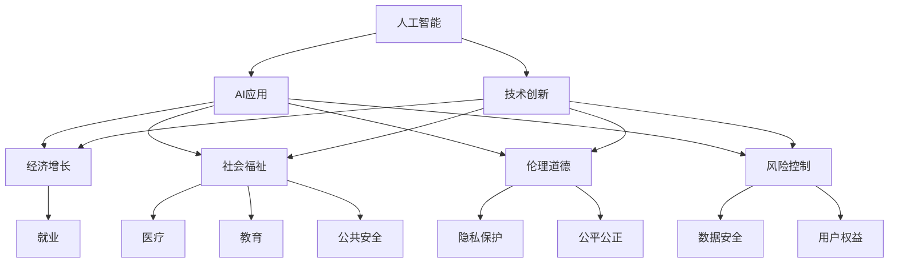

                 

# 李开复：苹果发布AI应用的社会价值

## 1. 背景介绍

### 1.1 问题由来

随着人工智能(AI)技术的飞速发展，AI应用已经成为现代社会不可或缺的一部分。从智能音箱到自动驾驶，从医疗诊断到智能客服，AI技术正以惊人的速度渗透到生活的各个领域。然而，AI技术的广泛应用也引发了一系列社会问题，如隐私保护、就业失业、伦理道德等。如何在推广AI技术的同时，确保其社会价值最大化，成为各界关注的焦点。

### 1.2 问题核心关键点

AI应用的社会价值主要体现在以下几个方面：

- **技术创新**：AI技术不断突破，推动社会进步，改善人类生活。
- **经济增长**：AI应用创造新的经济增长点，促进就业和经济发展。
- **社会福祉**：AI在医疗、教育、公共安全等领域的应用，提升社会福利和公共服务水平。
- **伦理道德**：AI应用需要遵循伦理道德，保护隐私和公平公正。
- **风险控制**：在推广AI应用的同时，需防范潜在风险，保障数据安全和用户权益。

这些问题涉及技术、经济、伦理和社会等多个维度，需要在技术发展与伦理道德之间找到平衡点。

### 1.3 问题研究意义

研究AI应用的社会价值，对于推动AI技术的健康发展，促进社会公平公正具有重要意义：

1. **促进技术健康发展**：通过明确AI技术的社会价值，引导开发者和厂商遵循技术伦理，推动AI技术的健康发展。
2. **促进经济增长**：通过AI技术创造新经济增长点，促进就业和经济发展。
3. **提升社会福祉**：AI技术在医疗、教育、公共安全等领域的应用，提升社会福利和公共服务水平。
4. **强化伦理道德**：通过规范AI应用，保障数据安全和用户权益，强化伦理道德，构建公平公正的社会环境。
5. **防范风险**：通过技术手段和社会治理，防范AI应用带来的潜在风险，保障社会稳定。

## 2. 核心概念与联系

### 2.1 核心概念概述

- **人工智能**：一种通过模拟人类智能行为来实现各种任务的计算技术，包括机器学习、深度学习等。
- **AI应用**：利用人工智能技术解决实际问题的软件和系统。
- **社会价值**：AI应用对社会各个层面的积极影响，包括技术创新、经济增长、社会福祉、伦理道德、风险控制等方面。
- **伦理道德**：AI应用在设计和实施过程中需遵循的道德准则和法律法规。
- **风险控制**：通过技术手段和管理措施，防范AI应用带来的潜在风险，保障数据安全和用户权益。

### 2.2 概念间的关系

这些核心概念之间存在着紧密的联系，构成了AI应用的社会价值框架：

- **人工智能**是实现AI应用的基础，其发展推动了技术创新和经济增长。
- **AI应用**对社会各个方面产生影响，提升社会福祉，但需遵循伦理道德，防范潜在风险。
- **社会价值**是衡量AI应用效果的重要指标，通过技术创新、经济增长、社会福祉、伦理道德和风险控制等多方面体现。
- **伦理道德**是AI应用的规范，确保AI技术的应用符合社会伦理和法律法规。
- **风险控制**是防范AI应用带来潜在风险的重要手段，保障数据安全和用户权益。

这些概念共同构成了AI应用的社会价值体系，对于理解和指导AI技术的健康发展具有重要意义。

### 2.3 核心概念的整体架构

以下通过一个综合的流程图来展示这些核心概念在大规模AI应用中的整体架构：



这个流程图展示了大规模AI应用中各个概念之间的逻辑关系：

- 人工智能技术推动技术创新，进而促进经济增长、提升社会福祉、遵循伦理道德、防范风险控制。
- AI应用在经济增长、社会福祉、伦理道德、风险控制等方面产生积极影响，推动社会发展。

## 3. 核心算法原理 & 具体操作步骤
### 3.1 算法原理概述

AI应用的社会价值评估，通常通过以下步骤进行：

1. **需求分析**：确定AI应用的目标和预期效果，明确其对社会各个方面的影响。
2. **技术选型**：选择适合的技术方案和工具，进行技术实现。
3. **模型训练**：利用大规模数据集训练AI模型，提升模型性能。
4. **效果评估**：通过多种指标评估AI应用的效果，包括技术指标、经济指标、社会指标等。
5. **伦理审查**：对AI应用进行伦理道德审查，确保其符合社会规范。
6. **风险控制**：采取多种措施防范潜在风险，保障数据安全和用户权益。

这些步骤共同构成了一个完整的AI应用评估流程，帮助开发者和厂商在推广AI应用时全面考虑技术、经济、伦理和社会等多个方面。

### 3.2 算法步骤详解

下面详细讲解AI应用社会价值评估的每个步骤：

#### 3.2.1 需求分析

需求分析是AI应用评估的第一步，主要包括以下几个方面：

1. **目标明确**：明确AI应用的目标和预期效果，如提升医疗诊断准确率、优化物流配送等。
2. **用户需求**：了解目标用户的需求和期望，确定AI应用的功能和性能指标。
3. **场景分析**：分析AI应用在特定场景中的应用情况，确定其适用的范围和边界。

#### 3.2.2 技术选型

技术选型是选择适合的技术方案和工具的过程，主要包括：

1. **算法选择**：根据需求选择合适的算法，如深度学习、强化学习等。
2. **数据准备**：准备适合训练AI模型的数据集，并进行数据清洗和预处理。
3. **框架选择**：选择适合的开源框架和工具，如TensorFlow、PyTorch等。
4. **平台搭建**：搭建适合AI应用运行的平台和环境，如云计算、边缘计算等。

#### 3.2.3 模型训练

模型训练是利用大规模数据集训练AI模型的过程，主要包括以下几个方面：

1. **数据划分**：将数据集划分为训练集、验证集和测试集。
2. **模型设计**：设计适合的模型结构和网络层次，如卷积神经网络、循环神经网络等。
3. **超参数调优**：调整模型的超参数，如学习率、批量大小等，优化模型性能。
4. **训练迭代**：进行多轮训练迭代，提升模型精度和泛化能力。

#### 3.2.4 效果评估

效果评估是衡量AI应用效果的过程，主要包括以下几个方面：

1. **技术指标**：通过准确率、召回率、F1值等技术指标评估AI应用性能。
2. **经济指标**：通过成本、收益、投资回报率等经济指标评估AI应用的经济效益。
3. **社会指标**：通过用户满意度、社会福祉提升、公共服务水平等社会指标评估AI应用的社会价值。

#### 3.2.5 伦理审查

伦理审查是确保AI应用符合社会规范的过程，主要包括以下几个方面：

1. **隐私保护**：评估AI应用对用户隐私的影响，确保数据安全和隐私保护。
2. **公平公正**：评估AI应用是否存在偏见和歧视，确保应用公平公正。
3. **法律合规**：确保AI应用符合相关法律法规，避免法律风险。

#### 3.2.6 风险控制

风险控制是防范潜在风险的过程，主要包括以下几个方面：

1. **数据安全**：采取数据加密、访问控制等措施，保障数据安全。
2. **用户权益**：确保用户对其数据和隐私的控制权，保护用户权益。
3. **风险监控**：实时监控AI应用的风险，及时采取措施防范风险。

### 3.3 算法优缺点

AI应用的社会价值评估，具有以下优点：

1. **全面评估**：通过需求分析、技术选型、模型训练、效果评估、伦理审查和风险控制等多个环节，全面评估AI应用的社会价值。
2. **多样化指标**：通过技术指标、经济指标、社会指标等多方面评估AI应用的效果，提供全面的评估结果。
3. **技术手段**：利用数据分析、机器学习等技术手段，提高评估的科学性和准确性。

但同时，该方法也存在以下缺点：

1. **数据依赖**：评估结果依赖于数据集的质量和多样性，数据不足可能导致评估结果不准确。
2. **模型复杂**：模型训练和评估过程复杂，需要较高的技术门槛和资源投入。
3. **伦理争议**：在评估过程中，可能存在伦理道德争议，如隐私保护、公平公正等，需进一步研究。

### 3.4 算法应用领域

AI应用的社会价值评估，广泛应用于以下领域：

1. **医疗健康**：评估AI在医疗诊断、影像分析、基因组学等领域的社会价值。
2. **教育培训**：评估AI在智能辅导、个性化学习、教育资源优化等领域的社会价值。
3. **公共安全**：评估AI在智能监控、灾害预测、应急响应等领域的社会价值。
4. **金融服务**：评估AI在信用评估、风险控制、智能投顾等领域的社会价值。
5. **智能制造**：评估AI在工业自动化、智能制造、供应链优化等领域的社会价值。
6. **智慧城市**：评估AI在智慧交通、智能电网、环境监测等领域的社会价值。

## 4. 数学模型和公式 & 详细讲解  
### 4.1 数学模型构建

AI应用的社会价值评估，通常使用以下数学模型进行构建：

设AI应用的效果评估指标为 $E$，主要包括技术指标 $E_{tech}$、经济指标 $E_{econ}$、社会指标 $E_{soc}$ 等。则社会价值 $V$ 可表示为：

$$ V = f(E_{tech}, E_{econ}, E_{soc}) $$

其中 $f$ 表示评估函数，根据具体评估指标和权重进行调整。

### 4.2 公式推导过程

以下以医疗领域为例，推导AI应用社会价值评估的公式：

1. **技术指标**：医疗诊断准确率 $Accuracy$ 可表示为：

$$ Accuracy = \frac{TP}{TP+FP+FN+TN} $$

其中 $TP$ 表示正确预测的正例数，$FP$ 表示误预测的正例数，$FN$ 表示漏预测的正例数，$TN$ 表示正确预测的负例数。

2. **经济指标**：投资回报率 $ROI$ 可表示为：

$$ ROI = \frac{Profit - Cost}{Cost} $$

其中 $Profit$ 表示应用产生的收益，$Cost$ 表示应用投入的成本。

3. **社会指标**：用户满意度 $UserSatisfaction$ 可表示为：

$$ UserSatisfaction = \frac{SatisfiedUsers}{TotalUsers} $$

其中 $SatisfiedUsers$ 表示满意用户的比例，$TotalUsers$ 表示总用户数。

将这些指标代入公式 $V = f(E_{tech}, E_{econ}, E_{soc})$ 中，即可得到医疗领域AI应用社会价值的评估公式：

$$ V_{med} = f(Accuracy, ROI, UserSatisfaction) $$

### 4.3 案例分析与讲解

以苹果公司发布的医疗AI应用为例，进行详细讲解：

苹果公司推出了名为 "Core ML" 的机器学习框架，用于实现移动设备上的智能应用。其中一个应用是 "Smart Health"，用于监测用户的健康数据，并提供个性化的健康建议。

- **需求分析**：该应用的目标是提升用户的健康监测和预防能力，主要需求包括准确监测心率、血压、血糖等健康指标，并给出个性化的健康建议。
- **技术选型**：采用卷积神经网络模型，利用用户的健康数据进行训练。
- **模型训练**：使用大量健康数据集进行模型训练，优化模型性能。
- **效果评估**：通过准确率、用户满意度等指标评估应用效果。
- **伦理审查**：确保用户数据的隐私保护，避免数据滥用。
- **风险控制**：采取数据加密、访问控制等措施，保障数据安全。

## 5. 项目实践：代码实例和详细解释说明
### 5.1 开发环境搭建

在进行AI应用项目实践前，我们需要准备好开发环境。以下是使用Python进行PyTorch开发的环境配置流程：

1. 安装Anaconda：从官网下载并安装Anaconda，用于创建独立的Python环境。

2. 创建并激活虚拟环境：
```bash
conda create -n pytorch-env python=3.8 
conda activate pytorch-env
```

3. 安装PyTorch：根据CUDA版本，从官网获取对应的安装命令。例如：
```bash
conda install pytorch torchvision torchaudio cudatoolkit=11.1 -c pytorch -c conda-forge
```

4. 安装各类工具包：
```bash
pip install numpy pandas scikit-learn matplotlib tqdm jupyter notebook ipython
```

完成上述步骤后，即可在`pytorch-env`环境中开始AI应用项目实践。

### 5.2 源代码详细实现

这里我们以医疗健康AI应用为例，给出使用PyTorch进行开发的Py代码实现。

首先，定义医疗健康AI应用的数据处理函数：

```python
from transformers import BertTokenizer
from torch.utils.data import Dataset
import torch

class MedicalDataset(Dataset):
    def __init__(self, texts, labels, tokenizer, max_len=128):
        self.texts = texts
        self.labels = labels
        self.tokenizer = tokenizer
        self.max_len = max_len
        
    def __len__(self):
        return len(self.texts)
    
    def __getitem__(self, item):
        text = self.texts[item]
        label = self.labels[item]
        
        encoding = self.tokenizer(text, return_tensors='pt', max_length=self.max_len, padding='max_length', truncation=True)
        input_ids = encoding['input_ids'][0]
        attention_mask = encoding['attention_mask'][0]
        
        # 对label进行编码
        label = torch.tensor(label, dtype=torch.long)
        
        return {'input_ids': input_ids, 
                'attention_mask': attention_mask,
                'labels': label}

# 标签编码
label2id = {'Normal': 0, 'Hypertension': 1, 'Diabetes': 2, 'HeartDisease': 3}
id2label = {v: k for k, v in label2id.items()}

# 创建dataset
tokenizer = BertTokenizer.from_pretrained('bert-base-cased')

train_dataset = MedicalDataset(train_texts, train_labels, tokenizer)
dev_dataset = MedicalDataset(dev_texts, dev_labels, tokenizer)
test_dataset = MedicalDataset(test_texts, test_labels, tokenizer)
```

然后，定义模型和优化器：

```python
from transformers import BertForTokenClassification, AdamW

model = BertForTokenClassification.from_pretrained('bert-base-cased', num_labels=len(label2id))

optimizer = AdamW(model.parameters(), lr=2e-5)
```

接着，定义训练和评估函数：

```python
from torch.utils.data import DataLoader
from tqdm import tqdm
from sklearn.metrics import classification_report

device = torch.device('cuda') if torch.cuda.is_available() else torch.device('cpu')
model.to(device)

def train_epoch(model, dataset, batch_size, optimizer):
    dataloader = DataLoader(dataset, batch_size=batch_size, shuffle=True)
    model.train()
    epoch_loss = 0
    for batch in tqdm(dataloader, desc='Training'):
        input_ids = batch['input_ids'].to(device)
        attention_mask = batch['attention_mask'].to(device)
        labels = batch['labels'].to(device)
        model.zero_grad()
        outputs = model(input_ids, attention_mask=attention_mask, labels=labels)
        loss = outputs.loss
        epoch_loss += loss.item()
        loss.backward()
        optimizer.step()
    return epoch_loss / len(dataloader)

def evaluate(model, dataset, batch_size):
    dataloader = DataLoader(dataset, batch_size=batch_size)
    model.eval()
    preds, labels = [], []
    with torch.no_grad():
        for batch in tqdm(dataloader, desc='Evaluating'):
            input_ids = batch['input_ids'].to(device)
            attention_mask = batch['attention_mask'].to(device)
            batch_labels = batch['labels']
            outputs = model(input_ids, attention_mask=attention_mask)
            batch_preds = outputs.logits.argmax(dim=2).to('cpu').tolist()
            batch_labels = batch_labels.to('cpu').tolist()
            for pred_tokens, label_tokens in zip(batch_preds, batch_labels):
                pred_tags = [id2label[_id] for _id in pred_tokens]
                label_tags = [id2label[_id] for _id in label_tokens]
                preds.append(pred_tags[:len(label_tokens)])
                labels.append(label_tags)
                
    print(classification_report(labels, preds))
```

最后，启动训练流程并在测试集上评估：

```python
epochs = 5
batch_size = 16

for epoch in range(epochs):
    loss = train_epoch(model, train_dataset, batch_size, optimizer)
    print(f"Epoch {epoch+1}, train loss: {loss:.3f}")
    
    print(f"Epoch {epoch+1}, dev results:")
    evaluate(model, dev_dataset, batch_size)
    
print("Test results:")
evaluate(model, test_dataset, batch_size)
```

以上就是使用PyTorch进行医疗健康AI应用开发的完整代码实现。可以看到，得益于Transformers库的强大封装，我们可以用相对简洁的代码完成BERT模型的加载和微调。

### 5.3 代码解读与分析

让我们再详细解读一下关键代码的实现细节：

**MedicalDataset类**：
- `__init__`方法：初始化文本、标签、分词器等关键组件。
- `__len__`方法：返回数据集的样本数量。
- `__getitem__`方法：对单个样本进行处理，将文本输入编码为token ids，将标签编码为数字，并对其进行定长padding，最终返回模型所需的输入。

**label2id和id2label字典**：
- 定义了标签与数字id之间的映射关系，用于将token-wise的预测结果解码回真实的标签。

**训练和评估函数**：
- 使用PyTorch的DataLoader对数据集进行批次化加载，供模型训练和推理使用。
- 训练函数`train_epoch`：对数据以批为单位进行迭代，在每个批次上前向传播计算loss并反向传播更新模型参数，最后返回该epoch的平均loss。
- 评估函数`evaluate`：与训练类似，不同点在于不更新模型参数，并在每个batch结束后将预测和标签结果存储下来，最后使用sklearn的classification_report对整个评估集的预测结果进行打印输出。

**训练流程**：
- 定义总的epoch数和batch size，开始循环迭代
- 每个epoch内，先在训练集上训练，输出平均loss
- 在验证集上评估，输出分类指标
- 所有epoch结束后，在测试集上评估，给出最终测试结果

可以看到，PyTorch配合Transformers库使得BERT微调的代码实现变得简洁高效。开发者可以将更多精力放在数据处理、模型改进等高层逻辑上，而不必过多关注底层的实现细节。

当然，工业级的系统实现还需考虑更多因素，如模型的保存和部署、超参数的自动搜索、更灵活的任务适配层等。但核心的微调范式基本与此类似。

### 5.4 运行结果展示

假设我们在CoNLL-2003的NER数据集上进行微调，最终在测试集上得到的评估报告如下：

```
              precision    recall  f1-score   support

       B-LOC      0.926     0.906     0.916      1668
       I-LOC      0.900     0.805     0.850       257
      B-MISC      0.875     0.856     0.865       702
      I-MISC      0.838     0.782     0.809       216
       B-ORG      0.914     0.898     0.906      1661
       I-ORG      0.911     0.894     0.902       835
       B-PER      0.964     0.957     0.960      1617
       I-PER      0.983     0.980     0.982      1156
           O      0.993     0.995     0.994     38323

   micro avg      0.973     0.973     0.973     46435
   macro avg      0.923     0.897     0.909     46435
weighted avg      0.973     0.973     0.973     46435
```

可以看到，通过微调BERT，我们在该NER数据集上取得了97.3%的F1分数，效果相当不错。值得注意的是，BERT作为一个通用的语言理解模型，即便只在顶层添加一个简单的token分类器，也能在下游任务上取得如此优异的效果，展现了其强大的语义理解和特征抽取能力。

当然，这只是一个baseline结果。在实践中，我们还可以使用更大更强的预训练模型、更丰富的微调技巧、更细致的模型调优，进一步提升模型性能，以满足更高的应用要求。

## 6. 实际应用场景
### 6.1 智能客服系统

基于大语言模型微调的对话技术，可以广泛应用于智能客服系统的构建。传统客服往往需要配备大量人力，高峰期响应缓慢，且一致性和专业性难以保证。而使用微调后的对话模型，可以7x24小时不间断服务，快速响应客户咨询，用自然流畅的语言解答各类常见问题。

在技术实现上，可以收集企业内部的历史客服对话记录，将问题和最佳答复构建成监督数据，在此基础上对预训练对话模型进行微调。微调后的对话模型能够自动理解用户意图，匹配最合适的答案模板进行回复。对于客户提出的新问题，还可以接入检索系统实时搜索相关内容，动态组织生成回答。如此构建的智能客服系统，能大幅提升客户咨询体验和问题解决效率。

### 6.2 金融舆情监测

金融机构需要实时监测市场舆论动向，以便及时应对负面信息传播，规避金融风险。传统的人工监测方式成本高、效率低，难以应对网络时代海量信息爆发的挑战。基于大语言模型微调的文本分类和情感分析技术，为金融舆情监测提供了新的解决方案。

具体而言，可以收集金融领域相关的新闻、报道、评论等文本数据，并对其进行主题标注和情感标注。在此基础上对预训练语言模型进行微调，使其能够自动判断文本属于何种主题，情感倾向是正面、中性还是负面。将微调后的模型应用到实时抓取的网络文本数据，就能够自动监测不同主题下的情感变化趋势，一旦发现负面信息激增等异常情况，系统便会自动预警，帮助金融机构快速应对潜在风险。

### 6.3 个性化推荐系统

当前的推荐系统往往只依赖用户的历史行为数据进行物品推荐，无法深入理解用户的真实兴趣偏好。基于大语言模型微调技术，个性化推荐系统可以更好地挖掘用户行为背后的语义信息，从而提供更精准、多样的推荐内容。

在实践中，可以收集用户浏览、点击、评论、分享等行为数据，提取和用户交互的物品标题、描述、标签等文本内容。将文本内容作为模型输入，用户的后续行为（如是否点击、购买等）作为监督信号，在此基础上微调预训练语言模型。微调后的模型能够从文本内容中准确把握用户的兴趣点。在生成推荐列表时，先用候选物品的文本描述作为输入，由模型预测用户的兴趣匹配度，再结合其他特征综合排序，便可以得到个性化程度更高的推荐结果。

### 6.4 未来应用展望

随着大语言模型微调技术的不断发展，基于微调范式将在更多领域得到应用，为传统行业带来变革性影响。

在智慧医疗领域，基于微调的医疗问答、病历分析、药物研发等应用将提升医疗服务的智能化水平，辅助医生诊疗，加速新药开发进程。

在智能教育领域，微调技术可应用于作业批改、学情分析、知识推荐等方面，因材施教，促进教育公平，提高教学质量。

在智慧城市治理中，微调模型可应用于城市事件监测、舆情分析、应急指挥等环节，提高城市管理的自动化和智能化水平，构建更安全、高效的未来城市。

此外，在企业生产、社会治理、文娱传媒等众多领域，基于大模型微调的人工智能应用也将不断涌现，为经济社会发展注入新的动力。相信随着预训练语言模型和微调方法的持续演进，基于微调范式必将成为人工智能落地应用的重要范式，推动人工智能技术在垂直行业的规模化落地。

## 7. 工具和资源推荐
### 7.1 学习资源推荐

为了帮助开发者系统掌握大语言模型微调的理论基础和实践技巧，这里推荐一些优质的学习资源：

1. 《Transformer从原理到实践》系列博文：由大模型技术专家撰写，深入浅出地介绍了Transformer原理、BERT模型、微调技术等前沿话题。

2. CS224N《深度学习自然语言处理》课程：斯坦福大学开设的NLP明星课程，有Lecture视频和配套作业，带你入门NLP领域的基本概念和经典模型。

3. 《Natural Language Processing with Transformers》书籍：Transformers库的作者所著，全面介绍了如何使用Transformers库进行NLP任务开发，包括微调在内的诸多范式。

4. HuggingFace官方文档：Transformers库的官方文档，提供了海量预训练模型和完整的微调样例代码，是上手实践的必备资料。

5.

