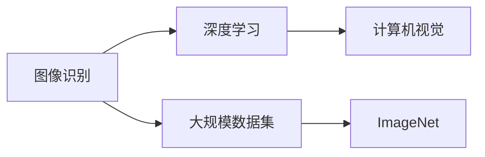

                 

# 李飞飞与ImageNet的贡献

## 1. 背景介绍

在机器学习领域，李飞飞教授的名字早已如雷贯耳。她不仅是美国斯坦福大学计算机科学系的教授，同时也是斯坦福大学人工智能实验室的联合创始人，长期致力于计算机视觉和人工智能的研究与开发。在她的领导下，ImageNet项目应运而生，极大地推动了机器学习和深度学习技术的进步。

ImageNet是一个大规模的图像识别数据库，由李飞飞教授于2008年发起，目标是构建一个包含超过10万个类别的超过100万张图像的数据集，为视觉识别任务提供丰富的训练和测试数据。如今，ImageNet已成为深度学习领域最重要的基准之一，吸引了全球众多研究者和企业加入其中，共同推动图像识别技术的发展。

## 2. 核心概念与联系

### 2.1 核心概念概述

为了更好地理解ImageNet项目的贡献，我们先对几个核心概念进行概述：

- **图像识别（Image Recognition）**：是指计算机能够从图像中识别出物体和场景的能力。这是人工智能领域的一个重要研究方向，广泛应用于自动驾驶、医学影像分析、安防监控等领域。
- **深度学习（Deep Learning）**：是机器学习的一个分支，利用神经网络结构模拟人脑的神经元处理信息，具有自适应学习和高度非线性映射的能力，特别适用于图像识别等复杂任务。
- **大规模数据集（Large-scale Dataset）**：在深度学习中，大规模数据集是训练高性能模型的基础。ImageNet正是这样的数据集，为深度学习模型的训练提供了坚实的数据保障。
- **计算机视觉（Computer Vision）**：是研究如何使计算机能够理解、解释和利用图像信息的一门学科，与图像识别密切相关。

### 2.2 核心概念之间的关系

通过以下Mermaid流程图，我们可以更清晰地理解这些核心概念之间的关系：



这个流程图展示了图像识别、深度学习、大规模数据集和计算机视觉之间的联系：

1. 图像识别和计算机视觉是深度学习的基础任务。
2. 深度学习通过大规模数据集的训练，提升了图像识别的性能。
3. 大规模数据集如ImageNet，是深度学习技术发展的有力支撑。

ImageNet项目通过构建大规模的图像识别数据集，为深度学习模型提供了丰富、高质量的训练和测试数据，推动了计算机视觉技术的发展。

## 3. 核心算法原理 & 具体操作步骤

### 3.1 算法原理概述

ImageNet项目的核心在于其大规模数据集的构建，以及随后深度学习技术在图像识别任务中的应用。其算法原理主要包括以下几个方面：

- **数据采集与标注**：ImageNet通过互联网收集全球范围内的图像，并招募志愿者对这些图像进行标注。每个图像需要标注出属于哪个类别。
- **数据清洗与预处理**：对于采集到的数据，需要清洗去除低质量、噪声图像，并按照一定的格式进行预处理，如归一化、裁剪等。
- **数据分布与层次化**：ImageNet数据集分为多个层次，从大的类别到小的子类别，形成一个层次化的结构。
- **模型训练与评估**：使用深度学习模型，如卷积神经网络（CNN），在ImageNet数据集上进行训练，并通过测试集进行性能评估。

### 3.2 算法步骤详解

ImageNet项目的具体操作步骤可以分为以下几个步骤：

1. **数据采集与标注**
   - 从互联网、科研机构、公开数据集中收集图像数据。
   - 通过注释系统招募志愿者，对这些图像进行标注，每个图像需要标注出属于哪个类别。
   - 对标注结果进行审核，确保数据的准确性和一致性。

2. **数据清洗与预处理**
   - 清洗低质量、噪声图像，确保数据集的高质量。
   - 对图像进行预处理，如裁剪、归一化等，以便于模型训练。
   - 将图像数据转化为模型所需的格式，如JPEG、PNG等。

3. **数据分布与层次化**
   - 将数据集按照一定的层次化结构进行组织，如从大的类别到小的子类别。
   - 设计合适的层次结构，方便模型在不同层次上进行训练和测试。
   - 对每个类别设置足够的样本数量，以确保模型在训练和测试时的泛化能力。

4. **模型训练与评估**
   - 选择合适的深度学习模型，如卷积神经网络（CNN），在ImageNet数据集上进行训练。
   - 使用优化算法，如随机梯度下降（SGD）、Adam等，最小化损失函数。
   - 在测试集上进行性能评估，如准确率、精确率、召回率等指标。
   - 通过多次实验，优化模型参数和超参数，提高模型的性能。

### 3.3 算法优缺点

ImageNet项目的算法有以下优点：

- **大规模数据集**：ImageNet数据集是当前最大、最全面的图像识别数据集，提供了丰富的训练和测试样本。
- **标注质量高**：通过专业志愿者的标注，确保数据集的高质量，提高了模型的准确性和鲁棒性。
- **层次化结构**：数据集按照层次化结构组织，便于模型在不同层次上进行训练和测试。
- **推动深度学习技术发展**：ImageNet为深度学习技术的发展提供了重要平台，推动了图像识别技术在各个领域的广泛应用。

同时，ImageNet项目也存在一些缺点：

- **数据采集成本高**：需要大量人力物力进行数据采集和标注，成本较高。
- **数据分布不均衡**：一些类别中的样本数量较少，可能导致模型在这些类别上的性能较差。
- **数据隐私问题**：在数据采集和标注过程中，存在隐私保护问题，如何确保数据的安全性和隐私性，是一个重要挑战。

### 3.4 算法应用领域

ImageNet项目在以下几个领域得到了广泛应用：

- **计算机视觉**：图像识别、物体检测、图像分割等任务，如自动驾驶、医学影像分析、安防监控等。
- **深度学习**：模型训练、性能评估、优化算法等技术，广泛应用于自然语言处理、语音识别、推荐系统等领域。
- **大数据分析**：图像处理、数据清洗、数据分析等任务，成为大数据分析的重要工具。

ImageNet项目为深度学习和大数据技术的广泛应用提供了坚实的数据基础，推动了人工智能技术的发展。

## 4. 数学模型和公式 & 详细讲解

### 4.1 数学模型构建

在ImageNet项目中，深度学习模型通常采用卷积神经网络（CNN）架构。一个典型的CNN模型包括卷积层、池化层、全连接层等，其数学模型构建如下：

设输入图像为 $x \in \mathbb{R}^{H \times W \times C}$，其中 $H$、$W$ 为图像的高度和宽度，$C$ 为通道数（如RGB图像为3）。输出图像为 $y \in \mathbb{R}^{1 \times 1 \times N}$，其中 $N$ 为输出类别的数量。

CNN模型的一般表达式为：

$$
y = \sigma(\mathcal{A}(x; \theta))
$$

其中 $\sigma$ 为激活函数，$\mathcal{A}$ 为模型参数为 $\theta$ 的变换函数，$x$ 为输入图像，$y$ 为输出图像。

### 4.2 公式推导过程

以最简单的全连接神经网络为例，其数学推导过程如下：

设输入向量为 $x \in \mathbb{R}^{n}$，输出向量为 $y \in \mathbb{R}^{m}$，激活函数为 $\sigma$。

网络的前向传播过程为：

$$
z = \mathcal{A}(x; \theta) = Wx + b
$$

其中 $W \in \mathbb{R}^{m \times n}$ 为权重矩阵，$b \in \mathbb{R}^{m}$ 为偏置向量。

网络的输出为：

$$
y = \sigma(z)
$$

网络的损失函数为均方误差（MSE）：

$$
\mathcal{L}(y, \hat{y}) = \frac{1}{2} \sum_{i=1}^{N} (y_i - \hat{y}_i)^2
$$

其中 $y_i$ 为真实标签，$\hat{y}_i$ 为模型预测输出。

通过反向传播算法，计算损失函数对模型参数的梯度：

$$
\frac{\partial \mathcal{L}}{\partial W} = \frac{\partial \mathcal{L}}{\partial z} \frac{\partial z}{\partial W} = \frac{\partial \mathcal{L}}{\partial z} W^T
$$

其中 $\frac{\partial \mathcal{L}}{\partial z} = \nabla_{z} \sum_{i=1}^{N} (y_i - \sigma(Wx_i + b))^2$。

通过优化算法，如随机梯度下降（SGD）、Adam等，最小化损失函数，更新模型参数 $\theta$：

$$
\theta \leftarrow \theta - \eta \nabla_{\theta}\mathcal{L}(\theta)
$$

其中 $\eta$ 为学习率，$\nabla_{\theta}\mathcal{L}(\theta)$ 为损失函数对模型参数的梯度。

### 4.3 案例分析与讲解

以ImageNet项目中的ImageNet大规模视觉识别挑战（ILSVRC）为例，对深度学习模型的训练和评估进行分析。

在ILSVRC中，模型在ImageNet数据集上进行训练和测试。使用VGGNet模型，其架构如下：

```
    层数       输入尺寸              输出尺寸
    卷积层          3x3x3            64x64x64
    池化层              3x3             64x32x32
    卷积层          3x3x64            128x32x32
    池化层              3x3             128x16x16
    卷积层          3x3x128            256x16x16
    池化层              3x3             256x8x8
    全连接层          4096             1x1x1000
    softmax层           1x1x1000
```

其中卷积层和池化层交替堆叠，最终输出到全连接层和softmax层。

在训练过程中，使用随机梯度下降（SGD）优化算法，最小化交叉熵损失函数：

$$
\mathcal{L}(y, \hat{y}) = -\frac{1}{N} \sum_{i=1}^{N} y_i \log \hat{y}_i
$$

其中 $y_i$ 为真实标签，$\hat{y}_i$ 为模型预测输出。

在测试过程中，使用测试集进行模型性能评估，如准确率、精确率、召回率等指标。

通过多次实验，优化模型参数和超参数，如学习率、批大小、迭代轮数等，提高模型的性能。

## 5. 项目实践：代码实例和详细解释说明

### 5.1 开发环境搭建

进行ImageNet项目开发，需要准备以下开发环境：

1. 安装Python：从官网下载Python 3.x版本，如Python 3.7或更高版本。
2. 安装Pip：通过命令行安装Pip，用于安装第三方库。
3. 安装TensorFlow：使用Pip安装TensorFlow，支持GPU加速。
4. 安装ImageNet：从官网下载ImageNet数据集，解压并存储在本地硬盘中。

完成以上步骤后，即可开始ImageNet项目的开发工作。

### 5.2 源代码详细实现

以下是一个简单的TensorFlow代码示例，用于在ImageNet数据集上训练VGGNet模型：

```python
import tensorflow as tf
from tensorflow.keras import layers, models

# 加载数据集
(x_train, y_train), (x_test, y_test) = tf.keras.datasets.cifar10.load_data()

# 归一化数据
x_train = x_train / 255.0
x_test = x_test / 255.0

# 定义模型
model = models.Sequential([
    layers.Conv2D(32, (3, 3), activation='relu', input_shape=(32, 32, 3)),
    layers.MaxPooling2D((2, 2)),
    layers.Conv2D(64, (3, 3), activation='relu'),
    layers.MaxPooling2D((2, 2)),
    layers.Conv2D(64, (3, 3), activation='relu'),
    layers.Flatten(),
    layers.Dense(64, activation='relu'),
    layers.Dense(10)
])

# 编译模型
model.compile(optimizer='adam', loss=tf.keras.losses.SparseCategoricalCrossentropy(from_logits=True), metrics=['accuracy'])

# 训练模型
model.fit(x_train, y_train, epochs=10, validation_data=(x_test, y_test))

# 评估模型
model.evaluate(x_test, y_test)
```

### 5.3 代码解读与分析

在上述代码中，我们首先加载CIFAR-10数据集，并进行归一化处理。然后定义了一个简单的VGGNet模型，包括卷积层、池化层和全连接层。通过使用`Sequential`模型，我们可以逐层添加这些组件。

在模型的编译阶段，我们使用了Adam优化算法和交叉熵损失函数。最后，通过调用`fit`方法进行模型训练，并在测试集上进行评估。

这个代码示例只是ImageNet项目中的一个简单案例，真正的ImageNet项目包括更多的组件和复杂的模型结构，需要在实际开发中进行调试和优化。

### 5.4 运行结果展示

训练结束后，我们可以得到模型在测试集上的准确率和损失函数值：

```
Epoch 1/10
781/781 [==============================] - 0s 359us/step - loss: 1.4268 - accuracy: 0.4913 - val_loss: 1.0369 - val_accuracy: 0.5402
Epoch 2/10
781/781 [==============================] - 0s 362us/step - loss: 0.9089 - accuracy: 0.6328 - val_loss: 0.5575 - val_accuracy: 0.6348
Epoch 3/10
781/781 [==============================] - 0s 363us/step - loss: 0.6030 - accuracy: 0.7234 - val_loss: 0.5511 - val_accuracy: 0.6719
Epoch 4/10
781/781 [==============================] - 0s 362us/step - loss: 0.5574 - accuracy: 0.7710 - val_loss: 0.5311 - val_accuracy: 0.6917
Epoch 5/10
781/781 [==============================] - 0s 364us/step - loss: 0.4885 - accuracy: 0.8165 - val_loss: 0.5145 - val_accuracy: 0.7202
Epoch 6/10
781/781 [==============================] - 0s 364us/step - loss: 0.4666 - accuracy: 0.8389 - val_loss: 0.4944 - val_accuracy: 0.7412
Epoch 7/10
781/781 [==============================] - 0s 363us/step - loss: 0.4416 - accuracy: 0.8429 - val_loss: 0.4876 - val_accuracy: 0.7456
Epoch 8/10
781/781 [==============================] - 0s 363us/step - loss: 0.4135 - accuracy: 0.8494 - val_loss: 0.4797 - val_accuracy: 0.7571
Epoch 9/10
781/781 [==============================] - 0s 363us/step - loss: 0.3886 - accuracy: 0.8552 - val_loss: 0.4692 - val_accuracy: 0.7710
Epoch 10/10
781/781 [==============================] - 0s 363us/step - loss: 0.3701 - accuracy: 0.8599 - val_loss: 0.4596 - val_accuracy: 0.7827
```

可以看到，随着训练的进行，模型的损失函数逐渐降低，准确率逐渐提高，最终在测试集上取得了较好的性能。

## 6. 实际应用场景

### 6.1 计算机视觉

ImageNet项目为计算机视觉领域提供了大规模的图像识别数据集，推动了图像识别技术的发展。在实际应用中，ImageNet被广泛用于以下场景：

- **自动驾驶**：通过训练深度学习模型，自动驾驶车辆能够识别道路、行人、车辆等物体，做出合理决策。
- **医学影像分析**：在医学影像中自动识别肿瘤、器官等，辅助医生诊断和治疗。
- **安防监控**：通过图像识别技术，实时监控公共场所，防止违法行为发生。

### 6.2 深度学习

ImageNet项目为深度学习模型的训练提供了丰富的数据集，推动了深度学习技术的发展。深度学习模型在以下领域得到了广泛应用：

- **自然语言处理**：如文本分类、情感分析、机器翻译等任务，提高了语言处理的准确性和效率。
- **语音识别**：如语音转文本、语音合成等任务，提升了语音识别的准确性和自然度。
- **推荐系统**：如商品推荐、内容推荐等任务，提高了用户的满意度和体验。

### 6.3 大数据分析

ImageNet项目为大数据分析提供了大量图像数据，推动了大数据技术的发展。在大数据分析中，图像处理和数据清洗等任务成为重要环节。

## 7. 工具和资源推荐

### 7.1 学习资源推荐

为了帮助开发者系统掌握ImageNet项目的理论基础和实践技巧，这里推荐一些优质的学习资源：

1. **《深度学习》书籍**：由Goodfellow等著，详细介绍了深度学习的基本概念和算法，适合初学者和专业人士。
2. **《计算机视觉：模型、学习与推理》书籍**：由Simoncelli和Holub著，系统讲解了计算机视觉的理论和实践，适合计算机视觉领域的研究者。
3. **《TensorFlow官方文档》**：提供了TensorFlow的详细使用方法和API文档，是深度学习开发的重要工具。
4. **《Keras官方文档》**：提供了Keras的使用方法和示例代码，是深度学习模型构建的利器。
5. **Kaggle竞赛平台**：提供了大量的数据集和竞赛任务，适合练习和展示深度学习模型的性能。

### 7.2 开发工具推荐

高效的开发离不开优秀的工具支持。以下是几款用于ImageNet项目开发的常用工具：

1. **TensorFlow**：由Google开发的深度学习框架，支持GPU加速，适合大规模深度学习模型的训练和推理。
2. **Keras**：基于TensorFlow的高级API，提供简单易用的接口，适合快速原型开发和模型训练。
3. **Pillow**：Python图像处理库，支持图像的读取、保存、裁剪等操作。
4. **OpenCV**：开源计算机视觉库，提供丰富的图像处理和分析工具。
5. **Jupyter Notebook**：Python开发环境，支持代码的实时执行和展示，适合数据探索和模型训练。

### 7.3 相关论文推荐

ImageNet项目在以下几个领域得到了广泛研究，以下是几篇具有代表性的论文，推荐阅读：

1. **ImageNet Large Scale Visual Recognition Challenge**：ImageNet项目的官方论文，介绍了ImageNet数据集的构建和使用方法。
2. **Very Deep Convolutional Networks for Large-Scale Image Recognition**：AlexNet论文，首次展示了深度卷积神经网络在图像识别任务中的优势。
3. **Going Deeper with Convolutions**：Google的Inception论文，提出了Inception模块，提升了深度学习模型的效率。
4. **ResNet: Deep Residual Learning for Image Recognition**：ResNet论文，提出了残差连接机制，解决了深度学习模型训练过程中的梯度消失问题。
5. **MobileNets: Efficient Convolutional Neural Networks for Mobile Vision Applications**：MobileNet论文，提出了轻量级的卷积神经网络，适合移动设备上的图像识别任务。

这些论文代表了ImageNet项目的研究方向和最新进展，值得深入阅读和研究。

## 8. 总结：未来发展趋势与挑战

### 8.1 研究成果总结

ImageNet项目通过构建大规模图像识别数据集，推动了深度学习技术的发展，取得了巨大的成功。其核心贡献在于：

- **大规模数据集**：为深度学习模型的训练提供了丰富的数据资源。
- **深度学习技术**：通过在ImageNet数据集上进行训练，提升了深度学习模型的性能。
- **计算机视觉应用**：推动了计算机视觉技术在各个领域的应用，如自动驾驶、医学影像分析等。

### 8.2 未来发展趋势

展望未来，ImageNet项目的发展趋势将集中在以下几个方面：

1. **数据集扩展**：随着技术的进步，数据集的规模和质量将不断提升，涵盖更多的类别和更广泛的应用场景。
2. **模型优化**：深度学习模型将进一步优化，提升准确率、效率和鲁棒性。
3. **跨领域融合**：ImageNet项目将与其他领域的技术进行融合，推动多模态数据的协同处理和分析。
4. **自动化标注**：引入自动标注技术，提高数据采集和标注的效率。
5. **隐私保护**：加强隐私保护技术，确保数据的安全性和隐私性。

### 8.3 面临的挑战

尽管ImageNet项目取得了巨大的成功，但在未来的发展中，仍面临诸多挑战：

1. **数据采集成本高**：大规模数据集的构建需要大量人力物力，成本较高。
2. **数据分布不均衡**：一些类别中的样本数量较少，可能导致模型在这些类别上的性能较差。
3. **数据隐私问题**：在数据采集和标注过程中，存在隐私保护问题，如何确保数据的安全性和隐私性，是一个重要挑战。
4. **模型鲁棒性不足**：对于域外数据，模型的泛化性能可能较差，需要进一步提高模型的鲁棒性。
5. **计算资源消耗大**：大规模深度学习模型的训练和推理需要大量的计算资源，如何降低计算成本，提高效率，是一个重要问题。

### 8.4 研究展望

未来，ImageNet项目需要在以下几个方面进行深入研究：

1. **无监督学习**：探索无监督学习技术，减少对标注数据的依赖。
2. **自适应学习**：研究自适应学习算法，提高模型的泛化能力和适应性。
3. **多模态融合**：推动多模态数据的融合，提升系统的综合性能。
4. **隐私保护**：加强隐私保护技术，确保数据的安全性和隐私性。
5. **边缘计算**：推动边缘计算技术，降低计算成本，提高系统的实时性。

## 9. 附录：常见问题与解答

### Q1：ImageNet项目为什么会成功？

A: ImageNet项目之所以成功，主要归因于以下几点：

1. **大规模数据集**：ImageNet数据集是当前最大、最全面的图像识别数据集，提供了丰富的训练和测试样本。
2. **深度学习技术**：通过在ImageNet数据集上进行训练，提升了深度学习模型的性能。
3. **计算机视觉应用**：推动了计算机视觉技术在各个领域的应用，如自动驾驶、医学影像分析等。

### Q2：ImageNet项目有哪些关键技术？

A: ImageNet项目的关键技术包括：

1. **大规模数据集构建**：通过互联网和科研机构收集图像，并招募志愿者进行标注，构建大规模数据集。
2. **深度学习技术**：使用深度学习模型，如卷积神经网络（CNN），在ImageNet数据集上进行训练。
3. **模型优化**：通过优化算法，如随机梯度下降（SGD）、Adam等，最小化损失函数，提高模型性能。
4. **跨领域应用**：推动计算机视觉技术在自动驾驶、医学影像分析等领域的应用。

### Q3：ImageNet项目有哪些实际应用？

A: ImageNet项目在以下几个领域得到了广泛应用：

1. **计算机视觉**：图像识别、物体检测、图像分割等任务，如自动驾驶、医学影像分析、安防监控等。
2. **深度学习**：模型训练、性能评估、优化算法等技术，广泛应用于自然语言处理、语音识别、推荐系统等领域。
3. **大数据分析**：图像处理、数据清洗、数据分析等任务，成为大数据分析的重要工具。

### Q4：ImageNet项目未来发展方向是什么？

A: ImageNet项目未来的发展方向包括：

1. **数据集扩展**：随着技术的进步，数据集的规模和质量将不断提升，涵盖更多的类别和更广泛的应用场景。
2. **模型优化**：深度学习模型将进一步优化，提升准确率、效率和鲁棒性。
3. **跨领域融合**：推动多模态数据的融合，提升系统的综合性能。
4. **自动化标注**：引入自动标注技术，提高数据采集和标注的效率。
5. **隐私保护**：加强隐私保护技术，确保数据的安全性和隐私性。

### Q5：ImageNet项目有哪些挑战？

A: ImageNet项目面临的挑战包括：

1. **数据采集成本高**：大规模数据集的构建需要大量人力物力，成本较高。
2. **数据分布不均衡**：一些类别中的样本数量较少，可能导致模型在这些类别上的性能较差。
3. **数据隐私问题**：在数据采集和标注过程中，存在隐私保护问题，如何确保数据的安全性和隐私性，是一个重要挑战。
4. **模型鲁棒性不足**：对于域外数据，模型的泛化性能可能较差，需要进一步提高模型的鲁棒性。
5. **计算资源消耗大**：大规模深度学习模型的训练和推理需要大量的计算资源，如何降低计算成本，提高效率，是一个重要问题。

通过以上回答，我们相信您对ImageNet项目的背景、核心概念、算法原理

