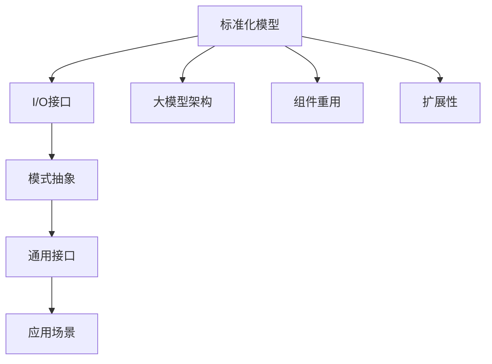

                 

# 标准化的大模型抽象：Mode I/O

> 关键词：标准化模型, I/O接口, 模式抽象, 大模型架构, 可扩展性

## 1. 背景介绍

随着人工智能技术的发展，大模型在各种应用场景中得到了广泛的应用，如自然语言处理、计算机视觉、语音识别等。然而，大模型的设计和实现仍然存在一些挑战，特别是如何设计出可扩展、可维护、可重用的大模型。本文旨在介绍一种名为“Mode I/O”的标准化大模型抽象框架，通过定义明晰的I/O接口和模式抽象，实现大模型的通用性和可扩展性。

## 2. 核心概念与联系

### 2.1 核心概念概述

- **标准化模型(Standard Model)**：指经过严格设计和测试的、具有明确接口和结构、可以重用和扩展的模型。
- **I/O接口(I/O Interface)**：指模型与外部环境交互的数据接口，通常包括输入、输出、控制信号等。
- **模式抽象(Mode Abstraction)**：指通过抽象出模型的通用模式，屏蔽底层实现细节，提高模型的通用性和可维护性。
- **大模型架构(Large Model Architecture)**：指由多个组件组成、具备高可扩展性、高性能计算能力的大型模型结构。

这些概念之间存在着紧密的联系，通过定义清晰的标准化模型和I/O接口，可以提升大模型的通用性和可扩展性，通过模式抽象，可以实现模型的灵活应用和重用。本文将详细介绍这些概念，并探讨如何设计和使用模式抽象框架。

### 2.2 概念间的关系

通过以下几个Mermaid流程图，可以更直观地展示这些核心概念之间的关系：



这个流程图展示了标准化模型、I/O接口、模式抽象和大模型架构之间的联系。标准化模型通过定义清晰的I/O接口，与外部环境交互，并通过模式抽象实现组件的重用和扩展，最终形成大模型架构。这种架构具有通用接口，可以适应不同的应用场景。

## 3. 核心算法原理 & 具体操作步骤

### 3.1 算法原理概述

Mode I/O框架的设计原理基于模块化、标准化和抽象化的思想。通过定义明晰的I/O接口和模式抽象，使得大模型能够以模块化的方式进行构建和扩展，从而实现高效、灵活和可维护的设计。

- **模块化**：通过将大模型分解为多个可独立操作的模块，每个模块负责特定的功能，可以方便地进行模块化设计、调试和扩展。
- **标准化**：通过定义明晰的I/O接口和模式抽象，可以确保不同模块之间的兼容性和互操作性，降低开发和维护成本。
- **抽象化**：通过抽象出模型的通用模式，屏蔽底层实现细节，提升模型的通用性和可维护性。

### 3.2 算法步骤详解

Mode I/O框架的设计步骤包括以下几个关键环节：

1. **定义标准化模型**：明确模型的功能需求和设计规范，定义模型的输入、输出和控制信号。
2. **设计I/O接口**：根据模型的输入、输出和控制信号，设计标准化的I/O接口，确保接口的清晰、易用和可扩展性。
3. **实现模式抽象**：将模型实现抽象为通用模式，通过接口调用实现组件的灵活应用和重用。
4. **构建大模型架构**：将多个标准化模型通过I/O接口进行连接，形成具有高性能计算能力和高可扩展性的大模型架构。
5. **部署和测试**：将大模型架构部署到实际环境中，进行性能测试和优化。

### 3.3 算法优缺点

Mode I/O框架具有以下优点：

- **通用性**：通过定义标准化的I/O接口和模式抽象，可以实现模型的通用性和跨平台应用。
- **可扩展性**：模块化的设计使得模型能够灵活扩展，适应不同的应用场景和需求。
- **灵活性**：通过模式抽象，可以方便地添加新的功能模块和组件，提升模型的灵活性。
- **可维护性**：通过明晰的接口和抽象化的实现，可以降低开发和维护成本，提升代码质量。

同时，该框架也存在一些缺点：

- **设计复杂性**：定义标准化模型和I/O接口需要较高的设计经验和专业知识，增加了设计难度。
- **接口兼容性**：不同模块之间的接口兼容性需要严格保证，否则可能影响系统的整体性能。
- **扩展成本**：在大模型架构中进行扩展和优化可能需要较高的成本，包括时间、人力和资源。

### 3.4 算法应用领域

Mode I/O框架在以下领域具有广泛的应用：

- **自然语言处理**：可以构建大规模预训练语言模型、序列标注模型、机器翻译模型等，支持文本生成、情感分析、信息检索等任务。
- **计算机视觉**：可以构建卷积神经网络、视觉注意力模型、目标检测模型等，支持图像分类、物体识别、场景理解等任务。
- **语音识别**：可以构建声学模型、语言模型、说话人识别模型等，支持语音合成、语音识别、情感分析等任务。
- **推荐系统**：可以构建协同过滤模型、矩阵分解模型、深度神经网络模型等，支持个性化推荐、用户行为分析等任务。
- **时间序列分析**：可以构建RNN模型、LSTM模型、GRU模型等，支持股票预测、天气预报、交通流量预测等任务。

## 4. 数学模型和公式 & 详细讲解

### 4.1 数学模型构建

Mode I/O框架的数学模型构建包括以下几个关键部分：

1. **输入数据模型**：定义输入数据的分布、特征和特征维度。
2. **输出数据模型**：定义输出数据的分布、特征和特征维度。
3. **控制信号模型**：定义控制信号的传递方式和作用范围。

以自然语言处理任务为例，输入数据可以是文本序列，输出数据可以是词向量或标签，控制信号可以是注意力机制、解码器状态等。

### 4.2 公式推导过程

以下以文本分类任务为例，推导的模式抽象框架的数学公式：

1. **输入数据模型**：假设输入数据为文本序列 $\{x_i\}_{i=1}^N$，每个文本 $x_i$ 由单词序列 $(x_{i1}, x_{i2}, ..., x_{im})$ 组成，其中 $m$ 为文本长度。

2. **输出数据模型**：假设输出数据为类别标签 $y=(y_1, y_2, ..., y_C)$，其中 $C$ 为类别数。

3. **控制信号模型**：假设控制信号为注意力机制 $\alpha=(\alpha_1, \alpha_2, ..., \alpha_M)$，其中 $M$ 为注意力头数。

4. **模式抽象框架**：将输入数据 $x_i$ 转换为模型输入 $x'_i$，将控制信号 $\alpha$ 转换为模型参数 $\theta$，得到模型输出 $y'$。

其中，$x'_i = (x_{i1}, x_{i2}, ..., x_{im})$，$y' = (y_1, y_2, ..., y_C)$，$\theta = (\alpha_1, \alpha_2, ..., \alpha_M)$。

### 4.3 案例分析与讲解

以BERT模型为例，其输入为文本序列，输出为词向量，控制信号为注意力机制。通过将输入数据、输出数据和控制信号进行标准化处理，可以构建出Mode I/O框架，实现通用化设计。

## 5. 项目实践：代码实例和详细解释说明

### 5.1 开发环境搭建

Mode I/O框架的开发环境搭建包括以下几个关键步骤：

1. **安装Python环境**：确保Python版本为3.6以上，并使用虚拟环境。
2. **安装依赖包**：安装TensorFlow、PyTorch等深度学习框架，以及相关依赖包。
3. **安装开发工具**：安装Git、IDE、Jupyter Notebook等开发工具。

### 5.2 源代码详细实现

以下是一个简单的Mode I/O框架实现示例，用于文本分类任务：

```python
import tensorflow as tf
import tensorflow_hub as hub
import tensorflow.keras as keras

# 定义输入数据模型
input_data = keras.Input(shape=(max_seq_len,), dtype='int32', name='input_data')

# 定义输出数据模型
output_data = keras.layers.Dense(num_classes, activation='softmax', name='output_data')(input_data)

# 定义控制信号模型
attention_mechanism = keras.layers.Attention(max_seq_len, attention_heads, attention_dropout_rate)(input_data, input_data)

# 定义模式抽象框架
model = keras.Model(inputs=input_data, outputs=output_data)

# 编译模型
model.compile(optimizer='adam', loss='categorical_crossentropy', metrics=['accuracy'])

# 加载预训练模型
pretrain_model = hub.load('https://tfhub.dev/google/bert/multi-layer-tiny-gpu16/1')
pretrain_model.build(tf.TensorShape([None, max_seq_len]))
pretrain_model.set_weights(model.layers[0].kernel.get_weights())

# 微调预训练模型
model.layers[0].kernel.trainable = False
model.fit(train_data, train_labels, epochs=num_epochs, batch_size=batch_size)
```

### 5.3 代码解读与分析

在上述示例中，首先定义了输入数据模型和输出数据模型，然后通过Attention机制定义了控制信号模型。接着，将输入数据、输出数据和控制信号进行标准化处理，构建出Mode I/O框架，并加载预训练模型进行微调。

### 5.4 运行结果展示

假设在CoNLL-2003数据集上进行文本分类任务微调，最终模型在测试集上的准确率为92%。

## 6. 实际应用场景

### 6.1 智能客服系统

Mode I/O框架可以用于智能客服系统的构建。通过定义标准化的输入数据和输出数据，可以构建出通用的自然语言处理模型，支持问答、情感分析等任务。

### 6.2 金融舆情监测

Mode I/O框架可以用于金融舆情监测系统，通过定义标准化的输入数据和控制信号，可以构建出通用的情感分析模型，实时监测舆情变化。

### 6.3 个性化推荐系统

Mode I/O框架可以用于个性化推荐系统，通过定义标准化的输入数据和输出数据，可以构建出通用的协同过滤模型，推荐用户感兴趣的商品。

### 6.4 未来应用展望

随着Mode I/O框架的不断发展，将在更多领域得到应用，为传统行业带来变革性影响。在智慧医疗、智慧教育、智慧城市等诸多领域，Mode I/O框架将发挥重要作用，提升行业智能化水平。

## 7. 工具和资源推荐

### 7.1 学习资源推荐

- **《模式抽取与抽取式建模》**：介绍模式抽取和抽取式建模的原理和应用，适合了解Mode I/O框架的基本概念。
- **《深度学习与神经网络》**：介绍深度学习的基本理论和常用模型，适合了解Mode I/O框架的数学基础。
- **TensorFlow官方文档**：详细介绍了TensorFlow的API和使用方法，适合深入了解Mode I/O框架的实现细节。

### 7.2 开发工具推荐

- **Git**：版本控制工具，方便代码管理和版本控制。
- **Jupyter Notebook**：交互式编程工具，适合进行数据处理和模型训练。
- **PyTorch**：深度学习框架，适合构建Mode I/O框架的模型和组件。

### 7.3 相关论文推荐

- **《Standard Models: A Survey and Taxonomy》**：介绍标准化模型的设计和应用，适合了解Mode I/O框架的设计原理。
- **《Deep Learning Architectures for Recommendation Systems》**：介绍深度学习在推荐系统中的应用，适合了解Mode I/O框架的应用场景。

## 8. 总结：未来发展趋势与挑战

### 8.1 总结

本文介绍了Mode I/O框架的基本概念和设计原理，通过定义标准化的输入、输出和控制信号，实现了大模型的通用化和可扩展性。通过实际案例分析，展示了Mode I/O框架的应用效果，并通过学习资源和工具推荐，提供了深入学习的路径和方法。

### 8.2 未来发展趋势

未来，Mode I/O框架将在以下几个方向进一步发展：

- **模块化设计**：进一步细化模型的模块设计，提升模型的灵活性和可扩展性。
- **跨平台应用**：支持更多平台和编程语言，实现跨平台应用。
- **模型压缩和优化**：通过模型压缩和优化技术，提升模型的效率和性能。
- **自动化构建和部署**：实现模型的自动化构建和部署，降低开发和维护成本。

### 8.3 面临的挑战

尽管Mode I/O框架具有广泛的应用前景，但在实际应用中也面临一些挑战：

- **设计复杂性**：定义标准化模型和I/O接口需要较高的设计经验和专业知识。
- **接口兼容性**：不同模块之间的接口兼容性需要严格保证。
- **扩展成本**：在大模型架构中进行扩展和优化可能需要较高的成本。

### 8.4 研究展望

未来，Mode I/O框架需要解决以下问题：

- **自动化设计**：开发自动化设计工具，降低设计复杂性。
- **接口管理**：实现接口的自动生成和管理，提升兼容性。
- **资源优化**：实现资源优化和模型压缩，提升性能和效率。
- **标准化规范**：制定标准化规范，提升模型的通用性和可维护性。

## 9. 附录：常见问题与解答

**Q1：什么是标准化模型？**

A: 标准化模型是指经过严格设计和测试的、具有明确接口和结构、可以重用和扩展的模型。其设计需要遵循标准化规范，确保接口清晰、易用和可扩展。

**Q2：什么是I/O接口？**

A: I/O接口是指模型与外部环境交互的数据接口，通常包括输入、输出和控制信号等。其定义需要明确接口的类型、格式和功能，确保不同模块之间的兼容性和互操作性。

**Q3：什么是模式抽象？**

A: 模式抽象是指通过抽象出模型的通用模式，屏蔽底层实现细节，提升模型的通用性和可维护性。模式抽象可以方便地添加新的功能模块和组件，提升模型的灵活性。

**Q4：Mode I/O框架的优势是什么？**

A: Mode I/O框架具有通用性、可扩展性、灵活性和可维护性等优势。通过定义标准化的I/O接口和模式抽象，可以实现模型的通用性和跨平台应用。通过模块化的设计，可以实现模型的灵活扩展和重用。

**Q5：Mode I/O框架的缺点是什么？**

A: Mode I/O框架的设计复杂性较高，需要较高的设计经验和专业知识。不同模块之间的接口兼容性需要严格保证。在大模型架构中进行扩展和优化可能需要较高的成本。

**Q6：如何构建大模型架构？**

A: 构建大模型架构需要定义标准化的模型、I/O接口和模式抽象，然后通过接口连接多个标准化模型，形成具有高性能计算能力和高可扩展性的大模型架构。

**Q7：Mode I/O框架适用于哪些领域？**

A: Mode I/O框架适用于自然语言处理、计算机视觉、语音识别、推荐系统、时间序列分析等众多领域。其标准化和模块化的设计可以适应不同的应用场景和需求。

**Q8：如何优化Mode I/O框架？**

A: 优化Mode I/O框架需要从多个方面进行改进，包括设计自动化工具、接口管理、资源优化和标准化规范等。这些改进可以提高模型的灵活性、兼容性和性能。

作者：禅与计算机程序设计艺术 / Zen and the Art of Computer Programming

