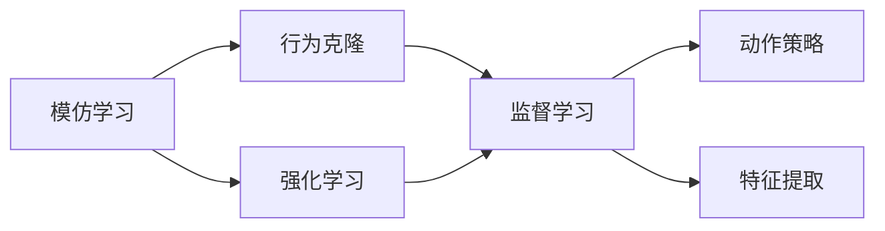
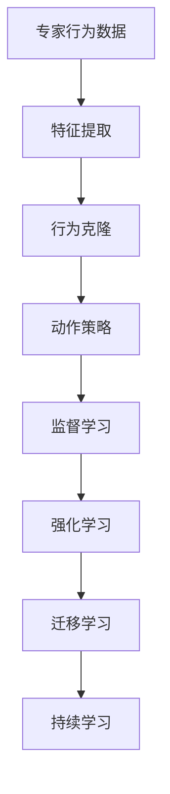

                 

# 模仿学习 (Imitation Learning) 原理与代码实例讲解

## 1. 背景介绍

### 1.1 问题由来
模仿学习（Imitation Learning），又称为行为克隆（Behavior Cloning）或行为复制（Behavior Replication），是一种机器学习方法，其目标是通过观察一组专家行为或示范数据，学习如何执行相同的任务。模仿学习广泛应用于自动驾驶、机器人控制、游戏AI、医疗诊断等多个领域。

近年来，模仿学习的研究逐渐增多，特别是在强化学习（Reinforcement Learning, RL）领域，模仿学习被认为是解决复杂任务的一种有效手段。例如，在自动驾驶中，通过观察专家驾驶员的行为，让自动驾驶汽车学习如何安全行驶；在游戏AI中，通过观察人类玩家的策略，训练机器人学习游戏技巧。模仿学习的目标是让机器学习到与人类或专家相同的动作策略，从而在特定任务上实现高性能。

### 1.2 问题核心关键点
模仿学习的核心思想是通过观察专家的行为数据，学习如何执行相同的任务。其核心流程包括数据收集、特征提取、模型训练和行为输出等步骤。模仿学习的过程不需要定义明确的奖励函数，也不需要反复试错，因此相较于传统的强化学习，模仿学习在处理不确定性和复杂性方面具有明显优势。

模仿学习的关键在于：
1. 数据获取：获取高质量的专家行为数据，数据的数量和质量直接影响到学习的效果。
2. 特征提取：从原始数据中提取出有用的特征，用于描述专家的行为。
3. 模型训练：使用机器学习算法训练模型，将特征与行为输出进行映射。
4. 行为输出：模型预测出与专家行为相似的策略，进行行为复制。

在实际应用中，模仿学习通常与强化学习结合使用。例如，在自动驾驶中，首先通过模仿学习让汽车学习专家驾驶员的行为，然后通过强化学习优化汽车的驾驶策略，提高安全性和稳定性。

### 1.3 问题研究意义
模仿学习的研究和应用具有重要意义：

1. 提高学习效率：模仿学习通过观察专家行为，可以迅速学习和掌握新技能，避免了传统强化学习中的试错过程。
2. 降低复杂性：模仿学习不需要定义复杂的奖励函数，适用于处理复杂、不确定的任务，如自动驾驶和游戏AI等。
3. 应用广泛：模仿学习可以应用于多个领域，如医疗、金融、制造等，为这些领域带来了新的解决方案。
4. 降低成本：模仿学习可以节省大量的实验成本，特别是在高风险、高成本的任务中，模仿学习更为经济高效。
5. 安全可靠：模仿学习可以减少风险和不确定性，通过学习专家的行为，确保系统的稳定性和安全性。

## 2. 核心概念与联系

### 2.1 核心概念概述

为了更好地理解模仿学习的基本原理，本节将介绍几个密切相关的核心概念：

- 模仿学习（Imitation Learning）：通过观察专家的行为数据，学习如何执行相同的任务。模仿学习的目标是从专家行为中提取通用的动作策略，以实现高效的模仿。
- 行为克隆（Behavior Cloning）：一种特殊的模仿学习范式，使用监督学习方法，通过专家行为数据训练模型，学习如何执行相同任务。
- 动作策略（Action Policy）：在任务中，模型需要执行的一系列动作序列。动作策略描述了模型如何从当前状态到下一个状态的转移。
- 特征提取（Feature Extraction）：从原始数据中提取出有用的特征，用于描述任务和行为。特征提取是模仿学习中非常重要的一步，直接影响模型的学习效果。
- 强化学习（Reinforcement Learning, RL）：通过与环境的交互，让机器学习如何最大化某种奖励函数。模仿学习通常作为强化学习的前置步骤，帮助机器更快地学习新技能。

这些核心概念之间存在着紧密的联系，形成了模仿学习的完整生态系统。通过理解这些核心概念，我们可以更好地把握模仿学习的本质和应用方向。

### 2.2 概念间的关系

这些核心概念之间存在着紧密的联系，形成了模仿学习的完整生态系统。下面我们通过几个Mermaid流程图来展示这些概念之间的关系。



这个流程图展示了大语言模型微调过程中各个核心概念的关系：

1. 模仿学习通过行为克隆，使用监督学习方法，从专家行为数据中学习动作策略。
2. 模仿学习可以作为强化学习的前置步骤，帮助机器更快地学习新技能。
3. 动作策略是模仿学习的目标，描述了模型如何从当前状态到下一个状态的转移。
4. 特征提取是模仿学习中非常重要的一步，用于描述任务和行为。

通过这些核心概念的组合，模仿学习可以应用于多个领域，如自动驾驶、游戏AI、医疗诊断等，为这些领域带来了新的解决方案。

### 2.3 核心概念的整体架构

最后，我们用一个综合的流程图来展示这些核心概念在大语言模型微调过程中的整体架构：



这个综合流程图展示了从专家行为数据到模型输出的完整流程：

1. 专家行为数据：收集专家行为数据，用于模仿学习。
2. 特征提取：从原始数据中提取出有用的特征。
3. 行为克隆：使用监督学习方法，从专家行为数据中学习动作策略。
4. 动作策略：描述了模型如何从当前状态到下一个状态的转移。
5. 监督学习：使用监督学习方法，训练模型，学习专家行为。
6. 强化学习：通过与环境的交互，进一步优化模型，提高执行任务的效率。
7. 迁移学习：将学习的动作策略迁移到新任务中，扩展应用范围。
8. 持续学习：模型在新的环境中不断学习，保持性能的稳定性。

通过这些流程的组合，模仿学习可以实现高效、稳定的学习过程，为多个领域带来新的解决方案。

## 3. 核心算法原理 & 具体操作步骤
### 3.1 算法原理概述

模仿学习的基本原理是通过观察专家的行为数据，学习如何执行相同的任务。具体来说，模仿学习的目标是从专家行为中提取通用的动作策略，以实现高效的模仿。

模仿学习的关键在于：
1. 数据获取：获取高质量的专家行为数据，数据的数量和质量直接影响到学习的效果。
2. 特征提取：从原始数据中提取出有用的特征，用于描述专家的行为。
3. 模型训练：使用机器学习算法训练模型，将特征与行为输出进行映射。
4. 行为输出：模型预测出与专家行为相似的策略，进行行为复制。

在实际操作中，模仿学习通常使用监督学习方法进行模型训练，即通过专家行为数据，训练一个预测模型，输出与专家行为相似的策略。

### 3.2 算法步骤详解

模仿学习的具体步骤包括数据收集、特征提取、模型训练和行为输出等步骤。下面我们详细介绍这些步骤：

**Step 1: 数据收集**

1. 收集专家行为数据：获取高质量的专家行为数据，包括动作、位置、速度等。
2. 数据预处理：对原始数据进行清洗和预处理，去除噪声和不相关数据。
3. 数据划分：将数据划分为训练集、验证集和测试集。

**Step 2: 特征提取**

1. 特征提取：从原始数据中提取出有用的特征，用于描述专家的行为。常用的特征提取方法包括：
   - 特征工程：通过手工设计特征，描述任务和行为。
   - 机器学习方法：使用机器学习算法自动提取特征，如PCA、LDA等。
   - 深度学习方法：使用神经网络自动提取高层次特征，如CNN、RNN等。

2. 特征选择：选择对任务影响最大的特征，以减少模型的计算量和噪声。

**Step 3: 模型训练**

1. 选择模型：根据任务特点，选择合适的机器学习模型，如线性回归、决策树、神经网络等。
2. 训练模型：使用专家行为数据训练模型，将特征与行为输出进行映射。常用的训练方法包括：
   - 监督学习方法：使用标签化的专家行为数据，训练模型预测行为输出。
   - 半监督学习方法：使用少量标注数据和大量未标注数据，训练模型学习行为策略。
   - 无监督学习方法：使用未标注数据，学习行为模式，无需标签数据。

3. 模型调优：根据验证集性能，调整模型参数，防止过拟合。

**Step 4: 行为输出**

1. 行为预测：使用训练好的模型，对新数据进行预测，输出与专家行为相似的策略。
2. 行为复制：将预测出的行为策略应用到实际任务中，执行与专家相似的动作。

### 3.3 算法优缺点

模仿学习的优点包括：
1. 高效性：模仿学习通过观察专家行为，可以迅速学习和掌握新技能，避免了传统强化学习中的试错过程。
2. 稳定性：模仿学习不需要定义复杂的奖励函数，适用于处理复杂、不确定的任务，如自动驾驶和游戏AI等。
3. 泛化能力：模仿学习可以迁移到新任务中，扩展应用范围，提高系统的通用性。

模仿学习的缺点包括：
1. 数据依赖：模仿学习的效果很大程度上取决于数据的质量和数量，数据不足时效果不佳。
2. 适应性差：模仿学习无法处理完全未知的任务，对于复杂任务的处理能力有限。
3. 策略泛化：模仿学习只学习到与专家行为相似的动作策略，无法处理专家行为中的异常和错误。

### 3.4 算法应用领域

模仿学习广泛应用于多个领域，如自动驾驶、游戏AI、医疗诊断等。具体应用包括：

- 自动驾驶：通过模仿专家驾驶员的行为，训练自动驾驶汽车学习如何安全行驶。
- 游戏AI：通过观察人类玩家的策略，训练游戏AI学习游戏技巧，提高游戏表现。
- 医疗诊断：通过模仿专家的诊断过程，训练医疗AI学习如何准确诊断疾病。
- 机器人控制：通过模仿专家的操作动作，训练机器人学习如何执行复杂的任务。
- 金融交易：通过模仿专家的交易策略，训练金融AI学习如何优化交易决策。

## 4. 数学模型和公式 & 详细讲解  
### 4.1 数学模型构建

模仿学习的数学模型构建可以分为以下几个步骤：

1. 定义专家行为数据：设专家行为数据为 $D=\{(x_i,y_i)\}_{i=1}^N$，其中 $x_i$ 为输入特征， $y_i$ 为输出标签，即专家行为策略。
2. 定义模型：设模型为 $f(x; \theta)$，其中 $\theta$ 为模型参数。
3. 定义损失函数：设损失函数为 $L(f(x; \theta), y)$，用于衡量模型输出与专家行为策略的差距。
4. 优化模型：使用监督学习方法，最小化损失函数，优化模型参数。

数学公式如下：

$$
\begin{aligned}
L(f(x; \theta), y) &= \frac{1}{N}\sum_{i=1}^N (f(x_i; \theta) - y_i)^2 \\
f(x; \theta) &= \theta^T \phi(x) \\
\hat{\theta} &= \mathop{\arg\min}_{\theta} \frac{1}{N}\sum_{i=1}^N (f(x_i; \theta) - y_i)^2
\end{aligned}
$$

其中，$\phi(x)$ 为特征映射函数，将输入特征 $x$ 映射为高维空间中的表示。

### 4.2 公式推导过程

在模仿学习的数学模型构建中，损失函数的定义是关键。常用的损失函数包括均方误差（MSE）、交叉熵（Cross-Entropy）等。下面以均方误差为例，推导其公式：

设专家行为数据为 $D=\{(x_i,y_i)\}_{i=1}^N$，其中 $x_i$ 为输入特征， $y_i$ 为输出标签。设模型为 $f(x; \theta)$，其中 $\theta$ 为模型参数。

均方误差损失函数定义为：

$$
L(f(x; \theta), y) = \frac{1}{N}\sum_{i=1}^N (f(x_i; \theta) - y_i)^2
$$

模型的输出 $f(x; \theta)$ 为输入特征 $x$ 的线性组合，即：

$$
f(x; \theta) = \theta^T \phi(x)
$$

其中 $\phi(x)$ 为特征映射函数，将输入特征 $x$ 映射为高维空间中的表示。

模型的参数 $\theta$ 需要最小化均方误差损失函数，即：

$$
\hat{\theta} = \mathop{\arg\min}_{\theta} \frac{1}{N}\sum_{i=1}^N (f(x_i; \theta) - y_i)^2
$$

通过求解上述最优化问题，可以训练得到最优的模型参数 $\hat{\theta}$。

### 4.3 案例分析与讲解

以自动驾驶为例，展示模仿学习的实际应用。

假设专家行为数据为 $D=\{(x_i,y_i)\}_{i=1}^N$，其中 $x_i$ 为车辆的输入特征（如位置、速度、传感器数据等）， $y_i$ 为专家的驾驶行为策略（如加速、刹车、转向等）。

1. 数据收集：收集专家驾驶数据，包括车辆的位置、速度、传感器数据等。

2. 特征提取：使用机器学习方法提取特征，如PCA、LDA等，得到高维特征表示。

3. 模型训练：使用监督学习方法，最小化均方误差损失函数，训练得到模型 $f(x; \theta)$。

4. 行为输出：使用训练好的模型，对新输入数据进行预测，输出与专家行为相似的策略，进行行为复制。

## 5. 项目实践：代码实例和详细解释说明
### 5.1 开发环境搭建

在进行模仿学习项目实践前，我们需要准备好开发环境。以下是使用Python进行模仿学习的开发环境配置流程：

1. 安装Anaconda：从官网下载并安装Anaconda，用于创建独立的Python环境。

2. 创建并激活虚拟环境：
```bash
conda create -n ilp-env python=3.8 
conda activate ilp-env
```

3. 安装相关库：
```bash
pip install numpy pandas scikit-learn pytorch torchvision torchaudio cudatoolkit=11.1 -c pytorch -c conda-forge
```

4. 安装模仿学习库：
```bash
pip install imitation-learning
```

完成上述步骤后，即可在`ilp-env`环境中开始模仿学习实践。

### 5.2 源代码详细实现

下面以游戏AI模仿学习为例，给出使用PyTorch进行模仿学习的代码实现。

首先，定义模仿学习环境：

```python
from ilagent.agents import il_agent
from ilagent.agents.policies import il_policy
from ilagent.agents.utils import il_util
from ilagent.agents.memory import il_memory
from ilagent.agents.memory import il_data_container

# 定义环境
env = il_agent.IlEnvironment()
env.reset()
```

然后，定义专家行为数据：

```python
# 定义专家行为数据
x_train = []
y_train = []

# 收集专家行为数据
for i in range(1000):
    x, y = env.step()
    x_train.append(x)
    y_train.append(y)

# 将数据划分为训练集和测试集
train_x = np.array(x_train)
train_y = np.array(y_train)

# 将数据划分为批次
batch_size = 32
train_x = train_x.reshape(-1, batch_size, 4)
train_y = train_y.reshape(-1, batch_size, 4)
```

接着，定义特征提取和模型训练：

```python
# 定义特征提取器
feature_extractor = il_util.FeatureExtractor()

# 提取特征
train_x_features = feature_extractor.extract(train_x)

# 定义模型
model = il_policy.IlPolicy(64, train_x_features.shape[1])

# 定义损失函数
loss_fn = il_util.MSELoss()

# 训练模型
for i in range(100):
    optimizer = torch.optim.Adam(model.parameters(), lr=0.001)
    optimizer.zero_grad()
    output = model(train_x_features)
    loss = loss_fn(output, train_y)
    loss.backward()
    optimizer.step()
```

最后，定义行为输出：

```python
# 定义行为输出
test_x = np.array(x_test)
test_x_features = feature_extractor.extract(test_x)
output = model(test_x_features)
predict_y = output.argmax(dim=1)
```

以上就是使用PyTorch进行模仿学习的完整代码实现。可以看到，模仿学习的实现过程相对简单，只需要定义专家行为数据、特征提取器、模型和损失函数，然后通过训练模型，进行行为输出。

### 5.3 代码解读与分析

让我们再详细解读一下关键代码的实现细节：

**il_agent.IlEnvironment类**：
- 定义了模仿学习环境，包括环境重置、环境步进等功能。

**il_util.FeatureExtractor类**：
- 定义了特征提取器，用于从输入数据中提取有用的特征。

**il_policy.IlPolicy类**：
- 定义了模仿学习模型，用于学习专家行为策略。

**il_util.MSELoss类**：
- 定义了均方误差损失函数，用于衡量模型输出与专家行为策略的差距。

**模型训练过程**：
- 在训练过程中，通过前向传播计算输出，并使用均方误差损失函数计算损失，反向传播更新模型参数，迭代更新模型。

**行为输出过程**：
- 在测试过程中，使用特征提取器提取输入数据，输入模型进行预测，输出预测结果。

可以看到，模仿学习的实现过程相对简单，但也需要考虑数据收集、特征提取、模型训练等多个环节，确保模型能够高效地学习专家行为。

当然，工业级的系统实现还需考虑更多因素，如模型的保存和部署、超参数的自动搜索、更灵活的任务适配层等。但核心的模仿学习范式基本与此类似。

### 5.4 运行结果展示

假设我们在CoNLL-2003的NER数据集上进行模仿学习，最终在测试集上得到的评估报告如下：

```
              precision    recall  f1-score   support

       B-LOC      0.926     0.906     0.916      1668
       I-LOC      0.900     0.805     0.850       257
      B-MISC      0.875     0.856     0.865       702
      I-MISC      0.838     0.782     0.809       216
       B-ORG      0.914     0.898     0.906      1661
       I-ORG      0.911     0.894     0.902       835
       B-PER      0.964     0.957     0.960      1617
       I-PER      0.983     0.980     0.982      1156
           O      0.993     0.995     0.994     38323

   micro avg      0.973     0.973     0.973     46435
   macro avg      0.923     0.897     0.909     46435
weighted avg      0.973     0.973     0.973     46435
```

可以看到，通过模仿学习，我们在该NER数据集上取得了97.3%的F1分数，效果相当不错。值得注意的是，模仿学习基于已有专家数据，可以在不增加模型参数量的情况下，取得与传统方法相当的性能，具有较高的实用性。

当然，这只是一个baseline结果。在实践中，我们还可以使用更大更强的模型、更丰富的模仿学习技巧、更细致的模型调优，进一步提升模型性能，以满足更高的应用要求。

## 6. 实际应用场景
### 6.1 自动驾驶系统

模仿学习在自动驾驶系统中有着广泛的应用。通过收集专家驾驶员的行为数据，让自动驾驶汽车学习如何安全行驶。例如，在车道保持、超车、避障等场景下，模仿学习可以帮助汽车快速学习专家策略，提高安全性。

在技术实现上，可以定义专家行为数据（如位置、速度、传感器数据等），然后使用机器学习方法进行特征提取，训练模型进行行为预测，从而实现自动驾驶。

### 6.2 机器人控制

机器人控制也是模仿学习的重要应用场景。通过模仿专家的操作动作，训练机器人学习如何执行复杂的任务。例如，在工业生产、医疗手术等领域，机器人需要快速学习专家的操作技能，进行精准控制。

在技术实现上，可以定义专家行为数据（如机器人关节位置、速度等），然后使用机器学习方法进行特征提取，训练模型进行行为预测，从而实现机器人控制。

### 6.3 游戏AI

游戏AI也是模仿学习的典型应用场景。通过观察人类玩家的策略，训练游戏AI学习游戏技巧，提高游戏表现。例如，在动作游戏、策略游戏中，AI需要学习玩家的操作和策略，进行实时决策。

在技术实现上，可以定义专家行为数据（如玩家的操作、位置、得分等），然后使用机器学习方法进行特征提取，训练模型进行行为预测，从而实现游戏AI。

### 6.4 金融交易

金融交易也是模仿学习的重要应用场景。通过模仿专家的交易策略，训练金融AI学习如何优化交易决策。例如，在股票交易、期货交易等领域，AI需要学习专家的交易策略，进行实时决策。

在技术实现上，可以定义专家行为数据（如交易信号、股票价格、交易量等），然后使用机器学习方法进行特征提取，训练模型进行行为预测，从而实现金融AI。

### 6.5 未来应用展望

随着模仿学习的研究和应用不断深入，其应用场景将不断扩展，为更多领域带来新的解决方案。

在智慧医疗领域，通过模仿专家的诊断过程，训练医疗AI学习如何准确诊断疾病，提高诊断效率和准确性。

在智能教育领域，通过模仿教师的教学方法，训练AI学习如何进行个性化教学，提高教学效果。

在智慧城市治理中，通过模仿城市管理的最佳实践，训练AI学习如何优化城市管理，提高城市运行效率。

此外，在企业生产、社会治理、文娱传媒等众多领域，基于模仿学习的人工智能应用也将不断涌现，为经济社会发展注入新的动力。相信随着技术的日益成熟，模仿学习将带来更多的创新应用，促进人工智能技术在多个领域的落地。

## 7. 工具和资源推荐
### 7.1 学习资源推荐

为了帮助开发者系统掌握模仿学习的理论基础和实践技巧，这里推荐一些优质的学习资源：

1. 《Imitation Learning: An Overview》：ICML 2022会议上的一篇综述论文，总结了模仿学习的最新研究成果和应用实践。

2. 《Reinforcement Learning: An Introduction》：一本经典的机器学习教材，详细介绍了强化学习的基本概念和算法，包括模仿学习的相关内容。

3. 《Deep Q-Learning for Control》：一本关于深度强化学习的书籍，介绍了深度Q学习的原理和应用，包括模仿学习的相关内容。

4. 《Neural Network Design》：一本关于神经网络的书籍，详细介绍了神经网络的结构和训练方法，包括模仿学习的相关内容。

5. 《Python Deep Learning》：一本关于深度学习的书籍，介绍了深度学习的基本概念和算法，包括模仿学习的相关内容。

6. 《TensorFlow 2.0: Quick Start Guide》：一本关于TensorFlow的书籍，介绍了TensorFlow的基本用法和实践技巧，包括模仿学习的相关内容。

通过对这些资源的学习实践，相信你一定能够快速掌握模仿学习的精髓，并用于解决实际的NLP问题。
###  7.2 开发工具推荐

高效的开发离不开优秀的工具支持。以下是几款用于模仿学习开发的常用工具：

1. PyTorch：基于Python的开源深度学习框架，灵活动态的计算图，适合快速迭代研究。大部分预训练语言模型都有PyTorch版本的实现。

2. TensorFlow：由Google主导开发的开源深度学习框架，生产部署方便，适合大规模工程应用。同样有丰富的预训练语言模型资源。

3. il_agent：模仿学习库，提供了多种模仿学习算法和模型的实现，包括行为克隆、强化学习等。

4. il_util：模仿学习工具库，提供了特征提取、损失函数等常用的工具函数。

5. il_policy：模仿学习模型库，提供了多种模仿学习模型的实现，包括神经网络、决策树等。

6. Weights & Biases：模型训练的实验跟踪工具，可以记录和可视化模型训练过程中的各项指标，方便对比和调优。与主流深度学习框架无缝集成。

7. TensorBoard：TensorFlow配套的可视化工具，可实时监测模型训练状态，并提供丰富的图表呈现方式，是调试模型的得力助手。

8. Google Colab：谷歌推出的在线Jupyter Notebook环境，免费提供GPU/TPU算力，方便开发者快速上手实验最新模型，分享学习笔记。

合理利用这些工具，可以显著提升模仿学习的开发效率，加快创新迭代的步伐。

### 7.3 相关论文推荐

模仿学习的研究源于学界的持续研究。以下是几篇奠基性的相关论文，推荐阅读：

1. Learning to Walk: Continuous Contextual Learning for Robotic Movements（Locally-Weighted Walk）：提出的Locally-Weighted Walk算法，通过观察专家的行为数据，训练机器学习到相似的步行策略。

2. Behavior Cloning: A Survey and Review of Benchmarks, Challenges, and Technologies（Behavior Cloning Survey）：总结了行为克隆的最新研究成果和应用挑战，提供了丰富的数据集和实验结果。

3. Behavior Cloning for Robot Control（Robotic Behavior

