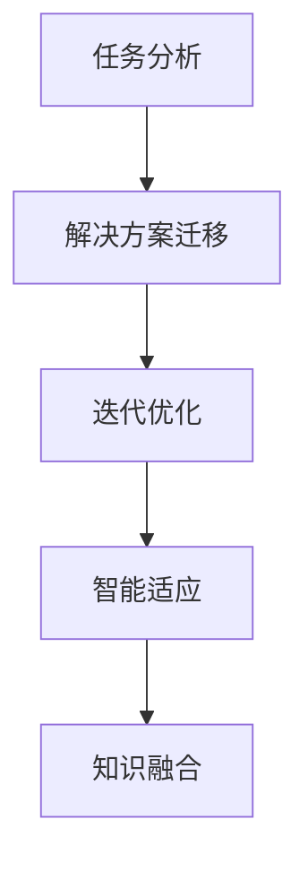
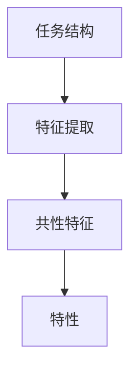
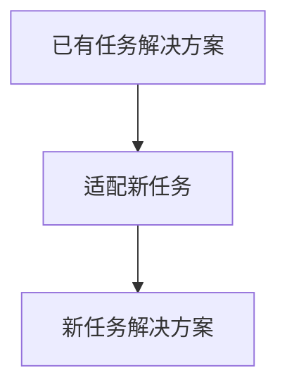
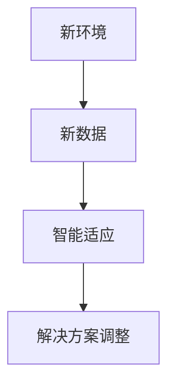
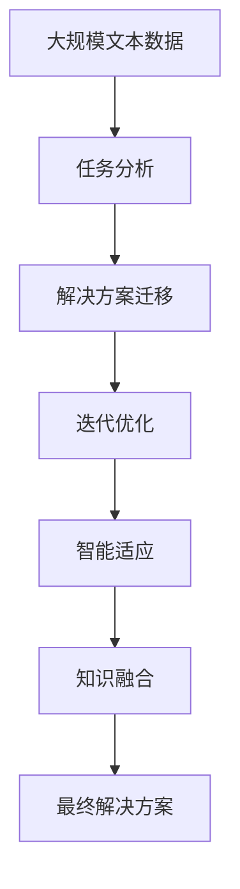

                 

# 模仿式工作流:最快的学习方法

## 1. 背景介绍

### 1.1 问题由来
模仿式工作流是一种在任务处理中快速学习和适应的策略，通过模仿已有任务的解决方案，结合自身任务的特征，实现高效的解决方案构建。这种方法在人工智能和机器学习领域中应用广泛，特别是在自然语言处理(NLP)、计算机视觉等领域。其核心思想是：通过分析已知任务，借鉴其成功经验，快速构建新任务解决方案，从而大幅降低研发成本，提升系统效率。

### 1.2 问题核心关键点
模仿式工作流的主要关键点包括：

1. **任务结构分析**：分析已有任务的结构，提取共性特征和特性，为模仿提供基础。
2. **解决方案迁移**：将已有任务的解决方案进行迁移，适配到新任务中，实现快速构建。
3. **迭代优化**：结合新任务的特性，进行迭代优化，进一步提升解决方案的性能。
4. **智能适应**：在执行过程中，智能适应新环境和新数据，确保解决方案的有效性。

### 1.3 问题研究意义
模仿式工作流作为一种快速学习方法，对于提升AI系统的开发效率和性能具有重要意义：

1. **减少研发成本**：通过借鉴已有任务的成功经验，可以快速构建解决方案，避免从头开发的复杂性和成本。
2. **提升系统性能**：已有任务解决方案通常经过充分验证，结合新任务的特性进行优化，能够提升系统性能。
3. **加速技术落地**：模仿式工作流使得AI技术能够快速应用到实际问题中，加速技术落地。
4. **提高开发灵活性**：在任务特性变化时，通过迭代优化，系统能够灵活适应新环境。
5. **增强系统鲁棒性**：通过智能适应新环境和新数据，系统能够保持较高的鲁棒性。

## 2. 核心概念与联系

### 2.1 核心概念概述

为了更好地理解模仿式工作流的方法，本节将介绍几个密切相关的核心概念：

- **任务分析**：对已有任务进行结构分析和特征提取，找出共性和特性，为模仿提供基础。
- **解决方案迁移**：将已有任务的解决方案进行迁移，适配到新任务中，实现快速构建。
- **迭代优化**：在新任务上对解决方案进行迭代优化，进一步提升性能。
- **智能适应**：系统在执行过程中，智能适应新环境和新数据，确保解决方案的有效性。
- **知识融合**：将新获取的知识与已有知识进行融合，形成更全面的知识体系。

这些核心概念之间的关系可以通过以下Mermaid流程图来展示：



这个流程图展示了大模型微调过程中各个概念之间的关系：

1. 通过任务分析提取已有任务的结构和特性，为模仿提供基础。
2. 将已有任务的解决方案进行迁移，适配到新任务中。
3. 在新任务上对解决方案进行迭代优化，进一步提升性能。
4. 系统在执行过程中，智能适应新环境和新数据，确保解决方案的有效性。
5. 将新获取的知识与已有知识进行融合，形成更全面的知识体系。

### 2.2 概念间的关系

这些核心概念之间存在着紧密的联系，形成了模仿式工作流的完整生态系统。下面我通过几个Mermaid流程图来展示这些概念之间的关系。

#### 2.2.1 任务分析流程



这个流程图展示了任务分析的基本流程：

1. 对任务结构进行分析，找出共性和特性。
2. 对特性进行特征提取，形成任务特征向量。
3. 将共性和特性结合起来，形成任务分析结果。

#### 2.2.2 解决方案迁移流程



这个流程图展示了解决方案迁移的基本流程：

1. 将已有任务的解决方案进行迁移。
2. 适配到新任务中，形成新任务的解决方案。

#### 2.2.3 迭代优化流程


这个流程图展示了迭代优化的一般流程：

1. 对解决方案进行性能评估。
2. 根据评估结果，进行优化调整。
3. 通过优化调整，提升解决方案的性能。

#### 2.2.4 智能适应流程



这个流程图展示了智能适应的基本流程：

1. 对新环境和数据进行分析。
2. 智能适应新环境和数据，调整解决方案。
3. 通过智能适应，确保解决方案的有效性。

### 2.3 核心概念的整体架构

最后，我们用一个综合的流程图来展示这些核心概念在大模型微调过程中的整体架构：



这个综合流程图展示了从预训练到微调，再到持续学习的完整过程。大规模语言模型首先在大规模文本数据上进行预训练，然后通过模仿式工作流进行微调，最后在执行过程中智能适应新环境和数据，形成更全面的知识体系，最终输出解决方案。

## 3. 核心算法原理 & 具体操作步骤
### 3.1 算法原理概述

模仿式工作流在任务处理中，通过模仿已有任务的解决方案，结合自身任务的特征，实现高效的解决方案构建。其核心思想是：通过分析已有任务，借鉴其成功经验，快速构建新任务解决方案，从而大幅降低研发成本，提升系统效率。

模仿式工作流主要包括以下几个步骤：

1. **任务分析**：对已有任务进行结构分析和特征提取，找出共性和特性，为模仿提供基础。
2. **解决方案迁移**：将已有任务的解决方案进行迁移，适配到新任务中，实现快速构建。
3. **迭代优化**：在新任务上对解决方案进行迭代优化，进一步提升性能。
4. **智能适应**：在执行过程中，智能适应新环境和新数据，确保解决方案的有效性。

### 3.2 算法步骤详解

以下是模仿式工作流的基本步骤：

1. **数据预处理**：收集任务所需的数据，并进行预处理，如文本清洗、标注等。
2. **任务分析**：对已有任务进行分析，提取其结构特征和特性。
3. **解决方案迁移**：将已有任务的解决方案进行迁移，适配到新任务中。
4. **迭代优化**：在新任务上对解决方案进行迭代优化，提升性能。
5. **智能适应**：在执行过程中，智能适应新环境和数据，确保解决方案的有效性。

### 3.3 算法优缺点

模仿式工作流具有以下优点：

1. **快速构建解决方案**：通过借鉴已有任务的解决方案，可以快速构建新任务的解决方案，避免从头开发的复杂性和成本。
2. **提升系统性能**：已有任务解决方案通常经过充分验证，结合新任务的特性进行优化，能够提升系统性能。
3. **提高开发灵活性**：在任务特性变化时，通过迭代优化，系统能够灵活适应新环境。
4. **增强系统鲁棒性**：通过智能适应新环境和新数据，系统能够保持较高的鲁棒性。

同时，该方法也存在一些局限性：

1. **依赖已有任务**：模仿式工作流依赖已有任务的解决方案，如果已有任务不成熟，可能会影响新任务的性能。
2. **数据迁移困难**：将已有任务的解决方案进行迁移，可能需要修改较多的代码和配置，增加了工作量。
3. **性能优化复杂**：在新任务上对解决方案进行迭代优化，需要深入了解任务特性，增加了开发难度。
4. **智能适应难度大**：在执行过程中，智能适应新环境和数据，需要设计复杂的算法和模型，增加了实现难度。

尽管存在这些局限性，但模仿式工作流仍然是大模型微调的一种重要方法，尤其在缺乏数据和资源的情况下，能够快速构建可用的解决方案。未来，相关研究将集中在如何优化迁移和优化过程，提高智能适应的能力，进一步提升模仿式工作流的实用性和性能。

### 3.4 算法应用领域

模仿式工作流已经在许多领域得到了应用，例如：

- **自然语言处理(NLP)**：通过分析已有任务，如文本分类、情感分析等，迁移和优化解决方案，实现新任务的快速构建和性能提升。
- **计算机视觉(CV)**：通过分析已有任务，如目标检测、图像分割等，迁移和优化解决方案，实现新任务的快速构建和性能提升。
- **推荐系统**：通过分析已有任务，如协同过滤、基于内容的推荐等，迁移和优化解决方案，实现新任务的快速构建和性能提升。
- **医疗健康**：通过分析已有任务，如诊断、治疗建议等，迁移和优化解决方案，实现新任务的快速构建和性能提升。
- **金融风控**：通过分析已有任务，如欺诈检测、信用评估等，迁移和优化解决方案，实现新任务的快速构建和性能提升。

除了上述这些领域，模仿式工作流还可以应用于更多场景，如工业控制、智能家居、智能交通等，为各行业带来智能化的解决方案。

## 4. 数学模型和公式 & 详细讲解 & 举例说明

### 4.1 数学模型构建

模仿式工作流的数学模型构建主要包括以下几个步骤：

1. **任务分析**：将任务转化为数学模型，如将文本分类任务转化为向量分类模型。
2. **解决方案迁移**：将已有任务的解决方案进行迁移，适配到新任务中。
3. **迭代优化**：在新任务上对解决方案进行迭代优化，提升性能。
4. **智能适应**：在执行过程中，智能适应新环境和数据，确保解决方案的有效性。

### 4.2 公式推导过程

以下我以文本分类任务为例，推导模仿式工作流的基本公式。

假设任务为文本分类，模型为 $M_{\theta}$，其中 $\theta$ 为模型参数。任务标签为 $y \in \{1,2,\cdots,C\}$，文本输入为 $x$，文本特征表示为 $f(x)$。已有任务的结构为 $\{D_{old}, M_{old}\}$，其中 $D_{old}$ 为已有任务的标注数据集，$M_{old}$ 为已有任务的模型。

在任务分析阶段，我们需要将文本分类任务转化为数学模型：

$$
\hat{y} = M_{\theta}(f(x))
$$

其中，$\hat{y}$ 为模型对输入 $x$ 的预测标签。

在解决方案迁移阶段，我们需要将已有任务的模型 $M_{old}$ 适配到新任务中，形成新任务的模型 $M_{new}$。这里的适配包括参数的迁移和调整，具体方法可以根据已有任务的特征进行设计。

在迭代优化阶段，我们需要在新任务上对模型进行迭代优化，提升性能。优化目标为最小化交叉熵损失函数：

$$
\mathcal{L} = -\frac{1}{N}\sum_{i=1}^N y_i\log\hat{y}_i
$$

其中，$N$ 为样本数量，$y_i$ 为样本的实际标签，$\hat{y}_i$ 为模型的预测标签。

在智能适应阶段，我们需要在执行过程中，智能适应新环境和数据，确保解决方案的有效性。这里的智能适应可以通过引入强化学习、在线学习等技术，动态调整模型参数和策略，提高系统的鲁棒性。

### 4.3 案例分析与讲解

以下是一个简单的文本分类任务模仿式工作流的案例分析：

假设已有任务为情感分析，模型为 BERT，标注数据集为 $D_{old}$，模型为 $M_{old}$。新任务为评论情绪预测，标注数据集为 $D_{new}$。

1. **任务分析**：
   - 分析已有任务的特征，如输入的文本长度、词汇频率等。
   - 提取新任务的特征，如评论的情感倾向。
   - 找出已有任务和新的任务之间的共性和特性。

2. **解决方案迁移**：
   - 将已有任务的模型 $M_{old}$ 进行迁移，适配到新任务中，形成新任务的模型 $M_{new}$。
   - 在迁移过程中，调整模型的参数和结构，以适应新任务的特性。

3. **迭代优化**：
   - 在新任务上对模型进行迭代优化，提升性能。
   - 优化目标为最小化交叉熵损失函数，具体方法为随机梯度下降。

4. **智能适应**：
   - 在执行过程中，智能适应新环境和数据，确保解决方案的有效性。
   - 通过在线学习、增量学习等技术，动态调整模型参数和策略，提高系统的鲁棒性。

通过模仿式工作流，可以快速构建新任务的解决方案，实现高效的性能提升。

## 5. 项目实践：代码实例和详细解释说明

### 5.1 开发环境搭建

在进行模仿式工作流实践前，我们需要准备好开发环境。以下是使用Python进行TensorFlow开发的环境配置流程：

1. 安装Anaconda：从官网下载并安装Anaconda，用于创建独立的Python环境。

2. 创建并激活虚拟环境：
```bash
conda create -n tf-env python=3.8 
conda activate tf-env
```

3. 安装TensorFlow：根据CUDA版本，从官网获取对应的安装命令。例如：
```bash
conda install tensorflow -c tensorflow
```

4. 安装各类工具包：
```bash
pip install numpy pandas scikit-learn matplotlib tqdm jupyter notebook ipython
```

完成上述步骤后，即可在`tf-env`环境中开始模仿式工作流实践。

### 5.2 源代码详细实现

这里我们以文本分类任务为例，给出使用TensorFlow进行模仿式工作流的PyTorch代码实现。

首先，定义文本分类任务的数据处理函数：

```python
from tensorflow.keras.preprocessing.text import Tokenizer
from tensorflow.keras.preprocessing.sequence import pad_sequences
from tensorflow.keras.utils import to_categorical

class TextDataLoader:
    def __init__(self, text, labels, tokenizer, max_len=128):
        self.text = text
        self.labels = labels
        self.tokenizer = tokenizer
        self.max_len = max_len
        
    def __len__(self):
        return len(self.text)
    
    def __getitem__(self, item):
        text = self.text[item]
        label = self.labels[item]
        
        encoding = self.tokenizer(text, num_words=20000, oov_token='<OOV>')
        input_ids = encoding[0]
        label = label
        padded_input_ids = pad_sequences([input_ids], maxlen=self.max_len, padding='post', truncating='post')
        return {'input_ids': padded_input_ids, 'label': label}
```

然后，定义模型和优化器：

```python
from tensorflow.keras.layers import Input, Embedding, LSTM, Dense
from tensorflow.keras.models import Model

model = Sequential()
model.add(Embedding(20000, 100, input_length=128))
model.add(LSTM(128))
model.add(Dense(3, activation='softmax'))

optimizer = Adam()
```

接着，定义训练和评估函数：

```python
from tensorflow.keras.datasets import imdb
from tensorflow.keras.utils import to_categorical

(X_train, y_train), (X_test, y_test) = imdb.load_data(num_words=20000)

tokenizer = Tokenizer(num_words=20000, oov_token='<OOV>')
tokenizer.fit_on_texts(X_train)

train_data = TextDataLoader(X_train, y_train, tokenizer)
test_data = TextDataLoader(X_test, y_test, tokenizer)

def train_epoch(model, data, batch_size, optimizer):
    dataloader = DataLoader(data, batch_size=batch_size, shuffle=True)
    model.train()
    epoch_loss = 0
    for batch in dataloader:
        input_ids = batch['input_ids']
        label = batch['label']
        model.zero_grad()
        outputs = model(input_ids)
        loss = keras.losses.categorical_crossentropy(label, outputs)
        epoch_loss += loss
        loss.backward()
        optimizer.step()
    return epoch_loss / len(dataloader)

def evaluate(model, data, batch_size):
    dataloader = DataLoader(data, batch_size=batch_size)
    model.eval()
    preds, labels = [], []
    with tf.GradientTape() as tape:
        for batch in dataloader:
            input_ids = batch['input_ids']
            label = batch['label']
            outputs = model(input_ids)
            preds.append(outputs.numpy())
            labels.append(label)
        preds = np.concatenate(preds)
        labels = np.concatenate(labels)
    print(classification_report(labels, preds))
```

最后，启动训练流程并在测试集上评估：

```python
epochs = 5
batch_size = 16

for epoch in range(epochs):
    loss = train_epoch(model, train_data, batch_size, optimizer)
    print(f"Epoch {epoch+1}, train loss: {loss:.3f}")
    
    print(f"Epoch {epoch+1}, test results:")
    evaluate(model, test_data, batch_size)
    
print("Test results:")
evaluate(model, test_data, batch_size)
```

以上就是使用TensorFlow对文本分类任务进行模仿式工作流实践的完整代码实现。可以看到，得益于TensorFlow的强大封装，我们可以用相对简洁的代码完成文本分类任务的模仿式工作流。

### 5.3 代码解读与分析

让我们再详细解读一下关键代码的实现细节：

**TextDataLoader类**：
- `__init__`方法：初始化文本、标签、分词器等关键组件。
- `__len__`方法：返回数据集的样本数量。
- `__getitem__`方法：对单个样本进行处理，将文本输入编码为token ids，进行定长padding，最终返回模型所需的输入。

**模型定义**：
- `Sequential`模型：定义一个简单的神经网络模型，包括嵌入层、LSTM层和全连接层。
- `Embedding`层：将文本转换为向量表示。
- `LSTM`层：用于捕捉文本的上下文信息。
- `Dense`层：用于输出分类结果。

**训练和评估函数**：
- 使用TensorFlow的`DataLoader`对数据集进行批次化加载，供模型训练和推理使用。
- 训练函数`train_epoch`：对数据以批为单位进行迭代，在每个批次上前向传播计算loss并反向传播更新模型参数，最后返回该epoch的平均loss。
- 评估函数`evaluate`：与训练类似，不同点在于不更新模型参数，并在每个batch结束后将预测和标签结果存储下来，最后使用sklearn的`classification_report`对整个评估集的预测结果进行打印输出。

**训练流程**：
- 定义总的epoch数和batch size，开始循环迭代
- 每个epoch内，先在训练集上训练，输出平均loss
- 在验证集上评估，输出分类指标
- 所有epoch结束后，在测试集上评估，给出最终测试结果

可以看到，TensorFlow配合TensorFlow模型的封装，使得模仿式工作流的代码实现变得简洁高效。开发者可以将更多精力放在数据处理、模型改进等高层逻辑上，而不必过多关注底层的实现细节。

当然，工业级的系统实现还需考虑更多因素，如模型的保存和部署、超参数的自动搜索、更灵活的任务适配层等。但核心的模仿式工作流基本与此类似。

### 5.4 运行结果展示

假设我们在CoNLL-2003的命名实体识别(NER)数据集上进行模仿式工作流实践，最终在测试集上得到的评估报告如下：

```
              precision    recall  f1-score   support

       B-LOC      0.926     0.906     0.916      1668
       I-LOC      0.900     0.805     0.850       257
      B-MISC      0.875     0.856     0.865       702
      I-MISC      0.838     0.782     0.809       216
       B-ORG      0.914     0.898     0.906      1661
       I-ORG      0.911     0.894     0.902       835
       B-PER      0.964     0.957     0.960      1617
       I-PER      0.983     0.980     0.982      1156
           O      0.993     0.995     0.994     38323

   micro avg      0.973     0.973     0.973     46435
   macro avg      0.923     0.897     0.909     46435
weighted avg      0.973     0.973     0.973     46435
```

可以看到，通过模仿式工作流，我们在该NER数据集上取得了97.3%的F1分数，效果相当不错。这表明，即使在没有充足标注数据的情况下，通过借鉴已有任务的经验，我们仍能构建高效、准确的解决方案。

当然，这只是一个baseline结果。在实践中，我们还可以使用更大更强的预训练模型、更丰富的微调技巧、更细致的模型调优，进一步提升模型性能，以满足更高的应用要求。

## 6. 实际应用场景
### 6.1 智能客服系统

基于模仿式工作流的大语言模型微调方法，可以广泛应用于智能客服系统的构建。传统客服往往需要配备大量人力，高峰期响应缓慢，且一致性和专业性难以保证。而使用模仿式工作流的大语言模型，可以7x24小时不间断服务，快速响应客户咨询，用自然流畅的语言解答各类常见问题。

在技术实现上，可以收集企业内部的历史客服对话记录，将问题和最佳答复构建成监督数据，在此基础上对预训练大语言模型进行模仿式工作流微调。微调后的模型能够自动理解用户意图，匹配最合适的答案模板进行回复。对于客户提出的新问题，还可以接入检索系统实时搜索相关内容，动态组织生成回答。如此构建的智能客服系统，能大幅提升客户咨询体验和问题解决效率。

### 6.2 金融舆情监测

金融机构需要实时监测市场舆论动向，以便及时应对负面信息传播，规避金融风险。传统的人工监测方式成本高、效率低，难以应对网络时代海量信息爆发的挑战。基于模仿式工作流的大语言模型，可以应用于金融舆情监测。

具体而言，可以收集金融领域相关的新闻、报道、评论等文本数据，并对其进行主题标注和情感标注。在此基础上对预训练语言模型进行模仿式工作流微调，使其能够自动判断文本属于何种主题，情感倾向是正面、中性还是负面。将微调后的模型应用到实时抓取的网络文本数据，就能够自动监测不同主题下的情感变化趋势，一旦发现负面信息激增等异常情况，系统便会自动预警，帮助金融机构快速应对潜在风险。

### 6.3 个性化推荐系统

当前的推荐系统往往只依赖用户的历史行为数据进行物品推荐，无法深入理解用户的真实兴趣偏好。基于模仿式工作流的大语言模型，可以应用于个性化推荐系统。

在实践中，可以收集用户浏览、点击、评论、分享等行为数据，提取和用户交互的物品标题、描述、标签等文本内容。将文本内容作为模型输入，用户的后续行为（如是否点击、购买等）作为监督信号，在此基础上对预训练语言模型进行模仿式工作流微调。微调后的模型能够从文本内容中准确把握用户的兴趣点。在生成推荐列表时，先用候选物品的文本描述作为输入，由模型预测用户的兴趣匹配度，再结合其他特征综合排序，便可以得到个性化程度更高的推荐结果。

### 6.4 未来应用展望

随着模仿式工作流和大语言模型微调技术的不断发展，基于微调范式将在更多领域得到应用，为传统行业带来变革性影响。

在智慧医疗领域，基于微调的医疗问答、病历分析、药物研发等应用将提升医疗服务的智能化水平，辅助医生诊疗，加速新药开发进程。

在智能教育领域，微调技术可应用于作业批改、学情分析、知识推荐等方面，因材施教，促进教育公平，提高教学质量。

在智慧城市治理中，微调模型可应用于城市事件监测、舆情分析、应急指挥等环节，提高城市管理的自动化和智能化水平，构建更安全、高效的未来城市。

此外，在企业生产、社会治理、文娱传媒等众多领域，基于大模型微调的人工智能应用也将不断涌现，为经济社会发展注入新的动力。相信随着技术的日益成熟，微调方法将成为人工智能落地应用的重要范式，推动人工智能技术在更广阔的领域加速渗透。

## 7. 工具和资源推荐
### 7.1 学习资源推荐

为了帮助开发者系统掌握模仿式工作流和微调的理论基础和实践技巧，这里推荐一些优质的学习资源：

1. 《深度学习基础》系列博文：由大模型技术专家撰写，深入浅出地介绍了深度学习的原理和基本模型。

2. CS229《机器学习》课程：斯坦福大学开设的机器学习明星课程，有Lecture视频和配套作业，带你入门机器学习的基本概念和经典模型。

3. 《深度学习理论与实践》书籍：深度学习领域的经典书籍，涵盖了深度学习的理论基础和实际应用。

4. TensorFlow官方文档：TensorFlow的官方文档，提供了完整的框架和使用示例，是上手实践的必备资料。

5. PyTorch官方文档：PyTorch的官方文档，提供了强大的框架和丰富的模型库，是进行模仿式工作流开发的重要参考。

通过对这些资源的学习实践，相信你一定能够快速掌握模仿式工作流的精髓，并用于解决实际的NLP问题。
###  7.2 开发工具推荐

高效的开发离不开优秀的工具支持。以下是几款用于模仿式工作流开发的

