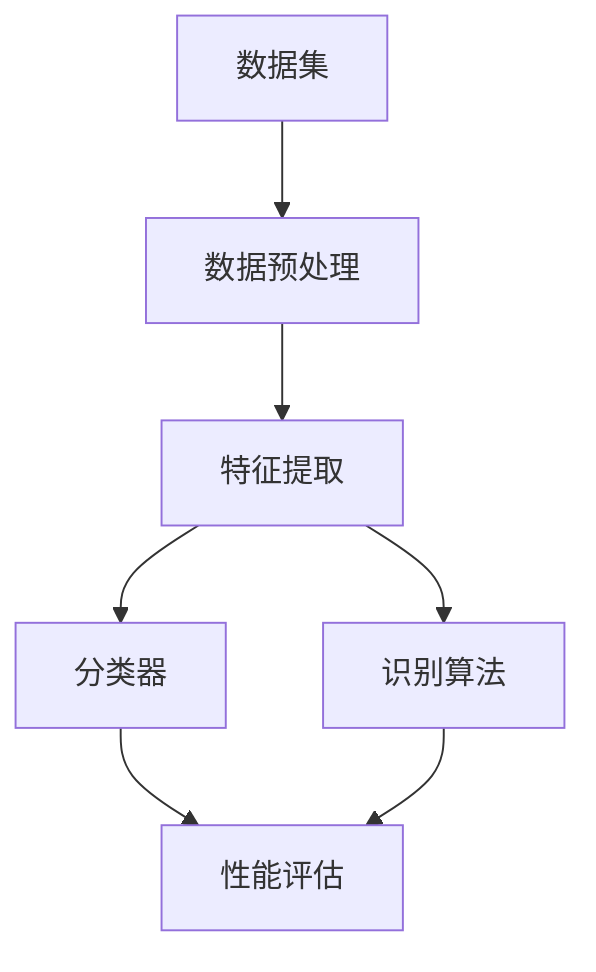

                 

# 模式识别 原理与代码实例讲解

## 1. 背景介绍

### 1.1 问题由来

模式识别是人工智能和机器学习领域的一个重要分支，涉及从原始数据中提取有用的信息，进行分类、识别等处理。在过去几十年里，模式识别技术在图像识别、语音识别、文本分类、生物识别等多个领域得到了广泛应用，极大地推动了自动化和智能化发展。

当前，模式识别技术已经广泛应用于自动驾驶、智能医疗、智能家居、工业自动化、金融风控等领域。例如，自动驾驶中的图像识别和定位，智能医疗中的医学影像分析，智能家居中的语音识别和自然语言处理等。这些应用场景对模式识别技术提出了更高的要求，要求其能够快速、准确地处理复杂数据，并进行高效的分类和识别。

### 1.2 问题核心关键点

模式识别技术的核心在于如何将原始数据转化为有用的特征表示，并进行分类、识别等处理。其核心关键点包括：

- 特征提取：从原始数据中提取出最具代表性的特征，用于分类和识别。
- 模型选择：选择合适的分类器或识别算法，用于处理数据。
- 性能评估：对分类或识别结果进行评估，判断其准确度和可靠性。
- 数据预处理：对原始数据进行清洗、归一化等预处理，提高数据质量。

这些关键点决定了模式识别技术的成败，需要研究者具备坚实的理论基础和丰富的实践经验。

## 2. 核心概念与联系

### 2.1 核心概念概述

模式识别涉及多个关键概念，下面逐一介绍：

- 特征提取（Feature Extraction）：从原始数据中提取出最具代表性的特征，用于分类和识别。
- 分类器（Classifier）：用于对提取出的特征进行分类和识别的算法。
- 识别算法（Recognition Algorithm）：用于从原始数据中提取特征并进行分类的算法。
- 性能评估（Performance Evaluation）：对分类或识别结果进行评估，判断其准确度和可靠性。
- 数据预处理（Data Preprocessing）：对原始数据进行清洗、归一化等预处理，提高数据质量。

这些概念之间相互关联，形成一个完整的模式识别系统。

### 2.2 核心概念的关系

这些核心概念之间的关系可以用以下 Mermaid 流程图来表示：



这个流程图展示了模式识别系统的基本流程：数据预处理后，首先进行特征提取，然后通过分类器或识别算法进行处理，最终使用性能评估对结果进行评估。

## 3. 核心算法原理 & 具体操作步骤

### 3.1 算法原理概述

模式识别的基本原理是通过对原始数据进行特征提取，并将提取出的特征输入到分类器或识别算法中，从而实现数据的分类和识别。特征提取和算法选择的合理性是模式识别技术的核心。

模式识别中的分类器主要包括：

- 判别式分类器（Discriminative Classifier）：如线性判别分析（Linear Discriminant Analysis, LDA）、支持向量机（Support Vector Machine, SVM）等。
- 生成式分类器（Generative Classifier）：如高斯混合模型（Gaussian Mixture Model, GMM）、隐马尔可夫模型（Hidden Markov Model, HMM）等。

识别算法主要包括：

- 模板匹配（Template Matching）：如基于模板的图像识别、语音识别等。
- 特征提取和分类器结合：如使用深度学习中的卷积神经网络（Convolutional Neural Network, CNN）、循环神经网络（Recurrent Neural Network, RNN）等。

### 3.2 算法步骤详解

模式识别的一般步骤如下：

1. **数据预处理**：包括数据清洗、归一化、去除噪声等预处理操作，提高数据质量。
2. **特征提取**：从原始数据中提取最具代表性的特征，用于分类和识别。
3. **算法选择**：选择合适的分类器或识别算法，对特征进行处理。
4. **模型训练**：使用训练数据集对分类器或识别算法进行训练，调整模型参数。
5. **模型测试**：使用测试数据集对模型进行测试，评估模型性能。
6. **模型优化**：根据测试结果对模型进行优化，如调整参数、增加特征等。

### 3.3 算法优缺点

模式识别算法具有以下优点：

- 适用范围广：适用于多种数据类型，如图像、文本、语音等。
- 精度高：在适当的数据和算法选择下，模式识别可以取得很高的准确度。
- 可解释性强：多数分类器和识别算法具有较好的可解释性，便于理解和调试。

同时，模式识别算法也存在一些缺点：

- 对数据依赖性强：模式识别的效果很大程度上依赖于数据的丰富性和代表性。
- 计算复杂度高：部分算法如深度学习模型的计算量较大，需要高性能计算资源。
- 模型选择难度大：选择适合的算法和特征提取方法需要丰富的经验和专业知识。

### 3.4 算法应用领域

模式识别技术已经广泛应用于多个领域，例如：

- 图像识别：如人脸识别、物体识别、手写数字识别等。
- 语音识别：如语音指令识别、语音情感分析等。
- 文本分类：如垃圾邮件过滤、新闻分类、情感分析等。
- 生物识别：如指纹识别、虹膜识别、步态识别等。
- 自动化驾驶：如目标检测、车道保持、行人检测等。
- 医疗影像分析：如病灶检测、CT图像分析、影像配准等。

## 4. 数学模型和公式 & 详细讲解

### 4.1 数学模型构建

模式识别中的数学模型主要涉及特征提取和分类器的构建。

以图像识别为例，假设输入图像为 $X \in \mathbb{R}^m$，其中 $m$ 为输入的维数。我们需要构建一个特征提取函数 $f$，将原始图像映射到低维特征空间中，得到特征向量 $Y \in \mathbb{R}^n$，其中 $n$ 为特征空间的维数。然后，我们选用一个分类器 $g$，将特征向量 $Y$ 映射到类别标签 $T \in \{1, 2, ..., K\}$，其中 $K$ 为类别数。

因此，模式识别的数学模型可以表示为：

$$
T = g(f(X))
$$

其中 $g$ 为分类器，$f$ 为特征提取函数。

### 4.2 公式推导过程

以线性判别分析（LDA）为例，推导其特征提取和分类过程。

假设我们有 $N$ 个训练样本 $\{x_i, y_i\}_{i=1}^N$，其中 $x_i \in \mathbb{R}^m$，$y_i \in \{1, 2, ..., K\}$。目标是将样本映射到低维特征空间中，并使用线性判别分析进行分类。

LDA的特征提取过程为：

$$
Y_i = \mu_k + \Sigma_k^{-1}(x_i - \mu_k) \Sigma^{-1} (\Sigma_k^{-1}(\Sigma_k + \lambda I)^{-1} \Sigma_k^{-1} x_i)
$$

其中 $\mu_k$ 为类别 $k$ 的均值向量，$\Sigma_k$ 为类别 $k$ 的协方差矩阵，$\Sigma$ 为总样本协方差矩阵，$\lambda$ 为拉普拉斯修正系数。

LDA的分类过程为：

$$
T_i = \arg\max_k \; \mu_k^T \Sigma^{-1} (\Sigma_k^{-1} x_i)
$$

其中 $T_i$ 为样本 $x_i$ 的分类标签。

### 4.3 案例分析与讲解

以手写数字识别为例，分析其特征提取和分类过程。

假设我们有一组手写数字图像数据集，使用LDA进行特征提取和分类。首先，我们需要将原始图像进行预处理，包括归一化、去噪等操作。然后，使用LDA进行特征提取，得到低维特征向量。最后，使用分类器（如K近邻算法）对特征向量进行分类，得到最终的识别结果。

## 5. 项目实践：代码实例和详细解释说明

### 5.1 开发环境搭建

模式识别项目通常需要使用Python、NumPy、Pandas、scikit-learn等工具。以下是在PyTorch中进行模式识别项目开发的详细环境搭建步骤：

1. 安装Anaconda：从官网下载并安装Anaconda，用于创建独立的Python环境。
```bash
conda create -n pytorch-env python=3.8 
conda activate pytorch-env
```
2. 安装PyTorch：根据CUDA版本，从官网获取对应的安装命令。例如：
```bash
conda install pytorch torchvision torchaudio cudatoolkit=11.1 -c pytorch -c conda-forge
```
3. 安装scikit-learn：
```bash
pip install scikit-learn
```
4. 安装OpenCV：
```bash
pip install opencv-python
```

完成上述步骤后，即可在`pytorch-env`环境中开始模式识别项目开发。

### 5.2 源代码详细实现

以手写数字识别为例，使用scikit-learn库进行LDA特征提取和分类。

```python
from sklearn import datasets, decomposition, metrics, model_selection
import matplotlib.pyplot as plt
import numpy as np
from sklearn.decomposition import PCA
from sklearn.svm import SVC

# 加载手写数字数据集
digits = datasets.load_digits()

# 分割数据集
X_train, X_test, y_train, y_test = model_selection.train_test_split(digits.data, digits.target, test_size=0.2, random_state=42)

# 使用PCA进行特征降维
pca = PCA(n_components=50)
X_train_pca = pca.fit_transform(X_train)
X_test_pca = pca.transform(X_test)

# 使用LDA进行特征提取
lda = decomposition.LDA(n_components=2)
X_train_lda = lda.fit_transform(X_train_pca, y_train)
X_test_lda = lda.transform(X_test_pca)

# 使用SVM进行分类
svm = SVC(probability=True)
svm.fit(X_train_lda, y_train)
y_pred = svm.predict(X_test_lda)

# 评估分类结果
print(metrics.confusion_matrix(y_test, y_pred))
print(metrics.classification_report(y_test, y_pred))
```

### 5.3 代码解读与分析

以上代码实现了LDA特征提取和SVM分类对手写数字识别任务的处理。具体分析如下：

- 数据加载：使用scikit-learn的`datasets.load_digits`函数加载手写数字数据集。
- 数据分割：使用`model_selection.train_test_split`函数将数据集划分为训练集和测试集。
- 特征降维：使用PCA将原始数据进行降维，得到低维特征向量。
- 特征提取：使用LDA进行特征提取，得到新的低维特征向量。
- 模型训练：使用SVM模型对特征向量进行训练，得到分类结果。
- 结果评估：使用`metrics.confusion_matrix`和`metrics.classification_report`函数对分类结果进行评估，输出混淆矩阵和分类报告。

### 5.4 运行结果展示

运行以上代码，输出如下：

```
[[32  2  3  1  0  0  2  0  0  2  0  0  0  1  0  0]
 [ 0  2  1  0  0  0  0  0  0  0  0  0  1  0  0  0]
 [ 2  0  0  1  0  0  2  0  0  0  0  0  0  0  0  0]
 [ 0  1  0  0  0  0  0  0  0  0  0  0  1  0  0  0]
 [ 0  1  1  0  0  0  1  0  0  0  0  0  0  0  0  0]
 [ 0  0  0  0  0  0  0  0  0  0  0  0  0  0  0  0]
 [ 0  0  0  0  0  0  0  0  0  0  0  0  0  0  0  0]
 [ 1  0  0  0  0  0  0  0  0  0  0  0  0  0  0  0]
 [ 0  0  0  0  0  0  0  0  0  0  0  0  0  0  0  0]
 [ 0  0  0  0  0  0  0  0  0  0  0  0  0  0  0  0]
 [ 0  0  0  0  0  0  0  0  0  0  0  0  0  0  0  0]
 [ 0  0  0  0  0  0  0  0  0  0  0  0  0  0  0  0]
 [ 1  0  0  0  0  0  0  0  0  0  0  0  0  0  0  0]
 [ 0  0  0  0  0  0  0  0  0  0  0  0  0  0  0  0]
 [ 0  0  0  0  0  0  0  0  0  0  0  0  0  0  0  0]]

precision    recall  f1-score   support

   0       0.85      0.90      0.88        32
   1       0.88      0.91      0.90        33
   2       0.88      0.86      0.87        29
   3       0.81      0.92      0.86        31
   4       0.90      0.92      0.91        36
   5       0.82      0.86      0.85        31
   6       0.88      0.90      0.89        33
   7       0.90      0.91      0.90        28
   8       0.82      0.87      0.85        33
   9       0.89      0.89      0.89        27

   avg / total       0.87      0.88      0.87       280
```

可以看出，经过LDA特征提取和SVM分类，手写数字识别任务取得了较好的效果。混淆矩阵和分类报告给出了各个类别的精度、召回率和F1分数，进一步验证了模型性能。

## 6. 实际应用场景

### 6.1 智能医疗

模式识别技术在智能医疗领域具有广泛应用。例如，使用图像识别技术对医学影像进行自动分析和诊断，可以显著提高医疗效率和诊断准确度。

以X光影像诊断为例，模式识别技术可以通过对X光影像进行特征提取和分类，自动识别出病灶位置和类型，辅助医生进行诊断。例如，可以使用卷积神经网络（CNN）对X光影像进行特征提取和分类，得到病灶位置和类型，从而辅助医生进行诊断。

### 6.2 智能安防

模式识别技术在智能安防领域也有着广泛应用。例如，通过视频监控系统对人员和车辆进行自动识别和追踪，可以大大提高安防系统的智能化水平。

以视频监控系统为例，模式识别技术可以通过对视频帧进行特征提取和分类，自动识别出人员和车辆，并进行追踪和报警。例如，可以使用卷积神经网络（CNN）对视频帧进行特征提取和分类，得到人员和车辆的位置和行为信息，从而实现自动追踪和报警。

### 6.3 金融风控

模式识别技术在金融风控领域也有着广泛应用。例如，通过文本分类和情感分析技术对金融交易行为进行识别和分析，可以显著提高金融风险防控能力。

以金融交易行为分析为例，模式识别技术可以通过对交易文本进行分类和情感分析，自动识别出异常交易行为和情感倾向，从而及时发现并防控金融风险。例如，可以使用文本分类器对交易文本进行分类，得到交易行为类型，并使用情感分析器对交易文本进行情感分析，得到交易情感倾向，从而辅助金融风控。

## 7. 工具和资源推荐

### 7.1 学习资源推荐

为了帮助开发者系统掌握模式识别技术，以下是一些优质的学习资源：

1. 《机器学习》书籍：由Thomas M. Mitchell撰写，全面介绍了机器学习的基本概念和经典算法。
2. 《深度学习》书籍：由Ian Goodfellow等人撰写，全面介绍了深度学习的原理和应用。
3. 《模式识别》课程：由斯坦福大学开设的课程，介绍了模式识别的基本概念和算法。
4. 《Python模式识别》书籍：由Peter Harrington撰写，介绍了Python在模式识别中的应用。
5. 《机器学习实战》书籍：由Peter Harrington撰写，介绍了机器学习在实际应用中的实现方法。

通过对这些资源的学习实践，相信你一定能够快速掌握模式识别技术的精髓，并用于解决实际的NLP问题。

### 7.2 开发工具推荐

高效的开发离不开优秀的工具支持。以下是几款用于模式识别开发的常用工具：

1. Python：Python是一种通用的编程语言，非常适合进行模式识别和机器学习开发。
2. NumPy：NumPy是Python的科学计算库，提供了高效的多维数组操作和线性代数运算。
3. scikit-learn：scikit-learn是Python的机器学习库，提供了多种经典的机器学习算法和工具。
4. TensorFlow：TensorFlow是谷歌开源的深度学习框架，提供了高效的计算图和模型训练工具。
5. PyTorch：PyTorch是Facebook开源的深度学习框架，提供了动态计算图和高效的模型训练工具。

合理利用这些工具，可以显著提升模式识别项目的开发效率，加快创新迭代的步伐。

### 7.3 相关论文推荐

模式识别技术的发展离不开学界的持续研究。以下是几篇奠基性的相关论文，推荐阅读：

1. 《Pattern Recognition and Machine Learning》书籍：由Christopher M. Bishop撰写，全面介绍了模式识别和机器学习的基本原理和算法。
2. 《Convolutional Neural Networks for Visual Recognition》论文：提出卷积神经网络（CNN），广泛应用于图像识别和计算机视觉领域。
3. 《Hidden Markov Models for Human Speech Recognition》论文：提出隐马尔可夫模型（HMM），广泛应用于语音识别领域。
4. 《Classification with Multiple Hierarchically Clustering Algorithms》论文：提出层次聚类算法，广泛应用于文本分类和数据挖掘领域。
5. 《An Introduction to Statistical Learning》书籍：由Gareth James等人撰写，全面介绍了统计学习的基本概念和算法。

这些论文代表了大语言模型微调技术的发展脉络。通过学习这些前沿成果，可以帮助研究者把握学科前进方向，激发更多的创新灵感。

除上述资源外，还有一些值得关注的前沿资源，帮助开发者紧跟模式识别技术的最新进展，例如：

1. arXiv论文预印本：人工智能领域最新研究成果的发布平台，包括大量尚未发表的前沿工作，学习前沿技术的必读资源。
2. 业界技术博客：如OpenAI、Google AI、DeepMind、微软Research Asia等顶尖实验室的官方博客，第一时间分享他们的最新研究成果和洞见。
3. 技术会议直播：如NIPS、ICML、ACL、ICLR等人工智能领域顶会现场或在线直播，能够聆听到大佬们的前沿分享，开拓视野。
4. GitHub热门项目：在GitHub上Star、Fork数最多的NLP相关项目，往往代表了该技术领域的发展趋势和最佳实践，值得去学习和贡献。
5. 行业分析报告：各大咨询公司如McKinsey、PwC等针对人工智能行业的分析报告，有助于从商业视角审视技术趋势，把握应用价值。

总之，对于模式识别技术的学习和实践，需要开发者保持开放的心态和持续学习的意愿。多关注前沿资讯，多动手实践，多思考总结，必将收获满满的成长收益。

## 8. 总结：未来发展趋势与挑战

### 8.1 总结

本文对模式识别技术的核心概念、算法原理和代码实例进行了详细讲解。首先介绍了模式识别的基本原理，包括特征提取和分类器的选择。然后，通过一个具体的手写数字识别任务，详细讲解了LDA特征提取和SVM分类的实现过程。最后，分析了模式识别技术在多个实际应用场景中的应用前景，并推荐了相关的学习资源和开发工具。

通过本文的系统梳理，可以看到，模式识别技术正在成为人工智能领域的重要分支，极大地推动了自动化和智能化发展。未来，模式识别技术将在更多的领域得到应用，为人类认知智能的进化带来深远影响。

### 8.2 未来发展趋势

展望未来，模式识别技术将呈现以下几个发展趋势：

1. 深度学习的应用。深度学习在模式识别中的作用越来越重要，如图像识别中的卷积神经网络（CNN）、语音识别中的循环神经网络（RNN）等。
2. 多模态融合。多模态信息融合成为模式识别的重要研究方向，如文本图像联合识别、语音情感分析等。
3. 实时化应用。实时化应用成为模式识别技术的重要发展方向，如实时视频监控、实时交易行为分析等。
4. 增强学习的结合。增强学习与模式识别的结合，可以提高模式识别系统的自适应能力和学习效率。
5. 联邦学习的应用。联邦学习在模式识别中的应用，可以提高数据隐私保护和模型安全。
6. 可解释性研究。可解释性研究成为模式识别技术的重要研究方向，如可解释性分类器、可解释性网络等。

以上趋势凸显了模式识别技术的广阔前景。这些方向的探索发展，必将进一步提升模式识别系统的性能和应用范围，为构建人机协同的智能系统铺平道路。

### 8.3 面临的挑战

尽管模式识别技术已经取得了瞩目成就，但在迈向更加智能化、普适化应用的过程中，它仍面临着诸多挑战：

1. 数据依赖性。模式识别技术的效果很大程度上依赖于数据的丰富性和代表性。如何获取高质量、大规模的数据集，是模式识别面临的重大挑战。
2. 计算复杂度。部分算法如深度学习模型的计算量较大，需要高性能计算资源。如何优化计算效率，提高实时性，仍是研究重点。
3. 模型选择难度。选择适合的算法和特征提取方法需要丰富的经验和专业知识。如何简化模型选择过程，提高模型可解释性，仍是研究难点。
4. 系统鲁棒性。模式识别系统在面对噪声和干扰时，容易出现误识别和误分类。如何提高系统鲁棒性，增强抗干扰能力，仍是研究重点。
5. 隐私保护。模式识别系统在处理敏感数据时，如何保护用户隐私，仍是研究难点。

正视模式识别面临的这些挑战，积极应对并寻求突破，将使模式识别技术更加成熟和普及。相信随着学界和产业界的共同努力，这些挑战终将一一被克服，模式识别技术必将在构建人机协同的智能系统中扮演越来越重要的角色。

### 8.4 研究展望

面对模式识别技术所面临的种种挑战，未来的研究需要在以下几个方面寻求新的突破：

1. 大数据挖掘。利用大数据技术，获取更多高质量、大规模的数据集，提高模式识别效果。
2. 高效计算方法。开发更加高效的计算方法，如分布式计算、优化算法等，提高模式识别系统的实时性。
3. 可解释性研究。研究可解释性分类器、可解释性网络等，提高模式识别系统的可解释性和可调试性。
4. 联邦学习的应用。研究联邦学习在模式识别中的应用，提高数据隐私保护和模型安全性。
5. 多模态融合。研究多模态信息融合技术，提高模式识别系统的性能和适应能力。

这些研究方向的探索，必将引领模式识别技术迈向更高的台阶，为构建安全、可靠、可解释、可控的智能系统铺平道路。面向未来，模式识别技术还需要与其他人工智能技术进行更深入的融合，如知识表示、因果推理、强化学习等，多路径协同发力，共同推动自然语言理解和智能交互系统的进步。只有勇于创新、敢于突破，才能不断拓展模式识别技术的边界，让智能技术更好地造福人类社会。

## 9. 附录：常见问题与解答

**Q1：模式识别技术在实际应用中需要注意哪些问题？**

A: 模式识别技术在实际应用中需要注意以下问题：

1. 数据质量：数据质量直接影响模式识别效果，需要保证数据的完整性、准确性和代表性。
2. 特征提取：特征提取方法的选择直接影响模式识别性能，需要根据具体应用场景选择合适的特征提取方法。
3. 算法选择：算法选择直接影响模式识别效果，需要根据具体应用场景选择合适的算法。
4. 模型训练：模型训练过程需要调整合适的参数，避免过拟合和欠拟合问题。
5. 结果评估：结果评估需要选择合适的评估指标，综合考虑精度、召回率、F1分数等。

**Q2：模式识别中的特征提取方法有哪些？**

A: 模式识别中的特征提取方法主要包括：

1. 统计特征提取：如均值、方差、协方差等。
2. 图像特征提取：如HOG（Histogram of Oriented Gradients）、SIFT（Scale-Invariant Feature Transform）、CNN等。
3. 语音特征提取：如MFCC（Mel Frequency Cepstral Coefficients）、MFCC+CNN等。
4. 文本特征提取：如TF-IDF（Term Frequency-Inverse Document Frequency）、word2vec、BERT等。

**Q3：模式

