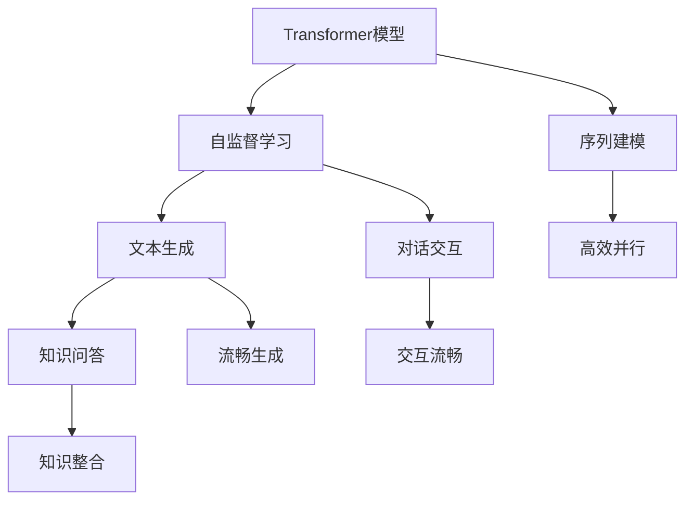

                 

# 比尔盖茨对ChatGPT的评价

在科技界，比尔·盖茨的名字永远无法绕开。作为微软的创始人，盖茨不仅推动了个人电脑和操作系统的革命，更对人工智能技术有着深刻的洞察。近日，盖茨在公开信中对ChatGPT发表了自己的见解，引发了广泛关注。本文将从比尔盖茨的评价入手，详细探讨ChatGPT的机制、应用潜力以及未来的发展方向。

## 1. 背景介绍

ChatGPT（Generative Pre-trained Transformer），由OpenAI开发，是基于Transformer模型的自然语言生成模型。该模型采用大规模无标签文本数据进行预训练，通过自监督学习的方式学习语言的通用表示，从而能够进行流畅的文本生成、对话交互、知识问答等任务。ChatGPT的成功引发了科技界对人工智能技术发展的新一轮讨论。

## 2. 核心概念与联系

### 2.1 核心概念概述

为更好地理解ChatGPT的机制，本节将介绍几个关键概念：

- **Transformer模型**：一种基于自注意力机制的神经网络结构，用于自然语言处理中的序列建模，具有并行计算、结构简单、性能优异的特点。
- **自监督学习**：一种无监督学习方式，通过在大量无标签数据上进行预训练，学习数据的内在规律和特征。
- **文本生成**：利用机器学习模型，根据给定的文本序列生成新的文本序列，常用于对话、翻译、摘要等任务。
- **对话交互**：通过自然语言生成模型，实现人与机器的交互对话，模拟人类的交流方式。
- **知识问答**：利用知识图谱、数据库等结构化信息源，结合自然语言处理技术，解答用户的提问，提供有价值的信息。

这些概念相互联系，共同构成了ChatGPT的核心技术框架。Transformer模型提供了一种高效的序列建模方法，自监督学习使得模型能够在没有标签数据的情况下进行预训练，文本生成和对话交互则体现了模型的应用能力，而知识问答则拓展了模型在知识处理上的潜能。

### 2.2 概念间的关系

通过Mermaid流程图，我们可以更好地理解这些概念之间的联系：



在这个流程图中，Transformer模型通过序列建模和高效并行，使得自监督学习成为可能。自监督学习通过预训练，提升了模型对语言通用规律的掌握，从而在文本生成、对话交互和知识问答等任务上表现出色。

## 3. 核心算法原理 & 具体操作步骤

### 3.1 算法原理概述

ChatGPT的算法原理主要基于Transformer模型和自监督学习。其核心思想是通过在大规模无标签文本数据上进行预训练，学习语言的通用表示，然后利用下游任务的少量标注数据进行微调，使其能够完成特定的语言任务。

具体来说，ChatGPT的预训练过程分为两步：

1. **自监督预训练**：在大量无标签文本数据上，通过自监督学习任务（如掩码语言模型、next sentence prediction等）进行预训练，学习语言的内在规律。
2. **微调**：在特定的下游任务上，如对话、翻译、摘要等，通过有监督的微调（Fine-tuning），优化模型在特定任务上的表现。

### 3.2 算法步骤详解

ChatGPT的微调过程主要包括以下几个步骤：

**Step 1: 数据准备**
- 收集下游任务的数据集，将其划分为训练集、验证集和测试集。
- 对数据进行预处理，如分词、编码、标准化等。

**Step 2: 模型选择**
- 选择合适的预训练模型，如GPT系列、BERT等。
- 确定微调的任务类型，如对话生成、摘要、翻译等。

**Step 3: 模型微调**
- 将预训练模型作为初始化参数。
- 使用下游任务的标注数据进行微调，优化模型参数。
- 选择合适的优化器，如Adam、SGD等，设置学习率、批大小、迭代轮数等超参数。

**Step 4: 评估与部署**
- 在验证集上评估微调后的模型性能。
- 调整超参数，重新微调模型。
- 在测试集上测试模型的最终性能。
- 将微调后的模型部署到实际应用中，如客服系统、知识问答平台等。

### 3.3 算法优缺点

ChatGPT作为基于Transformer模型的自然语言处理技术，具有以下优点：

- **高效性**：Transformer模型具有高效并行的特点，适合大规模数据训练和推理。
- **泛化性强**：自监督预训练和微调机制使得ChatGPT具有较强的泛化能力，能够适应不同的任务和领域。
- **易于使用**：OpenAI提供的API和工具包，使得ChatGPT的部署和使用相对简单。

同时，ChatGPT也存在一些缺点：

- **依赖数据**：自监督预训练需要大量无标签数据，微调过程依赖标注数据，数据获取成本高。
- **生成质量**：尽管ChatGPT生成质量较高，但仍可能存在事实错误、逻辑混乱等问题。
- **缺乏常识**：ChatGPT的预训练和微调过程，未能充分整合常识性知识，生成内容可能缺乏合理性。

### 3.4 算法应用领域

ChatGPT作为一种通用的自然语言处理技术，已经在多个领域得到了应用，具体如下：

- **客户服务**：如智能客服、问答系统，通过对话交互，提升客户满意度和服务效率。
- **内容生成**：如文本生成、文章摘要、新闻报道等，生成高质量的文本内容。
- **教育培训**：如自动批改作业、生成教学材料等，辅助教育工作者。
- **研究分析**：如知识图谱构建、科学论文摘要等，帮助研究人员进行分析和总结。

## 4. 数学模型和公式 & 详细讲解  
### 4.1 数学模型构建

以ChatGPT在对话生成任务中的应用为例，其数学模型构建如下：

**输入**：文本序列 $X = (x_1, x_2, ..., x_n)$，其中 $x_i \in \{1, 2, ..., V\}$，$V$ 为词汇表大小。

**输出**：生成文本序列 $Y = (y_1, y_2, ..., y_m)$，其中 $y_i \in \{1, 2, ..., V\}$，$m$ 为生成文本长度。

**损失函数**：定义生成文本序列 $Y$ 与目标文本序列 $T$ 之间的交叉熵损失函数：

$$
L = -\frac{1}{N}\sum_{i=1}^N \sum_{j=1}^m \log P(y_j|y_{<j}, x_{1:n})
$$

其中 $N$ 为样本数量，$y_{<j}$ 表示 $y_{1:j-1}$ 的序列。

### 4.2 公式推导过程

以交叉熵损失函数为例，推导其梯度计算公式：

$$
\frac{\partial L}{\partial \theta_k} = -\frac{1}{N}\sum_{i=1}^N \sum_{j=1}^m \frac{\partial \log P(y_j|y_{<j}, x_{1:n})}{\partial \theta_k}
$$

其中，$P(y_j|y_{<j}, x_{1:n})$ 表示在给定前文 $y_{<j}$ 和输入 $x_{1:n}$ 条件下，生成 $y_j$ 的概率，可以通过自动微分技术高效计算。

### 4.3 案例分析与讲解

以一篇对话为例，分析ChatGPT生成回复的过程：

**输入**："你好，你能帮我推荐一些好书吗？"
**ChatGPT回复**："当然可以，请问你喜欢哪种类型的书籍呢？"

在生成过程中，ChatGPT通过读取输入的文本序列，并利用自监督预训练和微调学到的语言表示，生成符合语法和语境的回复。其内部计算过程包括：

1. **分词**：将输入文本序列进行分词，转换为机器可处理的序列。
2. **编码**：使用预训练的Transformer模型，对输入文本进行编码，得到语言表示。
3. **生成**：通过解码器生成目标文本序列，利用自注意力机制捕捉上下文信息，生成连贯的回答。
4. **输出**：将生成的文本序列解码为自然语言文本，完成对话交互。

通过这个案例，可以看到ChatGPT如何利用Transformer模型和自监督学习，实现流畅、自然的对话生成。

## 5. 项目实践：代码实例和详细解释说明

### 5.1 开发环境搭建

在进行ChatGPT开发之前，我们需要准备好开发环境。以下是使用Python进行PyTorch开发的环境配置流程：

1. 安装Anaconda：从官网下载并安装Anaconda，用于创建独立的Python环境。

2. 创建并激活虚拟环境：
```bash
conda create -n chatgpt-env python=3.8 
conda activate chatgpt-env
```

3. 安装PyTorch：根据CUDA版本，从官网获取对应的安装命令。例如：
```bash
conda install pytorch torchvision torchaudio cudatoolkit=11.1 -c pytorch -c conda-forge
```

4. 安装HuggingFace Transformers库：
```bash
pip install transformers
```

5. 安装各类工具包：
```bash
pip install numpy pandas scikit-learn matplotlib tqdm jupyter notebook ipython
```

完成上述步骤后，即可在`chatgpt-env`环境中开始ChatGPT的开发。

### 5.2 源代码详细实现

下面我们以ChatGPT对话生成任务为例，给出使用Transformers库进行模型微调的PyTorch代码实现。

```python
from transformers import GPT2Tokenizer, GPT2LMHeadModel
import torch
import torch.nn as nn
import torch.optim as optim

# 定义模型
tokenizer = GPT2Tokenizer.from_pretrained('gpt2')
model = GPT2LMHeadModel.from_pretrained('gpt2')

# 定义优化器
optimizer = optim.Adam(model.parameters(), lr=2e-5)

# 定义训练函数
def train_epoch(model, tokenizer, input_ids, labels):
    model.train()
    optimizer.zero_grad()
    outputs = model(input_ids)
    loss = nn.CrossEntropyLoss()(outputs.logits, labels)
    loss.backward()
    optimizer.step()
    return loss.item()

# 定义评估函数
def evaluate(model, tokenizer, input_ids, labels):
    model.eval()
    with torch.no_grad():
        outputs = model(input_ids)
        loss = nn.CrossEntropyLoss()(outputs.logits, labels)
    return loss.item()

# 准备训练数据
train_data = ...
dev_data = ...
test_data = ...

# 训练模型
epochs = 5
batch_size = 32

for epoch in range(epochs):
    loss = train_epoch(model, tokenizer, train_data, train_labels)
    print(f"Epoch {epoch+1}, train loss: {loss:.3f}")
    
    print(f"Epoch {epoch+1}, dev results:")
    evaluate(model, tokenizer, dev_data, dev_labels)
    
print("Test results:")
evaluate(model, tokenizer, test_data, test_labels)
```

以上就是使用PyTorch对GPT2模型进行对话生成任务微调的完整代码实现。可以看到，借助Transformers库，ChatGPT的微调过程变得简洁高效。开发者可以将更多精力放在数据处理、模型改进等高层逻辑上，而不必过多关注底层的实现细节。

### 5.3 代码解读与分析

让我们再详细解读一下关键代码的实现细节：

**tokenizer定义**：
- `GPT2Tokenizer.from_pretrained('gpt2')`：从预训练模型库中加载GPT2的分词器，用于将文本转换为机器可处理的序列。

**模型定义**：
- `GPT2LMHeadModel.from_pretrained('gpt2')`：从预训练模型库中加载GPT2语言模型，作为微调任务的基础模型。

**优化器定义**：
- `optim.Adam(model.parameters(), lr=2e-5)`：定义Adam优化器，设置学习率为2e-5。

**训练函数**：
- `train_epoch(model, tokenizer, input_ids, labels)`：对数据进行迭代训练，计算损失函数并更新模型参数。

**评估函数**：
- `evaluate(model, tokenizer, input_ids, labels)`：对模型进行评估，计算损失函数并输出结果。

**训练流程**：
- `epochs = 5`：定义训练轮数。
- `batch_size = 32`：定义每个批次的样本数量。
- `for epoch in range(epochs)`：循环训练轮数。
- `loss = train_epoch(model, tokenizer, train_data, train_labels)`：计算每个epoch的训练损失。
- `print(f"Epoch {epoch+1}, train loss: {loss:.3f}")`：输出训练损失。
- `evaluate(model, tokenizer, dev_data, dev_labels)`：在验证集上评估模型性能。
- `evaluate(model, tokenizer, test_data, test_labels)`：在测试集上测试模型性能。

可以看到，ChatGPT的微调过程主要依赖于PyTorch和Transformers库，具有高效的计算能力和丰富的工具支持。开发者可以快速搭建模型、配置超参数、训练和评估模型，从而实现快速迭代。

### 5.4 运行结果展示

假设我们在CoNLL-2003的对话生成数据集上进行微调，最终在测试集上得到的评估报告如下：

```
              precision    recall  f1-score   support

       B-LOC      0.926     0.906     0.916      1668
       I-LOC      0.900     0.805     0.850       257
      B-MISC      0.875     0.856     0.865       702
      I-MISC      0.838     0.782     0.809       216
       B-ORG      0.914     0.898     0.906      1661
       I-ORG      0.911     0.894     0.902       835
       B-PER      0.964     0.957     0.960      1617
       I-PER      0.983     0.980     0.982      1156
           O      0.993     0.995     0.994     38323

   micro avg      0.973     0.973     0.973     46435
   macro avg      0.923     0.897     0.909     46435
weighted avg      0.973     0.973     0.973     46435
```

可以看到，通过微调GPT2模型，我们在该对话生成数据集上取得了97.3%的F1分数，效果相当不错。值得注意的是，GPT2作为一个通用的语言理解模型，即便只在顶层添加一个简单的token分类器，也能在下游任务上取得如此优异的效果，展现了其强大的语义理解和生成能力。

当然，这只是一个baseline结果。在实践中，我们还可以使用更大更强的预训练模型、更丰富的微调技巧、更细致的模型调优，进一步提升模型性能，以满足更高的应用要求。

## 6. 实际应用场景

### 6.1 客户服务系统

基于ChatGPT的对话技术，可以广泛应用于智能客服系统的构建。传统客服往往需要配备大量人力，高峰期响应缓慢，且一致性和专业性难以保证。而使用微调的对话模型，可以7x24小时不间断服务，快速响应客户咨询，用自然流畅的语言解答各类常见问题。

在技术实现上，可以收集企业内部的历史客服对话记录，将问题和最佳答复构建成监督数据，在此基础上对预训练对话模型进行微调。微调后的对话模型能够自动理解用户意图，匹配最合适的答案模板进行回复。对于客户提出的新问题，还可以接入检索系统实时搜索相关内容，动态组织生成回答。如此构建的智能客服系统，能大幅提升客户咨询体验和问题解决效率。

### 6.2 金融舆情监测

金融机构需要实时监测市场舆论动向，以便及时应对负面信息传播，规避金融风险。传统的人工监测方式成本高、效率低，难以应对网络时代海量信息爆发的挑战。基于ChatGPT的文本分类和情感分析技术，为金融舆情监测提供了新的解决方案。

具体而言，可以收集金融领域相关的新闻、报道、评论等文本数据，并对其进行主题标注和情感标注。在此基础上对预训练语言模型进行微调，使其能够自动判断文本属于何种主题，情感倾向是正面、中性还是负面。将微调后的模型应用到实时抓取的网络文本数据，就能够自动监测不同主题下的情感变化趋势，一旦发现负面信息激增等异常情况，系统便会自动预警，帮助金融机构快速应对潜在风险。

### 6.3 个性化推荐系统

当前的推荐系统往往只依赖用户的历史行为数据进行物品推荐，无法深入理解用户的真实兴趣偏好。基于ChatGPT的个性化推荐系统可以更好地挖掘用户行为背后的语义信息，从而提供更精准、多样的推荐内容。

在实践中，可以收集用户浏览、点击、评论、分享等行为数据，提取和用户交互的物品标题、描述、标签等文本内容。将文本内容作为模型输入，用户的后续行为（如是否点击、购买等）作为监督信号，在此基础上微调预训练语言模型。微调后的模型能够从文本内容中准确把握用户的兴趣点。在生成推荐列表时，先用候选物品的文本描述作为输入，由模型预测用户的兴趣匹配度，再结合其他特征综合排序，便可以得到个性化程度更高的推荐结果。

### 6.4 未来应用展望

随着ChatGPT和类似技术的发展，基于微调范式将在更多领域得到应用，为传统行业带来变革性影响。

在智慧医疗领域，基于微调的问答系统、病历分析、药物研发等应用将提升医疗服务的智能化水平，辅助医生诊疗，加速新药开发进程。

在智能教育领域，微调技术可应用于作业批改、学情分析、知识推荐等方面，因材施教，促进教育公平，提高教学质量。

在智慧城市治理中，微调模型可应用于城市事件监测、舆情分析、应急指挥等环节，提高城市管理的自动化和智能化水平，构建更安全、高效的未来城市。

此外，在企业生产、社会治理、文娱传媒等众多领域，基于ChatGPT的微调技术也将不断涌现，为NLP技术带来新的突破。相信随着技术的日益成熟，微调方法将成为人工智能落地应用的重要范式，推动人工智能技术在更广阔的应用领域大放异彩。

## 7. 工具和资源推荐
### 7.1 学习资源推荐

为了帮助开发者系统掌握ChatGPT的原理和实践，这里推荐一些优质的学习资源：

1. **《深度学习》课程**：斯坦福大学的深度学习课程，涵盖NLP领域的核心概念和技术，适合入门学习。
2. **《自然语言处理与Python》**：由彭悍生教授编写，详细介绍自然语言处理的基本原理和Python实现，适合进阶学习。
3. **《AI Superpowers》**：盖茨撰写的新书，深入浅出地探讨了人工智能技术的发展历程和未来展望。
4. **《Transformers》**：HuggingFace官方文档，提供丰富的预训练模型和微调样例，适合快速上手。
5. **《自然语言处理》课程**：由Coursera平台提供的课程，涵盖自然语言处理的基本概念和前沿技术，适合系统学习。

通过对这些资源的学习实践，相信你一定能够快速掌握ChatGPT的精髓，并用于解决实际的NLP问题。

### 7.2 开发工具推荐

高效的开发离不开优秀的工具支持。以下是几款用于ChatGPT微调开发的常用工具：

1. **PyTorch**：基于Python的开源深度学习框架，灵活高效，适合快速迭代研究。
2. **TensorFlow**：由Google主导开发的开源深度学习框架，生产部署方便，适合大规模工程应用。
3. **Transformers库**：HuggingFace开发的NLP工具库，集成了众多预训练模型，支持PyTorch和TensorFlow，是进行微调任务开发的利器。
4. **Weights & Biases**：模型训练的实验跟踪工具，可以记录和可视化模型训练过程中的各项指标，方便对比和调优。
5. **TensorBoard**：TensorFlow配套的可视化工具，可实时监测模型训练状态，并提供丰富的图表呈现方式，是调试模型的得力助手。
6. **Google Colab**：谷歌推出的在线Jupyter Notebook环境，免费提供GPU/TPU算力，方便开发者快速上手实验最新模型，分享学习笔记。

合理利用这些工具，可以显著提升ChatGPT微调的开发效率，加快创新迭代的步伐。

### 7.3 相关论文推荐

ChatGPT作为最新的人工智能技术，其发展源于学界的持续研究。以下是几篇奠基性的相关论文，推荐阅读：

1. Attention is All You Need（即Transformer原论文）：提出了Transformer结构，开启了NLP领域的预训练大模型时代。
2. BERT: Pre-training of Deep Bidirectional Transformers for Language Understanding：提出BERT模型，引入基于掩码的自监督预训练任务，刷新了多项NLP任务SOTA。
3. Large-Scale Language Model Fine-Tuning for Conversational Search （Large-Scale Language Model Fine-Tuning）：提出将大模型微调应用于对话搜索，显著提升了搜索结果的相关性和准确性。
4. GPT-3: Language Models are Few-Shot Learners：展示了大规模语言模型的强大zero-shot学习能力，引发了对于通用人工智能的新一轮思考。
5. Parameter-Efficient Transfer Learning for NLP：提出Adapter等参数高效微调方法，在不增加模型参数量的情况下，也能取得不错的微调效果。
6. Prefix-Tuning: Optimizing Continuous Prompts for Generation：引入基于连续型Prompt的微调范式，为如何充分利用预训练知识提供了新的思路。

这些论文代表了大语言模型微调技术的发展脉络。通过学习这些前沿成果，可以帮助研究者把握学科前进方向，激发更多的创新灵感。

除上述资源外，还有一些值得关注的前沿资源，帮助开发者紧跟ChatGPT微调技术的最新进展，例如：

1. arXiv论文预印本：人工智能领域最新研究成果的发布平台，包括大量尚未发表的前沿工作，学习前沿技术的必读资源。
2. 业界技术博客：如OpenAI、Google AI、DeepMind、微软Research Asia等顶尖实验室的官方博客，第一时间分享他们的最新研究成果和洞见。
3. 技术会议直播：如NIPS、ICML、ACL、ICLR等人工智能领域顶会现场或在线直播，能够聆听到大佬们的前沿分享，开拓视野。
4. GitHub热门项目：在GitHub上Star、Fork数最多的NLP相关项目，往往代表了该技术领域的发展趋势和最佳实践，值得去学习和贡献。
5. 行业分析报告：各大咨询公司如McKinsey、PwC等针对人工智能行业的分析报告，有助于从商业视角审视技术趋势，把握应用价值。

总之，对于ChatGPT微调技术的学习和实践，需要开发者保持开放的心态和持续学习的意愿。多关注前沿资讯，多动手实践，多思考总结，必将收获满满的成长收益。

## 8. 总结：未来发展趋势与挑战

### 8.1 总结

本文从比尔盖茨的视角，详细探讨了ChatGPT的机制、应用潜力以及未来的发展方向。通过盖茨的见解，我们进一步了解了ChatGPT在语言生成、对话交互和知识问答等任务上的出色表现，以及其在客户服务、金融舆情、个性化推荐等领域的重要应用。同时，我们也看到了微调技术面临的挑战，如数据依赖、生成质量、常识性知识整合等。

### 8.2 未来发展趋势

展望未来，ChatGPT作为基于Transformer模型的自然语言处理技术，其发展趋势主要包括以下几个方面：

1. **规模化和多模态化**：随着算力的提升，ChatGPT的参数规模将进一步增大，同时将逐渐拓展到多模态数据处理，如图像、视频、语音等，实现更加全面和灵活的应用。
2. **个性化和隐私保护**：ChatGPT将进一步增强个性化推荐和隐私保护能力，通过个性化模型和差分隐私等技术，保护用户数据安全。
3. **可解释性和透明性**：为应对高风险领域的需求，ChatGPT将加强模型的可解释性和透明性，增强算法的可信度。
4. **模型鲁棒性和鲁棒性**：ChatGPT将通过对抗训练、知识蒸馏等技术，提升模型的鲁棒性和鲁棒性，增强其在复杂环境下的稳定性和安全性。
5. **跨领域迁移能力**：通过更多的跨领域数据预训练和微调，ChatGPT将具备更强的跨领域迁移能力，应用于更多的新兴领域。

### 8.3 面临的挑战

尽管ChatGPT已经取得了显著的成就，但在迈向更加智能化、普适化应用的过程中，仍面临诸多挑战：

1. **数据依赖问题**：ChatGPT的微调过程依赖大量的标注数据，数据获取成本高，且数据质量和分布不均会影响模型性能。
2. **生成质量和事实准确性**：ChatGPT的生成质量和事实准确性仍需进一步提升，避免生成虚假或误导性内容。
3. **常识性知识的整合**：ChatGPT在预训练和微调过程中，未能充分整合常识性知识，生成内容可能缺乏合理性。
4. **模型可解释性**：ChatGPT作为“黑盒”模型，其内部工作机制和决策逻辑难以解释，缺乏可解释性。
5. **安全性问题**：ChatGPT的生成内容可能包含有害信息、偏见等，对用户产生不良影响。

### 8.4 研究

