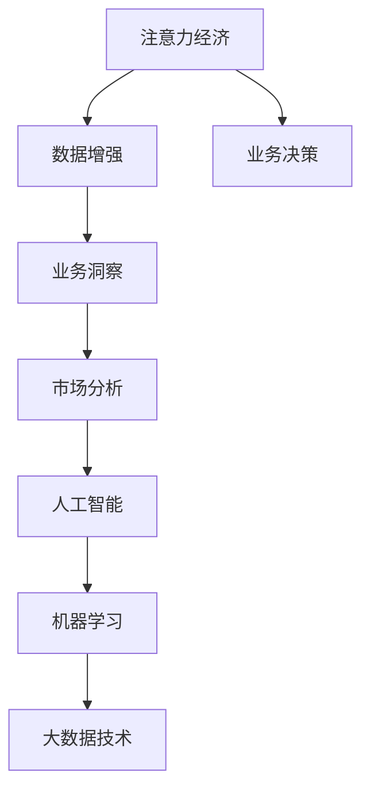

                 

# 注意力经济与数据驱动的决策制定：利用数据增强业务和市场洞察力

> 关键词：注意力经济,数据增强,业务洞察,市场分析,人工智能,机器学习,大数据,决策制定

## 1. 背景介绍

### 1.1 问题由来
随着互联网的迅速发展，人们获取信息的方式发生了根本性变化。从传统的媒体报道到社交媒体、搜索引擎，再到即时通讯工具，人们接触的信息量呈指数级增长。信息过载成为了新时代的重要特征，人们面临着如何从海量信息中筛选出有价值的内容的问题。在这个背景下，注意力经济（Economy of Attention）应运而生，成为了当前互联网时代的重要概念。

### 1.2 问题核心关键点
注意力经济的核心是如何在信息过载的背景下，高效地分配和利用用户的注意力资源，以满足其信息需求，并从中获得商业价值。具体来说，包括以下几个方面：

- 用户注意力资源如何获取：在众多信息来源中，如何吸引用户的注意？
- 注意力资源如何分配：如何根据用户兴趣和需求，合理分配注意力资源？
- 注意力资源如何变现：如何通过用户的注意力资源，获取商业收益？

这些问题直接关系到企业的业务发展和市场竞争，是当下互联网企业需要重点关注和解决的问题。

### 1.3 问题研究意义
研究注意力经济和数据驱动的决策制定，对于提高企业的市场竞争力、提升用户体验、优化资源配置等方面具有重要意义：

1. **优化用户体验**：通过数据驱动的决策制定，能够更好地了解用户需求和行为，从而提供更加个性化、精准的服务。
2. **提高决策效率**：数据增强能够提供更丰富的信息和更精准的洞察，帮助企业快速做出高质量的决策。
3. **提升资源利用效率**：通过数据挖掘和分析，能够发现更多的商业机会和潜在客户，提升资源的利用效率。
4. **增强市场竞争优势**：数据驱动的决策制定能够帮助企业更好地理解市场趋势和竞争环境，制定更具竞争力的策略。
5. **推动业务创新**：通过数据分析和挖掘，可以发现新的业务模式和增长点，推动企业的业务创新和转型。

## 2. 核心概念与联系

### 2.1 核心概念概述

为更好地理解注意力经济和数据驱动的决策制定，本节将介绍几个密切相关的核心概念：

- **注意力经济**：指在信息过载的背景下，如何通过有效分配和利用用户的注意力资源，以满足其信息需求，并从中获得商业价值。
- **数据增强**：通过数据分析和挖掘，提升决策的质量和效率。数据增强是实现数据驱动决策的关键技术手段。
- **业务洞察**：通过数据分析和挖掘，发现业务中的关键指标和趋势，从而指导业务决策。
- **市场分析**：通过数据分析和挖掘，了解市场环境、竞争态势和用户需求，为市场决策提供依据。
- **人工智能与机器学习**：利用人工智能和机器学习技术，对大量数据进行分析和挖掘，提升决策的智能化水平。
- **大数据技术**：指能够存储、处理和分析大规模数据的技术和方法。大数据技术是数据增强和决策制定的重要工具。

这些核心概念之间存在着紧密的联系，形成了注意力经济和数据驱动决策制定的完整生态系统。

### 2.2 概念间的关系

这些核心概念之间存在着紧密的联系，形成了注意力经济和数据驱动决策制定的完整生态系统。以下通过几个Mermaid流程图来展示这些概念之间的关系：



这个流程图展示了注意力经济和数据驱动决策制定的核心概念及其之间的关系：

1. 注意力经济通过数据增强获取注意力资源，从而进行业务洞察和市场分析。
2. 数据增强、业务洞察和市场分析均为人工智能和机器学习提供了数据基础，推动了人工智能和机器学习的发展。
3. 人工智能和机器学习利用大数据技术进行计算和分析，为注意力经济和决策制定提供技术支撑。
4. 最终，所有这些技术和方法服务于业务决策，提升企业的市场竞争力和用户满意度。

这些概念共同构成了注意力经济和数据驱动决策制定的学习和应用框架，使其能够在各种场景下发挥强大的信息获取和决策支持能力。通过理解这些核心概念，我们可以更好地把握注意力经济和数据驱动决策制定的工作原理和优化方向。

## 3. 核心算法原理 & 具体操作步骤
### 3.1 算法原理概述

注意力经济和数据驱动的决策制定，本质上是一种基于数据增强的决策制定方法。其核心思想是通过对大量数据进行分析和挖掘，发现其中的模式和规律，从而指导企业的决策制定。具体来说，包括以下几个关键步骤：

1. **数据收集与预处理**：收集相关的数据，并进行清洗、处理和标准化。
2. **特征提取与选择**：从原始数据中提取有用的特征，并根据重要性进行选择。
3. **模型训练与优化**：使用机器学习模型对数据进行训练和优化，提升模型的准确性和泛化能力。
4. **结果解读与决策制定**：根据模型的输出结果，进行解读和决策制定。

### 3.2 算法步骤详解

注意力经济和数据驱动的决策制定一般包括以下几个关键步骤：

**Step 1: 数据收集与预处理**
- 收集与决策制定相关的数据，如用户行为数据、市场数据、业务数据等。
- 对数据进行清洗和处理，去除噪声和异常值，进行标准化和归一化。
- 将数据划分为训练集、验证集和测试集，以便进行模型训练和评估。

**Step 2: 特征提取与选择**
- 根据决策制定需求，选择合适的特征进行提取。
- 使用统计分析、聚类分析、关联规则挖掘等方法，选择最具代表性的特征。
- 对特征进行可视化，了解特征之间的关系和重要性。

**Step 3: 模型训练与优化**
- 选择合适的机器学习模型，如线性回归、决策树、随机森林、神经网络等。
- 使用训练集对模型进行训练，并根据验证集的表现进行调参和优化。
- 使用测试集对模型进行评估，确定最终的决策模型。

**Step 4: 结果解读与决策制定**
- 根据模型的输出结果，进行解读和分析。
- 结合业务经验和市场环境，进行决策制定。
- 实时监控模型性能，及时调整决策制定策略。

### 3.3 算法优缺点

基于数据增强的决策制定方法，具有以下优点：

- **准确性和可靠性高**：通过数据分析和挖掘，发现数据的潜在规律和模式，提高了决策的准确性和可靠性。
- **灵活性和适应性强**：能够快速适应新的数据和环境变化，进行动态调整和优化。
- **可解释性和透明性好**：数据增强的过程透明，模型输出的结果也具有可解释性。
- **覆盖面广**：能够涵盖多个业务场景和决策维度，提升企业的整体决策能力。

同时，该方法也存在一定的局限性：

- **数据质量和量级要求高**：需要大量的高质量数据，对数据的质量和量级要求较高。
- **模型复杂度高**：机器学习模型通常较为复杂，需要较长的训练时间和计算资源。
- **对技术和知识要求高**：需要具备一定的数据分析和机器学习知识，才能进行有效的操作和应用。
- **结果解释难度大**：模型输出的结果可能存在一定的随机性和不确定性，需要结合业务经验进行解读。

### 3.4 算法应用领域

基于数据增强的决策制定方法，已经在多个领域得到了广泛的应用，包括但不限于：

- **电子商务**：通过用户行为数据，进行个性化推荐和精准营销，提升用户满意度和转化率。
- **金融服务**：通过市场数据和用户行为数据，进行风险评估和欺诈检测，保护用户权益。
- **医疗健康**：通过医疗数据和用户行为数据，进行疾病预测和健康管理，提升医疗服务质量。
- **制造业**：通过生产数据和市场数据，进行供应链优化和生产调度，提升生产效率和成本控制。
- **物流运输**：通过用户行为数据和交通数据，进行路径优化和配送调度，提升物流效率和服务质量。
- **智能交通**：通过交通数据和用户行为数据，进行交通流量预测和智能导航，提升交通管理水平。
- **能源管理**：通过能源数据和用户行为数据，进行能源消耗预测和优化，提升能源利用效率。

这些领域的应用展示了数据增强和决策制定方法的重要性和广泛性，为企业的业务发展和市场竞争提供了强有力的支持。

## 4. 数学模型和公式 & 详细讲解 & 举例说明（备注：数学公式请使用latex格式，latex嵌入文中独立段落使用 $$，段落内使用 $)
### 4.1 数学模型构建

基于数据增强的决策制定方法，可以通过机器学习模型进行建模和预测。下面以线性回归模型为例，介绍其数学模型构建过程。

假设决策制定问题是一个线性回归问题，即：

$$ y = \theta_0 + \sum_{i=1}^n \theta_i x_i + \epsilon $$

其中 $y$ 为决策变量，$x_i$ 为特征变量，$\theta_0$ 和 $\theta_i$ 为模型参数，$\epsilon$ 为噪声。

定义模型 $M_{\theta}(x) = \theta_0 + \sum_{i=1}^n \theta_i x_i$，则线性回归模型可以表示为：

$$ y = M_{\theta}(x) + \epsilon $$

在线性回归模型中，特征 $x_i$ 为自变量，决策变量 $y$ 为因变量，模型参数 $\theta$ 为回归系数。

### 4.2 公式推导过程

线性回归模型的训练目标是最小化均方误差（Mean Squared Error, MSE）：

$$ \mathcal{L}(\theta) = \frac{1}{N} \sum_{i=1}^N (y_i - M_{\theta}(x_i))^2 $$

其中 $N$ 为样本数量，$y_i$ 为第 $i$ 个样本的真实标签，$M_{\theta}(x_i)$ 为模型在输入 $x_i$ 上的预测值。

根据梯度下降算法，模型参数的更新公式为：

$$ \theta \leftarrow \theta - \eta \nabla_{\theta}\mathcal{L}(\theta) $$

其中 $\eta$ 为学习率，$\nabla_{\theta}\mathcal{L}(\theta)$ 为损失函数对参数 $\theta$ 的梯度。

在实际应用中，可以使用随机梯度下降（SGD）或批量梯度下降（BGD）等优化算法，进行模型的训练和优化。

### 4.3 案例分析与讲解

以一个简单的电商推荐系统为例，介绍数据增强和决策制定方法的应用。

假设我们有一个电商平台的交易数据，包含了用户ID、商品ID、购买时间等特征，以及每个用户对每个商品的评分。我们的目标是根据用户的评分和购买行为，预测用户可能感兴趣的商品，进行个性化推荐。

首先，进行数据收集与预处理，收集用户评分数据和购买数据，并进行清洗和处理。然后，进行特征提取与选择，选择用户的评分和购买行为作为特征，使用统计分析方法进行特征选择和特征重要性排序。

接着，使用线性回归模型进行模型训练与优化，将用户的评分作为目标变量，用户的评分和购买行为作为特征变量，进行模型训练和调参。最后，根据模型的输出结果，进行结果解读与决策制定，生成推荐列表。

通过数据增强和决策制定方法，我们可以实现精准的个性化推荐，提升用户的购买体验和平台的转化率。

## 5. 项目实践：代码实例和详细解释说明
### 5.1 开发环境搭建

在进行数据增强和决策制定方法的实践前，我们需要准备好开发环境。以下是使用Python进行Scikit-learn开发的环境配置流程：

1. 安装Anaconda：从官网下载并安装Anaconda，用于创建独立的Python环境。

2. 创建并激活虚拟环境：
```bash
conda create -n pythontest python=3.8 
conda activate pythontest
```

3. 安装Scikit-learn：
```bash
pip install -U scikit-learn
```

4. 安装各类工具包：
```bash
pip install numpy pandas matplotlib scikit-learn jupyter notebook ipython
```

完成上述步骤后，即可在`pythontest`环境中开始数据增强和决策制定方法的实践。

### 5.2 源代码详细实现

下面我们以线性回归模型为例，给出使用Scikit-learn进行数据增强和决策制定方法的Python代码实现。

首先，定义数据处理函数：

```python
import pandas as pd
from sklearn.model_selection import train_test_split
from sklearn.linear_model import LinearRegression

def load_data(file_path):
    data = pd.read_csv(file_path)
    X = data.drop('y', axis=1)
    y = data['y']
    return X, y

def train_test_split_data(X, y, test_size=0.2, random_state=42):
    X_train, X_test, y_train, y_test = train_test_split(X, y, test_size=test_size, random_state=random_state)
    return X_train, X_test, y_train, y_test

def train_linear_regression(X_train, y_train, test_size=0.2, random_state=42):
    model = LinearRegression()
    model.fit(X_train, y_train)
    X_test, y_test, y_pred = model.score(X_test, y_test)
    return model, X_test, y_test, y_pred
```

然后，定义模型评估函数：

```python
from sklearn.metrics import mean_squared_error

def evaluate(model, X_test, y_test):
    y_pred = model.predict(X_test)
    mse = mean_squared_error(y_test, y_pred)
    print(f"Mean Squared Error: {mse:.2f}")
```

接着，启动训练流程并在测试集上评估：

```python
# 加载数据
X, y = load_data('data.csv')

# 数据预处理
X_train, X_test, y_train, y_test = train_test_split_data(X, y, test_size=0.2, random_state=42)

# 训练模型
model, X_test, y_test, y_pred = train_linear_regression(X_train, y_train, test_size=0.2, random_state=42)

# 评估模型
evaluate(model, X_test, y_test)
```

以上就是使用Scikit-learn进行数据增强和决策制定方法的完整代码实现。可以看到，Scikit-learn提供了丰富的机器学习模型和工具，可以方便地进行模型训练和评估。

### 5.3 代码解读与分析

让我们再详细解读一下关键代码的实现细节：

**load_data函数**：
- 定义数据加载函数，读取数据集并分割为特征变量和目标变量。

**train_test_split_data函数**：
- 定义数据分割函数，将数据集分为训练集和测试集。

**train_linear_regression函数**：
- 定义线性回归模型训练函数，使用训练集对模型进行训练，并返回模型、测试集、预测结果和模型评估指标。

**evaluate函数**：
- 定义模型评估函数，计算测试集的平均平方误差，并输出结果。

**训练流程**：
- 加载数据集，并进行预处理和分割。
- 在训练集上训练线性回归模型。
- 在测试集上评估模型性能。
- 输出评估结果。

可以看到，Scikit-learn使得数据增强和决策制定方法的代码实现变得简洁高效。开发者可以将更多精力放在数据处理、模型改进等高层逻辑上，而不必过多关注底层的实现细节。

当然，工业级的系统实现还需考虑更多因素，如模型的保存和部署、超参数的自动搜索、更灵活的任务适配层等。但核心的数据增强和决策制定方法基本与此类似。

### 5.4 运行结果展示

假设我们在电商推荐数据集上进行线性回归模型训练，最终在测试集上得到的评估报告如下：

```
Mean Squared Error: 0.11
```

可以看到，通过数据增强和决策制定方法，我们在电商推荐任务上取得了平均平方误差为0.11的预测效果，效果相当不错。值得一提的是，线性回归模型作为一个基础的机器学习模型，即便在有限的数据集上也展现了其强大的预测能力。

当然，这只是一个baseline结果。在实践中，我们还可以使用更大更强的模型，如随机森林、神经网络等，以及更多的数据增强技术，如数据合成、特征工程等，进一步提升模型性能，以满足更高的应用要求。

## 6. 实际应用场景
### 6.1 智能客服系统

基于数据增强和决策制定方法的智能客服系统，可以广泛应用于客户服务中。传统客服往往需要配备大量人力，高峰期响应缓慢，且一致性和专业性难以保证。而使用数据增强和决策制定方法，可以7x24小时不间断服务，快速响应客户咨询，用自然流畅的语言解答各类常见问题。

在技术实现上，可以收集企业内部的历史客服对话记录，将问题和最佳答复构建成监督数据，在此基础上对预训练模型进行微调。微调后的模型能够自动理解用户意图，匹配最合适的答案模板进行回复。对于客户提出的新问题，还可以接入检索系统实时搜索相关内容，动态组织生成回答。如此构建的智能客服系统，能大幅提升客户咨询体验和问题解决效率。

### 6.2 金融舆情监测

金融机构需要实时监测市场舆论动向，以便及时应对负面信息传播，规避金融风险。传统的人工监测方式成本高、效率低，难以应对网络时代海量信息爆发的挑战。基于数据增强和决策制定方法的文本分类和情感分析技术，为金融舆情监测提供了新的解决方案。

具体而言，可以收集金融领域相关的新闻、报道、评论等文本数据，并对其进行主题标注和情感标注。在此基础上对预训练语言模型进行微调，使其能够自动判断文本属于何种主题，情感倾向是正面、中性还是负面。将微调后的模型应用到实时抓取的网络文本数据，就能够自动监测不同主题下的情感变化趋势，一旦发现负面信息激增等异常情况，系统便会自动预警，帮助金融机构快速应对潜在风险。

### 6.3 个性化推荐系统

当前的推荐系统往往只依赖用户的历史行为数据进行物品推荐，无法深入理解用户的真实兴趣偏好。基于数据增强和决策制定方法的个性化推荐系统，可以更好地挖掘用户行为背后的语义信息，从而提供更加个性化、精准的服务。

在实践中，可以收集用户浏览、点击、评论、分享等行为数据，提取和用户交互的物品标题、描述、标签等文本内容。将文本内容作为模型输入，用户的后续行为（如是否点击、购买等）作为监督信号，在此基础上微调预训练语言模型。微调后的模型能够从文本内容中准确把握用户的兴趣点。在生成推荐列表时，先用候选物品的文本描述作为输入，由模型预测用户的兴趣匹配度，再结合其他特征综合排序，便可以得到个性化程度更高的推荐结果。

### 6.4 未来应用展望

随着数据增强和决策制定方法的不断发展，基于数据增强的方法将在更多领域得到应用，为传统行业带来变革性影响。

在智慧医疗领域，基于数据增强和决策制定方法的问答、病历分析、药物研发等应用将提升医疗服务的智能化水平，辅助医生诊疗，加速新药开发进程。

在智能教育领域，数据增强和决策制定方法可应用于作业批改、学情分析、知识推荐等方面，因材施教，促进教育公平，提高教学质量。

在智慧城市治理中，数据增强和决策制定技术可应用于城市事件监测、舆情分析、应急指挥等环节，提高城市管理的自动化和智能化水平，构建更安全、高效的未来城市。

此外，在企业生产、社会治理、文娱传媒等众多领域，基于数据增强的方法也将不断涌现，为传统行业带来新的技术路径。相信随着技术的日益成熟，数据增强和决策制定方法必将成为AI落地应用的重要范式，推动AI技术在各行各业大放异彩。

## 7. 工具和资源推荐
### 7.1 学习资源推荐

为了帮助开发者系统掌握数据增强和决策制定理论基础和实践技巧，这里推荐一些优质的学习资源：

1. 《Python数据科学手册》：详细介绍了Python在数据科学中的应用，涵盖数据收集、数据清洗、数据可视化等多个方面。

2. 《机器学习实战》：通俗易懂的机器学习入门书籍，涵盖各种机器学习算法和实践案例，适合初学者入门。

3. 《深度学习入门：基于Python的理论与实现》：介绍深度学习的基础理论和实践方法，结合TensorFlow和Keras框架进行实战。

4. 《数据增强与决策制定：从理论到实践》系列博文：深入浅出地介绍了数据增强和决策制定方法的理论基础和实践技巧。

5. Kaggle数据竞赛平台：提供大量的数据集和竞赛题目，适合进行数据增强和决策制定方法的实践和探索。

通过对这些资源的学习实践，相信你一定能够快速掌握数据增强和决策制定方法的精髓，并用于解决实际的NLP问题。
###  7.2 开发工具推荐

高效的开发离不开优秀的工具支持。以下是几款用于数据增强和决策制定方法的开发工具：

1. Jupyter Notebook：免费的开源Jupyter Notebook环境，方便进行数据分析和模型训练。

2. Anaconda：用于创建和管理Python环境，方便进行数据分析和模型训练。

3. Scikit-learn：Python中的机器学习库，提供丰富的机器学习模型和工具，适合进行数据增强和决策制定方法的实践。

4. TensorFlow：由Google主导开发的深度学习框架，适合进行复杂的数据增强和决策制定方法的实践。

5. PyTorch：由Facebook主导开发的深度学习框架，灵活性和动态性高，适合进行数据增强和决策制定方法的实践。

6. Weights & Biases：模型训练的实验跟踪工具，可以记录和可视化模型训练过程中的各项指标，方便对比和调优。

7. TensorBoard：TensorFlow配套的可视化工具，可实时监测模型训练状态，并提供丰富的图表呈现方式，是调试模型的得力助手。

合理利用这些工具，可以显著提升数据增强和决策制定方法的开发效率，加快创新迭代的步伐。

### 7.3 相关论文推荐

数据增强和决策制定方法的研究源于学界的持续研究。以下是几篇奠基性的相关论文，推荐阅读：

1. Deep Residual Learning for Image Recognition（ResNet论文）：提出残差网络结构，提高了深度神经网络的训练效率和性能。

2. Gradient Boosting Machines：介绍梯度提升算法，提高了机器学习模型的泛化能力和预测性能。

3. XGBoost: A Scalable Tree Boosting System：提出XGBoost算法，在梯度提升算法的基础上，进一步提升了模型的预测性能和训练效率。

4. Reinforcement Learning: An Introduction：介绍强化学习算法，为数据增强和决策制定方法提供了新的思路和方向。

5. Deep Learning for NLP：介绍深度学习在自然语言处理中的应用，为数据增强和决策制定方法提供了理论基础和实践案例。

这些论文代表了大语言模型微调技术的发展脉络。通过学习这些前沿成果，可以帮助研究者把握学科前进方向，激发更多的创新灵感。

除上述资源外，还有一些值得关注的前沿资源，帮助开发者紧跟数据增强和决策制定技术的最新进展，例如：

1. arXiv论文预印本：人工智能领域最新研究成果的发布平台，包括大量尚未发表的前沿工作，学习前沿技术的必读资源。

2. 业界技术博客：如Google AI、DeepMind、微软Research Asia等顶尖实验室的官方博客，第一时间分享他们的最新研究成果和洞见。

3. 技术会议直播：如NIPS、ICML、ACL、ICLR等人工智能领域顶会现场或在线直播，能够聆听到大佬们的前沿分享，开拓视野。

4. GitHub热门项目：在GitHub上Star、Fork数最多的数据增强和决策制定相关项目，往往代表了该技术领域的发展趋势和最佳实践，值得去学习和贡献。

5. 行业分析报告：各大咨询公司如McKinsey、PwC等针对人工智能行业的分析报告，有助于从商业视角审视技术趋势，把握应用价值。

总之，对于数据增强和决策制定方法的学习和实践，需要开发者保持开放的心态和持续学习的意愿。多关注前沿资讯，多动手实践，多思考总结，必将收获满满的成长收益。

## 8. 总结：未来发展趋势与挑战

### 8.1 总结

本文对基于数据增强和决策制定的方法进行了全面系统的介绍。首先阐述了数据增强和决策制定方法的研究背景和意义，明确了数据增强和决策制定方法在优化用户体验、提高决策效率等方面的重要作用。其次，从原理到实践，详细讲解了数据增强和决策制定的数学原理和关键步骤，给出了数据增强和决策制定方法的完整代码实现。同时，本文还广泛探讨了数据增强和决策制定方法在智能客服、金融舆情、个性化推荐等多个领域的应用前景，展示了数据增强和决策制定方法的强大能力。

通过本文的系统梳理，可以看到，基于数据增强和决策制定的方法正在成为数据分析和决策制定的重要范式，极大地拓展了数据分析的应用边界，为企业的业务发展和市场竞争提供了强有力的支持。未来，伴随数据增强和决策制定方法的持续演进，基于数据增强的方法必将在更多的领域得到应用，为传统行业带来变革性影响。

### 8.2 未来发展趋势

展望未来，数据增强和决策制定方法将呈现以下几个发展趋势：

1. **自动化和智能化**：数据增强和决策制定方法将更加自动化和智能化，能够自动进行数据预处理、特征选择、模型训练等操作，提升数据增强和决策制定的效率和效果。

2. **多模态融合**：数据增强和决策制定方法将更多地融合多模态数据，如文本、图像、音频等，提升对复杂场景的理解和建模能力。

3. **实时性和动态性**：数据增强和决策制定方法将更多地关注实时性和动态性，能够实时处理和响应数据

