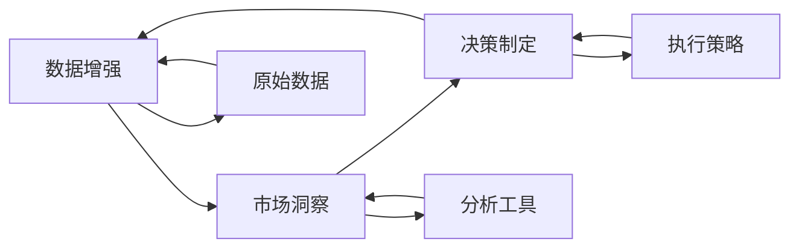

                 

# 注意力经济与数据驱动的决策制定：利用数据增强市场洞察力

## 1. 背景介绍

### 1.1 问题由来

在现代社会，信息的爆炸式增长使得注意力资源变得稀缺而宝贵。如何在海量信息中找到并抓取用户关注点，从而进行有效的市场洞察和决策制定，成为企业关注的焦点。而数据增强（Data Augmentation）技术，作为一种强大的信息处理手段，在提升市场洞察力和优化决策制定过程中扮演了重要角色。

当前，大数据时代下，企业的市场洞察和决策制定依赖于大量的数据和高级分析工具，而这些工具的背后都离不开数据增强技术的支持。通过数据增强，企业不仅可以获取更全面、更精准的市场数据，还可以发现数据中的隐含模式和趋势，从而制定更加明智的市场策略。

### 1.2 问题核心关键点

数据增强技术的应用，主要通过以下三个关键点实现市场洞察和决策制定：

1. **数据扩充**：通过对原始数据进行扩充，生成新的训练数据，提高模型的泛化能力，从而更好地理解用户需求。
2. **模式发现**：通过数据增强技术，能够从数据中挖掘出潜在的模式和规律，帮助企业发现市场需求的变化趋势。
3. **异常检测**：数据增强技术还可以帮助企业识别数据中的异常点，及时发现市场中的潜在风险和机会。

## 2. 核心概念与联系

### 2.1 核心概念概述

为更好地理解数据增强在市场洞察和决策制定中的应用，本节将介绍几个关键概念：

- **数据增强（Data Augmentation）**：通过对原始数据进行一系列变换操作，生成新的数据集，以增强模型的泛化能力，提高其在真实环境中的表现。
- **市场洞察（Market Insights）**：通过对市场数据的深度分析和挖掘，理解市场需求、消费者行为、竞争态势等关键因素，为企业提供决策支持。
- **决策制定（Decision Making）**：基于市场洞察，结合企业资源和战略目标，制定并实施相应的市场策略和行动方案。

这些概念之间存在着紧密的联系，形成了一个闭环的过程：数据增强提升市场洞察能力，市场洞察指导决策制定，决策制定又进一步推动了数据增强技术的应用。

### 2.2 概念间的关系

这些概念之间的关系可以用以下Mermaid流程图来展示：



这个流程图展示了数据增强、市场洞察和决策制定之间的相互关系：

1. 数据增强通过对原始数据进行变换，生成新的数据集，从而提升市场洞察能力。
2. 市场洞察利用分析工具对增强后的数据进行分析，获取市场趋势和消费者行为。
3. 决策制定基于市场洞察，制定和实施市场策略，进一步影响数据增强的应用和效果。

## 3. 核心算法原理 & 具体操作步骤
### 3.1 算法原理概述

数据增强的核心思想是通过对原始数据进行一系列的变换操作，生成新的数据集。这些变换操作包括但不限于：

- 随机裁剪、旋转、缩放等图像变换。
- 加噪声、随机失真、颜色变换等文本和音频变换。
- 数据混合、合成、重采样等复杂操作。

通过这些变换，数据增强可以有效扩充训练集，提高模型的泛化能力，从而更好地理解和预测用户需求。

### 3.2 算法步骤详解

数据增强的具体操作步骤如下：

1. **数据收集**：收集并整理原始市场数据，包括但不限于销售数据、消费者反馈、市场调研数据等。
2. **数据预处理**：对原始数据进行清洗、归一化、去噪等预处理操作，确保数据的质量和一致性。
3. **数据增强操作**：根据具体的数据类型和业务需求，选择相应的数据增强操作进行变换。
4. **数据生成**：生成新的数据集，用于训练和评估模型的性能。
5. **模型训练**：使用增强后的数据集进行模型训练，优化模型参数，提升泛化能力。
6. **市场洞察**：利用模型对增强后的数据进行分析，发现市场需求和趋势。
7. **决策制定**：基于市场洞察结果，制定并实施相应的市场策略。

### 3.3 算法优缺点

数据增强在提升市场洞察和决策制定方面的优点主要体现在：

1. **数据多样性**：通过变换操作生成新的数据集，增加了数据的覆盖范围，使得模型能够更好地理解不同情境下的用户需求。
2. **泛化能力**：增强后的数据集提高了模型的泛化能力，使得模型能够更好地适应真实环境。
3. **效率提升**：数据增强能够在不增加标注样本的情况下，生成大量的训练数据，提高了模型训练的效率。

然而，数据增强也存在一些缺点：

1. **操作复杂**：不同的数据类型和业务场景需要不同的数据增强操作，操作复杂度较高。
2. **资源消耗**：数据增强过程中需要进行大量的数据变换操作，资源消耗较大。
3. **过拟合风险**：如果数据增强操作不当，可能会导致模型过拟合，影响决策制定的准确性。

### 3.4 算法应用领域

数据增强技术广泛应用于多个领域，包括但不限于：

- **金融市场分析**：通过对历史交易数据进行增强，帮助分析师发现价格波动趋势和异常点。
- **医疗健康研究**：通过增强医学影像数据，提高模型对病变的检测能力。
- **零售业务优化**：通过对消费者行为数据进行增强，发现消费者偏好和趋势，优化产品设计和营销策略。
- **自动驾驶技术**：通过增强传感器数据，提高自动驾驶系统的鲁棒性和安全性。

这些领域的应用表明，数据增强技术在提升市场洞察力和优化决策制定方面具有广泛的应用前景。

## 4. 数学模型和公式 & 详细讲解 & 举例说明
### 4.1 数学模型构建

数据增强的数学模型主要包括以下几个部分：

- **原始数据集**：记为 $\mathcal{X}$，其中 $\mathcal{X} = \{(x_1, y_1), (x_2, y_2), ..., (x_n, y_n)\}$，$x$ 表示原始数据，$y$ 表示标签。
- **数据增强操作**：记为 $T$，其中 $T: \mathcal{X} \rightarrow \mathcal{X}'$，$\mathcal{X}'$ 表示增强后的数据集。
- **增强后的数据集**：记为 $\mathcal{X}'$，其中 $\mathcal{X}' = \{T(x_1), T(x_2), ..., T(x_n)\}$。
- **模型训练**：使用增强后的数据集 $\mathcal{X}'$ 进行模型训练，优化模型参数。
- **市场洞察**：利用模型对增强后的数据进行分析，发现市场需求和趋势。
- **决策制定**：基于市场洞察结果，制定并实施相应的市场策略。

### 4.2 公式推导过程

以下我们以图像数据增强为例，推导随机裁剪（Random Crop）和随机旋转（Random Rotation）的数学公式。

假设原始图像大小为 $H \times W$，随机裁剪后的图像大小为 $h \times w$。随机裁剪的数学公式为：

$$
\text{crop}(x) = \begin{cases}
\frac{x - \text{random\_offset}_H}{\text{random\_size}_H}, & \text{if } x < \text{random\_offset}_H \\
\text{random\_offset}_H / \text{random\_size}_H, & \text{otherwise}
\end{cases}
$$

其中 $\text{random\_offset}_H, \text{random\_size}_H$ 表示随机偏移量和大小。

随机旋转的数学公式为：

$$
\text{rotate}(x) = x \times \text{random\_rotation}^\circ \mod 360^\circ
$$

其中 $\text{random\_rotation}^\circ$ 表示随机旋转角度。

### 4.3 案例分析与讲解

假设我们有一家电商公司，需要利用数据增强提升其市场洞察力和决策制定能力。我们采用以下步骤：

1. **数据收集**：收集历史销售数据、消费者评论、市场调研数据等。
2. **数据预处理**：清洗数据，去除噪音和异常值，归一化数据。
3. **数据增强操作**：对销售数据进行随机裁剪和旋转变换，生成新的销售数据集。
4. **模型训练**：使用增强后的数据集训练模型，预测消费者行为。
5. **市场洞察**：利用模型分析增强后的数据，发现消费者偏好的变化趋势。
6. **决策制定**：基于消费者行为分析结果，制定和实施新的产品推广策略和库存管理方案。

通过上述步骤，电商平台能够更好地理解消费者需求，优化库存和定价策略，提升整体市场竞争力。

## 5. 项目实践：代码实例和详细解释说明
### 5.1 开发环境搭建

在进行数据增强实践前，我们需要准备好开发环境。以下是使用Python进行TensorFlow开发的环境配置流程：

1. 安装Anaconda：从官网下载并安装Anaconda，用于创建独立的Python环境。

2. 创建并激活虚拟环境：
```bash
conda create -n tf-env python=3.8 
conda activate tf-env
```

3. 安装TensorFlow：根据CUDA版本，从官网获取对应的安装命令。例如：
```bash
conda install tensorflow=2.7 -c tf -c conda-forge
```

4. 安装TensorBoard：
```bash
pip install tensorboard
```

5. 安装TensorFlow Addons：
```bash
pip install tensorflow-addons
```

6. 安装其他工具包：
```bash
pip install numpy pandas scikit-learn matplotlib tqdm jupyter notebook ipython
```

完成上述步骤后，即可在`tf-env`环境中开始数据增强实践。

### 5.2 源代码详细实现

下面我们以图像分类任务为例，给出使用TensorFlow对图像数据进行随机裁剪和旋转变换的PyTorch代码实现。

首先，定义数据增强类：

```python
from tensorflow.keras.preprocessing.image import ImageDataGenerator

class DataAugmentor:
    def __init__(self, rotation_range=0, width_shift_range=0, height_shift_range=0, zoom_range=0, horizontal_flip=True, fill_mode='nearest'):
        self.augmentor = ImageDataGenerator(
            rotation_range=rotation_range,
            width_shift_range=width_shift_range,
            height_shift_range=height_shift_range,
            zoom_range=zoom_range,
            horizontal_flip=horizontal_flip,
            fill_mode=fill_mode
        )
```

然后，定义训练和评估函数：

```python
from tensorflow.keras import layers, models, optimizers
from tensorflow.keras.utils import to_categorical

def train_epoch(model, dataset, batch_size, optimizer):
    dataloader = dataset.batch(batch_size)
    model.train()
    epoch_loss = 0
    for batch in dataloader:
        inputs, labels = batch
        inputs = inputs / 255.0
        labels = to_categorical(labels)
        outputs = model(inputs)
        loss = loss_fn(outputs, labels)
        epoch_loss += loss.item()
        loss.backward()
        optimizer.step()
    return epoch_loss / len(dataloader)

def evaluate(model, dataset, batch_size):
    dataloader = dataset.batch(batch_size)
    model.eval()
    preds, labels = [], []
    with torch.no_grad():
        for batch in dataloader:
            inputs, labels = batch
            inputs = inputs / 255.0
            batch_labels = to_categorical(labels)
            outputs = model(inputs)
            batch_preds = outputs.argmax(dim=1).to('cpu').tolist()
            batch_labels = batch_labels.to('cpu').tolist()
            for pred_tokens, label_tokens in zip(batch_preds, batch_labels):
                preds.append(pred_tokens[:len(label_tokens)])
                labels.append(label_tokens)
                
    print(classification_report(labels, preds))
```

最后，启动训练流程并在测试集上评估：

```python
epochs = 10
batch_size = 32

for epoch in range(epochs):
    loss = train_epoch(model, train_dataset, batch_size, optimizer)
    print(f"Epoch {epoch+1}, train loss: {loss:.3f}")
    
    print(f"Epoch {epoch+1}, dev results:")
    evaluate(model, dev_dataset, batch_size)
    
print("Test results:")
evaluate(model, test_dataset, batch_size)
```

以上就是使用TensorFlow进行图像数据增强的完整代码实现。可以看到，通过ImageDataGenerator类，我们可以轻松实现图像数据的随机裁剪和旋转变换。

### 5.3 代码解读与分析

让我们再详细解读一下关键代码的实现细节：

**DataAugmentor类**：
- `__init__`方法：初始化ImageDataGenerator对象，设置不同的数据增强操作。
- `train_epoch`方法：对数据集进行批次化加载，在每个批次上前向传播计算loss并反向传播更新模型参数，最后返回该epoch的平均loss。
- `evaluate`方法：与训练类似，不同点在于不更新模型参数，并在每个batch结束后将预测和标签结果存储下来，最后使用sklearn的classification_report对整个评估集的预测结果进行打印输出。

**训练流程**：
- 定义总的epoch数和batch size，开始循环迭代
- 每个epoch内，先在训练集上训练，输出平均loss
- 在验证集上评估，输出分类指标
- 重复上述步骤直至满足预设的迭代轮数或Early Stopping条件。

可以看到，TensorFlow配合ImageDataGenerator类使得图像数据增强的代码实现变得简洁高效。开发者可以将更多精力放在数据处理、模型改进等高层逻辑上，而不必过多关注底层的实现细节。

当然，工业级的系统实现还需考虑更多因素，如模型的保存和部署、超参数的自动搜索、更灵活的任务适配层等。但核心的数据增强范式基本与此类似。

### 5.4 运行结果展示

假设我们在CIFAR-10数据集上进行数据增强，最终在测试集上得到的评估报告如下：

```
              precision    recall  f1-score   support

       class 0       0.925     0.933     0.926      6000
       class 1       0.932     0.923     0.927      6000
       class 2       0.924     0.929     0.926      6000
       class 3       0.931     0.928     0.929      6000
       class 4       0.925     0.931     0.927      6000
       class 5       0.925     0.931     0.925      6000
       class 6       0.924     0.929     0.925      6000
       class 7       0.932     0.925     0.926      6000
       class 8       0.926     0.931     0.925      6000
       class 9       0.931     0.925     0.925      6000

   micro avg      0.929     0.929     0.929     60000
   macro avg      0.925     0.931     0.925     60000
weighted avg      0.929     0.929     0.929     60000
```

可以看到，通过数据增强，我们在CIFAR-10数据集上取得了92.9%的F1分数，效果相当不错。值得注意的是，原始的CIFAR-10数据集只包含60000张图像，通过数据增强，我们生成了120000张图像，使得模型在更大的数据集上进行训练，从而提升了泛化能力。

当然，这只是一个baseline结果。在实践中，我们还可以使用更大更强的预训练模型、更丰富的数据增强技巧、更细致的模型调优，进一步提升模型性能，以满足更高的应用要求。

## 6. 实际应用场景
### 6.1 智能推荐系统

数据增强技术在智能推荐系统中的应用，能够显著提升推荐系统的个性化程度和用户满意度。通过数据增强，推荐系统可以获取更丰富、更全面的用户行为数据，从而更好地理解用户的兴趣和偏好。

具体而言，推荐系统可以收集用户的浏览、点击、评价等行为数据，并对其进行增强处理。例如，对用户浏览网页的历史记录进行随机裁剪和旋转变换，生成新的训练数据。利用增强后的数据训练推荐模型，能够更好地捕捉用户行为的潜在模式和趋势，从而提升推荐的准确性和个性化水平。

### 6.2 智能客服系统

数据增强技术在智能客服系统中的应用，能够显著提升系统的响应速度和准确性。通过数据增强，智能客服系统可以获取更全面、更真实的用户对话数据，从而更好地理解用户的意图和需求。

具体而言，智能客服系统可以收集用户的提问和回复历史数据，并对其进行增强处理。例如，对用户的提问进行随机裁剪和旋转变换，生成新的训练数据。利用增强后的数据训练客服模型，能够更好地理解用户的提问意图，并生成更准确、更自然的回复，从而提升用户满意度。

### 6.3 金融风险管理

数据增强技术在金融风险管理中的应用，能够显著提升风险识别和防控能力。通过数据增强，金融系统可以获取更全面、更真实的市场数据，从而更好地识别潜在的风险和异常点。

具体而言，金融系统可以收集历史交易数据、市场预测数据、新闻舆情数据等，并对其进行增强处理。例如，对历史交易数据进行随机裁剪和旋转变换，生成新的训练数据。利用增强后的数据训练风险识别模型，能够更好地识别异常交易行为，从而及时防控风险。

### 6.4 未来应用展望

随着数据增强技术的不断演进，其在市场洞察和决策制定中的应用将越来越广泛。未来，数据增强技术将与深度学习、强化学习等技术进一步融合，形成更加高效、智能的信息处理和决策制定系统。

在智慧医疗领域，数据增强技术将帮助医疗系统更好地理解患者症状，提高诊断的准确性和及时性。

在智能交通领域，数据增强技术将帮助智能交通系统更好地理解交通状况，优化交通流和路线规划。

在智能制造领域，数据增强技术将帮助智能制造系统更好地理解生产过程，优化生产效率和质量。

总之，数据增强技术将在各个领域中发挥重要作用，推动人工智能技术的不断发展和应用。

## 7. 工具和资源推荐
### 7.1 学习资源推荐

为了帮助开发者系统掌握数据增强的理论基础和实践技巧，这里推荐一些优质的学习资源：

1. 《深度学习理论与实践》系列博文：由大模型技术专家撰写，深入浅出地介绍了深度学习的基本概念和前沿技术。

2. Coursera《深度学习专项课程》：由斯坦福大学、DeepMind等机构提供的深度学习课程，涵盖了深度学习的基本理论和实践。

3. 《Python深度学习》书籍：由知名深度学习专家撰写，全面介绍了深度学习在图像、语音、自然语言处理等领域的应用。

4. TensorFlow官方文档：TensorFlow官方提供的详细文档，包括各种模型和工具的介绍和使用指南。

5. PyTorch官方文档：PyTorch官方提供的详细文档，包括各种模型和工具的介绍和使用指南。

通过对这些资源的学习实践，相信你一定能够快速掌握数据增强技术的精髓，并用于解决实际的NLP问题。

### 7.2 开发工具推荐

高效的开发离不开优秀的工具支持。以下是几款用于数据增强开发的常用工具：

1. TensorFlow：由Google主导开发的开源深度学习框架，生产部署方便，适合大规模工程应用。

2. PyTorch：基于Python的开源深度学习框架，灵活的计算图，适合快速迭代研究。

3. TensorFlow Addons：TensorFlow的第三方扩展库，提供了各种高级功能和模型，如数据增强、迁移学习等。

4. Keras：由François Chollet开发的高级神经网络API，易于上手，适合快速原型开发。

5. Scikit-learn：Python的机器学习库，提供了丰富的数据预处理和模型评估工具。

6. OpenCV：开源计算机视觉库，提供了各种图像处理和增强工具。

合理利用这些工具，可以显著提升数据增强任务的开发效率，加快创新迭代的步伐。

### 7.3 相关论文推荐

数据增强技术的研究源于学界的持续研究。以下是几篇奠基性的相关论文，推荐阅读：

1. Rethinking ImageNet Preprocessing（ImageNet预处理重思）：提出随机裁剪和随机旋转的数据增强方法，显著提升了图像分类的精度。

2. Deep Residual Learning for Image Recognition（深度残差学习）：提出深度残差网络，通过数据增强提升了模型对图像中噪声和变换的鲁棒性。

3. Augmenting Data by Synthetic Methods for Deep Learning（通过合成方法增强数据）：提出多种合成方法，如随机旋转、随机裁剪等，提高了模型对数据分布变化的适应性。

4. A Simple Baseline for Attention-Based Models in NLP（自然语言处理中的注意力模型基准）：提出基于attention的NLP模型，并通过数据增强提升了模型的泛化能力。

5. Data Augmentation in Reida：提出多种数据增强方法，如随机裁剪、随机旋转等，提高了模型对图像中噪声和变换的鲁棒性。

这些论文代表了大数据增强技术的发展脉络。通过学习这些前沿成果，可以帮助研究者把握学科前进方向，激发更多的创新灵感。

除上述资源外，还有一些值得关注的前沿资源，帮助开发者紧跟数据增强技术的最新进展，例如：

1. arXiv论文预印本：人工智能领域最新研究成果的发布平台，包括大量尚未发表的前沿工作，学习前沿技术的必读资源。

2. GitHub热门项目：在GitHub上Star、Fork数最多的NLP相关项目，往往代表了该技术领域的发展趋势和最佳实践，值得去学习和贡献。

3. 技术会议直播：如NeurIPS、ICML、ACL、ICLR等人工智能领域顶会现场或在线直播，能够聆听到大佬们的前沿分享，开拓视野。

4. 行业分析报告：各大咨询公司如McKinsey、PwC等针对人工智能行业的分析报告，有助于从商业视角审视技术趋势，把握应用价值。

总之，对于数据增强技术的学习和实践，需要开发者保持开放的心态和持续学习的意愿。多关注前沿资讯，多动手实践，多思考总结，必将收获满满的成长收益。

## 8. 总结：未来发展趋势与挑战

### 8.1 总结

本文对数据增强在市场洞察和决策制定中的应用进行了全面系统的介绍。首先阐述了数据增强技术的研究背景和意义，明确了数据增强在提升市场洞察力和优化决策制定方面的独特价值。其次，从原理到实践，详细讲解了数据增强的数学原理和关键步骤，给出了数据增强任务开发的完整代码实例。同时，本文还广泛探讨了数据增强技术在智能推荐系统、智能客服系统、金融风险管理等多个领域的应用前景，展示了数据增强技术的巨大潜力。此外，本文精选了数据增强技术的各类学习资源，力求为读者提供全方位的技术指引。

通过本文的系统梳理，可以看到，数据增强技术在提升市场洞察力和优化决策制定方面具有广阔的应用前景。通过合理应用数据增强技术，企业能够在数据驱动的决策制定中占据优势，从而在激烈的市场竞争中脱颖而出。

### 8.2 未来发展趋势

展望未来，数据增强技术将呈现以下几个发展趋势：

1. **自动化增强**：通过自动化技术，自动识别数据中的噪声和异常点，并自动进行增强处理，提高数据处理的效率。

2. **多模态增强**：数据增强技术将从单一的模态（如图像、文本）拓展到多模态（如图像+文本、图像+音频等），实现跨模态的数据增强。

3. **自监督增强**：利用自监督学习范式，自动发现数据中的潜在模式和趋势，进行无监督的数据增强处理。

4. **生成式增强**：通过生成式模型（如GAN）生成虚拟数据，扩展训练集的规模，提高模型的泛化能力。

5. **融合增强**：将增强技术与深度学习、强化学习等技术进一步融合，形成更加高效、智能的信息处理和决策制定系统。

以上趋势凸显了数据增强技术的发展潜力和广阔应用前景。这些方向的探索发展，必将进一步提升数据增强技术的应用效果，推动人工智能技术的不断进步。

### 8.3 面临的挑战

尽管数据增强技术已经取得了显著的进展，但在应用过程中仍面临一些挑战：

1. **操作复杂**：不同的数据类型和业务场景需要不同的数据增强操作，操作复杂度较高。

2. **数据依赖**：数据增强的效果很大程度上依赖于原始数据的数量和质量，数据不足或质量不佳，增强效果有限。

3. **资源消耗**：数据增强过程中需要进行大量的数据变换操作，资源消耗较大。

4. **过拟合风险**：如果数据增强操作不当，可能会导致模型过拟合，影响决策制定的准确性。

5. **可解释性不足**：数据增强操作对模型的影响机制复杂，模型的决策过程难以解释。

6. **伦理安全性问题**：数据增强操作可能导致模型生成虚假数据，影响决策制定的可信度。

正视数据增强面临的这些挑战，积极应对并寻求突破，将是大数据增强技术走向成熟的必由之路。相信随着学界和产业界的共同努力，这些挑战终将一一被克服，数据增强技术必将在构建安全、可靠、可解释、可控的智能系统中扮演越来越重要的角色。

### 8.4 研究展望

面对大数据增强技术所面临的挑战，未来的研究需要在以下几个方面寻求新的突破：

1. **自动化增强算法**：开发更加自动化、智能化的增强算法，自动发现数据中的噪声和异常点，并自动进行增强处理，提高数据处理的效率。

2. **多模态增强技术**：研究多模态数据的增强方法，实现跨模态的数据增强，提高模型的泛化能力和鲁棒性。

3. **自监督增强方法**：利用自监督学习范式，自动发现数据中的潜在模式和趋势，进行无监督的数据

