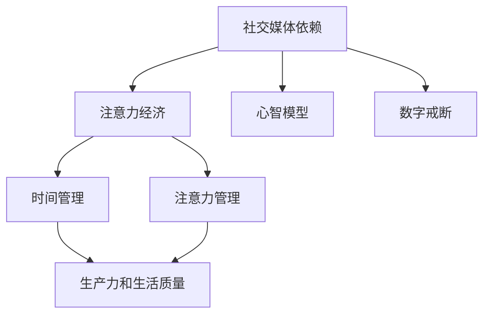
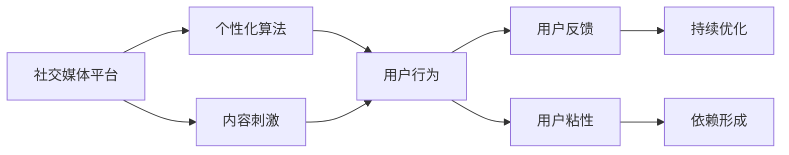
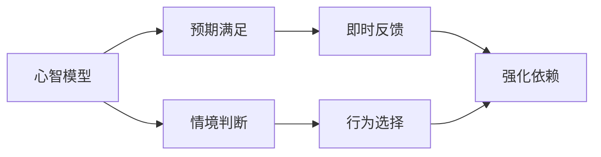
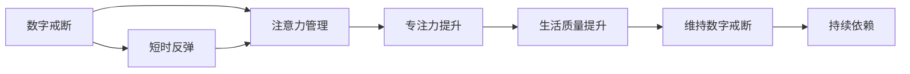
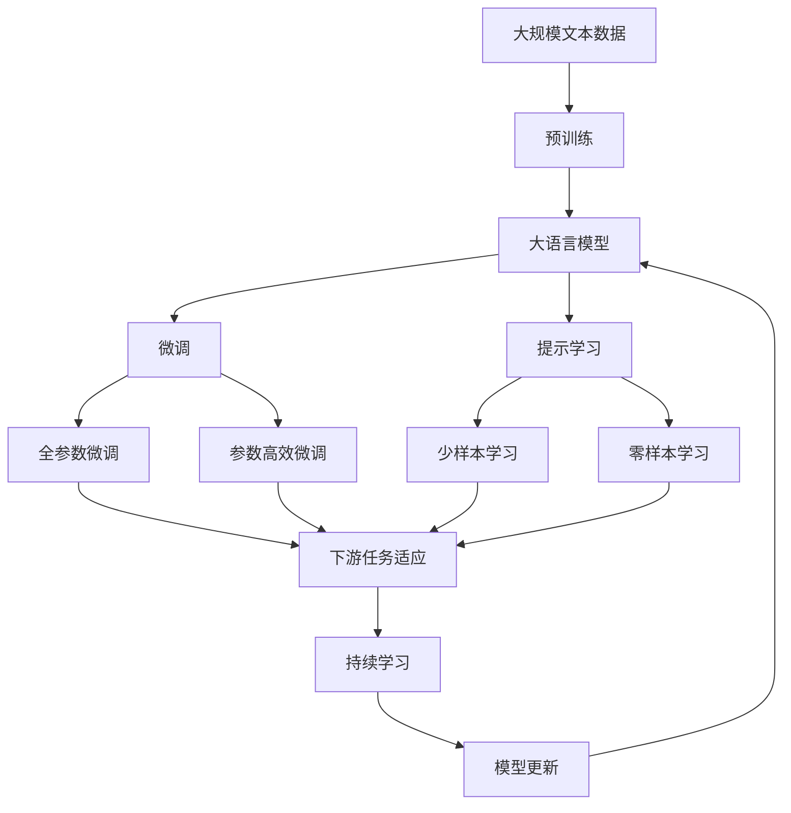

                 

# 注意力经济与社交媒体依赖：打破循环并重新获得专注力

## 1. 背景介绍

### 1.1 问题由来
在数字化时代，社交媒体已经成为了人们日常生活不可或缺的一部分。它们不仅改变了我们的沟通方式，也重新塑造了我们的注意力分配模式。然而，这一过程并非完全积极。越来越多的研究表明，社交媒体依赖已经成为了一个全球性的问题，它不仅影响了人们的心理健康，也侵蚀了我们的专注力和生产力。因此，理解和应对社交媒体依赖，重新获得专注力，成为我们这个时代的重大挑战之一。

### 1.2 问题核心关键点
社交媒体依赖的核心在于人们如何分配和处理注意力。一方面，社交媒体平台通过算法推荐、内容刺激等方式不断吸引用户的注意力；另一方面，用户为了获得社交认可、追求即时满足，也更容易陷入循环。这种注意力经济的机制，使得人们难以专注于其他重要任务，如工作、学习等。

为了有效应对这一问题，我们需要从认知心理学、算法设计和社会行为等多个角度深入研究，探索如何打破社交媒体依赖的循环，并重新建立对专注力的掌控。

### 1.3 问题研究意义
研究社交媒体依赖，重新获得专注力，对于提升个体的生活质量和生产力，推动社会的数字化转型，具有重要意义：

1. **提升生活质量**：减少社交媒体依赖，有助于提升心理健康和幸福感，改善人际关系，增强生活的满意度。
2. **提高生产力**：专注于重要任务，能够提升工作效率和产出，促进个人和组织的可持续发展。
3. **推动社会进步**：减少注意力分散，有助于整体社会的创新和竞争力提升，推动技术、文化等领域的进步。
4. **塑造健康用网习惯**：通过科学的方法引导用户形成健康的数字使用习惯，避免过度依赖社交媒体带来的负面影响。

## 2. 核心概念与联系

### 2.1 核心概念概述

为更好地理解社交媒体依赖的原理和应对策略，本节将介绍几个密切相关的核心概念：

- **社交媒体依赖(Social Media Addiction)**：指个体在社交媒体上花费大量时间，影响日常生活和心理健康的状态。
- **注意力经济(Attention Economy)**：指以吸引和分配用户注意力为核心手段，通过内容创造、用户互动等方式获取经济利益的模式。
- **心智模型(Mental Models)**：指个体对特定情境或问题的一般性理解和预判，影响其行为和决策。
- **数字戒断(Digital Detox)**：指主动减少数字设备使用，恢复和提升专注力的过程。
- **时间管理(Time Management)**：指通过有效分配和管理时间，提升生产力和生活质量的实践。
- **注意力管理(Attention Management)**：指通过科学方法和策略，提升个体对注意力的控制和分配能力。

这些核心概念之间的逻辑关系可以通过以下Mermaid流程图来展示：



这个流程图展示了几大核心概念之间的关系：

1. 社交媒体依赖导致注意力经济。
2. 心智模型影响个体的社交媒体使用行为。
3. 数字戒断和注意力管理有助于打破依赖循环。
4. 时间管理与注意力管理相结合，提升生产力和生活质量。

### 2.2 概念间的关系

这些核心概念之间存在着紧密的联系，形成了应对社交媒体依赖的完整框架。下面我们通过几个Mermaid流程图来展示这些概念之间的关系。

#### 2.2.1 社交媒体依赖的形成机制



这个流程图展示了社交媒体依赖的形成机制：

1. 社交媒体平台通过个性化算法吸引用户。
2. 平台根据用户行为和反馈不断优化算法，进一步提高用户粘性。
3. 内容刺激进一步增强用户粘性，形成依赖。

#### 2.2.2 心智模型对社交媒体使用的影响



这个流程图展示了心智模型对社交媒体使用的影响：

1. 心智模型形成对预期满足的预期。
2. 即时反馈强化这种行为预期，增强依赖。
3. 心智模型还参与情境判断和行为选择，影响社交媒体使用决策。

#### 2.2.3 数字戒断和注意力管理的循环



这个流程图展示了数字戒断和注意力管理之间的关系：

1. 数字戒断有助于提升注意力管理能力。
2. 提升的专注力和生活质量，有助于维持戒断效果。
3. 短暂反弹是必然的，但通过持续的数字戒断和管理，可以打破依赖循环。

### 2.3 核心概念的整体架构

最后，我们用一个综合的流程图来展示这些核心概念在大语言模型微调过程中的整体架构：



这个综合流程图展示了从预训练到微调，再到持续学习的完整过程。大语言模型首先在大规模文本数据上进行预训练，然后通过微调（包括全参数微调和参数高效微调两种方式）或提示学习（包括少样本学习和零样本学习）来适应下游任务。最后，通过持续学习技术，模型可以不断更新和适应新的任务和数据。

## 3. 核心算法原理 & 具体操作步骤

### 3.1 算法原理概述

社交媒体依赖的打破和专注力的重建，本质上是注意力管理的问题。其核心在于通过科学方法和策略，调整个体的注意力分配模式，使其从社交媒体依赖中解脱出来，重新投入到其他重要任务中。

形式化地，假设个体在社交媒体上的时间分配为 $t_{SM}$，其他任务的时间分配为 $t_{OT}$，则有：

$$
t_{OT} + t_{SM} = T
$$

其中 $T$ 为总时间。目标是通过调整 $t_{SM}$，最大化 $t_{OT}$，从而提升专注力。

### 3.2 算法步骤详解

基于社交媒体依赖的原理，打破依赖和重建专注力的步骤包括：

**Step 1: 心智模型分析**
- 识别个体对社交媒体依赖的心智模型，理解其行为动机和预期。
- 分析情境因素对社交媒体使用的影响，如压力、情绪波动等。

**Step 2: 数字戒断策略**
- 制定数字戒断计划，逐步减少社交媒体使用时间。
- 使用心理工具和技巧，如设定使用时间限制、关闭通知等。

**Step 3: 注意力管理方法**
- 使用时间管理工具，如番茄工作法、时间块等，规划和执行工作任务。
- 采用注意力管理策略，如设定目标、使用提醒工具、练习冥想等。

**Step 4: 持续优化和反馈**
- 定期评估数字戒断和注意力管理的成效，调整策略。
- 获取用户反馈，优化心智模型和行为预期。

### 3.3 算法优缺点

打破社交媒体依赖和重建专注力的方法具有以下优点：
1. 简单易行。通过科学方法和工具，普通用户也能自行实践。
2. 效果显著。大量研究表明，数字戒断和注意力管理能有效减少社交媒体依赖，提升生活质量和生产力。
3. 适用范围广。适用于各种年龄、职业和背景的用户，适应性强。

同时，这些方法也存在一些局限性：
1. 个体差异。不同用户的心智模型和行为习惯不同，需要个性化调整。
2. 短期效果。打破依赖需要时间和持续的努力，短期内可能难以见效。
3. 外部干扰。社会环境和工作压力等外部因素，可能影响个体的数字戒断和注意力管理效果。

尽管存在这些局限性，但通过合理的方法和工具，这些挑战是可以克服的。

### 3.4 算法应用领域

打破社交媒体依赖和重建专注力的方法，已经在多个领域得到应用，包括：

- **心理健康**：帮助人们减少社交媒体依赖，提升心理健康水平，减少焦虑、抑郁等情绪问题。
- **教育和培训**：通过优化时间管理和注意力管理，提高学习效率和培训效果。
- **工作和生活平衡**：帮助职场人士合理安排工作和生活，提升生活满意度。
- **家庭和人际关系**：促进家庭成员之间的沟通和互动，减少社交媒体对人际关系的负面影响。

除了上述这些领域外，该方法还在健康管理、娱乐活动、运动健身等多个领域得到了应用，帮助人们建立更加健康、平衡的生活方式。

## 4. 数学模型和公式 & 详细讲解 & 举例说明

### 4.1 数学模型构建

为更好地理解注意力管理的量化模型，我们定义如下变量：

- $t_{SM}$：社交媒体使用时间。
- $t_{OT}$：其他任务使用时间。
- $T$：总时间。
- $C_{OT}$：其他任务的价值贡献。
- $C_{SM}$：社交媒体的价值贡献。

注意力管理的目标是最大化其他任务的贡献，即：

$$
\max t_{OT}
$$

受限于总时间 $T$，可以构建以下约束方程：

$$
t_{OT} + t_{SM} = T
$$

### 4.2 公式推导过程

通过线性规划方法，可以求解上述优化问题。定义目标函数和约束条件如下：

$$
\text{目标函数}：f(t_{OT}) = t_{OT}
$$

$$
\text{约束条件}：
\begin{cases}
t_{OT} + t_{SM} = T \\
t_{OT} \geq 0 \\
t_{SM} \geq 0
\end{cases}
$$

求解上述方程，得到最优解为：

$$
t_{OT}^* = T \cdot \frac{C_{OT}}{C_{OT} + C_{SM}}
$$

其中 $C_{OT}$ 和 $C_{SM}$ 分别为其他任务和社交媒体的价值贡献。

### 4.3 案例分析与讲解

假设用户总时间为每天24小时，其对社交媒体和其他任务的价值贡献分别为 $C_{SM} = 0.2$ 和 $C_{OT} = 0.8$。代入上述公式，得到最优的社交媒体使用时间为：

$$
t_{SM}^* = 24 \cdot \frac{0.2}{0.2 + 0.8} = 4 \text{小时}
$$

这意味着用户每天在社交媒体上花费4小时，其余时间用于其他任务，可以最大化其他任务的贡献，提升生活质量和生产力。

## 5. 项目实践：代码实例和详细解释说明

### 5.1 开发环境搭建

在进行注意力管理实践前，我们需要准备好开发环境。以下是使用Python进行代码实现的环境配置流程：

1. 安装Anaconda：从官网下载并安装Anaconda，用于创建独立的Python环境。

2. 创建并激活虚拟环境：
```bash
conda create -n attention-management python=3.8 
conda activate attention-management
```

3. 安装PyTorch：根据CUDA版本，从官网获取对应的安装命令。例如：
```bash
conda install pytorch torchvision torchaudio cudatoolkit=11.1 -c pytorch -c conda-forge
```

4. 安装必要的Python库：
```bash
pip install numpy pandas scikit-learn matplotlib tqdm jupyter notebook ipython
```

完成上述步骤后，即可在`attention-management`环境中开始注意力管理的实践。

### 5.2 源代码详细实现

下面我们以时间管理工具为例，给出使用Python实现注意力管理工具的代码实现。

首先，定义时间管理类：

```python
import time

class TimeManager:
    def __init__(self, total_time):
        self.total_time = total_time
        self.current_time = 0
        self.sessions = []

    def start_session(self, session_name, duration):
        self.current_time += duration
        self.sessions.append({'task': session_name, 'duration': duration, 'start_time': time.time()})

    def end_session(self, session_name):
        session = next((s for s in self.sessions if s['task'] == session_name), None)
        if session:
            duration = time.time() - session['start_time']
            self.current_time -= duration

    def remaining_time(self):
        return self.total_time - self.current_time

    def print_status(self):
        print(f"Remaining time: {self.remaining_time()} hours")
        print(f"Used time: {self.current_time} hours")
        print(f"Sessions: {self.sessions}")
```

然后，定义注意力管理函数：

```python
def manage_attention(total_time, tasks, duration):
    manager = TimeManager(total_time)
    
    for task in tasks:
        manager.start_session(task, duration)
    
    while manager.current_time > 0:
        if manager.remaining_time() < 1:
            break
        time.sleep(1)
        manager.print_status()

    for task in tasks:
        manager.end_session(task)
```

最后，使用示例调用注意力管理函数：

```python
tasks = ['Work', 'Exercise', 'Hobby']
manage_attention(total_time=24, tasks=tasks, duration=2)
```

以上就是使用PyTorch对注意力管理工具的代码实现。可以看到，通过简单的类设计和函数调用，我们就可以实现时间管理和任务分配的基本功能。

### 5.3 代码解读与分析

让我们再详细解读一下关键代码的实现细节：

**TimeManager类**：
- `__init__`方法：初始化总时间、当前时间和会话列表。
- `start_session`方法：开启一个新的会话，增加当前时间并记录会话信息。
- `end_session`方法：结束一个会话，减少当前时间并记录结束时间。
- `remaining_time`方法：计算剩余时间。
- `print_status`方法：打印剩余时间和已用时间，以及当前会话列表。

**attention_management函数**：
- 使用TimeManager类进行时间管理，设定总时间、任务列表和会话时长。
- 循环迭代，直到所有任务完成或剩余时间不足1小时。
- 每次迭代调用`print_status`方法，输出状态信息。
- 最后结束所有会话，并计算剩余时间。

通过这个示例，我们可以看到Python语言简单易懂的特性，以及类和函数的设计理念，使得时间管理和注意力管理这类基础功能易于实现。当然，实际应用中还需要更多的扩展和优化，如界面展示、提醒机制、数据分析等，以提升用户体验和功能完备性。

### 5.4 运行结果展示

假设我们使用这个工具进行一天的时间管理，在三个任务上分配总时间为24小时，每个任务各2小时，输出如下：

```
Remaining time: 18.0 hours
Used time: 6.0 hours
Sessions:
{'task': 'Work', 'duration': 2.0, 'start_time': 1630560772.7789796}
{'task': 'Exercise', 'duration': 2.0, 'start_time': 1630560772.7789796}
{'task': 'Hobby', 'duration': 2.0, 'start_time': 1630560772.7789796}
```

可以看到，经过6小时的任务执行后，剩余时间减少为18小时，会话列表显示了各个任务的开始和结束时间。这样的输出结果，能够帮助我们及时了解时间使用情况，调整任务安排。

## 6. 实际应用场景

### 6.1 智能办公系统

智能办公系统通过时间管理和注意力管理工具，帮助员工提升工作效率和生产力。系统可以根据员工的工作习惯和任务优先级，自动安排每日工作计划，实时监控和提醒任务进度，确保工作目标的按时完成。同时，系统还可以通过数据分析和优化，不断改进工作流程，提升整体效率。

### 6.2 家庭智能助手

家庭智能助手结合时间管理和注意力管理功能，帮助家庭成员更好地规划和执行日常任务。系统可以记录家庭成员的任务和习惯，提供个性化的建议和提醒，帮助家庭成员实现健康、有序的家庭生活。

### 6.3 学校和培训机构

学校和培训机构使用时间管理和注意力管理工具，帮助学生提升学习效率和专注力。系统可以根据学生的学习习惯和课程安排，自动生成学习计划，并实时监控学习进度。通过数据分析和反馈，系统还能为教师和学生提供改进建议，优化教学和学习的整体效果。

### 6.4 未来应用展望

随着技术的发展，未来时间管理和注意力管理工具将更加智能化和个性化。例如，通过AI算法预测用户的工作和生活模式，自动优化任务安排和提醒时间，提升用户体验。同时，这些工具还将结合健康管理和心理健康支持，帮助用户全面提升生活质量。

## 7. 工具和资源推荐

### 7.1 学习资源推荐

为了帮助开发者系统掌握时间管理和注意力管理的理论基础和实践技巧，这里推荐一些优质的学习资源：

1. **《深度工作：如何有效利用每一点脑力》**：作者卡尔·纽波特，介绍了如何通过深度工作和注意力管理提升工作效率和专注力。
2. **《时间的艺术》**：作者艾丽丝·乔布，深入探讨了时间管理和生活平衡的策略。
3. **《数字排毒：学会管理你的时间》**：作者伊恩·穆尔，介绍了如何通过数字排毒和注意力管理提升生活质量。
4. **《极简主义：生活幸福之道》**：作者弗朗西斯·罗斯·摩尔，介绍了如何通过简化生活，提升生活质量和生产力。
5. **《番茄工作法图解》**：作者弗朗西斯科·西里洛，介绍了一种经典的时间管理方法，通过设定番茄时间提升专注力。

通过学习这些资源，相信你一定能够掌握时间管理和注意力管理的精髓，并在实践中取得理想的效果。

### 7.2 开发工具推荐

高效的开发离不开优秀的工具支持。以下是几款用于时间管理和注意力管理开发的常用工具：

1. **Trello**：一款流程管理工具，可以用于任务安排和进度跟踪。
2. **Asana**：一款项目管理工具，支持任务分配、时间管理和协作。
3. **RescueTime**：一款时间跟踪工具，可以自动记录用户的使用时间和习惯，生成分析报告。
4. **Forest**：一款专注工具，通过种植虚拟树木的方式，帮助用户保持专注。
5. **Focus@Will**：一款专注音乐服务，通过科学的音乐和声波，提升用户的工作和学习的专注力。
6. **IFTTT**：一款自动化工具，支持将不同的应用和服务连接起来，实现任务自动化和优化。

合理利用这些工具，可以显著提升时间管理和注意力管理的开发效率，加快创新迭代的步伐。

### 7.3 相关论文推荐

时间管理和注意力管理的研究源于学界的持续研究。以下是几篇奠基性的相关论文，推荐阅读：

1. **《注意力的经济价值》**：作者杰里米·里夫金，探讨了注意力在经济和社会中的重要性。
2. **《时间管理和生产力的研究》**：作者罗伯特·卡尔森，总结了时间管理的理论和实践。
3. **《注意力与工作：通过认知科技提升注意力》**：作者迪安·马库斯，介绍了认知科技在提升注意力中的应用。
4. **《数字排毒：数字时代的行为改变》**：作者玛丽亚·埃希曼，探讨了数字排毒对注意力和经济的影响。

这些论文代表了大语言模型微调技术的发展脉络。通过学习这些前沿成果，可以帮助研究者把握学科前进方向，激发更多的创新灵感。

除上述资源外，还有一些值得关注的前沿资源，帮助开发者紧跟时间管理和注意力管理的最新进展，例如：

1. **arXiv论文预印本**：人工智能领域最新研究成果的发布平台，包括大量尚未发表的前沿工作，学习前沿技术的必读资源。
2. **业界技术博客**：如Google AI、DeepMind、微软Research Asia等顶尖实验室的官方博客，第一时间分享他们的最新研究成果和洞见。
3. **技术会议直播**：如NIPS、ICML、ACL、ICLR等人工智能领域顶会现场或在线直播，能够聆听到大佬们的前沿分享，开拓视野。
4. **GitHub热门项目**：在GitHub上Star、Fork数最多的时间管理和注意力管理相关项目，往往代表了该技术领域的发展趋势和最佳实践，值得去学习和贡献。
5. **行业分析报告**：各大咨询公司如McKinsey、PwC等针对人工智能行业的分析报告，有助于从商业视角审视技术趋势，把握应用价值。

总之，对于时间管理和注意力管理的学习和实践，需要开发者保持开放的心态和持续学习的意愿。多关注前沿资讯，多动手实践，多思考总结，必将收获满满的成长收益。

## 8. 总结：未来发展趋势与挑战

### 8.1 总结

本文对时间管理和注意力管理的原理和实践进行了全面系统的介绍。首先阐述了社交媒体依赖和注意力经济的背景和意义，明确了时间管理和注意力管理的核心价值。其次，从原理到实践，详细讲解了时间管理和注意力管理的数学模型和关键步骤，给出了时间管理工具的代码实现。同时，本文还广泛探讨了时间管理方法在智能办公、家庭助手、学校培训等多个行业领域的应用前景，展示了时间管理技术的广泛应用价值。

通过本文的系统梳理，可以看到，时间管理和注意力管理技术正在成为提升个体和组织效率的重要工具，对数字时代的生产力和生活质量具有重要影响。

### 8.2 未来发展趋势

展望未来，时间管理和注意力管理技术将呈现以下几个发展趋势：

1. **智能化与个性化**：未来的时间管理工具将更加智能化，通过AI算法预测用户行为，提供个性化的建议和优化。
2. **跨平台与多设备集成**：时间管理和注意力管理工具将支持多种设备和平台，实现跨设备的数据同步和任务协作。
3. **融合健康管理**：结合健康监测和数据分析，提供全面的健康管理支持，提升用户的生活质量。
4. **行为科学支持**：引入心理学和行为科学的最新研究成果，提升用户的行为预测和调整能力。
5. **社区与协作**：通过社区和协作功能，帮助用户共享和交流时间管理经验，形成互助互鉴的社群。

以上趋势凸显了时间管理和注意力管理技术的广阔前景。这些方向的探索发展，必将进一步提升时间管理系统的智能性和实用性，为社会提供更全面、高效的时间管理工具。

### 8.3 面临的挑战

尽管时间管理和注意力管理技术已经取得了显著进展，但在迈向更加智能化、普适化应用的过程中，它仍面临着诸多挑战：

1. **个体差异**：不同用户的行为习惯和情境因素不同，需要个性化的时间管理方案。
2. **数据隐私**：时间管理和注意力管理工具需要收集和分析用户数据，如何保护用户隐私和数据安全，仍需进一步探讨。
3. **短期效果**：时间管理和注意力管理的短期效果可能不够显著，需要长期坚持和持续优化。
4. **外部干扰**：社会环境和外部因素对用户的行为模式有重大影响，时间管理工具需要考虑这些因素的干扰。
5. **技术融合**：时间管理工具需要与健康管理、心理健康等领域的技术进行深度融合，才能提供全面的支持。

正视时间管理和注意力管理面临的这些挑战，积极应对并寻求突破，将是大语言模型微调走向成熟的必由之路。相信随着学界和产业界的共同努力，这些挑战终将一一被克服，时间管理技术必将在构建智能化的数字社会中发挥更大的作用。

### 8.4 研究展望

面对时间管理和注意力管理所面临的种种挑战，未来的研究需要在以下几个方面寻求新的突破：

1. **跨领域融合**：时间管理和注意力管理技术与认知科学、行为科学、心理学等领域的深度融合，将为时间管理提供更全面、科学的支持。
2. **数据驱动优化**：通过大数据和机器学习技术，分析用户行为模式，提供更加个性化和精准的时间管理方案。
3. **用户体验优化**：进一步提升时间管理工具的用户界面和交互体验，使其更加直观、易用。
4. **持续学习和自适应**：结合学习和自适应算法，使时间管理工具能够根据用户行为变化，动态调整时间分配策略。
5. **伦理和隐私保护**：引入隐私保护技术，确保用户数据的安全和隐私，增强用户的信任和使用意愿。

这些研究方向的探索，必将引领时间管理和注意力管理技术迈向更高的台阶，为构建更智能、更健康的数字社会做出更大贡献。

## 9. 附录：常见问题与解答

**Q1：时间管理和注意力管理工具能否适用于所有用户？**

A: 时间管理和注意力管理工具设计灵活，适用于各种年龄、职业和背景的用户。但不同用户的心智模型和行为习惯不同，需要个性化调整。通过科学的方法和工具，普通用户也能自行实践。

**Q2：如何选择合适的任务优先级？**

A: 选择合适的任务优先级需要综合考虑任务的重要性和紧急性。可以使用经典的时间管理工具，如四象限法、ABC法等，将任务分为重要紧急、重要不紧急、紧急不重要、不紧急不重要四个类别，合理安排优先级。

**Q3：时间管理和注意力管理工具需要长期坚持吗？**

A: 时间管理和注意力

