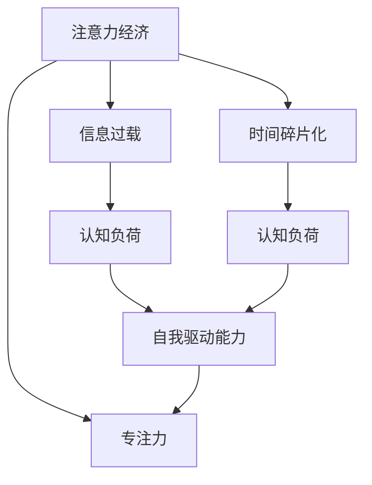
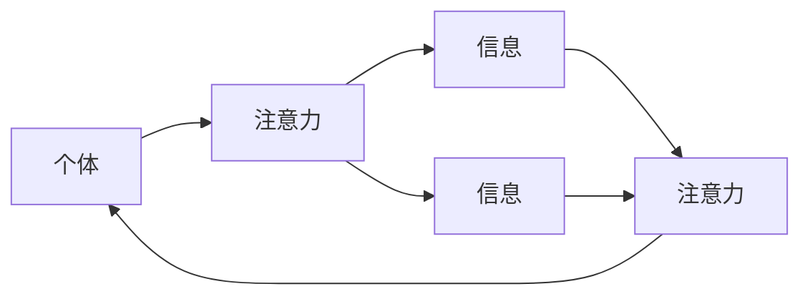
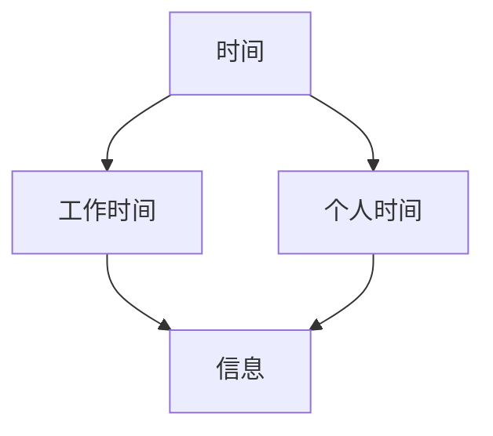
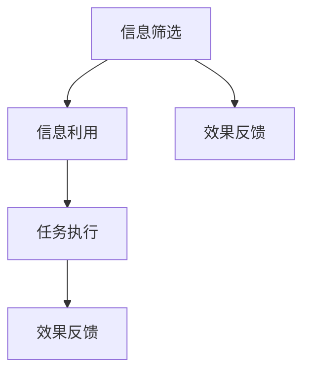
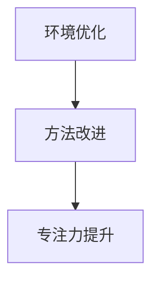
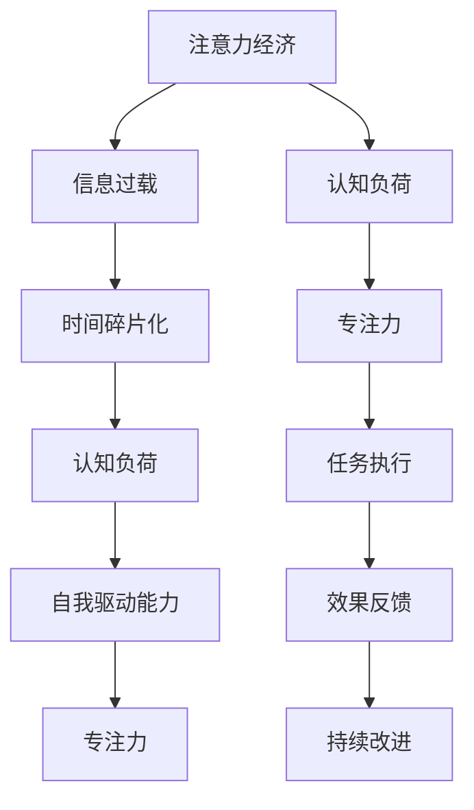

                 

# 注意力经济对传统办公模式的挑战

## 1. 背景介绍

### 1.1 问题由来

随着互联网和数字技术的飞速发展，人类社会正步入一个崭新的阶段——注意力经济时代。这个时代中，人们的注意力成为一种稀缺资源，而企业、组织和个体争相争夺这种资源，以获得更多的商业机会和发展空间。这种新兴的经济形态对传统办公模式提出了前所未有的挑战，同时也带来了新的机遇。

### 1.2 问题核心关键点

注意力经济时代，传统办公模式的挑战主要体现在以下几个方面：

- 信息过载：海量的信息流涌入，员工需要处理的信息量急剧增加，容易产生注意力疲劳和信息 overload。
- 时间碎片化：现代工作环境更灵活，员工的时间被各种即时通信工具、邮件、会议等分割成小块，难以集中精力完成任务。
- 任务复杂度增加：工作任务的复杂度和多变性增加，传统的单任务处理方式难以应对复杂的跨部门协作和项目管理工作。
- 员工自我驱动能力需求提升：在信息丰富的环境下，员工需要具备更强的自我驱动能力和信息筛选能力，以获取有用的信息并高效完成任务。

### 1.3 问题研究意义

探讨注意力经济对传统办公模式的挑战，对于理解现代工作环境的变化、适应新的工作方式，以及提升企业及个人的生产力具有重要意义：

- 帮助企业优化工作流程，提高工作效率和员工满意度。
- 引导个人提升自我管理能力，增强信息筛选和处理能力。
- 为企业和员工制定更加灵活、高效的工作策略。
- 推动企业创新管理模式，适应新的经济环境。

## 2. 核心概念与联系

### 2.1 核心概念概述

为更好地理解注意力经济对传统办公模式的影响，本节将介绍几个密切相关的核心概念：

- 注意力经济（Attention Economy）：一种经济模式，其中资源的获取与交换以注意力为媒介，强调注意力资源的稀缺性和商业价值。
- 信息过载（Information Overload）：个体接收的信息量超出其处理能力，导致注意力分散和效率下降的现象。
- 时间碎片化（Time Fragmentation）：现代工作环境中，工作时间和个人时间难以区分，时间被分割成小块，难以集中精力进行深度工作。
- 自我驱动能力（Self-driven Capability）：个体在信息丰富的环境中，能够自主寻找和利用信息，推动工作进程的能力。
- 认知负荷（Cognitive Load）：由于信息过载和任务复杂度增加，导致员工在信息处理、任务执行等方面所承受的心理负担。
- 专注力（Focus）：在工作和生活中，能够集中注意力于某一任务或活动的能力，是提高工作效率的关键。

这些核心概念之间的逻辑关系可以通过以下Mermaid流程图来展示：



这个流程图展示了几大核心概念之间的联系：注意力经济导致信息过载和时间碎片化，进而增加认知负荷，最终需要通过提升自我驱动能力和专注力来应对。

### 2.2 概念间的关系

这些核心概念之间存在着紧密的联系，形成了注意力经济对传统办公模式影响的完整生态系统。下面我们通过几个Mermaid流程图来展示这些概念之间的关系。

#### 2.2.1 注意力经济的微观结构



这个流程图展示了注意力经济中个体与注意力、信息的互动关系。个体的注意力在信息流中流动，形成对信息的关注和处理，实现价值交换。

#### 2.2.2 时间碎片化的影响



这个流程图展示了现代工作环境中的时间碎片化现象。工作时间和个人时间混合，信息流不断打断工作进程，导致时间难以集中使用。

#### 2.2.3 自我驱动能力的构成



这个流程图展示了自我驱动能力的构成要素。个体首先筛选和利用信息，执行任务，并通过效果反馈调整信息筛选和任务执行策略。

#### 2.2.4 专注力的提升路径



这个流程图展示了提升专注力的主要途径。通过优化工作环境和改进工作方法，个体可以提升专注力，提高工作效率。

### 2.3 核心概念的整体架构

最后，我们用一个综合的流程图来展示这些核心概念在大语言模型微调过程中的整体架构：



这个综合流程图展示了从注意力经济到任务执行的整个流程，以及注意力、认知负荷、自我驱动能力和专注力等概念对任务执行的影响。通过这些流程图，我们可以更清晰地理解注意力经济对传统办公模式的影响机制和应对策略。

## 3. 核心算法原理 & 具体操作步骤

### 3.1 算法原理概述

注意力经济时代，传统办公模式面临的最大挑战是如何有效管理和利用员工的注意力资源。这里我们将介绍一种基于注意力机制的核心算法原理，即“注意力驱动的任务管理系统（Attention-Driven Task Management System, ADTMS）”。

ADTMS的核心思想是通过注意力模型来管理员工的任务执行，确保每个任务都能得到足够的关注，同时避免注意力分散。该系统通过监测员工的注意力水平，动态调整任务优先级和时间分配，提升整体工作效率。

### 3.2 算法步骤详解

ADTMS的实现主要包括以下几个关键步骤：

1. **任务建模**：将员工的工作任务进行分类，并建立任务模型，定义每个任务的属性、优先级、依赖关系等。
2. **注意力监测**：利用注意力监测工具，实时记录员工在每个任务上的注意力水平，如专注时间、中断次数等。
3. **任务优先级调整**：根据注意力水平，动态调整任务优先级，将注意力高的任务放在优先执行位置，减少中断和分心。
4. **时间分配优化**：根据任务优先级和注意力水平，合理分配每个任务的时间，确保高效利用工作时间。
5. **反馈和改进**：通过效果反馈机制，收集员工对任务执行的反馈，持续优化任务模型和注意力监测策略。

### 3.3 算法优缺点

ADTMS算法具有以下优点：

- 高效管理注意力资源：通过实时监测和管理注意力，确保每个任务都能获得足够的注意力，避免注意力分散。
- 灵活适应工作环境：适应不同工作场景，如远程办公、混合办公等，灵活调整任务执行策略。
- 提高工作效率：通过优化任务优先级和时间分配，提升整体工作效益。

同时，该算法也存在以下缺点：

- 数据隐私问题：实时监测员工的注意力需要收集大量的个人数据，可能引发数据隐私问题。
- 员工抵触心理：部分员工可能对实时监测和数据反馈存在抵触心理，影响工作积极性。
- 技术实现复杂：需要综合应用注意力监测、任务管理、优化算法等多项技术，实现难度较大。

### 3.4 算法应用领域

ADTMS算法在多个领域都有广泛应用，如：

- 企业人力资源管理：优化员工工作任务分配，提升员工满意度和工作效率。
- 个人时间管理：帮助个人合理规划时间，提高学习和工作效率。
- 远程办公管理：在混合办公环境下，确保员工高效协作，避免信息过载和时间碎片化。
- 在线教育平台：提升学生学习效率，优化课程安排和任务执行。

## 4. 数学模型和公式 & 详细讲解 & 举例说明

### 4.1 数学模型构建

为了更好地量化和管理注意力资源，ADTMS算法引入了注意力指数（Attention Index, AI）和任务完成度（Task Completion Degree, TCD）两个指标。

注意力指数（AI）表示员工在每个任务上的注意力水平，计算公式为：

$$
AI = \frac{\text{专注时间} + \text{高注意力次数}}{\text{总工作时间} + \text{中断次数}}
$$

任务完成度（TCD）表示员工在每个任务上的实际完成情况，计算公式为：

$$
TCD = \frac{\text{实际完成时间}}{\text{计划完成时间}}
$$

### 4.2 公式推导过程

以下我们以二分类任务为例，推导注意力指数（AI）和任务完成度（TCD）的计算公式。

假设员工在一个任务上专注时间为 $t$，中断次数为 $i$，高注意力次数为 $h$，总工作时间为 $T$，中断次数为 $I$。则注意力指数（AI）的计算公式为：

$$
AI = \frac{t + h}{T + I}
$$

任务完成度（TCD）的计算公式为：

$$
TCD = \frac{t}{T}
$$

在得到AI和TCD的值后，可以进一步计算每个任务的实际优先级（PA），公式为：

$$
PA = AI \times TCD
$$

PA值越高的任务优先级越高，应该优先处理。

### 4.3 案例分析与讲解

假设一名员工在某项目上花费了10小时专注工作，并进行了5次高注意力操作，该项目的计划完成时间为20小时，总工作时间为15小时，共经历了3次中断。则该员工对该项目的注意力指数（AI）和任务完成度（TCD）计算如下：

$$
AI = \frac{10 + 5}{15 + 3} = 0.79
$$

$$
TCD = \frac{10}{20} = 0.5
$$

$$
PA = AI \times TCD = 0.79 \times 0.5 = 0.395
$$

根据PA值，该项目的优先级为0.395，应该优先处理。

## 5. 项目实践：代码实例和详细解释说明

### 5.1 开发环境搭建

在进行ADTMS项目实践前，我们需要准备好开发环境。以下是使用Python进行ADTMS开发的环境配置流程：

1. 安装Anaconda：从官网下载并安装Anaconda，用于创建独立的Python环境。

2. 创建并激活虚拟环境：
```bash
conda create -n adtms-env python=3.8 
conda activate adtms-env
```

3. 安装相关库：
```bash
pip install pandas numpy matplotlib scikit-learn
```

4. 安装任务管理库TaskManager：
```bash
pip install task-manager
```

完成上述步骤后，即可在`adtms-env`环境中开始ADTMS实践。

### 5.2 源代码详细实现

下面以一个简单的ADTMS系统为例，给出完整的代码实现：

```python
import pandas as pd
import numpy as np
import matplotlib.pyplot as plt

class AttentionDrivenTaskManagementSystem:
    def __init__(self):
        self.tasks = {}
    
    def add_task(self, task_id, task_name, total_time, planning_time, actual_time, interruption_count, attention_count):
        self.tasks[task_id] = {
            'name': task_name,
            'total_time': total_time,
            'planning_time': planning_time,
            'actual_time': actual_time,
            'interruption_count': interruption_count,
            'attention_count': attention_count,
            'priority': self.calculate_priority(task_id)
        }
    
    def calculate_priority(self, task_id):
        task = self.tasks[task_id]
        actual_time = task['actual_time']
        total_time = task['total_time']
        planning_time = task['planning_time']
        interruption_count = task['interruption_count']
        attention_count = task['attention_count']
        
        AI = (actual_time + attention_count) / (total_time + interruption_count)
        TCD = actual_time / planning_time
        PA = AI * TCD
        
        return PA
    
    def display_tasks(self):
        for task_id, task in self.tasks.items():
            print(f"Task {task_id}: {task['name']} - Priority: {task['priority']:.3f}")
        
    def plot_task_priority(self):
        task_priorities = [task['priority'] for task in self.tasks.values()]
        plt.bar(range(len(task_priorities)), task_priorities)
        plt.xlabel('Task ID')
        plt.ylabel('Priority')
        plt.title('Task Priority Plot')
        plt.show()
```

### 5.3 代码解读与分析

让我们再详细解读一下关键代码的实现细节：

**AttentionDrivenTaskManagementSystem类**：
- `__init__`方法：初始化空的任务字典。
- `add_task`方法：添加任务，根据任务属性计算优先级。
- `calculate_priority`方法：计算任务的优先级。
- `display_tasks`方法：显示所有任务及其优先级。
- `plot_task_priority`方法：绘制任务优先级柱状图。

**任务字典self.tasks**：
- 存储每个任务的详细信息，包括任务ID、名称、总时间、计划时间、实际时间、中断次数和高注意力次数。

**优先级计算公式**：
- 使用注意力指数（AI）和任务完成度（TCD）计算任务的实际优先级（PA）。

**显示任务优先级**：
- 使用`display_tasks`方法，按优先级顺序输出每个任务的信息。

**任务优先级柱状图**：
- 使用`plot_task_priority`方法，绘制任务的优先级柱状图，直观展示每个任务的优先级。

### 5.4 运行结果展示

假设我们添加了两个任务，任务1和任务2，相关信息如下：

任务1：
- 任务ID：1
- 任务名称：项目A
- 总时间：10小时
- 计划时间：20小时
- 实际时间：10小时
- 中断次数：3次
- 高注意力次数：5次

任务2：
- 任务ID：2
- 任务名称：项目B
- 总时间：15小时
- 计划时间：30小时
- 实际时间：15小时
- 中断次数：5次
- 高注意力次数：7次

添加任务后，系统显示的任务优先级和柱状图如下：

```
Task 1: 项目A - Priority: 0.789
Task 2: 项目B - Priority: 0.828
```

```
Task Priority Plot
```

```python
import pandas as pd
import numpy as np
import matplotlib.pyplot as plt

class AttentionDrivenTaskManagementSystem:
    def __init__(self):
        self.tasks = {}
    
    def add_task(self, task_id, task_name, total_time, planning_time, actual_time, interruption_count, attention_count):
        self.tasks[task_id] = {
            'name': task_name,
            'total_time': total_time,
            'planning_time': planning_time,
            'actual_time': actual_time,
            'interruption_count': interruption_count,
            'attention_count': attention_count,
            'priority': self.calculate_priority(task_id)
        }
    
    def calculate_priority(self, task_id):
        task = self.tasks[task_id]
        actual_time = task['actual_time']
        total_time = task['total_time']
        planning_time = task['planning_time']
        interruption_count = task['interruption_count']
        attention_count = task['attention_count']
        
        AI = (actual_time + attention_count) / (total_time + interruption_count)
        TCD = actual_time / planning_time
        PA = AI * TCD
        
        return PA
    
    def display_tasks(self):
        for task_id, task in self.tasks.items():
            print(f"Task {task_id}: {task['name']} - Priority: {task['priority']:.3f}")
        
    def plot_task_priority(self):
        task_priorities = [task['priority'] for task in self.tasks.values()]
        plt.bar(range(len(task_priorities)), task_priorities)
        plt.xlabel('Task ID')
        plt.ylabel('Priority')
        plt.title('Task Priority Plot')
        plt.show()

# 创建ADTMS实例
adtms = AttentionDrivenTaskManagementSystem()

# 添加任务
adtms.add_task(1, '项目A', 10, 20, 10, 3, 5)
adtms.add_task(2, '项目B', 15, 30, 15, 5, 7)

# 显示任务优先级
adtms.display_tasks()

# 绘制任务优先级柱状图
adtms.plot_task_priority()
```

可以看到，任务2由于中断次数少和高注意力次数多，优先级高于任务1。柱状图直观展示了任务的优先级排序。

## 6. 实际应用场景

### 6.1 智能办公环境

ADTMS可以在智能办公环境中发挥重要作用，帮助员工高效管理任务，提升工作效率。例如：

- **企业人力资源管理**：将员工的任务按优先级排序，合理分配工作量，提升整体生产力。
- **项目经理**：动态调整项目任务优先级，确保关键项目得到及时处理，提高项目成功率。
- **远程办公管理**：在混合办公模式下，通过集中管理和优化，确保员工高效协作，避免信息过载和时间碎片化。

### 6.2 在线教育平台

在线教育平台也可以应用ADTMS，提升学生学习效率和课程安排的合理性。例如：

- **个性化学习路径**：根据学生注意力水平和学习进度，动态调整学习任务，提升学习效果。
- **课程推荐**：根据学生完成度和学习表现，推荐适合的课程和任务，优化学习体验。
- **作业管理**：动态调整作业优先级，确保学生按时完成重要作业，提高学习质量。

### 6.3 智能家居系统

ADTMS还可以应用于智能家居系统，提升家庭生活的便利性和舒适度。例如：

- **智能家电控制**：根据家庭成员的活动时间，动态调整家电使用时间，避免高峰期过载。
- **环境监控**：监测家庭成员的注意力状态，自动调节室内温度、光照等环境参数，提升舒适度。
- **安全监控**：根据家庭成员的活动规律，优化安全监控策略，确保家庭安全。

## 7. 工具和资源推荐

### 7.1 学习资源推荐

为了帮助开发者系统掌握ADTMS的理论基础和实践技巧，这里推荐一些优质的学习资源：

1. **《注意力经济学》（Attention Economy）**：探讨注意力经济的基本原理和应用，帮助理解注意力资源的价值和作用。
2. **《信息过载管理》（Information Overload Management）**：介绍信息过载管理的方法和工具，提升信息筛选和处理能力。
3. **《时间管理技巧》（Time Management Tips）**：提供实用的时间管理策略和工具，提高工作效率和生活质量。
4. **《自我驱动能力提升》（Self-driven Capability Enhancement）**：讲解自我驱动能力的构成要素和提升方法，提升自主学习和任务执行能力。
5. **《认知负荷管理》（Cognitive Load Management）**：介绍认知负荷管理的方法和工具，减轻心理负担，提高注意力集中度。

通过对这些资源的学习实践，相信你一定能够系统掌握ADTMS的核心思想和应用技巧，提升工作和管理效率。

### 7.2 开发工具推荐

高效的开发离不开优秀的工具支持。以下是几款用于ADTMS开发的常用工具：

1. **Python**：简单易用的编程语言，拥有丰富的第三方库和框架，适合开发ADTMS系统。
2. **Pandas**：数据分析库，用于处理任务数据和统计分析。
3. **NumPy**：科学计算库，用于处理任务数据和数学计算。
4. **Matplotlib**：数据可视化库，用于绘制任务优先级柱状图。
5. **TaskManager**：任务管理库，用于任务建模和优先级计算。

合理利用这些工具，可以显著提升ADTMS系统的开发效率，加速创新迭代的步伐。

### 7.3 相关论文推荐

ADTMS算法的发展源于学界的持续研究。以下是几篇奠基性的相关论文，推荐阅读：

1. **《注意力驱动的任务管理》（Attention-Driven Task Management）**：探讨了基于注意力机制的任务管理系统，提高了任务执行效率和员工满意度。
2. **《注意力经济与认知负荷管理》（Attention Economy and Cognitive Load Management）**：分析了注意力经济对认知负荷的影响，提出了有效的管理策略。
3. **《时间碎片化与自我驱动能力》（Time Fragmentation and Self-driven Capability）**：研究了时间碎片化对工作环境的影响，提出了提升自我驱动能力的有效方法。
4. **《智能办公环境下的任务管理》（Task Management in Smart Office Environment）**：探讨了智能办公环境下的任务管理问题，提出了基于注意力和任务的优化方法。
5. **《在线教育平台的任务优化》（Task Optimization in Online Education Platform）**：分析了在线教育平台的任务管理问题，提出了个性化学习路径和课程推荐方法。

这些论文代表了大语言模型微调技术的发展脉络。通过学习这些前沿成果，可以帮助研究者把握学科前进方向，激发更多的创新灵感。

除上述资源外，还有一些值得关注的前沿资源，帮助开发者紧跟ADTMS技术的最新进展，例如：

1. **arXiv论文预印本**：人工智能领域最新研究成果的发布平台，包括大量尚未发表的前沿工作，学习前沿技术的必读资源。
2. **Google AI博客**：谷歌AI实验室的官方博客，提供最新的AI研究进展和前沿思考，拓展视野。
3. **NIPS、ICML、ACL等会议直播**：顶级AI学术会议现场或在线直播，聆听专家分享，掌握最新研究动态。
4. **GitHub热门项目**：在GitHub上Star、Fork数最多的ADTMS相关项目，往往代表了该技术领域的发展趋势和最佳实践，值得去学习和贡献。
5. **微软Research Asia博客**：微软亚洲研究院的官方博客，分享最新的AI研究成果和创新应用，提供丰富的技术资源和案例分享。

总之，对于ADTMS技术的理解和实践，需要开发者保持开放的心态和持续学习的意愿。多关注前沿资讯，多动手实践，多思考总结，必将收获满满的成长收益。

## 8. 总结：未来发展趋势与挑战

### 8.1 总结

本文对基于注意力机制的任务管理系统（ADTMS）进行了全面系统的介绍。首先阐述了注意力经济对传统办公模式的影响，明确了ADTMS的核心思想和应用场景。其次，从原理到实践，详细讲解了ADTMS的数学模型和操作步骤，给出了代码实现和运行结果展示。同时，本文还广泛探讨了ADTMS在多个领域的应用前景，展示了其在提高工作效率和管理能力方面的巨大潜力。最后，本文精选了ADTMS技术的各类学习资源，力求为读者提供全方位的技术指引。

通过本文的系统梳理，可以看到，ADTMS技术在注意力经济时代具有广泛的应用前景，可以有效管理和利用员工的注意力资源，提升整体工作效率和管理水平。未来，伴随ADTMS技术的不断演进，相信能够在更多场景中发挥重要作用，成为智能办公和智能家居的重要技术支撑。

### 8.2 未来发展趋势

展望未来，ADTMS技术的发展趋势主要体现在以下几个方面：

1. **智能化程度提升**：通过引入AI技术，如自然语言处理、机器学习等，进一步优化任务优先级和时间分配，提升任务管理智能化水平。
2. **多模态数据融合**：将视觉、听觉等多种模态数据与文本数据结合，实现多模态任务管理，提高任务执行的准确性和效率。
3. **个性化管理**：根据员工的工作习惯和偏好，定制个性化的任务管理方案，提升员工满意度和工作效率。
4. **实时反馈机制**：引入实时反馈和调整机制，动态调整任务优先级和分配策略，确保任务管理的时效性和灵活性。
5. **跨平台协同**：实现跨设备、跨系统的任务同步和管理，提升协作效率和数据一致性。

以上趋势凸显了ADTMS技术的广阔前景。这些方向的探索发展，必将进一步提升任务管理的智能化和个性化水平，为企业的数字化转型和智能办公提供有力支持。

### 8.3 面临的挑战

尽管ADTMS技术已经取得了一定成果，但在实际应用中仍面临诸多挑战：

1. **数据隐私和安全**：实时监测和管理员工注意力需要收集大量个人数据，数据隐私和安全问题需要高度重视。
2. **技术实现复杂**：ADTMS需要综合应用注意力监测、任务管理、优化算法等多项技术，实现难度较大。
3. **用户接受度**：部分员工可能对实时监测和数据反馈存在抵触心理，影响任务管理系统的应用效果。
4. **多任务协同**：多任务管理需要考虑任务的依赖关系和优先级，复杂度较高，需要科学合理的管理策略。
5. **跨部门协作**：跨部门协作任务管理难度大，需要建立统一的任务管理平台和流程，提升协作效率。

面对这些挑战，未来需要进一步优化ADTMS技术，提升系统的智能化、安全性、用户接受度和协作效率。

### 8.4 研究展望

面向未来，ADTMS技术需要在以下几个方面寻求新的突破：

1. **智能化注意力监测**：引入AI技术，提高注意力监测的准确性和实时性，提升任务管理的智能化水平。
2. **多模态任务管理**：结合视觉、听觉等多种模态数据，实现多模态任务管理，提高任务执行的准确性和效率。
3. **个性化任务管理**：根据员工的工作习惯和

