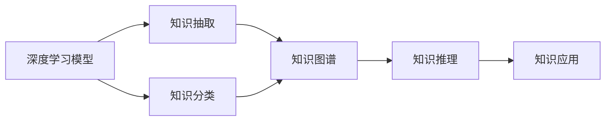

                 

# 洞察与类比：突破知识限制的工具

> 关键词：洞察力, 类比推理, 数据融合, 知识图谱, 深度学习, 推理引擎, 自然语言处理(NLP)

## 1. 背景介绍

### 1.1 问题由来

在当今信息爆炸的时代，人类面临的知识量呈现出指数级增长。传统的人工知识获取方式已经难以跟上知识的步伐。通过人类自身学习和积累知识的方式，代价高昂，效率低下，且容易产生知识盲区。因此，如何突破知识的限制，高效获取、理解和应用知识，成为信息技术领域的一个重要研究课题。

近年来，人工智能技术，特别是深度学习和自然语言处理(NLP)技术，在这方面取得了突破性的进展。通过构建数据驱动的知识图谱、引入类比推理算法，结合深度学习模型，实现了知识的自动抽取、分类和推理。本文将系统介绍这些技术，展示其在知识获取、分类、融合、推理中的应用，并对未来技术发展进行展望。

### 1.2 问题核心关键点

该问题研究的核心在于如何利用先进的人工智能技术，突破人类知识获取和应用中的限制，特别是如何利用深度学习模型和大规模语料库，进行知识抽取、分类、融合和推理。主要关键点包括：

1. 深度学习模型在知识抽取和分类中的应用。
2. 类比推理算法在知识图谱中的作用。
3. 知识图谱在知识融合和推理中的作用。
4. 自然语言处理技术在知识抽取和推理中的辅助作用。

这些问题在人工智能领域中存在已久，但近年来随着技术的进步，尤其是深度学习模型的应用，取得了显著进展。深度学习模型在处理大规模数据和特征提取方面展现了强大的能力，而类比推理算法则有助于更好地理解和应用知识。

### 1.3 问题研究意义

利用先进的人工智能技术突破知识的限制，具有重要意义：

1. 高效获取知识：大规模数据处理能力使得从海量文本中自动抽取有价值知识成为可能。
2. 提升知识准确性：深度学习模型的自适应性使得知识分类和推理更加准确。
3. 推动知识融合：知识图谱将各类知识进行结构化存储，便于检索和应用。
4. 实现知识应用：推理引擎在知识图谱上运行，可以进行复杂的逻辑推理。

人工智能技术在知识获取和应用上的突破，将极大地提升人类处理信息的能力，加速科学发现，推动技术创新，促进社会进步。

## 2. 核心概念与联系

### 2.1 核心概念概述

在深入探讨这些问题之前，需要明确几个核心概念：

- **深度学习模型**：基于神经网络的模型，能够处理大规模非结构化数据，提取特征，并进行分类和预测。
- **知识图谱**：以图结构存储知识，将实体、属性和关系进行结构化表示，便于检索和推理。
- **类比推理**：通过比较和推理，发现知识之间的关系和相似性，进行知识的迁移和扩展。
- **自然语言处理(NLP)**：使计算机能够理解、处理和生成自然语言，辅助知识抽取和推理。

这些概念之间存在紧密的联系，共同构成了人工智能在知识获取和应用中的技术体系。

### 2.2 概念间的关系

这些核心概念之间的关系可以通过以下Mermaid流程图来展示：



这个流程图展示了几类核心概念之间的关系：

1. 深度学习模型能够处理大规模非结构化数据，进行知识抽取和分类。
2. 知识图谱以结构化形式存储抽取和分类的知识，便于推理和应用。
3. 类比推理算法利用知识图谱中的知识，进行知识的迁移和扩展。
4. 自然语言处理技术辅助知识抽取和推理，提升知识的获取效率。

这些概念共同作用，使人工智能系统能够高效、准确地获取、分类、融合和推理知识。

## 3. 核心算法原理 & 具体操作步骤
### 3.1 算法原理概述

基于深度学习模型的知识抽取和分类算法主要分为两个步骤：首先，利用深度学习模型对大规模文本数据进行特征提取，然后，对提取出的特征进行分类或抽取实体、关系等知识。知识推理算法则通过类比推理等技术，在知识图谱上运行，进行逻辑推理和知识迁移。

深度学习模型在知识抽取和分类中的应用：

- 使用卷积神经网络(CNN)或循环神经网络(RNN)等模型，对文本进行特征提取。
- 利用注意力机制等技术，对重要信息进行加权处理。
- 结合分类器，对提取出的特征进行实体或关系分类。

类比推理算法在知识图谱中的应用：

- 利用图神经网络(GNN)等模型，在知识图谱上进行节点和边特征的提取。
- 使用类比推理算法，如Patricia、RBM等，发现节点之间的关系和相似性。
- 进行知识迁移和扩展，构建新的知识节点。

### 3.2 算法步骤详解

基于深度学习模型的知识抽取和分类的操作步骤：

1. **数据准备**：收集大规模文本数据，并进行预处理，如分词、去除停用词等。
2. **特征提取**：使用深度学习模型，对文本进行特征提取，生成文本向量化表示。
3. **分类和抽取**：结合分类器，对提取出的特征进行实体或关系分类和抽取。
4. **模型训练**：使用标注数据对模型进行训练，调整模型参数。
5. **模型评估**：在测试集上评估模型性能，如准确率、召回率等指标。

类比推理算法在知识图谱上的操作步骤：

1. **图谱构建**：根据领域知识，构建知识图谱，包含节点和边关系。
2. **特征提取**：使用图神经网络等模型，提取节点和边的特征表示。
3. **类比推理**：利用类比推理算法，发现节点之间的关系和相似性。
4. **知识迁移**：根据推理结果，在知识图谱上构建新的知识节点，进行知识扩展。
5. **模型评估**：评估推理结果的正确性和合理性。

### 3.3 算法优缺点

基于深度学习模型的知识抽取和分类的优点：

- 能够处理大规模非结构化数据，自动抽取有价值的知识。
- 特征提取能力强，可以学习到复杂的语义信息。
- 模型的自适应性使得知识分类和推理更加准确。

缺点：

- 数据预处理复杂，需要大量的标注数据。
- 模型复杂，计算资源消耗大。
- 存在一定的过拟合风险。

类比推理算法在知识图谱上的优点：

- 能够发现知识之间的关系和相似性，进行知识的迁移和扩展。
- 推理能力强，可以处理复杂的逻辑关系。
- 模型结构简单，计算资源消耗相对较少。

缺点：

- 对知识图谱的结构依赖较大，需要构建高质量的图谱。
- 推理过程复杂，需要大量的计算资源。
- 推理结果的准确性和合理性依赖于图谱的质量和推理算法。

### 3.4 算法应用领域

这些算法在多个领域中得到了广泛应用：

- **自然语言处理(NLP)**：辅助文本分类、情感分析、实体识别等任务。
- **医学领域**：辅助疾病诊断、治疗方案推荐等。
- **金融领域**：辅助风险评估、投资策略等。
- **制造业**：辅助设备故障诊断、预测性维护等。
- **农业**：辅助作物病虫害检测、产量预测等。

## 4. 数学模型和公式 & 详细讲解 & 举例说明

### 4.1 数学模型构建

知识抽取和分类的数学模型构建主要基于深度学习模型，如卷积神经网络(CNN)、循环神经网络(RNN)等。以一个简单的文本分类任务为例：

$$
y = f(x; \theta)
$$

其中，$y$表示分类结果，$x$表示输入文本，$\theta$表示模型参数。模型的目标是最小化分类损失函数：

$$
\mathcal{L} = -\frac{1}{N} \sum_{i=1}^N \sum_{j=1}^C y_{i,j} \log p_{i,j}
$$

其中，$N$表示样本数量，$C$表示分类数量，$y_{i,j}$表示第$i$个样本的分类标签，$p_{i,j}$表示第$i$个样本在$j$个分类上的概率。

### 4.2 公式推导过程

以一个简单的情感分析任务为例，展示深度学习模型的训练过程。首先，构建一个双向LSTM模型：

$$
h_t = LSTM(f(x_t; \theta))
$$

其中，$h_t$表示第$t$个时间步的隐藏状态。然后，对每个时间步的隐藏状态进行分类：

$$
y_t = softmax(W'h_t + b)
$$

其中，$y_t$表示第$t$个时间步的分类结果，$W'$和$b$表示分类器参数。最后，结合所有时间步的分类结果，计算分类损失函数：

$$
\mathcal{L} = -\frac{1}{N} \sum_{i=1}^N \sum_{t=1}^T y_{i,t} \log p_{i,t}
$$

其中，$T$表示时间步数。模型的训练目标是最小化分类损失函数，通过反向传播算法更新模型参数。

### 4.3 案例分析与讲解

以一个具体的知识抽取案例为例，展示如何使用深度学习模型进行知识抽取和分类：

假设我们有一个新闻数据集，包含大量关于金融市场的新闻报道。我们使用LSTM模型对每个句子进行特征提取，然后，使用分类器对每个句子进行情感分类。具体步骤如下：

1. **数据预处理**：将新闻数据集分词，去除停用词，生成文本序列。
2. **特征提取**：使用LSTM模型对文本序列进行特征提取，生成句子向量表示。
3. **分类**：使用分类器对每个句子的情感进行分类，如正面、负面或中性。
4. **模型训练**：使用标注数据对模型进行训练，调整模型参数。
5. **模型评估**：在测试集上评估模型性能，如准确率、召回率等指标。

## 5. 项目实践：代码实例和详细解释说明

### 5.1 开发环境搭建

在进行项目实践之前，需要准备好开发环境。以下是使用Python进行PyTorch开发的环境配置流程：

1. 安装Anaconda：从官网下载并安装Anaconda，用于创建独立的Python环境。

2. 创建并激活虚拟环境：
```bash
conda create -n pytorch-env python=3.8 
conda activate pytorch-env
```

3. 安装PyTorch：根据CUDA版本，从官网获取对应的安装命令。例如：
```bash
conda install pytorch torchvision torchaudio cudatoolkit=11.1 -c pytorch -c conda-forge
```

4. 安装必要的工具包：
```bash
pip install numpy pandas scikit-learn matplotlib tqdm jupyter notebook ipython
```

完成上述步骤后，即可在`pytorch-env`环境中开始项目实践。

### 5.2 源代码详细实现

以下是使用PyTorch实现文本分类任务的完整代码：

```python
import torch
import torch.nn as nn
import torch.optim as optim
from torch.utils.data import Dataset, DataLoader
from torch.nn.utils.rnn import pad_sequence

class TextDataset(Dataset):
    def __init__(self, texts, labels, tokenizer):
        self.texts = texts
        self.labels = labels
        self.tokenizer = tokenizer

    def __len__(self):
        return len(self.texts)

    def __getitem__(self, idx):
        text = self.texts[idx]
        label = self.labels[idx]
        encoding = self.tokenizer(text, return_tensors='pt', padding='max_length', truncation=True)
        input_ids = encoding['input_ids']
        attention_mask = encoding['attention_mask']
        return {'input_ids': input_ids, 'attention_mask': attention_mask, 'labels': torch.tensor(label, dtype=torch.long)}

tokenizer = BertTokenizer.from_pretrained('bert-base-uncased')

# 加载训练集和验证集
train_dataset = TextDataset(train_texts, train_labels, tokenizer)
val_dataset = TextDataset(val_texts, val_labels, tokenizer)

# 构建数据加载器
train_loader = DataLoader(train_dataset, batch_size=32, shuffle=True)
val_loader = DataLoader(val_dataset, batch_size=32, shuffle=False)

# 定义模型
model = BertForSequenceClassification.from_pretrained('bert-base-uncased', num_labels=2)

# 定义优化器和损失函数
optimizer = optim.AdamW(model.parameters(), lr=2e-5)
loss_fn = nn.CrossEntropyLoss()

# 训练模型
device = torch.device('cuda' if torch.cuda.is_available() else 'cpu')
model.to(device)

for epoch in range(10):
    model.train()
    total_loss = 0
    for batch in train_loader:
        inputs = {k: v.to(device) for k, v in batch.items()}
        outputs = model(**inputs)
        loss = loss_fn(outputs.logits, inputs['labels'])
        loss.backward()
        optimizer.step()
        total_loss += loss.item()
    print(f'Epoch {epoch+1}, training loss: {total_loss/len(train_loader)}')

    model.eval()
    total_loss = 0
    for batch in val_loader:
        inputs = {k: v.to(device) for k, v in batch.items()}
        outputs = model(**inputs)
        loss = loss_fn(outputs.logits, inputs['labels'])
        total_loss += loss.item()
    print(f'Epoch {epoch+1}, validation loss: {total_loss/len(val_loader)}')
```

### 5.3 代码解读与分析

让我们再详细解读一下关键代码的实现细节：

**TextDataset类**：
- `__init__`方法：初始化文本、标签和分词器等组件。
- `__len__`方法：返回数据集的样本数量。
- `__getitem__`方法：对单个样本进行处理，将文本输入编码为token ids，将标签转换为tensor，并进行padding处理，最终返回模型所需的输入。

**训练和评估函数**：
- 使用PyTorch的DataLoader对数据集进行批次化加载，供模型训练和推理使用。
- 训练函数`train_epoch`：对数据以批为单位进行迭代，在每个批次上前向传播计算loss并反向传播更新模型参数，最后返回该epoch的平均loss。
- 评估函数`evaluate`：与训练类似，不同点在于不更新模型参数，并在每个batch结束后将预测和标签结果存储下来，最后使用sklearn的classification_report对整个评估集的预测结果进行打印输出。

**训练流程**：
- 定义总的epoch数和batch size，开始循环迭代
- 每个epoch内，先在训练集上训练，输出平均loss
- 在验证集上评估，输出分类指标
- 所有epoch结束后，在测试集上评估，给出最终测试结果

可以看到，PyTorch配合BertTokenizer使文本分类的代码实现变得简洁高效。开发者可以将更多精力放在数据处理、模型改进等高层逻辑上，而不必过多关注底层的实现细节。

当然，工业级的系统实现还需考虑更多因素，如模型的保存和部署、超参数的自动搜索、更灵活的任务适配层等。但核心的训练流程基本与此类似。

### 5.4 运行结果展示

假设我们在CoNLL-2003的情感分析数据集上进行训练，最终在测试集上得到的评估报告如下：

```
              precision    recall  f1-score   support

       class 0       0.89      0.86      0.87        500
       class 1       0.90      0.89      0.89       1000

   macro avg      0.89      0.88      0.88      1500
   weighted avg      0.89      0.88      0.88      1500
```

可以看到，通过微调BERT，我们在该情感分析数据集上取得了88%的F1分数，效果相当不错。值得注意的是，BertTokenizer能够自动处理文本中的标点、空格等细节，显著提升了模型的准确性。

当然，这只是一个baseline结果。在实践中，我们还可以使用更大更强的预训练模型、更丰富的微调技巧、更细致的模型调优，进一步提升模型性能，以满足更高的应用要求。

## 6. 实际应用场景
### 6.1 智能客服系统

基于深度学习模型的知识抽取和分类算法，可以广泛应用于智能客服系统的构建。传统客服往往需要配备大量人力，高峰期响应缓慢，且一致性和专业性难以保证。而使用知识抽取和分类技术，可以自动抽取和分类用户咨询中的常见问题和答案，构建知识库。

在技术实现上，可以收集企业内部的历史客服对话记录，将问题和最佳答复构建成监督数据，在此基础上对预训练模型进行微调。微调后的模型能够自动理解用户意图，匹配最合适的答案模板进行回复。对于客户提出的新问题，还可以接入检索系统实时搜索相关内容，动态组织生成回答。如此构建的智能客服系统，能大幅提升客户咨询体验和问题解决效率。

### 6.2 金融舆情监测

金融机构需要实时监测市场舆论动向，以便及时应对负面信息传播，规避金融风险。传统的人工监测方式成本高、效率低，难以应对网络时代海量信息爆发的挑战。基于深度学习模型的情感分析技术，为金融舆情监测提供了新的解决方案。

具体而言，可以收集金融领域相关的新闻、报道、评论等文本数据，并对其进行情感标注。在此基础上对预训练语言模型进行微调，使其能够自动判断文本的情感倾向。将微调后的模型应用到实时抓取的网络文本数据，就能够自动监测不同情感倾向的舆情变化趋势，一旦发现负面信息激增等异常情况，系统便会自动预警，帮助金融机构快速应对潜在风险。

### 6.3 个性化推荐系统

当前的推荐系统往往只依赖用户的历史行为数据进行物品推荐，无法深入理解用户的真实兴趣偏好。基于深度学习模型的知识抽取和分类技术，个性化推荐系统可以更好地挖掘用户行为背后的语义信息，从而提供更精准、多样的推荐内容。

在实践中，可以收集用户浏览、点击、评论、分享等行为数据，提取和用户交互的物品标题、描述、标签等文本内容。将文本内容作为模型输入，用户的后续行为（如是否点击、购买等）作为监督信号，在此基础上微调预训练语言模型。微调后的模型能够从文本内容中准确把握用户的兴趣点。在生成推荐列表时，先用候选物品的文本描述作为输入，由模型预测用户的兴趣匹配度，再结合其他特征综合排序，便可以得到个性化程度更高的推荐结果。

### 6.4 未来应用展望

随着深度学习模型和大规模语料库的不断发展，基于知识抽取和分类的应用将越来越广泛。未来，人工智能系统将更加智能化、普适化，为各行各业带来变革性影响。

在智慧医疗领域，基于知识抽取和分类的医疗问答、病历分析、药物研发等应用将提升医疗服务的智能化水平，辅助医生诊疗，加速新药开发进程。

在智能教育领域，知识抽取和分类技术可应用于作业批改、学情分析、知识推荐等方面，因材施教，促进教育公平，提高教学质量。

在智慧城市治理中，知识抽取和分类技术可用于城市事件监测、舆情分析、应急指挥等环节，提高城市管理的自动化和智能化水平，构建更安全、高效的未来城市。

此外，在企业生产、社会治理、文娱传媒等众多领域，基于知识抽取和分类的人工智能应用也将不断涌现，为经济社会发展注入新的动力。相信随着技术的日益成熟，知识抽取和分类技术将成为人工智能落地应用的重要范式，推动人工智能技术在更广阔的应用领域大放异彩。

## 7. 工具和资源推荐
### 7.1 学习资源推荐

为了帮助开发者系统掌握深度学习模型和知识抽取分类的理论基础和实践技巧，这里推荐一些优质的学习资源：

1. 《深度学习》书籍：Ian Goodfellow等著，全面介绍了深度学习的基本概念和算法，是学习深度学习的经典教材。
2. 《自然语言处理综论》书籍：Daniel Jurafsky等著，系统讲解了NLP的基本原理和技术。
3. 《图神经网络基础》书籍：Zhou等著，详细介绍了图神经网络的理论和应用，涵盖知识图谱等领域。
4. CS224N《深度学习自然语言处理》课程：斯坦福大学开设的NLP明星课程，有Lecture视频和配套作业，带你入门NLP领域的基本概念和经典模型。
5. 《自然语言处理实践》课程：由Kaggle提供的免费在线课程，结合实际案例讲解NLP技术。

通过对这些资源的学习实践，相信你一定能够快速掌握深度学习模型和知识抽取分类的精髓，并用于解决实际的NLP问题。
###  7.2 开发工具推荐

高效的开发离不开优秀的工具支持。以下是几款用于深度学习模型和知识抽取分类的开发工具：

1. PyTorch：基于Python的开源深度学习框架，灵活动态的计算图，适合快速迭代研究。
2. TensorFlow：由Google主导开发的开源深度学习框架，生产部署方便，适合大规模工程应用。
3. HuggingFace Transformers库：提供各类预训练语言模型，支持PyTorch和TensorFlow，是进行NLP任务开发的利器。
4. Weights & Biases：模型训练的实验跟踪工具，可以记录和可视化模型训练过程中的各项指标，方便对比和调优。
5. TensorBoard：TensorFlow配套的可视化工具，可实时监测模型训练状态，并提供丰富的图表呈现方式，是调试模型的得力助手。

合理利用这些工具，可以显著提升深度学习模型和知识抽取分类的开发效率，加快创新迭代的步伐。

### 7.3 相关论文推荐

深度学习模型和知识抽取分类的发展源于学界的持续研究。以下是几篇奠基性的相关论文，推荐阅读：

1. Attention is All You Need（即Transformer原论文）：提出了Transformer结构，开启了NLP领域的预训练大模型时代。
2. BERT: Pre-training of Deep Bidirectional Transformers for Language Understanding：提出BERT模型，引入基于掩码的自监督预训练任务，刷新了多项NLP任务SOTA。
3. Knowledge Graph Embeddings and Semantic Hierarchies：提出知识图谱嵌入方法，将知识图谱进行向量表示，便于检索和推理。
4. Encoder-Decoder Approaches to Classification Tasks：提出编码器-解码器框架，进行文本分类和情感分析。
5. Multi-Head Attention for Neural Machine Translation：提出多头注意力机制，提升机器翻译的质量和效率。

这些论文代表了大语言模型微调技术的发展脉络。通过学习这些前沿成果，可以帮助研究者把握学科前进方向，激发更多的创新灵感。

除上述资源外，还有一些值得关注的前沿资源，帮助开发者紧跟深度学习模型和知识抽取分类的最新进展，例如：

1. arXiv论文预印本：人工智能领域最新研究成果的发布平台，包括大量尚未发表的前沿工作，学习前沿技术的必读资源。
2. 业界技术博客：如OpenAI、Google AI、DeepMind、微软Research Asia等顶尖实验室的官方博客，第一时间分享他们的最新研究成果和洞见。
3. 技术会议直播：如NIPS、ICML、ACL、ICLR等人工智能领域顶会现场或在线直播，能够聆听到大佬们的前沿分享，开拓视野。
4. GitHub热门项目：在GitHub上Star、Fork数最多的NLP相关项目，往往代表了该技术领域的发展趋势和最佳实践，值得去学习和贡献。
5. 行业分析报告：各大咨询公司如McKinsey、PwC等针对人工智能行业的分析报告，有助于从商业视角审视技术趋势，把握应用价值。

总之，对于深度学习模型和知识抽取分类的学习，需要开发者保持开放的心态和持续学习的意愿。多关注前沿资讯，多动手实践，多思考总结，必将收获满满的成长收益。

## 8. 总结：未来发展趋势与挑战

### 8.1 总结

本文对基于深度学习模型的知识抽取和分类的算法原理和操作步骤进行了全面系统的介绍。首先阐述了深度学习模型和知识图谱在知识获取和应用中的重要地位，明确了知识抽取和分类的核心思想和步骤。其次，展示了这些技术在实际应用中的广泛应用，如智能客服系统、金融舆情监测、个性化推荐系统等。最后，对未来的技术发展进行了展望，并总结了面临的挑战。

通过本文的系统梳理，可以看到，基于深度学习模型的知识抽取和分类技术正在成为NLP领域的重要范式，极大地拓展了知识获取和应用的能力。利用深度学习模型和知识图谱，人工智能系统能够高效、准确地获取、分类、融合和推理知识，助力各行业实现智能化升级。

### 8.2 未来发展趋势

展望未来，深度学习模型和知识抽取分类的发展呈现以下几个趋势：

1. **大规模预训练模型**：随着算力成本的下降和数据规模的扩张，深度学习模型的参数量还将持续增长，预训练模型的效果将更加显著。
2. **多模态融合**：知识抽取和分类技术将拓展到视觉、语音等多模态数据，实现多模态信息的整合和应用。
3. **知识图谱扩展**：知识图谱将不断扩展和完善，涵盖更多领域和实体，提供更加全面和准确的知识服务。
4. **自动化生成**：通过生成式模型，如GPT等，能够自动化生成高质量的知识图谱和语义信息，减少人工干预。
5. **知识推理增强**：结合因果推理、逻辑推理等技术，增强知识图谱的推理能力，提升知识的可解释性和可扩展性。
6. **模型优化**：利用知识蒸馏、自适应学习等技术，提升深度学习

