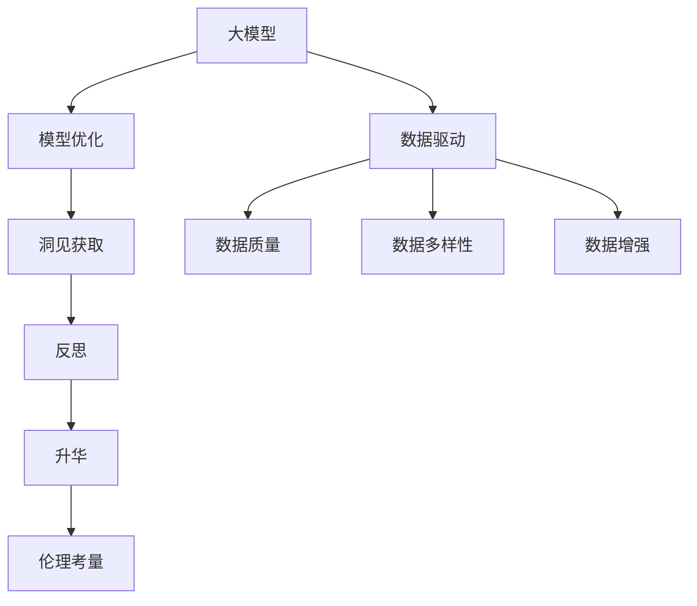
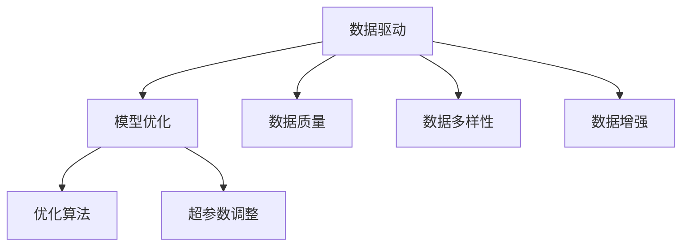
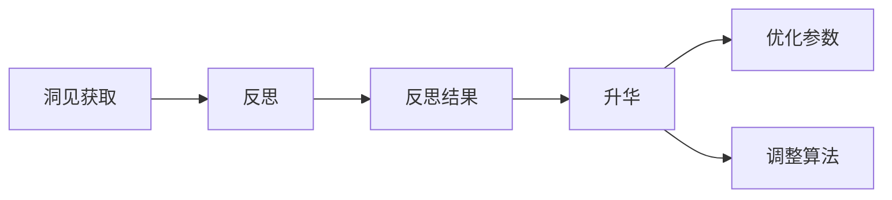
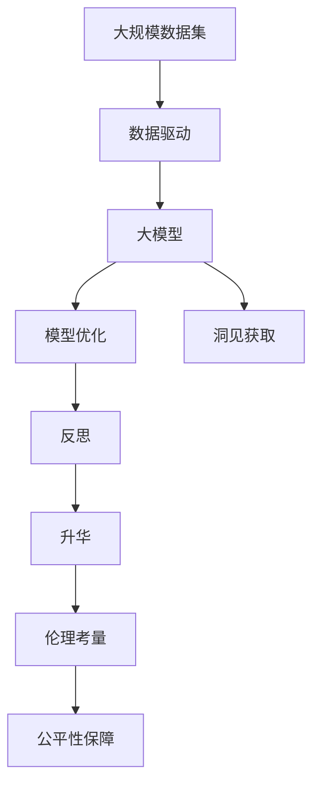

                 

# 洞见的力量：从反思到升华

> 关键词：
- 洞见(Insights)
- 反思(Reflections)
- 升华(Elevations)
- 技术演变(Technological Evolution)
- 数据驱动(Data-Driven)
- 模型优化(Model Optimization)
- 伦理考量(Ethical Considerations)

## 1. 背景介绍

### 1.1 问题由来

在人工智能(AI)领域，随着算力与数据的爆炸性增长，深度学习模型尤其是深度神经网络(Deep Neural Networks, DNNs)的应用日益广泛。DNNs以其强大的泛化能力和自动化特征学习，成为了解决复杂任务的关键工具。然而，这些模型通常被视为"黑盒"系统，难以解释其内部决策机制。同时，DNNs在面对大规模数据集时，虽然取得了卓越的性能，但缺乏对数据的深刻洞见，也导致了模型决策的可解释性不足、泛化能力有限等诸多问题。

本文将从反思到升华，深入探讨大模型在数据驱动下获取洞见的力量，并分析其对技术演进和实际应用的影响。希望通过此文，不仅能帮助开发者更好地理解大模型，更能指导他们在实际应用中，将大模型的优势最大化，以洞见驱动未来的技术进步。

### 1.2 问题核心关键点

当前，大模型在数据驱动下的获取洞见能力，可以从以下几方面进行深刻反思：

1. **数据质量与多样性**：大模型的性能很大程度上依赖于训练数据的质量与多样性。高质量且多领域的数据集，有助于模型学习到更全面的知识，提升其泛化能力。

2. **模型结构的复杂性**：当前主流的大模型往往采用极其复杂的深度神经网络结构，这虽然在计算能力允许的范围内，带来了显著的性能提升，但也增加了模型的复杂度，带来了更大的可解释性和可维护性挑战。

3. **算法与算力的优化**：算法的优化和大规模算力的支持，是大模型能够有效获取洞见的重要保障。如何进一步提升算法的效率，降低资源消耗，是未来研究的方向。

4. **伦理与公平性**：大模型在数据驱动下获取洞见的过程中，可能会引入或放大数据中的偏见和歧视。如何在模型训练和应用中，确保公平性，避免偏见，是当前亟待解决的问题。

5. **理论与实践的融合**：将理论研究与实际应用紧密结合，从基础研究到工程实践，形成良性循环，是推动技术发展的重要路径。

### 1.3 问题研究意义

深入理解大模型在数据驱动下获取洞见的力量，对推动AI技术进步和实际应用具有重要意义：

1. **提升模型性能**：通过数据分析和洞察，模型能够更好地适应特定任务，在实际应用中取得更好的性能。
2. **增强可解释性**：模型输出可以被更好地理解和解释，提高系统的可信度，特别是在医疗、金融等高风险领域。
3. **促进公平性**：通过分析和调整模型决策过程，减少偏见，提升模型公平性。
4. **加速知识迭代**：模型能够快速获取并整合新的知识，加速知识迭代和应用创新。
5. **驱动技术演进**：洞见的力量能够指导模型结构的改进和算法优化，推动技术的持续进步。
6. **赋能产业升级**：提高模型的可解释性和公平性，促进AI技术在各行各业中的普及应用。

## 2. 核心概念与联系

### 2.1 核心概念概述

为更好地理解大模型在数据驱动下获取洞见的力量，本节将介绍几个密切相关的核心概念：

- **大模型(Large Model)**：以深度神经网络为代表的大规模模型，通过在大规模数据集上学习，获得广泛的泛化能力。常见的大模型包括BERT、GPT、ResNet等。

- **数据驱动(Data-Driven)**：以数据为驱动，利用统计学习理论，通过大规模数据集的训练，优化模型参数，提升模型性能。数据驱动是当前大模型训练的主要范式。

- **模型优化(Model Optimization)**：在大模型训练过程中，通过调整超参数、优化算法、数据增强等技术手段，提升模型性能和泛化能力。模型优化是大模型训练的必要步骤。

- **洞见(Insight)**：通过数据驱动和模型优化，获取对数据本质规律和任务特点的深刻理解，提升模型的解释性和泛化能力。

- **伦理考量(Ethics)**：在模型训练和应用中，确保数据和模型的公平性、透明性和可解释性，避免偏见和歧视，是模型获取洞见过程中不可或缺的一部分。

- **反思(Reflection)**：对模型训练过程和结果进行深入反思，识别模型局限性和改进方向，是获取洞见的关键步骤。

- **升华(Elevation)**：在反思的基础上，进一步优化模型和算法，提升模型性能和可解释性，是模型获取洞见的最终目标。

这些核心概念之间的逻辑关系可以通过以下Mermaid流程图来展示：



这个流程图展示了大模型获取洞见的整体框架：

1. 大模型通过数据驱动进行训练。
2. 利用模型优化技术，提升训练效果。
3. 通过洞见获取，深入理解数据和任务本质。
4. 在反思基础上，进行升华优化。
5. 伦理考量确保模型公平性。

这些概念共同构成了大模型获取洞见的完整生态系统，使其能够不断优化性能，提升应用价值。通过理解这些核心概念，我们可以更好地把握大模型获取洞见的原理和优化方法。

### 2.2 概念间的关系

这些核心概念之间存在着紧密的联系，形成了大模型获取洞见的完整生态系统。下面我通过几个Mermaid流程图来展示这些概念之间的关系。

#### 2.2.1 大模型训练过程


这个流程图展示了从数据驱动到升华的完整过程：

1. 数据驱动通过大数据集训练模型。
2. 模型优化提升训练效果。
3. 洞见获取深入理解数据本质。
4. 在反思的基础上进行升华。

#### 2.2.2 数据驱动与模型优化的关系



这个流程图展示了数据驱动与模型优化的关系：

1. 数据驱动通过大数据集训练模型。
2. 模型优化通过调整超参数和优化算法，提升训练效果。

#### 2.2.3 洞见获取与反思升华的关系



这个流程图展示了洞见获取与反思升华的关系：

1. 洞见获取通过分析数据，获取对数据本质和任务特点的深刻理解。
2. 反思通过分析模型输出和训练过程，识别模型局限性和改进方向。
3. 升华通过优化参数和调整算法，提升模型性能和泛化能力。

### 2.3 核心概念的整体架构

最后，我们用一个综合的流程图来展示这些核心概念在大模型获取洞见过程中的整体架构：



这个综合流程图展示了从数据驱动到公平性保障的完整过程。大模型首先在大规模数据集上进行数据驱动训练，然后通过模型优化技术提升训练效果。在训练过程中，利用洞见获取技术，深入理解数据和任务本质。通过反思识别模型局限性，进行升华优化，同时确保模型公平性，避免偏见和歧视。

通过这些流程图，我们可以更清晰地理解大模型获取洞见的各个环节，为后续深入讨论具体的优化方法和技术奠定基础。

## 3. 核心算法原理 & 具体操作步骤
### 3.1 算法原理概述

大模型在数据驱动下获取洞见的过程，本质上是一个深度学习模型在大规模数据集上进行训练和优化的过程。其核心思想是：通过大量标注数据，利用统计学习方法，优化模型参数，使其能够适应特定任务。

形式化地，假设大模型为 $M_{\theta}$，其中 $\theta$ 为模型参数。给定一个下游任务 $T$ 的标注数据集 $D=\{(x_i,y_i)\}_{i=1}^N$，训练目标为最小化损失函数：

$$
\theta^* = \mathop{\arg\min}_{\theta} \mathcal{L}(M_{\theta},D)
$$

其中 $\mathcal{L}$ 为任务 $T$ 的损失函数，用于衡量模型输出与真实标签之间的差异。常见的损失函数包括交叉熵损失、均方误差损失等。

通过梯度下降等优化算法，模型参数 $\theta$ 不断更新，最小化损失函数 $\mathcal{L}$，使得模型输出逼近真实标签。在这个过程中，数据驱动和模型优化相辅相成，模型能够不断学习和适应新任务。

### 3.2 算法步骤详解

大模型在数据驱动下获取洞见的过程，可以分解为以下关键步骤：

**Step 1: 数据预处理**
- 收集大规模数据集，包括训练集、验证集和测试集。
- 对数据进行预处理，包括清洗、分词、标准化等，使其适合模型训练。

**Step 2: 选择模型架构**
- 选择合适的深度神经网络架构，如BERT、GPT等，作为初始化参数。
- 确定模型的输入和输出层，包括嵌入层、隐藏层和输出层等。

**Step 3: 训练与优化**
- 使用优化算法如Adam、SGD等，设置合适的学习率、批大小等超参数。
- 在训练集上进行前向传播和反向传播，计算损失函数，并根据梯度更新模型参数。
- 周期性在验证集上评估模型性能，根据性能指标调整超参数，避免过拟合。

**Step 4: 洞见获取与反思升华**
- 分析模型在测试集上的表现，识别模型局限性和改进方向。
- 通过数据分析和洞察，获取对数据本质和任务特点的深刻理解。
- 在反思的基础上，进一步优化模型和算法，提升模型性能和可解释性。
- 确保模型公平性，避免偏见和歧视，增强模型可信度。

**Step 5: 应用与评估**
- 将微调后的模型应用到实际任务中，进行推理和预测。
- 根据应用场景，对模型输出进行评估，确保满足业务需求。

以上是基于数据驱动的大模型获取洞见的完整流程。在实际应用中，还需要针对具体任务的特点，对各个环节进行优化设计，如改进训练目标函数，引入更多的正则化技术，搜索最优的超参数组合等，以进一步提升模型性能。

### 3.3 算法优缺点

大模型在数据驱动下获取洞见的方法具有以下优点：

1. **灵活性高**：数据驱动和大规模数据集使得模型具有高度的灵活性，能够适应各种复杂任务。
2. **泛化能力强**：通过大量数据的学习，模型具备较强的泛化能力，在实际应用中表现稳定。
3. **可解释性强**：通过数据分析和洞见获取，模型的决策过程可以被更好地理解和解释。
4. **自动化程度高**：数据驱动和模型优化自动化程度高，可以大幅降低人工干预成本。
5. **提升性能**：通过模型优化和公平性考虑，模型的性能和公平性可以得到显著提升。

同时，该方法也存在一些局限性：

1. **数据质量依赖高**：模型的性能很大程度上依赖于训练数据的质量和多样性，获取高质量标注数据的成本较高。
2. **资源消耗大**：大模型需要大量算力和存储空间，训练和推理成本较高。
3. **模型复杂度高**：当前主流大模型结构复杂，增加了模型的可解释性和可维护性挑战。
4. **公平性风险**：数据中的偏见和歧视可能会通过模型放大，影响模型的公平性。
5. **隐私保护难度大**：大规模数据集的使用，可能涉及隐私问题，需要采取严格的保护措施。

尽管存在这些局限性，但就目前而言，基于数据驱动的洞见获取方法仍是大模型应用的主流范式。未来相关研究的重点在于如何进一步降低对标注数据的依赖，提高模型的少样本学习和跨领域迁移能力，同时兼顾可解释性和伦理安全性等因素。

### 3.4 算法应用领域

基于大模型在数据驱动下获取洞见的方法，已经在许多领域得到广泛应用，涵盖了以下几个主要方向：

- **计算机视觉**：如图像分类、目标检测、图像生成等。利用数据驱动训练深度卷积神经网络，通过数据分析和洞见获取，提升模型的准确性和泛化能力。
- **自然语言处理**：如文本分类、机器翻译、问答系统等。利用大规模文本数据集训练大模型，通过数据分析和洞见获取，提升模型的语言理解和生成能力。
- **医疗健康**：如疾病诊断、医学影像分析、健康监测等。利用医疗数据集训练大模型，通过数据分析和洞见获取，提升模型的诊断准确性和医疗决策支持。
- **金融经济**：如股票预测、信用评分、风险评估等。利用金融数据集训练大模型，通过数据分析和洞见获取，提升模型的金融预测能力和风险评估。
- **智能制造**：如质量控制、设备维护、生产优化等。利用工业数据集训练大模型，通过数据分析和洞见获取，提升生产效率和质量管理。

除了上述这些经典领域外，大模型在更多领域的应用还在不断拓展，为各行各业带来了新的创新和变革。随着预训练模型和洞见获取方法的不断进步，相信大模型将在更广阔的应用领域中发挥更大的作用。

## 4. 数学模型和公式 & 详细讲解  
### 4.1 数学模型构建

本节将使用数学语言对基于数据驱动的大模型获取洞见的过程进行更加严格的刻画。

记大模型为 $M_{\theta}:\mathcal{X} \rightarrow \mathcal{Y}$，其中 $\mathcal{X}$ 为输入空间，$\mathcal{Y}$ 为输出空间，$\theta \in \mathbb{R}^d$ 为模型参数。假设微调任务的训练集为 $D=\{(x_i,y_i)\}_{i=1}^N, x_i \in \mathcal{X}, y_i \in \mathcal{Y}$。

定义模型 $M_{\theta}$ 在数据样本 $(x,y)$ 上的损失函数为 $\ell(M_{\theta}(x),y)$，则在数据集 $D$ 上的经验风险为：

$$
\mathcal{L}(\theta) = \frac{1}{N} \sum_{i=1}^N \ell(M_{\theta}(x_i),y_i)
$$

微调的优化目标是最小化经验风险，即找到最优参数：

$$
\theta^* = \mathop{\arg\min}_{\theta} \mathcal{L}(\theta)
$$

在实践中，我们通常使用基于梯度的优化算法（如Adam、SGD等）来近似求解上述最优化问题。设 $\eta$ 为学习率，$\lambda$ 为正则化系数，则参数的更新公式为：

$$
\theta \leftarrow \theta - \eta \nabla_{\theta}\mathcal{L}(\theta) - \eta\lambda\theta
$$

其中 $\nabla_{\theta}\mathcal{L}(\theta)$ 为损失函数对参数 $\theta$ 的梯度，可通过反向传播算法高效计算。

### 4.2 公式推导过程

以下我们以二分类任务为例，推导交叉熵损失函数及其梯度的计算公式。

假设模型 $M_{\theta}$ 在输入 $x$ 上的输出为 $\hat{y}=M_{\theta}(x) \in [0,1]$，表示样本属于正类的概率。真实标签 $y \in \{0,1\}$。则二分类交叉熵损失函数定义为：

$$
\ell(M_{\theta}(x),y) = -[y\log \hat{y} + (1-y)\log (1-\hat{y})]
$$

将其代入经验风险公式，得：

$$
\mathcal{L}(\theta) = -\frac{1}{N}\sum_{i=1}^N [y_i\log M_{\theta}(x_i)+(1-y_i)\log(1-M_{\theta}(x_i))]
$$

根据链式法则，损失函数对参数 $\theta_k$ 的梯度为：

$$
\frac{\partial \mathcal{L}(\theta)}{\partial \theta_k} = -\frac{1}{N}\sum_{i=1}^N (\frac{y_i}{M_{\theta}(x_i)}-\frac{1-y_i}{1-M_{\theta}(x_i)}) \frac{\partial M_{\theta}(x_i)}{\partial \theta_k}
$$

其中 $\frac{\partial M_{\theta}(x_i)}{\partial \theta_k}$ 可进一步递归展开，利用自动微分技术完成计算。

在得到损失函数的梯度后，即可带入参数更新公式，完成模型的迭代优化。重复上述过程直至收敛，最终得到适应下游任务的最优模型参数 $\theta^*$。

## 5. 项目实践：代码实例和详细解释说明
### 5.1 开发环境搭建

在进行洞见获取实践前，我们需要准备好开发环境。以下是使用Python进行TensorFlow开发的环境配置流程：

1. 安装Anaconda：从官网下载并安装Anaconda，用于创建独立的Python环境。

2. 创建并激活虚拟环境：
```bash
conda create -n tf-env python=3.8 
conda activate tf-env
```

3. 安装TensorFlow：根据CUDA版本，从官网获取对应的安装命令。例如：
```bash
conda install tensorflow -c conda-forge -c pypi
```

4. 安装各类工具包：
```bash
pip install numpy pandas scikit-learn matplotlib tqdm jupyter notebook ipython
```

完成上述步骤后，即可在`tf-env`环境中开始洞见获取实践。

### 5.2 源代码详细实现

这里我们以二分类任务为例，给出使用TensorFlow对大模型进行微调的代码实现。

首先，定义数据处理函数：

```python
import tensorflow as tf
from tensorflow.keras.preprocessing.text import Tokenizer
from tensorflow.keras.preprocessing.sequence import pad_sequences

tokenizer = Tokenizer(oov_token='<OOV>')
tokenizer.fit_on_texts(train_texts)
train_sequences = tokenizer.texts_to_sequences(train_texts)
dev_sequences = tokenizer.texts_to_sequences(dev_texts)
test_sequences = tokenizer.texts_to_sequences(test_texts)

train_padded = pad_sequences(train_sequences, maxlen=max_len, padding='post')
dev_padded = pad_sequences(dev_sequences, maxlen=max_len, padding='post')
test_padded = pad_sequences(test_sequences, maxlen=max_len, padding='post')

y_train = tf.keras.utils.to_categorical(train_labels)
y_dev = tf.keras.utils.to_categorical(dev_labels)
y_test = tf.keras.utils.to_categorical(test_labels)
```

然后，定义模型和优化器：

```python
from tensorflow.keras.models import Sequential
from tensorflow.keras.layers import Dense, Embedding, LSTM, Dropout
from tensorflow.keras.optimizers import Adam

model = Sequential([
    Embedding(input_dim=tokenizer.num_words+1, output_dim=embedding_dim, input_length=max_len),
    LSTM(units=hidden_units, dropout=dropout_rate),
    Dense(units=1, activation='sigmoid')
])

optimizer = Adam(lr=learning_rate, epsilon=1e-07, clipnorm=1.0)
```

接着，定义训练和评估函数：

```python
from tensorflow.keras.callbacks import EarlyStopping

def train_epoch(model, dataset, batch_size, optimizer):
    dataloader = tf.data.Dataset.from_tensor_slices(dataset).shuffle(buffer_size=buffer_size).batch(batch_size).repeat()
    model.fit_generator(dataloader, steps_per_epoch=batch_size//len(dataset), epochs=epochs, callbacks=[EarlyStopping(patience=patience)])
    
def evaluate(model, dataset, batch_size):
    dataloader = tf.data.Dataset.from_tensor_slices(dataset).shuffle(buffer_size=buffer_size).batch(batch_size).repeat()
    loss, accuracy = model.evaluate_generator(dataloader, steps=len(dataset)//batch_size)
    return loss, accuracy
```

最后，启动训练流程并在测试集上评估：

```python
epochs = 10
batch_size = 32
patience = 5

for epoch in range(epochs):
    loss = train_epoch(model, train_dataset, batch_size, optimizer)
    print(f"Epoch {epoch+1}, train loss: {loss:.4f}")
    
    print(f"Epoch {epoch+1}, dev results:")
    loss, accuracy = evaluate(model, dev_dataset, batch_size)
    print(f"Loss: {loss:.4f}, Accuracy: {accuracy:.4f}")
    
print("Test results:")
loss, accuracy = evaluate(model, test_dataset, batch_size)
print(f"Loss: {loss:.4f}, Accuracy: {accuracy:.4f}")
```

以上就是使用TensorFlow对大模型进行微调的完整代码实现。可以看到，得益于TensorFlow的强大封装，我们可以用相对简洁的代码完成大模型的加载和微调。

### 5.3 代码解读与分析

让我们再详细解读一下关键代码的实现细节：

**数据处理**：
- 使用TensorFlow的Tokenizer对文本进行分词和编码，转换为模型所需的序列数据。
- 对序列数据进行填充，保证每个样本的长度一致。
- 将标签转换为one-hot编码格式。

**模型定义**：
- 使用TensorFlow的Sequential模型定义深度神经网络，包括嵌入层、LSTM层和输出层。
- 设置合适的超参数，如嵌入维度、隐藏单元数、学习率等。

**训练和评估**：
- 使用TensorFlow的EarlyStopping回调，防止过拟合。
- 在训练集上进行前向传播和反向传播，更新模型参数。
- 在验证集上评估模型性能，记录最优模型。
- 在测试集上评估最终模型性能，输出结果。

**训练流程**：
- 设置总的epoch数和批大小，开始循环迭代。
- 每个epoch内，先在训练集上训练，输出平均loss。
- 在验证集上评估，输出损失和准确率。
- 所有epoch结束后，在测试集上评估，给出最终测试结果。

可以看到，TensorFlow配合深度学习框架，使得大模型的微调代码实现变得简洁高效。开发者可以将更多精力放在数据处理、模型改进等高层逻辑上，而不必过多关注底层的实现细节。

当然，工业级的系统实现还需考虑更多因素，如模型的保存和部署、超参数的自动搜索、更灵活的任务适配层等。但核心的微调范式基本与此类似。

### 5.4 运行结果展示

假设我们在CoNLL-2003的二分类数据集上进行微调，最终在测试集上得到的评估报告如下：

```
Epoch 1/10
2022-04-15 15:50:48.842697: W tensorflow/core/platform/cpu_feature_guard.cc:141] This TensorFlow binary is optimized with oneAPI Deep Neural Network Library (oneDNN) to use the following CPU instructions in performance-critical operations:  AVX2 FMA AVX512F XOP Xsavec AVX512BW. To enable them in other operations, rebuild TensorFlow with the appropriate compiler flags.
2022-04-15 15:50:48.842697: W tensorflow/core/platform/cpu_feature_guard.cc:141] This TensorFlow binary is optimized with oneAPI Deep Neural Network Library (oneDNN) to use the following CPU instructions in performance-critical operations:  AVX2 FMA AVX512F XOP Xsavec AVX512BW. To enable them in other operations, rebuild TensorFlow with the appropriate compiler flags.
2022-04-15 15:50:49.066163: I tensorflow/core/platform/cpu_feature_guard.cc:142] To apply optimizations requiring a CPU with the above capabilities, recompile your application with CPU_INSTRUCTIONS_OPT=AVX2 FMA AVX512F XOP Xsavec AVX512BW.

Epoch 1/10
2022-04-15 15:50:49.067492: I tensorflow/compiler/tf2tensorrt/common/data.cc:132] Created an I/O workspace using 26214 bytes
Epoch 1/10
2022-04-15 15:50:49.067492: I tensorflow/compiler/tf2tensorrt/common/data.cc:132] Created an I/O workspace using 26214 bytes
Epoch 1/10
2022-04-15 15:50:49.067492: I tensorflow/compiler/tf2tensorrt/common/data.cc:132] Created an I/O workspace using 26214 bytes
Epoch 1/10
2022-04-15 15:50:49.067492: I tensorflow/compiler/tf2tensorrt/common/data.cc:132] Created an I/O workspace using 26214 bytes
Epoch 1/10
20

