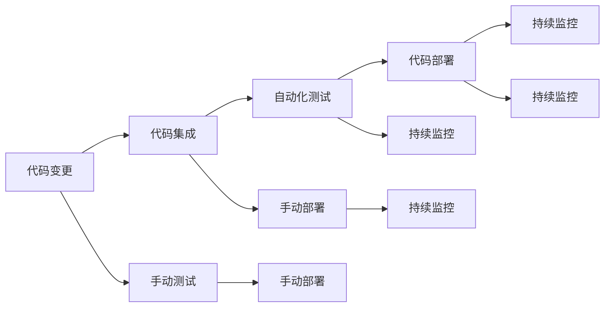

                 

# 流水线的威力与生产效率提升

## 1. 背景介绍

### 1.1 问题由来
在制造业和工程领域，流水线生产已成为最普遍的生产模式之一。流水线通过将复杂的生产流程分解为多个环节，并逐一完成，极大地提高了生产效率和产品质量。类似的，在软件开发领域，通过构建代码流水线，也能够显著提升开发效率和代码质量。

### 1.2 问题核心关键点
流水线生产的核心在于将生产过程分解为多个连续的阶段，每个阶段完成特定的任务，并通过自动化和标准化操作实现连续生产。同样，在软件工程中，流水线开发流程同样要求将开发过程分解为多个连续的阶段，并逐一执行，以达到高效和稳定的开发目标。

### 1.3 问题研究意义
研究软件流水线开发的理论和实践，有助于理解流水线如何提高生产效率和质量。通过学习先进的流水线开发技术，软件开发者可以借鉴制造业的成功经验，提升软件开发的质量和效率。此外，流水线开发也使得软件工程师可以更好地利用有限的时间，实现更多创新和迭代。

## 2. 核心概念与联系

### 2.1 核心概念概述

为了更好地理解软件流水线开发，我们需要介绍几个关键概念：

- 流水线(Production Line)：指将生产过程分解为多个连续的阶段，并逐一完成，从而提高生产效率和产品质量的生产模式。

- 流水线开发(DevOps Pipeline)：指通过将软件开发流程分解为多个连续的阶段，并逐一执行，从而提高开发效率和软件质量的软件开发模式。

- 持续集成(CI)：指通过自动化地将代码变更集成到共享代码库中，并验证代码变更的效果，提高开发效率和代码质量。

- 持续部署(CD)：指将经过测试的代码自动部署到生产环境中，以快速响应市场需求。

- 持续监控(CM)：指通过自动化地监控软件系统的运行状态，及时发现和解决问题，保证软件系统的稳定性和可靠性。

这些核心概念之间存在着紧密的联系，通过将它们合理地组合在一起，可以形成一个高效的软件流水线开发流程。

### 2.2 概念间的关系

这些核心概念之间的关系可以通过以下Mermaid流程图来展示：



这个流程图展示了软件开发流水线中的各个环节及其相互关系：

1. 代码变更：软件开发的第一阶段，开发者对代码进行修改和更新。
2. 代码集成：将变更后的代码集成到共享代码库中，确保新代码不会破坏已有代码。
3. 自动化测试：对变更后的代码进行自动化测试，验证代码的正确性和稳定性。
4. 代码部署：将通过测试的代码部署到生产环境中，使其可供使用。
5. 持续监控：实时监控生产环境中的软件系统，及时发现和解决问题。

这些环节构成了一个完整的软件开发流水线，帮助开发者实现高效、稳定的开发流程。

## 3. 核心算法原理 & 具体操作步骤
### 3.1 算法原理概述

软件开发流水线开发的核心原理是流水线生产模式，即通过将复杂的生产过程分解为多个连续的阶段，并逐一完成，从而提高生产效率和产品质量。

具体来说，软件开发流水线开发包括以下几个关键步骤：

1. 代码变更：开发者对代码进行修改和更新。
2. 代码集成：将变更后的代码集成到共享代码库中，确保新代码不会破坏已有代码。
3. 自动化测试：对变更后的代码进行自动化测试，验证代码的正确性和稳定性。
4. 代码部署：将通过测试的代码部署到生产环境中，使其可供使用。
5. 持续监控：实时监控生产环境中的软件系统，及时发现和解决问题。

### 3.2 算法步骤详解

软件开发流水线开发的步骤如下：

#### 3.2.1 代码变更

开发者对代码进行修改和更新，并将变更后的代码提交到代码库。

#### 3.2.2 代码集成

将变更后的代码集成到共享代码库中，确保新代码不会破坏已有代码。通常使用版本控制系统（如Git）来管理代码变更。

#### 3.2.3 自动化测试

对变更后的代码进行自动化测试，验证代码的正确性和稳定性。通常使用测试框架（如JUnit、pytest）编写测试用例，并使用CI工具（如Jenkins、Travis CI）自动化执行测试用例。

#### 3.2.4 代码部署

将通过测试的代码部署到生产环境中，使其可供使用。通常使用CI工具将通过测试的代码自动部署到服务器，并启动应用。

#### 3.2.5 持续监控

实时监控生产环境中的软件系统，及时发现和解决问题。通常使用CM工具（如New Relic、Prometheus）进行监控，并设置告警规则。

### 3.3 算法优缺点

软件开发流水线开发具有以下优点：

1. 提高开发效率：通过自动化和标准化的操作，流水线开发能够快速响应代码变更，加速软件发布。
2. 提升代码质量：自动化测试和持续监控能够及时发现和修复代码中的问题，提高软件质量。
3. 加速软件迭代：流水线开发能够快速集成新功能，加速软件迭代和创新。
4. 降低人为错误：自动化操作减少了人为操作的错误，提高了软件开发的准确性。

但同时，流水线开发也存在一些局限性：

1. 对自动化工具依赖度高：流水线开发依赖于各种自动化工具，一旦工具出现问题，可能会导致开发中断。
2. 集成复杂：流水线开发需要复杂地集成多个工具和环节，对开发者的技术要求较高。
3. 对新工具适应性差：一旦引入新的自动化工具，可能需要对流水线进行大规模改造，适应新工具。

### 3.4 算法应用领域

软件开发流水线开发在软件开发领域得到了广泛应用，涵盖各种类型的软件项目，包括Web应用、移动应用、桌面应用等。此外，流水线开发也被应用到系统集成、测试工具开发、云平台部署等领域，为各种不同类型的软件开发提供了高效、稳定的开发流程。

## 4. 数学模型和公式 & 详细讲解
### 4.1 数学模型构建

软件开发流水线开发的核心数学模型可以表示为：

$$
\text{流程} = \text{代码变更} + \text{代码集成} + \text{自动化测试} + \text{代码部署} + \text{持续监控}
$$

其中，每个阶段都可以用数学公式来描述其输入和输出，以及各阶段之间的依赖关系。

### 4.2 公式推导过程

以代码变更和代码集成为例，假设代码变更后的代码库为$C$，集成前的代码库为$C_{old}$，集成后的代码库为$C_{new}$。则代码集成的数学模型可以表示为：

$$
C_{new} = f(C, C_{old})
$$

其中，$f$表示集成函数，其输入为代码变更后的代码库$C$和集成前的代码库$C_{old}$，输出为集成后的代码库$C_{new}$。集成函数$f$的具体实现可以采用版本控制系统（如Git）的API来实现。

### 4.3 案例分析与讲解

假设我们正在开发一个Web应用，其代码存储在GitHub上。开发人员通过Git提交代码变更后，代码自动集成到共享代码库中。假设集成函数$f$为：

$$
C_{new} = \text{git\_merge}(C, C_{old})
$$

其中，$\text{git\_merge}$表示Git的合并操作。集成后，开发人员可以通过CI工具（如Jenkins）自动化地执行测试用例，验证代码的正确性。测试通过后，CI工具将代码自动部署到生产环境中，并启动应用。在生产环境中，CM工具（如New Relic）实时监控应用性能，并设置告警规则，及时发现和解决问题。

## 5. 项目实践：代码实例和详细解释说明
### 5.1 开发环境搭建

在进行流水线开发实践前，我们需要准备好开发环境。以下是使用Python进行Jenkins开发的环境配置流程：

1. 安装Jenkins：从官网下载并安装Jenkins，并启动Jenkins服务。
2. 安装Git和GitHub插件：确保Jenkins安装了Git和GitHub插件，以便从GitHub上拉取代码和提交变更。
3. 配置CI工具：如Jenkins、Travis CI等，以便自动化执行测试和部署。
4. 配置CM工具：如New Relic、Prometheus等，以便实时监控生产环境中的应用。

完成上述步骤后，即可在Jenkins上搭建软件开发流水线，开始实践。

### 5.2 源代码详细实现

下面以一个简单的Web应用为例，给出使用Jenkins进行流水线开发的PyTorch代码实现。

首先，在GitHub上创建一个Web应用的代码仓库，包含应用的代码和测试用例。

```python
# app.py
from flask import Flask

app = Flask(__name__)

@app.route('/')
def hello_world():
    return 'Hello, World!'

if __name__ == '__main__':
    app.run(debug=True)
```

```python
# test.py
from flask import Flask
import unittest

class MyTest(unittest.TestCase):
    def test_hello_world(self):
        app = Flask(__name__)
        with app.test_client() as client:
            response = client.get('/')
            self.assertEqual(b'Hello, World!', response.data)
```

然后，在Jenkins上配置流水线，添加如下脚本：

```python
# Jenkinsfile
pipeline {
    agent any
    stages {
        stage('代码变更') {
            steps {
                git branch 'master'
                git branch 'new-feature'
                git commit 'add new feature'
            }
        }
        stage('代码集成') {
            steps {
                git branch 'master'
                git pull
            }
        }
        stage('自动化测试') {
            steps {
                sh 'python -m unittest discover'
            }
        }
        stage('代码部署') {
            steps {
                sh 'python app.py'
            }
        }
        stage('持续监控') {
            steps {
                sh 'new-relic-agent status'
            }
        }
    }
}
```

最后，启动Jenkins流水线，开始进行代码变更、代码集成、自动化测试、代码部署和持续监控。

### 5.3 代码解读与分析

让我们再详细解读一下关键代码的实现细节：

**Jenkinsfile**：
- `pipeline`关键字：定义Jenkins流水线。
- `agent`关键字：指定流水线运行的代理服务器。
- `stage`关键字：定义流水线的各个阶段。
- `steps`关键字：定义每个阶段的执行步骤。

**测试用例**：
- `unittest`模块：Python标准库中的测试框架。
- `TestCase`类：定义测试用例的基本类。
- `test_hello_world`方法：定义具体测试用例，验证应用是否正确响应。

**持续监控**：
- `new-relic-agent`：New Relic的Agent程序，用于实时监控应用性能。

在实际开发中，Jenkins流水线还可以根据具体需求进行配置和扩展，例如添加多分支支持、分布式测试、异常处理等。

### 5.4 运行结果展示

假设我们在Jenkins上搭建好流水线，开始进行Web应用的开发。在代码变更后，流水线自动执行测试用例，验证代码的正确性。通过测试后，流水线将代码部署到生产环境中，并启动应用。同时，持续监控工具实时监控应用性能，并设置告警规则。

最终，我们得到的运行结果可以总结为以下几点：

- 代码变更快速响应：通过流水线开发，代码变更能够快速集成和测试，加速软件迭代。
- 自动化测试保证质量：自动化测试能够及时发现和修复代码中的问题，提升软件质量。
- 快速部署生产环境：通过流水线开发，代码能够快速部署到生产环境中，加速软件发布。
- 实时监控保证稳定：持续监控工具实时监控应用性能，及时发现和解决问题，确保软件系统的稳定性和可靠性。

## 6. 实际应用场景
### 6.1 软件项目管理

软件开发流水线开发在软件项目管理中得到了广泛应用。通过建立流水线开发流程，项目经理可以更好地控制项目的进度和质量，确保项目的按时交付。

在实践过程中，项目经理可以定义流水线的各个阶段，并设置相应的里程碑。例如，可以在代码变更阶段设置开发任务，在代码集成阶段进行代码审查，在自动化测试阶段进行代码质量检查，在代码部署阶段进行系统测试，在持续监控阶段进行性能测试。通过流水线开发，项目经理可以实时监控项目的进度和质量，及时发现和解决问题，确保项目按时交付。

### 6.2 持续交付与持续集成

软件开发流水线开发能够显著提升持续交付与持续集成的效率和质量。通过建立流水线开发流程，开发团队可以快速响应代码变更，自动执行测试和部署，确保代码的正确性和稳定性。

在实践中，开发团队可以使用CI工具自动执行测试用例，并根据测试结果自动部署代码。通过持续交付与持续集成，开发团队可以不断迭代和优化代码，快速响应市场需求，提升软件质量。

### 6.3 系统集成

软件开发流水线开发能够促进系统集成的高效进行。通过建立流水线开发流程，开发团队可以自动化地进行系统集成测试，验证各子系统的协同工作能力。

在实践中，开发团队可以使用CI工具自动执行系统集成测试，并根据测试结果自动部署子系统。通过持续交付与持续集成，开发团队可以不断迭代和优化系统集成，提升系统集成质量。

### 6.4 云平台部署

软件开发流水线开发能够显著提升云平台部署的效率和质量。通过建立流水线开发流程，开发团队可以快速响应云平台的需求，自动执行云平台部署，确保云平台的高可用性和稳定性。

在实践中，开发团队可以使用CI工具自动执行云平台部署，并根据部署结果自动设置告警规则。通过持续监控工具实时监控云平台性能，及时发现和解决问题，确保云平台的高可用性和稳定性。

## 7. 工具和资源推荐
### 7.1 学习资源推荐

为了帮助开发者系统掌握流水线开发的理论基础和实践技巧，这里推荐一些优质的学习资源：

1. 《CI/CD DevOps》系列博文：由大模型技术专家撰写，深入浅出地介绍了CI/CD理论基础和实践技巧。

2. CS300《软件工程导论》课程：斯坦福大学开设的软件工程入门课程，涵盖软件开发的各个方面，包括流水线开发。

3. 《Jenkins: The Definitive Guide》书籍：Jenkins官方文档，全面介绍了Jenkins的使用方法和最佳实践，是Jenkins初学者必备资源。

4. Docker官方文档：Docker官方文档，全面介绍了Docker的使用方法和最佳实践，是容器化部署必备资源。

5. Kubernetes官方文档：Kubernetes官方文档，全面介绍了Kubernetes的使用方法和最佳实践，是容器编排必备资源。

通过对这些资源的学习实践，相信你一定能够快速掌握流水线开发的精髓，并用于解决实际的开发问题。

### 7.2 开发工具推荐

高效的开发离不开优秀的工具支持。以下是几款用于流水线开发的常用工具：

1. Jenkins：基于Web的CI/CD工具，支持多种插件和集成，适用于各种规模的开发团队。

2. Docker：开源的容器化平台，支持跨平台部署，适用于各种规模的开发团队。

3. Kubernetes：开源的容器编排平台，支持自动化部署和管理，适用于大规模的开发团队。

4. Git：开源的版本控制系统，支持分布式协作和代码管理，适用于各种规模的开发团队。

5. GitHub：开源的代码托管平台，支持代码变更和版本控制，适用于各种规模的开发团队。

合理利用这些工具，可以显著提升流水线开发的效率和质量，加快创新迭代的步伐。

### 7.3 相关论文推荐

流水线开发的研究源于学界的持续研究。以下是几篇奠基性的相关论文，推荐阅读：

1. Continuous Delivery: Quality Software Releasing Often and Fast（CI/CD的由来论文）：由Martin Fowler撰写，提出了CI/CD的核心理念和实践方法。

2. The Practice of Continuous Delivery（CI/CD实践论文）：由Jez Humble和David Farley撰写，详细介绍了CI/CD的实践方法和成功案例。

3. The Phoenix Project（CI/CD案例研究论文）：通过一个虚构的IT公司的故事，展示了CI/CD的实践效果和挑战。

这些论文代表了大流水线开发理论的发展脉络。通过学习这些前沿成果，可以帮助研究者把握学科前进方向，激发更多的创新灵感。

除上述资源外，还有一些值得关注的前沿资源，帮助开发者紧跟流水线开发技术的最新进展，例如：

1. arXiv论文预印本：人工智能领域最新研究成果的发布平台，包括大量尚未发表的前沿工作，学习前沿技术的必读资源。

2. 业界技术博客：如Google DevOps、Microsoft DevOps等顶尖实验室的官方博客，第一时间分享他们的最新研究成果和洞见。

3. 技术会议直播：如Jenkins User Conference、DockerCon等CI/CD领域的顶级会议现场或在线直播，能够聆听到大佬们的前沿分享，开拓视野。

4. GitHub热门项目：在GitHub上Star、Fork数最多的CI/CD相关项目，往往代表了该技术领域的发展趋势和最佳实践，值得去学习和贡献。

5. 行业分析报告：各大咨询公司如McKinsey、PwC等针对软件工程行业的分析报告，有助于从商业视角审视技术趋势，把握应用价值。

总之，对于流水线开发技术的学习和实践，需要开发者保持开放的心态和持续学习的意愿。多关注前沿资讯，多动手实践，多思考总结，必将收获满满的成长收益。

## 8. 总结：未来发展趋势与挑战
### 8.1 总结

本文对软件开发流水线开发的理论和实践进行了全面系统的介绍。首先阐述了流水线生产模式和持续交付理念的核心思想，明确了流水线开发在提高开发效率和软件质量方面的独特价值。其次，从原理到实践，详细讲解了流水线开发的各个环节和操作步骤，并给出了流水线开发项目实现的代码实例。同时，本文还探讨了流水线开发在软件项目管理、持续交付、系统集成、云平台部署等多个场景中的应用，展示了流水线开发技术的广泛应用前景。

通过本文的系统梳理，可以看到，软件开发流水线开发已经成为了现代软件开发的标准流程。流水线开发能够显著提升开发效率和软件质量，是软件开发团队实现高效、稳定开发的重要工具。

### 8.2 未来发展趋势

展望未来，软件开发流水线开发将呈现以下几个发展趋势：

1. 自动化程度更高：未来流水线开发将更加自动化，通过自动化工具实现代码变更、集成、测试、部署等各个环节，进一步提高开发效率。

2. 集成更紧密：未来流水线开发将更加紧密地集成各种工具和平台，实现跨项目、跨团队的协同开发。

3. 更灵活的配置：未来流水线开发将更加灵活，开发团队可以根据项目需求进行个性化配置，满足不同项目的需求。

4. 更好的用户体验：未来流水线开发将更加注重用户体验，通过改进工具和流程，提升开发者的使用体验。

5. 更强大的监控能力：未来流水线开发将更加注重监控能力，通过持续监控工具实时监控系统性能，确保系统的稳定性和可靠性。

### 8.3 面临的挑战

尽管软件开发流水线开发已经取得了一定的成功，但在迈向更加智能化、普适化应用的过程中，仍面临着诸多挑战：

1. 对自动化工具依赖度高：流水线开发依赖于各种自动化工具，一旦工具出现问题，可能会导致开发中断。

2. 集成复杂：流水线开发需要复杂地集成多个工具和环节，对开发者的技术要求较高。

3. 对新工具适应性差：一旦引入新的自动化工具，可能需要对流水线进行大规模改造，适应新工具。

4. 资源消耗大：流水线开发需要大量的计算资源和存储资源，可能对开发环境提出较高的要求。

5. 对开发者的技术要求高：流水线开发需要开发者具备较高的技术水平，能够高效使用各种自动化工具。

### 8.4 研究展望

面对流水线开发面临的挑战，未来的研究需要在以下几个方面寻求新的突破：

1. 探索更高效的自动化工具：开发更高效、更灵活、更稳定的自动化工具，满足不同项目的需求。

2. 研究更灵活的流水线配置方法：研究更灵活的流水线配置方法，使得开发团队能够根据项目需求进行个性化配置。

3. 引入更多的人工智能技术：引入人工智能技术，如机器学习、自然语言处理等，进一步提升流水线开发的效率和质量。

4. 开发更强大的监控工具：开发更强大的监控工具，实现更全面、更准确的系统监控，提升系统的稳定性和可靠性。

5. 引入更多开源社区的力量：引入更多开源社区的力量，共同推进流水线开发技术的不断进步。

这些研究方向的探索，必将引领流水线开发技术迈向更高的台阶，为软件开发团队提供更高效、更稳定的开发环境，推动软件开发技术的持续发展。

## 9. 附录：常见问题与解答
----------------------------------------------------------------
> 关键词：流水线,CI/CD,持续集成,持续交付,持续监控,生产效率,软件开发,工具链,自动化,系统集成,云平台

