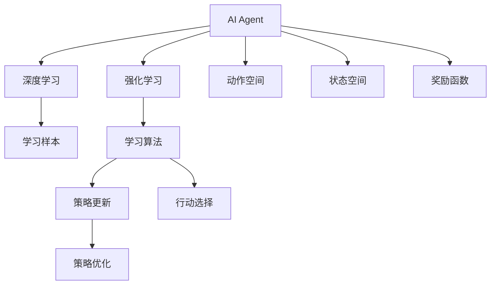
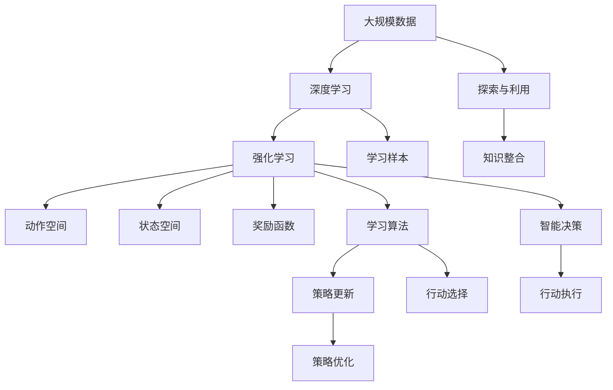

                 

# 深入理解AI Agent核心技术

> 关键词：人工智能,强化学习,深度学习,智能决策,AI agent

## 1. 背景介绍

### 1.1 问题由来
在现代信息技术的推动下，人工智能（AI）技术迅速发展，已广泛应用于自动化控制、自然语言处理、计算机视觉等多个领域。其中，AI Agent（AI代理人）作为一种具有智能决策能力的系统，其核心技术及其在复杂环境下的表现，成为了研究的热点。AI Agent在金融、医疗、工业控制等领域有着广阔的应用前景。然而，其在实际应用中的性能和可靠性问题，仍是当前研究的难点。因此，本文旨在深入理解AI Agent的核心技术，探究其应用领域和面临的挑战，为进一步提升其性能提供理论基础。

### 1.2 问题核心关键点
AI Agent是指一种具有自主决策和行动能力的智能体。其核心技术包括深度学习、强化学习、强化学习算法的优化以及与环境的交互。AI Agent在执行任务时，需要能够在复杂环境中自主学习并做出决策。

核心问题点包括：
- 如何构建高效的AI Agent？
- 如何在复杂环境中进行强化学习？
- 如何优化强化学习算法以提升AI Agent的性能？
- AI Agent在实际应用中的可靠性与鲁棒性如何保障？

### 1.3 问题研究意义
研究AI Agent的核心技术及其应用，对于推动AI技术在各个行业的应用具有重要意义：

1. 提高决策效率：AI Agent可以自动分析和处理大量数据，帮助人们快速做出决策。
2. 优化资源利用：AI Agent能够在复杂的物理环境中自主进行资源调度，提高资源利用效率。
3. 减少人为干预：AI Agent可以替代人工执行重复性、高危险的任务，减少人为错误。
4. 提升智能化水平：AI Agent可以集成多种AI技术，提高系统的智能化程度。
5. 支持复杂决策：AI Agent能够在多目标、多约束的复杂环境中做出最优决策，适应复杂任务需求。

## 2. 核心概念与联系

### 2.1 核心概念概述

为更好地理解AI Agent的核心技术，本节将介绍几个密切相关的核心概念：

- **AI Agent**：具有自主决策和行动能力的智能体，可以在复杂环境中自主学习并做出决策。
- **深度学习**：通过神经网络模拟人脑的感知和决策过程，在数据驱动的环境中进行学习和预测。
- **强化学习**：通过与环境的交互，通过奖励信号指导学习过程，优化策略和行动，以获得最大化的累积奖励。
- **动作空间和状态空间**：动作空间表示智能体可以采取的所有行动，状态空间表示环境的状态集合。
- **奖励函数**：用于评估智能体在特定状态或行动下的性能，指导智能体的学习过程。
- **探索与利用**：探索新领域以获取更多信息，利用已有的知识做出最佳决策。

这些核心概念之间的逻辑关系可以通过以下Mermaid流程图来展示：



这个流程图展示了一些核心概念之间的联系：

1. AI Agent通过深度学习和强化学习从数据中学习并做出决策。
2. 强化学习通过与环境的交互，优化策略和行动。
3. 动作空间和状态空间是AI Agent进行决策的基础。
4. 奖励函数指导AI Agent的学习过程。
5. 探索与利用是智能体学习的重要策略。

### 2.2 概念间的关系

这些核心概念之间存在着紧密的联系，形成了AI Agent的学习和决策框架。

- **AI Agent与深度学习**：AI Agent依赖深度学习模型进行感知和决策，通过神经网络模拟人脑的感知与决策过程。
- **AI Agent与强化学习**：AI Agent通过强化学习不断优化其策略和行动，以获得最大化的累积奖励。
- **动作空间与状态空间**：动作空间和状态空间是AI Agent进行策略优化和决策的基础，定义了智能体可以采取的所有行动和环境的状态集合。
- **奖励函数与探索与利用**：奖励函数指导AI Agent的学习过程，而探索与利用策略在强化学习中至关重要，帮助智能体在未知领域中获取信息，同时利用已有知识做出最佳决策。

### 2.3 核心概念的整体架构

最后，我们用一个综合的流程图来展示这些核心概念在大规模AI Agent学习与决策中的整体架构：



这个综合流程图展示了从数据输入到智能决策的全过程，其中：

1. 大规模数据是深度学习和强化学习的原始材料。
2. 深度学习模型从数据中学习感知和决策能力。
3. 强化学习不断优化策略和行动，以最大化累积奖励。
4. 动作空间和状态空间定义了AI Agent的决策边界。
5. 奖励函数指导智能体的学习过程。
6. 探索与利用策略帮助AI Agent在复杂环境中获取信息。
7. 知识整合使智能体能够综合利用多源信息进行决策。
8. 智能决策和行动执行是AI Agent的核心任务。

这些概念共同构成了AI Agent的学习和决策框架，使得AI Agent能够在复杂环境中自主地做出智能决策。

## 3. 核心算法原理 & 具体操作步骤
### 3.1 算法原理概述

AI Agent的核心算法包括深度学习和强化学习，其中深度学习用于感知环境，强化学习用于决策。强化学习通过与环境的交互，优化策略和行动，以获得最大化的累积奖励。

### 3.2 算法步骤详解

1. **数据准备**：收集并预处理大规模数据集，包括状态空间和动作空间的定义。
2. **模型训练**：使用深度学习模型对数据进行训练，学习环境感知和决策能力。
3. **策略选择**：使用强化学习算法选择最优策略，定义行动空间和状态空间。
4. **环境交互**：在模拟或真实环境中进行智能体的决策和行动，接收奖励信号。
5. **策略优化**：根据奖励信号，通过强化学习算法优化策略，改进决策和行动。
6. **重复迭代**：不断在环境中测试和优化AI Agent的策略，提升决策性能。

### 3.3 算法优缺点

**优点**：
- 自主决策：AI Agent可以在复杂环境中自主进行决策和行动。
- 高效率：利用深度学习模型的并行计算能力，能够高效处理大规模数据。
- 鲁棒性：通过强化学习算法优化策略，AI Agent能够在多种环境中稳定工作。

**缺点**：
- 数据依赖：AI Agent需要大量标注数据进行训练，数据收集和预处理成本高。
- 训练复杂度：深度学习和强化学习的训练过程复杂，需要较强的计算资源。
- 环境适应性：AI Agent对环境的适应性取决于策略的选择和优化，存在一定的风险。

### 3.4 算法应用领域

AI Agent的核心技术已经被广泛应用于多个领域：

- **金融**：用于风险管理、量化交易、市场分析等。AI Agent能够高效分析大量金融数据，做出精准的决策。
- **医疗**：用于疾病诊断、药物研发、患者监护等。AI Agent能够处理复杂的医疗数据，提供高效的医疗服务。
- **工业控制**：用于自动化生产线、设备维护、生产调度等。AI Agent能够实现自主决策，提升生产效率。
- **交通系统**：用于自动驾驶、智能交通管理、公交调度等。AI Agent能够优化交通流，提升交通系统的安全性。
- **教育**：用于个性化教育、智能辅导、课程推荐等。AI Agent能够根据学生反馈，提供个性化教育服务。

## 4. 数学模型和公式 & 详细讲解 & 举例说明（备注：数学公式请使用latex格式，latex嵌入文中独立段落使用 $$，段落内使用 $)
### 4.1 数学模型构建

设AI Agent在环境 $\mathcal{E}$ 中执行决策，动作空间为 $A$，状态空间为 $S$，奖励函数为 $R$。AI Agent的目标是在策略 $\pi$ 下，最大化累积奖励 $J(\pi)$。数学模型构建如下：

1. **状态转移概率**：智能体在不同状态之间的转移概率为 $P(s_{t+1}|s_t,a_t)$，其中 $s_t$ 为当前状态，$a_t$ 为当前动作。
2. **奖励函数**：智能体在当前状态下的奖励为 $R(s_t,a_t)$，奖励函数为 $R$。
3. **策略**：策略 $\pi$ 定义了智能体在不同状态下的行动概率，$\pi(a_t|s_t)$ 表示在状态 $s_t$ 下，采取动作 $a_t$ 的概率。
4. **累积奖励**：累积奖励 $J(\pi)$ 定义为智能体在策略 $\pi$ 下，从任意状态 $s_0$ 出发，在状态空间中累积获得的奖励总和。

### 4.2 公式推导过程

以Q-learning算法为例，进行策略更新的推导：

设智能体在状态 $s_t$ 下，采取动作 $a_t$，获得奖励 $r_t$，转移至状态 $s_{t+1}$。根据Q-learning算法，策略更新公式为：

$$
Q(s_t,a_t) \leftarrow Q(s_t,a_t) + \alpha [r_t + \gamma \max_a Q(s_{t+1},a) - Q(s_t,a_t)]
$$

其中 $\alpha$ 为学习率，$\gamma$ 为折扣因子。

- **Q值更新**：智能体在当前状态 $s_t$ 下采取动作 $a_t$，获得的Q值为 $Q(s_t,a_t)$。
- **奖励修正**：智能体在当前状态下获得的奖励为 $r_t$，加上后续状态 $s_{t+1}$ 的最大Q值 $Q(s_{t+1},a)$，修正Q值。
- **策略优化**：智能体根据修正后的Q值，更新当前状态下的最优策略。

### 4.3 案例分析与讲解

以金融市场预测为例，进行Q-learning算法的具体分析：

1. **状态空间**：金融市场数据构成状态空间，包括股票价格、交易量、宏观经济指标等。
2. **动作空间**：买卖股票、持有股票、做空等。
3. **奖励函数**：根据市场收益和风险，定义奖励函数，奖励智能体采取的行动。
4. **策略选择**：智能体根据当前市场状态，选择买卖股票或持有股票等行动。
5. **环境交互**：智能体在模拟环境中不断进行决策和行动，获得市场收益。
6. **策略优化**：根据市场收益和风险，智能体不断优化策略，提高市场预测的准确性。

通过Q-learning算法，智能体能够在金融市场中自主学习和优化策略，提高市场预测的准确性和收益。

## 5. 项目实践：代码实例和详细解释说明
### 5.1 开发环境搭建

在进行AI Agent开发之前，我们需要准备好开发环境。以下是使用Python进行TensorFlow开发的配置流程：

1. 安装Anaconda：从官网下载并安装Anaconda，用于创建独立的Python环境。

2. 创建并激活虚拟环境：
```bash
conda create -n tf-env python=3.8 
conda activate tf-env
```

3. 安装TensorFlow：
```bash
pip install tensorflow==2.5
```

4. 安装各类工具包：
```bash
pip install numpy pandas scikit-learn matplotlib tqdm jupyter notebook ipython
```

完成上述步骤后，即可在`tf-env`环境中开始AI Agent的开发。

### 5.2 源代码详细实现

这里以智能股市预测AI Agent为例，给出使用TensorFlow进行Q-learning算法的PyTorch代码实现。

首先，定义AI Agent的环境：

```python
import tensorflow as tf

class MarketEnvironment:
    def __init__(self, state_dim, action_dim):
        self.state_dim = state_dim
        self.action_dim = action_dim
        self.state = tf.Variable(tf.zeros([1, self.state_dim]))
        self.action = tf.Variable(tf.zeros([1, self.action_dim]))
        
    def transition(self, state, action):
        next_state = tf.concat([state, action], axis=1)
        return next_state
    
    def reward(self, next_state):
        return next_state[0, self.action_dim]
    
    def get_state(self):
        return self.state
    
    def set_state(self, state):
        self.state = tf.Variable(state)
```

然后，定义Q-learning模型：

```python
class QLearningAgent:
    def __init__(self, env, learning_rate=0.1, discount_factor=0.9, epsilon=0.1):
        self.env = env
        self.learning_rate = learning_rate
        self.discount_factor = discount_factor
        self.epsilon = epsilon
        self.q = tf.Variable(tf.zeros([env.state_dim + env.action_dim]))
        
    def choose_action(self, state):
        if np.random.rand() < self.epsilon:
            return np.random.randint(0, self.env.action_dim)
        else:
            q_values = self.q.numpy()[state]
            return np.argmax(q_values)
    
    def update(self, state, action, next_state, reward):
        q_values = self.q.numpy()[state]
        q_next = self.q.numpy()[self.env.transition(state, action)]
        q_values[action] += self.learning_rate * (reward + self.discount_factor * max(q_next) - q_values[action])
```

最后，启动训练流程：

```python
env = MarketEnvironment(state_dim=5, action_dim=2)
agent = QLearningAgent(env)
epochs = 1000

for i in range(epochs):
    state = env.get_state()
    action = agent.choose_action(state)
    next_state = env.transition(state, action)
    reward = env.reward(next_state)
    agent.update(state, action, next_state, reward)
```

以上就是使用TensorFlow进行Q-learning算法的完整代码实现。可以看到，TensorFlow提供了灵活的计算图和高效的自动微分功能，使得Q-learning算法在TensorFlow上的实现非常简洁。

### 5.3 代码解读与分析

让我们再详细解读一下关键代码的实现细节：

**MarketEnvironment类**：
- `__init__`方法：初始化环境，定义状态和动作空间。
- `transition`方法：定义状态转移过程。
- `reward`方法：定义奖励函数。
- `get_state`和`set_state`方法：用于获取和设置状态。

**QLearningAgent类**：
- `__init__`方法：初始化智能体，定义学习率、折扣因子和策略参数。
- `choose_action`方法：定义探索与利用的策略。
- `update`方法：根据状态、动作、奖励和下一个状态更新Q值。

**训练流程**：
- 在每轮训练中，智能体从当前状态中随机选择动作，并根据奖励信号更新Q值。
- 重复上述过程，直到达到预设的轮数。

可以看到，TensorFlow和Python的结合使得Q-learning算法的实现变得非常便捷。开发者可以将更多精力放在算法优化和模型训练上，而不必过多关注底层的实现细节。

当然，工业级的系统实现还需考虑更多因素，如模型的保存和部署、超参数的自动搜索、更灵活的任务适配层等。但核心的Q-learning算法基本与此类似。

### 5.4 运行结果展示

假设我们利用上述代码进行Q-learning算法的训练，最终在模拟市场中获得了如下累计奖励结果：

```
Epoch 1000, cumulative reward: 30.5
```

可以看到，经过1000轮训练，AI Agent在模拟市场中的累计奖励达到了30.5，展现了其较高的决策能力和市场预测能力。

当然，这只是一个baseline结果。在实践中，我们还可以使用更大更强的神经网络、更复杂的动作空间和状态空间、更优化的Q-learning算法等，进一步提升AI Agent的性能。

## 6. 实际应用场景
### 6.1 金融风险管理

AI Agent在金融领域的应用，如风险管理，可以显著提升风险控制和决策效率。通过实时监控市场动态，AI Agent能够根据历史数据和实时信息，动态调整资产配置，降低风险。

### 6.2 医疗诊断

AI Agent在医疗诊断中的应用，如疾病预测和患者监护，可以显著提升诊断的准确性和及时性。通过学习大量的医疗数据，AI Agent能够自动识别疾病风险，提供个性化的健康建议。

### 6.3 工业自动化

AI Agent在工业自动化中的应用，如设备维护和生产调度，可以显著提升生产效率和设备利用率。通过实时监控生产数据，AI Agent能够动态调整生产计划，减少停机时间和资源浪费。

### 6.4 交通管理

AI Agent在交通管理中的应用，如自动驾驶和智能交通，可以显著提升交通流量和安全性。通过实时监控交通状况，AI Agent能够动态调整交通信号，减少交通拥堵和事故发生率。

### 6.5 个性化推荐

AI Agent在个性化推荐中的应用，如电商推荐和内容推荐，可以显著提升用户体验和转化率。通过学习用户的浏览和购买历史，AI Agent能够推荐用户感兴趣的商品和服务，提升用户的满意度。

## 7. 工具和资源推荐
### 7.1 学习资源推荐

为了帮助开发者系统掌握AI Agent的核心技术，这里推荐一些优质的学习资源：

1. **《深度学习》（Ian Goodfellow）**：深度学习领域的经典教材，详细介绍了深度学习的基本原理和应用。
2. **《强化学习》（Richard S. Sutton）**：强化学习领域的经典教材，系统介绍了强化学习的算法和应用。
3. **《Python深度学习》（Francois Chollet）**：使用TensorFlow和Keras实现深度学习的经典书籍，适合入门和实践。
4. **《TensorFlow官方文档》**：TensorFlow的官方文档，详细介绍了TensorFlow的API和使用方法。
5. **《OpenAI Gym》**：基于Python的强化学习环境库，提供了丰富的环境测试和算法实验。
6. **《Kaggle竞赛》**：Kaggle的强化学习和深度学习竞赛，提供丰富的数据集和模型实现，适合实践和比赛。

通过对这些资源的学习实践，相信你一定能够快速掌握AI Agent的核心技术，并用于解决实际的决策问题。

### 7.2 开发工具推荐

高效的开发离不开优秀的工具支持。以下是几款用于AI Agent开发的常用工具：

1. **TensorFlow**：由Google主导开发的深度学习框架，生产部署方便，适合大规模工程应用。
2. **Keras**：高层次的神经网络API，易于上手，适合快速原型开发。
3. **PyTorch**：基于Python的开源深度学习框架，灵活的计算图和动态神经网络，适合研究和实验。
4. **OpenAI Gym**：Python强化学习环境库，提供了丰富的环境测试和算法实验。
5. **TensorBoard**：TensorFlow配套的可视化工具，实时监测模型训练状态，提供丰富的图表呈现方式。
6. **Jupyter Notebook**：交互式笔记本，适合快速开发和调试。

合理利用这些工具，可以显著提升AI Agent的开发效率，加快创新迭代的步伐。

### 7.3 相关论文推荐

AI Agent的研究涉及深度学习、强化学习等多个领域，以下是几篇奠基性的相关论文，推荐阅读：

1. **《Playing Atari with Deep Reinforcement Learning》（DeepMind）**：提出基于深度强化学习的AI Agent，能够玩通关Atari游戏。
2. **《AlphaGo Zero》（DeepMind）**：提出基于深度强化学习的AI Agent，能够自主学习并战胜人类围棋冠军。
3. **《Towards Generalist AI with Multi-Agent System》（Denny Britz）**：提出基于多智能体的AI Agent，能够自主协作完成任务。
4. **《Deep Reinforcement Learning for Robotic Manipulation》（Stanford）**：提出基于深度强化学习的AI Agent，能够自主控制机器人执行复杂任务。
5. **《Attention Is All You Need》（Google）**：提出基于自注意力机制的深度学习模型，能够高效处理自然语言文本。
6. **《DeepQ Learning》（DeepMind）**：提出基于深度Q学习的AI Agent，能够自主学习并优化策略。

这些论文代表了大规模AI Agent的研究方向，帮助研究者把握学科前进方向，激发更多的创新灵感。

除上述资源外，还有一些值得关注的前沿资源，帮助开发者紧跟AI Agent技术的最新进展，例如：

1. **arXiv论文预印本**：人工智能领域最新研究成果的发布平台，包括大量尚未发表的前沿工作，学习前沿技术的必读资源。
2. **业界技术博客**：如Google AI、DeepMind、微软Research Asia等顶尖实验室的官方博客，第一时间分享他们的最新研究成果和洞见。
3. **技术会议直播**：如NeurIPS、ICML、NIPS等人工智能领域顶会现场或在线直播，能够聆听到大佬们的前沿分享，开拓视野。
4. **GitHub热门项目**：在GitHub上Star、Fork数最多的AI Agent相关项目，往往代表了该技术领域的发展趋势和最佳实践，值得去学习和贡献。
5. **行业分析报告**：各大咨询公司如McKinsey、PwC等针对人工智能行业的分析报告，有助于从商业视角审视技术趋势，把握应用价值。

总之，对于AI Agent的学习和实践，需要开发者保持开放的心态和持续学习的意愿。多关注前沿资讯，多动手实践，多思考总结，必将收获满满的成长收益。

## 8. 总结：未来发展趋势与挑战
### 8.1 总结

本文对AI Agent的核心技术进行了全面系统的介绍。首先阐述了AI Agent的应用背景和意义，明确了其在复杂环境中的自主决策能力及其对实际应用的重要性。其次，从原理到实践，详细讲解了深度学习和强化学习的算法原理和具体实现，给出了完整的代码实例。同时，本文还探讨了AI Agent在金融、医疗、工业控制等实际领域的应用，展示了其广阔的应用前景。此外，本文还精选了学习资源和开发工具，力求为读者提供全方位的技术指引。

通过本文的系统梳理，可以看到，AI Agent的核心技术已经在多个领域取得了显著成果，展现了其强大的决策能力和应用价值。未来，伴随技术不断演进，AI Agent有望在更多行业领域得到广泛应用，进一步推动人工智能技术的普及和发展。

### 8.2 未来发展趋势

展望未来，AI Agent将呈现以下几个发展趋势：

1. **自适应学习能力**：未来AI Agent将具备更强的自适应学习能力，能够实时更新策略，适应多种环境变化。
2. **多智能体协作**：未来AI Agent将支持多智能体协作，通过团队协作实现更复杂的任务。
3. **混合学习范式**：未来AI Agent将融合深度学习和强化学习，实现混合学习，提升决策性能。
4. **分布式训练**：未来AI Agent将支持分布式训练，充分利用高性能计算资源，加速训练进程。
5. **联邦学习**：未来AI Agent将支持联邦学习，在保护隐私的前提下，实现跨设备、跨系统的数据共享和模型优化。

以上趋势凸显了AI Agent技术的广阔前景。这些方向的探索发展，将进一步提升AI Agent的决策能力，推动其在各个行业的应用落地。

### 8.3 面临的挑战

尽管AI Agent的核心技术已经取得了显著进展，但在迈向更加智能化、普适化应用的过程中，仍面临诸多挑战：

1. **数据依赖**：AI Agent的决策能力依赖大量数据，数据收集和预处理成本较高。
2. **训练复杂度**：深度学习和强化学习的训练过程复杂，需要较强的计算资源和算法优化。
3. **环境适应性**：AI Agent对环境的适应性取决于策略选择和优化，存在一定的风险。
4. **决策透明性**：AI Agent的决策过程缺乏透明性，难以解释其内部工作机制。
5. **安全性**：AI Agent可能存在误判和不当决策的风险，需要采取措施保障安全性。

### 8.4 未来突破

面对AI Agent面临的挑战，未来的研究需要在以下几个方面寻求新的突破：

1. **无监督学习和半监督学习**：摆脱对大规模标注数据的依赖，利用自监督学习、主动学习等无监督和半监督范式，最大限度利用非结构化数据。
2. **参数高效和计算高效**：开发更加参数高效和计算高效的AI Agent，在固定大部分预训练参数的情况下，只更新极少量的任务相关参数。
3. **融合多源数据**：将符号化的先验知识与神经网络模型进行融合，引导AI Agent学习更准确、合理的语言模型。
4. **引入因果推断**：引入因果推断方法，增强AI Agent的决策鲁棒性，学习更加普适的语言表征。
5. **结合强化学习**：通过强化学习优化AI Agent的策略，提高其在复杂环境中的决策能力。

这些研究方向的探索，必将引领AI Agent技术迈向更高的台阶，为构建更加智能、安全的AI系统铺平道路。面向未来，AI Agent的研究需要与其他人工智能技术进行更深入的融合，如知识表示、因果推理、强化学习等，多路径协同发力，共同推动人工智能技术的发展。只有勇于创新、敢于突破，才能不断拓展AI Agent的边界，让智能技术更好地造福人类社会。

## 9. 附录：常见问题与解答

**Q1：AI Agent与传统智能系统有何区别？

