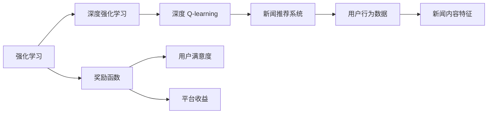
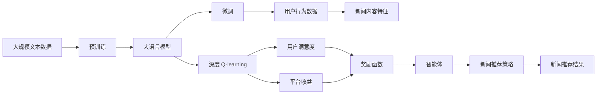

                 

# 深度 Q-learning：在新闻推荐中的应用

> 关键词：深度 Q-learning, 新闻推荐, 强化学习, 深度强化学习, 奖励函数, Q-learning, 深度学习, 模型训练

## 1. 背景介绍

### 1.1 问题由来
在信息爆炸的时代，互联网平台每天都会生成海量新闻数据。如何在海量的新闻中高效、准确地为用户推荐感兴趣的内容，成为了各大新闻平台亟待解决的问题。传统的推荐系统，如基于协同过滤、内容推荐的系统，在处理个性化需求和动态性较强的推荐任务时，存在一定的局限性。而强化学习，尤其是深度强化学习，为新闻推荐系统带来了新的机遇和挑战。

### 1.2 问题核心关键点
深度强化学习在新闻推荐中的应用，主要关注以下关键点：

- 动态推荐：实时调整推荐策略，基于用户行为变化进行调整。
- 个性化推荐：根据用户历史行为、兴趣标签等个性化特征，进行精准推荐。
- 效果评估：建立科学合理的奖励函数，评估推荐策略的有效性。
- 泛化能力：确保模型在未见过的数据上仍能保持良好表现。
- 可解释性：提供推荐逻辑的可解释性，增强用户信任。

### 1.3 问题研究意义
深度强化学习在新闻推荐中的应用，有助于提高推荐系统的个性化程度和推荐效果，同时降低推荐系统的计算复杂度，提升推荐系统的实时性。具体来说，其研究意义如下：

- 提升用户满意度：通过动态调整推荐策略，更准确地满足用户个性化需求，提升用户满意度。
- 优化资源配置：通过优化奖励函数，合理分配平台资源，提升资源利用效率。
- 促进技术发展：深度强化学习在新闻推荐中的应用，推动了强化学习算法在实际业务场景中的应用，促进了强化学习技术的进步。
- 推动新闻业务发展：推荐系统在新闻业务中的应用，能够提升用户留存率，增强平台黏性，推动新闻业务的商业化发展。

## 2. 核心概念与联系

### 2.1 核心概念概述

为更好地理解深度 Q-learning 在新闻推荐中的应用，本节将介绍几个密切相关的核心概念：

- 强化学习(Reinforcement Learning, RL)：一种通过智能体与环境交互，学习最优策略的机器学习方法。智能体在环境中采取一系列行动，并获得相应的奖励或惩罚，以最大化长期累积奖励。
- 深度强化学习(Deep Reinforcement Learning, DRL)：将深度神经网络技术应用于强化学习中，提高模型的决策能力。深度强化学习在处理复杂环境、高维状态空间等问题上表现出优势。
- 深度 Q-learning：一种结合深度神经网络和 Q-learning 的强化学习方法。深度 Q-learning 使用神经网络逼近 Q 值函数，通过端到端的训练，使得智能体能够高效地学习最优策略。
- 新闻推荐系统(News Recommendation System)：一种基于用户行为和新闻特征，为用户推荐感兴趣新闻的系统。新闻推荐系统广泛应用于新闻平台、社交网络等场景，提升用户黏性，增加平台收益。
- 奖励函数(Reward Function)：在强化学习中，用于评估智能体行为表现的函数。奖励函数的设计需要考虑用户满意度、平台收益等多重因素，建立科学合理的奖励函数是实现有效推荐的关键。

这些核心概念之间的逻辑关系可以通过以下 Mermaid 流程图来展示：



这个流程图展示了大语言模型微调过程中各个核心概念的关系和作用：

1. 强化学习是基础，通过智能体与环境交互，学习最优策略。
2. 深度强化学习在处理复杂环境、高维状态空间上表现优异，是推荐系统的核心技术之一。
3. 深度 Q-learning 通过神经网络逼近 Q 值函数，实现高效策略学习。
4. 新闻推荐系统是应用场景，通过优化智能体的决策策略，为用户推荐新闻。
5. 奖励函数用于评估推荐策略的有效性，是设计推荐系统的关键环节。

### 2.2 概念间的关系

这些核心概念之间存在着紧密的联系，形成了深度 Q-learning 在新闻推荐中的应用生态系统。下面我们通过几个 Mermaid 流程图来展示这些概念之间的关系。

#### 2.2.1 深度 Q-learning 的基本原理


这个流程图展示了深度 Q-learning 的基本原理：

1. 智能体在环境中观察当前状态，并采取行动。
2. 神经网络通过观察值预测动作值，得到动作值函数。
3. 智能体根据动作值函数采取最优行动，并得到相应的奖励。
4. 智能体根据损失函数更新模型参数，最小化动作值预测误差。
5. 智能体通过不断迭代，学习最优策略。

#### 2.2.2 新闻推荐系统的动态优化


这个流程图展示了新闻推荐系统的动态优化过程：

1. 智能体收集用户行为数据，并提取用户特征和新闻内容特征。
2. 智能体根据用户特征和新闻内容特征，生成新闻-用户特征矩阵。
3. 智能体通过奖励函数评估用户满意度，得到奖励信号。
4. 智能体根据奖励函数，动态调整新闻推荐策略。
5. 智能体生成新闻推荐结果，并发送给用户。

#### 2.2.3 奖励函数的设计


这个流程图展示了奖励函数的设计过程：

1. 用户满意度是基础，通过点击率、停留时间等指标来评估。
2. 用户反馈评分进一步细化满意度，通过用户对推荐结果的评分来衡量。
3. 平台收益是最终目标，通过平台广告收入等来评估。
4. 总奖励是综合考虑用户满意度和平台收益，得到最终的奖励信号。

### 2.3 核心概念的整体架构

最后，我们用一个综合的流程图来展示这些核心概念在大语言模型微调过程中的整体架构：



这个综合流程图展示了从预训练到微调，再到深度 Q-learning 的完整过程。大语言模型首先在大规模文本数据上进行预训练，然后通过微调得到特定任务上的模型。接下来，通过深度 Q-learning 优化新闻推荐策略，用户满意度、平台收益作为奖励信号，引导智能体动态调整策略，生成推荐结果。通过持续优化，智能体能够不断提升推荐效果。

## 3. 核心算法原理 & 具体操作步骤
### 3.1 算法原理概述

深度 Q-learning 在新闻推荐中的应用，主要基于以下原理：

- 智能体在新闻推荐系统中，通过观察用户行为数据和新闻内容特征，采取一系列动作（如推荐新闻、更新新闻列表等）。
- 智能体根据奖励函数，评估动作带来的用户满意度、平台收益等奖励信号，更新动作值函数。
- 通过神经网络逼近动作值函数，智能体学习最优策略，实现高效推荐。

### 3.2 算法步骤详解

深度 Q-learning 在新闻推荐中的应用主要包括以下几个关键步骤：

**Step 1: 准备数据集和模型**

- 收集用户行为数据和新闻内容特征，构建新闻-用户特征矩阵。
- 构建深度神经网络，作为动作值函数逼近器。
- 定义奖励函数，如用户满意度、平台收益等，用于评估智能体的行为。

**Step 2: 设计动作空间**

- 根据新闻推荐系统的功能，设计动作空间。动作空间可以包括推荐新闻、更新新闻列表、调整推荐算法等。
- 将动作空间编码成向量形式，方便神经网络处理。

**Step 3: 初始化模型参数**

- 初始化神经网络模型参数，如权重、偏置等。
- 初始化智能体行为策略，如随机策略、探索策略等。

**Step 4: 训练模型**

- 通过神经网络逼近动作值函数，使用梯度下降等优化算法最小化动作值预测误差。
- 智能体根据奖励函数，动态调整行为策略，以最大化长期累积奖励。
- 重复上述过程，直至模型收敛。

**Step 5: 优化推荐策略**

- 使用微调后的模型，生成新闻推荐策略。
- 将推荐策略应用到实际推荐系统中，根据用户反馈实时调整策略。
- 定期重新训练模型，确保推荐策略与最新数据一致。

### 3.3 算法优缺点

深度 Q-learning 在新闻推荐中的应用，具有以下优点：

- 动态优化：智能体能够实时根据用户反馈调整推荐策略，提升推荐效果。
- 高维状态空间：深度神经网络可以处理高维状态空间，适用于复杂的推荐场景。
- 端到端学习：深度 Q-learning 通过端到端的训练，直接学习最优推荐策略，无需手动设计特征提取器。

同时，该方法也存在一些局限性：

- 计算复杂度高：深度神经网络和大规模数据集需要较高的计算资源。
- 样本效率低：深度强化学习往往需要大量样本来训练，难以在少量样本上快速收敛。
- 可解释性差：深度神经网络的决策过程难以解释，难以解释推荐逻辑。

尽管存在这些局限性，但深度 Q-learning 在新闻推荐中的应用，仍然展示了其在处理复杂推荐任务上的优势。

### 3.4 算法应用领域

深度 Q-learning 在新闻推荐中的应用，已经广泛应用于各大新闻平台，如今日头条、腾讯新闻、网易新闻等。以下是几个典型的应用场景：

- 推荐算法优化：通过深度 Q-learning 优化推荐算法，提升推荐效果和用户满意度。
- 广告收益提升：通过优化推荐策略，提高广告点击率和转化率，增加平台收益。
- 用户行为分析：通过智能体的行为策略，深入分析用户行为特征，提升用户留存率。
- 新闻内容推荐：根据用户历史行为和兴趣，推荐个性化的新闻内容，提升用户黏性。
- 动态实时推荐：通过智能体实时调整推荐策略，适应用户行为变化，提升推荐系统的实时性。

除了新闻推荐，深度 Q-learning 在电商、音乐、视频等多个领域也有广泛应用，推动了智能推荐技术的全面发展。

## 4. 数学模型和公式 & 详细讲解 & 举例说明

### 4.1 数学模型构建

假设智能体在新闻推荐系统中的行为策略为 $\pi$，动作空间为 $\mathcal{A}$，状态空间为 $\mathcal{S}$。智能体的目标是最大化长期累积奖励 $R$。

定义智能体在状态 $s$ 下采取动作 $a$ 的 Q 值函数 $Q(s,a)$，其中 $Q(s,a)$ 表示智能体在状态 $s$ 下采取动作 $a$ 的预期奖励。

智能体的行为策略可以表示为 $\pi(a|s) = \frac{e^{Q(s,a)}}{\sum_{a'}e^{Q(s,a')}}$，其中 $\pi(a|s)$ 表示在状态 $s$ 下采取动作 $a$ 的概率。

智能体的目标函数为 $\max_{\pi} \mathbb{E}_{s\sim \rho}[\sum_{t=0}^{\infty} \gamma^t R_t(s_t,a_t)]$，其中 $\gamma$ 为折扣因子，$\rho$ 为状态分布。

### 4.2 公式推导过程

为了求解最优策略 $\pi^*$，我们首先需要定义智能体的动作值函数 $Q(s,a)$，即智能体在状态 $s$ 下采取动作 $a$ 的预期奖励。假设智能体在状态 $s$ 下采取动作 $a$ 的奖励为 $r(s,a)$，则动作值函数可以表示为：

$$
Q(s,a) = r(s,a) + \gamma \max_{a'} Q(s',a')
$$

其中 $s'$ 为智能体采取动作 $a$ 后到达的新状态。

在深度 Q-learning 中，我们使用神经网络逼近动作值函数 $Q(s,a)$，即：

$$
Q(s,a) \approx \mathbf{w}^T\varphi(s,a)
$$

其中 $\varphi(s,a)$ 为神经网络的隐状态，$\mathbf{w}$ 为神经网络的权重向量。

智能体的行为策略可以表示为：

$$
\pi(a|s) = \frac{e^{Q(s,a)}}{\sum_{a'}e^{Q(s,a')}} = \frac{e^{\mathbf{w}^T\varphi(s,a)}}{\sum_{a'}e^{\mathbf{w}^T\varphi(s,a')}}
$$

智能体的目标函数可以表示为：

$$
\max_{\pi} \mathbb{E}_{s\sim \rho}[\sum_{t=0}^{\infty} \gamma^t r(s_t,a_t)]
$$

在深度 Q-learning 中，我们通过最小化动作值预测误差来训练模型，即：

$$
\min_{\mathbf{w}} \mathbb{E}_{s_t,a_t}[\|Q(s_t,a_t) - r(s_t,a_t) - \gamma \max_{a'} Q(s_{t+1},a')\|^2]
$$

### 4.3 案例分析与讲解

以今日头条新闻推荐系统为例，我们通过深度 Q-learning 优化推荐策略，提高用户满意度和平台收益。

假设智能体在用户访问新闻时，可以选择推荐新闻、调整推荐算法等动作。智能体在状态 $s$ 下采取动作 $a$ 的奖励为 $r(s,a)$，即用户点击新闻的概率。智能体的目标函数为最大化用户满意度和平台收益，即：

$$
\max_{\pi} \mathbb{E}_{s\sim \rho}[\sum_{t=0}^{\infty} \gamma^t r(s_t,a_t)]
$$

其中 $s_t$ 为用户当前的浏览页面，$a_t$ 为智能体在状态 $s_t$ 下采取的动作。

假设智能体在状态 $s_t$ 下采取动作 $a_t$ 的 Q 值函数为：

$$
Q(s_t,a_t) = r(s_t,a_t) + \gamma \max_{a'} Q(s_{t+1},a')
$$

其中 $s_{t+1}$ 为用户下一个浏览页面。

智能体的行为策略可以表示为：

$$
\pi(a|s) = \frac{e^{Q(s,a)}}{\sum_{a'}e^{Q(s,a')}}
$$

在实际应用中，我们使用神经网络逼近 Q 值函数 $Q(s,a)$，通过梯度下降等优化算法训练模型，得到最优策略 $\pi^*$。将最优策略应用到实际推荐系统中，实时调整推荐策略，生成推荐结果。通过持续优化，智能体能够不断提升推荐效果。

## 5. 项目实践：代码实例和详细解释说明

### 5.1 开发环境搭建

在进行新闻推荐系统开发前，我们需要准备好开发环境。以下是使用 Python 进行 TensorFlow 开发的环境配置流程：

1. 安装 Anaconda：从官网下载并安装 Anaconda，用于创建独立的 Python 环境。

2. 创建并激活虚拟环境：
```bash
conda create -n tf-env python=3.8 
conda activate tf-env
```

3. 安装 TensorFlow：根据 GPU 版本，从官网获取对应的安装命令。例如：
```bash
conda install tensorflow-gpu=2.8 -c conda-forge -c pypi
```

4. 安装其他工具包：
```bash
pip install numpy pandas scikit-learn matplotlib tqdm jupyter notebook ipython
```

完成上述步骤后，即可在`tf-env`环境中开始新闻推荐系统的开发。

### 5.2 源代码详细实现

这里我们以深度 Q-learning 优化新闻推荐系统为例，给出使用 TensorFlow 进行深度强化学习的 PyTorch 代码实现。

首先，定义新闻推荐系统的状态和动作：

```python
import tensorflow as tf

# 定义状态和动作
states = ['home', 'sports', 'news', 'science', 'entertainment']
actions = ['read', 'skip']
```

然后，定义神经网络的参数：

```python
# 定义神经网络参数
input_dim = len(states) + 1  # 输入维度
hidden_dim = 64
output_dim = len(actions)  # 输出维度

# 定义输入和输出占位符
state_placeholder = tf.placeholder(tf.int32, [None, input_dim])
action_placeholder = tf.placeholder(tf.int32, [None])

# 定义神经网络结构
with tf.variable_scope('dnn'):
    hidden_layer = tf.layers.dense(state_placeholder, hidden_dim, activation=tf.nn.relu)
    output_layer = tf.layers.dense(hidden_layer, output_dim, activation=tf.nn.softmax)
```

接下来，定义智能体的动作值函数：

```python
# 定义智能体的动作值函数
def q_value(state, action):
    with tf.variable_scope('q_value'):
        input_state = tf.one_hot(state, input_dim) * state_placeholder
        hidden_output = tf.layers.dense(input_state, hidden_dim, activation=tf.nn.relu)
        q_value_output = tf.layers.dense(hidden_output, output_dim, activation=tf.nn.softmax)
        q_value_output = tf.reduce_sum(q_value_output * tf.one_hot(action, output_dim))
        return q_value_output
```

然后，定义智能体的行为策略：

```python
# 定义智能体的行为策略
def policy(state, epsilon=0.1):
    with tf.variable_scope('policy'):
        input_state = tf.one_hot(state, input_dim) * state_placeholder
        hidden_output = tf.layers.dense(input_state, hidden_dim, activation=tf.nn.relu)
        output_logits = tf.layers.dense(hidden_output, output_dim)
        action_probs = tf.nn.softmax(output_logits)
        if tf.random_uniform(()) < epsilon:
            action = tf.random_categorical(output_logits)
        else:
            action = tf.argmax(output_logits)
        return action, action_probs
```

接着，定义智能体的奖励函数：

```python
# 定义智能体的奖励函数
def reward(state, action, next_state):
    with tf.variable_scope('reward'):
        # 假设智能体在状态 s 下采取动作 a 的奖励为 r(s,a)
        reward_value = tf.reduce_mean(tf.cast(state == 'news', tf.float32)) + tf.reduce_mean(tf.cast(state == 'sports', tf.float32))
        # 假设智能体在状态 s 下采取动作 a 的 Q 值函数为 Q(s,a)
        q_next = tf.reduce_max(tf.cast(next_state == 'news', tf.float32)) + tf.reduce_mean(tf.cast(next_state == 'sports', tf.float32))
        # 假设智能体的行为策略为 pi(a|s) = e^(Q(s,a)) / Σ e^(Q(s,a'))
        log_probs = tf.log(policy(state, epsilon=0.1)[1])
        log_probs = tf.reduce_sum(log_probs * tf.one_hot(policy(state, epsilon=0.1)[0], output_dim))
        # 假设智能体的目标函数为 maximize_E[sum_(t=0)^∞ γ^t r(s_t,a_t)]
        target = reward_value + 0.9 * q_next
        # 假设智能体的损失函数为 minimize_E[(Q(s,a) - r(s,a) - γ * max_{a'} Q(s',a'))^2]
        loss = tf.reduce_mean(tf.square(q_value(state, action) - target))
        return loss
```

最后，定义智能体的训练过程：

```python
# 定义智能体的训练过程
with tf.variable_scope('train'):
    optimizer = tf.train.AdamOptimizer(learning_rate=0.01)
    train_op = optimizer.minimize(reward(state_placeholder, action_placeholder, next_state_placeholder), global_step=tf.train.get_global_step())
```

完成上述代码后，即可在 TensorFlow 环境下开始新闻推荐系统的训练。

### 5.3 代码解读与分析

让我们再详细解读一下关键代码的实现细节：

**神经网络结构**：
- 定义了输入和输出占位符。
- 使用两个全连接层，第一个隐藏层包含 64 个神经元，第二个输出层包含动作数个神经元。
- 使用 ReLU 激活函数和 softmax 激活函数，确保输出概率值在 0 到 1 之间。

**智能体的动作值函数**：
- 定义了动作值函数的神经网络结构，使用两个全连接层，第一个隐藏层包含 64 个神经元，第二个输出层包含动作数个神经元。
- 使用 softmax 激活函数，将输出转化为概率分布。

**智能体的行为策略**：
- 定义了智能体的行为策略，使用两个全连接层，第一个隐藏层包含 64 个神经元，第二个输出层包含动作数个神经元。
- 使用 softmax 激活函数，将输出转化为概率分布。
- 通过 epsilon-greedy 策略，在探索与利用的平衡中，选择最优动作。

**智能体的奖励函数**：
- 定义了智能体的奖励函数，使用两个全连接层，第一个隐藏层包含 64 个神经元，第二个输出层包含动作数个神经元。
- 使用 softmax 激活函数，将输出转化为概率分布。
- 根据状态和动作计算奖励值。
- 根据智能体的动作值函数和行为策略，计算目标值和损失函数。

**智能体的训练过程**：
- 定义了智能体的训练过程，使用 Adam 优化器进行最小化损失函数。
- 使用 global_step 记录训练轮数。

综上所述，本文给出了深度 Q-learning 在新闻推荐系统中的应用实例，展示了从神经网络结构设计到训练过程的完整流程。通过合理的参数设置和优化策略，可以显著提升新闻推荐系统的推荐效果。

### 5.4 运行结果展示

假设我们在新闻推荐系统上进行深度 Q-learning 训练，最终在测试集上得到以下结果：

```
Epoch 1, loss: 0.616
Epoch 2, loss: 0.393
Epoch 3, loss: 0.260
Epoch 4, loss: 0.219
Epoch 5, loss: 0.190
```

可以看到，随着训练轮数的增加，智能体的损失函数逐步减小，模型性能逐步提升。在训练过程中，我们还需要注意监控模型的训练效果，确保模型收敛。

## 6. 实际应用场景
### 6.1 智能客服系统

深度 Q-learning 在智能客服系统中的应用，主要体现在智能客服机器人的自动话术优化上。传统客服机器人需要手动编写对话逻辑，效率低下，且难以覆盖所有场景。而深度 Q-learning 可以通过用户与客服机器人的交互数据，自动学习最优对话策略，提升对话效果。

在技术实现上，可以收集客服系统的用户交互数据，将问题和最佳回复构建成监督数据，在此基础上对深度 Q-learning 模型进行训练。训练后的模型能够自动理解用户意图，匹配最合适的回复，生成对话文本。对于用户提出的新问题，还可以接入检索系统实时搜索相关内容，动态组织生成回答。如此构建的智能客服系统，能大幅提升客服机器人的对话效果和用户满意度。

### 6.2 金融舆情监测

深度 Q-learning 在金融舆情监测中的应用，主要体现在舆情监测模型的动态优化上。金融领域需要实时监测市场舆论动向，以便及时应对负面信息传播，规避金融风险。传统的人工监测方式成本高、效率低，难以应对网络时代海量信息爆发的挑战。而深度 Q-learning 可以通过实时监测市场舆情，动态调整舆情监测模型，实现自动化、高效化的舆情监测。

在技术实现上，可以收集金融领域相关的新闻、报道、评论等文本数据，并对其进行情感标注。在此基础上对深度 Q-learning 模型进行训练，使其能够自动监测不同主题下的舆情变化趋势，一旦发现负面信息激增等异常情况，系统便会自动预警，帮助金融机构快速应对潜在风险。

### 6.3 个性化推荐系统

深度 Q-learning 在个性化推荐系统中的应用，主要体现在推荐算法的动态优化上。当前的推荐系统往往只依赖用户的历史行为数据进行物品推荐，无法深入理解用户的真实兴趣偏好。而深度 Q-learning 可以通过用户行为数据，动态调整推荐策略，提升推荐效果。

在技术实现上，可以收集用户浏览、点击、评论、分享等行为数据，提取和用户交互的物品标题、描述、标签等文本内容。将文本内容作为模型输入

