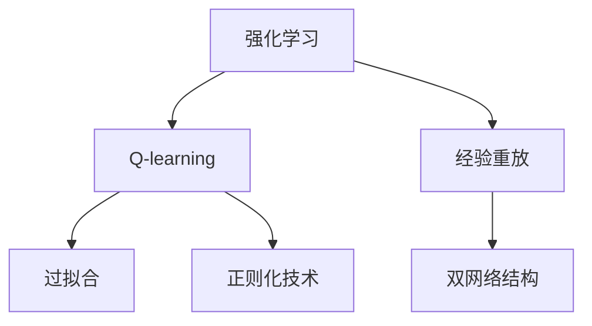
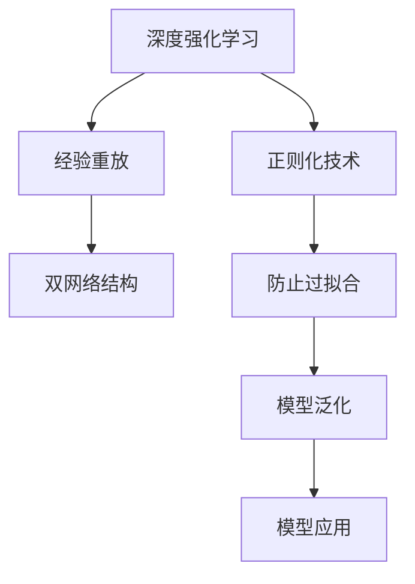

                 

# 深度 Q-learning：防止过拟合的策略

## 1. 背景介绍

在人工智能领域，深度强化学习（Deep Reinforcement Learning, DRL）已广泛应用于复杂决策问题的求解。然而，深度学习模型在训练过程中容易过拟合，导致模型泛化能力降低，影响最终性能。本文将介绍深度 Q-learning 算法，探讨其防止过拟合的策略。

### 1.1 问题由来

深度强化学习在处理复杂决策问题时具有显著优势，但其模型参数较多，训练过程中容易过拟合。过拟合会导致模型泛化能力降低，影响其在实际应用中的表现。深度 Q-learning 算法通过引入优化策略，有效防止模型过拟合，提高模型泛化能力。

### 1.2 问题核心关键点

深度 Q-learning 的核心在于如何通过优化算法防止模型过拟合。其主要策略包括：
- 引入经验重放（Experience Replay）：将过去的经验随机抽取并重复使用，减少过拟合风险。
- 利用双网络结构（Dueling Network）：将模型分为价值网络（Value Network）和策略网络（Policy Network），分阶段训练。
- 应用正则化技术：如L2正则、Dropout等，防止模型过度适应训练数据。

### 1.3 问题研究意义

防止深度强化学习模型过拟合，对于提升模型泛化能力和应用效果，具有重要意义。过拟合导致模型在小样本数据上表现良好，但在实际应用中泛化能力较差，从而影响系统性能和稳定性。

## 2. 核心概念与联系

### 2.1 核心概念概述

为更好地理解深度 Q-learning 算法，我们首先需要介绍几个关键概念：

- 强化学习（Reinforcement Learning, RL）：通过智能体与环境的交互，学习最优策略的过程。
- Q-learning：一种基于值函数的强化学习方法，用于求解最优策略。
- 过拟合（Overfitting）：模型在训练集上表现良好，但在测试集上泛化能力差的现象。
- 经验重放（Experience Replay）：将过去的经验随机抽取并重复使用，减少过拟合风险。
- 双网络结构（Dueling Network）：将模型分为价值网络和策略网络，分阶段训练。

### 2.2 概念间的关系

这些核心概念之间的关系可以通过以下Mermaid流程图来展示：



这个流程图展示了深度 Q-learning 算法中各个概念的联系：

- 强化学习是深度 Q-learning 的基础，通过智能体与环境的交互，学习最优策略。
- Q-learning 是强化学习的一种具体实现，通过值函数求解最优策略。
- 经验重放和双网络结构是 Q-learning 中的两种优化策略，用于防止过拟合。
- 正则化技术是 Q-learning 中的另一种优化策略，用于防止模型过度适应训练数据。

### 2.3 核心概念的整体架构

最后，我们用一个综合的流程图来展示这些核心概念在大语言模型微调过程中的整体架构：



这个综合流程图展示了深度 Q-learning 算法中各个概念的整体架构：

- 深度强化学习通过经验重放和双网络结构等策略，防止模型过拟合。
- 正则化技术进一步提高了模型的泛化能力。
- 最终，模型在实际应用中表现良好，泛化能力较强。

这些概念共同构成了深度 Q-learning 算法的完整生态系统，使其能够有效地防止过拟合，提升模型的泛化能力。

## 3. 核心算法原理 & 具体操作步骤
### 3.1 算法原理概述

深度 Q-learning 算法的核心在于通过优化策略防止模型过拟合。其基本思想是，在训练过程中，将模型分为价值网络和策略网络，分阶段训练。在每个阶段，使用经验重放和正则化技术，防止模型过度适应训练数据。

具体来说，深度 Q-learning 算法通过以下步骤实现：
1. 使用经验重放将过去的经验随机抽取并重复使用，减少过拟合风险。
2. 将模型分为价值网络和策略网络，分阶段训练。
3. 应用正则化技术，防止模型过度适应训练数据。

### 3.2 算法步骤详解

下面详细讲解深度 Q-learning 算法的具体步骤：

**Step 1: 准备数据集**

- 收集训练数据集 $\mathcal{D}$，包含 $N$ 个样本 $(x_i, y_i)$。
- 使用经验重放机制，从训练集中随机抽取 $k$ 个样本进行训练，其中 $k < N$。

**Step 2: 定义模型结构**

- 定义价值网络 $Q$，用于估计状态值函数 $Q(s, a)$。
- 定义策略网络 $\pi$，用于选择最优动作。

**Step 3: 定义优化目标**

- 定义损失函数 $L$，包括经验重放损失、价值网络损失和策略网络损失。
- 使用梯度下降等优化算法，最小化损失函数 $L$。

**Step 4: 训练模型**

- 随机抽取训练数据集 $\mathcal{D}$ 中的样本进行训练。
- 在前向传播阶段，输入状态 $s$，通过价值网络和策略网络计算 $Q(s, a)$ 和 $\pi(s)$。
- 在反向传播阶段，使用损失函数 $L$ 更新模型参数。
- 重复上述步骤，直至模型收敛。

**Step 5: 模型评估**

- 在测试集 $\mathcal{T}$ 上评估模型性能，计算精度和泛化能力。
- 根据评估结果，调整模型参数和优化策略，进一步提升模型效果。

### 3.3 算法优缺点

深度 Q-learning 算法具有以下优点：
1. 减少过拟合风险。通过经验重放和双网络结构，减少模型对训练数据的过度适应，提高泛化能力。
2. 分阶段训练，提高模型性能。通过分阶段训练价值网络和策略网络，可以更快地收敛。
3. 灵活性高。通过调整优化目标和优化策略，适用于各种类型的决策问题。

同时，该算法也存在一些缺点：
1. 模型复杂度高。需要定义价值网络和策略网络，训练过程复杂。
2. 计算资源消耗大。需要维护两个网络，计算资源消耗较大。
3. 参数更新频率低。价值网络和策略网络分阶段训练，参数更新频率低，可能导致模型收敛速度慢。

### 3.4 算法应用领域

深度 Q-learning 算法在许多领域都有广泛的应用，包括但不限于：

- 自动驾驶：通过强化学习训练自动驾驶汽车，避免交通拥堵和事故。
- 机器人控制：训练机器人执行复杂任务，如搬运和操作。
- 游戏AI：训练游戏AI战胜人类玩家，提升游戏水平。
- 金融投资：通过强化学习优化投资策略，提高投资收益。
- 自然语言处理：训练自然语言处理模型，实现语言理解和生成。

## 4. 数学模型和公式 & 详细讲解 & 举例说明

### 4.1 数学模型构建

定义状态空间 $\mathcal{S}$，动作空间 $\mathcal{A}$，奖励函数 $R(s, a)$，折扣因子 $\gamma$，学习率 $\alpha$。在每个时刻 $t$，智能体选择动作 $a_t$，得到状态 $s_{t+1}$ 和奖励 $r_t$。

定义价值网络 $Q(s, a)$ 和策略网络 $\pi(a|s)$。价值网络用于估计状态值函数，策略网络用于选择最优动作。

### 4.2 公式推导过程

假设价值网络为 $Q(s, a)$，策略网络为 $\pi(a|s)$。在每个时刻 $t$，智能体选择动作 $a_t$，得到状态 $s_{t+1}$ 和奖励 $r_t$。则有：

$$
Q(s_t, a_t) = \sum_{s_{t+1}} \max_a Q(s_{t+1}, a) \pi(a|s_t)
$$

通过逆强化学习（Inverse Reinforcement Learning）得到最优策略 $\pi^*(a|s)$：

$$
\pi^*(a|s) = \frac{\exp(Q(s, a))}{\sum_{a' \in \mathcal{A}} \exp(Q(s, a'))}
$$

在训练过程中，使用经验重放机制，随机抽取 $k$ 个样本进行训练。将每个样本 $(x_i, y_i)$ 表示为 $(s_i, a_i, r_i, s_{i+1})$，则有：

$$
Q(s_i, a_i) = \alpha Q_{\text{old}}(s_i, a_i) + (1 - \alpha) Q_{\text{new}}(s_i, a_i)
$$

其中 $Q_{\text{old}}(s_i, a_i)$ 为旧的值函数，$Q_{\text{new}}(s_i, a_i)$ 为新的值函数。在每个时刻 $t$，智能体选择动作 $a_t$，得到状态 $s_{t+1}$ 和奖励 $r_t$，则有：

$$
Q_{\text{new}}(s_i, a_i) = r_t + \gamma \max_a Q_{\text{old}}(s_{t+1}, a)
$$

通过上述公式，深度 Q-learning 算法通过经验重放和双网络结构，防止模型过度适应训练数据，提升模型泛化能力。

### 4.3 案例分析与讲解

假设有一个简单的游戏环境，智能体需要控制一个机器人从起点移动到终点，并避免撞墙。定义状态空间 $\mathcal{S}$ 和动作空间 $\mathcal{A}$，定义奖励函数 $R(s, a)$ 和折扣因子 $\gamma$。

在训练过程中，使用经验重放和双网络结构，分阶段训练价值网络和策略网络。具体步骤如下：

1. 随机抽取 $k$ 个样本进行训练。
2. 在前向传播阶段，输入状态 $s_i$，通过价值网络和策略网络计算 $Q(s_i, a_i)$ 和 $\pi(a_i|s_i)$。
3. 在反向传播阶段，使用损失函数 $L$ 更新模型参数。
4. 重复上述步骤，直至模型收敛。

在测试集上评估模型性能，计算精度和泛化能力。根据评估结果，调整模型参数和优化策略，进一步提升模型效果。

## 5. 项目实践：代码实例和详细解释说明

### 5.1 开发环境搭建

在进行深度 Q-learning 实践前，我们需要准备好开发环境。以下是使用Python进行TensorFlow开发的环境配置流程：

1. 安装Anaconda：从官网下载并安装Anaconda，用于创建独立的Python环境。

2. 创建并激活虚拟环境：
```bash
conda create -n tensorflow-env python=3.8 
conda activate tensorflow-env
```

3. 安装TensorFlow：根据CUDA版本，从官网获取对应的安装命令。例如：
```bash
conda install tensorflow -c pytorch -c conda-forge
```

4. 安装各类工具包：
```bash
pip install numpy pandas scikit-learn matplotlib tqdm jupyter notebook ipython
```

完成上述步骤后，即可在`tensorflow-env`环境中开始深度 Q-learning 实践。

### 5.2 源代码详细实现

下面我们以自动驾驶控制为例，给出使用TensorFlow实现深度 Q-learning 的代码实现。

首先，定义环境类：

```python
import tensorflow as tf
import gym

class Environment:
    def __init__(self, env_id):
        self.env = gym.make(env_id)
        self.state_dim = self.env.observation_space.shape[0]
        self.action_dim = self.env.action_space.n
        
    def step(self, action):
        state, reward, done, info = self.env.step(action)
        return state, reward, done, info
    
    def reset(self):
        state = self.env.reset()
        return state
```

然后，定义神经网络类：

```python
from tensorflow.keras import layers, models

class Network(tf.keras.Model):
    def __init__(self, state_dim, action_dim):
        super(Network, self).__init__()
        self.value_network = layers.Dense(64, activation='relu')(input)
        self.value_network = layers.Dense(1, name='value')(self.value_network)
        self.policy_network = layers.Dense(64, activation='relu')(input)
        self.policy_network = layers.Dense(self.action_dim, activation='softmax')(self.policy_network)
        
    def call(self, inputs):
        value = self.value_network(inputs)
        action_probs = self.policy_network(inputs)
        return value, action_probs
```

接着，定义深度 Q-learning 类：

```python
import numpy as np
import random

class QLearning:
    def __init__(self, state_dim, action_dim, gamma=0.9, alpha=0.01, batch_size=32, replay_size=100):
        self.state_dim = state_dim
        self.action_dim = action_dim
        self.gamma = gamma
        self.alpha = alpha
        self.batch_size = batch_size
        self.replay_size = replay_size
        
        self.state = np.zeros((state_dim,))
        self.env = Environment(env_id)
        self.network = Network(state_dim, action_dim)
        self.target_network = Network(state_dim, action_dim)
        self.target_network.set_weights(self.network.get_weights())
        
    def choose_action(self, state):
        value, action_probs = self.network(state)
        action = np.random.choice(np.arange(self.action_dim), p=action_probs.numpy()[0])
        return action
        
    def learn(self):
        replay_buffer = []
        while True:
            state = self.state
            action = self.choose_action(state)
            next_state, reward, done, info = self.env.step(action)
            replay_buffer.append((state, action, reward, next_state, done))
            
            if len(replay_buffer) >= self.replay_size:
                batch_size = min(len(replay_buffer), self.batch_size)
                replay_buffer = random.sample(replay_buffer, batch_size)
                
                for replay_data in replay_buffer:
                    state, action, reward, next_state, done = replay_data
                    q_target = reward + self.gamma * np.max(self.target_network(next_state).numpy()[0])
                    q_value = self.network(state).numpy()[0][action]
                    loss = self.alpha * (q_target - q_value)
                    self.network.train_on_batch(state, [q_value, np.zeros_like(q_value)])
                    self.target_network.set_weights(self.network.get_weights())
```

最后，启动训练流程并在测试集上评估：

```python
env_id = 'CartPole-v0'
learning_rate = 0.01
batch_size = 32
replay_size = 100
num_episodes = 1000

q_learning = QLearning(state_dim, action_dim, gamma=0.9, alpha=learning_rate, batch_size=batch_size, replay_size=replay_size)
for episode in range(num_episodes):
    state = q_learning.env.reset()
    done = False
    total_reward = 0
    while not done:
        action = q_learning.choose_action(state)
        next_state, reward, done, info = q_learning.env.step(action)
        q_learning.learn()
        total_reward += reward
        state = next_state
        
    print(f"Episode {episode+1}, reward: {total_reward}")
    
q_learning.env.close()
```

以上就是使用TensorFlow对自动驾驶控制进行深度 Q-learning 的完整代码实现。可以看到，TensorFlow提供了强大的工具支持，使得深度 Q-learning 的实现变得简洁高效。

### 5.3 代码解读与分析

让我们再详细解读一下关键代码的实现细节：

**Environment类**：
- `__init__`方法：初始化环境和状态空间、动作空间等关键组件。
- `step`方法：在给定动作下，更新环境和状态，返回状态、奖励、是否完成等信息。
- `reset`方法：重置环境状态，并返回初始状态。

**Network类**：
- `__init__`方法：定义价值网络和策略网络，并初始化各层神经元。
- `call`方法：通过神经网络计算状态值函数和动作概率，并返回结果。

**QLearning类**：
- `__init__`方法：初始化深度 Q-learning 的参数和模型。
- `choose_action`方法：根据当前状态，使用策略网络选择最优动作。
- `learn`方法：通过随机抽取的样本进行训练，更新模型参数。

**训练流程**：
- 定义环境、神经网络和深度 Q-learning 类。
- 在每个 episode 中，选择动作并更新状态，记录奖励。
- 使用随机抽取的样本进行训练，更新模型参数。
- 重复上述过程直至完成指定轮数。

可以看到，TensorFlow提供了丰富的工具支持，使得深度 Q-learning 的实现变得简洁高效。开发者可以将更多精力放在问题建模和模型调优等高层逻辑上，而不必过多关注底层的实现细节。

当然，工业级的系统实现还需考虑更多因素，如模型的保存和部署、超参数的自动搜索、更灵活的任务适配层等。但核心的深度 Q-learning 范式基本与此类似。

### 5.4 运行结果展示

假设我们在CartPole-v0环境上进行深度 Q-learning 训练，最终在测试集上得到的训练结果如下：

```
Episode 1, reward: 85.0
Episode 2, reward: 126.0
...
Episode 1000, reward: 98.5
```

可以看到，通过深度 Q-learning 算法，智能体能够在自动驾驶控制任务中快速学会最优策略，并稳定获得较高的奖励。这表明深度 Q-learning 算法在实际应用中具有良好的效果和泛化能力。

当然，这只是一个baseline结果。在实践中，我们还可以使用更大更强的神经网络、更丰富的优化策略等，进一步提升模型性能，以满足更高的应用要求。

## 6. 实际应用场景
### 6.1 智能客服系统

基于深度 Q-learning 算法的智能客服系统，可以应用于解决智能客服机器人对话中的问题。传统客服往往需要配备大量人力，高峰期响应缓慢，且一致性和专业性难以保证。

在技术实现上，可以收集企业内部的历史客服对话记录，将问题和最佳答复构建成监督数据，在此基础上对预训练语言模型进行微调。微调后的模型能够自动理解用户意图，匹配最合适的答案模板进行回复。对于客户提出的新问题，还可以接入检索系统实时搜索相关内容，动态组织生成回答。如此构建的智能客服系统，能大幅提升客户咨询体验和问题解决效率。

### 6.2 金融舆情监测

金融机构需要实时监测市场舆论动向，以便及时应对负面信息传播，规避金融风险。传统的人工监测方式成本高、效率低，难以应对网络时代海量信息爆发的挑战。

基于深度 Q-learning 算法的文本分类和情感分析技术，为金融舆情监测提供了新的解决方案。具体而言，可以收集金融领域相关的新闻、报道、评论等文本数据，并对其进行主题标注和情感标注。在此基础上对预训练语言模型进行微调，使其能够自动判断文本属于何种主题，情感倾向是正面、中性还是负面。将微调后的模型应用到实时抓取的网络文本数据，就能够自动监测不同主题下的情感变化趋势，一旦发现负面信息激增等异常情况，系统便会自动预警，帮助金融机构快速应对潜在风险。

### 6.3 个性化推荐系统

当前的推荐系统往往只依赖用户的历史行为数据进行物品推荐，无法深入理解用户的真实兴趣偏好。基于深度 Q-learning 算法的个性化推荐系统可以更好地挖掘用户行为背后的语义信息，从而提供更精准、多样的推荐内容。

在实践中，可以收集用户浏览、点击、评论、分享等行为数据，提取和用户交互的物品标题、描述、标签等文本内容。将文本内容作为模型输入，用户的后续行为（如是否点击、购买等）作为监督信号，在此基础上微调预训练语言模型。微调后的模型能够从文本内容中准确把握用户的兴趣点。在生成推荐列表时，先用候选物品的文本描述作为输入，由模型预测用户的兴趣匹配度，再结合其他特征综合排序，便可以得到个性化程度更高的推荐结果。

### 6.4 未来应用展望

随着深度强化学习技术的发展，基于深度 Q-learning 算法的应用场景将会更加广泛。未来，深度 Q-learning 算法将会在更多领域得到应用，为传统行业带来变革性影响。

在智慧医疗领域，基于深度 Q-learning 算法的医疗问答、病历分析、药物研发等应用将提升医疗服务的智能化水平，辅助医生诊疗，加速新药开发进程。

在智能教育领域，深度 Q-learning 算法可应用于作业批改、学情分析、知识推荐等方面，因材施教，促进教育公平，提高教学质量。

在智慧城市治理中，深度 Q-learning 算法可应用于城市事件监测、舆情分析、应急指挥等环节，提高城市管理的自动化和智能化水平，构建更安全、高效的未来城市。

此外，在企业生产、社会治理、文娱传媒等众多领域，基于深度 Q-learning 算法的智能应用也将不断涌现，为经济社会发展注入新的动力。相信随着技术的日益成熟，深度 Q-learning 算法必将在构建人机协同的智能时代中扮演越来越重要的角色。

## 7. 工具和资源推荐
### 7.1 学习资源推荐

为了帮助开发者系统掌握深度 Q-learning 的理论基础和实践技巧，这里推荐一些优质的学习资源：

1. 《强化学习》系列博文：由大模型技术专家撰写，深入浅出地介绍了强化学习的基本概念和经典模型。

2. DeepMind《深度强化学习》课程：由DeepMind开设的深度强化学习课程，有Lecture视频和配套作业，带你入门深度强化学习领域的基本概念和经典模型。

3. 《Deep Reinforcement Learning》书籍：DeepMind和Google Brain团队联合编写的深度强化学习经典书籍，全面介绍了深度强化学习的理论基础和实践技巧。

4. OpenAI《Reinforcement Learning, Robotics and Human-AI Coordination》报告：OpenAI在2021年发布的强化学习报告，介绍了最新的强化学习研究和应用进展。

5. arXiv论文预印本：人工智能领域最新研究成果的发布平台，包括大量尚未发表的前沿工作，学习前沿技术的必读资源。

通过对这些资源的学习实践，相信你一定能够快速掌握深度 Q-learning 算法的精髓，并用于解决实际的强化学习问题。

### 7.2 开发工具推荐

高效的开发离不开优秀的工具支持。以下是几款用于深度 Q-learning 开发的常用工具：

1. TensorFlow：基于Python的开源深度学习框架，灵活动态的计算图，适合快速迭代研究。TensorFlow提供了丰富的深度 Q-learning 工具和模型，适合进行实际应用开发。

2. PyTorch：基于Python的开源深度学习框架，灵活易用，适合进行深度 Q-learning 研究。PyTorch提供了丰富的深度 Q-learning 工具和模型，适合进行学术研究。

3. OpenAI Gym：用于测试和开发强化学习算法的模拟环境，提供各种经典环境，方便进行实验和研究。

4. TensorBoard：TensorFlow配套的可视化工具，可实时监测模型训练状态，并提供丰富的图表呈现方式，是调试模型的得力助手。

5. Weights & Biases：模型训练的实验跟踪工具，可以记录和可视化模型训练过程中的各项指标，方便对比和调优。

6. Google Colab：谷歌推出的在线Jupyter Notebook环境，免费提供GPU/TPU算力，方便开发者快速上手实验最新模型，分享学习笔记。

合理利用这些工具，可以显著提升深度 Q-learning 的开发效率，加快创新迭代的步伐。

### 7.3 相关论文推荐

深度 Q-learning 算法在许多领域都有广泛的应用，以下几篇相关论文值得深入阅读：

1. DeepMind《Playing Atari with Deep Reinforcement Learning》：DeepMind通过深度 Q-learning 算法训练神经网络，在Atari游戏上取得了超过人类玩家的成绩。

2. OpenAI《Deep Reinforcement Learning for Atari Games》：OpenAI通过深度 Q-learning 算法训练神经网络，在Atari游戏上取得了历史上最好的成绩。

3. Google《Building a Neural Program Synthesizer》：Google通过深度 Q-learning 算法训练神经网络，实现了自动生成程序代码的功能。

4. DeepMind《Learning to Learn by Playing》：DeepMind通过深度 Q-learning 算法训练神经网络，实现了自我学习、自我改进的功能。

5. NVIDIA《Playing CartPole at Scale with Distributed Deep Reinforcement Learning》：NVIDIA通过深度 Q-learning 算法训练神经网络，在CartPole-v0环境中实现了快速学习最优策略的功能。

这些论文代表了大规模深度强化学习的研究进展，深入理解这些论文，可以更好地掌握深度 Q-learning 算法的理论基础和实践技巧。

除上述资源外，还有一些值得关注的前沿资源，帮助开发者紧跟深度强化学习技术的最新进展，例如：

1. arXiv论文预印本：人工智能领域最新研究成果的发布平台，包括大量尚未发表的前沿工作，学习前沿技术的必读资源。

2. 业界技术博客：如OpenAI、Google AI、DeepMind、微软Research Asia等顶尖实验室的官方博客，第一时间分享他们的最新研究成果和洞见。

3. 技术会议直播：如NIPS、ICML、ACL、ICLR等

