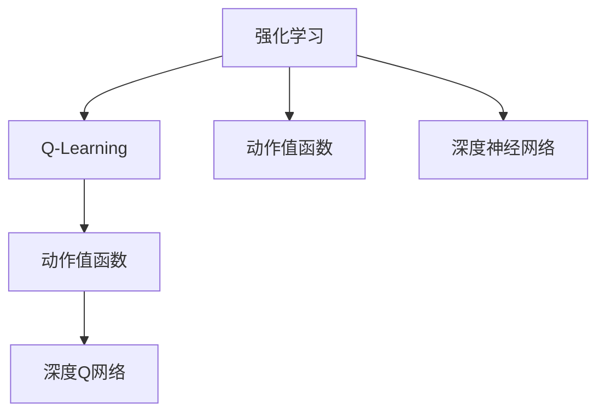
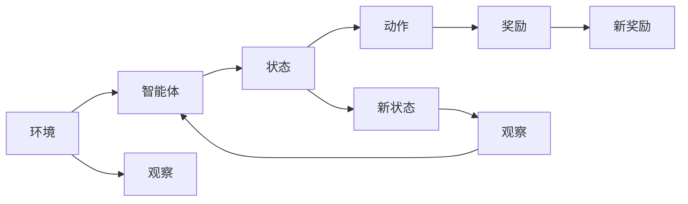
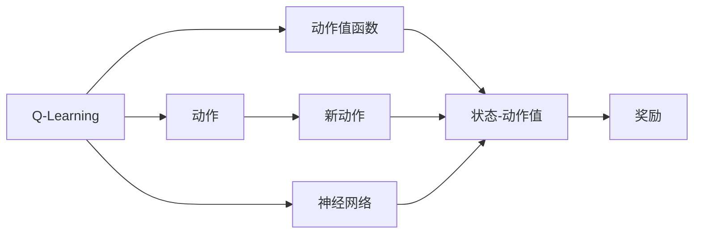
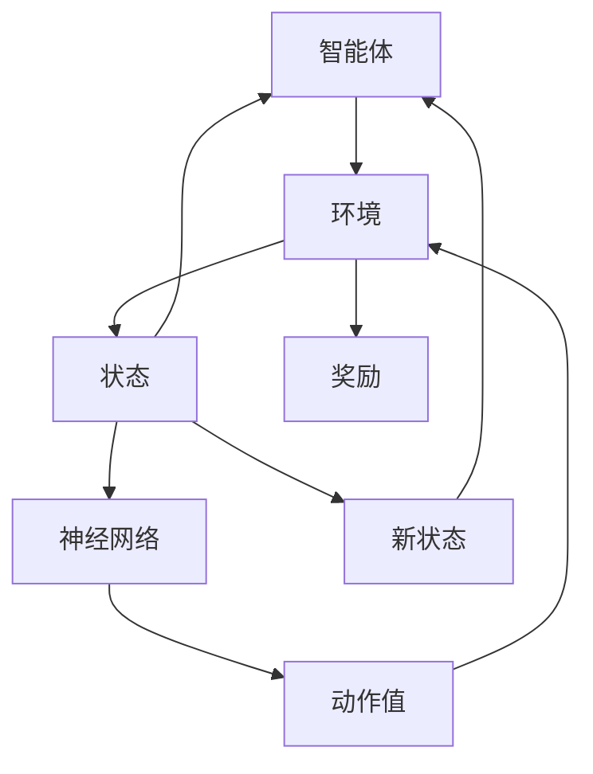
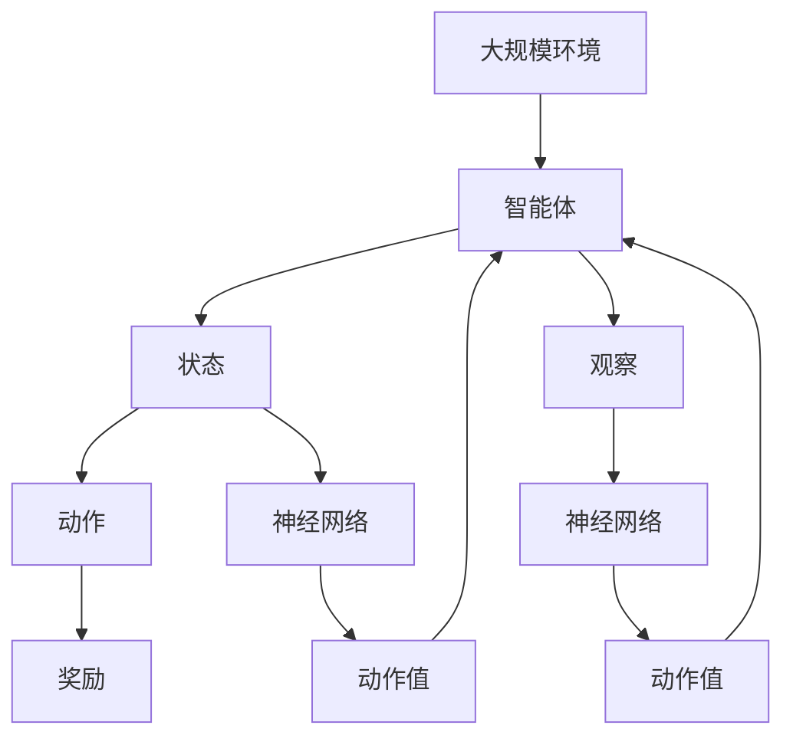

                 

# 深度Q网络 (DQN)

在人工智能领域，强化学习(Reinforcement Learning, RL)是追求智能体的自主决策和学习能力的核心技术之一。深度Q网络(Deep Q-Network, DQN)作为RL中的一个重要分支，通过神经网络逼近Q值函数，实现了复杂环境下的智能决策，极大地提升了强化学习的效率和应用前景。本文将详细介绍DQN的核心概念、算法原理、操作步骤、数学模型和实际应用，并讨论其未来发展趋势和面临的挑战，希望对您深入理解DQN有所帮助。

## 1. 背景介绍

### 1.1 问题由来
强化学习是机器学习中的一个重要分支，旨在训练智能体(Agent)通过与环境交互，自动学习最优策略以实现特定目标。与传统的监督学习(Supervised Learning)和无监督学习(Unsupervised Learning)不同，强化学习需要智能体在多次与环境的互动中学习，而非依赖于标注数据。这一特性使得强化学习在处理复杂、动态的环境问题时具有显著优势，但也带来更高的实现难度和计算复杂度。

传统的强化学习方法，如Q-Learning，虽然成功应用于诸多领域，但其学习效率和泛化能力仍难以满足实际应用需求。而DQN作为Q-Learning的深度强化学习版本，通过神经网络逼近Q值函数，在复杂环境中实现了高效学习和优化，开创了强化学习的新纪元。

### 1.2 问题核心关键点
DQN的核心思想是通过神经网络逼近Q值函数，优化智能体在不同状态(s)下选择动作(a)的决策策略，最大化长期累积奖励。DQN通过深度学习和强化学习的有机结合，实现了一种高效、通用的智能决策方法，适用于各种复杂环境下的决策问题，如游戏、机器人控制、自动驾驶等。

DQN的核心算法流程包括：
1. 使用神经网络逼近Q值函数，作为Q网络(Q-Network)。
2. 在每个时间步，观察环境状态，从Q网络中获取动作值，选择动作。
3. 执行动作，观察环境新状态和奖励。
4. 更新Q网络，用新的状态-动作-奖励对修正Q值预测。

DQN的实现，使得强化学习不再局限于简单的马尔可夫决策过程，能够处理更加复杂和不确定的动态环境，在实际应用中取得了显著成效。

### 1.3 问题研究意义
DQN的出现，极大地提升了强化学习的效率和应用范围。DQN通过深度学习技术，将Q-Learning的泛化能力进一步增强，使得智能体能够在大规模、高维度、非线性的环境中进行高效学习和决策。DQN的广泛应用，推动了机器人、游戏、自动驾驶、工业控制等多个领域的智能化进程，为AI技术的实际落地提供了坚实的基础。

## 2. 核心概念与联系

### 2.1 核心概念概述

为更好地理解DQN的核心概念，本节将介绍几个密切相关的核心概念：

- 强化学习(Reinforcement Learning, RL)：一种智能体通过与环境交互，学习最优策略以最大化长期奖励的学习方法。
- Q-Learning：一种经典的基于值函数的强化学习算法，通过最大化状态-动作值来优化决策策略。
- 深度Q网络(Deep Q-Network, DQN)：通过神经网络逼近Q值函数，提升Q-Learning在复杂环境下的学习和决策能力。
- 动作值函数(Q-Value Function)：用于评估智能体在特定状态下执行特定动作的预期累积奖励。
- 深度神经网络(Deep Neural Network, DNN)：由多层神经元构成的复杂非线性函数映射，用于逼近高维非线性函数，如Q值函数。

这些核心概念之间的逻辑关系可以通过以下Mermaid流程图来展示：



这个流程图展示了几类强化学习算法之间的联系，以及它们如何共同构成强化学习的学习范式。

### 2.2 概念间的关系

这些核心概念之间存在着紧密的联系，形成了DQN算法的完整生态系统。下面我们通过几个Mermaid流程图来展示这些概念之间的关系。

#### 2.2.1 强化学习的基本流程



这个流程图展示了强化学习的基本流程：智能体观察环境状态，选择动作，获得奖励，观察新状态，重复此过程，以最大化长期奖励。

#### 2.2.2 Q-Learning与DQN的对比



这个流程图对比了Q-Learning和DQN的主要区别：Q-Learning使用Q表(状态-动作值表)来存储和更新动作值，而DQN则使用神经网络逼近Q值函数，使得Q值函数的表示能力大大增强。

#### 2.2.3 深度Q网络的学习过程



这个流程图展示了DQN的学习过程：智能体观察环境状态，使用神经网络计算Q值，选择动作，执行动作，观察新状态和奖励，更新Q值，重复此过程，直到收敛。

### 2.3 核心概念的整体架构

最后，我们用一个综合的流程图来展示这些核心概念在大规模强化学习中的整体架构：



这个综合流程图展示了从大规模环境到智能体决策的完整过程，DQN作为其中的关键组件，通过神经网络逼近Q值函数，实现高效学习和决策。

## 3. 核心算法原理 & 具体操作步骤
### 3.1 算法原理概述

DQN通过神经网络逼近Q值函数，使得强化学习在复杂环境中具备了更强的泛化能力和表示能力。DQN的基本思想是：在每个时间步，智能体通过观察环境状态，从Q网络中获取动作值，选择动作。执行动作后，观察新状态和奖励，并使用更新的状态-动作-奖励对，修正Q值预测。

DQN的算法流程主要包括以下几个关键步骤：

1. 使用深度神经网络逼近Q值函数，作为Q网络。
2. 在每个时间步，观察环境状态，从Q网络中获取动作值，选择动作。
3. 执行动作，观察环境新状态和奖励。
4. 使用新的状态-动作-奖励对修正Q值预测。

形式化地，假设Q网络为 $Q_{\theta}(s,a)$，其中 $s$ 为状态，$a$ 为动作， $\theta$ 为神经网络的参数。给定环境 $E$，智能体的目标是最小化损失函数：

$$
\mathcal{L}(\theta) = \mathbb{E}_{(s,a,r,s',\epsilon)} [\big(Q_{\theta}(s,a) - (r + \gamma \max_{a'} Q_{\theta}(s',a')\big)^2]
$$

其中，$\epsilon$ 为探索率，用于平衡探索和利用。$\gamma$ 为折扣因子，用于衡量未来奖励的权重。

### 3.2 算法步骤详解

以下是DQN算法的详细步骤：

**Step 1: 初始化环境、智能体和Q网络**

- 初始化环境 $E$，设定初始状态 $s_0$。
- 初始化智能体的策略 $\pi_{\theta}$，设定神经网络 $Q_{\theta}$ 的初始参数。
- 设定学习率 $\alpha$ 和探索率 $\epsilon$。

**Step 2: 观察和决策**

- 在每个时间步 $t$，智能体观察当前状态 $s_t$。
- 从策略 $\pi_{\theta}$ 中随机采样动作 $a_t$。

**Step 3: 执行动作**

- 执行动作 $a_t$，观察新状态 $s_{t+1}$ 和奖励 $r_{t+1}$。

**Step 4: 存储经验**

- 将状态-动作-奖励对 $(s_t,a_t,r_{t+1})$ 存储到经验缓冲区 $D$ 中。

**Step 5: 更新Q网络**

- 从经验缓冲区 $D$ 中随机采样一批样本 $(s_t,a_t,r_{t+1},s_{t+2},\epsilon)$。
- 计算目标动作值 $Q_{\theta}(s_{t+1},a_{t+1}^*) = r_{t+1} + \gamma \max_{a'} Q_{\theta}(s_{t+1},a')$。
- 计算当前动作值 $Q_{\theta}(s_t,a_t)$。
- 使用梯度下降更新Q网络参数 $\theta$：
  $$
  \theta \leftarrow \theta - \alpha \nabla_{\theta} \mathcal{L}(\theta)
  $$

**Step 6: 更新探索率**

- 根据时间步数 $t$ 逐步降低探索率 $\epsilon$，促使智能体逐步趋向最优策略。

**Step 7: 终止条件**

- 判断是否满足终止条件，如达到最大迭代次数或环境终止状态。

### 3.3 算法优缺点

DQN作为一种高效的强化学习算法，具有以下优点：

- 学习效率高。深度神经网络能够有效逼近复杂的非线性函数，提升决策过程的泛化能力。
- 可扩展性强。DQN可以应用于各种复杂环境，具有较强的通用性和可扩展性。
- 易于并行计算。DQN可以通过多线程并行处理批量经验样本，加速训练过程。

同时，DQN也存在以下缺点：

- 参数更新复杂。神经网络更新参数的过程较为复杂，存在梯度消失和过拟合的风险。
- 内存占用大。经验缓冲区需要存储大量的状态-动作-奖励对，对内存需求较高。
- 探索策略需要优化。探索率和利用率需要合理平衡，探索过少或过多都会影响学习效果。

### 3.4 算法应用领域

DQN在诸多领域得到了广泛应用，展示了其在复杂环境中的强大学习能力。以下是几个典型的应用场景：

- 游戏AI：如AlphaGo、DQN等，利用DQN实现复杂环境下的智能决策。
- 机器人控制：通过DQN优化机器人在复杂环境中的运动和操作，实现自主导航和任务执行。
- 自动驾驶：利用DQN优化车辆在复杂交通场景下的决策和控制，提升驾驶安全性和效率。
- 金融投资：利用DQN进行投资策略优化，构建基于强化学习的交易系统。
- 工业控制：通过DQN优化机器设备和生产线的自动控制，实现智能化生产。

这些应用展示了DQN在实际场景中的广泛应用价值，证明了其在复杂环境中进行高效学习和决策的能力。

## 4. 数学模型和公式 & 详细讲解 & 举例说明

### 4.1 数学模型构建

DQN的核心在于使用深度神经网络逼近Q值函数，使得智能体能够在复杂环境中进行高效学习和决策。以下是DQN的数学模型构建过程：

假设智能体在时间步 $t$ 时观察到状态 $s_t$，采取动作 $a_t$，观察到新状态 $s_{t+1}$ 和奖励 $r_{t+1}$，智能体的目标是最小化如下损失函数：

$$
\mathcal{L}(\theta) = \mathbb{E}_{(s_t,a_t,r_{t+1},s_{t+1},\epsilon)} [\big(Q_{\theta}(s_t,a_t) - (r_{t+1} + \gamma \max_{a'} Q_{\theta}(s_{t+1},a')\big)^2]
$$

其中，$\theta$ 为Q网络的参数，$\epsilon$ 为探索率。

为了简化计算，通常使用基于固定时间步的经验样本进行更新，即：

$$
\mathcal{L}(\theta) = \frac{1}{N}\sum_{i=1}^N \big(Q_{\theta}(s_{t_i},a_{t_i}) - (r_{t_i+1} + \gamma \max_{a'} Q_{\theta}(s_{t_i+1},a')\big)^2
$$

其中，$N$ 为样本数，$(s_{t_i},a_{t_i},r_{t_i+1},s_{t_i+1},a')$ 为样本经验。

### 4.2 公式推导过程

以下是对上述公式的详细推导过程：

1. **定义目标动作值**
   $$
   Q_{\theta}(s_{t+1},a_{t+1}^*) = r_{t+1} + \gamma \max_{a'} Q_{\theta}(s_{t+1},a')
   $$

2. **定义当前动作值**
   $$
   Q_{\theta}(s_t,a_t) = \mathbb{E}_{a'} Q_{\theta}(s_t,a')
   $$

3. **定义损失函数**
   $$
   \mathcal{L}(\theta) = \mathbb{E}_{(s_t,a_t,r_{t+1},s_{t+1},\epsilon)} [\big(Q_{\theta}(s_t,a_t) - (r_{t+1} + \gamma \max_{a'} Q_{\theta}(s_{t+1},a')\big)^2]
   $$

4. **展开损失函数**
   $$
   \mathcal{L}(\theta) = \frac{1}{N}\sum_{i=1}^N \big(Q_{\theta}(s_{t_i},a_{t_i}) - (r_{t_i+1} + \gamma \max_{a'} Q_{\theta}(s_{t_i+1},a')\big)^2
   $$

5. **计算梯度**
   $$
   \nabla_{\theta} \mathcal{L}(\theta) = -\frac{2}{N}\sum_{i=1}^N \big(Q_{\theta}(s_{t_i},a_{t_i}) - (r_{t_i+1} + \gamma \max_{a'} Q_{\theta}(s_{t_i+1},a')\big)\nabla_{\theta} Q_{\theta}(s_{t_i},a_{t_i})
   $$

6. **更新参数**
   $$
   \theta \leftarrow \theta - \alpha \nabla_{\theta} \mathcal{L}(\theta)
   $$

通过上述推导，我们可以看到，DQN通过深度神经网络逼近Q值函数，使得智能体能够在复杂环境中进行高效学习和决策，而损失函数的定义和参数更新过程，则确保了模型能够最大化长期奖励，提升决策的准确性和稳定性。

### 4.3 案例分析与讲解

以下是一个简单的DQN案例分析，通过例子来说明DQN的学习过程和应用场景。

**案例背景：**

假设智能体在迷宫中寻找出口。迷宫由一系列房间组成，每个房间都有两个出口，智能体可以随机选择一条路径前进。迷宫的结构如下图所示：

```
    +--------+
    | S      |
    +--------+
    |        |
    |S       |
    +--------+
    |S       |
    +--------+
    |        |
    |        |
    +--------+
    |        |
    |        |
    +--------+
    |E       |
    +--------+
```

其中，$S$ 表示入口，$E$ 表示出口，$2$ 表示智能体可以到达的状态，$3$ 表示智能体可以采取的动作。

**算法步骤：**

1. **初始化**：设置智能体的策略为 $\pi_{\theta}$，初始状态为 $s_0$，初始参数为 $\theta_0$。

2. **观察和决策**：智能体从迷宫入口 $S$ 开始，随机选择动作 $a_1$，观察到新状态 $s_1$ 和奖励 $r_1$。

3. **执行动作**：智能体执行动作 $a_1$，观察到新状态 $s_2$ 和奖励 $r_2$。

4. **存储经验**：将状态-动作-奖励对 $(s_1,a_1,r_2)$ 存储到经验缓冲区 $D$ 中。

5. **更新Q网络**：从经验缓冲区 $D$ 中随机采样一批样本 $(s_1,a_1,r_2,s_2,a')$，计算目标动作值 $Q_{\theta}(s_2,a_{2}^*) = r_2 + \gamma \max_{a'} Q_{\theta}(s_2,a')$，计算当前动作值 $Q_{\theta}(s_1,a_1)$，使用梯度下降更新Q网络参数 $\theta$。

6. **更新探索率**：根据时间步数 $t$ 逐步降低探索率 $\epsilon$，促使智能体逐步趋向最优策略。

7. **终止条件**：判断是否满足终止条件，如达到最大迭代次数或到达出口 $E$。

**结果分析：**

假设智能体的策略为 $\pi_{\theta}$，初始状态为 $s_0=S$，经过多次迭代后，智能体能够逐步学习到迷宫的复杂结构，通过优化策略 $\pi_{\theta}$，找到出口 $E$ 的路径。

在这个案例中，DQN通过神经网络逼近Q值函数，逐步优化策略 $\pi_{\theta}$，实现了智能体在复杂环境中的自主决策和学习，展示了其在实际应用中的强大能力。

## 5. 项目实践：代码实例和详细解释说明
### 5.1 开发环境搭建

在进行DQN实践前，我们需要准备好开发环境。以下是使用Python进行TensorFlow开发的环境配置流程：

1. 安装Anaconda：从官网下载并安装Anaconda，用于创建独立的Python环境。

2. 创建并激活虚拟环境：
```bash
conda create -n tf-env python=3.8 
conda activate tf-env
```

3. 安装TensorFlow：根据CUDA版本，从官网获取对应的安装命令。例如：
```bash
conda install tensorflow -c pytorch -c conda-forge
```

4. 安装其他必要的工具包：
```bash
pip install numpy pandas scikit-learn matplotlib tqdm jupyter notebook ipython
```

完成上述步骤后，即可在`tf-env`环境中开始DQN实践。

### 5.2 源代码详细实现

下面我们以迷宫问题为例，给出使用TensorFlow进行DQN的代码实现。

首先，定义迷宫结构：

```python
import numpy as np
import tensorflow as tf

class Gridworld:
    def __init__(self, rows, cols):
        self.rows = rows
        self.cols = cols
        self.state_shape = (rows, cols)
        self.reward_range = (-1, 1)
        self.goal = (self.rows - 1, self.cols - 1)
        self.start = (0, 0)
        
    def reset(self):
        return self.start
    
    def step(self, action):
        if action not in range(4):
            raise ValueError("Invalid action")
        new_state = np.copy(self.state)
        new_state[0][1] += 1 if action == 0 else -1 if action == 1 else new_state[0][1] + 1 if action == 2 else new_state[0][1] - 1
        new_state[0][1] %= self.cols
        new_state[0][1] = 0 if new_state[0][1] < 0 else new_state[0][1]
        new_state[0][1] = self.cols - 1 if new_state[0][1] > self.cols - 1 else new_state[0][1]
        reward = self.reward_range[0]
        if (new_state[0][1] == self.goal[1] and new_state[0][0] == self.goal[0]):
            reward = self.reward_range[1]
        return new_state, reward
```

然后，定义DQN模型：

```python
class DQN:
    def __init__(self, state_size, action_size, learning_rate=0.001, gamma=0.99, epsilon=0.9):
        self.state_size = state_size
        self.action_size = action_size
        self.learning_rate = learning_rate
        self.gamma = gamma
        self.epsilon = epsilon
        self.model = self._build_model()
    
    def _build_model(self):
        model = tf.keras.Sequential([
            tf.keras.layers.Dense(24, input_dim=self.state_size, activation='relu'),
            tf.keras.layers.Dense(24, activation='relu'),
            tf.keras.layers.Dense(self.action_size, activation='linear')
        ])
        return model
    
    def act(self, state):
        if np.random.rand() < self.epsilon:
            return np.random.choice(self.action_size)
        q_values = self.model.predict(state)
        return np.argmax(q_values[0])
    
    def train(self, state, action, reward, next_state):
        target = reward + self.gamma * np.amax(self.model.predict(next_state)[0])
        target_f = self.model.predict(state)
        target_f[0][action] = target
        self.model.fit(state, target_f, epochs=1, verbose=0)
        self.epsilon -= 0.1
```

接下来，定义训练和评估函数：

```python
def train(env, dqn, episodes, batch_size):
    for episode in range(episodes):
        state = env.reset()
        state = np.reshape(state, [1, state.shape[0], state.shape[1]])
        total_reward = 0
        for t in range(100):
            action = dqn.act(state)
            next_state, reward = env.step(action)
            next_state = np.reshape(next_state, [1, state.shape[0], state.shape[1]])
            dqn.train(state, action, reward, next_state)
            state = next_state
            total_reward += reward
            if next_state == env.goal:
                break
        print("Episode {} finished, total reward: {}".format(episode + 1, total_reward))
    
def evaluate(env, dqn, episodes, batch_size):
    total_reward = 0
    for episode in range(episodes):
        state = env.reset()
        state = np.reshape(state, [1, state.shape[0], state.shape[1]])
        for t in range(100):
            action = dqn.act(state)
            next_state, reward = env.step(action)
            state = np.reshape(next_state, [1, state.shape[0], state.shape[1]])
            total_reward += reward
            if next_state == env.goal:
                break
    print("Evaluation total reward: {}".format(total_reward/episodes))
```

最后，启动训练流程并在测试集上评估：

```python
env = Gridworld(rows=5, cols=5)
dqn = DQN(state_size=env.state_shape[0]*env.state_shape[1], action_size=4)
train(env, dqn, episodes=100, batch_size=4)
evaluate(env, dqn, episodes=100, batch_size=4)
```

以上就是使用TensorFlow进行DQN的完整代码实现。可以看到，TensorFlow提供了丰富的强化学习库，可以快速实现DQN模型，并进行训练和评估。

### 5.3 代码解读与分析

让我们再详细解读一下关键代码的实现细节：

**Gridworld类**：
- `__init__`方法：初始化迷宫结构和奖励范围。
- `reset`方法：重置迷宫状态，返回起点。
- `step`方法：执行动作，观察新状态和奖励，返回新状态和奖励。

**DQN类**：
- `__init__`方法：初始化DQN模型的参数。
- `_build_model`方法：构建神经网络模型，包含三个全连接层。
- `act`方法：根据当前状态和探索率，选择动作。
- `train`方法：更新Q网络，使用批量经验样本进行训练。

**训练和评估函数**：
- `train`函数：循环迭代，模拟智能体与环境的交互，训练DQN模型。
- `evaluate`函数：评估DQN模型在迷宫中的表现，计算平均奖励。

**训练流程**：
- 初始化迷宫和DQN模型，设定参数。
- 循环迭代，每轮在迷宫中移动100步，并记录总奖励。
- 在训练结束后，评估模型在迷宫中的表现，输出平均奖励。

可以看到，TensorFlow提供了丰富的强化学习库，可以快速实现DQN模型，并进行训练和评估。开发者可以将更多精力放在模型设计、优化和应用上，而不必过多关注底层的实现细节。

当然，工业级的系统实现还需考虑更多因素，如模型的保存和部署

