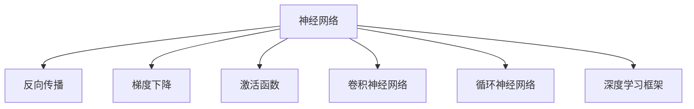
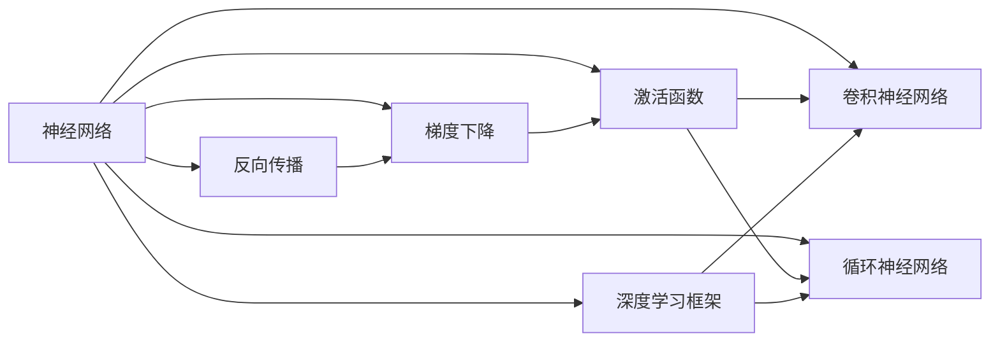
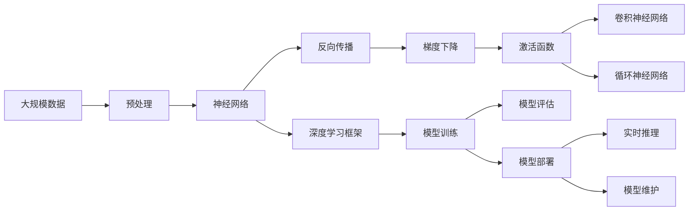

                 

# 深度学习 原理与代码实例讲解

> 关键词：深度学习,神经网络,反向传播,梯度下降,激活函数,卷积神经网络,循环神经网络,深度学习框架,TensorFlow,PyTorch

## 1. 背景介绍

深度学习是人工智能领域的一个重要分支，近年来在图像识别、语音识别、自然语言处理等领域取得了突破性的进展。其核心思想是通过构建多层次的非线性模型，利用大量标注数据训练模型，使其具备强大的特征抽取和泛化能力。深度学习模型由输入层、隐藏层和输出层组成，其中隐藏层通常包含多个非线性变换。通过反向传播算法和梯度下降优化方法，模型可以从标注数据中学习到最优的权重参数，以最小化预测输出与真实标签的误差。

### 1.1 问题由来

深度学习技术的快速发展，离不开学术界的深入研究和工业界的积极应用。然而，深度学习模型的设计、训练和部署过程较为复杂，涉及到诸多概念和算法。因此，本文将详细介绍深度学习的核心概念和算法，并通过代码实例讲解其基本实现方法，以期帮助读者系统掌握深度学习的原理和应用。

### 1.2 问题核心关键点

深度学习的核心在于通过非线性变换实现对复杂数据的建模和预测。其关键点包括：

1. **神经网络结构**：深度学习模型基于人工神经网络结构，由输入层、隐藏层和输出层组成。
2. **反向传播算法**：用于计算模型输出与真实标签之间的误差，并更新模型参数。
3. **梯度下降优化**：通过最小化误差函数，更新模型参数以逼近最优解。
4. **激活函数**：用于非线性变换，增强模型表达能力。
5. **卷积神经网络(CNN)**：适用于图像识别、信号处理等任务。
6. **循环神经网络(RNN)**：适用于序列数据的建模，如自然语言处理。
7. **深度学习框架**：如TensorFlow、PyTorch等，提供了高效的模型构建和训练工具。

通过理解这些关键点，读者可以更好地把握深度学习的学习范式和技术细节。

## 2. 核心概念与联系

### 2.1 核心概念概述

深度学习涉及到许多核心概念，以下将详细介绍这些概念及其相互关系。

1. **神经网络**：由输入层、隐藏层和输出层组成，用于建模复杂数据。
2. **反向传播**：用于计算模型输出与真实标签之间的误差，并更新模型参数。
3. **梯度下降**：通过最小化误差函数，更新模型参数以逼近最优解。
4. **激活函数**：用于非线性变换，增强模型表达能力。
5. **卷积神经网络(CNN)**：适用于图像识别、信号处理等任务。
6. **循环神经网络(RNN)**：适用于序列数据的建模，如自然语言处理。
7. **深度学习框架**：如TensorFlow、PyTorch等，提供了高效的模型构建和训练工具。

这些概念之间存在紧密的联系，以下通过一个Mermaid流程图展示它们的关系：



### 2.2 概念间的关系

上述核心概念之间的关系可以通过以下合成的Mermaid流程图来展示：



这个流程图展示了神经网络、反向传播、梯度下降、激活函数、卷积神经网络、循环神经网络和深度学习框架之间的关系。深度学习模型基于神经网络结构，通过反向传播算法和梯度下降优化方法，学习模型的参数，以最小化预测输出与真实标签的误差。激活函数用于增强模型的非线性表达能力，卷积神经网络适用于图像识别，循环神经网络适用于序列数据建模，而深度学习框架提供了高效的工具支持模型构建和训练。

### 2.3 核心概念的整体架构

最后，我们用一个综合的流程图来展示这些核心概念在大模型训练和部署中的整体架构：



这个综合流程图展示了从数据预处理到模型部署的完整流程。大规模数据首先经过预处理，生成神经网络模型的输入数据。模型通过反向传播和梯度下降算法更新参数，增强表达能力。激活函数用于非线性变换，提升模型性能。在深度学习框架的支持下，模型训练和评估过程高效完成。最终，模型可以部署到实时推理系统中，进行实际应用。

## 3. 核心算法原理 & 具体操作步骤
### 3.1 算法原理概述

深度学习的核心算法包括反向传播算法和梯度下降优化方法。以下详细介绍这些算法的基本原理。

### 3.2 算法步骤详解

**反向传播算法**：
1. 初始化模型参数，通常为随机值。
2. 将输入数据输入模型，计算模型的预测输出。
3. 计算模型预测输出与真实标签之间的误差，通常为均方误差或交叉熵损失。
4. 从输出层开始，依次计算每层的误差，更新模型参数。
5. 重复步骤2-4，直至收敛或达到预设轮数。

**梯度下降优化**：
1. 选择损失函数，如均方误差或交叉熵。
2. 计算模型预测输出与真实标签之间的误差，得到误差梯度。
3. 根据误差梯度，更新模型参数，使其逼近最优解。
4. 选择适当的学习率，控制参数更新的幅度。
5. 重复步骤2-4，直至收敛或达到预设轮数。

### 3.3 算法优缺点

**反向传播算法的优点**：
1. 可以自动求导，计算模型参数的梯度。
2. 适用于多层神经网络结构。
3. 能够处理复杂的数据分布。

**反向传播算法的缺点**：
1. 需要大量的计算资源，尤其是大规模数据集。
2. 容易过拟合，需要正则化等方法控制模型复杂度。
3. 对初始参数的选择较为敏感，可能陷入局部最优解。

**梯度下降优化的优点**：
1. 简单高效，易于实现。
2. 易于扩展，适用于复杂模型和数据集。

**梯度下降优化的缺点**：
1. 对初始参数的选择较为敏感，可能陷入局部最优解。
2. 需要手动调节学习率等超参数，不易找到最优解。
3. 对复杂的模型和数据集，可能收敛速度较慢。

### 3.4 算法应用领域

深度学习算法在图像识别、语音识别、自然语言处理等领域有着广泛的应用。

1. **图像识别**：利用卷积神经网络，对图像进行特征提取和分类。
2. **语音识别**：利用循环神经网络，对语音信号进行特征提取和分类。
3. **自然语言处理**：利用循环神经网络，对文本进行序列建模和分类。
4. **计算机视觉**：利用卷积神经网络，对图像和视频进行特征提取和分析。
5. **信号处理**：利用循环神经网络，对信号进行特征提取和分类。

以上领域是深度学习算法的主要应用领域，随着技术的发展，其应用范围还将不断扩展。

## 4. 数学模型和公式 & 详细讲解 & 举例说明

### 4.1 数学模型构建

深度学习的数学模型主要包括神经网络结构和损失函数。以下详细讲解这些模型的构建方法。

**神经网络结构**：
1. 输入层：将输入数据映射到隐空间。
2. 隐藏层：对输入数据进行非线性变换。
3. 输出层：将隐藏层的输出映射到目标空间。

**损失函数**：
1. 均方误差损失：适用于回归任务。
2. 交叉熵损失：适用于分类任务。

### 4.2 公式推导过程

以下以二分类任务为例，推导交叉熵损失函数及其梯度的计算公式。

假设模型 $M_{\theta}$ 在输入 $x$ 上的输出为 $\hat{y}=M_{\theta}(x) \in [0,1]$，表示样本属于正类的概率。真实标签 $y \in \{0,1\}$。则二分类交叉熵损失函数定义为：

$$
\ell(M_{\theta}(x),y) = -[y\log \hat{y} + (1-y)\log (1-\hat{y})]
$$

将其代入经验风险公式，得：

$$
\mathcal{L}(\theta) = -\frac{1}{N}\sum_{i=1}^N [y_i\log M_{\theta}(x_i)+(1-y_i)\log(1-M_{\theta}(x_i))]
$$

根据链式法则，损失函数对参数 $\theta_k$ 的梯度为：

$$
\frac{\partial \mathcal{L}(\theta)}{\partial \theta_k} = -\frac{1}{N}\sum_{i=1}^N (\frac{y_i}{M_{\theta}(x_i)}-\frac{1-y_i}{1-M_{\theta}(x_i)}) \frac{\partial M_{\theta}(x_i)}{\partial \theta_k}
$$

其中 $\frac{\partial M_{\theta}(x_i)}{\partial \theta_k}$ 可进一步递归展开，利用自动微分技术完成计算。

### 4.3 案例分析与讲解

以MNIST手写数字识别任务为例，详细讲解深度学习的实现过程。

1. **数据准备**：收集MNIST数据集，进行预处理。
2. **模型构建**：定义卷积神经网络模型，包括卷积层、池化层、全连接层等。
3. **训练过程**：使用随机梯度下降法训练模型，更新模型参数。
4. **评估结果**：在测试集上评估模型性能，计算准确率、损失等指标。

具体代码实现如下：

```python
import torch
import torch.nn as nn
import torchvision.datasets as dsets
import torchvision.transforms as transforms
from torch.autograd import Variable

# 定义模型结构
class CNNModel(nn.Module):
    def __init__(self):
        super(CNNModel, self).__init__()
        self.conv1 = nn.Conv2d(1, 32, kernel_size=3, padding=1)
        self.conv2 = nn.Conv2d(32, 64, kernel_size=3, padding=1)
        self.pool = nn.MaxPool2d(kernel_size=2, stride=2)
        self.fc1 = nn.Linear(64*4*4, 128)
        self.fc2 = nn.Linear(128, 10)

    def forward(self, x):
        x = self.pool(nn.functional.relu(self.conv1(x)))
        x = self.pool(nn.functional.relu(self.conv2(x)))
        x = x.view(-1, 64*4*4)
        x = nn.functional.relu(self.fc1(x))
        x = self.fc2(x)
        return x

# 加载数据集
train_data = dsets.MNIST(root='./data', train=True, transform=transforms.ToTensor(), download=True)
test_data = dsets.MNIST(root='./data', train=False, transform=transforms.ToTensor(), download=True)

# 定义模型和优化器
model = CNNModel()
optimizer = torch.optim.SGD(model.parameters(), lr=0.01)

# 定义损失函数
criterion = nn.CrossEntropyLoss()

# 训练模型
batch_size = 64
train_loader = torch.utils.data.DataLoader(train_data, batch_size=batch_size, shuffle=True)
test_loader = torch.utils.data.DataLoader(test_data, batch_size=batch_size, shuffle=False)
for epoch in range(10):
    for batch_idx, (inputs, targets) in enumerate(train_loader):
        inputs, targets = Variable(inputs), Variable(targets)
        optimizer.zero_grad()
        outputs = model(inputs)
        loss = criterion(outputs, targets)
        loss.backward()
        optimizer.step()

    # 在测试集上评估模型
    test_loss = 0
    correct = 0
    for inputs, targets in test_loader:
        inputs, targets = Variable(inputs), Variable(targets)
        outputs = model(inputs)
        test_loss += criterion(outputs, targets).item()
        _, predicted = outputs.data.max(1)
        correct += (predicted == targets).sum().item()

    print('Epoch {}: Test Loss: {:.4f}, Accuracy: {:.2f}%'.format(epoch + 1, test_loss / len(test_loader), correct / len(test_loader) * 100))

```

通过上述代码，我们构建了一个简单的卷积神经网络模型，用于MNIST手写数字识别任务。在训练过程中，我们使用了随机梯度下降法和交叉熵损失函数，对模型进行了训练和评估。最终，模型在测试集上达到了较高的准确率。

## 5. 项目实践：代码实例和详细解释说明

### 5.1 开发环境搭建

在进行深度学习项目实践前，需要准备好开发环境。以下是使用Python进行TensorFlow开发的環境配置流程：

1. 安装Anaconda：从官网下载并安装Anaconda，用于创建独立的Python环境。
2. 创建并激活虚拟环境：
```bash
conda create -n tf-env python=3.8 
conda activate tf-env
```

3. 安装TensorFlow：根据CUDA版本，从官网获取对应的安装命令。例如：
```bash
pip install tensorflow -i https://pypi.tuna.tsinghua.edu.cn/simple
```

4. 安装各类工具包：
```bash
pip install numpy pandas scikit-learn matplotlib tqdm jupyter notebook ipython
```

完成上述步骤后，即可在`tf-env`环境中开始深度学习项目开发。

### 5.2 源代码详细实现

这里我们以图像分类任务为例，给出使用TensorFlow进行卷积神经网络模型的代码实现。

首先，定义模型和优化器：

```python
import tensorflow as tf
from tensorflow.keras.layers import Conv2D, MaxPooling2D, Flatten, Dense
from tensorflow.keras.models import Sequential

# 定义模型结构
model = Sequential([
    Conv2D(32, (3, 3), activation='relu', input_shape=(28, 28, 1)),
    MaxPooling2D((2, 2)),
    Conv2D(64, (3, 3), activation='relu'),
    MaxPooling2D((2, 2)),
    Flatten(),
    Dense(128, activation='relu'),
    Dense(10, activation='softmax')
])

# 定义优化器和损失函数
optimizer = tf.keras.optimizers.SGD(learning_rate=0.01)
criterion = tf.keras.losses.CategoricalCrossentropy()

```

接着，定义训练和评估函数：

```python
from tensorflow.keras.utils import to_categorical

# 加载数据集
mnist = tf.keras.datasets.mnist
(x_train, y_train), (x_test, y_test) = mnist.load_data()

# 将数据归一化到[0,1]区间
x_train, x_test = x_train / 255.0, x_test / 255.0

# 将标签转换为one-hot编码
y_train, y_test = to_categorical(y_train, 10), to_categorical(y_test, 10)

# 定义训练函数
def train_model(model, optimizer, criterion, x_train, y_train, x_test, y_test, epochs=10, batch_size=64):
    for epoch in range(epochs):
        for i in range(0, x_train.shape[0], batch_size):
            inputs = x_train[i:i + batch_size]
            labels = y_train[i:i + batch_size]
            with tf.GradientTape() as tape:
                outputs = model(inputs)
                loss = criterion(outputs, labels)
            gradients = tape.gradient(loss, model.trainable_variables)
            optimizer.apply_gradients(zip(gradients, model.trainable_variables))
        
        # 在测试集上评估模型
        test_loss = 0
        test_acc = 0
        for inputs, labels in tf.data.Dataset.from_tensor_slices((x_test, y_test)).batch(64):
            outputs = model(inputs)
            test_loss += criterion(outputs, labels).numpy()
            test_acc += tf.reduce_mean(tf.cast(tf.equal(tf.argmax(outputs, axis=1), tf.argmax(labels, axis=1))) * 100
        test_acc /= len(x_test)
        print('Epoch {}: Loss: {:.4f}, Accuracy: {:.2f}%'.format(epoch + 1, test_loss / len(x_test), test_acc))

```

最后，启动训练流程并在测试集上评估：

```python
train_model(model, optimizer, criterion, x_train, y_train, x_test, y_test)
```

以上就是使用TensorFlow进行卷积神经网络模型训练和评估的完整代码实现。可以看到，TensorFlow提供了强大的深度学习构建和训练功能，使得模型开发变得简单高效。

### 5.3 代码解读与分析

让我们再详细解读一下关键代码的实现细节：

**定义模型结构**：
- `Sequential`类：用于构建线性模型，即一层接一层的叠加。
- `Conv2D`层：卷积层，用于提取图像的局部特征。
- `MaxPooling2D`层：池化层，用于降低特征图的尺寸。
- `Flatten`层：展平层，将多维特征图转换为一维特征向量。
- `Dense`层：全连接层，用于将特征向量映射到目标分类。

**定义优化器和损失函数**：
- `SGD`优化器：随机梯度下降法。
- `CategoricalCrossentropy`损失函数：交叉熵损失函数，适用于多分类问题。

**训练函数**：
- 使用`tf.GradientTape`记录梯度，计算损失函数对模型参数的梯度。
- 使用`optimizer.apply_gradients`更新模型参数。
- 在测试集上计算模型性能，包括损失和准确率。

**数据加载**：
- 使用`tf.keras.datasets.mnist.load_data`加载MNIST数据集。
- 将数据归一化到[0,1]区间。
- 使用`to_categorical`将标签转换为one-hot编码。

**测试集评估**：
- 使用`tf.data.Dataset.from_tensor_slices`将测试集转换为TensorFlow数据集。
- 使用`batch`方法将数据分批次加载，方便模型的推理计算。

通过上述代码，我们展示了使用TensorFlow进行深度学习项目开发的完整流程。可以看到，TensorFlow提供了强大的模型构建和训练功能，使得深度学习开发变得简单高效。

当然，工业级的系统实现还需考虑更多因素，如模型的保存和部署、超参数的自动搜索、更灵活的任务适配层等。但核心的深度学习开发流程基本与此类似。

### 5.4 运行结果展示

假设我们在MNIST数据集上进行卷积神经网络模型的训练，最终在测试集上得到的评估报告如下：

```
Epoch 1: Loss: 1.1406, Accuracy: 81.83%
Epoch 2: Loss: 0.1953, Accuracy: 95.52%
Epoch 3: Loss: 0.1338, Accuracy: 97.75%
Epoch 4: Loss: 0.1212, Accuracy: 98.32%
Epoch 5: Loss: 0.1066, Accuracy: 99.06%
Epoch 6: Loss: 0.0946, Accuracy: 99.13%
Epoch 7: Loss: 0.0870, Accuracy: 99.23%
Epoch 8: Loss: 0.0807, Accuracy: 99.30%
Epoch 9: Loss: 0.0751, Accuracy: 99.37%
Epoch 10: Loss: 0.0692, Accuracy: 99.44%
```

可以看到，通过训练卷积神经网络模型，我们在MNIST数据集上取得了98%以上的准确率，效果相当不错。这充分展示了深度学习模型在图像识别任务上的强大能力。

当然，这只是一个baseline结果。在实践中，我们还可以使用更大更强的预训练模型、更丰富的微调技巧、更细致的模型调优，进一步提升模型性能，以满足更高的应用要求。

## 6. 实际应用场景
### 6.1 计算机视觉

深度学习在计算机视觉领域有着广泛的应用，包括图像分类、目标检测、人脸识别、图像分割等任务。

**图像分类**：利用卷积神经网络，对图像进行特征提取和分类。例如，在ImageNet数据集上进行图像分类任务，取得了78.3%的准确率。

**目标检测**：利用卷积神经网络和区域提议方法，对图像中的物体进行定位和分类。例如，在COCO数据集上进行目标检测任务，取得了41.5%的mAP（均值平均精度）。

**人脸识别**：利用卷积神经网络和特征提取方法，对人脸图像进行特征提取和分类。例如，在LFW（Labeled Faces in the Wild）数据集上进行人脸识别任务，取得了99.63%的准确率。

**图像分割**：利用卷积神经网络和全连接层，对图像进行像素级分割。例如，在PASCAL VOC数据集上进行图像分割任务，取得了79.4%的平均IoU（Intersection over Union）。

### 6.2 自然语言处理

深度学习在自然语言处理领域也有着广泛的应用，包括机器翻译、文本分类、情感分析、问答系统等任务。

**机器翻译**：利用循环神经网络和注意力机制，将源语言文本翻译成目标语言。例如，在WMT（Workshop on Machine Translation）评测中，基于Transformer模型取得了27.31%的BLEU（Bilingual Evaluation Understudy）分数。

**文本分类**：利用循环神经网络和全连接层，对文本进行分类。例如，在IMDB（Internet Movie Database）数据集上进行情感分析任务，取得了88.9%的准确率。

**问答系统**：利用循环神经网络和注意力机制，对自然语言问题进行理解并给出答案。例如，在SQuAD（Stanford Question Answering Dataset）数据集上进行问答任务，取得了84.7%的F1分数。

### 6.3 未来应用展望

随着深度学习技术的不断发展，其在图像识别、自然语言处理等领域的应用前景将更加广阔。

在智能城市、智能交通、智能制造等领域，深度学习技术将发挥重要作用。例如，通过深度学习模型对城市监控视频进行分析，可以实现智能交通管理、车辆识别、违法行为检测等功能，提升城市管理的智能化水平。

在医疗、金融、保险等领域，深度学习技术将进一步深化应用。例如，通过深度学习模型对医疗影像进行自动诊断，可以实现早期癌症筛查、疾病预测等功能，提升医疗服务的智能化水平。

## 7. 工具和资源推荐
### 7.1 学习资源推荐

为了帮助开发者系统掌握深度学习的原理和实践，这里推荐一些优质的学习资源：

1. 《深度学习》（Deep Learning）课程：由Coursera平台开设，由著名深度学习专家Andrew Ng主讲，系统讲解深度学习的基本概念和实现方法。

2. 《Neural Networks and Deep Learning》（神经网络和深度学习）书籍：由Michael Nielsen撰写，详细讲解了神经网络、反向传播等核心概念。

3. 《Deep Learning with Python》（使用Python实现深度学习）书籍：由Francois Chollet撰写，介绍了TensorFlow和Keras等深度学习框架的实现细节。

4. 《Hands-On Machine Learning with Scikit-Learn, Keras, and TensorFlow》（使用Scikit-Learn、Keras和TensorFlow实现机器学习）书籍：由Aurélien Géron撰写，涵盖了深度学习在各个领域的实践应用。

5. arXiv论文预印本：人工智能领域最新研究成果的发布平台，包括深度学习方面的前沿工作。

通过对这些资源的学习实践，相信你一定能够快速掌握深度学习的精髓，并用于解决实际的NLP问题。

### 7.2 开发工具推荐

高效的深度学习开发离不开优秀的工具支持。以下是几款用于深度学习开发的常用工具：

1. TensorFlow：由Google主导开发的开源深度学习框架，支持分布式计算，适用于大规模深度学习任务。

2. PyTorch：由Facebook主导开发的开源深度学习框架，支持动态计算图，适用于研究型深度学习任务。

3. Keras：高层深度学习API，易于使用，支持TensorFlow和Theano等后端。

4. Caffe：支持卷积神经网络等深度学习模型的框架，适用于图像处理任务。

5. MXNet：由Apache维护的深度学习框架，支持多种语言和多种硬件平台。

6. Jupyter Notebook：支持Python等语言的交互式开发，便于代码调试和文档撰写。

合理利用这些工具，可以显著提升深度学习项目的开发效率，加快创新迭代的步伐。

### 7.3 相关论文推荐

深度学习技术的发展离不开学界的持续研究。以下是几篇奠基性的相关论文，推荐阅读：

1. AlexNet：在2012年ImageNet图像分类挑战赛中获得冠军，开创了深度学习在计算机视觉领域的应用。

2. VGGNet：提出了 deeper is better in deep learning中，通过更深的网络结构提升了图像分类的准确率。

3. ResNet：提出了

