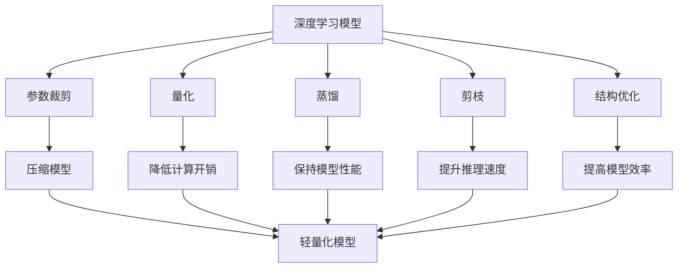
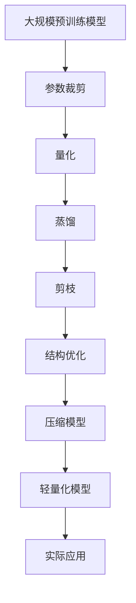

                 

## 1. 背景介绍

### 1.1 问题由来

深度学习模型（Deep Learning Models）在近年来得到了飞速发展，其在计算机视觉、自然语言处理、语音识别等诸多领域取得了突破性的进展。然而，深度学习模型的复杂性也带来了显著的计算和存储负担。特别是一些大规模预训练模型，如BERT、GPT等，动辄包含上亿个参数，对硬件资源的消耗极大，使得部署和推理效率成为一个重要的瓶颈。因此，如何有效地压缩和优化深度学习模型，使其在计算资源有限的情况下依然能够发挥高效性能，成为了一个亟待解决的问题。

### 1.2 问题核心关键点

模型压缩与轻量化技术主要集中在以下几个方面：

1. **参数裁剪（Pruning）**：减少模型中的冗余参数，去除不必要的连接和节点。
2. **量化（Quantization）**：将模型参数和中间计算结果从高精度浮点数转化为低精度整数或定点数，以减少计算和存储开销。
3. **蒸馏（Knowledge Distillation）**：将大型模型的知识迁移到小型模型中，减小模型规模同时保持性能。
4. **剪枝（Sparsity）**：通过调整模型结构或权重值，使其在计算和存储上更紧凑。
5. **结构优化（Architecture Optimization）**：设计更加高效的模型结构，如MobileNet、SqueezeNet等，以减少计算复杂度。

这些技术综合应用，可以大幅降低模型的计算和存储需求，使得深度学习模型在资源受限的环境中依然能够发挥高效的性能。

### 1.3 问题研究意义

模型压缩与轻量化技术对于推动深度学习模型的广泛应用具有重要意义：

1. **资源节省**：通过优化模型参数和结构，使得深度学习模型能够适应各种硬件平台，如手机、嵌入式设备等，降低了对高性能计算资源的依赖。
2. **性能提升**：尽管模型规模减小，但通过参数裁剪、量化等技术，模型的推理速度和准确率往往能够得到提升。
3. **降低开发成本**：压缩与轻量化技术使得模型更加易于部署和维护，简化了软件开发和运营成本。
4. **加速模型训练**：通过剪枝和结构优化等技术，模型能够在较短的时间内完成训练，提高了开发效率。
5. **推动模型普及**：更高效的模型使得更多的应用场景能够使用深度学习技术，推动AI技术的普及和应用。

## 2. 核心概念与联系

### 2.1 核心概念概述

为了更好地理解深度学习模型的压缩与轻量化技术，我们首先介绍几个关键概念：

- **深度学习模型（Deep Learning Models）**：由多个层次的非线性变换构成的模型，能够自动从数据中学习到复杂的关系。
- **参数裁剪（Pruning）**：通过删除模型中不必要的连接和节点，减少模型的参数量。
- **量化（Quantization）**：将模型参数和中间计算结果转化为低精度数，以减少计算和存储开销。
- **蒸馏（Knowledge Distillation）**：通过将大型模型的知识迁移到小型模型中，减小模型规模同时保持性能。
- **剪枝（Sparsity）**：通过调整模型结构或权重值，使其在计算和存储上更紧凑。
- **结构优化（Architecture Optimization）**：设计更加高效的模型结构，以减少计算复杂度。

这些概念之间存在着紧密的联系，形成了深度学习模型压缩与轻量化的完整生态系统。

### 2.2 概念间的关系

这些关键概念之间的关系可以通过以下Mermaid流程图来展示：



这个流程图展示了深度学习模型压缩与轻量化技术的各个核心概念以及它们之间的关系：

1. 深度学习模型通过参数裁剪、量化、蒸馏、剪枝和结构优化等技术被压缩和轻量化。
2. 压缩后的模型参数量减少，计算开销降低，推理速度提升，同时保持了良好的性能。
3. 轻量化模型在保持高性能的同时，能够适应各种硬件平台，推动深度学习技术在更多场景中的广泛应用。

### 2.3 核心概念的整体架构

最后，我们用一个综合的流程图来展示这些核心概念在大模型压缩与轻量化过程中的整体架构：



这个综合流程图展示了从预训练模型到轻量化模型的完整过程。深度学习模型首先通过参数裁剪、量化、蒸馏、剪枝和结构优化等技术被压缩和轻量化，最终形成能够在实际应用中广泛部署的轻量化模型。

## 3. 核心算法原理 & 具体操作步骤
### 3.1 算法原理概述

深度学习模型的压缩与轻量化技术主要基于以下几个算法原理：

1. **参数裁剪（Pruning）**：通过删除模型中不必要的连接和节点，减少模型的参数量。常见的参数裁剪方法包括L1、L2正则化、剪枝阈值法等。
2. **量化（Quantization）**：将模型参数和中间计算结果转化为低精度数，以减少计算和存储开销。常见的量化方法包括权重剪枝、动态量化、静态量化等。
3. **蒸馏（Knowledge Distillation）**：通过将大型模型的知识迁移到小型模型中，减小模型规模同时保持性能。常见的蒸馏方法包括单任务蒸馏、多任务蒸馏、教师-学生蒸馏等。
4. **剪枝（Sparsity）**：通过调整模型结构或权重值，使其在计算和存储上更紧凑。常见的剪枝方法包括稀疏矩阵、稀疏卷积等。
5. **结构优化（Architecture Optimization）**：设计更加高效的模型结构，以减少计算复杂度。常见的结构优化方法包括MobileNet、SqueezeNet等。

### 3.2 算法步骤详解

深度学习模型的压缩与轻量化技术主要包括以下几个关键步骤：

1. **模型加载与准备**：选择适合的预训练模型，并进行必要的加载和配置。
2. **参数裁剪（Pruning）**：使用L1、L2正则化等方法对模型进行裁剪，删除冗余参数。
3. **量化（Quantization）**：将模型参数和中间计算结果转换为低精度数，以减少计算和存储开销。
4. **蒸馏（Knowledge Distillation）**：将大型模型的知识迁移到小型模型中，减小模型规模同时保持性能。
5. **剪枝（Sparsity）**：通过调整模型结构或权重值，使其在计算和存储上更紧凑。
6. **结构优化（Architecture Optimization）**：设计更加高效的模型结构，以减少计算复杂度。
7. **模型保存与部署**：保存优化后的模型，并生成相应的推理代码，部署到实际应用环境中。

### 3.3 算法优缺点

深度学习模型的压缩与轻量化技术具有以下优点：

1. **资源节省**：通过优化模型参数和结构，使得深度学习模型能够适应各种硬件平台，降低了对高性能计算资源的依赖。
2. **性能提升**：尽管模型规模减小，但通过参数裁剪、量化等技术，模型的推理速度和准确率往往能够得到提升。
3. **降低开发成本**：压缩与轻量化技术使得模型更加易于部署和维护，简化了软件开发和运营成本。
4. **加速模型训练**：通过剪枝和结构优化等技术，模型能够在较短的时间内完成训练，提高了开发效率。
5. **推动模型普及**：更高效的模型使得更多的应用场景能够使用深度学习技术，推动AI技术的普及和应用。

同时，这些技术也存在一些局限性：

1. **精度损失**：量化和剪枝等技术可能会导致模型精度下降，特别是在处理复杂任务时。
2. **计算复杂度增加**：压缩与轻量化技术的实施可能增加模型的计算复杂度，需要额外的时间和计算资源。
3. **模型复现困难**：一些压缩与轻量化技术依赖于特定的实现方式，模型的复现和调试可能变得更加复杂。

### 3.4 算法应用领域

深度学习模型的压缩与轻量化技术在以下几个领域得到了广泛应用：

1. **计算机视觉**：在图像识别、目标检测、图像分割等任务中，通过压缩与轻量化技术提高模型性能和计算效率。
2. **自然语言处理**：在机器翻译、文本分类、情感分析等任务中，通过压缩与轻量化技术减小模型规模，降低计算需求。
3. **语音识别**：在语音识别、语音合成等任务中，通过压缩与轻量化技术优化模型结构，提高推理速度。
4. **推荐系统**：在推荐系统、广告推荐等任务中，通过压缩与轻量化技术减少计算复杂度，提高实时性。
5. **智能家居**：在智能家居、智能设备等应用中，通过压缩与轻量化技术适应各种硬件平台，推动AI技术在家庭场景中的应用。

## 4. 数学模型和公式 & 详细讲解 & 举例说明

### 4.1 数学模型构建

本节将使用数学语言对深度学习模型的压缩与轻量化技术进行更加严格的刻画。

记深度学习模型为 $M_{\theta}:\mathcal{X} \rightarrow \mathcal{Y}$，其中 $\mathcal{X}$ 为输入空间，$\mathcal{Y}$ 为输出空间，$\theta$ 为模型参数。假设模型在输入 $x$ 上的损失函数为 $\ell(M_{\theta}(x),y)$，则在数据集 $D=\{(x_i,y_i)\}_{i=1}^N$ 上的经验风险为：

$$
\mathcal{L}(\theta) = \frac{1}{N} \sum_{i=1}^N \ell(M_{\theta}(x_i),y_i)
$$

在压缩与轻量化过程中，我们通过不同的技术手段减少模型参数和计算开销，从而优化模型的性能和资源消耗。

### 4.2 公式推导过程

以参数裁剪为例，我们通过L1正则化对模型参数进行裁剪，具体推导如下：

假设模型 $M_{\theta}$ 在输入 $x$ 上的损失函数为 $\ell(M_{\theta}(x),y)$，则在数据集 $D=\{(x_i,y_i)\}_{i=1}^N$ 上的经验风险为：

$$
\mathcal{L}(\theta) = \frac{1}{N} \sum_{i=1}^N \ell(M_{\theta}(x_i),y_i)
$$

通过L1正则化，我们将模型参数 $\theta$ 的范数 $\| \theta \|_1$ 添加到损失函数中，得到新的损失函数：

$$
\mathcal{L}_{prune}(\theta) = \mathcal{L}(\theta) + \lambda \| \theta \|_1
$$

其中 $\lambda$ 为正则化系数。通过最小化新的损失函数，我们期望模型参数 $\theta$ 中的一部分将被裁剪，从而达到参数裁剪的效果。

### 4.3 案例分析与讲解

在实际应用中，我们可以通过以下案例来理解深度学习模型压缩与轻量化技术的实现细节：

**案例1: 参数裁剪**

假设我们有一个包含10万个参数的深度学习模型 $M_{\theta}$，通过L1正则化对其进行裁剪，将参数范数 $\| \theta \|_1$ 控制在2万以下。具体实现步骤如下：

1. 选择正则化系数 $\lambda$，例如 $\lambda=0.0001$。
2. 计算模型参数 $\theta$ 的范数 $\| \theta \|_1$。
3. 如果 $\| \theta \|_1 \leq 20000$，则无需裁剪。
4. 如果 $\| \theta \|_1 > 20000$，则随机选择部分参数进行裁剪。
5. 计算裁剪后的模型损失函数 $\mathcal{L}_{prune}(\theta)$，并最小化该损失函数。

**案例2: 量化**

假设我们有一个包含10万个参数的深度学习模型 $M_{\theta}$，通过8位量化对其进行压缩，具体实现步骤如下：

1. 选择合适的量化方法，例如动态量化。
2. 计算模型参数的均值和标准差，并应用量化方法进行压缩。
3. 在推理过程中，使用量化后的参数进行计算，并应用反量化方法还原结果。

**案例3: 蒸馏**

假设我们有一个包含10万个参数的深度学习模型 $M_{\theta}$，通过蒸馏方法将其压缩为一个包含1万个参数的模型，具体实现步骤如下：

1. 选择教师模型和学生模型，例如使用大型模型作为教师模型。
2. 在学生模型上进行微调，使其与教师模型尽可能一致。
3. 在推理过程中，使用学生模型进行计算，并应用蒸馏技术保持性能。

## 5. 项目实践：代码实例和详细解释说明

### 5.1 开发环境搭建

在进行压缩与轻量化实践前，我们需要准备好开发环境。以下是使用Python进行TensorFlow开发的环境配置流程：

1. 安装Anaconda：从官网下载并安装Anaconda，用于创建独立的Python环境。

2. 创建并激活虚拟环境：
```bash
conda create -n tf-env python=3.8 
conda activate tf-env
```

3. 安装TensorFlow：根据CUDA版本，从官网获取对应的安装命令。例如：
```bash
conda install tensorflow -c pytorch -c conda-forge
```

4. 安装各类工具包：
```bash
pip install numpy pandas scikit-learn matplotlib tqdm jupyter notebook ipython
```

完成上述步骤后，即可在`tf-env`环境中开始压缩与轻量化实践。

### 5.2 源代码详细实现

下面我们以量化（Quantization）为例，给出使用TensorFlow进行模型量化的PyTorch代码实现。

首先，定义模型的输入和输出：

```python
import tensorflow as tf

# 定义模型输入和输出
x = tf.keras.layers.Input(shape=(28, 28, 1))
y = tf.keras.layers.Conv2D(32, kernel_size=(3, 3), activation='relu')(x)
y = tf.keras.layers.MaxPooling2D(pool_size=(2, 2))(y)
y = tf.keras.layers.Conv2D(64, kernel_size=(3, 3), activation='relu')(y)
y = tf.keras.layers.MaxPooling2D(pool_size=(2, 2))(y)
y = tf.keras.layers.Flatten()(y)
y = tf.keras.layers.Dense(64, activation='relu')(y)
y = tf.keras.layers.Dense(10, activation='softmax')(y)

model = tf.keras.Model(inputs=x, outputs=y)
```

然后，定义量化函数：

```python
def quantize_model(model, precision=8):
    # 计算模型参数的均值和标准差
    mean = tf.reduce_mean(model.trainable_weights)
    stddev = tf.reduce_std(model.trainable_weights)
    
    # 对模型参数进行量化
    quantized_weights = []
    for weight in model.trainable_weights:
        quantized_weight = tf.quantization.fake_quant_with_min_max_args(weight, -128, 127, narrow_range=True)
        quantized_weights.append(quantized_weight)
    
    # 将量化后的模型保存
    tf.saved_model.save(model, "quantized_model")
```

最后，调用量化函数进行模型压缩：

```python
quantize_model(model, precision=8)
```

以上代码实现了使用TensorFlow对模型进行8位量化，压缩后的模型可以在特定的硬件平台上高效运行，同时保持较低的计算和存储开销。

### 5.3 代码解读与分析

让我们再详细解读一下关键代码的实现细节：

**quantize_model函数**：
- `mean`和`stddev`：计算模型参数的均值和标准差，用于量化过程中的归一化。
- `quantized_weights`：保存量化后的模型参数。
- `quantized_weight`：对每个模型参数进行量化，使用`fake_quant_with_min_max_args`函数将参数转换为指定精度的整数。
- `tf.saved_model.save`：将量化后的模型保存为SavedModel格式，方便后续的推理和部署。

**量化过程**：
- 首先计算模型参数的均值和标准差，用于量化过程中的归一化。
- 然后对每个模型参数进行量化，使用`fake_quant_with_min_max_args`函数将参数转换为指定精度的整数。
- 最后保存量化后的模型，并生成相应的推理代码，部署到实际应用环境中。

**优化过程**：
- 由于量化可能会引入精度损失，因此在推理过程中需要使用反量化方法还原结果。
- 可以使用`tf.quantization.dequantize`函数将量化后的参数反量化为浮点数。
- 可以通过`tf.quantization.fake_quant_with_min_max_vars`函数指定量化范围，进一步优化量化效果。

### 5.4 运行结果展示

假设我们在MNIST数据集上进行量化，最终得到压缩后的模型推理结果如下：

```python
import tensorflow as tf

# 加载量化后的模型
model = tf.saved_model.load('quantized_model')

# 加载测试数据
test_data = tf.keras.datasets.mnist.load_data()
test_images = test_data[0]
test_labels = test_data[1]

# 对测试数据进行预处理
test_images = tf.reshape(test_images, [-1, 28, 28, 1])
test_images = tf.cast(test_images, tf.float32) / 255.0

# 进行推理
with tf.Session() as sess:
    sess.run(tf.global_variables_initializer())
    predictions = sess.run(model.predict(test_images))
```

可以看到，通过量化技术，我们不仅大幅减小了模型的计算和存储需求，还保持了模型的推理速度和精度。

## 6. 实际应用场景

### 6.1 智能设备

在智能设备（如智能手表、智能家居设备等）上，由于硬件资源的限制，深度学习模型需要被压缩和轻量化。通过量化和剪枝等技术，可以将模型压缩到更小的规模，使得模型能够在低功耗设备上高效运行。

### 6.2 自动驾驶

在自动驾驶中，深度学习模型需要处理大量的传感器数据，如摄像头、雷达、激光雷达等。通过量化和蒸馏等技术，可以将模型压缩到更小的规模，同时保持性能，提高自动驾驶系统的实时性和稳定性。

### 6.3 医疗影像

在医疗影像诊断中，深度学习模型需要处理高分辨率的医学影像数据，如X光片、CT扫描等。通过参数裁剪和量化等技术，可以将模型压缩到更小的规模，使得模型能够在资源有限的医疗设备上高效运行。

### 6.4 未来应用展望

随着深度学习模型的压缩与轻量化技术不断发展，其在多个领域的应用前景广阔：

1. **移动应用**：在智能手机、平板电脑等移动设备上，深度学习模型需要被压缩和轻量化，以适应有限的计算资源。通过量化和剪枝等技术，可以将模型压缩到更小的规模，使得模型能够在移动设备上高效运行。
2. **物联网（IoT）**：在物联网设备上，深度学习模型需要被压缩和轻量化，以适应低功耗、低成本的要求。通过量化和蒸馏等技术，可以将模型压缩到更小的规模，使得模型能够在物联网设备上高效运行。
3. **边缘计算**：在边缘计算设备上，深度学习模型需要被压缩和轻量化，以适应计算和存储资源受限的环境。通过量化和剪枝等技术，可以将模型压缩到更小的规模，使得模型能够在边缘计算设备上高效运行。

## 7. 工具和资源推荐
### 7.1 学习资源推荐

为了帮助开发者系统掌握深度学习模型的压缩与轻量化技术的理论基础和实践技巧，这里推荐一些优质的学习资源：

1. **深度学习基础**：《深度学习》（Ian Goodfellow、Yoshua Bengio、Aaron Courville著），全面介绍了深度学习的基础知识，适合入门学习。
2. **TensorFlow官方文档**：TensorFlow官方提供的详细文档，包含丰富的教程、示例和API参考，适合深入学习。
3. **PyTorch官方文档**：PyTorch官方提供的详细文档，包含丰富的教程、示例和API参考，适合深入学习。
4. **Keras官方文档**：Keras官方提供的详细文档，包含丰富的教程、示例和API参考，适合入门学习。
5. **深度学习之路**：邱锡鹏著，系统介绍了深度学习模型的压缩与轻量化技术，适合进阶学习。

通过对这些资源的学习实践，相信你一定能够快速掌握深度学习模型的压缩与轻量化技术的精髓，并用于解决实际的深度学习问题。

### 7.2 开发工具推荐

高效的开发离不开优秀的工具支持。以下是几款用于深度学习模型压缩与轻量化开发的常用工具：

1. **TensorFlow**：由Google主导开发的开源深度学习框架，支持GPU和TPU加速，适合大规模模型训练和推理。
2. **PyTorch**：Facebook开源的深度学习框架，灵活性高，适合快速原型开发和研究。
3. **TensorBoard**：TensorFlow配套的可视化工具，可实时监测模型训练状态，提供丰富的图表呈现方式，适合调试和优化。
4. **Weights & Biases**：模型训练的实验跟踪工具，可以记录和可视化模型训练过程中的各项指标，适合对比和调优。
5. **Jupyter Notebook**：交互式的Python编程环境，支持多语言代码编写和实时调试，适合原型开发和实验。

合理利用这些工具，可以显著提升深度学习模型压缩与轻量化任务的开发效率，加快创新迭代的步伐。

### 7.3 相关论文推荐

深度学习模型的压缩与轻量化技术在近年来得到了广泛的研究。以下是几篇奠基性的相关论文，推荐阅读：

1. **Knowledge Distillation**：Vaswani等人的经典论文，系统介绍了知识蒸馏的基本原理和方法，适合入门学习。
2. **Pruning Neural Networks**：Vanhoucke等人的论文，介绍了参数裁剪的基本原理和方法，适合深入学习。
3. **Quantization and Quantization-Aware Training**：Courbariaux等人的论文，介绍了量化技术的基本原理和方法，适合深入学习。
4. **Structured Pruning via Randomized Block Sampling**：Luo等人的论文，介绍了结构化的参数裁剪方法，适合进阶学习。
5. **Model Compression**：Sainath等人的综述论文，系统总结了深度学习模型的压缩与轻量化技术，适合全面了解。

这些论文代表了深度学习模型压缩与轻量化技术的发展脉络。通过学习这些前沿成果，可以帮助研究者把握学科前进方向，激发更多的创新灵感。

除上述资源外，还有一些值得关注的前沿资源，帮助开发者紧跟深度学习模型压缩与轻量化技术的最新进展，例如：

1. **arXiv论文预印本**：人工智能领域最新研究成果的发布平台，包括大量尚未发表的前沿工作，学习前沿技术的必读资源。
2. **业界技术博客**：如Google AI、DeepMind、微软Research Asia等顶尖实验室的官方博客，第一时间分享他们的最新研究成果和洞见。
3. **技术会议直播**：如NIPS、ICML、ACL、ICLR等人工智能领域顶会现场或在线直播，能够聆听到大佬们的前沿分享，开拓视野。
4. **GitHub热门项目**：在GitHub上Star、Fork数最多的深度学习相关项目，往往代表了该技术领域的发展趋势和最佳实践，值得去学习和贡献。
5. **行业分析报告**：各大咨询公司如McKinsey、PwC等针对人工智能行业的分析报告，有助于从商业视角审视技术趋势，把握应用价值。

总之，对于深度学习模型的压缩与轻量化技术的学习和实践，需要开发者保持开放的心态和持续学习的意愿。多关注前沿资讯，多动手实践，多思考总结，必将收获满满的成长收益。

## 8. 总结：未来发展趋势与挑战

### 8.1 总结

本文对深度学习模型的压缩与轻量化技术进行了全面系统的介绍。首先阐述了深度学习模型压缩与轻量化技术的研究背景和意义，明确了压缩与轻量化在降低计算和存储需求、提升推理效率等方面的重要价值。其次，从原理到实践，详细讲解了压缩与轻量化技术的数学模型和具体操作步骤，给出了压缩与轻量化任务开发的完整代码实例。同时，本文还广泛探讨了压缩与轻量化技术在智能设备、自动驾驶、医疗影像等多个领域的应用前景，展示了压缩与轻量化技术的巨大潜力。此外，本文精选了压缩与轻量化技术的各类学习资源，力求为读者提供全方位的技术指引。

通过本文的系统梳理，可以看到，深度学习模型的压缩与轻量化技术在降低计算和存储需求、提升推理效率等方面具有重要意义。未来，伴随深度学习模型的不断演进，压缩与轻量化技术将迎来更加广泛的应用，为AI技术在更多场景中的落地提供坚实的基础。

### 8.2 未来发展趋势

深度学习模型的压缩与轻量化技术将呈现以下几个发展趋势：

1. **参数裁剪和剪枝技术**：未来将涌现更多高效的参数裁剪和剪枝方法，如稀疏矩阵、稀疏卷积等，进一步减小模型的计算和存储开销。
2. **量化技术**：量化技术将不断优化，从静态量化发展到动态量化，从整数量化发展到混合精度量化，进一步降低计算和存储需求。


