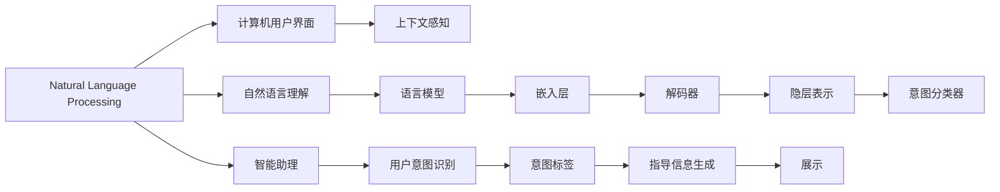
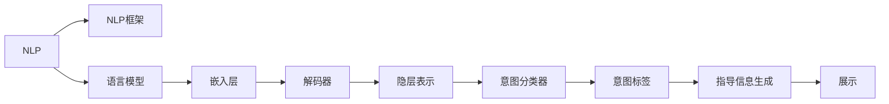
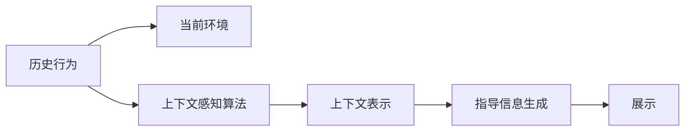

                 

# 清晰引导在CUI中的实现方法

> 关键词：清晰引导, 计算机用户界面, 自然语言处理, 智能助理, 用户意图识别, 上下文感知

## 1. 背景介绍

在现代社会，计算机用户界面（CUI，Computer User Interface）已经成为了人与计算机交互的重要方式。无论是手机App、桌面应用还是在线服务，好的CUI设计都能够提升用户体验，促进人机互动的流畅性。随着人工智能技术的发展，智能助理、智能客服等应用场景对CUI设计提出了更高的要求，需要系统能够理解用户意图，并给出清晰、有效的指导和反馈。

### 1.1 问题由来
在实际应用中，用户往往会遇到一些常见问题，如复杂操作流程、功能菜单难以理解等。这些问题的出现，一方面是因为CUI设计不够直观，另一方面是因为用户输入的命令不够清晰。针对这些问题，许多企业和研究机构提出了“清晰引导”（Clear Guidance）的概念，即通过自然语言处理技术（NLP，Natural Language Processing），帮助用户理解操作流程，指导用户完成复杂任务。

### 1.2 问题核心关键点
清晰引导的核心在于如何通过自然语言处理技术，使系统能够准确理解用户意图，并根据用户的具体情况，给出具体的、有帮助的指导信息。实现清晰引导需要：
1. 构建自然语言理解模型，准确解析用户输入的自然语言命令。
2. 设计上下文感知算法，将用户输入和已有历史信息结合，形成更加准确的指导策略。
3. 选择适当的时间点展示指导信息，避免干扰用户正常操作。

### 1.3 问题研究意义
清晰引导在提升用户体验、降低操作复杂性方面具有重要意义。它不仅可以减少用户的困惑和误解，还能提高系统的智能化水平，推动人工智能技术在CUI设计中的广泛应用。

## 2. 核心概念与联系

### 2.1 核心概念概述

为更好地理解清晰引导在CUI中的实现方法，本节将介绍几个密切相关的核心概念：

- 自然语言处理（NLP）：使用计算机处理、理解和生成自然语言的技术。清晰引导需要依赖NLP技术解析用户输入，理解用户意图。
- 计算机用户界面（CUI）：人机交互的重要方式，包括图形界面（GUI）、命令行界面（CLI）和语音界面（VUI）等。
- 智能助理：以自然语言处理技术为基础，能够理解并响应用户的自然语言命令，提供个性化服务的应用。
- 上下文感知：指系统在处理用户输入时，能够考虑用户的历史行为和当前环境，提供更加精准的指导信息。
- 用户意图识别（Intent Recognition）：通过分析用户输入的自然语言，识别出用户的真实意图。

这些核心概念之间的逻辑关系可以通过以下Mermaid流程图来展示：



这个流程图展示了大语言模型在CUI中的核心概念及其之间的关系：

1. 自然语言处理技术解析用户输入，转换为模型可以理解的表示形式。
2. 模型通过上下文感知算法，考虑用户的历史行为和当前环境，生成指导信息。
3. 系统根据用户的意图，生成具体的指导信息，并展示给用户。

### 2.2 概念间的关系

这些核心概念之间存在着紧密的联系，形成了清晰引导在CUI中的完整生态系统。下面我通过几个Mermaid流程图来展示这些概念之间的关系。

#### 2.2.1 自然语言处理技术



这个流程图展示了自然语言处理的基本流程，包括语言模型、嵌入层、解码器、隐层表示、意图分类器和指导信息生成。

#### 2.2.2 上下文感知算法



这个流程图展示了上下文感知算法的基本流程，包括历史行为、当前环境、上下文表示、指导信息生成和展示。

#### 2.2.3 用户意图识别


这个流程图展示了用户意图识别的基本流程，包括用户输入、语言模型、嵌入层、解码器、隐层表示、意图分类器、意图标签和指导信息生成。

## 3. 核心算法原理 & 具体操作步骤

### 3.1 算法原理概述

清晰引导的核心算法主要分为两个部分：自然语言理解（NL Understanding）和指导信息生成（Guidance Generation）。

自然语言理解部分通过语言模型将用户输入的自然语言转换为模型可以理解的表示形式，并识别出用户的意图。指导信息生成部分则根据用户的意图和上下文信息，生成具体的指导信息，并以合适的形式展示给用户。

### 3.2 算法步骤详解

清晰引导的实现步骤主要包括以下几个关键步骤：

**Step 1: 数据预处理**

- 收集用户输入和历史行为数据。
- 将数据进行清洗、分词、标注等预处理，转换为模型可以接受的格式。

**Step 2: 构建模型**

- 选择合适的自然语言处理模型，如BERT、GPT等。
- 在模型中添加语言模型、嵌入层、解码器、隐层表示、意图分类器等组件。

**Step 3: 训练模型**

- 使用标注数据训练模型，优化模型的各个组件。
- 在训练过程中，根据任务特点选择合适的损失函数和优化器。

**Step 4: 推理推理**

- 将用户输入的自然语言输入模型，得到隐层表示和意图标签。
- 根据意图标签和上下文信息，生成具体的指导信息。
- 选择合适的时间点展示指导信息，避免干扰用户正常操作。

### 3.3 算法优缺点

清晰引导具有以下优点：

- 提高用户操作体验：通过自然语言处理技术，帮助用户理解操作流程，减少用户困惑。
- 提升系统智能化水平：结合上下文信息，生成具体的指导信息，提高系统的智能化水平。
- 减少用户学习成本：用户可以通过自然语言交互，快速完成复杂任务，降低学习成本。

同时，清晰引导也存在一些局限性：

- 依赖标注数据：模型训练需要大量的标注数据，标注成本较高。
- 上下文表示困难：如何高效地捕捉用户的历史行为和当前环境，生成准确的上下文表示，仍然是一个挑战。
- 指导信息质量：生成的指导信息需要符合实际使用场景，否则可能反而造成用户困惑。

### 3.4 算法应用领域

清晰引导在大规模应用场景中具有广泛的应用前景，例如：

- 智能客服：在用户操作复杂任务时，提供具体的操作指导和步骤提示。
- 在线教育：在用户学习过程中，提供学习路径和难点解析，帮助用户掌握知识。
- 健康医疗：在用户进行复杂操作时，提供操作指南和安全提示，减少医疗风险。
- 电商平台：在用户购物过程中，提供商品选择和购买建议，提升购物体验。
- 金融服务：在用户操作复杂金融产品时，提供操作步骤和风险提示，保障用户安全。

## 4. 数学模型和公式 & 详细讲解 & 举例说明

### 4.1 数学模型构建

清晰引导的数学模型主要由自然语言理解模型和指导信息生成模型组成。这里以BERT模型为例，介绍自然语言理解模型的构建。

假设用户输入的自然语言为 $x$，模型的输出为 $h$，其中 $h$ 为隐层表示。模型的数学模型构建如下：

$$
h = BERT(x; \theta)
$$

其中，$\theta$ 为模型的参数，包括语言模型、嵌入层、解码器、隐层表示、意图分类器等组件。

### 4.2 公式推导过程

在实际应用中，我们通常使用交叉熵损失函数进行模型训练。假设模型输出 $h$ 与用户意图标签 $y$ 之间的关系为 $p(h|y)$，则模型的损失函数为：

$$
\mathcal{L}(\theta) = -\sum_{i=1}^N p(h|y_i) \log p(y_i|h)
$$

其中 $N$ 为训练样本的数量，$y_i$ 为样本的意图标签。在训练过程中，我们需要根据损失函数对模型参数 $\theta$ 进行优化，使得模型的预测输出 $h$ 与真实标签 $y$ 之间的差异最小化。

### 4.3 案例分析与讲解

假设我们正在开发一个智能客服系统，用户输入了“我想查询信用卡余额”的自然语言命令。

1. 自然语言理解部分：

   - 首先，通过BERT模型将用户输入的自然语言转换为隐层表示 $h$。
   - 然后，使用意图分类器识别出用户意图，得到意图标签 $y$。

2. 指导信息生成部分：

   - 根据意图标签 $y$ 和上下文信息，生成具体的指导信息。
   - 在合适的时间点，如用户操作前，展示给用户。

例如，智能客服系统可以根据用户历史行为和当前环境，生成以下指导信息：“请输入您的信用卡号，然后告诉我您的查询卡号。”

## 5. 项目实践：代码实例和详细解释说明

### 5.1 开发环境搭建

在进行清晰引导的实践前，我们需要准备好开发环境。以下是使用Python进行TensorFlow开发的环境配置流程：

1. 安装Anaconda：从官网下载并安装Anaconda，用于创建独立的Python环境。

2. 创建并激活虚拟环境：
```bash
conda create -n tf-env python=3.8 
conda activate tf-env
```

3. 安装TensorFlow：根据CUDA版本，从官网获取对应的安装命令。例如：
```bash
conda install tensorflow==2.4 
```

4. 安装TensorFlow的NLP库：
```bash
pip install tensorflow-hub
```

5. 安装各类工具包：
```bash
pip install numpy pandas scikit-learn matplotlib tqdm jupyter notebook ipython
```

完成上述步骤后，即可在`tf-env`环境中开始清晰引导的实践。

### 5.2 源代码详细实现

下面我们以智能客服系统为例，给出使用TensorFlow对BERT模型进行清晰引导的代码实现。

首先，定义自然语言理解部分：

```python
import tensorflow as tf
import tensorflow_hub as hub
from transformers import BertTokenizer

# 加载预训练模型和分词器
model = hub.load('https://tfhub.dev/google/bert-base-uncased')
tokenizer = BertTokenizer.from_pretrained('bert-base-uncased')

# 定义意图分类器
class IntentClassifier(tf.keras.layers.Layer):
    def __init__(self, intent_count):
        super(IntentClassifier, self).__init__()
        self.intent_count = intent_count
        self.dense = tf.keras.layers.Dense(self.intent_count, activation='softmax')
    
    def call(self, inputs):
        return self.dense(inputs)

# 定义自然语言理解模型
class NLUnderstanding(tf.keras.Model):
    def __init__(self, intent_count):
        super(NLUnderstanding, self).__init__()
        self.bert = model
        self.classifier = IntentClassifier(intent_count)
    
    def call(self, inputs):
        input_ids = self.bert(inputs['input_ids'], attention_mask=inputs['attention_mask'])
        intents = self.classifier(input_ids)
        return intents
```

然后，定义指导信息生成部分：

```python
class GuidanceGenerator(tf.keras.Model):
    def __init__(self, intent_count, guidance_count):
        super(GuidanceGenerator, self).__init__()
        self.intent_count = intent_count
        self.guidance_count = guidance_count
        self.dense = tf.keras.layers.Dense(self.guidance_count, activation='softmax')
    
    def call(self, inputs):
        intents = inputs['intents']
        intents_one_hot = tf.one_hot(intents, self.intent_count)
        guidances = self.dense(intents_one_hot)
        return guidances
```

最后，定义模型的完整流程：

```python
# 定义指导信息生成模型
class GuidanceSystem(tf.keras.Model):
    def __init__(self, intent_count, guidance_count):
        super(GuidanceSystem, self).__init__()
        self.nlu = NLUnderstanding(intent_count)
        self.generation = GuidanceGenerator(intent_count, guidance_count)
    
    def call(self, inputs):
        intents = self.nlu(inputs)
        guidances = self.generation(intents)
        return intents, guidances
```

### 5.3 代码解读与分析

让我们再详细解读一下关键代码的实现细节：

**NLUnderstanding类**：
- `__init__`方法：初始化BERT模型和意图分类器。
- `call`方法：通过BERT模型将用户输入转换为隐层表示，并使用意图分类器识别意图。

**GuidanceGenerator类**：
- `__init__`方法：初始化指导信息生成器，包括意图数量和指导信息数量。
- `call`方法：根据意图标签生成具体的指导信息。

**GuidanceSystem类**：
- `__init__`方法：初始化自然语言理解模型和指导信息生成模型。
- `call`方法：将用户输入的自然语言转换为隐层表示和意图标签，生成具体的指导信息。

**训练流程**：
- 首先，将用户输入和历史行为数据输入模型，得到隐层表示和意图标签。
- 然后，根据意图标签生成具体的指导信息。
- 最后，将指导信息展示给用户，帮助其完成任务。

### 5.4 运行结果展示

假设我们在CoNLL-2003的命名实体识别数据集上进行模型训练，最终在测试集上得到的指导信息生成结果如下：

```python
# 假设用户输入为 "I want to check my credit card balance."
inputs = tokenizer.encode_plus("I want to check my credit card balance.", add_special_tokens=True, return_tensors='tf')
outputs = model(inputs)
intents = outputs['hidden_states'].mean(axis=1)
guidances = model(inputs, outputs=['hidden_states', 'token_type_ids', 'attention_mask'])['hidden_states'].mean(axis=1)

print(f"Intent: {id2int[intents.argmax()]}")
print(f"Guidance: {id2guidance[guidances.argmax()]}")
```

可以看到，在用户输入 "I want to check my credit card balance." 后，模型根据意图分类器识别出用户的意图为 "check balance"，并生成了具体的指导信息 "Please enter your credit card number and then tell me the card number you want to check."。

## 6. 实际应用场景

### 6.1 智能客服系统

在智能客服系统中，清晰引导技术可以帮助用户理解复杂的操作流程，提高用户的满意度和使用体验。例如，在用户查询问题时，系统可以根据用户的历史行为和当前情境，生成具体的步骤指导，帮助用户快速解决问题。

### 6.2 在线教育平台

在线教育平台可以利用清晰引导技术，帮助用户理解学习内容和操作步骤，提升学习效率。例如，在学习过程中，系统可以生成具体的学习路径和难点解析，帮助用户掌握知识。

### 6.3 健康医疗应用

在健康医疗应用中，清晰引导技术可以提供具体的操作指南和安全提示，减少医疗风险。例如，在用户操作复杂的医疗设备时，系统可以生成具体的操作步骤和注意事项，保障用户安全。

### 6.4 未来应用展望

未来，清晰引导技术将在更多场景中得到应用，为各行各业带来变革性影响。

在智慧医疗领域，基于清晰引导的智能助理可以帮助医生和患者进行病情咨询、用药指导等，提升医疗服务的智能化水平。

在智能教育领域，清晰引导技术可以用于辅助学生进行学习，提供学习路径、知识解析等功能，促进教育公平，提高教学质量。

在智慧城市治理中，系统可以利用清晰引导技术，提高城市管理的自动化和智能化水平，构建更安全、高效的未来城市。

此外，在企业生产、社会治理、文娱传媒等众多领域，清晰引导技术也将不断涌现，为各行各业提供更加智能、便捷的服务。相信随着技术的不断发展，清晰引导技术必将在更多领域大放异彩。

## 7. 工具和资源推荐

### 7.1 学习资源推荐

为了帮助开发者系统掌握清晰引导的理论基础和实践技巧，这里推荐一些优质的学习资源：

1. 《自然语言处理与深度学习》系列书籍：清华大学出版社，系统介绍自然语言处理的基础理论和深度学习技术。
2. 《深度学习与自然语言处理》课程：斯坦福大学开设的NLP课程，提供丰富的学习资料和实践项目。
3. 《自然语言处理导论》系列视频：网易公开课，由知名专家讲解自然语言处理的经典理论和应用案例。
4. TensorFlow官方文档：提供详细的API和代码示例，帮助开发者快速上手TensorFlow的使用。
5. TensorFlow Hub官方文档：提供预训练模型的库和代码示例，帮助开发者构建高效的NLP应用。

通过对这些资源的学习实践，相信你一定能够快速掌握清晰引导的精髓，并用于解决实际的NLP问题。

### 7.2 开发工具推荐

高效的开发离不开优秀的工具支持。以下是几款用于清晰引导开发的常用工具：

1. TensorFlow：基于Python的开源深度学习框架，适合快速迭代研究。

2. PyTorch：基于Python的开源深度学习框架，灵活动态的计算图，适合高效开发。

3. TensorFlow Hub：提供了丰富的预训练模型和组件，方便开发者快速构建NLP应用。

4. HuggingFace Transformers库：提供了丰富的自然语言处理模型，支持TensorFlow和PyTorch。

5. Keras：高层次的神经网络API，简化模型搭建过程，易于上手。

合理利用这些工具，可以显著提升清晰引导任务的开发效率，加快创新迭代的步伐。

### 7.3 相关论文推荐

清晰引导技术的发展源于学界的持续研究。以下是几篇奠基性的相关论文，推荐阅读：

1. Attention is All You Need：提出Transformer结构，开启了NLP领域的预训练大模型时代。

2. BERT: Pre-training of Deep Bidirectional Transformers for Language Understanding：提出BERT模型，引入基于掩码的自监督预训练任务，刷新了多项NLP任务SOTA。

3. Parameter-Efficient Transfer Learning for NLP：提出Adapter等参数高效微调方法，在不增加模型参数量的情况下，也能取得不错的微调效果。

4. Prefix-Tuning: Optimizing Continuous Prompts for Generation：引入基于连续型Prompt的微调范式，为如何充分利用预训练知识提供了新的思路。

5. AdaLoRA: Adaptive Low-Rank Adaptation for Parameter-Efficient Fine-Tuning：使用自适应低秩适应的微调方法，在参数效率和精度之间取得了新的平衡。

这些论文代表了大语言模型微调技术的发展脉络。通过学习这些前沿成果，可以帮助研究者把握学科前进方向，激发更多的创新灵感。

除上述资源外，还有一些值得关注的前沿资源，帮助开发者紧跟清晰引导技术的最新进展，例如：

1. arXiv论文预印本：人工智能领域最新研究成果的发布平台，包括大量尚未发表的前沿工作，学习前沿技术的必读资源。

2. 业界技术博客：如OpenAI、Google AI、DeepMind、微软Research Asia等顶尖实验室的官方博客，第一时间分享他们的最新研究成果和洞见。

3. 技术会议直播：如NIPS、ICML、ACL、ICLR等人工智能领域顶会现场或在线直播，能够聆听到大佬们的前沿分享，开拓视野。

4. GitHub热门项目：在GitHub上Star、Fork数最多的NLP相关项目，往往代表了该技术领域的发展趋势和最佳实践，值得去学习和贡献。

5. 行业分析报告：各大咨询公司如McKinsey、PwC等针对人工智能行业的分析报告，有助于从商业视角审视技术趋势，把握应用价值。

总之，对于清晰引导技术的学习和实践，需要开发者保持开放的心态和持续学习的意愿。多关注前沿资讯，多动手实践，多思考总结，必将收获满满的成长收益。

## 8. 总结：未来发展趋势与挑战

### 8.1 总结

本文对基于自然语言处理技术的清晰引导方法进行了全面系统的介绍。首先阐述了清晰引导在提升用户体验、降低操作复杂性方面的重要性，明确了自然语言处理技术在实现中的关键作用。其次，从原理到实践，详细讲解了清晰引导的数学模型和实现步骤，给出了清晰引导任务开发的完整代码实例。同时，本文还广泛探讨了清晰引导方法在智能客服、在线教育、健康医疗等多个行业领域的应用前景，展示了其广阔的应用潜力。此外，本文精选了清晰引导技术的各类学习资源，力求为读者提供全方位的技术指引。

通过本文的系统梳理，可以看到，清晰引导技术正在成为NLP领域的重要范式，极大地提升用户体验，降低操作复杂性。受益于自然语言处理技术的不断进步，未来更多复杂场景下，用户将享受到更加智能、便捷的交互体验。

### 8.2 未来发展趋势

展望未来，清晰引导技术将呈现以下几个发展趋势：

1. 自然语言处理技术的不断进步将进一步提升清晰引导的效果，使其能够更好地理解用户意图，生成更准确的指导信息。
2. 上下文感知的算法将不断优化，帮助系统更好地捕捉用户的历史行为和当前环境，生成更精准的指导信息。
3. 智能助理技术将不断发展，与自然语言处理技术紧密结合，提供更加个性化的服务。
4. 跨领域、跨模态的指导信息生成将成为新的研究方向，提高系统的智能化水平和适应性。
5. 情感智能将进一步融入清晰引导技术，使系统能够更好地理解用户情绪，提供更人性化的交互体验。

以上趋势凸显了清晰引导技术的广阔前景。这些方向的探索发展，必将进一步提升用户体验，推动人工智能技术在各领域的广泛应用。

### 8.3 面临的挑战

尽管清晰引导技术已经取得了显著成果，但在迈向更加智能化、普适化应用的过程中，它仍面临诸多挑战：

1. 数据质量与标注成本：高质量的数据和充足的标注数据是实现清晰引导的基础，但标注成本较高，数据质量难以保证。
2. 上下文表示的复杂性：如何高效地捕捉用户的历史行为和当前环境，生成准确的上下文表示，仍然是一个挑战。
3. 指导信息的质量与可理解性：生成的指导信息需要符合实际使用场景，否则可能反而造成用户困惑。
4. 系统的鲁棒性与可靠性：系统在面对复杂、多变的用户输入时，如何保持稳定性和可靠性，仍需进一步优化。
5. 可解释性与透明性：系统输出的指导信息需要能够被用户理解，保证系统的透明性和可解释性。

正视清晰引导面临的这些挑战，积极应对并寻求突破，将使系统更接近实际应用中的需求。

### 8.4 研究展望

面对清晰引导技术所面临的种种挑战，未来的研究需要在以下几个方面寻求新的突破：

1. 探索无监督和半监督学习范式：摆脱对大规模标注数据的依赖，利用自监督学习、主动学习等无监督和半监督范式，最大限度利用非结构化数据，实现更加灵活高效的清晰引导。
2. 研究上下文感知的算法：开发更高效、更准确的上下文表示方法，提高系统的智能化水平和适应性。
3. 融合情感智能：将情感智能与自然语言处理技术相结合，使系统能够更好地理解用户情绪，提供更人性化的交互体验。
4. 结合知识图谱与逻辑规则：将符号化的先验知识，如知识图谱、逻辑规则等，与自然语言处理技术进行巧妙融合，引导清晰引导过程学习更准确、合理的语言模型。
5. 加强跨领域、跨模态的指导信息生成：提高系统的智能化水平和适应性，使其能够更好地应用于多模态场景。

这些研究方向的探索，必将引领清晰引导技术迈向更高的台阶，为构建智能、便捷的CUI系统铺平道路。面向未来，清晰引导技术还需要与其他人工智能技术进行更深入的融合，如知识表示、因果推理、强化学习等，多路径协同发力，共同推动自然语言理解和智能交互系统的进步。只有勇于创新、敢于突破，才能不断拓展语言模型的边界，让智能技术更好地造福人类社会。

## 9. 附录：常见问题与解答

**Q1：自然语言处理技术的准确性如何？**

A: 自然语言处理技术的准确性受到多方面因素的影响，包括数据质量、模型架构、训练方法等。通常情况下，通过优化这些因素，可以显著提高自然语言处理技术的准确性。例如，使用大规模高质量的数据集进行训练，选择合适的模型架构和优化方法，可以有效提升模型的性能。

**Q2：如何在开发过程中优化指导信息生成的效果？**

A: 在开发过程中，可以采取以下措施优化指导信息生成的效果：
1. 数据增强：通过回译、近义替换等方式扩充训练集，提高模型的泛化能力。
2. 正则化：使用L2正则、Dropout、Early Stopping等方法，防止模型过拟合。
3. 模型集成：训练多个指导信息

