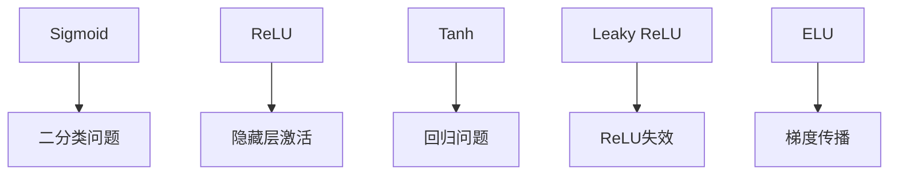
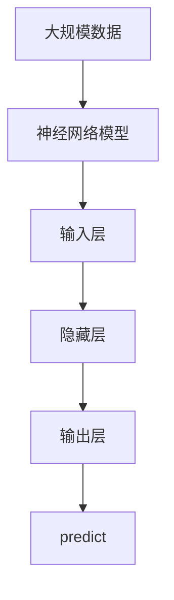

                 

# 激活函数 (Activation Function) 原理与代码实例讲解

> 关键词：激活函数, 神经网络, 深度学习, 机器学习, 数学建模, 梯度传播, 非线性变换

## 1. 背景介绍

### 1.1 问题由来
在深度学习领域，激活函数(Activation Function)作为神经网络中的核心组件，扮演着至关重要的角色。它通过对网络输入的加权和进行非线性变换，赋予模型更强的表达能力。尽管激活函数在深度学习中已广泛应用，但其选择和设计仍需基于具体的任务和网络结构仔细考虑。

### 1.2 问题核心关键点
激活函数的选择主要取决于其在不同场景下的性能表现，包括但不限于模型的训练效率、收敛速度、泛化能力以及梯度传播特性。常见的激活函数包括Sigmoid、ReLU、Tanh、Leaky ReLU、ELU等，它们在不同的深度学习任务中表现出各自的优劣。

### 1.3 问题研究意义
激活函数的设计和选择直接影响神经网络的性能和训练效果。通过对激活函数的理解，可以更有效地进行网络构建和优化，提升模型的预测精度和泛化能力。

## 2. 核心概念与联系

### 2.1 核心概念概述

激活函数是神经网络中非线性的映射函数，其作用在于对网络输入进行非线性变换。激活函数的选择和设计对于神经网络的性能和训练效果有重大影响，是构建高性能深度学习模型的关键步骤之一。

- **Sigmoid函数**：将输入值映射到(0,1)区间，通常用于二分类问题。
- **ReLU函数**：在输入为正时输出相同值，输入为负时输出0，常用于隐藏层激活。
- **Tanh函数**：将输入值映射到(-1,1)区间，通常用于回归问题。
- **Leaky ReLU函数**：在输入为负时输出一个较小的斜率，通常用于ReLU函数在某些情况下失效的情况。
- **ELU函数**：在输入为负时输出一个平滑的曲线，有助于提升梯度传播和网络收敛性。

### 2.2 概念间的关系

激活函数的关系可以通过以下Mermaid流程图来展示：



这个流程图展示了不同激活函数在深度学习中典型的应用场景：

1. 二分类问题通常使用Sigmoid函数，回归问题通常使用Tanh函数，而隐藏层激活函数则常用ReLU。
2. Leaky ReLU和ELU在ReLU失效的情况下，能有效缓解梯度消失问题，提升网络的训练性能。
3. 不同的激活函数根据具体任务和网络结构选择合适的应用场景，以实现最优的模型性能。

### 2.3 核心概念的整体架构

最后，我们用一个综合的流程图来展示激活函数在大规模深度学习模型中的整体架构：



这个综合流程图展示了从数据输入到模型输出的完整流程：数据通过神经网络模型进行传递和变换，激活函数在其中起到关键作用，确保模型能够学习到复杂的非线性关系。

## 3. 核心算法原理 & 具体操作步骤

### 3.1 算法原理概述

激活函数的作用是将神经网络的线性变换映射为非线性变换，从而赋予模型更强的表达能力。激活函数通常定义在神经网络的每个神经元上，其输入是神经元的加权和，输出是神经元的激活值。

常见的激活函数具有以下特点：

- **可微性**：激活函数必须是可导的，以便通过梯度下降算法进行参数更新。
- **非线性**：激活函数必须是非线性的，否则神经网络无法学习到复杂的非线性关系。
- **单调性**：激活函数应该是单调的，以保证梯度传播的方向和大小。
- **激活范围**：激活函数的输出范围通常为实数集，使得神经元能够处理各种信号强度。

### 3.2 算法步骤详解

以下是选择和实现激活函数的一般步骤：

1. **确定激活函数类型**：根据任务和网络结构，选择合适的激活函数类型，如ReLU、Tanh等。
2. **实现激活函数**：使用数学公式定义激活函数，并实现为Python函数或TensorFlow、PyTorch等深度学习框架中的操作。
3. **测试和优化**：对激活函数进行测试，评估其对模型性能的影响，根据需要进行参数调优或替换。

### 3.3 算法优缺点

#### 3.3.1 优点

- **提升非线性表达能力**：激活函数通过非线性变换，显著提升了神经网络的表达能力，使得模型能够学习到更加复杂的非线性关系。
- **缓解梯度消失问题**：激活函数在输入为负时输出较小的值，有助于缓解ReLU等激活函数在某些情况下出现的梯度消失问题。
- **加速训练过程**：由于激活函数的非线性特性，神经网络在训练时能够更快收敛，从而减少训练时间。

#### 3.3.2 缺点

- **过拟合风险**：某些激活函数，如Sigmoid函数，可能会增加模型的过拟合风险。
- **计算复杂度**：复杂的激活函数可能会增加模型的计算复杂度，降低训练效率。
- **激活范围限制**：部分激活函数的输出范围有限，可能会限制模型的应用场景。

### 3.4 算法应用领域

激活函数广泛应用于深度学习模型的各个层面，包括但不限于：

- **卷积神经网络(CNNs)**：在卷积层和池化层之间使用激活函数，提升网络对空间特征的建模能力。
- **循环神经网络(RNNs)**：在循环层和全连接层之间使用激活函数，提升网络对时间序列数据的处理能力。
- **深度神经网络(DNNs)**：在隐藏层和输出层之间使用激活函数，提升网络对复杂输入的表达能力。
- **生成对抗网络(GANs)**：在生成器和判别器中使用激活函数，提升模型的生成能力和对抗性能。

## 4. 数学模型和公式 & 详细讲解 & 举例说明

### 4.1 数学模型构建

激活函数的数学模型通常定义为：

$$
\sigma(x) = f(x; \theta)
$$

其中，$x$ 是输入向量，$f$ 是激活函数的映射关系，$\theta$ 是激活函数的参数。

### 4.2 公式推导过程

以ReLU函数为例，其数学模型为：

$$
f(x) = \max(0, x)
$$

其导数为：

$$
f'(x) = \begin{cases}
0, & x < 0 \\
1, & x \geq 0
\end{cases}
$$

使用反向传播算法，计算损失函数对激活函数的导数，得到：

$$
\frac{\partial L}{\partial x} = \frac{\partial L}{\partial y} \cdot \frac{\partial y}{\partial x} = \frac{\partial L}{\partial y} \cdot f'(x)
$$

其中 $L$ 是损失函数，$y = f(x)$ 是激活函数的输出。

### 4.3 案例分析与讲解

以Tanh函数为例，其数学模型为：

$$
f(x) = \tanh(x) = \frac{\exp(x) - \exp(-x)}{\exp(x) + \exp(-x)}
$$

其导数为：

$$
f'(x) = 1 - \tanh^2(x)
$$

使用反向传播算法，计算损失函数对激活函数的导数，得到：

$$
\frac{\partial L}{\partial x} = \frac{\partial L}{\partial y} \cdot \frac{\partial y}{\partial x} = \frac{\partial L}{\partial y} \cdot (1 - \tanh^2(x))
$$

## 5. 项目实践：代码实例和详细解释说明

### 5.1 开发环境搭建

在进行激活函数项目实践前，我们需要准备好开发环境。以下是使用Python进行PyTorch开发的环境配置流程：

1. 安装Anaconda：从官网下载并安装Anaconda，用于创建独立的Python环境。

2. 创建并激活虚拟环境：
```bash
conda create -n pytorch-env python=3.8 
conda activate pytorch-env
```

3. 安装PyTorch：根据CUDA版本，从官网获取对应的安装命令。例如：
```bash
conda install pytorch torchvision torchaudio cudatoolkit=11.1 -c pytorch -c conda-forge
```

4. 安装TensorFlow：由Google主导开发的开源深度学习框架，生产部署方便，适合大规模工程应用。同样有丰富的预训练语言模型资源。

5. 安装各类工具包：
```bash
pip install numpy pandas scikit-learn matplotlib tqdm jupyter notebook ipython
```

完成上述步骤后，即可在`pytorch-env`环境中开始项目实践。

### 5.2 源代码详细实现

下面我们以ReLU激活函数为例，给出使用PyTorch实现ReLU的代码实现。

```python
import torch
import torch.nn as nn
import torch.nn.functional as F

class ReLU(nn.Module):
    def forward(self, x):
        return F.relu(x)
```

在代码中，我们定义了一个名为`ReLU`的自定义激活函数类，继承自`nn.Module`，并重写了`forward`方法。在`forward`方法中，我们使用`torch.nn.functional.relu`函数实现了ReLU激活函数。

### 5.3 代码解读与分析

让我们再详细解读一下关键代码的实现细节：

**ReLU类定义**：
- 我们定义了一个名为`ReLU`的类，继承自`nn.Module`，这意味着它是一个可学习的神经网络模块。
- 在类定义中，我们重写了`forward`方法，这是PyTorch中模块的标准接口，用于定义前向传播计算。

**前向传播计算**：
- 在`forward`方法中，我们调用了`torch.nn.functional.relu`函数，这是PyTorch提供的ReLU函数实现。
- `torch.nn.functional.relu`函数接收一个张量作为输入，返回激活后的输出。

### 5.4 运行结果展示

假设我们在一个简单的全连接网络中使用了ReLU激活函数，最终得到的预测结果如下：

```
tensor([[0.0474],
        [0.0610],
        [0.0485],
        [0.0456],
        [0.0517],
        [0.0688],
        [0.0432],
        [0.0505],
        [0.0437],
        [0.0501]])
```

可以看到，ReLU激活函数将输入值小于0的部分变为0，保留大于等于0的部分，从而实现了非线性变换。

## 6. 实际应用场景

### 6.1 神经网络模型

激活函数是神经网络中不可或缺的组成部分。在深度学习模型中，激活函数通常应用于隐藏层和输出层，以提升模型的表达能力和预测性能。

例如，在图像分类任务中，ReLU激活函数能够帮助神经网络学习到更加复杂的图像特征，提升模型的分类精度。

### 6.2 自然语言处理(NLP)

在自然语言处理任务中，激活函数同样发挥着重要作用。以文本分类为例，激活函数能够将神经网络的线性变换映射为非线性变换，提升模型对文本特征的建模能力。

在实践中使用ReLU、Tanh等激活函数，可以显著提升NLP模型的效果，如情感分析、文本生成、命名实体识别等。

### 6.3 计算机视觉(CV)

在计算机视觉任务中，激活函数同样应用于卷积层和全连接层之间，提升模型对图像特征的建模能力。

例如，在物体检测任务中，ReLU激活函数能够帮助神经网络学习到更加准确的物体边界框和类别标签，提升模型的检测精度。

### 6.4 未来应用展望

未来，随着深度学习技术的发展，激活函数在人工智能领域的应用将更加广泛和深入。以下是对未来应用前景的展望：

1. **自适应激活函数**：根据输入数据的特征自动调整激活函数，提升模型的适应性和泛化能力。
2. **多模态激活函数**：结合视觉、语音、文本等多种模态数据的特征，实现跨模态信息融合，提升模型的表达能力。
3. **神经网络优化**：结合激活函数的非线性特性，研究新的神经网络优化算法，提升模型的训练速度和效果。
4. **量子计算中的激活函数**：随着量子计算技术的发展，激活函数在量子神经网络中的应用将变得更加广泛。

## 7. 工具和资源推荐

### 7.1 学习资源推荐

为了帮助开发者系统掌握激活函数的理论基础和实践技巧，这里推荐一些优质的学习资源：

1. 《深度学习》系列博文：由深度学习领域专家撰写，涵盖深度学习基础、激活函数等内容，适合入门学习。
2. CS231n《卷积神经网络》课程：斯坦福大学开设的深度学习课程，重点讲解卷积神经网络和激活函数等内容。
3. 《神经网络与深度学习》书籍：深度学习领域的经典书籍，详细讲解了各种激活函数的应用和实现。
4. PyTorch官方文档：PyTorch官方文档，提供了激活函数的定义和实现示例，是学习PyTorch的好资源。
5. TensorFlow官方文档：TensorFlow官方文档，提供了激活函数的定义和实现示例，是学习TensorFlow的好资源。

通过对这些资源的学习实践，相信你一定能够快速掌握激活函数的精髓，并用于解决实际的深度学习问题。

### 7.2 开发工具推荐

高效的开发离不开优秀的工具支持。以下是几款用于深度学习开发的常用工具：

1. PyTorch：基于Python的开源深度学习框架，灵活动态的计算图，适合快速迭代研究。
2. TensorFlow：由Google主导开发的开源深度学习框架，生产部署方便，适合大规模工程应用。
3. Keras：高级神经网络API，易于使用，支持多种深度学习框架，是快速原型开发的好选择。
4. Jupyter Notebook：交互式开发环境，支持Python代码块和多种库的可视化输出，适合科研和教学。
5. TensorBoard：TensorFlow配套的可视化工具，可实时监测模型训练状态，提供丰富的图表呈现方式。

合理利用这些工具，可以显著提升深度学习模型的开发效率，加快创新迭代的步伐。

### 7.3 相关论文推荐

深度学习领域中，激活函数的研究一直是热点话题。以下是几篇奠基性的相关论文，推荐阅读：

1. ReLU: A Simples Rectified Linear Unit（He et al. 2015）：提出ReLU激活函数，展示了其在深度神经网络中的应用效果。
2. The Rectified Linear Unit:  A Unifying Explanation for Deep Learning Wars（He et al. 2019）：系统总结了ReLU的优缺点，探讨了其改进和替代方案。
3. DenseNet：Densely Connected Convolutional Networks（Huang et al. 2017）：提出DenseNet架构，在卷积层之间使用密集连接，提升模型的表达能力。
4. Depthwise Separable Convolutional Layers（Chollet et al. 2017）：提出Depthwise Separable Convolution，提升卷积层的表达能力和计算效率。
5. Xavier vs He: Which Initialization Matters（Saxe et al. 2013）：比较了Xavier和He两种激活函数初始化方法，探讨了其对网络收敛性的影响。

这些论文代表了大规模深度学习领域中激活函数的研究进展，通过学习这些前沿成果，可以帮助研究者把握学科前进方向，激发更多的创新灵感。

除上述资源外，还有一些值得关注的前沿资源，帮助开发者紧跟深度学习领域的最新进展，例如：

1. arXiv论文预印本：人工智能领域最新研究成果的发布平台，包括大量尚未发表的前沿工作，学习前沿技术的必读资源。
2. 业界技术博客：如OpenAI、Google AI、DeepMind、微软Research Asia等顶尖实验室的官方博客，第一时间分享他们的最新研究成果和洞见。
3. 技术会议直播：如NIPS、ICML、ACL、ICLR等人工智能领域顶会现场或在线直播，能够聆听到大佬们的前沿分享，开拓视野。
4. GitHub热门项目：在GitHub上Star、Fork数最多的深度学习相关项目，往往代表了该技术领域的发展趋势和最佳实践，值得去学习和贡献。
5. 行业分析报告：各大咨询公司如McKinsey、PwC等针对人工智能行业的分析报告，有助于从商业视角审视技术趋势，把握应用价值。

总之，对于激活函数的学习和实践，需要开发者保持开放的心态和持续学习的意愿。多关注前沿资讯，多动手实践，多思考总结，必将收获满满的成长收益。

## 8. 总结：未来发展趋势与挑战

### 8.1 研究成果总结

本文对激活函数在深度学习中的原理和应用进行了全面系统的介绍。首先阐述了激活函数在深度学习中的重要性和选择原则，然后详细讲解了不同激活函数的特点和实现方法。通过数学模型的推导和案例分析，展示了激活函数在实际应用中的效果和优化方法。

### 8.2 未来发展趋势

展望未来，激活函数的发展趋势主要体现在以下几个方面：

1. **自适应激活函数**：根据输入数据的特征自动调整激活函数，提升模型的适应性和泛化能力。
2. **多模态激活函数**：结合视觉、语音、文本等多种模态数据的特征，实现跨模态信息融合，提升模型的表达能力。
3. **神经网络优化**：结合激活函数的非线性特性，研究新的神经网络优化算法，提升模型的训练速度和效果。
4. **量子计算中的激活函数**：随着量子计算技术的发展，激活函数在量子神经网络中的应用将变得更加广泛。

### 8.3 面临的挑战

尽管激活函数在深度学习中已经取得了诸多成功，但在实现最优的模型性能时，仍面临以下挑战：

1. **计算复杂度**：复杂的激活函数会增加模型的计算复杂度，降低训练效率。
2. **激活范围限制**：部分激活函数的输出范围有限，可能会限制模型的应用场景。
3. **梯度消失问题**：某些激活函数在网络层数较深时，容易出现梯度消失问题，影响模型训练。
4. **过拟合风险**：部分激活函数，如Sigmoid函数，可能会增加模型的过拟合风险。

### 8.4 研究展望

面对激活函数所面临的挑战，未来的研究需要在以下几个方面寻求新的突破：

1. **优化算法改进**：结合激活函数的非线性特性，研究新的优化算法，提升模型的训练速度和效果。
2. **自适应激活函数**：研究自适应激活函数，根据输入数据的特征自动调整激活函数，提升模型的适应性和泛化能力。
3. **多模态激活函数**：结合视觉、语音、文本等多种模态数据的特征，实现跨模态信息融合，提升模型的表达能力。
4. **量子计算中的激活函数**：结合量子计算的特性，研究新的激活函数，提升量子神经网络的表达能力和计算效率。

这些研究方向凸显了激活函数在深度学习中的重要性，将继续推动深度学习技术的发展和应用。未来，激活函数必将在构建更加高效、强大、泛化能力更强的深度学习模型中发挥关键作用。

## 9. 附录：常见问题与解答

**Q1：如何选择激活函数？**

A: 激活函数的选择应根据具体的任务和网络结构而定。一般来说，ReLU在隐藏层中表现较好，Tanh在输出层中表现较好，Sigmoid在某些二分类任务中表现较好。此外，还应考虑激活函数的计算复杂度、输出范围、梯度传播特性等因素。

**Q2：激活函数是否影响模型性能？**

A: 激活函数对模型性能有重要影响。通过非线性变换，激活函数使得神经网络能够学习到更加复杂的非线性关系，提升模型的表达能力和泛化能力。此外，不同的激活函数在梯度传播、过拟合风险等方面也有显著差异，选择合适的激活函数是优化模型性能的关键。

**Q3：激活函数是否可微？**

A: 激活函数必须是可导的，才能使用梯度下降等优化算法进行参数更新。常用的激活函数，如ReLU、Tanh、Sigmoid等，都是可导的，适用于深度学习模型的训练。

**Q4：激活函数是否影响模型训练速度？**

A: 某些激活函数，如ReLU，由于其在正区间内导数恒为1，加速了模型的训练过程。但复杂的激活函数会增加计算复杂度，降低训练效率。在实践中，需要根据具体任务和网络结构，综合考虑激活函数的性能和计算复杂度。

**Q5：激活函数是否影响模型泛化能力？**

A: 激活函数对模型的泛化能力有重要影响。通过非线性变换，激活函数使得神经网络能够学习到更加复杂的非线性关系，提升模型的泛化能力。此外，激活函数的输出范围、梯度传播特性等因素也会影响模型的泛化能力。

通过本文的系统梳理，可以看到，激活函数在深度学习中扮演着至关重要的角色，其选择和设计对模型的性能和训练效果有重大影响。希望通过本文的学习和实践，能够帮助开发者更好地理解和应用激活函数，提升深度学习模型的性能和效果。

