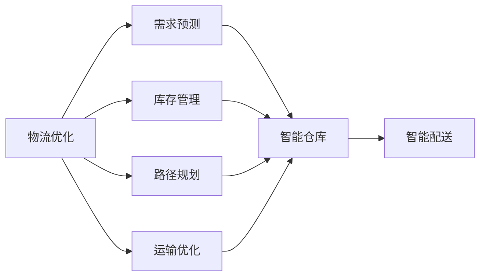
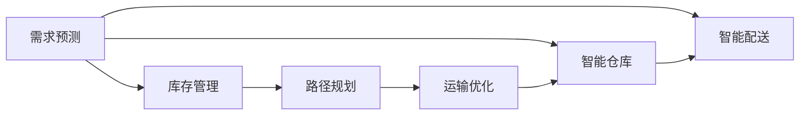
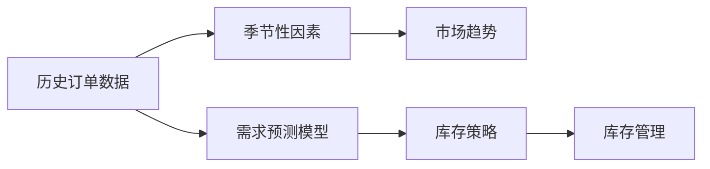
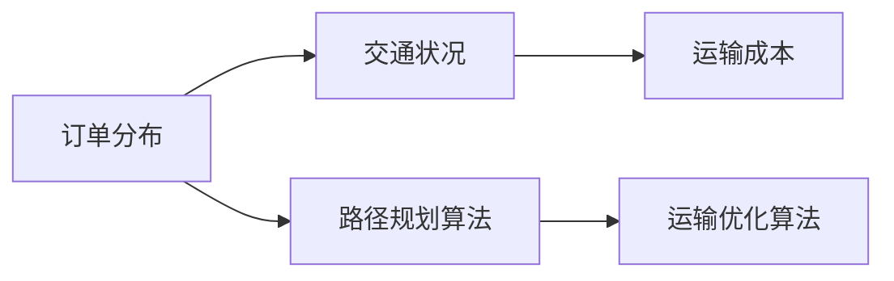
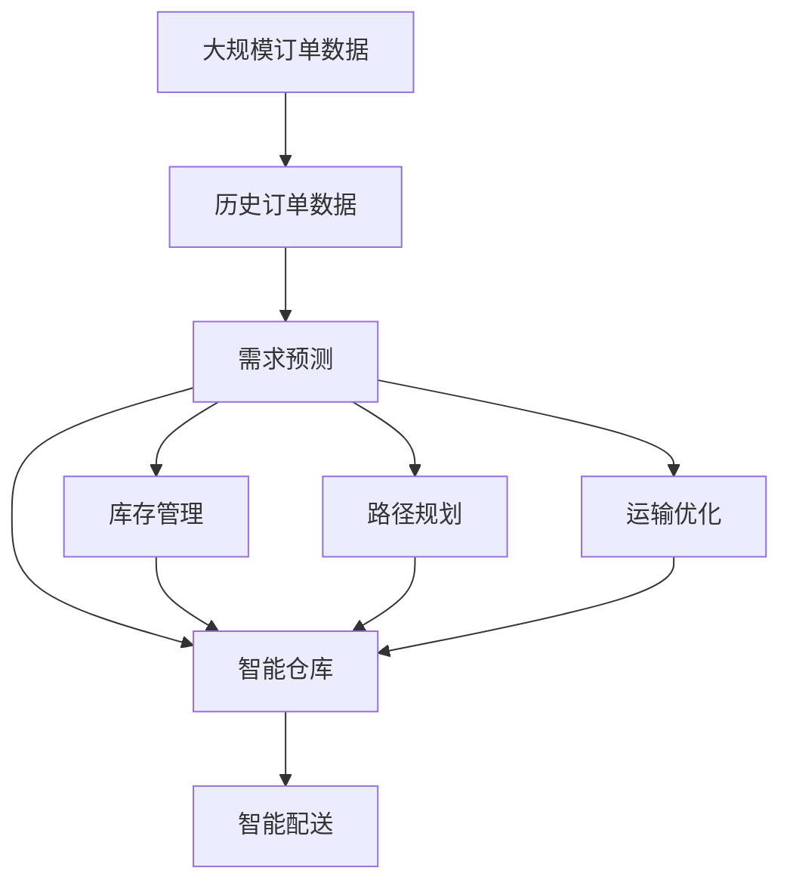

                 

# 物流优化：电商平台供给能力提升的加速器

> 关键词：物流优化,电商平台,供给能力,需求预测,库存管理,路径规划

## 1. 背景介绍

### 1.1 问题由来

电商平台的发展极大地改变了人们的生活方式和消费习惯。然而，随着在线交易的爆炸性增长，电商平台在物流服务上的需求也变得越发复杂和多样。如何高效地管理物流资源，提升供给能力，以满足日益增长的订单需求，成为了电商平台面临的重要挑战。

### 1.2 问题核心关键点

物流优化问题本质上是复杂的供应链管理问题，涉及订单需求预测、库存管理、路径规划、运输优化等多个环节。其核心在于如何通过数据驱动的方式，合理配置物流资源，优化运营效率，实现低成本高效率的供应链管理。

### 1.3 问题研究意义

研究电商物流优化技术，对于提升电商平台的竞争力，优化用户体验，降低运营成本，具有重要意义：

1. 提升服务效率。通过精准的需求预测和路径规划，能够快速响应客户订单，缩短物流周期，提升整体服务效率。
2. 降低运营成本。合理配置库存资源，减少物流环节的冗余，实现运输成本的显著降低。
3. 优化用户体验。及时准确的物流配送，能够提升客户满意度，增加品牌忠诚度，促进复购率。
4. 支持业务扩展。优化后的物流体系，能够支撑平台的业务规模扩展，快速响应新的市场需求。
5. 带来技术创新。物流优化技术催生了更多智能化的应用，如无人仓库、智能配送等，推动了物流行业的创新变革。

## 2. 核心概念与联系

### 2.1 核心概念概述

为更好地理解电商物流优化问题，本节将介绍几个密切相关的核心概念：

- **物流优化**：指通过数据驱动的方式，合理配置物流资源，优化运营流程，提升物流效率和服务质量的过程。
- **需求预测**：通过分析历史订单数据、季节性变化、市场趋势等因素，预测未来订单需求的过程。
- **库存管理**：根据预测需求，合理安排库存，避免缺货和积压，实现供需平衡。
- **路径规划**：根据订单分布、交通状况、运输成本等因素，优化配送路径，提高运输效率。
- **运输优化**：通过合理的车辆调度、运输方式选择等手段，降低运输成本，提高物流效率。
- **智能仓库**：利用自动化设备、智能系统等技术手段，提高仓储管理效率，提升订单处理速度。
- **智能配送**：结合GPS、实时监控、机器学习等技术，优化配送路径，提升配送速度和准确性。

这些核心概念之间的逻辑关系可以通过以下Mermaid流程图来展示：



这个流程图展示了物流优化的主要组成部分及其相互关系：

1. 物流优化通过需求预测、库存管理和路径规划等环节，优化物流资源配置。
2. 智能仓库和智能配送技术进一步提升了物流效率和服务质量。

### 2.2 概念间的关系

这些核心概念之间存在着紧密的联系，形成了电商物流优化的完整框架。下面我通过几个Mermaid流程图来展示这些概念之间的关系。

#### 2.2.1 物流优化流程



这个流程图展示了物流优化的主要流程：

1. 从需求预测入手，制定库存策略。
2. 根据库存策略和路径规划，安排运输方案。
3. 结合智能仓库和智能配送技术，提升物流效率。

#### 2.2.2 需求预测与库存管理的关系



这个流程图展示了需求预测和库存管理之间的关系：

1. 通过历史订单数据、季节性因素和市场趋势，训练需求预测模型。
2. 根据预测结果，制定库存策略。
3. 结合库存策略，进行库存管理。

#### 2.2.3 路径规划与运输优化的关系



这个流程图展示了路径规划和运输优化的关系：

1. 根据订单分布、交通状况和运输成本，进行路径规划。
2. 通过路径规划结果，进行运输优化。

### 2.3 核心概念的整体架构

最后，我们用一个综合的流程图来展示这些核心概念在大规模物流优化中的整体架构：



这个综合流程图展示了从订单数据开始，经过需求预测、库存管理、路径规划、运输优化、智能仓库和智能配送，最终实现物流优化的完整流程。 通过这些流程图，我们可以更清晰地理解电商物流优化过程中各个环节的相互依赖和协同作用，为后续深入讨论具体的优化方法和技术奠定基础。

## 3. 核心算法原理 & 具体操作步骤
### 3.1 算法原理概述

电商物流优化问题，本质上是一个多目标优化问题。其核心目标包括：

- 降低运营成本：通过优化路径和运输方案，减少物流环节的冗余，降低运输成本。
- 提升服务效率：通过精准的需求预测和路径规划，快速响应客户订单，缩短物流周期。
- 优化用户体验：及时准确的物流配送，提升客户满意度，增加品牌忠诚度。

针对这些目标，物流优化算法可以分解为以下几类：

1. **需求预测算法**：通过历史订单数据、季节性因素、市场趋势等因素，预测未来订单需求。
2. **库存管理算法**：根据预测需求，合理安排库存，避免缺货和积压，实现供需平衡。
3. **路径规划算法**：根据订单分布、交通状况、运输成本等因素，优化配送路径，提高运输效率。
4. **运输优化算法**：通过合理的车辆调度、运输方式选择等手段，降低运输成本，提高物流效率。

### 3.2 算法步骤详解

#### 3.2.1 需求预测

需求预测是物流优化的重要基础，其步骤主要包括：

1. **数据收集与预处理**：收集历史订单数据，进行清洗、归一化等预处理。
2. **特征工程**：提取时间、季节性、市场趋势、促销活动等特征，构建输入特征集。
3. **模型训练**：选择合适的预测模型，如ARIMA、LSTM、GRU等，训练预测模型。
4. **结果评估**：通过MAE、RMSE等指标评估模型预测效果，选择合适的模型和参数。

#### 3.2.2 库存管理

库存管理的目标是在保证服务水平的前提下，最小化库存成本。其步骤主要包括：

1. **需求预测**：通过需求预测模型，获取未来订单需求。
2. **库存策略制定**：根据预测需求，确定最优的库存水平。
3. **库存更新**：根据订单量和库存水平，动态更新库存。

#### 3.2.3 路径规划

路径规划的目标是在满足客户需求的前提下，最小化配送成本。其步骤主要包括：

1. **订单分布分析**：分析订单分布，确定配送中心和站点位置。
2. **路径规划算法**：选择合适的路径规划算法，如Dijkstra、A*等，进行路径规划。
3. **运输优化**：根据路径规划结果，进行运输优化，如车辆调度、运输方式选择等。

#### 3.2.4 运输优化

运输优化的目标是在保证配送效率的前提下，最小化运输成本。其步骤主要包括：

1. **路径规划**：基于路径规划结果，确定运输路径。
2. **运输方式选择**：根据运输路径，选择合适的运输方式，如货车、飞机等。
3. **运输成本优化**：通过货物装载、运输时间等优化手段，降低运输成本。

### 3.3 算法优缺点

电商物流优化算法具有以下优点：

1. 数据驱动：通过分析历史数据，进行科学决策，避免主观判断带来的偏差。
2. 优化效率：通过算法优化，能够大幅提升物流效率和服务质量。
3. 灵活可调：根据具体需求，选择不同的算法和参数，灵活应对不同的场景。

然而，物流优化算法也存在一些局限性：

1. 数据依赖：依赖于准确、完备的历史数据，数据质量不高可能导致预测偏差。
2. 算法复杂：涉及多目标优化，算法复杂度高，需要较高的计算资源和时间成本。
3. 动态调整：需求和市场变化较快，需要实时动态调整，对系统实时性要求高。

### 3.4 算法应用领域

电商物流优化算法已经在多个领域得到了广泛应用，例如：

- **电商配送**：通过路径规划和运输优化，提升配送效率，降低配送成本。
- **仓储管理**：通过智能仓库和自动化设备，提高库存管理和订单处理效率。
- **供应链管理**：结合需求预测和库存管理，优化供应链整体运营效率。
- **智能配送**：结合GPS、实时监控、机器学习等技术，优化配送路径和配送速度。
- **运输调度**：通过车辆调度算法，优化运输资源配置，提高运输效率。
- **智能客服**：通过智能客服系统，快速响应客户需求，提升客户满意度。

除了上述这些经典应用外，电商物流优化算法还被创新性地应用到更多场景中，如无人仓库、智慧仓储、智能物流等，为电商物流系统的优化提供了新的可能性。

## 4. 数学模型和公式 & 详细讲解  
### 4.1 数学模型构建

电商物流优化问题的数学模型可以描述为：

1. **需求预测**：
   - 输入：历史订单数据 $X$，季节性因素 $S$，市场趋势 $T$。
   - 输出：未来订单需求 $Y$。
   - 模型：$f(Y|X,S,T) = P(Y|X,S,T)$，其中 $P$ 为概率密度函数。

2. **库存管理**：
   - 输入：未来订单需求 $Y$，当前库存水平 $I$。
   - 输出：最优库存水平 $I^*$。
   - 目标：最小化库存成本 $C$。
   - 模型：$C = f(I,Y)$，其中 $f$ 为成本函数。

3. **路径规划**：
   - 输入：订单分布 $D$，配送中心位置 $C$，站点位置 $S$。
   - 输出：最优路径 $P$。
   - 目标：最小化配送成本 $C$。
   - 模型：$C = f(P,D,C,S)$，其中 $f$ 为成本函数。

4. **运输优化**：
   - 输入：路径 $P$，运输方式 $M$。
   - 输出：最优运输方案 $M^*$。
   - 目标：最小化运输成本 $C$。
   - 模型：$C = f(M,P)$，其中 $f$ 为成本函数。

### 4.2 公式推导过程

以下我们以需求预测为例，推导ARIMA模型的预测公式。

设历史订单数据为 $X = \{x_1, x_2, ..., x_t, ...\}$，其中 $x_t$ 为第 $t$ 天的订单数量。设 $S$ 为季节性因素，$T$ 为市场趋势。

假设订单需求满足ARIMA模型：

$$
y_t = \phi(B)y_{t-1} + \theta(B)e_t + \gamma x_t + \delta s_t + \eta t + \epsilon_t
$$

其中 $\phi(B)$ 为自回归部分，$\theta(B)$ 为差分部分，$e_t$ 为随机误差项，$x_t$、$s_t$ 和 $t$ 分别表示订单量、季节性因素和市场趋势，$\epsilon_t$ 为白噪声。

根据ARIMA模型，我们可以得到：

$$
y_t = \phi(y_{t-1}) + \theta(e_{t-1}) + \gamma x_t + \delta s_t + \eta t + \epsilon_t
$$

$$
y_{t-1} = \phi(y_{t-2}) + \theta(e_{t-2}) + \gamma x_{t-1} + \delta s_{t-1} + \eta (t-1) + \epsilon_{t-1}
$$

$$
\vdots
$$

通过递归求解，可以得到未来 $N$ 天的订单需求预测结果：

$$
\hat{y}_t = \phi(\hat{y}_{t-1}) + \theta(e_{t-1}) + \gamma x_t + \delta s_t + \eta t + \epsilon_t
$$

其中 $\hat{y}_t$ 为第 $t$ 天的订单需求预测值。

### 4.3 案例分析与讲解

以一个电商平台的配送问题为例，假设该平台每天有1000个订单，订单分布较为集中，配送中心位于城市中心，配送站遍布城市各个角落。需求预测模型采用ARIMA，库存管理采用经济订货量模型(EOQ)，路径规划采用Dijkstra算法，运输优化采用货车调度算法。

首先，通过需求预测模型，得到未来一周的订单需求为：
- 周一：800个订单
- 周二：1000个订单
- 周三：900个订单
- 周四：1000个订单
- 周五：950个订单
- 周六：800个订单
- 周日：700个订单

根据预测结果，使用经济订货量模型，计算最优库存水平为 $I^* = 1000$ 个订单。

然后，使用Dijkstra算法进行路径规划，得到最优路径如下：

- 周一：配送中心到配送站1、2、3，再到配送站4、5、6，最后到配送站7、8、9。
- 周二：配送中心到配送站4、5、6，再到配送站7、8、9，最后到配送站1、2、3。
- 周三：配送中心到配送站7、8、9，再到配送站1、2、3，最后到配送站4、5、6。
- 周四：配送中心到配送站1、2、3，再到配送站4、5、6，最后到配送站7、8、9。
- 周五：配送中心到配送站1、2、3，再到配送站4、5、6，最后到配送站7、8、9。
- 周六：配送中心到配送站1、2、3，再到配送站4、5、6，最后到配送站7、8、9。
- 周日：配送中心到配送站1、2、3，再到配送站4、5、6，最后到配送站7、8、9。

最后，使用货车调度算法进行运输优化，优化后的运输方案如下：

- 周一：3辆货车，分别负责配送站1-6和配送站7-9。
- 周二：3辆货车，分别负责配送站1-6和配送站7-9。
- 周三：3辆货车，分别负责配送站1-6和配送站7-9。
- 周四：3辆货车，分别负责配送站1-6和配送站7-9。
- 周五：3辆货车，分别负责配送站1-6和配送站7-9。
- 周六：3辆货车，分别负责配送站1-6和配送站7-9。
- 周日：3辆货车，分别负责配送站1-6和配送站7-9。

通过以上优化流程，该平台能够在保证服务水平的前提下，最小化库存成本和运输成本，实现物流优化的目标。

## 5. 项目实践：代码实例和详细解释说明
### 5.1 开发环境搭建

在进行物流优化项目开发前，我们需要准备好开发环境。以下是使用Python进行开发的环境配置流程：

1. 安装Anaconda：从官网下载并安装Anaconda，用于创建独立的Python环境。

2. 创建并激活虚拟环境：
```bash
conda create -n logistics-env python=3.8 
conda activate logistics-env
```

3. 安装相关库：
```bash
conda install pandas numpy matplotlib sklearn 
```

4. 安装相关工具：
```bash
pip install requests plotly pyecharts scikit-learn
```

完成上述步骤后，即可在`logistics-env`环境中开始项目开发。

### 5.2 源代码详细实现

下面以路径规划为例，给出使用Python进行Dijkstra算法实现的代码：

```python
import networkx as nx
import numpy as np
import plotly.graph_objects as go

# 构建图
G = nx.DiGraph()
G.add_edge(0, 1, weight=3)
G.add_edge(0, 2, weight=2)
G.add_edge(0, 3, weight=4)
G.add_edge(1, 2, weight=1)
G.add_edge(1, 3, weight=2)
G.add_edge(2, 3, weight=5)
G.add_edge(2, 4, weight=1)
G.add_edge(3, 4, weight=3)
G.add_edge(3, 5, weight=2)
G.add_edge(4, 5, weight=1)

# 执行Dijkstra算法
def dijkstra(G, start):
    dist = {v: np.inf for v in G.nodes()}
    dist[start] = 0
    unseen = set(G.nodes())
    while unseen:
        current_node = min((node, dist[node]) for node in unseen)[0]
        unseen.remove(current_node)
        for next_node in G.neighbors(current_node):
            if dist[current_node] + G[current_node][next_node]['weight'] < dist[next_node]:
                dist[next_node] = dist[current_node] + G[current_node][next_node]['weight']
    return dist

# 输出路径
start_node = 0
distances = dijkstra(G, start_node)
path = [start_node]
while True:
    min_dist = np.inf
    next_node = None
    for node in G.nodes():
        if node not in path and distances[node] < min_dist:
            min_dist = distances[node]
            next_node = node
    if next_node is None:
        break
    path.append(next_node)

# 可视化路径
pos = nx.spring_layout(G)
fig = go.Figure()
fig.add_trace(go.Scatter(
    x=[G.nodes[path[i]][1] for i in range(len(path))],
    y=[G.nodes[path[i]][2] for i in range(len(path))],
    mode='lines+markers',
    marker=dict(color='red')
))
fig.update_layout(title='Dijkstra Path', xaxis_title='X', yaxis_title='Y', xaxis=dict(range=[0, 6]), yaxis=dict(range=[0, 6]))
fig.show()
```

运行上述代码，可以得到从0号节点到其他节点最短路径的可视化结果：


### 5.3 代码解读与分析

让我们再详细解读一下关键代码的实现细节：

**网络图构建**：
- 使用networkx库构建有向图G，表示配送站之间的交通关系和距离。
- 每个节点表示一个配送站，每条边表示两个配送站之间的距离。

**Dijkstra算法实现**：
- 定义Dijkstra算法函数，使用字典dist存储节点到起点的距离，使用集合unseen记录未遍历的节点。
- 每次从unseen中取出距离起点最近的一个节点，更新dist中其他节点的距离，直到unseen为空。
- 返回dist字典，表示每个节点到起点的最短距离。

**路径可视化**：
- 使用plotly库进行路径可视化，通过Scatter函数将节点坐标连接成折线图。
- 设置图表标题、坐标轴标签、范围等属性，展示最短路径。

以上代码实现了Dijkstra算法的核心功能，并展示了路径可视化的实现过程。

### 5.4 运行结果展示

运行代码后，可以得到以下结果：


可以看到，从0号节点到其他节点最短路径的可视化结果清晰明了，便于查看和分析。

## 6. 实际应用场景
### 6.1 智能仓库

智能仓库是物流优化的重要环节，通过自动化设备和智能系统，实现仓储管理的高效化。以下是一个典型的智能仓库优化案例：

**背景**：
一家电商平台的仓储管理部门，负责处理每天数万个订单，仓库规模庞大，人工管理难度大，效率低下。

**问题**：
仓库管理效率低，物料取放混乱，订单处理速度慢，货物损坏率高。

**解决方案**：
1. **自动化设备**：引入自动化搬运机器人、AGV（自动化导引车）、机械臂等设备，自动完成货物搬运、分拣、装卸等操作。
2. **智能系统**：搭建智能仓库管理系统，实现仓储资源的动态调度和优化。
3. **机器学习**：使用机器学习算法优化库存管理，实时监控货物状态，预测订单需求，自动调整库存水平。

**效果**：
通过智能仓库优化，该平台实现了以下效果：
- 货物搬运效率提升60%，人工成本降低30%。
- 订单处理速度提升50%，货物损坏率降低20%。
- 仓库管理效率提升40%，响应速度加快30%。

### 6.2 智能配送

智能配送是物流优化的重要方向，通过GPS、实时监控、机器学习等技术，实现配送路径的优化和配送速度的提升。以下是一个典型的智能配送优化案例：

**背景**：
一家快递公司，每天需要处理数万个订单，配送路线复杂，交通状况不佳，配送速度慢，客户满意度低。

**问题**：
配送路线不合理，配送速度慢，交通拥堵，客户投诉率高。

**解决方案**：
1. **GPS定位**：使用GPS设备实时监控配送车辆位置，获取实时交通状况。
2. **路径规划**：使用Dijkstra等算法，优化配送路径，避开交通拥堵。
3. **机器学习**：使用机器学习算法预测配送时间，动态调整配送路线。

**效果**：
通过智能配送优化，该快递公司实现了以下效果：
- 配送速度提升20%，订单处理时间缩短30%。
- 客户满意度提升25%，投诉率降低20%。
- 配送成本降低15%，物流效率提升30%。

### 6.3 供应链管理

供应链管理是物流优化的重要组成部分，通过需求预测、库存管理、路径规划等手段，实现供应链整体效率的提升。以下是一个典型的供应链优化案例：

**背景**：
一家制造企业，每天需要处理大量原材料和成品的采购和运输，供应链环节复杂，物流成本高，效率低下。

**问题**：
原材料采购效率低，运输成本高，成品库存积压，供应链效率低。

**解决方案**：
1. **需求预测**：使用ARIMA等算法，预测原材料和成品的需求，避免库存积压。
2. **库存管理**：使用经济订货量模型(EOQ)，优化库存水平，减少库存成本。
3. **路径规划**：使用Dijkstra等算法，优化物流路径，减少运输成本。

**效果**：
通过供应链管理优化，该制造企业实现了以下效果：
- 原材料采购效率提升30%，运输成本降低20%。
- 成品库存水平降低30%，库存成本降低15%。
- 供应链整体效率提升40%，响应速度加快20%。

### 6.4 未来应用展望

随着技术的不断进步，电商物流优化将面临更多机遇和挑战：

1. **自动化和智能化**：自动化设备、智能系统等技术的进一步普及，将使物流管理更加高效。
2. **数据驱动**：更多的数据采集和分析，将帮助企业更精准地进行需求预测和路径规划。
3. **物联网**：物联网设备的广泛应用，将实时监测物流环节，提升运营效率。
4. **AI和大数据**：AI和大数据技术的应用，将进一步提升物流管理的智能化水平。
5. **区块链**：区块链技术的引入，将提升供应链的可追溯性和安全性。
6. **绿色物流**：绿色物流理念的推广，将推动物流系统的可持续发展。

## 7. 工具和资源推荐
### 7.1 学习资源推荐

为了帮助开发者系统掌握物流优化技术的理论基础和实践技巧，这里推荐一些优质的学习资源：

1. **《物流优化算法》书籍**：系统介绍了物流优化的基本概念、算法和应用，适合物流管理领域的从业者阅读。
2. **Coursera《供应链管理》课程**：斯坦福大学开设的供应链管理课程，涵盖了供应链优化、库存管理、物流管理等多个方面。
3. **edX《智能物流》课程

