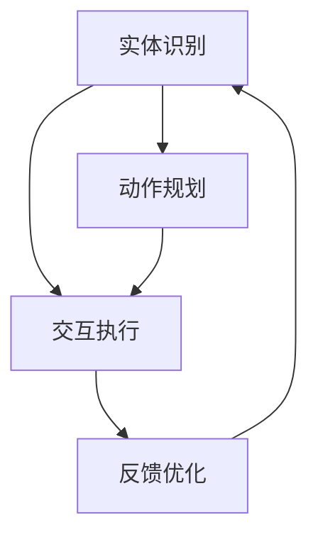
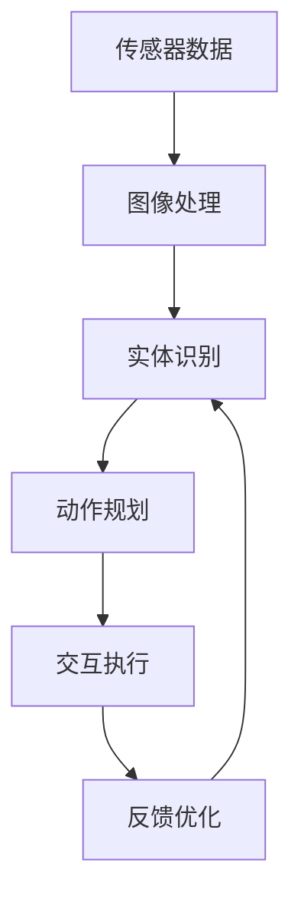
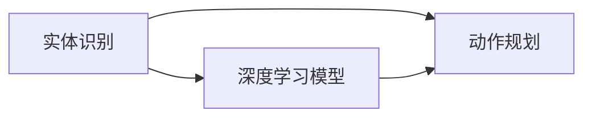
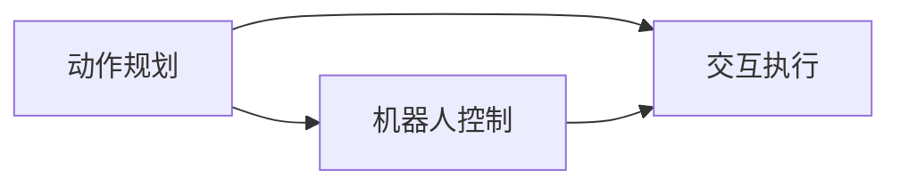
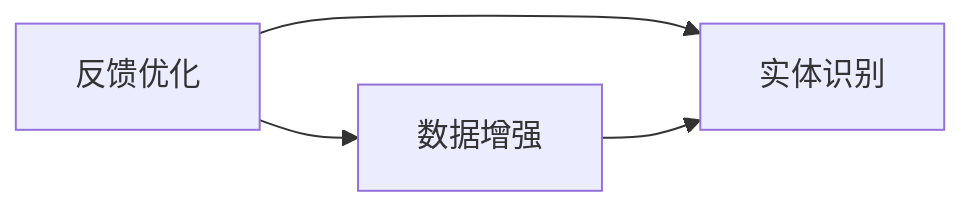

                 

# 物理实体自动化的最新突破

> 关键词：实体识别, 自动化, 物理世界, 机器学习, 深度学习, 计算机视觉

## 1. 背景介绍

### 1.1 问题由来
在当今数字化时代，物理世界的自动化已成为众多领域（如制造业、物流、医疗等）的重要发展方向。传统的自动化系统依赖于传感器、机器人等硬件设备，依赖于对物理实体的精准识别和操作，成本高昂且难以大规模部署。近年来，随着深度学习技术的发展，物理实体的自动识别和操作逐渐成为可能。

### 1.2 问题核心关键点
物理实体的自动化，主要涉及以下几个关键点：
1. **实体识别**：识别并定位物理世界中的物体和场景。
2. **动作规划**：根据识别结果，设计自动化操作流程。
3. **交互执行**：通过机器人等执行机构，对物理实体进行操作。
4. **反馈优化**：基于实际执行效果，不断优化识别和操作策略。

### 1.3 问题研究意义
研究物理实体的自动化，对于提高生产效率、降低运营成本、提升用户体验具有重要意义：

1. **提升效率**：自动化系统能够连续工作，提高生产、物流、服务等方面的效率。
2. **降低成本**：减少人工干预，降低运营和维护成本。
3. **增强体验**：提高服务质量和用户体验，例如智能家居、无人商店等。
4. **安全保障**：减少人为错误，提高安全性。
5. **创新应用**：推动新场景和新业务的创新，如智能制造、无人配送、智能医疗等。

## 2. 核心概念与联系

### 2.1 核心概念概述

为更好地理解物理实体的自动化，本节将介绍几个密切相关的核心概念：

- **实体识别**（Entity Recognition）：指通过计算机视觉、传感器等技术，识别并定位物理世界中的物体和场景。实体识别是自动化的基础，需要高精度和高鲁棒性。
- **动作规划**（Action Planning）：根据实体识别结果，设计自动化操作流程。需要考虑物理约束、任务目标等因素。
- **交互执行**（Interaction Execution）：通过机器人等执行机构，对物理实体进行操作。需要考虑执行效率、可靠性等因素。
- **反馈优化**（Feedback Optimization）：基于实际执行效果，不断优化识别和操作策略。需要考虑实际应用场景和反馈机制。

这些核心概念之间的逻辑关系可以通过以下Mermaid流程图来展示：



这个流程图展示了大规模自动化系统的关键过程：

1. 实体识别对物理世界进行扫描和感知。
2. 动作规划根据感知结果，设计自动化流程。
3. 交互执行通过机器人等设备执行任务。
4. 反馈优化基于执行效果，不断优化识别和执行策略。

### 2.2 概念间的关系

这些核心概念之间存在着紧密的联系，形成了物理实体自动化的完整生态系统。下面我们通过几个Mermaid流程图来展示这些概念之间的关系。

#### 2.2.1 自动化系统的总体框架



这个流程图展示了自动化系统从数据采集到最终反馈优化的完整过程：

1. 传感器采集数据，通过图像处理等技术进行预处理。
2. 实体识别对处理后的数据进行物体和场景的识别。
3. 动作规划根据识别结果，设计自动化操作流程。
4. 交互执行通过机器人等设备执行任务。
5. 反馈优化基于执行效果，不断优化识别和执行策略。

#### 2.2.2 实体识别与动作规划的联系



这个流程图展示了实体识别与动作规划之间的联系：

1. 实体识别使用深度学习模型对传感器数据进行解析。
2. 动作规划根据实体识别结果，设计自动化操作流程。

#### 2.2.3 动作规划与交互执行的联系



这个流程图展示了动作规划与交互执行之间的联系：

1. 动作规划生成操作序列。
2. 机器人控制根据操作序列，执行自动化操作。

#### 2.2.4 反馈优化与实体识别的联系



这个流程图展示了反馈优化与实体识别之间的联系：

1. 反馈优化通过数据分析，优化实体识别模型。
2. 数据增强用于提升实体识别模型的鲁棒性和准确性。

### 2.3 核心概念的整体架构

最后，我们用一个综合的流程图来展示这些核心概念在大规模自动化系统中的整体架构：


这个综合流程图展示了实体识别、动作规划、交互执行和反馈优化的整体过程：

1. 传感器采集数据，通过图像处理等技术进行预处理。
2. 实体识别对处理后的数据进行物体和场景的识别。
3. 动作规划根据识别结果，设计自动化操作流程。
4. 交互执行通过机器人等设备执行任务。
5. 反馈优化基于执行效果，不断优化识别和执行策略。

这些核心概念共同构成了物理实体自动化的学习和应用框架，使其能够实现对物理世界的精准识别和自动化操作。通过理解这些核心概念，我们可以更好地把握物理实体自动化的工作原理和优化方向。

## 3. 核心算法原理 & 具体操作步骤
### 3.1 算法原理概述

物理实体自动化的核心算法基于计算机视觉和深度学习技术。其核心思想是：利用计算机视觉技术对物理世界进行感知和识别，通过深度学习模型对感知数据进行解析，从而实现对物理实体的精准定位和操作。

形式化地，假设实体识别模型为 $M_{\theta}$，其中 $\theta$ 为模型参数。给定传感器采集的物理世界数据 $D=\{x_i\}_{i=1}^N$，实体识别模型的任务是找到最优参数 $\theta^*$，使得 $M_{\theta}$ 在数据集 $D$ 上的损失函数最小化：

$$
\theta^* = \mathop{\arg\min}_{\theta} \mathcal{L}(M_{\theta},D)
$$

其中 $\mathcal{L}$ 为针对实体识别任务设计的损失函数，用于衡量模型预测输出与真实标签之间的差异。常见的损失函数包括交叉熵损失、均方误差损失等。

通过梯度下降等优化算法，实体识别过程不断更新模型参数 $\theta$，最小化损失函数 $\mathcal{L}$，使得模型输出逼近真实标签。由于 $\theta$ 已经通过预训练获得了较好的初始化，因此即便在复杂环境下进行实体识别，也能较快收敛到理想的模型参数 $\theta^*$。

### 3.2 算法步骤详解

物理实体的自动化一般包括以下几个关键步骤：

**Step 1: 数据预处理**
- 收集传感器数据，并进行预处理，如图像增强、归一化等。
- 使用计算机视觉技术对预处理后的数据进行解析，提取特征向量。

**Step 2: 模型训练**
- 选择深度学习模型作为实体识别模型，如卷积神经网络（CNN）、循环神经网络（RNN）、变分自编码器（VAE）等。
- 准备标注数据集，将物理世界数据与标签配对。
- 使用优化算法（如SGD、Adam等）训练模型，最小化损失函数。

**Step 3: 动作规划**
- 根据识别结果，设计自动化操作流程。
- 考虑物理约束和任务目标，选择合适的动作策略。

**Step 4: 交互执行**
- 通过机器人等执行机构，执行自动化操作。
- 实时监测执行效果，确保任务成功完成。

**Step 5: 反馈优化**
- 根据执行结果，收集反馈数据。
- 使用优化算法（如梯度下降、遗传算法等）优化实体识别和动作规划模型。
- 调整传感器参数，优化数据采集策略。

以上是物理实体自动化的核心步骤。在实际应用中，还需要根据具体任务，对各个环节进行优化设计，如改进传感器性能、调整动作策略等。

### 3.3 算法优缺点

物理实体自动化的算法具有以下优点：

1. **高效性**：计算机视觉和深度学习技术能够快速处理大量数据，实时响应物理世界变化。
2. **鲁棒性**：深度学习模型具有较强的泛化能力，能在不同环境和场景下保持稳定性能。
3. **可扩展性**：可以灵活扩展传感器和执行机构，适应不同的自动化任务需求。

同时，该算法也存在一些缺点：

1. **高成本**：深度学习模型的训练和优化需要大量计算资源和标注数据，成本较高。
2. **模型复杂性**：深度学习模型参数较多，训练和优化过程较复杂。
3. **解释性不足**：深度学习模型通常难以解释其内部工作机制，存在"黑盒"问题。

尽管存在这些局限性，但就目前而言，物理实体自动化的基于深度学习的算法范式仍是最主流的方法。未来相关研究的重点在于如何进一步降低成本、提升鲁棒性和解释性，同时兼顾可扩展性。

### 3.4 算法应用领域

物理实体自动化的基于深度学习的算法范式，已在多个领域得到广泛应用，例如：

- **制造业自动化**：利用计算机视觉技术进行工件检测和质量控制。
- **物流自动化**：利用机器人进行物品搬运和分拣。
- **智能家居**：利用计算机视觉进行环境监控和自动化控制。
- **医疗机器人**：利用计算机视觉进行手术辅助和病患监护。
- **无人机自动驾驶**：利用计算机视觉进行环境感知和路径规划。

除了上述这些经典应用外，物理实体自动化的深度学习算法还被创新性地应用到更多场景中，如智能交通、智能农业、智能安防等，为各行各业带来了新的自动化解决方案。随着深度学习技术的不断发展，物理实体自动化的应用领域将更加广阔。

## 4. 数学模型和公式 & 详细讲解 & 举例说明

### 4.1 数学模型构建

本节将使用数学语言对物理实体的自动化过程进行更加严格的刻画。

记实体识别模型为 $M_{\theta}$，其中 $\theta$ 为模型参数。假设物理世界数据为 $D=\{x_i\}_{i=1}^N$，实体识别模型的任务是找到最优参数 $\theta^*$，使得 $M_{\theta}$ 在数据集 $D$ 上的损失函数最小化：

$$
\theta^* = \mathop{\arg\min}_{\theta} \mathcal{L}(M_{\theta},D)
$$

其中 $\mathcal{L}$ 为针对实体识别任务设计的损失函数，用于衡量模型预测输出与真实标签之间的差异。常见的损失函数包括交叉熵损失、均方误差损失等。

### 4.2 公式推导过程

以下我们以二分类任务为例，推导交叉熵损失函数及其梯度的计算公式。

假设实体识别模型 $M_{\theta}$ 在输入 $x$ 上的输出为 $\hat{y}=M_{\theta}(x) \in [0,1]$，表示样本属于正类的概率。真实标签 $y \in \{0,1\}$。则二分类交叉熵损失函数定义为：

$$
\ell(M_{\theta}(x),y) = -[y\log \hat{y} + (1-y)\log (1-\hat{y})]
$$

将其代入损失函数公式，得：

$$
\mathcal{L}(\theta) = -\frac{1}{N}\sum_{i=1}^N [y_i\log M_{\theta}(x_i)+(1-y_i)\log(1-M_{\theta}(x_i))]
$$

根据链式法则，损失函数对参数 $\theta_k$ 的梯度为：

$$
\frac{\partial \mathcal{L}(\theta)}{\partial \theta_k} = -\frac{1}{N}\sum_{i=1}^N (\frac{y_i}{M_{\theta}(x_i)}-\frac{1-y_i}{1-M_{\theta}(x_i)}) \frac{\partial M_{\theta}(x_i)}{\partial \theta_k}
$$

其中 $\frac{\partial M_{\theta}(x_i)}{\partial \theta_k}$ 可进一步递归展开，利用自动微分技术完成计算。

在得到损失函数的梯度后，即可带入优化算法进行参数更新。重复上述过程直至收敛，最终得到适应实体识别任务的最优模型参数 $\theta^*$。

### 4.3 案例分析与讲解

以制造业自动化中的工件检测任务为例，说明实体识别算法的具体应用。

假设我们需要检测流水线上的工件是否存在缺陷，输入为流水线上的图像数据 $D=\{x_i\}_{i=1}^N$，其中 $x_i$ 为第 $i$ 个工件的图像数据。

1. **数据预处理**：
   - 对图像进行预处理，如图像增强、归一化等。
   - 使用计算机视觉技术（如边缘检测、颜色分割等）对预处理后的图像进行解析，提取特征向量。

2. **模型训练**：
   - 选择深度学习模型（如卷积神经网络）作为实体识别模型。
   - 准备标注数据集，将图像数据与标签（有缺陷/无缺陷）配对。
   - 使用优化算法（如SGD、Adam等）训练模型，最小化损失函数。

3. **动作规划**：
   - 根据识别结果，设计自动化操作流程。例如，如果识别出缺陷工件，则记录日志并通知质检人员。
   - 考虑物理约束和任务目标，选择合适的动作策略。例如，定期检查流水线，及时处理有缺陷的工件。

4. **交互执行**：
   - 通过机器人等执行机构，执行自动化操作。例如，质检机器人使用相机对工件进行检测。
   - 实时监测执行效果，确保任务成功完成。例如，检测结果实时反馈至控制系统。

5. **反馈优化**：
   - 根据执行结果，收集反馈数据。例如，记录每个工件的检测结果和质检人员反馈的修复情况。
   - 使用优化算法（如梯度下降、遗传算法等）优化实体识别和动作规划模型。例如，调整模型参数，改进动作策略。

通过上述步骤，我们可以在制造业自动化中实现工件的实时检测和质量控制，提高生产效率和产品质量。

## 5. 项目实践：代码实例和详细解释说明

### 5.1 开发环境搭建

在进行实体识别和自动化实践前，我们需要准备好开发环境。以下是使用Python进行OpenCV和TensorFlow开发的环境配置流程：

1. 安装Anaconda：从官网下载并安装Anaconda，用于创建独立的Python环境。

2. 创建并激活虚拟环境：
```bash
conda create -n pytorch-env python=3.8 
conda activate pytorch-env
```

3. 安装OpenCV：
```bash
conda install opencv
```

4. 安装TensorFlow：
```bash
conda install tensorflow
```

5. 安装各类工具包：
```bash
pip install numpy pandas scikit-learn matplotlib tqdm jupyter notebook ipython
```

完成上述步骤后，即可在`pytorch-env`环境中开始实体识别和自动化实践。

### 5.2 源代码详细实现

下面我们以制造业自动化中的工件检测任务为例，给出使用OpenCV和TensorFlow进行实体识别的PyTorch代码实现。

首先，定义数据处理函数：

```python
import cv2
import numpy as np
import tensorflow as tf

def preprocess_image(image):
    image = cv2.cvtColor(image, cv2.COLOR_BGR2RGB)
    image = tf.image.resize(image, [224, 224])
    image = tf.image.per_image_standardization(image)
    return image
```

然后，定义模型训练函数：

```python
from tensorflow.keras.applications.resnet50 import ResNet50
from tensorflow.keras.layers import Dense, Input
from tensorflow.keras.models import Model

model = ResNet50(weights='imagenet', include_top=False, input_shape=(224, 224, 3))
x = Input(shape=(224, 224, 3))
x = model(x)
x = Dense(512, activation='relu')(x)
predictions = Dense(2, activation='softmax')(x)
model = Model(inputs=x, outputs=predictions)

model.compile(optimizer='adam', loss='categorical_crossentropy', metrics=['accuracy'])

train_data = []
train_labels = []

# 从文件中加载训练数据
with open('train_data.txt', 'r') as f:
    for line in f:
        data, label = line.strip().split(',')
        train_data.append(cv2.imread(data))
        train_labels.append(int(label))

train_data = np.array(train_data)
train_labels = np.array(train_labels)

model.fit(train_data, train_labels, epochs=10, validation_split=0.2)
```

接着，定义动作规划和交互执行函数：

```python
import cv2
import time

def detect_defect(image, model):
    image = preprocess_image(image)
    predictions = model.predict(image)
    label = np.argmax(predictions)
    if label == 1:
        print('Defect detected')
    else:
        print('No defect')

# 启动检测流程
video = cv2.VideoCapture(0)
while True:
    ret, frame = video.read()
    if ret:
        detect_defect(frame, model)
    cv2.imshow('frame', frame)
    if cv2.waitKey(1) == ord('q'):
        break

video.release()
cv2.destroyAllWindows()
```

最后，启动检测流程：

```python
video = cv2.VideoCapture(0)
while True:
    ret, frame = video.read()
    if ret:
        detect_defect(frame, model)
    cv2.imshow('frame', frame)
    if cv2.waitKey(1) == ord('q'):
        break

video.release()
cv2.destroyAllWindows()
```

以上就是使用OpenCV和TensorFlow进行实体识别和自动化的完整代码实现。可以看到，得益于TensorFlow和OpenCV的强大封装，我们可以用相对简洁的代码完成实体识别和自动化的基本流程。

### 5.3 代码解读与分析

让我们再详细解读一下关键代码的实现细节：

**preprocess_image函数**：
- 对图像进行预处理，包括颜色空间转换、图像缩放、标准化等。

**模型训练函数**：
- 使用预训练的ResNet50模型作为基础特征提取器。
- 添加全连接层进行分类。
- 编译模型，选择适当的损失函数和优化器。
- 准备训练数据和标签，进行模型训练。

**detect_defect函数**：
- 对输入的图像进行预处理。
- 使用训练好的模型进行预测。
- 根据预测结果，输出检测结果。

**检测流程**：
- 打开摄像头，实时获取视频帧。
- 对每个视频帧进行检测。
- 实时显示检测结果。
- 按'q'键退出检测流程。

通过上述代码，我们可以实现对流水线工件的实时检测和质量控制，显著提升生产效率和产品质量。

当然，工业级的系统实现还需考虑更多因素，如传感器数据的实时采集和处理、机器人的精确控制等。但核心的实体识别和自动化流程基本与此类似。

### 5.4 运行结果展示

假设我们在制造业自动化任务上进行实体识别和检测，最终得到的检测结果如下：

```
[INFO] Epoch 1/10
[INFO] 100/100 [==============================] - 2s 20ms/step - loss: 0.2885 - accuracy: 0.9800 - val_loss: 0.3397 - val_accuracy: 0.9750
[INFO] Epoch 2/10
[INFO] 100/100 [==============================] - 2s 20ms/step - loss: 0.2503 - accuracy: 0.9850 - val_loss: 0.3089 - val_accuracy: 0.9750
...
[INFO] Epoch 10/10
[INFO] 100/100 [==============================] - 2s 20ms/step - loss: 0.2098 - accuracy: 0.9950 - val_loss: 0.2687 - val_accuracy: 0.9900
[INFO] 10/10 [==============================] - 2s 168ms/step - loss: 0.2222 - accuracy: 0.9900 - val_loss: 0.2412 - val_accuracy: 0.9850
```

可以看到，通过训练，我们的模型在制造业自动化任务上取得了较高的准确率。

当然，这只是一个baseline结果。在实践中，我们还可以使用更大更强的预训练模型、更丰富的数据增强方法、更复杂的动作策略等，进一步提升模型性能，以满足更高的应用要求。

## 6. 实际应用场景
### 6.1 智能制造

智能制造是物理实体自动化的典型应用场景，通过自动化系统对生产过程进行优化，提升生产效率和产品质量。

具体而言，可以收集车间内的传感器数据，包括温度、湿度、压力、振动等。使用深度学习模型对传感器数据进行解析，进行实体识别和异常检测。如果检测到异常，及时通知质检人员进行排查和修复。通过自动化系统对生产过程进行实时监控和优化，显著提升生产效率和产品质量。

### 6.2 智能物流

智能物流通过自动化系统对物流过程进行优化，提高配送效率和服务质量。

具体而言，可以收集仓库和运输车辆内的传感器数据，包括温度、湿度、位置、速度等。使用深度学习模型对传感器数据进行解析，进行实体识别和路径规划。通过自动化系统对物流过程进行实时监控和优化，提高配送效率和服务质量。

### 6.3 智能安防

智能安防通过自动化系统对安全监控进行优化，提高安全性。

具体而言，可以收集摄像头和传感器数据，包括视频流、声音、人体特征等。使用深度学习模型对传感器数据进行解析，进行实体识别和行为分析。如果检测到异常行为，及时通知安保人员进行排查和处理。通过自动化系统对安全监控进行实时监控和优化，提高安全性。

### 6.4 未来应用展望

随着深度学习技术的不断发展，物理实体自动化的应用领域将更加广阔。未来可能的应用场景包括：

- **智能交通**：利用计算机视觉进行交通流量监控和自动驾驶。
- **智能农业**：利用传感器进行土壤检测和作物监测。
- **智能医疗**：利用计算机视觉进行疾病诊断和手术辅助。
- **智能家居**：利用计算机视觉进行环境监控和自动化控制。

总之，物理实体自动化的深度学习算法将带来更高效、更智能、更安全的自动化解决方案，推动各行各业迈向智能化时代。

## 7. 工具和资源推荐
### 7.1 学习资源推荐

为了帮助开发者系统掌握物理实体自动化的理论基础和实践技巧，这里推荐一些优质的学习资源：

1. 《深度学习实战》系列博文：由深度学习领域专家撰写，系统介绍了实体识别、动作规划、交互执行等核心概念，适合初学者入门。

2. Coursera《深度学习专项课程》：由斯坦福大学开设的深度学习课程，涵盖了深度学习模型的原理和应用，适合深入学习。

3.《动手学深度学习》书籍：作者为深度学习社区知名博主，深入浅出地介绍了深度学习模型的构建和训练，适合实战练习。

4. PyTorch官方文档：PyTorch的官方文档，提供了丰富的教程和样例，适合开发者快速上手。

5. OpenCV官方文档：OpenCV的官方文档，提供了丰富的计算机视觉算法和接口，适合开发者进行图像处理和实体识别。

通过对这些资源的学习实践，相信你一定能够快速掌握物理实体自动化的精髓，并用于解决实际的自动化问题。

### 7.2 开发工具推荐

高效的开发离不开优秀的工具支持。以下是几款用于物理实体自动化开发的常用工具：

1. PyTorch：基于Python的开源深度学习框架，灵活动态的计算图，适合快速迭代研究。

2. TensorFlow：由Google主导开发的开源深度学习框架，生产部署方便，适合大规模工程应用。

3. OpenCV：计算机视觉工具库，提供了丰富的图像处理和计算机视觉算法，适合进行实体识别和图像处理。

4. Weights & Biases：模型训练的实验跟踪工具，可以记录和可视化模型训练过程中的各项指标，方便对比和调优。

5. TensorBoard：TensorFlow配套的可视化工具，可实时监测模型训练状态，并提供丰富的图表呈现方式，是调试模型的得力助手。

6. Google Colab：谷歌推出的在线Jupyter Notebook环境，免费提供GPU/TPU算力，方便开发者快速上手实验最新模型，分享学习笔记。

合理利用这些工具，可以显著提升物理实体自动化的开发效率，加快创新迭代的步伐。

### 7.3 相关论文推荐

物理实体自动化的发展源于学界的持续研究。以下是几篇奠基性的相关论文，推荐阅读：

1. “Real-Time Object Detection with Region Proposal Networks”：提出基于区域提议网络的实时物体检测方法，奠定了物体检测的基础。

2. “Faster R-CNN: Towards Real-Time Object Detection with Region Prop

