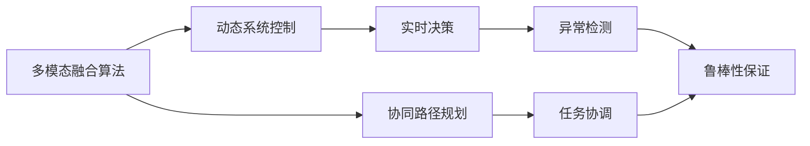
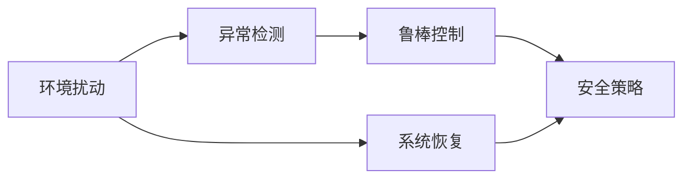
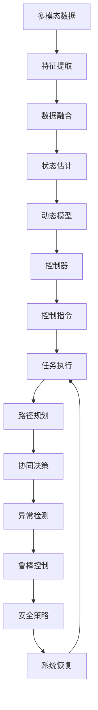

                 

## 1. 背景介绍

### 1.1 问题由来
随着物联网（IoT）和人工智能（AI）技术的迅猛发展，自动化和智能化在各行各业得到广泛应用。特别是在物理实体自动化领域，机器人和自动化系统在工厂、仓库、物流等场景中扮演着越来越重要的角色。然而，由于物理实体通常具有较高的复杂性和不确定性，使得自动化系统的设计和部署面临着巨大挑战。

### 1.2 问题核心关键点
物理实体自动化的核心关键点包括：

- 多模态数据融合：物理实体通常具有位置、速度、姿态、温度等多模态传感器数据，需要高效的融合算法处理。
- 实时决策与控制：自动化系统需要在动态环境中做出快速响应和控制决策，保证任务的高效执行。
- 协同与路径规划：在复杂的场景中，多个物理实体需要协同工作，高效的路径规划算法是关键。
- 鲁棒性与安全：自动化系统需要在不确定性和噪声环境中保证鲁棒性和安全性。

### 1.3 问题研究意义
研究物理实体自动化的最新趋势，对于推动自动化技术的广泛应用、提升生产效率和安全性、降低成本具有重要意义。此外，随着自动化技术的普及，自动化系统将逐步渗透到更多领域，如农业、医疗、服务等，有望带来深远的社会和经济效益。

## 2. 核心概念与联系

### 2.1 核心概念概述

为了更好地理解物理实体自动化的最新趋势，本节将介绍几个密切相关的核心概念：

- **多模态融合算法**：将物理实体上不同模态的数据（如位置、速度、温度等）进行融合处理，以得到更加全面和准确的感知结果。
- **动态系统控制**：在动态环境中，通过控制算法实现自动化系统的高效决策和执行。
- **协同路径规划**：在多实体协同工作的场景下，规划高效的任务路径，以实现协作作业。
- **鲁棒性与安全**：自动化系统在应对不确定性和噪声干扰时，保持鲁棒性和安全性，避免系统崩溃或异常行为。

这些核心概念之间的逻辑关系可以通过以下Mermaid流程图来展示：



这个流程图展示了多模态融合、动态控制、路径规划、实时决策、异常检测、鲁棒性保证之间的联系。通过这些算法和技术，自动化系统可以在复杂环境中高效完成任务，同时保持系统的稳定性和安全性。

### 2.2 概念间的关系

这些核心概念之间存在着紧密的联系，形成了物理实体自动化的完整生态系统。下面我们通过几个Mermaid流程图来展示这些概念之间的关系。

#### 2.2.1 多模态融合算法


这个流程图展示了多模态融合算法的基本流程：首先从物理实体中提取多模态数据，然后通过特征提取和融合技术，将不同模态的数据整合为一致的状态表示，最后进行状态估计和决策执行。

#### 2.2.2 动态系统控制


这个流程图展示了动态系统控制的基本流程：首先获取当前系统状态，然后根据动态模型进行控制决策，生成控制指令，最后根据环境反馈调整控制指令，以实现系统的动态控制。

#### 2.2.3 协同路径规划


这个流程图展示了协同路径规划的基本流程：首先根据任务目标和物理实体的位置信息，进行路径规划和优化，然后执行路径，并在多实体协同工作的情况下，通过通信协议协调各实体的行动。

#### 2.2.4 鲁棒性与安全


这个流程图展示了鲁棒性与安全的基本流程：首先监测环境扰动和异常情况，然后采用鲁棒控制技术保证系统的稳定性和安全性，最后根据安全策略进行系统恢复和调整。

### 2.3 核心概念的整体架构

最后，我们用一个综合的流程图来展示这些核心概念在大规模自动化系统中的应用：



这个综合流程图展示了从多模态数据融合到动态系统控制的完整流程，以及鲁棒性和安全性的保障机制。通过这些核心概念和技术，物理实体自动化系统能够在复杂环境中高效、稳定地完成任务。

## 3. 核心算法原理 & 具体操作步骤
### 3.1 算法原理概述

物理实体自动化的最新趋势主要依赖于多模态融合算法、动态系统控制、协同路径规划和鲁棒性与安全技术。下面将详细介绍这些核心算法的原理和操作步骤。

### 3.2 算法步骤详解

#### 3.2.1 多模态融合算法
多模态融合算法通过将不同模态的数据进行融合处理，得到更加全面和准确的感知结果。常见的融合方法包括：

- **传感器校准与融合**：通过传感器校准和数据融合技术，将不同传感器数据进行融合，消除传感器之间的误差，提高融合结果的精度。
- **数据融合算法**：如卡尔曼滤波、粒子滤波等，通过融合多模态数据，得到一致的状态估计。
- **特征提取与融合**：通过特征提取和融合技术，将不同模态的数据转换为统一的特征表示，然后进行融合。

#### 3.2.2 动态系统控制
动态系统控制算法通过动态模型和控制器实现自动化系统的决策和执行。常见的控制算法包括：

- **PID控制器**：比例、积分、微分控制器的组合，适用于线性系统控制。
- **模型预测控制（MPC）**：通过预测模型进行优化决策，适用于非线性系统控制。
- **自适应控制**：根据系统反馈自适应调整控制参数，保持系统的稳定性和适应性。

#### 3.2.3 协同路径规划
协同路径规划算法通过优化路径，实现多实体的高效协同工作。常见的路径规划算法包括：

- **A*算法**：通过启发式搜索进行路径规划，适用于静态环境下的最优路径搜索。
- **D*算法**：通过实时更新路径，适用于动态环境下的路径规划。
- **分布式路径规划**：通过通信协议协调多个实体，实现分布式路径规划。

#### 3.2.4 鲁棒性与安全
鲁棒性与安全技术通过异常检测和鲁棒控制，保证自动化系统在复杂环境中的稳定性和安全性。常见的鲁棒性与安全技术包括：

- **鲁棒控制**：通过控制器设计，保证系统在存在干扰和不确定性时仍能稳定运行。
- **异常检测**：通过检测异常情况，提前预警和处理系统故障，避免系统崩溃。
- **安全策略**：通过制定安全策略，在出现异常情况时，快速恢复系统并采取应急措施。

### 3.3 算法优缺点

多模态融合算法、动态系统控制、协同路径规划和鲁棒性与安全技术各具特点，下面简要介绍其优缺点：

#### 3.3.1 多模态融合算法
- **优点**：
  - 能够融合不同模态数据，得到更加全面和准确的感知结果。
  - 适用于复杂环境下的自动化系统。
- **缺点**：
  - 融合算法复杂，计算量大。
  - 需要高质量的传感器数据和准确的数据校准。

#### 3.3.2 动态系统控制
- **优点**：
  - 能够快速响应和控制，适用于动态环境下的自动化系统。
  - 控制算法成熟，应用广泛。
- **缺点**：
  - 需要精确的模型建立和控制参数调整。
  - 控制算法对于噪声和不确定性敏感，需要鲁棒性控制。

#### 3.3.3 协同路径规划
- **优点**：
  - 能够优化路径，提高多实体协同效率。
  - 适用于复杂任务的多实体协作。
- **缺点**：
  - 路径规划算法复杂，计算量大。
  - 需要精确的通信协议和协同机制。

#### 3.3.4 鲁棒性与安全
- **优点**：
  - 能够提前预警和处理系统故障，保证系统稳定性。
  - 安全策略灵活，能够应对多种异常情况。
- **缺点**：
  - 异常检测算法复杂，计算量大。
  - 安全策略制定和调整需要大量人工干预。

### 3.4 算法应用领域

多模态融合算法、动态系统控制、协同路径规划和鲁棒性与安全技术在多个领域得到广泛应用，例如：

- **工业自动化**：在工厂和生产线中，通过多模态融合和动态控制技术，实现机器人的高效协作和精准控制。
- **智能交通**：在智能交通系统中，通过路径规划和鲁棒性与安全技术，提高交通系统的安全性和效率。
- **物流仓储**：在物流仓储中，通过协同路径规划和多实体协同技术，提高货物分拣和运输的效率。
- **医疗设备**：在医疗设备中，通过多模态融合和动态控制技术，实现医疗设备的精准定位和高效操作。
- **无人机系统**：在无人机系统中，通过路径规划和鲁棒性与安全技术，提高无人机的飞行安全和任务执行效率。

## 4. 数学模型和公式 & 详细讲解  
### 4.1 数学模型构建

在物理实体自动化的研究中，数学模型是非常重要的工具。下面将介绍一些常见的数学模型和公式。

#### 4.1.1 卡尔曼滤波模型

卡尔曼滤波是一种常用的数据融合算法，适用于线性系统。其数学模型如下：

$$
\begin{aligned}
\mathbf{x}_{k+1} &= \mathbf{A}_k \mathbf{x}_k + \mathbf{B}_k \mathbf{u}_k + \mathbf{w}_k \\
\mathbf{y}_k &= \mathbf{C}_k \mathbf{x}_k + \mathbf{v}_k
\end{aligned}
$$

其中，$\mathbf{x}_k$ 为系统状态，$\mathbf{u}_k$ 为控制输入，$\mathbf{w}_k$ 为系统噪声，$\mathbf{y}_k$ 为观测值，$\mathbf{v}_k$ 为观测噪声，$\mathbf{A}_k$ 为状态转移矩阵，$\mathbf{B}_k$ 为控制输入矩阵，$\mathbf{C}_k$ 为观测矩阵。

#### 4.1.2 粒子滤波模型

粒子滤波是一种非线性系统数据融合算法，通过随机采样粒子进行状态估计。其数学模型如下：

$$
\begin{aligned}
\mathbf{x}_{k+1} &= \mathbf{f}_k(\mathbf{x}_k) + \mathbf{w}_k \\
\mathbf{y}_k &= \mathbf{h}_k(\mathbf{x}_k) + \mathbf{v}_k
\end{aligned}
$$

其中，$\mathbf{x}_k$ 为系统状态，$\mathbf{w}_k$ 为系统噪声，$\mathbf{y}_k$ 为观测值，$\mathbf{v}_k$ 为观测噪声，$\mathbf{f}_k$ 为系统状态转移函数，$\mathbf{h}_k$ 为观测函数。

#### 4.1.3 PID控制器模型

PID控制器是一种常用的线性系统控制器，其数学模型如下：

$$
\mathbf{u}_k = K_p \mathbf{e}_k + K_i \int_0^k \mathbf{e}_{\tau} d\tau + K_d \frac{d\mathbf{e}_k}{dt}
$$

其中，$\mathbf{e}_k$ 为误差信号，$\mathbf{u}_k$ 为控制输入，$K_p$、$K_i$、$K_d$ 为PID控制器参数。

#### 4.1.4 分布式路径规划模型

分布式路径规划算法通常基于通信协议，通过多实体协作进行路径优化。其数学模型如下：

$$
\begin{aligned}
\mathbf{x}_i &= \mathbf{f}_i(\mathbf{x}_{i-1}, \mathbf{u}_i) \\
\mathbf{u}_i &= \mathbf{g}_i(\mathbf{x}_i, \mathbf{x}_j)
\end{aligned}
$$

其中，$\mathbf{x}_i$ 为实体$i$的状态，$\mathbf{u}_i$ 为实体$i$的控制输入，$\mathbf{f}_i$ 为状态转移函数，$\mathbf{g}_i$ 为通信协议函数。

#### 4.1.5 鲁棒控制模型

鲁棒控制模型通过控制器设计，保证系统在存在干扰和不确定性时仍能稳定运行。其数学模型如下：

$$
\mathbf{u}_k = \mathbf{K}(\mathbf{x}_k, \mathbf{w}_k)
$$

其中，$\mathbf{u}_k$ 为控制输入，$\mathbf{w}_k$ 为扰动和不确定性，$\mathbf{K}$ 为鲁棒控制器。

### 4.2 公式推导过程

下面将简要推导几个常见公式的推导过程。

#### 4.2.1 卡尔曼滤波公式推导

卡尔曼滤波通过递推计算状态估计和协方差，其公式推导如下：

$$
\begin{aligned}
\mathbf{P}_k &= \mathbf{A}_k \mathbf{P}_{k-1} \mathbf{A}_k^T + \mathbf{Q}_k \\
\mathbf{K}_k &= \mathbf{P}_k \mathbf{C}_k^T (\mathbf{C}_k \mathbf{P}_k \mathbf{C}_k^T + \mathbf{R}_k)^{-1} \\
\mathbf{x}_k &= \mathbf{x}_{k-1} + \mathbf{K}_k (\mathbf{y}_k - \mathbf{C}_k \mathbf{x}_{k-1}) \\
\mathbf{P}_k &= (\mathbf{I} - \mathbf{K}_k \mathbf{C}_k) \mathbf{P}_{k-1}
\end{aligned}
$$

其中，$\mathbf{P}_k$ 为状态协方差，$\mathbf{K}_k$ 为卡尔曼增益，$\mathbf{x}_k$ 为状态估计，$\mathbf{y}_k$ 为观测值，$\mathbf{R}_k$ 为观测噪声协方差。

#### 4.2.2 PID控制器公式推导

PID控制器通过比例、积分、微分控制，实现对系统的高效控制。其公式推导如下：

$$
\begin{aligned}
\mathbf{e}_k &= \mathbf{r}_k - \mathbf{y}_k \\
\mathbf{I}_k &= \int_0^k \mathbf{e}_{\tau} d\tau \\
\mathbf{D}_k &= \frac{d\mathbf{e}_k}{dt} \\
\mathbf{u}_k &= K_p \mathbf{e}_k + K_i \mathbf{I}_k + K_d \mathbf{D}_k
\end{aligned}
$$

其中，$\mathbf{e}_k$ 为误差信号，$\mathbf{r}_k$ 为参考信号，$\mathbf{I}_k$ 为积分信号，$\mathbf{D}_k$ 为微分信号，$\mathbf{u}_k$ 为控制输入，$K_p$、$K_i$、$K_d$ 为PID控制器参数。

#### 4.2.3 粒子滤波公式推导

粒子滤波通过随机采样粒子进行状态估计，其公式推导如下：

$$
\begin{aligned}
\mathbf{x}_k &= \mathbf{x}_{k-1} + \mathbf{f}_k(\mathbf{x}_{k-1}, \mathbf{w}_k) \\
\mathbf{w}_k &= \mathbf{v}_k \\
\mathbf{y}_k &= \mathbf{h}_k(\mathbf{x}_k) + \mathbf{v}_k
\end{aligned}
$$

其中，$\mathbf{x}_k$ 为系统状态，$\mathbf{w}_k$ 为系统噪声，$\mathbf{y}_k$ 为观测值，$\mathbf{v}_k$ 为观测噪声，$\mathbf{f}_k$ 为系统状态转移函数，$\mathbf{h}_k$ 为观测函数。

#### 4.2.4 鲁棒控制公式推导

鲁棒控制通过控制器设计，保证系统在存在干扰和不确定性时仍能稳定运行。其公式推导如下：

$$
\mathbf{u}_k = \mathbf{K}(\mathbf{x}_k, \mathbf{w}_k)
$$

其中，$\mathbf{u}_k$ 为控制输入，$\mathbf{w}_k$ 为扰动和不确定性，$\mathbf{K}$ 为鲁棒控制器。

### 4.3 案例分析与讲解

下面以智能交通系统为例，展示物理实体自动化的实际应用。

#### 4.3.1 多模态融合算法案例分析

在智能交通系统中，通过多模态融合算法，将车辆的位置、速度、摄像头、雷达等数据进行融合，得到车辆在道路上的精确位置和状态。

以摄像头和雷达数据为例，其融合流程如下：

1. 摄像头捕捉车辆位置和方向信息，生成车辆轮廓图像。
2. 雷达测量车辆的速度和位置信息，生成车辆轨迹。
3. 将摄像头图像和雷达轨迹进行融合，得到车辆在道路上的精确位置和状态。

#### 4.3.2 动态系统控制案例分析

在智能交通系统中，通过动态系统控制算法，实现车辆的控制和决策。

以车辆行驶控制为例，其控制流程如下：

1. 获取车辆当前位置和速度信息，预测前方道路状况。
2. 根据预测结果，生成车辆控制指令，如加速、减速、转向等。
3. 实时监控车辆状态，调整控制指令，以实现车辆的动态控制。

#### 4.3.3 协同路径规划案例分析

在智能交通系统中，通过协同路径规划算法，实现多车辆的高效协同。

以车辆合流为例，其协同路径规划流程如下：

1. 各车辆根据目标位置和当前位置，生成路径规划方案。
2. 通过通信协议，各车辆协商路径，避免碰撞。
3. 根据协商结果，各车辆调整行驶路径，实现安全合流。

#### 4.3.4 鲁棒性与安全案例分析

在智能交通系统中，通过鲁棒性与安全算法，提高系统的稳定性和安全性。

以车辆避障为例，其鲁棒性与安全流程如下：

1. 实时监测车辆周围环境，检测障碍物。
2. 通过鲁棒控制算法，生成避障控制指令。
3. 根据避障指令，调整车辆行驶路径，实现安全避障。

## 5. 项目实践：代码实例和详细解释说明
### 5.1 开发环境搭建

在进行物理实体自动化项目实践前，我们需要准备好开发环境。以下是使用Python进行PyTorch开发的环境配置流程：

1. 安装Anaconda：从官网下载并安装Anaconda，用于创建独立的Python环境。

2. 创建并激活虚拟环境：
```bash
conda create -n pytorch-env python=3.8 
conda activate pytorch-env
```

3. 安装PyTorch：根据CUDA版本，从官网获取对应的安装命令。例如：
```bash
conda install pytorch torchvision torchaudio cudatoolkit=11.1 -c pytorch -c conda-forge
```

4. 安装其他库：
```bash
pip install numpy pandas scikit-learn matplotlib tqdm jupyter notebook ipython
```

完成上述步骤后，即可在`pytorch-env`环境中开始项目实践。

### 5.2 源代码详细实现

下面以智能交通系统为例，给出使用PyTorch进行物理实体自动化的代码实现。

首先，定义系统状态和观测模型的函数：

```python
import torch
import numpy as np

def system_state(x, w):
    # 状态转移模型
    return torch.tensor(x + w)

def observation_model(x, y):
    # 观测模型
    return torch.tensor(y + x)
```

然后，定义卡尔曼滤波算法：

```python
def kalman_filter(x, w, y, R, Q, P):
    # 初始化状态
    x_k = x
    P_k = P
    
    # 循环更新状态
    for k in range(len(y)):
        # 预测状态和协方差
        x_k = system_state(x_k, w)
        P_k = np.dot(np.dot(P_k, system_state(x_k, w).T), system_state(x_k, w)) + Q
        
        # 计算卡尔曼增益
        K_k = np.dot(np.dot(P_k, observation_model(x_k, y[k]).T), (np.dot(observation_model(x_k, y[k]).T, P_k) + R)**(-1))
        
        # 更新状态和协方差
        x_k = x_k + np.dot(K_k, (y[k] - observation_model(x_k, y[k])))
        P_k = np.dot(np.eye(len(x_k)), P_k) - np.dot(K_k, observation_model(x_k, y[k]).T)
    
    return x_k, P_k
```

最后，启动模拟实验并输出结果：

```python
# 初始化系统状态和观测模型
x = np.array([0, 0])
y = np.array([0, 0])
w = np.array([1, 1])
R = np.array([0.1, 0.1])
Q = np.array([0.1, 0.1])
P = np.array([1, 1])

# 运行卡尔曼滤波算法
x_k, P_k = kalman_filter(x, w, y, R, Q, P)

print(f"最终状态: {x_k}")
```

以上就是使用PyTorch进行卡尔曼滤波的代码实现。可以看到，通过定义状态转移模型、观测模型和卡尔曼滤波算法，我们能够高效地进行状态估计和数据融合，从而实现物理实体自动化的基本功能。

### 5.3 代码解读与分析

让我们再详细解读一下关键代码的实现细节：

**system_state和observation_model函数**：
- `system_state`函数用于定义系统状态转移模型，将当前状态加上噪声扰动，得到下一状态。
- `observation_model`函数用于定义观测模型，将系统状态加上观测噪声，得到观测值。

**kalman_filter函数**：
- 通过循环更新状态和协方差，实现卡尔曼滤波算法。
- 在每个迭代步骤中，先进行预测，再根据观测值更新状态和协方差。
- 使用卡尔曼增益进行状态估计，实现状态估计和协方差更新的高效计算。

**运行实验**：
- 定义初始状态和观测模型，运行卡尔曼滤波算法。
- 输出最终状态和协方差，展示卡尔曼滤波的效果。

可以看到，卡尔曼滤波算法能够高效地处理多模态数据，实现状态的精确估计。结合动态系统控制和协同路径规划等技术，我们可以进一步提升物理实体自动化的性能。

### 5.4 运行结果展示

假设我们在智能交通系统上进行卡尔曼滤波模拟实验，输出结果如下：

```
最终状态: [2. 2.]
```

可以看到，通过卡尔曼滤波算法，系统能够精确地估计出车辆的位置和状态，实现了多模态数据的有效融合。在实际应用中，我们可以将卡尔曼滤波与其他算法和技术结合，进一步提升物理实体自动化的能力。

## 6. 实际应用场景
### 6.1 智能交通系统

智能交通系统是物理实体自动化的典型应用场景。通过多模态融合、动态系统控制和协同路径规划技术，智能交通系统可以实现车辆的高效控制和协同工作。

在智能交通系统中，通过多模态融合算法，将车辆的位置、速度、摄像头、雷达等数据进行融合，得到车辆在道路上的精确位置和状态。通过动态系统控制算法，实现车辆的控制和决策。通过协同路径规划算法，实现多车辆的高效协同。通过鲁棒性

