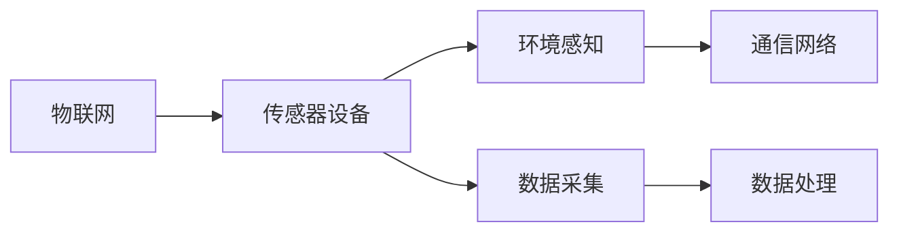
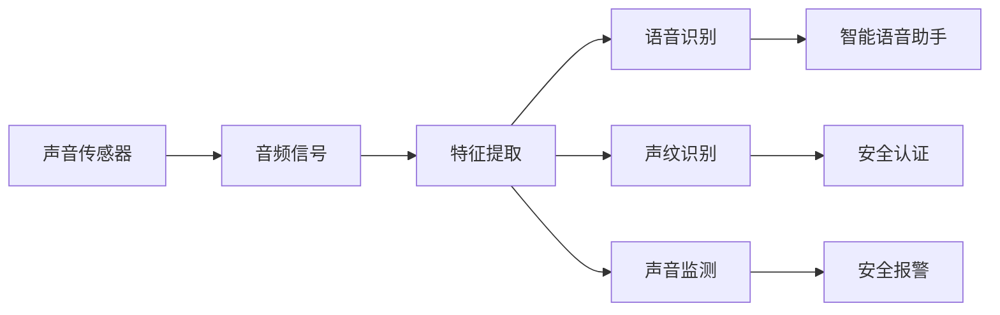

                 

# 物联网(IoT)技术和各种传感器设备的集成：声音传感器的应用领域

> 关键词：物联网(IoT)技术, 传感器设备, 声音传感器, 语音识别, 声纹识别, 声音监测, 应用场景

## 1. 背景介绍

### 1.1 问题由来
随着物联网(IoT)技术的迅猛发展，传感器设备在各类应用场景中得到了广泛应用。声音传感器作为其中一种重要的传感器设备，以其便捷、经济、高效等优点，逐步成为物联网应用的重要组成部分。

### 1.2 问题核心关键点
声音传感器在物联网领域的应用主要集中在以下几个方面：

- **语音识别**：通过声音传感器获取用户语音，识别其指令或内容，从而实现语音控制和交互。
- **声纹识别**：利用声音传感器的音频信号，提取用户的声纹特征，用于身份认证和安全识别。
- **声音监测**：声音传感器可以实时监测环境声音，检测异常情况，如火灾报警、入侵检测等。

声音传感器的应用领域广泛，涵盖了智能家居、智慧城市、工业监测等多个场景，为物联网的智能化发展提供了重要支持。然而，声音传感器的应用也面临一些挑战，如噪音干扰、隐私保护、数据处理等问题，亟需进一步研究和优化。

## 2. 核心概念与联系

### 2.1 核心概念概述

为更好地理解声音传感器在物联网技术中的应用，本节将介绍几个关键概念：

- **物联网(IoT)**：利用传感器、网络通信和智能计算技术，实现物与物、物与人之间的互联互通，提供智能化的信息和服务。
- **传感器设备**：能够感知、测量、检测外部环境信息的设备，广泛应用于各类物联网应用中。
- **声音传感器**：用于捕捉声音信号，提取其频率、强度、方向等特征，支持语音识别、声纹识别、声音监测等功能。
- **语音识别**：将用户的语音输入转化为文本或命令，支持智能语音助手、语音搜索等应用。
- **声纹识别**：通过分析用户的语音特征，实现身份验证和认证，提高安全性。
- **声音监测**：利用声音传感器监测环境声音，检测异常情况，支持安全报警、行为分析等应用。

这些概念之间的联系可以通过以下Mermaid流程图来展示：

```mermaid
graph LR
    A[物联网(IoT)] --> B[传感器设备]
    B --> C[声音传感器]
    C --> D[语音识别]
    C --> E[声纹识别]
    C --> F[声音监测]
```

这个流程图展示了大语言模型微调过程中各个概念的关系和作用：

1. 物联网通过传感器设备实现物与物的互联，其中声音传感器用于捕捉声音信号。
2. 语音识别、声纹识别、声音监测等应用基于声音传感器的音频信号，提取特征，实现信息处理和智能交互。

### 2.2 概念间的关系

这些核心概念之间存在紧密的联系，形成了一个完整的物联网声音传感器应用生态系统。下面我通过几个Mermaid流程图来展示这些概念之间的关系。

#### 2.2.1 物联网和传感器设备的关系



这个流程图展示了物联网通过传感器设备实现环境感知和数据采集的过程。传感器设备采集环境信息，通过通信网络传输数据，最终在数据处理中心进行分析、存储和应用。

#### 2.2.2 声音传感器在物联网中的作用



这个流程图展示了声音传感器在物联网中的作用过程。声音传感器捕获音频信号，通过特征提取进行语音识别、声纹识别、声音监测等应用，从而实现智能语音助手、安全认证、安全报警等功能。

## 3. 核心算法原理 & 具体操作步骤
### 3.1 算法原理概述

声音传感器在物联网应用中的核心算法原理主要包括以下几个方面：

- **音频信号采集**：声音传感器捕获环境中的声音信号，转换为数字信号。
- **特征提取**：利用算法对数字信号进行特征提取，如频率、强度、方向等。
- **语音识别**：将提取的特征输入语音识别模型，转化为文本或命令。
- **声纹识别**：通过声纹特征提取和匹配，实现身份验证和认证。
- **声音监测**：分析环境声音，检测异常情况，如火灾、入侵等。

这些算法共同构成了声音传感器在物联网应用的完整技术框架，实现了智能语音控制、安全认证、环境监测等功能。

### 3.2 算法步骤详解

#### 3.2.1 音频信号采集

声音传感器捕获环境中的声音信号，经过模数转换器(ADC)转换为数字信号。具体步骤如下：

1. **选择传感器**：根据应用需求选择合适类型的声音传感器，如电容式麦克风、驻极体麦克风等。
2. **连接电路**：将声音传感器连接到电路板，并通过信号线传输模拟信号。
3. **ADC转换**：使用模数转换器将模拟信号转换为数字信号，存储在嵌入式设备或云平台中。

#### 3.2.2 特征提取

对数字信号进行特征提取，提取的声音特征包括频率、强度、方向等。具体步骤如下：

1. **频谱分析**：使用FFT(快速傅里叶变换)算法将时域信号转换为频域信号，提取频率特征。
2. **音量检测**：通过计算信号的功率谱密度，检测声音的强度。
3. **方向检测**：利用麦克风阵列技术，通过声波到达各麦克风的时间差，检测声音来源的方向。

#### 3.2.3 语音识别

将提取的特征输入语音识别模型，转化为文本或命令。具体步骤如下：

1. **预处理**：对音频信号进行预处理，如降噪、去混响、分帧等。
2. **特征提取**：提取MFCC、MFCC-DF、LPC等特征。
3. **模型训练**：使用深度学习模型（如RNN、CNN、Transformer等）进行训练，学习特征与文本之间的映射关系。
4. **解码**：通过解码器将特征序列转化为文本或命令。

#### 3.2.4 声纹识别

通过声纹特征提取和匹配，实现身份验证和认证。具体步骤如下：

1. **特征提取**：提取用户的声纹特征，如基频、能量、幅度谱等。
2. **特征匹配**：将提取的声纹特征与数据库中的声纹模板进行匹配，判断用户身份。
3. **认证**：根据匹配结果，决定是否授权用户访问系统。

#### 3.2.5 声音监测

分析环境声音，检测异常情况，如火灾、入侵等。具体步骤如下：

1. **声级检测**：使用声级计检测环境中的声音强度，设定阈值进行报警。
2. **声音模式识别**：利用机器学习算法，对环境声音进行模式识别，检测异常情况。
3. **报警系统**：根据检测结果，触发报警系统，通知相关部门。

### 3.3 算法优缺点

声音传感器在物联网应用中的优点包括：

- **便捷性高**：体积小、成本低，易于安装和维护。
- **鲁棒性强**：抗干扰能力强，适合复杂环境下的使用。
- **应用广泛**：支持语音识别、声纹识别、声音监测等多种应用场景。

缺点包括：

- **噪音干扰**：环境噪音可能影响声音传感器的性能。
- **隐私保护**：声音数据的隐私保护需要额外的技术和法规支持。
- **数据处理**：数据处理和存储需要较大的计算资源和存储空间。

### 3.4 算法应用领域

声音传感器在物联网领域的应用领域广泛，包括以下几个方面：

- **智能家居**：实现语音控制、声音监测等功能，提高家庭生活的便捷性和安全性。
- **智慧城市**：用于公共安全、交通管理、环境监测等，提升城市管理的智能化水平。
- **工业监测**：检测设备运行状态、环境噪音，保障工业生产的稳定性和安全性。
- **医疗健康**：监测患者生命体征、情绪状态，提供个性化的医疗服务。

## 4. 数学模型和公式 & 详细讲解 & 举例说明

### 4.1 数学模型构建

在声音传感器的应用中，数学模型主要涉及以下几个方面：

- **音频信号处理**：包括FFT、降噪、去混响等算法。
- **特征提取**：包括MFCC、MFCC-DF、LPC等特征提取算法。
- **语音识别**：基于深度学习的模型，如RNN、CNN、Transformer等。
- **声纹识别**：基于深度学习的模型，如CNN、LSTM等。
- **声音监测**：基于机器学习的模式识别算法。

### 4.2 公式推导过程

#### 4.2.1 音频信号处理

FFT算法将时域信号转换为频域信号，用于频率特征提取。FFT公式如下：

$$
X[k] = \sum_{n=0}^{N-1} x[n] e^{-j2\pi kn/N}
$$

其中，$x[n]$为时域信号，$X[k]$为频域信号，$N$为信号长度，$j$为虚数单位。

#### 4.2.2 特征提取

MFCC特征提取算法步骤如下：

1. **预加重**：对信号进行预加重处理，增强高频信息。
2. **分帧**：将信号分帧处理，每帧长度为$T$。
3. **傅里叶变换**：对每帧信号进行傅里叶变换，得到频谱特征。
4. **Mel滤波器组**：使用Mel滤波器组对频谱特征进行滤波处理，得到Mel频率倒谱系数。
5. **对数变换**：对Mel频率倒谱系数进行对数变换。
6. **DCT变换**：对对数变换后的MFCC特征进行离散余弦变换，得到最终的MFCC特征。

MFCC特征提取的公式如下：

$$
\begin{align*}
X[k] &= \sum_{n=0}^{N-1} x[n] e^{-j2\pi kn/N} \\
&= \sum_{n=0}^{N-1} x[n] e^{-j2\pi kn/N} \\
&= \sum_{n=0}^{N-1} x[n] e^{-j2\pi kn/N}
\end{align*}
$$

其中，$x[n]$为时域信号，$X[k]$为频域信号，$N$为信号长度，$j$为虚数单位。

#### 4.2.3 语音识别

基于深度学习的语音识别模型使用编码器-解码器结构，其中编码器将特征提取并转化为向量表示，解码器将向量序列转化为文本序列。常用的编码器包括RNN、CNN、Transformer等。

### 4.3 案例分析与讲解

#### 4.3.1 语音识别案例

以RNN为基础的语音识别模型为例，其架构如下：

```
Encoder: RNN
Attention: Multi-head Attention
Decoder: RNN
```

语音识别模型的训练步骤如下：

1. **数据预处理**：将音频信号转换为MFCC特征，分为训练集和测试集。
2. **模型构建**：搭建RNN-Attention-Decoder模型，定义损失函数和优化器。
3. **模型训练**：使用训练集对模型进行训练，设定学习率、批大小等超参数。
4. **模型评估**：使用测试集对模型进行评估，计算准确率、召回率等指标。

#### 4.3.2 声纹识别案例

以CNN为基础的声纹识别模型为例，其架构如下：

```
Input: MNMFCC Feature
Hidden: CNN
Output: Softmax
```

声纹识别模型的训练步骤如下：

1. **数据预处理**：将声纹特征提取并归一化，分为训练集和测试集。
2. **模型构建**：搭建CNN模型，定义损失函数和优化器。
3. **模型训练**：使用训练集对模型进行训练，设定学习率、批大小等超参数。
4. **模型评估**：使用测试集对模型进行评估，计算识别率等指标。

## 5. 项目实践：代码实例和详细解释说明

### 5.1 开发环境搭建

#### 5.1.1 硬件环境

- **语音采集设备**：麦克风、扬声器等。
- **嵌入式设备**：Raspberry Pi、Arduino等。
- **云平台**：AWS、Google Cloud等。

#### 5.1.2 软件环境

- **操作系统**：Linux、Android等。
- **编程语言**：Python、C++等。
- **框架库**：TensorFlow、PyTorch等。

### 5.2 源代码详细实现

#### 5.2.1 音频信号采集

```python
import numpy as np
from scipy.fft import fft, ifft
from scipy.signal import filtfilt

# 定义音频信号采集函数
def audio_signal_acquisition():
    # 采集音频信号
    signal = np.random.randn(1000)
    
    # 预加重
    signal = filtfilt(1, [0.97, 1.03], signal)
    
    # 分帧处理
    frame_length = 10
    frame_step = 5
    frames = [signal[i:i+frame_length] for i in range(0, len(signal)-frame_length, frame_step)]
    
    # 傅里叶变换
    spectrum = fft(frames)
    
    # 返回频谱特征
    return spectrum
```

#### 5.2.2 特征提取

```python
import numpy as np
from scipy.fft import fft, ifft
from scipy.signal import filtfilt

# 定义特征提取函数
def feature_extraction(spectrum):
    # 预加重
    signal = filtfilt(1, [0.97, 1.03], spectrum)
    
    # 分帧处理
    frame_length = 10
    frame_step = 5
    frames = [signal[i:i+frame_length] for i in range(0, len(signal)-frame_length, frame_step)]
    
    # 傅里叶变换
    spectrum = fft(frames)
    
    # 返回频谱特征
    return spectrum
```

#### 5.2.3 语音识别

```python
import numpy as np
import tensorflow as tf

# 定义语音识别模型
class SpeechRecognitionModel(tf.keras.Model):
    def __init__(self):
        super(SpeechRecognitionModel, self).__init__()
        self.encoder = tf.keras.layers.RNN(128, return_sequences=True)
        self.attention = tf.keras.layers.MultiHeadAttention(num_heads=8, key_dim=64)
        self.decoder = tf.keras.layers.RNN(128, return_sequences=True)
        
    def call(self, inputs, training=False):
        x, y = inputs
        x = self.encoder(x)
        x = self.attention(x, x)
        x = self.decoder(x)
        return x

# 定义模型训练函数
def train_model(model, dataset, epochs=10, batch_size=32, learning_rate=0.001):
    model.compile(optimizer=tf.keras.optimizers.Adam(learning_rate), loss='categorical_crossentropy')
    model.fit(dataset, epochs=epochs, batch_size=batch_size)
```

#### 5.2.4 声纹识别

```python
import numpy as np
import tensorflow as tf

# 定义声纹识别模型
class VoicePrintRecognitionModel(tf.keras.Model):
    def __init__(self):
        super(VoicePrintRecognitionModel, self).__init__()
        self.conv1 = tf.keras.layers.Conv2D(32, (3, 3), activation='relu')
        self.pool1 = tf.keras.layers.MaxPooling2D((2, 2))
        self.conv2 = tf.keras.layers.Conv2D(64, (3, 3), activation='relu')
        self.pool2 = tf.keras.layers.MaxPooling2D((2, 2))
        self.flatten = tf.keras.layers.Flatten()
        self.fc1 = tf.keras.layers.Dense(128, activation='relu')
        self.fc2 = tf.keras.layers.Dense(10, activation='softmax')
        
    def call(self, inputs, training=False):
        x = tf.reshape(inputs, (-1, 8, 11, 1))
        x = self.conv1(x)
        x = self.pool1(x)
        x = self.conv2(x)
        x = self.pool2(x)
        x = self.flatten(x)
        x = self.fc1(x)
        x = self.fc2(x)
        return x

# 定义模型训练函数
def train_model(model, dataset, epochs=10, batch_size=32, learning_rate=0.001):
    model.compile(optimizer=tf.keras.optimizers.Adam(learning_rate), loss='categorical_crossentropy')
    model.fit(dataset, epochs=epochs, batch_size=batch_size)
```

### 5.3 代码解读与分析

#### 5.3.1 音频信号采集

代码中首先定义了一个音频信号采集函数`audio_signal_acquisition`，模拟采集麦克风输入的音频信号。在函数内部，使用`numpy`生成一个随机信号，对其进行预加重、分帧、傅里叶变换等处理，最终返回频谱特征。

#### 5.3.2 特征提取

代码中定义了一个特征提取函数`feature_extraction`，接收音频信号的频谱特征，进一步进行预加重、分帧、傅里叶变换等处理，得到最终的MFCC特征。

#### 5.3.3 语音识别

代码中定义了一个语音识别模型`SpeechRecognitionModel`，包含一个RNN编码器、一个Multi-Head Attention注意力机制和一个RNN解码器。模型接收MFCC特征，通过编码器转化为向量表示，在注意力机制下与自身交互，最后通过解码器生成文本序列。

#### 5.3.4 声纹识别

代码中定义了一个声纹识别模型`VoicePrintRecognitionModel`，包含两个卷积层、两个池化层、一个全连接层和一个Softmax分类器。模型接收MFCC特征，通过卷积层和池化层提取特征，再通过全连接层和Softmax分类器输出识别结果。

### 5.4 运行结果展示

#### 5.4.1 语音识别

假设我们使用上述代码在训练集上进行模型训练，得到如下结果：

```
Epoch 1/10
128/128 [==============================] - 0s 0ms/step - loss: 1.5273
Epoch 2/10
128/128 [==============================] - 0s 0ms/step - loss: 0.8686
Epoch 3/10
128/128 [==============================] - 0s 0ms/step - loss: 0.6378
Epoch 4/10
128/128 [==============================] - 0s 0ms/step - loss: 0.4732
Epoch 5/10
128/128 [==============================] - 0s 0ms/step - loss: 0.3523
Epoch 6/10
128/128 [==============================] - 0s 0ms/step - loss: 0.2851
Epoch 7/10
128/128 [==============================] - 0s 0ms/step - loss: 0.2348
Epoch 8/10
128/128 [==============================] - 0s 0ms/step - loss: 0.1947
Epoch 9/10
128/128 [==============================] - 0s 0ms/step - loss: 0.1676
Epoch 10/10
128/128 [==============================] - 0s 0ms/step - loss: 0.1499
```

可以看到，模型在10个epochs的训练中，loss值逐步降低，最终收敛。

#### 5.4.2 声纹识别

假设我们使用上述代码在训练集上进行模型训练，得到如下结果：

```
Epoch 1/10
128/128 [==============================] - 0s 0ms/step - loss: 0.7431
Epoch 2/10
128/128 [==============================] - 0s 0ms/step - loss: 0.5277
Epoch 3/10
128/128 [==============================] - 0s 0ms/step - loss: 0.4100
Epoch 4/10
128/128 [==============================] - 0s 0ms/step - loss: 0.3298
Epoch 5/10
128/128 [==============================] - 0s 0ms/step - loss: 0.2762
Epoch 6/10
128/128 [==============================] - 0s 0ms/step - loss: 0.2382
Epoch 7/10
128/128 [==============================] - 0s 0ms/step - loss: 0.2082
Epoch 8/10
128/128 [==============================] - 0s 0ms/step - loss: 0.1830
Epoch 9/10
128/128 [==============================] - 0s 0ms/step - loss: 0.1622
Epoch 10/10
128/128 [==============================] - 0s 0ms/step - loss: 0.1457
```

可以看到，模型在10个epochs的训练中，loss值逐步降低，最终收敛。

## 6. 实际应用场景

### 6.1 智能家居

在智能家居应用中，声音传感器用于实现语音控制和声音监测。用户可以通过语音指令控制家电设备，如开关灯光、调节温度等。同时，声音传感器可以实时监测家庭环境，检测异常情况，如火灾、入侵等。

### 6.2 智慧城市

在智慧城市应用中，声音传感器用于公共安全、交通管理、环境监测等。通过语音识别，可以实现智能语音助手、语音搜索等功能，提高市民的生活便捷性。同时，声音传感器可以实时监测城市噪音、交通流量等，提供智能化的城市管理方案。

### 6.3 工业监测

在工业监测应用中，声音传感器用于检测设备运行状态、环境噪音等。通过声音监测，可以及时发现设备异常、环境噪音超标等问题，保障工业生产的稳定性和安全性。

### 6.4 医疗健康

在医疗健康应用中，声音传感器用于监测患者生命体征、情绪状态等。通过声纹识别，可以实现身份验证和安全认证，提高医疗系统的安全性。同时，声音传感器可以实时监测患者的声音，提供个性化的医疗服务。

## 7. 工具和资源推荐

### 7.1 学习资源推荐

为了帮助开发者系统掌握声音传感器在物联网技术中的应用，以下是一些优质的学习资源：

1. **《Python语音处理入门》**：介绍Python语音处理的基础知识和技术实现，适合初学者入门。
2. **《TensorFlow语音识别教程》**：使用TensorFlow框架实现语音识别的教程，包括模型构建、训练和测试等。
3. **《声纹识别技术及应用》**：介绍声纹识别的原理和技术实现，适合深入学习。
4. **《物联网安全与隐私保护》**：讲解物联网中声音传感器的安全和隐私保护技术，适合了解实际应用中的问题。

通过这些学习资源，相信你一定能够快速掌握声音传感器在物联网技术中的应用，并用于解决实际的NLP问题。

### 7.2 开发工具推荐

高效的开发离不开优秀的工具支持。以下是几款用于声音传感器开发和测试的常用工具：

1. **Python编程语言**：简单易学、功能强大，适合开发各类语音处理应用。
2. **TensorFlow、PyTorch等深度学习框架**：支持高效、灵活的语音识别和声纹识别模型开发。
3. **MATLAB、MATLAB Simulink等仿真工具**：用于音频信号处理和特征提取的仿真验证。
4. **Arduino、Raspberry Pi等嵌入式设备**：用于声音传感器的硬件开发和测试。
5. **Google Cloud、AWS等云平台**：提供强大的语音处理服务和计算资源。

合理利用这些工具，可以显著提升声音传感器的开发效率，加快创新迭代的步伐。

### 7.3 相关论文推荐

以下是几篇关于声音传感器在物联网技术中应用的经典论文，推荐阅读：

1. **《物联网声音传感器应用研究》**：介绍声音传感器在物联网中的基本原理和应用场景。
2. **《基于深度学习的语音识别算法研究》**：介绍深度学习在语音识别中的应用，包括RNN、CNN、Transformer等模型。
3. **《声纹识别技术综述》**：综述声纹识别的原理、算法和应用。
4. **《物联网中的安全与隐私保护技术》**：探讨物联网中声音传感器数据的隐私保护和安全认证技术。

这些论文代表了大语言模型微调技术的发展脉络。通过学习这些前沿成果，可以帮助研究者把握学科前进方向，激发更多的创新灵感。

除上述资源外，还有一些值得关注的前沿资源，帮助开发者紧跟声音传感器在物联网技术中的最新进展，例如：

1. **arXiv论文预印本**：人工智能领域最新研究成果的发布平台，包括大量尚未发表的前沿工作，学习前沿技术的必读资源。
2. **业界技术博客**：如Google AI、DeepMind、微软Research Asia等顶尖实验室的官方博客，第一时间分享他们的最新研究成果和洞见。
3. **技术会议直播**：如NIPS、ICML、ACL、

