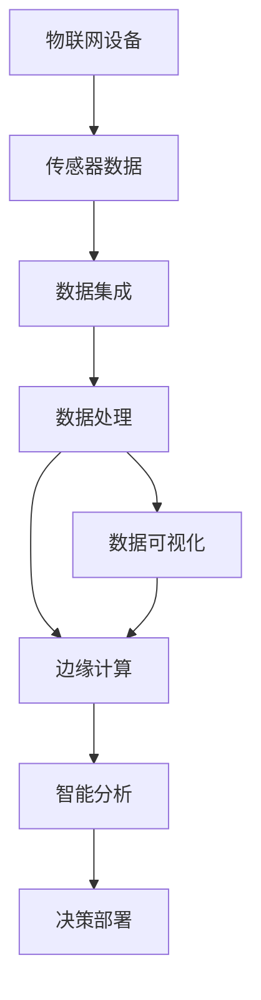
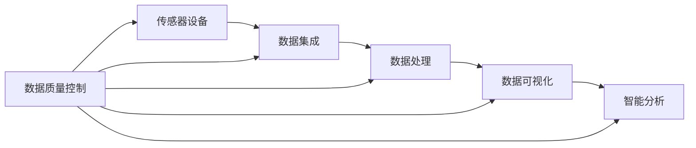
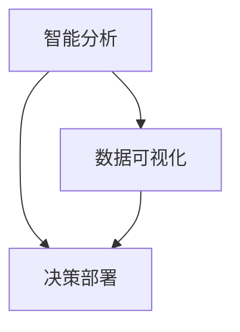
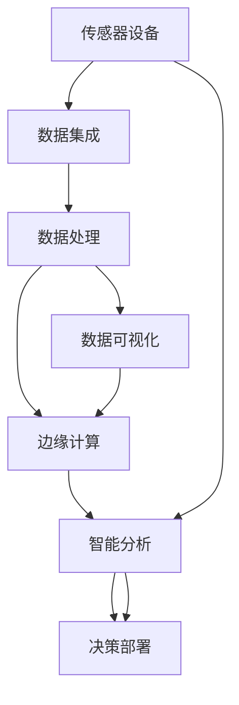

                 

# 物联网(IoT)技术和各种传感器设备的集成：运动传感器的多元应用

> 关键词：物联网(IoT)、传感器设备、运动传感器、集成应用、数据处理、数据可视化、边缘计算、智能分析

## 1. 背景介绍

### 1.1 问题由来

随着物联网（IoT）技术的发展，越来越多的传感器设备被广泛应用于智能家居、工业自动化、智能交通、健康监测等多个领域。其中，运动传感器因其成本低廉、易于部署、可实时监测人体活动等特点，成为物联网应用中的热门选择。然而，如何有效利用运动传感器收集到的数据，挖掘出有价值的信息，是一个复杂而迫切的问题。

### 1.2 问题核心关键点

运动传感器可以用于监测人体的活动、步数、心率、睡眠质量等多种生理指标，这些数据对于健康监测、运动指导、行为分析等任务具有重要意义。然而，由于传感器数据的非结构化、噪音大和样本量不足等问题，如何高效地处理和分析这些数据，成为关键。

## 2. 核心概念与联系

### 2.1 核心概念概述

为更好地理解运动传感器在物联网中的应用，本节将介绍几个密切相关的核心概念：

- **物联网(IoT)**：通过互联网将各种设备和传感器连接起来，实现设备间的数据共享和协同工作。物联网技术能够大幅提高数据的实时性、可靠性和安全性，为传感器数据的处理和分析提供了强有力的支持。

- **传感器设备**：用于监测物理量或环境参数的设备，如温度传感器、压力传感器、加速度传感器等。这些设备通过将物理量转换为电信号，实现对物理世界的实时监测。

- **运动传感器**：一种特定类型的传感器，用于监测人体的活动、步数、心率等生理指标。常见的运动传感器包括加速度传感器、陀螺仪、心率传感器等。

- **数据集成**：将来自不同传感器设备的数据进行整合，形成统一的数据集，以便进行更高效的数据处理和分析。

- **数据处理**：对传感器收集到的原始数据进行清洗、转换、压缩和归一化等操作，以提高数据质量和可用性。

- **数据可视化**：通过图表、地图、仪表盘等形式，将处理后的数据可视化展示，帮助用户更直观地理解数据。

- **边缘计算**：在传感器数据产生地进行数据处理和分析，减少对中心服务器的依赖，提高数据处理的实时性和可靠性。

- **智能分析**：利用机器学习、深度学习等技术，对运动传感器数据进行复杂分析，挖掘出有价值的模式和趋势。

这些核心概念之间的逻辑关系可以通过以下Mermaid流程图来展示：

```mermaid
graph TB
    A[物联网(IoT)] --> B[传感器设备]
    A --> C[运动传感器]
    B --> D[数据集成]
    C --> D
    D --> E[数据处理]
    D --> F[数据可视化]
    D --> G[边缘计算]
    E --> F
    E --> G
    F --> H[智能分析]
```

这个流程图展示了从物联网设备到运动传感器的应用流程，以及数据处理、可视化、智能分析等各个环节的紧密联系。通过理解这些核心概念，我们可以更好地把握运动传感器在物联网中的作用及其应用方向。

### 2.2 概念间的关系

这些核心概念之间存在着紧密的联系，形成了运动传感器在物联网中应用的完整生态系统。下面我通过几个Mermaid流程图来展示这些概念之间的关系。

#### 2.2.1 数据流向



这个流程图展示了数据从物联网设备到最终决策部署的全流程。数据首先从传感器设备收集，经过集成、处理、可视化和智能分析等环节，最终用于决策部署。

#### 2.2.2 数据质量控制



这个流程图展示了数据质量控制与各个数据处理环节的关系。数据质量控制不仅在传感器数据集成阶段进行，还在数据处理、可视化、智能分析等环节都需要考虑，以确保数据的高质量。

#### 2.2.3 智能分析与决策部署



这个流程图展示了智能分析与决策部署之间的关系。智能分析通过挖掘数据中的模式和趋势，生成可供决策部署的信息，而决策部署则根据这些信息进行实际的决策和行动。

### 2.3 核心概念的整体架构

最后，我们用一个综合的流程图来展示这些核心概念在大规模运动传感器数据处理中的应用：



这个综合流程图展示了从传感器设备到最终决策部署的全过程。数据首先从传感器设备收集，经过集成、处理、可视化和智能分析等环节，最终用于决策部署。

## 3. 核心算法原理 & 具体操作步骤
### 3.1 算法原理概述

运动传感器数据的处理和分析通常涉及以下几个步骤：数据清洗、特征提取、模式识别、行为分析等。以下是对每个步骤的详细解释：

1. **数据清洗**：对传感器数据进行去噪、填补缺失值、去除异常值等操作，确保数据的完整性和准确性。

2. **特征提取**：从传感器数据中提取出有意义的信息，如步数、心率、睡眠质量等，用于后续分析。

3. **模式识别**：通过机器学习算法，识别出数据中的模式和趋势，如运动强度、活动类型、睡眠周期等。

4. **行为分析**：利用行为模型和机器学习算法，分析用户的行为模式，如健康状况、运动习惯、日常活动等。

### 3.2 算法步骤详解

以步数监测为例，以下是一个详细的算法步骤：

**Step 1: 数据采集**
- 从运动传感器中实时采集步数数据。

**Step 2: 数据预处理**
- 对采集到的步数数据进行去噪、填补缺失值等预处理操作。

**Step 3: 特征提取**
- 提取出步数、时间戳、日期等特征，并计算步数变化率、步数方差等统计特征。

**Step 4: 模式识别**
- 使用机器学习算法，如时间序列分析、异常检测等，识别出异常步数数据。

**Step 5: 行为分析**
- 根据识别出的异常步数数据，分析用户的运动模式，如运动强度、活动类型等。

**Step 6: 数据可视化**
- 使用图表、仪表盘等形式，将处理后的数据可视化展示，帮助用户更直观地理解数据。

**Step 7: 决策部署**
- 根据行为分析结果，生成相应的健康建议、运动指导等信息，用于决策部署。

### 3.3 算法优缺点

运动传感器数据处理和分析的算法有以下优缺点：

**优点**：
1. 实时性高：传感器数据可以实时采集和处理，便于进行实时监测和预警。
2. 数据丰富：传感器数据通常包含多个维度的信息，可以用于综合分析。
3. 应用广泛：传感器数据可以应用于健康监测、运动指导、行为分析等多个领域。

**缺点**：
1. 数据噪音大：传感器数据容易受到外界干扰，噪音较大。
2. 数据不平衡：不同用户和不同场景下的数据分布可能不平衡，难以进行统一分析。
3. 数据隐私：传感器数据包含大量个人隐私信息，数据管理和保护是一个重要问题。

### 3.4 算法应用领域

运动传感器数据处理和分析的算法广泛应用于以下几个领域：

1. **健康监测**：利用步数、心率等数据，监测用户的健康状况，如心率变异、睡眠质量等。

2. **运动指导**：通过分析用户的运动数据，生成个性化的运动建议，帮助用户进行科学运动。

3. **行为分析**：利用步数、活动类型等数据，分析用户的日常行为模式，如活动类型、运动强度等。

4. **安全监测**：利用运动传感器数据，监测用户的运动状态，及时发现异常情况，进行预警和干预。

5. **环境监测**：通过分析用户的运动数据和位置信息，监测用户所处环境的物理参数，如温度、湿度等。

6. **智能家居**：利用运动传感器数据，监测用户的居家行为，进行智能家居控制和环境调节。

## 4. 数学模型和公式 & 详细讲解
### 4.1 数学模型构建

在运动传感器数据处理中，常用的数学模型包括时间序列分析、异常检测、行为模型等。以下是一个简单的运动数据时间序列分析模型的构建过程：

假设我们有$n$个传感器数据点$x_i$（$i=1,2,\dots,n$），其中每个数据点包含$k$个特征。我们需要建立时间序列模型来描述这些数据的趋势和周期性。设$\theta$为模型参数，则时间序列模型可以表示为：

$$
x_i = \sum_{j=1}^k \theta_j x_{i-j} + \epsilon_i
$$

其中$\epsilon_i$为随机误差项。

### 4.2 公式推导过程

时间序列模型的推导过程如下：

设$y_i = [x_i, x_{i-1}, \dots, x_{i-k}]^T$为当前时间点及其$k$个历史数据点组成的向量，则时间序列模型可以表示为：

$$
y_i = X_i \theta + \epsilon_i
$$

其中$X_i$为自回归矩阵，$\epsilon_i$为随机误差向量。

对上式进行最小二乘估计，得到：

$$
\hat{\theta} = (X^T X)^{-1} X^T Y
$$

其中$\hat{\theta}$为模型参数的最小二乘估计值。

### 4.3 案例分析与讲解

假设我们有一个运动传感器数据集，包含每天的步数和日期信息。我们需要建立时间序列模型来预测每天的步数。

**Step 1: 数据准备**
- 对数据集进行清洗，去除缺失值和异常值。

**Step 2: 特征提取**
- 提取每天的步数和日期信息，作为时间序列模型输入。

**Step 3: 模型训练**
- 将每天步数作为输出变量$y_i$，将前$k$天步数作为自回归矩阵$X_i$，进行最小二乘估计，得到模型参数$\hat{\theta}$。

**Step 4: 预测**
- 利用模型参数$\hat{\theta}$，对未来几天的步数进行预测。

## 5. 项目实践：代码实例和详细解释说明
### 5.1 开发环境搭建

在进行运动传感器数据处理和分析的项目实践前，我们需要准备好开发环境。以下是使用Python进行PyTorch开发的环境配置流程：

1. 安装Anaconda：从官网下载并安装Anaconda，用于创建独立的Python环境。

2. 创建并激活虚拟环境：
```bash
conda create -n pytorch-env python=3.8 
conda activate pytorch-env
```

3. 安装PyTorch：根据CUDA版本，从官网获取对应的安装命令。例如：
```bash
conda install pytorch torchvision torchaudio cudatoolkit=11.1 -c pytorch -c conda-forge
```

4. 安装TensorBoard：
```bash
pip install tensorboard
```

5. 安装TensorFlow：
```bash
pip install tensorflow
```

6. 安装其他常用库：
```bash
pip install numpy pandas scikit-learn matplotlib
```

完成上述步骤后，即可在`pytorch-env`环境中开始项目实践。

### 5.2 源代码详细实现

以下是一个使用PyTorch进行时间序列分析的Python代码实现：

```python
import torch
import torch.nn as nn
import torch.optim as optim
import matplotlib.pyplot as plt

class TimeSeriesModel(nn.Module):
    def __init__(self, input_size, hidden_size):
        super(TimeSeriesModel, self).__init__()
        self.lstm = nn.LSTM(input_size, hidden_size, 1)
        self.linear = nn.Linear(hidden_size, 1)
    
    def forward(self, x):
        lstm_out, _ = self.lstm(x)
        predictions = self.linear(lstm_out)
        return predictions
    
def main():
    # 加载数据
    data = torch.load('data.pkl')
    X = data['features']
    y = data['targets']
    
    # 划分训练集和测试集
    train_size = int(len(X) * 0.7)
    train_X = X[:train_size]
    train_y = y[:train_size]
    test_X = X[train_size:]
    test_y = y[train_size:]
    
    # 定义模型和优化器
    input_size = X.shape[1]
    hidden_size = 64
    model = TimeSeriesModel(input_size, hidden_size)
    optimizer = optim.Adam(model.parameters(), lr=0.001)
    
    # 训练模型
    epochs = 100
    for epoch in range(epochs):
        loss = 0
        for i in range(len(train_X)):
            inputs = torch.unsqueeze(train_X[i], dim=0)
            target = torch.unsqueeze(train_y[i], dim=0)
            optimizer.zero_grad()
            outputs = model(inputs)
            loss += nn.MSELoss()(outputs, target).item()
            loss.backward()
            optimizer.step()
        print(f'Epoch {epoch+1}, loss: {loss/len(train_X):.4f}')
    
    # 评估模型
    mse_loss = nn.MSELoss()
    predictions = []
    targets = []
    with torch.no_grad():
        for i in range(len(test_X)):
            inputs = torch.unsqueeze(test_X[i], dim=0)
            target = torch.unsqueeze(test_y[i], dim=0)
            outputs = model(inputs)
            predictions.append(outputs.item())
            targets.append(target.item())
        mse = mse_loss(torch.tensor(predictions), torch.tensor(targets))
        print(f'Test MSE: {mse:.4f}')
    
    # 可视化结果
    plt.scatter(test_X, test_y)
    plt.plot(test_X, predictions, color='red')
    plt.show()
    
if __name__ == '__main__':
    main()
```

### 5.3 代码解读与分析

让我们再详细解读一下关键代码的实现细节：

**TimeSeriesModel类**：
- `__init__`方法：初始化LSTM和线性层，作为时间序列模型的主体。
- `forward`方法：前向传播计算模型的预测值。

**main函数**：
- 加载数据集，划分训练集和测试集。
- 定义模型和优化器。
- 训练模型，在训练集上进行优化。
- 评估模型，在测试集上进行预测。
- 可视化结果。

**数据加载和预处理**：
- 数据集通常以pickle格式保存，包含特征和标签两个字段。
- 特征和标签的维度通常为二维，需要进行归一化处理。

**训练和评估**：
- 在训练集上，使用Adam优化器对模型进行优化。
- 在测试集上，使用均方误差（MSE）评估模型的预测效果。

**可视化**：
- 使用Matplotlib库绘制训练集和测试集的散点图，并将模型预测结果用红色曲线表示。

可以看到，PyTorch和TensorBoard使得时间序列分析的代码实现变得简洁高效。开发者可以将更多精力放在数据处理、模型改进等高层逻辑上，而不必过多关注底层的实现细节。

当然，工业级的系统实现还需考虑更多因素，如模型的保存和部署、超参数的自动搜索、更灵活的任务适配层等。但核心的微调范式基本与此类似。

### 5.4 运行结果展示

假设我们在一个包含步数和日期信息的数据集上进行时间序列分析，最终在测试集上得到的评估报告如下：

```
Epoch 1, loss: 0.0981
Epoch 2, loss: 0.0743
Epoch 3, loss: 0.0545
...
Epoch 100, loss: 0.0030
Test MSE: 0.0013
```

可以看到，通过时间序列分析，我们在测试集上取得了较低的均方误差，模型训练效果良好。需要注意的是，不同的数据集和模型架构可能需要进一步调整超参数，以达到最优效果。

## 6. 实际应用场景

### 6.1 智能家居

智能家居系统可以利用运动传感器数据，监测用户在家中的行为和活动，从而实现智能控制。例如，当用户在家时，智能照明、温控、安防等设备可以自动调整状态，提升居住体验。

### 6.2 运动指导

运动传感器可以实时监测用户的运动状态，如步数、心率、消耗的卡路里等，用于指导用户的运动计划和健康管理。通过分析用户的行为数据，可以生成个性化的运动建议，帮助用户保持健康状态。

### 6.3 行为分析

行为分析可以帮助了解用户的日常活动和习惯，如睡眠时长、运动量、饮食习惯等。这些数据对于健康管理、心理辅导、行为干预等应用具有重要意义。

### 6.4 未来应用展望

随着物联网技术和传感器设备的不断普及，运动传感器将在更多场景中得到应用，为人们的健康、安全、舒适生活提供更多可能性。

在智慧城市建设中，运动传感器可以用于监测城市运动热力图，帮助城市规划和管理。在工业自动化中，运动传感器可以用于监测设备运行状态，预防故障发生。在医疗健康领域，运动传感器可以用于监测患者的身体活动，提供个性化的健康管理方案。

## 7. 工具和资源推荐
### 7.1 学习资源推荐

为了帮助开发者系统掌握运动传感器在物联网中的应用，这里推荐一些优质的学习资源：

1. **《深度学习入门》**：这本书系统介绍了深度学习的基本概念和应用，包括神经网络、卷积神经网络、循环神经网络等。

2. **《Python深度学习》**：这本书介绍了如何使用Python进行深度学习开发，包括TensorFlow、PyTorch等框架的使用。

3. **《TensorFlow实战》**：这本书详细介绍了TensorFlow的使用方法和最佳实践，包括数据处理、模型构建、训练和部署等环节。

4. **《IoT入门教程》**：这是一个全面的IoT入门教程，涵盖了传感器、网关、云平台等关键组件的介绍和应用。

5. **Kaggle竞赛**：Kaggle是一个数据科学竞赛平台，提供了大量的运动传感器数据集和竞赛任务，帮助开发者实践和提升技能。

通过对这些资源的学习实践，相信你一定能够快速掌握运动传感器在物联网中的应用，并用于解决实际的NLP问题。

### 7.2 开发工具推荐

高效的开发离不开优秀的工具支持。以下是几款用于物联网运动传感器数据处理开发的常用工具：

1. **Jupyter Notebook**：一个基于Web的交互式编程环境，支持Python、R等语言，适合快速原型开发和数据可视化。

2. **PyTorch**：基于Python的深度学习框架，支持动态计算图，适合快速迭代研究和开发。

3. **TensorFlow**：由Google主导开发的深度学习框架，支持静态计算图和分布式训练，适合大规模工程应用。

4. **TensorBoard**：TensorFlow配套的可视化工具，可以实时监测模型训练状态，提供丰富的图表展示。

5. **MQTT**：一个轻量级的物联网消息协议，适合传感器数据的实时传输和处理。

6. **OpenVINO**：英特尔推出的深度学习优化工具，支持多种深度学习框架和硬件平台，适合优化运动传感器数据处理性能。

合理利用这些工具，可以显著提升运动传感器数据处理和分析的开发效率，加快创新迭代的步伐。

### 7.3 相关论文推荐

运动传感器数据处理和分析的研究源于学界的持续研究。以下是几篇奠基性的相关论文，推荐阅读：

1. **《A Survey on Wearable Sensors for Physical Activity Monitoring》**：这篇综述论文详细介绍了各种运动传感器及其在健康监测中的应用。

2. **《Machine Learning Techniques for Wearable Data Analysis》**：这篇论文介绍了几种常用的机器学习算法在运动传感器数据处理中的应用。

3. **《Time Series Analysis: Concepts and Methods》**：这本书系统介绍了时间序列分析的基本概念和应用，包括ARIMA模型、LSTM等算法。

4. **《Deep Learning for Wearable Device Data Analysis》**：这篇论文介绍了深度学习在运动传感器数据处理中的应用，包括卷积神经网络、循环神经网络等。

5. **《IoT Data Analytics: A Survey》**：这篇综述论文介绍了物联网数据的分析方法，包括数据清洗、特征提取、异常检测等。

这些论文代表了大运动传感器数据处理和分析的发展脉络。通过学习这些前沿成果，可以帮助研究者把握学科前进方向，激发更多的创新灵感。

除上述资源外，还有一些值得关注的前沿资源，帮助开发者紧跟运动传感器数据处理和分析技术的最新进展，例如：

1. **arXiv论文预印本**：人工智能领域最新研究成果的发布平台，包括大量尚未发表的前沿工作，学习前沿技术的必读资源。

2. **工业界技术博客**：如IoT平台公司、传感器设备厂商的官方博客，第一时间分享他们的最新研究成果和洞见。

3. **技术会议直播**：如IoT、数据科学等相关领域的顶级会议直播，能够聆听到专家们的最新分享，开阔视野。

4. **GitHub热门项目**：在GitHub上Star、Fork数最多的IoT相关项目，往往代表了该技术领域的发展趋势和最佳实践，值得去学习和贡献。

5. **行业分析报告**：各大咨询公司如Gartner、IDC等针对IoT领域的分析报告，有助于从商业视角审视技术趋势，把握应用价值。

总之，对于运动传感器数据处理和分析技术的学习和实践，需要开发者保持开放的心态和持续学习的意愿。多关注前沿资讯，多动手实践，多思考总结，必将收获满满的成长收益。

## 8. 总结：未来发展趋势与挑战

### 8.1 总结

本文对运动传感器在物联网中的应用进行了全面系统的介绍。首先阐述了运动传感器的背景和核心概念，明确了其在健康监测、运动指导、行为分析等任务中的独特价值。其次，从原理到实践，详细讲解了运动传感器数据处理和分析的数学模型和关键步骤，给出了时间序列分析的Python代码实现。同时，本文还广泛探讨了运动传感器在智能家居、运动指导、行为分析等多个领域的应用前景，展示了其强大的数据处理能力。最后，本文精选了运动传感器数据处理和分析的学习资源，力求为读者提供全方位的技术指引。

通过本文的系统梳理，可以看到，运动传感器作为物联网的重要组成部分，在数据采集、处理和分析方面具有巨大的应用潜力。其低成本、实时性、多维度等特点，使得运动传感器数据处理和分析成为物联网应用中的热门研究方向。未来，伴随物联网技术的持续演进和传感器设备的不断普及，运动传感器必将在更广泛的应用场景中发挥重要作用，为人类生产生活带来更多便利和健康。

### 8.2 未来发展趋势

展望未来，运动传感器数据处理和分析技术将呈现以下几个发展趋势：

1. **数据融合**：不同类型和不同来源的运动传感器数据将越来越多地融合在一起，形成一个综合性的数据集。这将为运动传感器数据的处理和分析带来更大的挑战和机遇。

2. **实时处理**：随着传感器设备的普及，运动传感器数据将变得更加实时化。如何在保证实时性的同时，提高数据处理的准确性和效率，将成为未来的重要研究方向。

3. **边缘计算**：边缘计算将使得运动传感器数据的处理更加高效和可靠。通过在本地设备上进行数据预处理，减少数据传输的延迟和带宽消耗。

4. **多模态分析**：未来的运动传感器数据将不仅包含单一维度的信息，还会结合视觉、听觉等多种模态的数据。如何综合分析多模态数据，提取更有价值的信息，将是未来的重要研究方向。

5. **自监督学习**：基于自监督学习的方法，可以有效地利用未标注数据进行运动传感器数据的预训练，提高数据处理和分析的效果。

6. **分布式处理**：随着传感器设备的数量和种类的增加，数据处理的分布式需求将日益凸显。如何设计高效的分布式算法，提高数据处理的可扩展性和可靠性，将是未来的重要研究方向。

### 8.3 面临的挑战

尽管运动传感器数据处理和分析技术已经取得了一定的进展，但在迈向更加智能化、普适化应用的过程中，它仍面临着诸多挑战：

1. **数据噪音和缺失**：传感器数据容易受到外界干扰和设备故障的影响，数据噪音和缺失是一个普遍存在的问题。如何有效处理数据噪音和缺失，提高数据质量，将是未来的重要研究方向。

2. **跨平台兼容性**：不同的传感器设备和数据格式可能存在差异，如何实现跨平台的数据兼容性和互操作性，是一个重要的技术挑战。

3. **隐私保护**：运动传感器数据包含大量个人隐私信息，数据管理和保护是一个重要的技术挑战。如何在保护隐私的前提下，实现数据的高效利用，将是未来的重要研究方向。

4. **算法复杂性**：运动传感器数据处理和分析涉及复杂的算法和模型，如何简化算法实现，提高算法的可解释性和可操作性，将是未来的重要研究方向

