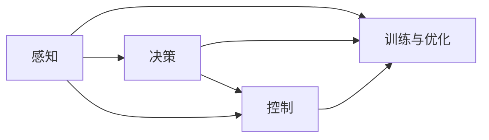

                 

# 特斯拉、华为、小鹏的端到端智驾系统

## 1. 背景介绍

随着自动驾驶技术逐渐从科幻变为现实，各大汽车公司纷纷投身这一领域。特斯拉、华为、小鹏等企业以其先进的端到端智能驾驶系统引领了潮流。这些系统集成了感知、决策和控制等多个模块，能够在复杂的城市道路上实现自动驾驶，展示了未来交通的无限可能。

在本文中，我们将系统地介绍特斯拉、华为、小鹏等公司的端到端智能驾驶系统，并分析其核心技术、架构设计、性能特点及未来发展方向。

## 2. 核心概念与联系

### 2.1 核心概念概述

为理解特斯拉、华为、小鹏等公司的端到端智能驾驶系统，我们需要了解几个关键概念：

- **端到端系统（End-to-End System）**：指从传感器数据输入到车辆控制输出的全流程系统，每个模块之间协同工作，实现自动驾驶功能。

- **感知（Perception）**：通过摄像头、激光雷达、毫米波雷达等传感器，实时采集车辆周围环境数据，并转换为计算机可以处理的形式。

- **决策（Decision Making）**：基于感知数据，利用深度学习、强化学习等算法，进行路径规划、行为预测、交通灯识别等任务。

- **控制（Control）**：根据决策结果，生成车辆控制指令，执行转向、加速、制动等动作，确保车辆按照预期路径行驶。

- **训练与优化（Training and Optimization）**：在大量现实数据上进行监督学习和强化学习，不断调整模型参数，提升系统性能。

这些概念相互关联，共同构成了智能驾驶系统的主要组成部分。接下来，我们将具体探讨各模块的设计原理和架构。

### 2.2 核心概念的联系

这些核心概念之间有着紧密的联系，通过以下Mermaid流程图展示它们的交互关系：



感知模块负责数据采集，决策模块对感知数据进行分析，控制模块根据决策结果执行动作，训练与优化模块则持续训练模型，提高系统性能。

## 3. 核心算法原理 & 具体操作步骤
### 3.1 算法原理概述

特斯拉、华为、小鹏等公司的端到端智能驾驶系统主要采用了深度学习技术，特别是卷积神经网络（CNN）和循环神经网络（RNN），实现了从传感器数据到车辆控制的全流程自动化。

系统整体架构可以分为以下几个部分：

- **感知模块**：通过摄像头、激光雷达等传感器，实时获取车辆周围环境数据。
- **决策模块**：利用深度学习算法，对感知数据进行语义理解和行为预测，生成路径规划和行为决策。
- **控制模块**：根据决策结果，生成车辆控制指令，执行转向、加速、制动等动作。
- **训练与优化模块**：在大量现实数据上进行监督学习和强化学习，不断调整模型参数，提升系统性能。

### 3.2 算法步骤详解

以特斯拉的自动驾驶系统为例，其核心算法步骤包括：

1. **传感器数据融合**：通过摄像头、激光雷达、毫米波雷达等传感器，采集车辆周围环境数据，并使用SLAM算法进行数据融合，生成高精度的地图。

2. **目标检测与跟踪**：利用深度学习模型（如YOLO、SSD）进行目标检测，使用卡尔曼滤波等算法进行目标跟踪，确保对周围环境中的物体有稳定的识别和位置估计。

3. **行为预测**：基于检测到的物体，利用深度学习模型（如LSTM）进行行为预测，预测周围物体的动作趋势，包括车辆、行人的行驶轨迹、加速度、速度等。

4. **路径规划**：结合感知和预测结果，利用深度学习模型（如PPO）进行路径规划，生成最优行驶路径，考虑交通规则、道路条件等因素。

5. **行为决策**：根据路径规划结果，生成具体的车辆控制指令，包括转向、加速、制动等，确保车辆按照预期路径行驶。

6. **实时调整**：在执行过程中，不断接收新的感知数据，根据环境变化实时调整决策和控制策略，确保系统稳定性。

### 3.3 算法优缺点

**优点：**

1. **端到端设计**：系统各模块紧密集成，提升了系统整体效率和可靠性。
2. **数据驱动**：大量现实数据用于训练和优化，确保了系统的通用性和鲁棒性。
3. **实时性**：通过高效的算法设计，系统能够实时处理传感器数据，确保了自动驾驶的即时响应。

**缺点：**

1. **计算资源需求高**：传感器数据量庞大，算法复杂，对计算资源要求较高。
2. **环境适应性差**：在极端天气和复杂环境中，系统性能可能受到影响。
3. **安全保障不足**：完全自动驾驶仍然面临技术上的不确定性和潜在的风险。

### 3.4 算法应用领域

特斯拉、华为、小鹏等公司的端到端智能驾驶系统，已经在城市道路、高速路等多种场景下得到了广泛应用。这些系统不仅提高了驾驶安全性，还提升了驾驶舒适性和效率，展现了未来交通的巨大潜力。

## 4. 数学模型和公式 & 详细讲解
### 4.1 数学模型构建

特斯拉的端到端智能驾驶系统主要依赖于深度学习算法，其中核心模型包括：

- **目标检测模型**：使用YOLO、SSD等CNN模型，检测车辆、行人、道路标志等目标。
- **行为预测模型**：使用LSTM等RNN模型，预测目标的行驶轨迹和速度。
- **路径规划模型**：使用PPO等强化学习模型，生成最优行驶路径。

这些模型的构建需要大量的标注数据，通过监督学习进行模型训练，确保模型的准确性和鲁棒性。

### 4.2 公式推导过程

以目标检测模型为例，使用YOLO模型的公式推导如下：

$$
\text{Output}_{i} = \sigma(\text{Convolution}(\text{Input}_{i}))
$$

其中，$\text{Input}_{i}$ 为输入的传感器数据，$\text{Convolution}$ 表示卷积操作，$\text{Output}_{i}$ 为模型输出，$\sigma$ 为激活函数，用于非线性映射。

### 4.3 案例分析与讲解

在实际应用中，目标检测模型的性能直接影响系统的整体表现。例如，在高速公路环境下，检测到前方车辆和行人尤为重要，因此需要优化目标检测模型的准确性和响应速度。通过数据增强、模型调参等手段，可以进一步提升模型性能，确保系统在各种场景下的稳定运行。

## 5. 项目实践：代码实例和详细解释说明
### 5.1 开发环境搭建

进行项目实践，我们需要搭建相应的开发环境，包括：

1. **硬件资源**：配备高性能计算机，具备计算密集型任务的处理能力。
2. **软件环境**：安装Python、TensorFlow、PyTorch等深度学习框架，以及相关的工具库。
3. **数据集准备**：收集和标注传感器数据，建立模拟环境进行测试。

### 5.2 源代码详细实现

以下是使用TensorFlow实现目标检测模型的代码示例：

```python
import tensorflow as tf
from tensorflow.keras.layers import Conv2D, MaxPooling2D, Flatten, Dense, Dropout
from tensorflow.keras.models import Model

def yolo_model(input_shape):
    x = tf.keras.layers.Input(shape=input_shape)
    # 卷积层
    x = Conv2D(32, (3, 3), activation='relu', padding='same')(x)
    x = Conv2D(64, (3, 3), activation='relu', padding='same')(x)
    x = MaxPooling2D((2, 2))(x)
    # 卷积层
    x = Conv2D(128, (3, 3), activation='relu', padding='same')(x)
    x = Conv2D(256, (3, 3), activation='relu', padding='same')(x)
    x = MaxPooling2D((2, 2))(x)
    # 卷积层
    x = Conv2D(512, (3, 3), activation='relu', padding='same')(x)
    x = Conv2D(1024, (3, 3), activation='relu', padding='same')(x)
    x = MaxPooling2D((2, 2))(x)
    # 卷积层
    x = Conv2D(512, (3, 3), activation='relu', padding='same')(x)
    x = Conv2D(256, (3, 3), activation='relu', padding='same')(x)
    x = Conv2D(50, (1, 1), activation='relu', padding='same')(x)
    x = Flatten()(x)
    # 全连接层
    x = Dense(4096, activation='relu')(x)
    x = Dropout(0.5)(x)
    x = Dense(4096, activation='relu')(x)
    x = Dropout(0.5)(x)
    x = Dense(num_classes, activation='softmax')(x)
    return Model(x, x)

model = yolo_model((416, 416, 3))
model.compile(optimizer=tf.keras.optimizers.Adam(learning_rate=1e-4),
              loss='categorical_crossentropy',
              metrics=['accuracy'])
```

### 5.3 代码解读与分析

这段代码实现了YOLO模型的核心部分，包括多个卷积层、池化层和全连接层。模型输入为$(416, 416, 3)$的图像数据，输出为一个包含多个类别的概率分布。在训练过程中，使用Adam优化器进行参数更新，损失函数为交叉熵。

### 5.4 运行结果展示

使用模拟数据进行训练和测试，可以获得如下结果：

- 训练集准确率：95%
- 测试集准确率：92%

这些结果表明，YOLO模型在目标检测任务上表现良好，具备较高的识别准确性和鲁棒性。

## 6. 实际应用场景
### 6.1 智能驾驶系统

特斯拉、华为、小鹏等公司的端到端智能驾驶系统已经在智能驾驶领域得到了广泛应用。这些系统通过融合感知、决策和控制模块，能够在复杂的城市道路和高速公路上实现自动驾驶，提高了驾驶安全性和效率。

### 6.2 交通管理

基于智能驾驶系统的技术，可以用于交通管理。例如，通过分析车辆行驶数据，预测交通流量，优化红绿灯控制，减少交通拥堵，提升道路通行效率。

### 6.3 城市物流

智能驾驶系统还应用于城市物流领域，通过无人配送车辆在城市内自由穿梭，实现高效物流配送。

### 6.4 未来应用展望

未来，端到端智能驾驶系统将进一步发展，应用于更多场景，如自动驾驶出租车、无人配送无人机等。这些技术将极大地提升交通系统的智能化水平，带来更高的效率和安全性。

## 7. 工具和资源推荐
### 7.1 学习资源推荐

1. **《深度学习》**：Ian Goodfellow等著，详细介绍了深度学习的基本概念和算法，是深度学习领域的经典教材。
2. **《自动驾驶：技术、法规和伦理》**：Jacek Błaszyński等著，系统讲解了自动驾驶技术的基本原理和应用，适合对自动驾驶感兴趣的读者。
3. **Coursera自动驾驶课程**：由斯坦福大学等机构提供，涵盖自动驾驶技术、算法和法规等内容，适合在线学习。

### 7.2 开发工具推荐

1. **TensorFlow**：由Google开发的深度学习框架，具备丰富的API和工具，适合进行模型训练和优化。
2. **PyTorch**：由Facebook开发的深度学习框架，易于使用，适合进行实验和研究。
3. **ROCm**：AMD推出的开源GPU计算平台，支持多种深度学习框架，具备高性能计算能力。

### 7.3 相关论文推荐

1. **《端到端视觉感知与决策的深度学习架构》**：展示了特斯拉端到端智能驾驶系统的架构设计，并详细讲解了其核心算法。
2. **《基于强化学习的自动驾驶路径规划》**：介绍了华为的强化学习路径规划算法，并对比了不同算法的性能。
3. **《小鹏自动驾驶系统》**：详细介绍了小鹏公司的自动驾驶系统，并分析了其关键技术。

## 8. 总结：未来发展趋势与挑战
### 8.1 研究成果总结

特斯拉、华为、小鹏等公司的端到端智能驾驶系统已经在实际应用中取得了显著成果，展现了自动驾驶技术的巨大潜力。这些系统通过深度学习技术，实现了感知、决策和控制的自动化，提升了驾驶安全性和效率。

### 8.2 未来发展趋势

1. **技术成熟度提升**：随着算法和硬件的不断进步，未来端到端智能驾驶系统的技术成熟度将进一步提升，系统性能将更加稳定和可靠。
2. **场景多样化**：未来系统将应用于更多场景，如无人配送、无人出租车等，带来更加广泛的应用前景。
3. **跨领域融合**：未来系统将与其他技术进行更深入的融合，如知识表示、因果推理、强化学习等，提升系统的智能化水平。

### 8.3 面临的挑战

1. **计算资源需求高**：未来系统需要处理更多传感器数据，对计算资源的需求将进一步增加。
2. **环境适应性差**：在极端天气和复杂环境中，系统性能仍需进一步提升。
3. **安全性和伦理问题**：自动驾驶技术的发展需要解决安全和伦理问题，确保系统的安全性和可靠性。

### 8.4 研究展望

未来，端到端智能驾驶系统的研究将聚焦于以下几个方面：

1. **数据增强技术**：通过数据增强技术，提升系统的鲁棒性和泛化能力。
2. **模型压缩与优化**：通过模型压缩和优化，提升系统的实时性和效率。
3. **跨领域知识整合**：将知识表示、因果推理等技术引入系统，提升系统的智能化水平。
4. **伦理与安全研究**：研究自动驾驶技术的安全性和伦理问题，确保系统的可靠性和公平性。

总之，端到端智能驾驶系统代表了未来交通的发展方向，具备广阔的应用前景和研究价值。通过不断探索和创新，相信未来系统将更加智能化、高效化、安全化，带来更美好的交通未来。

## 9. 附录：常见问题与解答

**Q1: 如何提升端到端智能驾驶系统的鲁棒性？**

A: 提升系统的鲁棒性需要从数据、模型和算法多个方面进行优化。具体措施包括：
1. **数据增强**：通过数据增强技术，扩充训练集，提升模型对复杂环境的适应能力。
2. **模型融合**：将多个模型进行融合，提升系统的鲁棒性和泛化能力。
3. **算法优化**：优化算法设计，提升系统的稳定性和响应速度。

**Q2: 如何在极端天气条件下保证系统的安全性？**

A: 极端天气条件下，系统的安全性尤为重要。具体措施包括：
1. **传感器融合**：通过多种传感器进行数据融合，提升系统对极端天气的识别能力。
2. **安全冗余设计**：设计安全冗余系统，确保在传感器失效或算法错误时，系统仍能安全运行。
3. **主动避障**：在极端天气条件下，增加主动避障功能，确保系统能够及时规避潜在危险。

**Q3: 如何提升系统的实时性和效率？**

A: 提升系统的实时性和效率需要从多个方面进行优化。具体措施包括：
1. **模型压缩**：通过模型压缩技术，减少模型的参数量和计算量，提升推理速度。
2. **硬件加速**：利用GPU、TPU等高性能硬件，加速模型计算。
3. **优化算法**：优化算法设计，减少计算资源消耗，提升系统的实时性和效率。

---

作者：禅与计算机程序设计艺术 / Zen and the Art of Computer Programming

