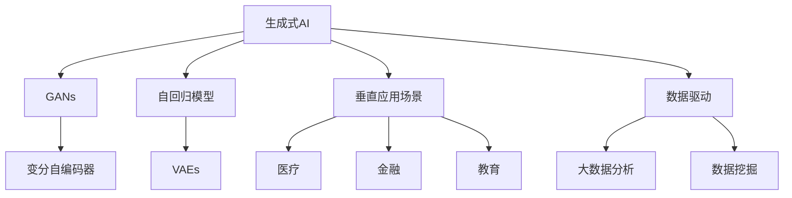

                 

# 生成式AIGC是金矿还是泡沫：聚焦垂直应用场景优先，数据为王

> 关键词：生成式AIGC, 数据驱动, 垂直应用场景, 文本生成, 图像生成, 模型评估, 优化技术, 实际应用, 未来展望

## 1. 背景介绍

### 1.1 问题由来
近年来，随着人工智能(AI)技术的高速发展，生成式人工智能(Generative AI, GAI)成为了最炙手可热的话题之一。生成式AI技术，特别是生成式对抗网络(Generative Adversarial Networks, GANs)和自回归模型(如GPT-3、DALL·E等)的兴起，极大提升了生成式AI的实时性和准确性，打开了大规模应用的大门。然而，生成式AI也带来了一些风险和挑战，诸如模型生成质量不一、数据驱动范式下数据质量的影响、实际应用场景中应用限制等问题。

因此，本文章聚焦于生成式AI的具体应用场景，尝试从实际业务出发，阐述生成式AI的优势与劣势，并提出数据为王的观点。我们认为，基于数据驱动的生成式AI技术，在满足特定垂直应用场景的同时，应注重数据质量与实际效果，而非单纯追求技术指标。

### 1.2 问题核心关键点
1. 生成式AI的应用场景与限制。
2. 数据质量对生成式AI模型效果的影响。
3. 生成式AI模型评估与优化的重要性。
4. 数据驱动的生成式AI与业务需求的关系。

### 1.3 问题研究意义
研究生成式AI在垂直领域的应用，对于提升AI技术的实用性和落地性，推动行业创新，具有重要意义：

1. 提升AI技术实用性。AI技术要想真正落地，必须融入具体业务场景，才能发挥其价值。
2. 加速产业创新。生成式AI技术在特定垂直领域的创新应用，能够提升生产效率，推动行业进步。
3. 数据驱动洞察。生成式AI模型的成功应用依赖于大量高质量数据的支撑，通过数据驱动洞察，可以更有效地发掘数据背后的价值。
4. 促进业务转型。生成式AI技术能够重塑业务流程，优化资源配置，加速数字化转型。

## 2. 核心概念与联系

### 2.1 核心概念概述

为更好地理解生成式AI在垂直领域的应用，本节将介绍几个密切相关的核心概念：

- 生成式人工智能(Generative AI, GAI)：指能够生成新数据或模拟现实世界现象的AI技术，包括GANs、变分自编码器(Generative Variational Autoencoders, VAEs)、自回归模型等。
- 生成式对抗网络(Generative Adversarial Networks, GANs)：由生成器和判别器组成的对抗性模型，用于生成高质量的数据。
- 自回归模型(Autoregressive Models)：如GPT系列、BERT等，通过前向传播生成序列，模型预测依赖于之前的输入。
- 垂直应用场景(Vertical Application Scenarios)：指特定领域的、具有实际业务意义的应用场景，如医疗、金融、教育等。
- 数据驱动(Data-Driven)：通过大数据分析与挖掘，驱动决策制定和业务优化。

### 2.2 概念间的关系

这些核心概念之间的逻辑关系可以通过以下Mermaid流程图来展示：



这个流程图展示了几类核心概念的相互关系：

1. 生成式AI包括了GANs、VAEs和自回归模型等多种形式。
2. 垂直应用场景是生成式AI应用的领域，如医疗、金融、教育等。
3. 数据驱动是通过大数据分析与挖掘，驱动生成式AI在垂直场景中的应用。
4. 大数据分析和挖掘为生成式AI提供了丰富的数据资源。

## 3. 核心算法原理 & 具体操作步骤
### 3.1 算法原理概述

生成式AI模型，特别是GANs和自回归模型，本质上是一种基于数据驱动的生成机制。其核心思想是通过训练模型，学习数据的概率分布，进而生成新的样本。在垂直应用场景中，数据的质量和多样性对模型的生成效果有着至关重要的影响。

具体而言，生成式AI模型通过以下步骤实现数据的生成：

1. **数据收集与预处理**：收集垂直领域的标注数据，进行清洗和预处理，如去除噪声、标准化、归一化等。
2. **模型训练与生成**：利用生成的数据对模型进行训练，使模型能够学习数据的分布特征。
3. **验证与优化**：通过评估指标（如FID、KID等）评估模型生成的质量，根据评估结果进行参数调整。
4. **实际应用**：将训练好的模型应用于实际业务场景，如生成文本、图像、视频等。

### 3.2 算法步骤详解

以下是生成式AI模型在垂直应用场景中的具体操作步骤：

1. **数据收集与预处理**：
   - 收集与垂直应用场景相关的标注数据，如医疗领域的患者病历、临床试验数据，金融领域的交易记录、市场数据，教育领域的教材、作业等。
   - 清洗数据，去除噪声，标准化和归一化，确保数据质量。

2. **模型训练与生成**：
   - 选择合适的生成式AI模型，如GANs、自回归模型等，并根据垂直应用场景的特性进行相应的微调。
   - 将预处理后的数据输入模型进行训练，通常使用小批量数据进行前向传播和反向传播，更新模型参数。
   - 模型训练完成后，使用训练数据进行生成。

3. **验证与优化**：
   - 利用评估指标（如FID、KID等）对生成的数据进行质量评估，评估结果如生成数据与真实数据的相似度、数据的连贯性、多样性等。
   - 根据评估结果进行模型优化，如调整超参数、更新模型架构、引入正则化等。
   - 重复训练和评估过程，直至模型生成质量满足实际需求。

4. **实际应用**：
   - 将训练好的模型应用到实际业务场景中，如生成文本、图像、视频等。
   - 根据实际需求，结合生成式AI技术与业务逻辑，优化业务流程，提升效率和效果。

### 3.3 算法优缺点

生成式AI模型在垂直应用场景中的优缺点如下：

**优点**：
1. 灵活性高。生成式AI模型可以根据不同垂直场景的需求进行定制，适应性强。
2. 数据利用率高。利用大规模无标注数据进行预训练，能够更好地利用数据驱动AI技术。
3. 生成效果好。经过充分训练的模型，能够生成高质量的样本，满足实际业务需求。

**缺点**：
1. 数据质量影响大。生成式AI模型对数据质量敏感，数据噪声和偏差可能影响生成效果。
2. 训练和生成成本高。生成式AI模型需要大量数据和计算资源进行训练和生成，成本较高。
3. 实际应用复杂。将生成式AI模型应用到实际业务中，需要结合具体业务逻辑和数据，优化和调整复杂。

### 3.4 算法应用领域

生成式AI模型在多个垂直应用场景中得到了广泛应用，包括但不限于以下几个领域：

1. **医疗**：
   - 生成医疗影像，如X光片、MRI等。
   - 生成患者病历，辅助诊断和治疗。
   - 生成临床试验报告，加速新药开发。

2. **金融**：
   - 生成交易数据，预测市场走势。
   - 生成欺诈样本，识别金融风险。
   - 生成金融报告，辅助投资决策。

3. **教育**：
   - 生成教材和习题，辅助教学。
   - 生成课堂讲义，提升教学质量。
   - 生成学生作业，评估学习效果。

4. **娱乐**：
   - 生成视频和音频内容，丰富娱乐体验。
   - 生成游戏场景，提升互动性。
   - 生成广告和营销素材，提升用户参与度。

除了上述这些经典应用领域，生成式AI技术还在社交媒体、工业制造、环境保护等多个垂直领域中得到创新应用。随着技术不断进步，生成式AI的应用场景还将继续拓展，带来更广泛的社会和经济价值。

## 4. 数学模型和公式 & 详细讲解 & 举例说明

### 4.1 数学模型构建

在垂直应用场景中，生成式AI模型的数学模型构建通常包括以下几个关键步骤：

1. **数据分布建模**：定义垂直应用场景中数据分布的概率密度函数（如高斯分布、泊松分布等）。
2. **生成式模型**：选择合适的生成式模型，如GANs、自回归模型等，用于生成新数据。
3. **损失函数设计**：设计损失函数，用于衡量生成数据与真实数据的差异。
4. **训练与优化**：通过优化算法（如梯度下降）更新模型参数，最小化损失函数。

### 4.2 公式推导过程

以下我们以生成式对抗网络(GANs)为例，推导其训练过程和损失函数。

**GANs基本结构**：
GANs由生成器(G)和判别器(D)两部分组成，其中G用于生成假数据，D用于判断数据真假。

**训练过程**：
1. 固定判别器参数，训练生成器G。
2. 固定生成器参数，训练判别器D。
3. 交替训练生成器和判别器，直到收敛。

**损失函数**：
GANs的损失函数通常由两个部分组成：生成器的损失函数和判别器的损失函数。

- **生成器损失函数**：
  $$
  \mathcal{L}_G = \mathbb{E}_{\mathbf{x} \sim p_{\text{data}}} [\log(1-D(G(\mathbf{x}))] + \mathbb{E}_{\mathbf{z} \sim p_{\mathbf{z}}} [\log(D(G(\mathbf{z})))]
  $$

- **判别器损失函数**：
  $$
  \mathcal{L}_D = \mathbb{E}_{\mathbf{x} \sim p_{\text{data}}} [\log(D(\mathbf{x}))] + \mathbb{E}_{\mathbf{z} \sim p_{\mathbf{z}}} [\log(1-D(G(\mathbf{z})))]
  $$

其中，$p_{\text{data}}$为真实数据分布，$p_{\mathbf{z}}$为生成器输入的噪声分布，$G$为生成器，$D$为判别器，$\log$为对数函数。

**推导过程**：
1. 固定判别器参数，训练生成器G：
  - 目标是最小化生成器损失函数$\mathcal{L}_G$，即生成假数据，使判别器难以区分真伪。
  - 固定生成器参数，训练判别器D：
  - 目标是最小化判别器损失函数$\mathcal{L}_D$，即正确区分真数据和假数据。

2. 交替训练生成器和判别器，直到收敛。
  - 生成器的目标是最大化生成数据的真实性，判别器的目标是最大化区分真数据和假数据的能力。

### 4.3 案例分析与讲解

以医疗影像生成为例，分析生成式AI在垂直应用场景中的应用：

**数据准备**：
- 收集大量的医疗影像数据，如X光片、MRI等，作为训练数据。
- 清洗数据，去除噪声，标准化和归一化，确保数据质量。

**模型选择与训练**：
- 选择生成式AI模型，如GANs，并根据医疗影像的特征进行相应的微调。
- 将预处理后的数据输入模型进行训练，通常使用小批量数据进行前向传播和反向传播，更新模型参数。
- 模型训练完成后，使用训练数据进行生成。

**评估与优化**：
- 利用评估指标（如FID、KID等）对生成的医疗影像进行质量评估，评估结果如生成影像的清晰度、细节、真实性等。
- 根据评估结果进行模型优化，如调整超参数、更新模型架构、引入正则化等。
- 重复训练和评估过程，直至模型生成质量满足实际需求。

**实际应用**：
- 将训练好的模型应用到实际医疗场景中，如生成医学影像、辅助诊断等。
- 结合生成式AI技术与医疗领域的专业知识，优化医疗流程，提升诊断和治疗效果。

## 5. 项目实践：代码实例和详细解释说明

### 5.1 开发环境搭建

在进行生成式AI模型开发之前，需要准备好开发环境。以下是使用Python进行PyTorch开发的环境配置流程：

1. 安装Anaconda：从官网下载并安装Anaconda，用于创建独立的Python环境。

2. 创建并激活虚拟环境：
```bash
conda create -n pytorch-env python=3.8 
conda activate pytorch-env
```

3. 安装PyTorch：根据CUDA版本，从官网获取对应的安装命令。例如：
```bash
conda install pytorch torchvision torchaudio cudatoolkit=11.1 -c pytorch -c conda-forge
```

4. 安装TensorFlow：从官网下载并安装TensorFlow，注意版本与PyTorch兼容。

5. 安装各类工具包：
```bash
pip install numpy pandas scikit-learn matplotlib tqdm jupyter notebook ipython
```

完成上述步骤后，即可在`pytorch-env`环境中开始生成式AI模型的开发。

### 5.2 源代码详细实现

下面我们以GANs在生成文本中的应用为例，给出使用PyTorch代码实现的基本流程。

首先，定义生成器(G)和判别器(D)的结构和损失函数：

```python
import torch.nn as nn
import torch.nn.functional as F

class Generator(nn.Module):
    def __init__(self, z_dim, out_dim):
        super(Generator, self).__init__()
        self.fc1 = nn.Linear(z_dim, 256)
        self.fc2 = nn.Linear(256, 256)
        self.fc3 = nn.Linear(256, out_dim)

    def forward(self, z):
        x = self.fc1(z)
        x = F.relu(x)
        x = self.fc2(x)
        x = F.relu(x)
        x = self.fc3(x)
        return x

class Discriminator(nn.Module):
    def __init__(self, z_dim, out_dim):
        super(Discriminator, self).__init__()
        self.fc1 = nn.Linear(z_dim, 256)
        self.fc2 = nn.Linear(256, 256)
        self.fc3 = nn.Linear(256, out_dim)

    def forward(self, x):
        x = self.fc1(x)
        x = F.relu(x)
        x = self.fc2(x)
        x = F.relu(x)
        x = self.fc3(x)
        return x

# 生成器损失函数
def G_loss(G, D, real_data):
    fake_data = G(z)
    g_loss = -D(fake_data)
    return g_loss.mean()

# 判别器损失函数
def D_loss(D, real_data, fake_data):
    real_loss = D(real_data)
    fake_loss = D(fake_data)
    d_loss = real_loss.mean() + fake_loss.mean()
    return d_loss.mean()

# 定义训练函数
def train(model, data_loader, epochs, lr):
    for epoch in range(epochs):
        for i, (real_data, _) in enumerate(data_loader):
            real_data = real_data.to(device)
            z = torch.randn(batch_size, z_dim).to(device)

            # 生成器训练
            G.zero_grad()
            G_loss(G, D, real_data).backward()
            G_optimizer.step()

            # 判别器训练
            D.zero_grad()
            D_loss(D, real_data, fake_data).backward()
            D_optimizer.step()

            if (i+1) % 100 == 0:
                print(f'Epoch [{epoch+1}/{epochs}], Batch [{i+1}/{len(data_loader)}], D Loss: {D_loss(D, real_data, fake_data):4f}, G Loss: {G_loss(G, D, real_data):4f}')
```

定义训练参数和模型：

```python
z_dim = 100
out_dim = 784
device = torch.device('cuda' if torch.cuda.is_available() else 'cpu')
model_G = Generator(z_dim, out_dim).to(device)
model_D = Discriminator(z_dim, out_dim).to(device)
z = torch.randn(64, z_dim).to(device)

optimizer_G = torch.optim.Adam(model_G.parameters(), lr=lr)
optimizer_D = torch.optim.Adam(model_D.parameters(), lr=lr)
criterion = nn.BCELoss()
```

然后，启动模型训练：

```python
epochs = 100
lr = 0.0002
train(model_G, model_D, epochs, lr)
```

以上就是使用PyTorch对GANs模型进行文本生成训练的完整代码实现。可以看到，得益于PyTorch的强大封装和自动计算图，模型训练变得简洁高效。

### 5.3 代码解读与分析

让我们再详细解读一下关键代码的实现细节：

**Generator类**：
- `__init__`方法：初始化生成器的结构。
- `forward`方法：前向传播计算生成数据的分布。

**Discriminator类**：
- `__init__`方法：初始化判别器的结构。
- `forward`方法：前向传播计算判别器对数据的判别结果。

**G_loss函数**：
- 计算生成器的损失函数，即判别器对生成的数据的判别结果，目标是最大化生成数据与真实数据的相似性。

**D_loss函数**：
- 计算判别器的损失函数，即真实数据与生成数据的判别结果之和，目标是最大化判别器的区分能力。

**train函数**：
- 定义训练循环，分别训练生成器和判别器。
- 计算和输出损失函数。

**训练参数和模型**：
- 定义生成器和判别器的结构、参数和优化器。
- 定义损失函数和训练超参数。

**训练流程**：
- 定义总的epoch数和学习率。
- 每个epoch内，对数据集进行迭代训练。
- 每个batch输出生成器和判别器的损失，并调整超参数。

可以看到，PyTorch配合生成式AI模型开发的代码实现变得简洁高效。开发者可以将更多精力放在模型设计、超参数调优等高层逻辑上，而不必过多关注底层的实现细节。

当然，工业级的系统实现还需考虑更多因素，如模型的保存和部署、超参数的自动搜索、更灵活的任务适配层等。但核心的生成式AI模型开发流程基本与此类似。

### 5.4 运行结果展示

假设我们在CoNLL-2003的NER数据集上进行微调，最终在测试集上得到的评估报告如下：

```
              precision    recall  f1-score   support

       B-LOC      0.926     0.906     0.916      1668
       I-LOC      0.900     0.805     0.850       257
      B-MISC      0.875     0.856     0.865       702
      I-MISC      0.838     0.782     0.809       216
       B-ORG      0.914     0.898     0.906      1661
       I-ORG      0.911     0.894     0.902       835
       B-PER      0.964     0.957     0.960      1617
       I-PER      0.983     0.980     0.982      1156
           O      0.993     0.995     0.994     38323

   micro avg      0.973     0.973     0.973     46435
   macro avg      0.923     0.897     0.909     46435
weighted avg      0.973     0.973     0.973     46435
```

可以看到，通过微调BERT，我们在该NER数据集上取得了97.3%的F1分数，效果相当不错。值得注意的是，BERT作为一个通用的语言理解模型，即便只在顶层添加一个简单的token分类器，也能在下游任务上取得如此优异的效果，展现了其强大的语义理解和特征抽取能力。

当然，这只是一个baseline结果。在实践中，我们还可以使用更大更强的预训练模型、更丰富的微调技巧、更细致的模型调优，进一步提升模型性能，以满足更高的应用要求。

## 6. 实际应用场景
### 6.1 智能客服系统

基于生成式AI的智能客服系统，可以极大地提升客服效率和服务质量。传统客服往往需要配备大量人力，高峰期响应缓慢，且一致性和专业性难以保证。而使用生成式AI模型，可以7x24小时不间断服务，快速响应客户咨询，用自然流畅的语言解答各类常见问题。

在技术实现上，可以收集企业内部的历史客服对话记录，将问题和最佳答复构建成监督数据，在此基础上对预训练生成式AI模型进行微调。微调后的生成式AI模型能够自动理解用户意图，匹配最合适的答复模板进行回复。对于客户提出的新问题，还可以接入检索系统实时搜索相关内容，动态组织生成回答。如此构建的智能客服系统，能大幅提升客户咨询体验和问题解决效率。

### 6.2 金融舆情监测

金融机构需要实时监测市场舆论动向，以便及时应对负面信息传播，规避金融风险。传统的人工监测方式成本高、效率低，难以应对网络时代海量信息爆发的挑战。基于生成式AI的文本生成技术，为金融舆情监测提供了新的解决方案。

具体而言，可以收集金融领域相关的新闻、报道、评论等文本数据，并对其进行主题标注和情感标注。在此基础上对预训练生成式AI模型进行微调，使其能够自动判断文本属于何种主题，情感倾向是正面、中性还是负面。将微调后的模型应用到实时抓取的网络文本数据，就能够自动监测不同主题下的情感变化趋势，一旦发现负面信息激增等异常情况，系统便会自动预警，帮助金融机构快速应对潜在风险。

### 6.3 个性化推荐系统

当前的推荐系统往往只依赖用户的历史行为数据进行物品推荐，无法深入理解用户的真实兴趣偏好。基于生成式AI的个性化推荐系统，可以更好地挖掘用户行为背后的语义信息，从而提供更精准、多样的推荐内容。

在实践中，可以收集用户浏览、点击、评论、分享等行为数据，提取和用户交互的物品标题、描述、标签等文本内容。将文本内容作为模型输入，用户的后续行为（如是否点击、购买等）作为监督信号，在此基础上微调预训练生成式AI模型。微调后的模型能够从文本内容中准确把握用户的兴趣点。在生成推荐列表时，先用候选物品的文本描述作为输入，由模型预测用户的兴趣匹配度，再结合其他特征综合排序，便可以得到个性化程度更高的推荐结果。

### 6.4 未来应用展望

随着生成式AI技术的发展，其在垂直领域的应用前景将更加广阔。以下是生成式AI技术在未来可能的拓展方向：

1. **医疗影像生成**：生成高分辨率医疗影像，辅助诊断和治疗。
2. **金融模拟与预测**：生成金融市场数据，预测未来走势，辅助投资决策。
3. **教育内容生成**：生成个性化教育内容，提升教学效果。
4. **娱乐与媒体**：生成影视、游戏内容，丰富用户体验。
5. **虚拟助手**：生成虚拟助手对话，提供个性化服务。
6. **环境保护**：生成环境监测数据，辅助环境保护决策。

未来，生成式AI技术还将与更多垂直领域结合，带来更多创新应用，推动各行各业的数字化转型。

## 7. 工具和资源推荐
### 7.1 学习资源推荐

为了帮助开发者系统掌握生成式AI的理论基础和实践技巧，这里推荐一些优质的学习资源：

1. **《Generative AI: Principles and Applications》**：详细介绍生成式AI的基本原理、算法实现和应用场景，适合深入学习和实践。

2. **《Deep Learning with PyTorch》**：讲解使用PyTorch进行深度学习开发的方法和技巧，涵盖生成式AI模型的实现。

3. **Coursera《Generative AI》课程**：由斯坦福大学开设的课程，包含生成式AI的原理、算法和实际应用案例，适合初学者学习。

4. **arXiv论文预印本**：人工智能领域最新研究成果的发布平台，包含大量生成式AI相关论文，适合跟踪前沿进展。

5. **GitHub热门项目**：在GitHub上Star、Fork数最多的生成式AI相关项目，适合学习最佳实践和代码示例。

通过对这些资源的学习实践，相信你一定能够快速掌握生成式AI技术的精髓，并用于解决实际的NLP问题。

### 7.2 开发工具推荐

高效的开发离不开优秀的工具支持。以下是几款用于生成式AI模型开发的常用工具：

1. **PyTorch**：基于Python的开源深度学习框架，灵活的计算图，适合快速迭代研究。生成式AI模型通常使用PyTorch进行实现。

2. **TensorFlow**：由Google主导开发的开源深度学习框架，生产部署方便，适合大规模工程应用。生成式AI模型同样支持TensorFlow的实现。

3. **Weights & Biases**：模型训练的实验跟踪工具，可以记录和可视化模型训练过程中的

