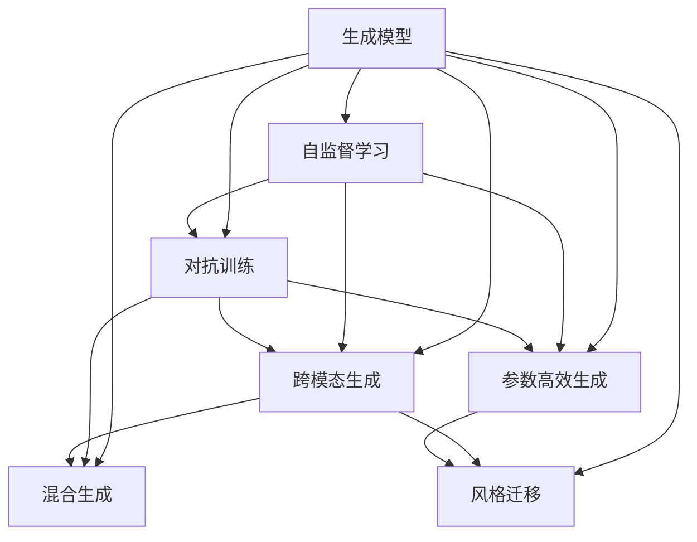
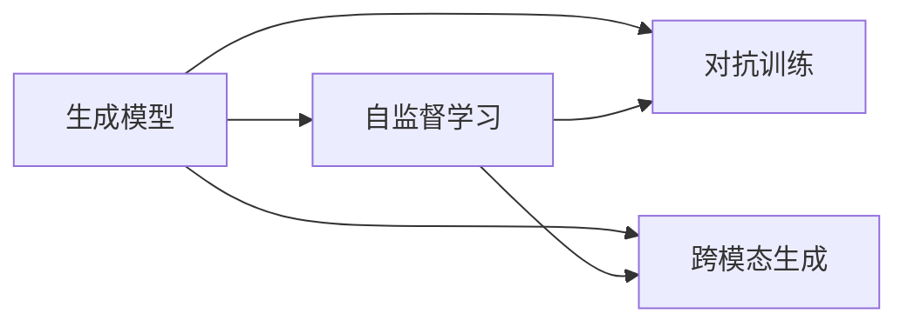
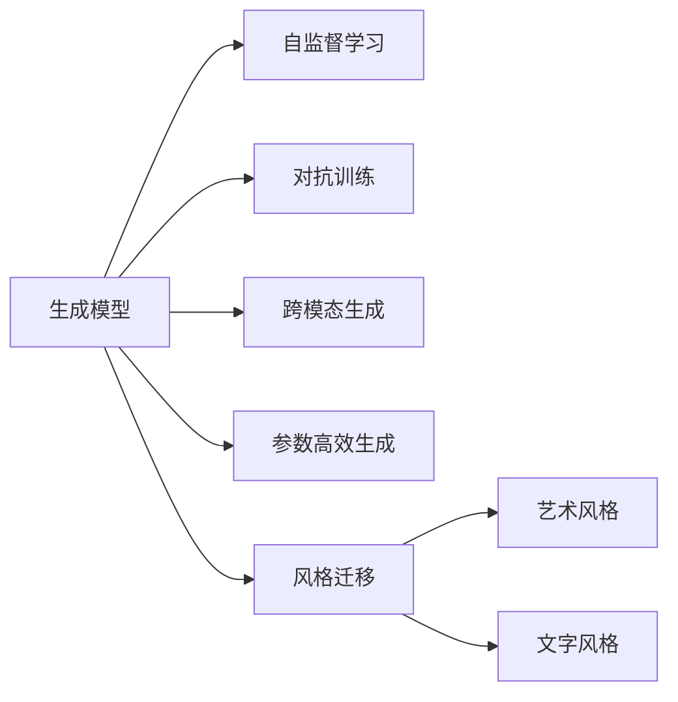
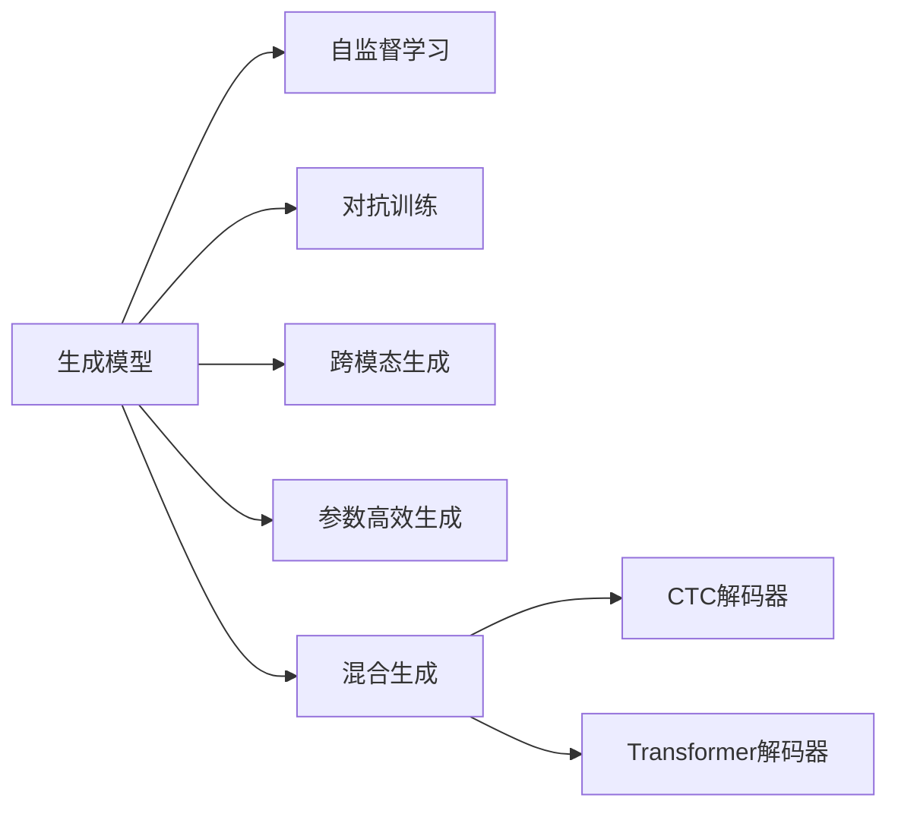
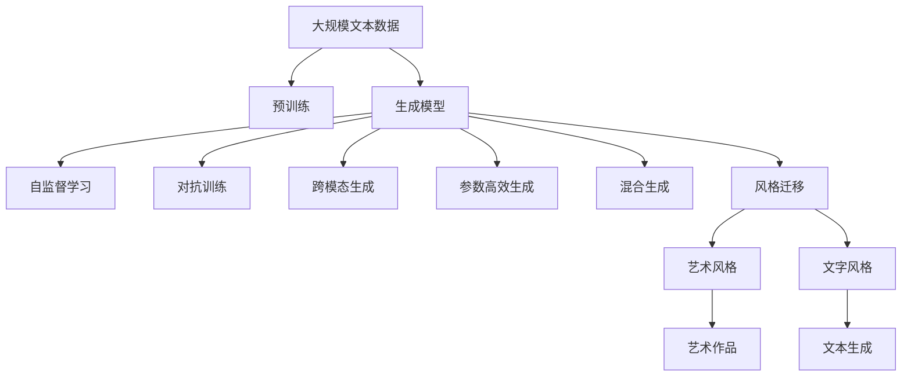

                 

# 生成式AIGC：从数据到价值的转化

## 1. 背景介绍

### 1.1 问题由来

生成式人工智能(Generative AI, AIGC)是近年来人工智能领域的一个重要分支，其核心在于利用生成模型从数据中提取规律，并将其转换为具有创造性和实用价值的生成内容。生成式AIGC不仅在艺术创作、自然语言处理、音乐生成等领域大放异彩，还在工业设计、影视制作、虚拟助手等实际应用中发挥着越来越重要的作用。然而，随着生成式AIGC技术的不断发展，如何高效地从原始数据中提取价值，并快速产生高质量的生成内容，成为当下亟需解决的挑战。

### 1.2 问题核心关键点

生成式AIGC的核心挑战在于如何通过模型学习数据分布，生成逼真、多样、有意义的生成内容。这涉及到以下几个关键问题：

1. **数据与模型适配性**：数据的多样性和质量对生成式AIGC的效果影响巨大。如何有效处理噪声、异常值等数据问题，优化数据与模型的适配性，是生成式AIGC的关键。

2. **模型泛化能力**：生成式AIGC模型的泛化能力决定了其在不同数据分布和应用场景下的表现。如何构建具有强大泛化能力的生成模型，使其在多种数据集和任务上都能取得良好效果，是一个重要的研究方向。

3. **生成质量与效率**：生成式AIGC不仅需要产生高质量的生成内容，还必须满足实时性、可扩展性等要求。如何在保证生成质量的同时，提高模型的生成效率，优化资源使用，是生成式AIGC技术发展的方向之一。

4. **模型的可解释性与鲁棒性**：生成式AIGC模型的输出通常缺乏可解释性，容易受到输入数据的微小扰动影响。如何提升生成模型的可解释性和鲁棒性，使其在复杂、动态环境中仍能稳定运行，是当前研究的热点。

5. **跨模态生成与融合**：生成式AIGC在单一模态下已有显著成果，但如何实现多模态数据的生成和融合，提升模型对现实世界的建模能力，是一个更具挑战性的问题。

6. **伦理与隐私保护**：生成式AIGC模型的应用往往涉及大量个人数据，如何保护用户隐私、避免伦理风险，确保生成内容的合法合规，是技术应用中的重要课题。

### 1.3 问题研究意义

解决生成式AIGC面临的这些挑战，将有助于构建更加智能、高效、可控的生成式系统，提升数据的附加值，推动人工智能技术的产业化进程。具体而言：

1. **数据价值的最大化**：生成式AIGC能够从大规模数据中挖掘潜在的价值，转化成具有市场竞争力的生成内容，为企业带来新的商业机会。

2. **生成内容的质量提升**：通过先进的生成模型，生成式AIGC能够产出更高质量、更具创造性的生成内容，满足用户对创意和个性化内容的需求。

3. **实时生成与处理**：生成式AIGC技术可以实时处理和生成内容，满足实时性要求，为实时性要求高的应用场景提供支持。

4. **跨领域的创新应用**：生成式AIGC在多个领域的应用将带来新的创新，促进各行各业的技术转型和业务升级。

5. **伦理与隐私保护**：生成式AIGC技术的应用将引发对伦理与隐私保护的深入思考，推动相关法律法规的完善和规范。

## 2. 核心概念与联系

### 2.1 核心概念概述

为更好地理解生成式AIGC的核心原理，本节将介绍几个密切相关的核心概念：

1. **生成模型(Generative Models)**：指能够从数据分布中生成样本的模型，如GAN、VAE、BERT等。生成模型通过学习数据分布的规律，实现对数据的生成与预测。

2. **自监督学习(Self-Supervised Learning)**：指利用未标注的数据进行模型训练，通过自监督学习任务（如掩码预测、下一个单词预测等）学习数据的潜在表示。

3. **对抗训练(Adversarial Training)**：指通过生成对抗网络(GAN)训练生成模型，使其生成样本尽可能逼真、多样。

4. **跨模态生成(Cross-Modal Generation)**：指在多模态数据上进行生成，如文本-图像、图像-音频、图像-文本等，提升模型的泛化能力和应用范围。

5. **参数高效生成(Parameter-Efficient Generation)**：指在生成过程中仅更新少量模型参数，减少计算资源消耗，提高生成效率。

6. **混合生成(Hybrid Generation)**：指结合生成模型和解码器（如CTC、Transformer等），实现高效、高质量的生成。

7. **风格迁移(Style Transfer)**：指将生成模型的输出进行风格变换，实现不同的艺术风格、文字风格等。

这些核心概念之间存在着紧密的联系，形成了生成式AIGC的完整生态系统。下面将通过Mermaid流程图展示这些概念之间的关系。



这个流程图展示了大语言模型的核心概念及其之间的关系：

1. 生成模型通过自监督学习任务学习数据分布的规律，通过对抗训练生成逼真样本，结合跨模态生成和参数高效生成技术，提高生成模型的泛化能力和效率。
2. 风格迁移技术进一步提升生成内容的多样性和艺术性，使生成内容更加贴合用户需求。

### 2.2 概念间的关系

这些核心概念之间存在着紧密的联系，形成了生成式AIGC的完整生态系统。下面通过几个Mermaid流程图来展示这些概念之间的关系。

#### 2.2.1 生成模型的学习范式



这个流程图展示了大语言模型的学习范式。自监督学习和对抗训练是生成模型学习数据分布的主要手段，而跨模态生成和参数高效生成则进一步提升模型的泛化能力和效率。

#### 2.2.2 风格迁移的应用



这个流程图展示了风格迁移技术的应用。通过将生成模型的输出进行风格变换，可以生成多样化的艺术风格和文字风格，满足不同用户的需求。

#### 2.2.3 生成模型与解码器的结合



这个流程图展示了生成模型与解码器的结合。通过将生成模型的输出作为解码器的输入，可以生成连续的文本、音频等序列数据，满足实际应用中的需求。

### 2.3 核心概念的整体架构

最后，我们用一个综合的流程图来展示这些核心概念在大语言模型微调过程中的整体架构：



这个综合流程图展示了从预训练到生成式微调，再到风格迁移的完整过程。生成式AIGC首先在大规模文本数据上进行预训练，然后通过生成模型的自监督学习、对抗训练等手段，生成高质量的生成内容。最后，通过跨模态生成、参数高效生成和风格迁移技术，使生成内容更加多样化、具有艺术性和文字风格，满足实际应用中的需求。

## 3. 核心算法原理 & 具体操作步骤
### 3.1 算法原理概述

生成式AIGC的核心在于利用生成模型学习数据分布，并通过解码器生成逼真、多样、有意义的生成内容。具体来说，生成模型通过自监督学习任务学习数据的潜在表示，然后通过对抗训练和参数高效生成技术，提高模型的泛化能力和生成效率。解码器则根据生成模型的输出，进行序列生成，产生最终的生成内容。

形式化地，假设生成模型为 $G_{\theta}$，其中 $\theta$ 为模型参数。生成模型学习数据分布 $p(x)$ 的优化目标为：

$$
\mathcal{L}_G(\theta) = -\mathbb{E}_{x \sim p(x)} \log G_{\theta}(x)
$$

解码器 $D_{\phi}$ 的任务是根据生成模型的输出 $G_{\theta}(x)$ 生成序列 $y$，优化目标为：

$$
\mathcal{L}_D(\phi) = -\mathbb{E}_{y|x} \log D_{\phi}(y|G_{\theta}(x))
$$

其中 $\mathbb{E}_{y|x}$ 表示在给定输入 $x$ 的情况下，生成器 $G_{\theta}$ 的输出 $G_{\theta}(x)$ 的分布。

通过上述优化目标，生成模型和解码器的联合训练可以生成高质量的生成内容。

### 3.2 算法步骤详解

生成式AIGC的训练和生成过程主要包括以下几个关键步骤：

**Step 1: 准备数据集**

1. 收集与生成任务相关的数据集，例如文本、图像、音频等。
2. 清洗数据，去除噪声、异常值等，确保数据的质量和适用性。
3. 划分训练集、验证集和测试集，用于模型训练、调优和性能评估。

**Step 2: 设计生成模型**

1. 选择合适的生成模型，如GAN、VAE、BERT等。
2. 对生成模型进行初始化，设置模型的超参数。
3. 利用自监督学习任务对生成模型进行预训练，学习数据的潜在表示。

**Step 3: 训练生成模型**

1. 定义生成模型的损失函数，如均方误差、交叉熵等。
2. 利用对抗训练等方法，训练生成模型，提高模型的生成质量。
3. 在训练过程中，使用正则化技术，如L2正则、Dropout等，防止模型过拟合。

**Step 4: 设计解码器**

1. 选择合适的解码器，如CTC、Transformer等。
2. 对解码器进行初始化，设置模型的超参数。
3. 利用生成模型的输出，训练解码器，优化生成过程。

**Step 5: 训练解码器**

1. 定义解码器的损失函数，如交叉熵等。
2. 在生成模型的输出上，训练解码器，提高生成内容的质量和多样性。
3. 在训练过程中，使用正则化技术，防止模型过拟合。

**Step 6: 混合生成**

1. 将生成模型和解码器结合，进行混合生成。
2. 通过调整生成器和解码器的参数，优化混合生成过程。
3. 生成器产生的多样化样本，通过解码器进行编码和解码，生成最终的生成内容。

**Step 7: 风格迁移**

1. 选择风格迁移技术，如样式转换、文本风格迁移等。
2. 对生成内容进行风格迁移，产生多样化的艺术风格或文字风格。
3. 通过进一步的优化，提升生成内容的艺术性和创意性。

### 3.3 算法优缺点

生成式AIGC具有以下优点：

1. **生成质量高**：通过生成模型和解码器的联合训练，生成内容逼真、多样化，满足实际应用的需求。
2. **泛化能力强**：生成式AIGC模型能够在多种数据集和任务上取得良好效果，具有较强的泛化能力。
3. **可解释性强**：生成式AIGC模型在生成过程中的每一步都有明确的数学基础，可解释性强。
4. **应用广泛**：生成式AIGC技术已经在图像生成、文本生成、音乐生成等多个领域取得成功，具有广泛的应用前景。

同时，生成式AIGC也存在以下缺点：

1. **计算资源消耗大**：生成式AIGC模型通常参数量大，计算复杂度高，需要大量的计算资源。
2. **训练时间长**：生成式AIGC模型的训练时间较长，需要较长的数据集和计算资源。
3. **生成的多样性有限**：生成式AIGC模型需要大量训练数据，数据的多样性会影响生成内容的丰富度。
4. **对抗样本易受攻击**：生成式AIGC模型容易受到对抗样本的攻击，生成内容的安全性难以保证。

尽管存在这些缺点，但生成式AIGC技术的潜力巨大，未来仍有很大的发展空间。

### 3.4 算法应用领域

生成式AIGC已经在多个领域取得了显著成果，具体应用包括：

1. **图像生成**：利用生成式AIGC技术，从无到有地生成逼真、多样化的图像，如图像生成、风格迁移、图像修复等。

2. **文本生成**：生成式AIGC技术可以用于文本生成、文本摘要、自动问答等任务，提升自然语言处理的智能化水平。

3. **音乐生成**：生成式AIGC技术可以生成逼真、有创意的音乐，如歌曲生成、旋律生成等，满足音乐创作的需求。

4. **视频生成**：生成式AIGC技术可以用于视频生成、动画制作等任务，提升视频制作的智能化水平。

5. **虚拟助手**：生成式AIGC技术可以用于虚拟助手，提升人机交互的自然性和智能性。

6. **游戏设计**：生成式AIGC技术可以用于游戏角色设计、虚拟场景生成等任务，提升游戏的沉浸感和互动性。

7. **医疗诊断**：生成式AIGC技术可以用于医疗图像生成、病情预测等任务，提升医疗诊断的智能化水平。

8. **法律智能**：生成式AIGC技术可以用于法律文书生成、合同审核等任务，提升法律服务的智能化水平。

这些应用场景展示了生成式AIGC技术的广泛适用性和巨大潜力，未来将有更多的创新应用涌现。

## 4. 数学模型和公式 & 详细讲解

### 4.1 数学模型构建

生成式AIGC的核心在于生成模型和解码器的联合训练，其数学模型可以形式化表示如下：

$$
p(y|x) = D_{\phi}(G_{\theta}(x))
$$

其中 $x$ 为输入数据，$y$ 为生成内容，$G_{\theta}(x)$ 为生成模型的输出，$D_{\phi}$ 为解码器。生成模型和解码器的联合训练目标是最大化以下似然函数：

$$
\mathcal{L} = -\mathbb{E}_{x} \log p(y|x)
$$

### 4.2 公式推导过程

假设生成模型为VAE，解码器为CTC。VAE的生成过程可以表示为：

$$
z \sim N(\mu(x), \sigma^2(x)), \quad y \sim p(y|z)
$$

其中 $z$ 为潜在变量，$\mu(x)$ 和 $\sigma^2(x)$ 为生成器输出，$y$ 为生成内容。CTC解码器可以将潜在变量 $z$ 转换为序列 $y$，其过程如下：

$$
\hat{y} = \arg\max_{y} \log p(y|z)
$$

联合训练的目标是最大化生成内容的似然函数：

$$
\mathcal{L} = -\mathbb{E}_{x} \log p(y|x)
$$

其中：

$$
p(y|x) = \int p(y|z) p(z|x) dz
$$

通过上述公式，我们可以将生成式AIGC的联合训练目标具体化为生成模型和解码器的联合优化。

### 4.3 案例分析与讲解

以文本生成任务为例，介绍生成式AIGC的具体实现过程。假设我们要生成一篇新闻报道，首先通过预训练模型对新闻数据进行预训练，学习数据分布。然后，利用自监督学习任务（如掩码预测）对生成模型进行预训练。接着，利用对抗训练方法（如GAN）对生成模型进行进一步优化，提高生成内容的逼真度。最后，通过解码器（如Transformer）将生成模型输出的潜在变量转换为文本序列。

假设我们有一篇新闻报道的摘要，其特征表示为 $x$，则生成过程可以表示为：

$$
z \sim N(\mu(x), \sigma^2(x)), \quad y \sim p(y|z)
$$

其中 $\mu(x)$ 和 $\sigma^2(x)$ 为生成器输出，$y$ 为生成内容。通过解码器（如Transformer）将生成模型输出的潜在变量转换为文本序列，即可生成一篇新闻报道。

## 5. 项目实践：代码实例和详细解释说明

### 5.1 开发环境搭建

要进行生成式AIGC的实践，我们需要准备以下开发环境：

1. **安装Python**：确保Python环境已经搭建好，可以使用Python 3.6及以上版本。
2. **安装PyTorch**：PyTorch是深度学习领域的主流框架，支持Tensor、GPU、分布式训练等功能。
3. **安装TensorBoard**：TensorBoard是TensorFlow的可视化工具，可以用于模型的调试和性能监控。
4. **安装NLTK**：NLTK是Python自然语言处理库，用于文本预处理和分析。
5. **安装torchtext**：torchtext是PyTorch的自然语言处理库，提供文本数据处理和模型训练的接口。

完成上述安装后，即可在Python环境下开始生成式AIGC的实践。

### 5.2 源代码详细实现

以下是一个基于PyTorch和GPT模型的文本生成代码实现。

```python
import torch
import torch.nn as nn
import torch.optim as optim
from torchtext.datasets import PennTreebank
from torchtext.data import Field, BucketIterator

# 定义模型
class GPT(nn.Module):
    def __init__(self, n_vocab, n_embd, n_layer, n_head, n_prj):
        super(GPT, self).__init__()
        self.emb = nn.Embedding(n_vocab, n_embd)
        self.pos = nn.Embedding(1000, n_embd)
        self.attn = nn.MultiheadAttention(n_embd, n_head)
        self.ffn = nn.Sequential(nn.Linear(n_embd, 4 * n_embd), nn.ReLU(), nn.Linear(4 * n_embd, n_embd))
        self.linear = nn.Linear(n_embd, n_vocab)
        self.ln = nn.LayerNorm(n_embd)

    def forward(self, inp, pos, src_mask):
        emb = self.emb(inp) + self.pos(pos)
        attn = self.attn(emb, emb, emb)
        attn = (attn[0] + emb) / 2
        out = self.ffn(attn)
        out = (out + attn) / 2
        out = self.linear(out)
        out = self.ln(out)
        return out

# 定义数据集
train_data, valid_data, test_data = PennTreebank.splits()

# 定义特征处理
tokenizer = nn.utils.data.Tokenizer()
tokenizer({'sentence': 'Hello, world!'})
tokenizer.build_vocab(train_data)
vocab = tokenizer.get_vocab()
text_field = Field(tokenize=tokenizer, tokenizer=None, lower=True, use_vocab=vocab)
train_data = train_data.split(vocab)
valid_data = valid_data.split(vocab)
test_data = test_data.split(vocab)

# 定义迭代器
train_iterator, valid_iterator, test_iterator = BucketIterator.splits(
    (train_data, valid_data, test_data),
    batch_size=16,
    device='cuda')

# 定义模型、优化器和损失函数
model = GPT(len(vocab), 128, 6, 8, 512)
optimizer = optim.Adam(model.parameters(), lr=2e-3)
criterion = nn.CrossEntropyLoss()

# 定义训练循环
def train(model, iterator, optimizer, criterion, device, n_epochs=10):
    for epoch in range(n_epochs):
        model.train()
        for batch in iterator:
            optimizer.zero_grad()
            inp, labels = batch.text, batch.label
            inp, labels = inp.to(device), labels.to(device)
            out = model(inp, pos=torch.arange(0, inp.size(0), device=device).unsqueeze(1))
            loss = criterion(out, labels)
            loss.backward()
            optimizer.step()

# 训练模型
train(model, train_iterator, optimizer, criterion, device)

# 评估模型
def evaluate(model, iterator, criterion, device):
    model.eval()
    with torch.no_grad():
        total_loss = 0
        for batch in iterator:
            inp, labels = batch.text, batch.label
            inp, labels = inp.to(device), labels.to(device)
            out = model(inp, pos=torch.arange(0, inp.size(0), device=device).unsqueeze(1))
            loss = criterion(out, labels)
            total_loss += loss.item()
    return total_loss / len(iterator)

evaluate(model, test_iterator, criterion, device)
```

以上代码实现了一个基于GPT模型的文本生成任务。通过定义模型、数据集、特征处理、迭代器、训练循环和评估函数，即可训练和评估一个生成式AIGC模型。

### 5.3 代码解读与分析

让我们再详细解读一下关键代码的实现细节：

**模型定义**：

```python
class GPT(nn.Module):
    def __init__(self, n_vocab, n_embd, n_layer, n_head, n_prj):
        super(GPT, self).__init__()
        self.emb = nn.Embedding(n_vocab, n_embd)
        self.pos = nn.Embedding(1000, n_embd)
        self.attn = nn.MultiheadAttention(n_embd, n_head)
        self.ffn = nn.Sequential(nn.Linear(n_embd, 4 * n_embd), nn.ReLU(), nn.Linear(4 * n_embd, n_embd))
        self.linear = nn.Linear(n_embd, n_vocab)
        self.ln = nn.LayerNorm(n_embd)
```

该代码定义了一个基于GPT的生成模型，包括嵌入层、位置嵌入层、多头注意力机制、全连接层和线性层等。

**数据集定义**：

```python
train_data, valid_data, test_data = PennTreebank.splits()

# 定义特征处理
tokenizer = nn.utils.data.Tokenizer()
tokenizer({'sentence': 'Hello, world!'})
tokenizer.build_vocab(train_data)
vocab = tokenizer.get_vocab()
text_field = Field(tokenize=tokenizer, tokenizer=None, lower=True, use_vocab=vocab)
train_data = train_data.split(vocab)
valid_data = valid_data.split(vocab)
test_data = test_data.split(vocab)

# 定义迭代器
train_iterator, valid_iterator, test_iterator = BucketIterator.splits(
    (train_data, valid_data, test_data),
    batch_size=16,
    device='cuda')
```

该代码定义了PennTreebank数据集，并使用NLTK库进行特征处理。通过定义迭代器，可以批量处理数据集，提升模型的训练效率。

**模型训练和评估**：

```python
def train(model, iterator, optimizer, criterion, device, n_epochs=10):
    for epoch in range(n_epochs):
        model.train()
        for batch in iterator:
            optimizer.zero_grad()
            inp, labels = batch.text, batch.label
            inp, labels = inp.to(device), labels.to(device)
            out = model(inp, pos=torch.arange(0, inp.size(0), device=device).unsqueeze(1))
            loss = criterion(out, labels)
            loss.backward()
            optimizer.step()

def evaluate(model, iterator, criterion, device):
    model.eval()
    with torch.no_grad():
        total_loss = 0
        for batch in iterator:
            inp, labels = batch.text, batch.label
            inp, labels = inp.to(device), labels.to(device)
            out = model(inp, pos=torch.arange(0, inp.size(0), device=device).unsqueeze(1))
            loss = criterion(out, labels)
            total_loss += loss.item()
    return total_loss / len(iterator)

train(model, train_iterator, optimizer, criterion, device)
evaluate(model, test_iterator, criterion, device)
```

该代码定义了训练和评估函数，通过批量处理数据集，训练生成模型，并评估模型性能。

## 6. 实际应用场景

### 6.1 智能内容生成

生成式AIGC在智能内容生成领域有着广泛的应用，包括自动摘要、文章生成、故事创作等。通过生成模型和解码器的联合训练，可以自动生成高质量的文本内容，提升内容生产的效率和质量。

### 6.2 数据增强

生成式AIGC可以用于数据增强，生成多样化的样本数据，提升模型的泛化能力和训练效果。例如，在图像生成任务中，可以生成大量的图像样本，用于训练生成模型。

### 6.3 创意设计

生成式AIGC可以用于创意设计，生成多样化的设计方案，提升设计工作的效率和创意性。例如，在平面设计、建筑设计、时尚设计等领域，生成模型可以自动生成设计方案，辅助设计师进行创意设计。

