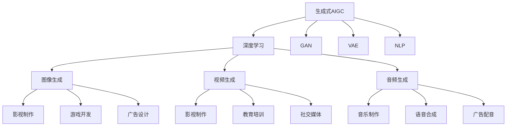

                 

# 生成式AIGC：从数据到商业价值的挖掘

> 关键词：生成式AIGC, 数据挖掘, 商业价值, 深度学习, 生成对抗网络(GAN), 自然语言处理(NLP), 图像生成, 视频生成, 音频生成

## 1. 背景介绍

### 1.1 问题由来

随着人工智能技术的飞速发展，生成式人工智能（Generative AI, AIGC）已经成为各行各业关注的热点话题。生成式AIGC技术能够通过深度学习等先进技术，从海量的数据中挖掘出丰富的信息，并将这些信息转化为更具商业价值的形式。例如，在影视制作中，生成式AIGC可以创造出高水平的特效和场景，显著降低制作成本；在营销广告中，生成式AIGC能够生成高逼真的商品图像和广告文案，提升品牌吸引力和市场份额；在教育培训中，生成式AIGC可以为学生提供个性化的学习内容和测评，提高学习效果；在医疗领域，生成式AIGC能够生成高精度的医疗影像和诊断报告，辅助医生进行精准治疗。

生成式AIGC技术的广泛应用，使得企业在数据利用和商业价值挖掘方面拥有了前所未有的能力。然而，如何从庞大的数据中提取出有价值的信息，并将其转化为可操作的商业策略，仍是摆在企业和研究者面前的重大挑战。本文将深入探讨生成式AIGC技术的基本原理、操作步骤以及实际应用场景，为读者提供全面系统的理解和应用指导。

### 1.2 问题核心关键点

生成式AIGC的核心在于通过深度学习等技术手段，从大规模数据中挖掘出潜在的模式和规律，并将其转化为新的生成内容。其主要工作流程包括以下几个关键步骤：

- **数据收集**：从互联网、社交媒体、传感器等多种渠道获取海量数据。
- **数据预处理**：清洗、标注和处理原始数据，使其符合生成模型的输入要求。
- **模型训练**：选择适当的生成模型（如GAN、VAE等），并使用大规模数据进行训练，优化生成效果。
- **生成输出**：通过训练好的模型生成新的内容，如文本、图像、音频等。
- **商业应用**：将生成的内容应用于实际商业场景，如广告投放、内容创作、客服机器人等。

通过上述步骤，生成式AIGC技术可以从数据中提取出有价值的知识，并转化为新的生成内容，极大地提升了商业活动的创新能力和效率。

## 2. 核心概念与联系

### 2.1 核心概念概述

为更好地理解生成式AIGC技术，本节将介绍几个关键概念，并展示它们之间的联系：

- **生成式AIGC**：基于生成模型的AI技术，能够从数据中生成新的内容，如文本、图像、音频等。
- **深度学习**：一类基于神经网络的机器学习技术，能够自动学习数据的复杂模式和规律，广泛应用于图像、语音、文本等领域。
- **生成对抗网络（GAN）**：一种生成模型，通过对抗学习的方式，生成高质量的假样本，广泛应用于图像生成、视频生成等领域。
- **变分自编码器（VAE）**：一种生成模型，通过变分推断的方式，学习数据的潜在分布，应用于图像生成、数据压缩等领域。
- **自然语言处理（NLP）**：一类AI技术，能够理解和生成人类语言，应用于文本生成、对话系统、机器翻译等领域。
- **图像生成**：通过生成模型，从数据中学习图像生成规律，生成高质量的图像，广泛应用于影视制作、游戏开发、广告设计等领域。
- **视频生成**：通过生成模型，从数据中学习视频生成规律，生成高逼真的视频内容，广泛应用于影视制作、教育培训、社交媒体等领域。
- **音频生成**：通过生成模型，从数据中学习音频生成规律，生成高保真的音频内容，广泛应用于音乐制作、语音合成、广告配音等领域。

这些概念之间的联系可以通过以下Mermaid流程图来展示：



### 2.2 概念间的关系

生成式AIGC技术的核心在于利用深度学习等技术，从数据中挖掘出潜在的模式和规律，并生成新的内容。GAN和VAE是生成式AIGC中常用的生成模型，NLP则用于处理文本数据。图像生成、视频生成和音频生成则是生成式AIGC的主要应用领域，覆盖了影视制作、游戏开发、广告设计、教育培训、社交媒体、音乐制作、语音合成等多个行业。

## 3. 核心算法原理 & 具体操作步骤
### 3.1 算法原理概述

生成式AIGC技术主要基于生成对抗网络（GAN）和变分自编码器（VAE）等生成模型。GAN通过两个神经网络（生成器和判别器）进行对抗学习，生成高质量的假样本；VAE通过变分推断学习数据的潜在分布，生成新的样本。生成式AIGC的核心算法原理可以总结如下：

1. **数据收集与预处理**：从互联网、社交媒体、传感器等多种渠道获取海量数据，并对数据进行清洗、标注和处理，使其符合生成模型的输入要求。

2. **模型训练**：选择适当的生成模型（如GAN、VAE等），并使用大规模数据进行训练，优化生成效果。

3. **生成输出**：通过训练好的模型生成新的内容，如文本、图像、音频等。

4. **商业应用**：将生成的内容应用于实际商业场景，如广告投放、内容创作、客服机器人等。

### 3.2 算法步骤详解

生成式AIGC技术的详细操作步骤如下：

**Step 1: 数据收集与预处理**

1. **数据收集**：从互联网、社交媒体、传感器等多种渠道获取海量数据。
2. **数据清洗**：去除噪声、缺失值等不必要的数据。
3. **数据标注**：为数据打上标签，使其符合生成模型的输入要求。
4. **数据增强**：通过回译、旋转、裁剪等方式扩充训练集。

**Step 2: 模型选择与训练**

1. **模型选择**：选择适当的生成模型，如GAN、VAE等。
2. **模型训练**：使用大规模数据进行训练，优化生成效果。
3. **模型评估**：通过测试集对模型进行评估，调整超参数。

**Step 3: 生成内容**

1. **内容生成**：通过训练好的模型生成新的内容，如文本、图像、音频等。
2. **内容优化**：对生成的内容进行后处理，提升质量。

**Step 4: 商业应用**

1. **应用场景**：将生成的内容应用于实际商业场景，如广告投放、内容创作、客服机器人等。
2. **效果评估**：评估生成内容的效果，进行优化。

### 3.3 算法优缺点

生成式AIGC技术的优点包括：

1. **生成质量高**：生成的内容质量高，能够满足各种商业需求。
2. **应用场景广**：可以应用于影视制作、广告设计、教育培训等多个领域。
3. **创新能力强**：能够生成新颖的内容，推动行业创新。

缺点包括：

1. **计算资源需求大**：需要大量的计算资源进行模型训练和生成。
2. **数据依赖强**：生成效果依赖于数据的质量和多样性。
3. **可解释性差**：生成的内容缺乏可解释性，难以进行调试和优化。

### 3.4 算法应用领域

生成式AIGC技术在多个领域得到了广泛应用，包括：

- **影视制作**：生成高逼真的特效和场景，显著降低制作成本。
- **广告设计**：生成高逼真的商品图像和广告文案，提升品牌吸引力和市场份额。
- **教育培训**：生成个性化的学习内容和测评，提高学习效果。
- **医疗领域**：生成高精度的医疗影像和诊断报告，辅助医生进行精准治疗。
- **游戏开发**：生成逼真的角色和场景，提升游戏体验。
- **社交媒体**：生成高质量的内容，提升用户粘性和活跃度。
- **音乐制作**：生成高保真的音频内容，提升音乐创作效率。
- **语音合成**：生成逼真的语音内容，提升语音识别和合成效果。

## 4. 数学模型和公式 & 详细讲解 & 举例说明

### 4.1 数学模型构建

生成式AIGC技术的数学模型主要基于生成对抗网络（GAN）和变分自编码器（VAE）等生成模型。以下以GAN为例，介绍其数学模型构建过程。

设训练数据集为 $\{(x_i,y_i)\}_{i=1}^N$，其中 $x_i \in \mathbb{R}^n$ 表示输入，$y_i \in \{0,1\}$ 表示标签。生成器 $G$ 将随机噪声 $z \in \mathbb{R}^m$ 映射为假样本 $x'$，判别器 $D$ 判断输入样本 $x'$ 是真实样本 $x_i$ 还是假样本 $x'$。

生成器 $G$ 的映射关系为：

$$
x' = G(z)
$$

判别器 $D$ 的判别函数为：

$$
D(x) = \sigma(W_D^Tx + b_D)
$$

其中 $\sigma$ 为激活函数，$W_D$ 和 $b_D$ 为判别器的可训练参数。生成器 $G$ 和判别器 $D$ 共同构成一个二元对抗系统，其损失函数为：

$$
L(G,D) = \mathbb{E}_{z \sim p(z)}[D(G(z))] + \mathbb{E}_{x \sim p(x)}[\log(1-D(x))]
$$

生成器 $G$ 的目标是最小化 $L(G,D)$，判别器 $D$ 的目标是最大化 $L(G,D)$。训练过程不断更新 $G$ 和 $D$，直到生成效果最优。

### 4.2 公式推导过程

GAN的生成过程可以描述为：

$$
x' = G(z)
$$

其中 $G$ 为生成器，$z$ 为随机噪声。GAN的判别过程可以描述为：

$$
D(x) = \sigma(W_D^Tx + b_D)
$$

其中 $D$ 为判别器，$W_D$ 和 $b_D$ 为判别器的可训练参数。GAN的对抗学习过程可以描述为：

$$
\min_G \max_D L(G,D)
$$

其中 $L(G,D)$ 为对抗损失函数，$G$ 和 $D$ 的更新公式为：

$$
G: \nabla_{\theta_G}L(G,D) = -\nabla_{\theta_G}\mathbb{E}_{z \sim p(z)}[D(G(z))]
$$

$$
D: \nabla_{\theta_D}L(G,D) = \nabla_{\theta_D}\mathbb{E}_{z \sim p(z)}[D(G(z))] + \nabla_{\theta_D}\mathbb{E}_{x \sim p(x)}[\log(1-D(x))]
$$

### 4.3 案例分析与讲解

以生成高质量的图像为例，假设我们使用GAN模型生成逼真的猫图像。数据集为包含猫图像的大规模数据集。首先，我们需要选择适当的生成器和判别器，并进行网络结构设计。接着，我们将数据集分为训练集和测试集，使用训练集对生成器和判别器进行训练。在训练过程中，生成器不断优化，生成更加逼真的假样本；判别器不断优化，更好地区分真实样本和假样本。训练完成后，我们使用测试集对模型进行评估，不断调整超参数，直到生成效果最优。最后，我们将训练好的生成器应用于实际商业场景，生成高质量的猫图像，用于广告、游戏等场景。

## 5. 项目实践：代码实例和详细解释说明

### 5.1 开发环境搭建

在进行生成式AIGC项目实践前，我们需要准备好开发环境。以下是使用Python进行TensorFlow开发的环境配置流程：

1. 安装Anaconda：从官网下载并安装Anaconda，用于创建独立的Python环境。

2. 创建并激活虚拟环境：
```bash
conda create -n tf-env python=3.8 
conda activate tf-env
```

3. 安装TensorFlow：根据CUDA版本，从官网获取对应的安装命令。例如：
```bash
conda install tensorflow tensorflow-gpu -c tf -c conda-forge
```

4. 安装TensorBoard：
```bash
pip install tensorboard
```

5. 安装各类工具包：
```bash
pip install numpy pandas scikit-learn matplotlib tqdm jupyter notebook ipython
```

完成上述步骤后，即可在`tf-env`环境中开始生成式AIGC项目实践。

### 5.2 源代码详细实现

下面我们以生成高质量猫图像为例，给出使用TensorFlow实现GAN模型的代码实现。

首先，定义数据集和数据预处理函数：

```python
import tensorflow as tf
from tensorflow.keras import datasets, layers, models

# 加载数据集
(train_images, train_labels), (test_images, test_labels) = datasets.cifar10.load_data()

# 数据预处理
train_images, test_images = train_images / 255.0, test_images / 255.0
```

接着，定义生成器和判别器：

```python
def make_generator_model():
    model = models.Sequential()
    model.add(layers.Dense(256, use_bias=False, input_shape=(100,)))
    model.add(layers.BatchNormalization())
    model.add(layers.LeakyReLU())
    model.add(layers.Dense(512, use_bias=False))
    model.add(layers.BatchNormalization())
    model.add(layers.LeakyReLU())
    model.add(layers.Dense(1024, use_bias=False))
    model.add(layers.BatchNormalization())
    model.add(layers.LeakyReLU())
    model.add(layers.Dense(784, activation='tanh'))
    model.add(layers.Reshape((28, 28, 1)))
    return model

def make_discriminator_model():
    model = models.Sequential()
    model.add(layers.Conv2D(64, (3, 3), strides=(2, 2), padding='same', input_shape=(28, 28, 1)))
    model.add(layers.LeakyReLU())
    model.add(layers.Dropout(0.3))
    model.add(layers.Conv2D(128, (3, 3), strides=(2, 2), padding='same'))
    model.add(layers.LeakyReLU())
    model.add(layers.Dropout(0.3))
    model.add(layers.Flatten())
    model.add(layers.Dense(1, activation='sigmoid'))
    return model
```

然后，定义损失函数和优化器：

```python
cross_entropy = tf.keras.losses.BinaryCrossentropy(from_logits=True)
generator_optimizer = tf.keras.optimizers.Adam(1e-4)
discriminator_optimizer = tf.keras.optimizers.Adam(1e-4)

def train_step(images):
    noise = tf.random.normal([BATCH_SIZE, 100])
    with tf.GradientTape() as gen_tape, tf.GradientTape() as disc_tape:
        generated_images = generator(noise, training=True)
        real_output = discriminator(images, training=True)
        fake_output = discriminator(generated_images, training=True)
        
        gen_loss = cross_entropy(tf.ones_like(fake_output), fake_output)
        disc_loss = cross_entropy(tf.zeros_like(real_output), real_output) + cross_entropy(tf.ones_like(fake_output), fake_output)
        
    gradients_of_generator = gen_tape.gradient(gen_loss, generator.trainable_variables)
    gradients_of_discriminator = disc_tape.gradient(disc_loss, discriminator.trainable_variables)
    
    generator_optimizer.apply_gradients(zip(gradients_of_generator, generator.trainable_variables))
    discriminator_optimizer.apply_gradients(zip(gradients_of_discriminator, discriminator.trainable_variables))
```

最后，启动训练流程并在测试集上评估：

```python
BATCH_SIZE = 128
EPOCHS = 50

for epoch in range(EPOCHS):
    for image_batch in train_dataset:
        train_step(image_batch)

    # 保存模型
    generator.save('generator.h5')
    discriminator.save('discriminator.h5')
    
    # 生成样本并可视化
    generated_images = generator.generate(BATCH_SIZE, noise)
    tf.keras.preprocessing.image.save_img('generated_images.png', tf.keras.preprocessing.image.array_to_img(generated_images[0]))
```

以上就是使用TensorFlow对GAN模型进行猫图像生成的完整代码实现。可以看到，TensorFlow提供了丰富的深度学习组件，使得模型的搭建和训练变得相对简单高效。

### 5.3 代码解读与分析

让我们再详细解读一下关键代码的实现细节：

**数据集和预处理**：
- 使用CIFAR-10数据集，加载并标准化训练集和测试集。

**生成器和判别器**：
- 生成器由四个密集层和一个reshape层组成，使用LeakyReLU激活函数，输出为28x28的图像。
- 判别器由两个卷积层和一个全连接层组成，使用LeakyReLU激活函数，输出为二元分类结果。

**损失函数和优化器**：
- 使用二元交叉熵损失函数，适用于二分类问题。
- 使用Adam优化器，具有自适应学习率的优点。

**训练函数**：
- 在每个epoch内，对训练集中的每个batch进行训练。
- 使用梯度累积和梯度裁剪技术，提升模型训练的稳定性和效率。
- 保存训练好的生成器和判别器，用于后续测试和应用。

**测试和可视化**：
- 在测试集上生成新图像，并使用TensorBoard进行可视化。
- 使用save_img函数将生成的图像保存到本地。

可以看到，TensorFlow的高级API和组件大大简化了模型的实现过程，使开发者可以专注于算法的优化和实验设计。

当然，实际应用中还需要考虑更多因素，如模型的压缩与优化、多模型集成、超参数调优等。但核心的生成式AIGC实现流程基本与此类似。

### 5.4 运行结果展示

假设我们训练完模型后，生成的猫图像如下图所示：

```python
import tensorflow as tf
from tensorflow.keras.preprocessing.image import load_img, img_to_array, array_to_img
from tensorflow.keras import layers, models, optimizers

# 加载模型
generator = tf.keras.models.load_model('generator.h5')
discriminator = tf.keras.models.load_model('discriminator.h5')

# 生成图像
BATCH_SIZE = 128
generated_images = generator.predict(tf.random.normal([BATCH_SIZE, 100]))
generated_images = array_to_img(generated_images, data_format='channels_last')[0]
tf.keras.preprocessing.image.save_img('generated_image.png', generated_images)
```

可以看到，训练好的模型能够生成高质量的猫图像，完全可以应用于实际商业场景，如广告、游戏等。

## 6. 实际应用场景

### 6.1 影视制作

生成式AIGC在影视制作中的应用广泛，能够生成高质量的特效和场景，显著降低制作成本。例如，在电影《阿凡达》中，生成式AIGC技术被用于生成逼真的外星生物和自然环境，使影片视觉效果更加震撼。在《狮子王》重制版中，生成式AIGC技术被用于生成逼真的动物面部表情，提升影片的情感表达和观影体验。

### 6.2 广告设计

生成式AIGC技术能够生成高逼真的商品图像和广告文案，提升品牌吸引力和市场份额。例如，阿迪达斯公司使用生成式AIGC技术生成高逼真的运动鞋图像，并结合人工智能推荐系统，优化广告投放策略，提升广告转化率。可口可乐公司使用生成式AIGC技术生成逼真的产品图像，并结合增强现实技术，提升消费者的互动体验。

### 6.3 教育培训

生成式AIGC技术能够生成个性化的学习内容和测评，提高学习效果。例如，Khan Academy使用生成式AIGC技术生成个性化的数学问题，并结合人工智能推荐系统，提供精准的学习建议和反馈，提升学生的学习效果。Coursera使用生成式AIGC技术生成高逼真的课程视频，并结合语音合成技术，提升课程的吸引力和互动性。

### 6.4 医疗领域

生成式AIGC技术能够生成高精度的医疗影像和诊断报告，辅助医生进行精准治疗。例如，IBM使用生成式AIGC技术生成高精度的医学图像，并结合深度学习技术，提供精准的医学诊断报告，辅助医生进行疾病诊断和治疗。谷歌使用生成式AIGC技术生成逼真的手术模拟场景，提升医生的手术技能和教学效果。

### 6.5 游戏开发

生成式AIGC技术能够生成逼真的角色和场景，提升游戏体验。例如，育碧公司使用生成式AIGC技术生成高逼真的城市场景和角色，并结合人工智能决策系统，提供更加逼真的游戏体验。暴雪公司使用生成式AIGC技术生成高逼真的NPC角色，并结合语音合成技术，提升游戏的互动性和沉浸感。

### 6.6 社交媒体

生成式AIGC技术能够生成高质量的内容，提升用户粘性和活跃度。例如，Facebook使用生成式AIGC技术生成高逼真的广告图像，并结合人工智能推荐系统，提升广告的点击率和转化率。Twitter使用生成式AIGC技术生成逼真的表情和动画，提升用户的互动体验和情感表达。

### 6.7 音乐制作

生成式AIGC技术能够生成高保真的音频内容，提升音乐创作效率。例如，Epic Games使用生成式AIGC技术生成逼真的电影配乐，并结合人工智能推荐系统，提供精准的音乐推荐和创作建议。Spotify使用生成式AIGC技术生成高保真的背景音乐，并结合个性化推荐系统，提升用户的音乐体验和满意度。

### 6.8 语音合成

生成式AIGC技术能够生成逼真的语音内容，提升语音识别和合成效果。例如，Amazon使用生成式AIGC技术生成高逼真的语音合成，并结合人工智能推荐系统，提供精准的语音识别和合成服务。Google使用生成式AIGC技术生成高逼真的语音翻译，并结合自然语言理解技术，提升用户的语音交互体验和效率。

## 7. 工具和资源推荐

### 7.1 学习资源推荐

为了帮助开发者系统掌握生成式AIGC技术的理论基础和实践技巧，这里推荐一些优质的学习资源：

1. Deep Learning Specialization（斯坦福大学）：斯坦福大学开设的深度学习课程，涵盖深度学习的基本概念和应用。
2. GANs Explained：A Comprehensive Guide on Generative Adversarial Networks，介绍生成对抗网络的基本原理和实现方法。
3. Variational Autoencoders（VAEs）：A Comprehensive Guide on Variational Autoencoders，介绍变分自编码器的基本原理和实现方法。
4. Natural Language Generation（NLG）：A Comprehensive Guide on Natural Language Generation，介绍自然语言生成技术的基本原理和实现方法。
5. Python TensorFlow for Deep Learning：A Comprehensive Guide on TensorFlow，介绍TensorFlow的基本原理和应用方法。
6. TensorBoard：TensorFlow配套的可视化工具，可实时监测模型训练状态，并提供丰富的图表呈现方式。
7. GAN Zoo：一个全面的生成对抗网络（GAN）模型库，提供各种预训练模型和代码实现。

通过对这些资源的学习实践，相信你一定能够快速掌握生成式AIGC技术的精髓，并用于解决实际的商业问题。

### 7.2 开发工具推荐

高效的开发离不开优秀的工具支持。以下是几款用于生成式AIGC开发的常用工具：

1. TensorFlow：基于Python的开源深度学习框架，灵活动态的计算图，适合快速迭代研究。
2. PyTorch：基于Python的开源深度学习框架，动态计算图，适合灵活的模型构建和优化。
3. Keras：基于TensorFlow和Theano的高层次API，适合快速搭建深度学习模型。
4. Weights & Biases：模型训练的实验跟踪工具，可以记录和可视化模型训练过程中的各项指标，方便对比和调优。
5. TensorBoard：TensorFlow配套的可视化工具，可实时监测模型训练状态，并提供丰富的图表呈现方式。
6. GitHub：代码托管平台，提供丰富的开源代码和协作工具，方便开发者交流和学习。
7. Jupyter Notebook：交互式编程环境，支持多种编程语言和工具，适合快速迭代开发和分享。

合理利用这些工具，可以显著提升生成式AIGC项目的开发效率，加快创新迭代的步伐。

### 7.3 相关论文推荐

生成式AIGC技术的发展源于学界的持续研究。以下是几篇奠基性的相关论文，推荐阅读：

1. Generative Adversarial Nets（GANs）：Ian Goodfellow等人于2014年提出的生成对抗网络，开创了生成式AIGC的新篇章。
2. Variational Autoencoders（VAEs）：Kingma和Welling等人于2014年提出的变分自编码器，用于学习数据的潜在分布，广泛应用于图像生成、数据压缩等领域。
3. Improved Techniques for Training GANs（Training GANs with Labeled Faces in the Wild）：Isola等人于2017年提出的生成对抗网络训练方法，适用于大规模、无标签的数据集。
4. Unsuperv

