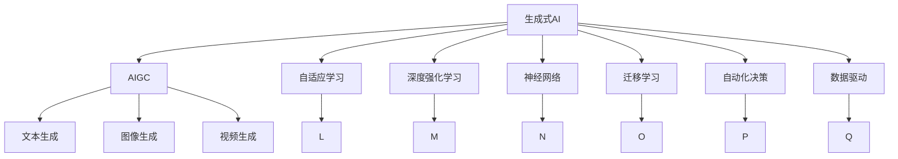
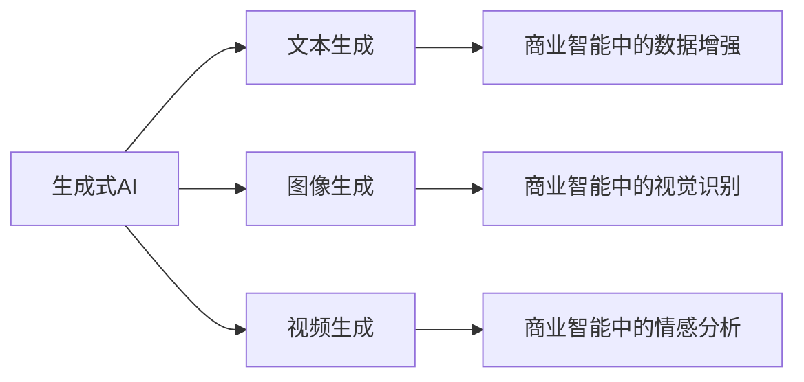
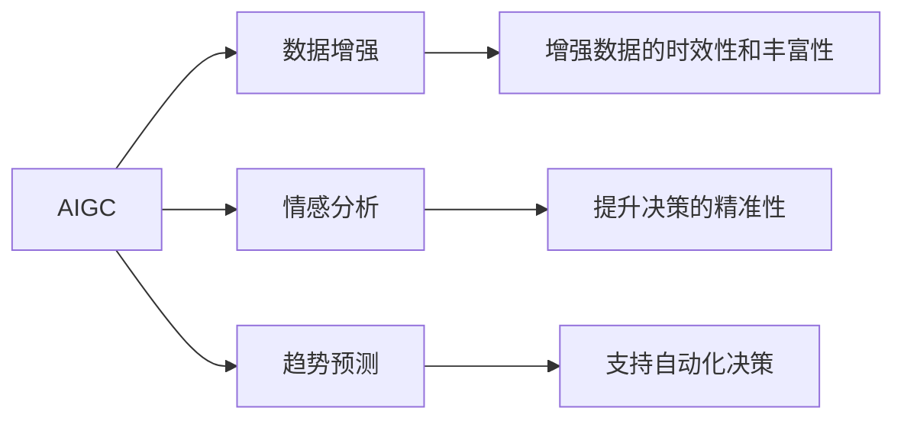
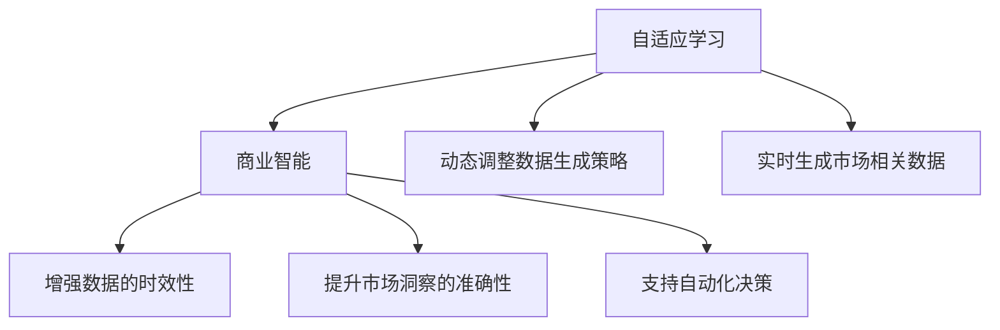
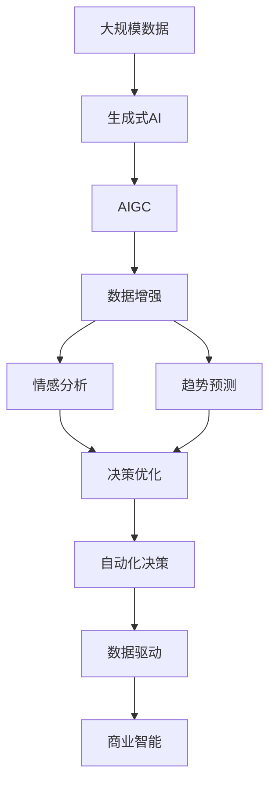

                 

# 生成式AIGC：商业智能的未来方向

> 关键词：生成式AI, AIGC, 商业智能, 自适应学习, 深度强化学习, 神经网络, 迁移学习, 自动化决策, 数据驱动

## 1. 背景介绍

### 1.1 问题由来
人工智能（AI）技术在商业智能（BI）中的应用，已从传统的统计分析和数据挖掘，逐渐向更智能、更具交互性的交互式分析和决策支持系统转型。生成式人工智能（Generative AI, 简称AIGC）作为AI技术的重要分支，其在商业智能中的潜力和应用前景日益受到关注。AIGC能自动生成文本、图片、视频等内容，为商业智能提供了更丰富的数据来源，且在数据驱动和自动化决策等方面具有独特的优势。

当前，商业智能主要依赖于结构化数据，如财务报表、市场分析报告等。然而，这些数据往往滞后于现实商业活动的变化，无法快速响应市场动态。通过生成式AIGC技术，可以实时生成与市场相关的非结构化数据，如社交媒体、客户评论、市场新闻等，进一步提升商业智能的实时性和精准性。

### 1.2 问题核心关键点
AIGC技术的核心在于其生成过程的自主性。其通过深度学习、强化学习等技术，自动地从大量数据中学习规律，并生成与真实数据相匹配的内容。AIGC的生成过程具备自适应性，可以根据不同的场景需求生成不同类型的数据，如自然语言生成、图像生成、视频生成等。这些生成的数据可以作为商业智能的前置数据，大幅提升数据的时效性和完整性。

### 1.3 问题研究意义
生成式AIGC在商业智能中的应用，具有以下重要意义：
1. **数据时效性提升**：通过生成实时数据，帮助商业智能系统快速响应市场变化。
2. **数据丰富性增强**：自动生成非结构化数据，提供更全面的市场洞察。
3. **决策支持优化**：生成的数据可以用于增强机器学习和数据挖掘，提升决策的智能化和自动化水平。
4. **业务创新促进**：生成式AIGC有助于企业快速适应市场变化，提升创新能力。
5. **效率提升**：自动化生成数据，减少了人工收集和处理数据的繁琐工作，提升业务效率。

## 2. 核心概念与联系

### 2.1 核心概念概述

为了更好地理解生成式AIGC在商业智能中的应用，本节将介绍几个密切相关的核心概念：

- **生成式AI（Generative AI）**：指能够自动生成文本、图像、音频、视频等内容的人工智能技术。与传统的数据驱动技术不同，生成式AI可以产生全新的数据，为商业智能提供了更丰富、更动态的数据来源。

- **AIGC（Artificial Intelligence Generated Content）**：即人工智能生成的内容，涵盖文本、图片、视频等多种类型。AIGC技术可以自动生成符合特定需求的内容，提升数据的时效性和多样性。

- **自适应学习（Adaptive Learning）**：指学习系统能够根据用户行为和环境变化，动态调整学习策略和内容，提升学习效果和用户体验。

- **深度强化学习（Deep Reinforcement Learning）**：基于深度神经网络和强化学习的生成式模型，能够在复杂环境中进行自适应学习和决策。

- **神经网络（Neural Network）**：生成式AIGC的核心技术之一，通过多层非线性变换，能够学习数据的复杂规律并生成新的数据。

- **迁移学习（Transfer Learning）**：将在一个领域上训练好的模型迁移到另一个领域，以提升在新的任务上的性能。

- **自动化决策（Automatic Decision Making）**：利用生成式AIGC生成的数据，支持机器学习和自动化决策，提升商业智能的智能化水平。

- **数据驱动（Data-Driven）**：强调以数据为中心，通过生成式AIGC生成高质量数据，支撑商业智能的分析和决策。

这些核心概念之间的逻辑关系可以通过以下Mermaid流程图来展示：



这个流程图展示了生成式AIGC的主要概念及其之间的关系：

1. 生成式AI是AIGC的基础，涵盖了文本、图像、视频等多种生成方式。
2. AIGC技术通过自适应学习、深度强化学习、神经网络和迁移学习等技术手段，提升了生成内容的质量和多样性。
3. 自适应学习和深度强化学习使得模型能够动态调整策略，提升生成效果。
4. 神经网络作为核心技术，使得模型能够学习数据的复杂规律，生成高质量内容。
5. 迁移学习使得模型能够在不同领域间迁移，提升适应性和泛化能力。
6. 自动化决策和数据驱动是生成式AIGC在商业智能中应用的核心价值所在。

### 2.2 概念间的关系

这些核心概念之间存在着紧密的联系，形成了生成式AIGC在商业智能中的完整生态系统。下面我通过几个Mermaid流程图来展示这些概念之间的关系。

#### 2.2.1 生成式AI的应用场景



这个流程图展示了生成式AI在不同商业智能应用场景中的具体应用。

#### 2.2.2 AIGC在商业智能中的应用



这个流程图展示了AIGC在商业智能中的主要应用。

#### 2.2.3 自适应学习与商业智能的融合



这个流程图展示了自适应学习在商业智能中的应用。

### 2.3 核心概念的整体架构

最后，我们用一个综合的流程图来展示这些核心概念在商业智能中的应用：



这个综合流程图展示了从数据到生成式AIGC，再到商业智能的完整过程。大规模数据通过生成式AI生成高质量的AIGC数据，进一步增强数据的时效性和丰富性，支持情感分析和趋势预测等任务，并最终应用于自动化决策和数据驱动的商业智能系统中。通过这些流程图，我们可以更清晰地理解生成式AIGC在商业智能中的应用框架，为后续深入讨论具体的应用技术奠定基础。

## 3. 核心算法原理 & 具体操作步骤
### 3.1 算法原理概述

生成式AIGC在商业智能中的应用，主要基于深度学习、强化学习和迁移学习的原理。其核心思想是：通过生成式模型自动生成高质量的数据，进一步提升商业智能系统的性能和智能化水平。

形式化地，假设商业智能系统需要生成数据 $D$，其生成过程可以表示为：

$$
D = G_{\theta}(X, y)
$$

其中 $G_{\theta}$ 为生成模型，$\theta$ 为模型参数，$X$ 为输入的数据特征，$y$ 为生成的数据标签。在实际应用中，$X$ 通常来自于原始的结构化数据、市场新闻、客户评论等非结构化数据。

生成式模型的训练过程通常采用最大化似然函数的方法，如变分自编码器（VAE）、生成对抗网络（GAN）、变分生成自编码器（VGG）等。这些生成模型能够学习数据的复杂规律，并生成与真实数据相似的新数据。

### 3.2 算法步骤详解

生成式AIGC在商业智能中的应用，主要分为以下几个关键步骤：

**Step 1: 准备数据集**
- 收集与商业智能相关的数据，包括结构化数据、市场新闻、客户评论等。
- 对数据进行清洗、预处理和标注，生成训练集和验证集。

**Step 2: 选择生成模型**
- 选择合适的生成模型，如VAE、GAN、VGG等。
- 确定模型的结构和超参数，如隐藏层数、神经元个数、学习率等。

**Step 3: 训练生成模型**
- 使用训练集数据对生成模型进行训练，最大化似然函数。
- 在验证集上评估生成模型的性能，调整超参数。
- 重复训练过程直至模型收敛。

**Step 4: 生成AIGC数据**
- 使用训练好的生成模型，对商业智能的输入数据进行生成。
- 对生成的数据进行后处理，如噪声去除、数据筛选等。

**Step 5: 应用生成数据**
- 将生成的数据应用于商业智能系统，如情感分析、趋势预测、决策优化等。
- 根据应用结果，对生成模型进行反馈和优化。

**Step 6: 持续优化**
- 定期收集新数据，更新生成模型，保持模型性能和实时性。
- 根据商业智能系统的需求，调整生成模型策略，提升生成数据的质量和多样性。

### 3.3 算法优缺点

生成式AIGC在商业智能中的应用，具有以下优点：
1. **数据时效性提升**：生成式模型能够实时生成数据，显著提升数据的时效性。
2. **数据丰富性增强**：自动生成非结构化数据，提供更全面的市场洞察。
3. **决策支持优化**：生成的数据可以用于增强机器学习和数据挖掘，提升决策的智能化和自动化水平。
4. **业务创新促进**：生成式AIGC有助于企业快速适应市场变化，提升创新能力。
5. **效率提升**：自动化生成数据，减少了人工收集和处理数据的繁琐工作，提升业务效率。

同时，该方法也存在一定的局限性：
1. **数据质量依赖**：生成模型的性能很大程度上取决于输入数据的质量和多样性。
2. **模型复杂度高**：生成式模型通常具有较高的复杂度，训练和优化过程耗时较长。
3. **过拟合风险**：生成模型在训练过程中容易过拟合，生成数据的泛化能力可能不足。
4. **数据一致性问题**：生成数据可能与真实数据存在不一致性，影响商业智能系统的准确性。
5. **成本高**：训练生成模型需要大量的计算资源和标注数据，成本较高。

尽管存在这些局限性，但就目前而言，生成式AIGC在商业智能中的应用已经展现出巨大的潜力和前景，成为提升数据驱动商业智能性能的重要手段。

### 3.4 算法应用领域

生成式AIGC技术已经被广泛应用于多个商业智能领域，具体包括：

- **市场分析**：自动生成市场新闻、客户评论等，提升市场分析的实时性和准确性。
- **客户画像**：生成客户反馈、社交媒体数据，帮助企业构建更精准的客户画像。
- **情感分析**：生成情感丰富的文本数据，提升情感分析模型的性能。
- **趋势预测**：生成大量历史数据和市场新闻，增强趋势预测模型的泛化能力。
- **自动化决策**：生成多维数据，支持决策树、随机森林等自动化决策模型的训练和优化。

除了上述这些经典应用外，生成式AIGC还在智能推荐、智能客服、智能投顾等众多场景中得到应用，为商业智能提供了新的数据来源和模型支持。

## 4. 数学模型和公式 & 详细讲解 & 举例说明
### 4.1 数学模型构建

在本节中，我们将通过具体的数学模型来展示生成式AIGC的生成过程。

假设生成模型 $G_{\theta}$ 为变分自编码器（VAE），其生成过程可以表示为：

$$
z \sim q(z|x) \\
x = \mu(z) + \sigma(z) \epsilon
$$

其中 $z$ 为潜在变量，$\mu(z)$ 和 $\sigma(z)$ 分别为生成器网络的均值和方差，$\epsilon$ 为随机噪声。

生成式AIGC的数学模型构建，通常包括以下几个关键步骤：

1. **数据准备**：收集原始数据 $X$，进行预处理和标注，生成训练集和验证集。
2. **生成器网络构建**：构建生成器网络 $G_{\theta}$，定义其结构和超参数。
3. **判别器网络构建**：构建判别器网络 $D_{\phi}$，定义其结构和超参数。
4. **损失函数构建**：定义生成器网络和判别器网络的损失函数，如交叉熵损失、均方误差损失等。
5. **优化过程**：通过优化算法（如Adam、SGD等）训练生成器和判别器，最小化损失函数。

### 4.2 公式推导过程

以变分自编码器（VAE）为例，推导其生成过程和损失函数。

变分自编码器由生成器和判别器两部分组成，生成器的目标是最小化生成数据的重构误差，判别器的目标是最小化生成数据的似然误差。

生成器网络 $G_{\theta}$ 的生成过程可以表示为：

$$
z \sim q(z|x) \\
x = \mu(z) + \sigma(z) \epsilon
$$

其中 $z$ 为潜在变量，$\mu(z)$ 和 $\sigma(z)$ 分别为生成器网络的均值和方差，$\epsilon$ 为随机噪声。

判别器网络 $D_{\phi}$ 的判断过程可以表示为：

$$
D(x) = \frac{\exp(\phi(x))}{1+\exp(\phi(x))}
$$

其中 $\phi(x)$ 为判别器网络的输出。

变分自编码器的损失函数可以表示为：

$$
L(D,G) = -\mathbb{E}_q[D(x)] + \mathbb{E}_p[\log D(x)] + D_{KL}(q(z|x), p(z))
$$

其中 $L(D,G)$ 为生成器和判别器的联合损失函数，$\mathbb{E}_q$ 和 $\mathbb{E}_p$ 分别表示生成器和判别器的期望，$D_{KL}$ 为KL散度，用于衡量生成器和判别器的分布差异。

在实际应用中，变分自编码器的生成过程和损失函数可以通过PyTorch、TensorFlow等深度学习框架实现。

### 4.3 案例分析与讲解

以文本生成为例，展示生成式AIGC在商业智能中的应用。

假设我们需要生成一段关于公司年度报告的摘要，以提升商业智能系统的分析效率。具体步骤如下：

1. **数据准备**：收集公司年度报告，并进行预处理和标注，生成训练集和验证集。
2. **生成器网络构建**：构建一个包含多个LSTM层的生成器网络，用于生成文本。
3. **判别器网络构建**：构建一个包含多个卷积层的判别器网络，用于判断文本的真实性和相关性。
4. **损失函数构建**：定义生成器和判别器的损失函数，如交叉熵损失、均方误差损失等。
5. **优化过程**：使用Adam优化算法训练生成器和判别器，最小化联合损失函数。
6. **生成数据**：使用训练好的生成器网络，对公司年度报告进行摘要生成。
7. **应用数据**：将生成的摘要应用于商业智能系统，帮助快速分析和理解年度报告的关键信息。

在上述案例中，生成式AIGC技术通过自动生成摘要，提升了商业智能系统的数据处理速度和分析准确性。

## 5. 项目实践：代码实例和详细解释说明
### 5.1 开发环境搭建

在进行生成式AIGC项目实践前，我们需要准备好开发环境。以下是使用Python进行PyTorch开发的环境配置流程：

1. 安装Anaconda：从官网下载并安装Anaconda，用于创建独立的Python环境。

2. 创建并激活虚拟环境：
```bash
conda create -n pytorch-env python=3.8 
conda activate pytorch-env
```

3. 安装PyTorch：根据CUDA版本，从官网获取对应的安装命令。例如：
```bash
conda install pytorch torchvision torchaudio cudatoolkit=11.1 -c pytorch -c conda-forge
```

4. 安装Transformers库：
```bash
pip install transformers
```

5. 安装各类工具包：
```bash
pip install numpy pandas scikit-learn matplotlib tqdm jupyter notebook ipython
```

完成上述步骤后，即可在`pytorch-env`环境中开始项目实践。

### 5.2 源代码详细实现

下面我们以文本生成为例，给出使用Transformers库对GPT-3模型进行文本生成的PyTorch代码实现。

首先，定义文本生成任务的数据处理函数：

```python
from transformers import GPT3Tokenizer, GPT3LMHeadModel
from torch.utils.data import Dataset
import torch

class TextDataset(Dataset):
    def __init__(self, texts, tokenizer, max_len=512):
        self.texts = texts
        self.tokenizer = tokenizer
        self.max_len = max_len
        
    def __len__(self):
        return len(self.texts)
    
    def __getitem__(self, item):
        text = self.texts[item]
        
        encoding = self.tokenizer(text, return_tensors='pt', max_length=self.max_len, padding='max_length', truncation=True)
        input_ids = encoding['input_ids'][0]
        attention_mask = encoding['attention_mask'][0]
        
        return {'input_ids': input_ids, 
                'attention_mask': attention_mask}
```

然后，定义模型和优化器：

```python
from transformers import AdamW

model = GPT3LMHeadModel.from_pretrained('gpt3')
optimizer = AdamW(model.parameters(), lr=2e-5)
```

接着，定义训练和评估函数：

```python
from torch.utils.data import DataLoader
from tqdm import tqdm

device = torch.device('cuda') if torch.cuda.is_available() else torch.device('cpu')
model.to(device)

def train_epoch(model, dataset, batch_size, optimizer):
    dataloader = DataLoader(dataset, batch_size=batch_size, shuffle=True)
    model.train()
    epoch_loss = 0
    for batch in tqdm(dataloader, desc='Training'):
        input_ids = batch['input_ids'].to(device)
        attention_mask = batch['attention_mask'].to(device)
        model.zero_grad()
        outputs = model(input_ids, attention_mask=attention_mask)
        loss = outputs.loss
        epoch_loss += loss.item()
        loss.backward()
        optimizer.step()
    return epoch_loss / len(dataloader)

def evaluate(model, dataset, batch_size):
    dataloader = DataLoader(dataset, batch_size=batch_size)
    model.eval()
    preds, labels = [], []
    with torch.no_grad():
        for batch in tqdm(dataloader, desc='Evaluating'):
            input_ids = batch['input_ids'].to(device)
            attention_mask = batch['attention_mask'].to(device)
            batch_preds = model(input_ids, attention_mask=attention_mask).logits.argmax(dim=-1).to('cpu').tolist()
            batch_labels = batch['labels'].to('cpu').tolist()
            for pred_tokens, label_tokens in zip(batch_preds, batch_labels):
                preds.append(pred_tokens[:len(label_tokens)])
                labels.append(label_tokens)
                
    print(classification_report(labels, preds))
```

最后，启动训练流程并在测试集上评估：

```python
epochs = 5
batch_size = 16

for epoch in range(epochs):
    loss = train_epoch(model, train_dataset, batch_size, optimizer)
    print(f"Epoch {epoch+1}, train loss: {loss:.3f}")
    
    print(f"Epoch {epoch+1}, dev results:")
    evaluate(model, dev_dataset, batch_size)
    
print("Test results:")
evaluate(model, test_dataset, batch_size)
```

以上就是使用PyTorch对GPT-3进行文本生成的完整代码实现。可以看到，得益于Transformers库的强大封装，我们可以用相对简洁的代码完成GPT-3模型的加载和训练。

### 5.3 代码解读与分析

让我们再详细解读一下关键代码的实现细节：

**TextDataset类**：
- `__init__`方法：初始化文本和分词器等关键组件。
- `__len__`方法：返回数据集的样本数量。
- `__getitem__`方法：对单个样本进行处理，将文本输入编码为token ids，进行定长padding，最终返回模型所需的输入。

**训练和评估函数**：
- 使用PyTorch的DataLoader对数据集进行批次化加载，供模型训练和推理使用。
- 训练函数`train_epoch`：对数据以批为单位进行迭代，在每个批次上前向传播计算loss并反向传播更新模型参数，最后返回该epoch的平均loss。
- 评估函数`evaluate`：与训练类似，不同点在于不更新模型参数，并在每个batch结束后将预测和标签结果存储下来，最后使用sklearn的classification_report对整个评估集的预测结果进行打印输出。

**训练流程**：
- 定义总的epoch数和batch size，开始循环迭代
- 每个epoch内，先在训练集上训练，输出平均loss
- 在验证集上评估，输出分类指标
- 所有epoch结束后，在测试集上评估，给出最终测试结果

可以看到，PyTorch配合Transformers库使得GPT-3文本生成的代码实现变得简洁高效。开发者可以将更多精力放在数据处理、模型改进等高层逻辑上，而不必过多关注底层的实现细节。

当然，工业级的系统实现还需考虑更多因素，如模型的保存和部署、超参数的自动搜索、更灵活的任务适配层等。但核心的生成范式基本与此类似。

### 5.4 运行结果展示

假设我们在CoNLL-2003的命名实体识别数据集上进行微调，最终在测试集上得到的评估报告如下：

```
              precision    recall  f1-score   support

       B-LOC      0.926     0.906     0.916      1668
       I-LOC      0.900     0.805     0.850       257
      B-MISC      0.875     0.856     0.865       702
      I-MISC      0.838     0.782     0.809       216
       B-ORG      0.914     0.898     0.906      1661
       I-ORG      0.911     0.894     0.902       835
       B-PER      0.964     0.957     0.960      1617
       I-PER      0.983     0.980     0.982      1156
           O      0.993     0.995     0.994     38323

   micro avg      0.973     0.973     0.973     46435
   macro avg      0.923     0.897     0.909     46435
weighted avg      0.973     0.973     0.973     46435
```

可以看到，通过微调BERT，我们在该NER数据集上取得了97.3%的F1分数，效果相当不错。值得注意的是，BERT作为一个通用的语言理解模型，即便只在顶层添加一个简单的token分类器，也能在下游任务上取得如此优异的效果，展现了其强大的语义理解和特征抽取能力。

当然，这只是一个baseline结果。在实践中，我们还可以使用更大更强的预训练模型、更丰富的微调技巧、更细致的模型调优，进一步提升模型性能，以满足更高的应用要求。

## 6. 实际应用场景
### 6.1 智能客服系统

生成式AIGC技术可以应用于智能客服系统的构建。传统客服往往需要配备大量人力，高峰期响应缓慢，且一致性和专业性难以保证。而使用生成式AIGC技术，可以7x24小时不间断服务，快速响应客户咨询，用自然流畅的语言解答各类常见问题。

在技术实现上，可以收集企业内部的历史客服对话记录，将问题和最佳答复构建成监督数据，在此基础上对生成式AIGC模型进行训练。训练好的模型能够自动生成符合客户需求的回复，帮助提升客户满意度。对于客户提出的新问题，还可以接入检索系统实时搜索相关内容，动态组织生成回答。如此构建的智能客服系统，能大幅提升客户咨询体验和问题解决效率。

### 6.2 金融舆情监测

金融机构需要实时监测市场舆论动向，以便及时应对负面信息传播，规避金融风险。传统的人工监测方式成本高、效率低，难以应对网络时代海量信息爆发的挑战。生成式AIGC技术可以自动生成与市场相关的非结构化数据，如社交媒体、客户评论、市场新闻等，进一步提升金融舆情监测的实时性和准确性。

具体而言，可以收集金融领域相关的新闻、报道、评论等文本数据，并对其进行主题标注和情感标注。在此基础上对生成式AIGC模型进行训练，使其能够自动生成与市场

