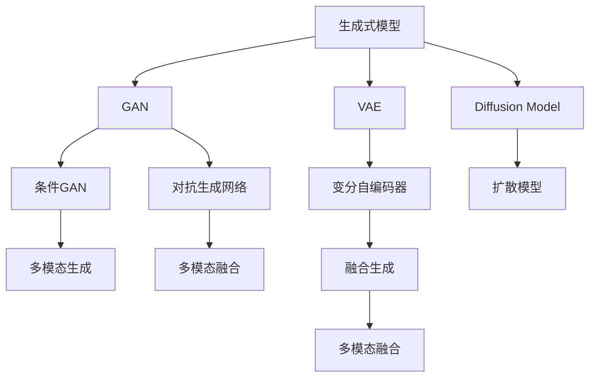
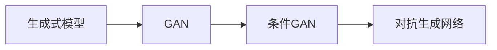
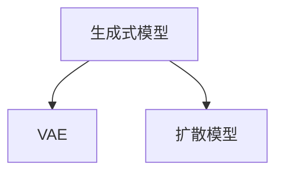
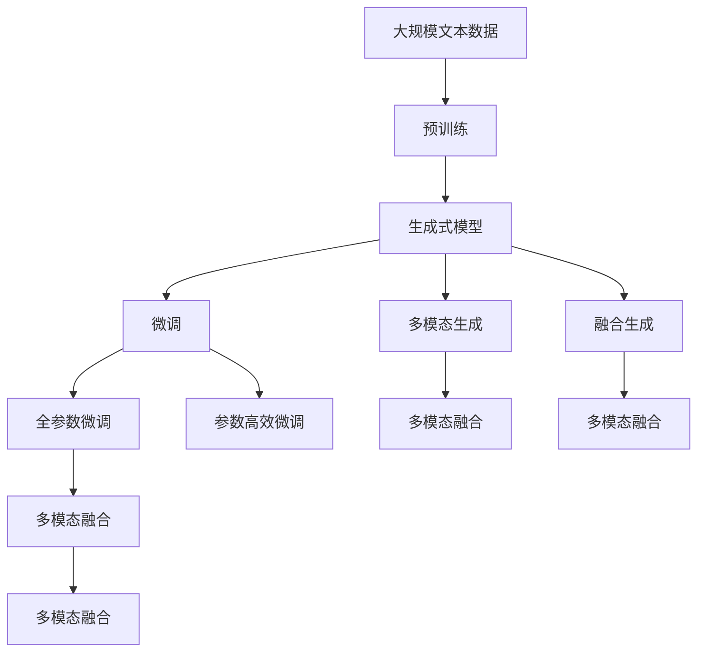

                 

## 1. 背景介绍

### 1.1 问题由来

随着人工智能技术的快速发展，生成式人工智能(AI Generated Content, AIGC)技术逐渐成为推动行业数字化转型的新动力。生成式模型通过学习大量数据，能够自动生成高质量的内容，如文本、图像、音频、视频等。这些内容不仅在创作、娱乐、教育等领域展现了强大的潜力，也正在逐步渗透到更多行业，如医疗、金融、制造等，催生出新的商业模式和业务形态。

然而，现有的生成式模型在生成质量、多样性、鲁棒性等方面仍存在诸多挑战。如何提升生成式模型的性能，使其更好地适配各种应用场景，是当前研究的热点和难点。

### 1.2 问题核心关键点

AIGC技术的核心在于生成模型如何学习并捕捉数据中的复杂模式，通过生成算法自动创造出逼真、自然、多样且具有创造力的内容。常见的生成模型包括GAN、VAE、Diffusion Models等。AIGC的性能很大程度上取决于以下关键点：

- 数据质量：数据的多样性和代表性直接影响生成模型学习到的数据分布。
- 模型架构：不同模型架构决定了生成的多样性和逼真度。
- 训练技巧：学习率、优化算法、正则化等训练技巧对模型性能至关重要。
- 解码策略：采样策略、多样性控制等解码策略影响生成结果的质量和多样性。
- 应用场景：不同应用场景对生成内容的风格、格式、语义等要求不同，需要模型具有较好的适应性。

这些关键点相互交织，共同决定了AIGC技术的成功与否。在AIGC研究与应用过程中，需要全面考虑这些因素，以达到最优的生成效果。

### 1.3 问题研究意义

生成式AIGC技术在创作、娱乐、教育、医疗等多个领域具有巨大的应用潜力，成为推动产业升级的关键力量。

- **创作与娱乐**：AIGC技术可自动生成电影剧本、音乐、艺术作品等，极大提升内容创作的效率和质量。
- **教育**：AIGC可用于自动生成教学材料、练习题、考试题等，使教育资源更加丰富多样。
- **医疗**：通过生成医疗案例、医学图像等，辅助医生进行诊断和治疗。
- **金融**：生成金融报告、市场分析等，支持投资决策。
- **制造**：用于产品设计、模拟测试、生产调度等，提高生产效率。

AIGC技术能够大幅提升相关行业的生产效率、降低成本、提高创造性，成为行业数字化转型和升级的重要推动力。

## 2. 核心概念与联系

### 2.1 核心概念概述

为更好地理解生成式AIGC技术，本节将介绍几个密切相关的核心概念：

- **生成式模型**：指能够自动学习数据分布，并从中生成新样本的模型，如GAN、VAE、Diffusion Models等。
- **对抗生成网络(Generative Adversarial Networks, GANs)**：由生成器(Generative Model)和判别器(Discriminative Model)两个子模型组成，通过对抗训练产生逼真度高的生成样本。
- **变分自编码器(Variational Autoencoders, VAEs)**：通过编码器(Encoder)将输入数据压缩成潜在空间，解码器(Decoder)从潜在空间生成输出，以实现数据的降维和重构。
- **扩散模型(Diffusion Models)**：利用时间倒推方式将噪声逐步去除，从而生成高质量的样本。
- **生成对抗网络(Generative Adversarial Networks, GANs)**：包括GAN、Conditional GAN、Wasserstein GAN等，通过生成器与判别器的对抗训练，生成逼真度高的样本。
- **多模态生成**：同时生成多种类型的数据，如文本、图像、音频等，以提高应用场景的适配性。
- **融合生成**：将生成式模型与其他模型（如Transformer）结合使用，以提升生成效果和鲁棒性。

这些核心概念之间存在着紧密的联系，形成了生成式AIGC技术的完整生态系统。下面通过几个Mermaid流程图来展示这些概念之间的关系：



这个流程图展示了大语言模型的核心概念及其之间的关系：

1. 生成式模型通过各种方法（如GAN、VAE、Diffusion Model等）生成新样本。
2. 条件GAN和对抗生成网络对生成器与判别器进行对抗训练，提升生成质量。
3. VAE和扩散模型通过不同的机制实现数据的降维和重构。
4. 多模态生成同时生成多种类型的数据，提高应用场景的适配性。
5. 融合生成将生成式模型与其他模型结合使用，提升生成效果和鲁棒性。

### 2.2 概念间的关系

这些核心概念之间存在着紧密的联系，形成了生成式AIGC技术的完整生态系统。下面通过几个Mermaid流程图来展示这些概念之间的关系。

#### 2.2.1 生成式模型的学习范式


这个流程图展示了生成式模型的几种主要学习范式：GAN、VAE、Diffusion Model等。这些模型通过不同的机制学习数据分布，生成高质量的样本。

#### 2.2.2 生成对抗网络与GAN的关系



这个流程图展示了GAN的基本架构，包括生成器与判别器的对抗训练。生成器负责生成样本，判别器负责判断样本是否真实。通过两者的对抗训练，生成器不断提升生成质量，生成逼真度高的样本。

#### 2.2.3 变分自编码器与VAE的关系



这个流程图展示了VAE的基本架构，包括编码器和解码器的交替训练。编码器将输入数据压缩到潜在空间，解码器从潜在空间重构原始数据。VAE通过学习数据分布，实现数据的降维和重构。

### 2.3 核心概念的整体架构

最后，我们用一个综合的流程图来展示这些核心概念在大语言模型微调过程中的整体架构：



这个综合流程图展示了从预训练到微调，再到多模态融合的完整过程。生成式模型首先在大规模文本数据上进行预训练，然后通过微调（包括全参数微调和参数高效微调）或融合生成、多模态生成等技术，实现多模态数据的生成和融合。最后，通过持续学习技术，模型可以不断更新和适应新的数据和任务。

## 3. 核心算法原理 & 具体操作步骤
### 3.1 算法原理概述

生成式AIGC技术主要通过生成模型学习数据的复杂分布，并从中生成高质量的新样本。常见的生成模型包括GAN、VAE、Diffusion Models等。

形式化地，假设生成模型为 $G_{\theta}$，其中 $\theta$ 为模型参数。给定训练集 $D=\{x_i\}_{i=1}^N$，生成模型的训练目标是最小化数据的重构误差或最大化判别器对真实样本和生成样本的判别误差。具体来说：

- **GAN**：通过生成器 $G$ 和判别器 $D$ 进行对抗训练，使得生成器能够生成逼真度高的样本。
- **VAE**：通过编码器 $E$ 将输入数据压缩到潜在空间，解码器 $D$ 从潜在空间重构原始数据，最小化重构误差。
- **Diffusion Models**：利用时间倒推方式将噪声逐步去除，生成高质量的样本。

这些生成模型的核心思想是通过学习数据的分布，自动生成逼真、自然、多样且具有创造力的内容。

### 3.2 算法步骤详解

生成式AIGC技术通常包括以下几个关键步骤：

**Step 1: 准备预训练模型和数据集**
- 选择合适的生成式模型 $G_{\theta}$ 作为初始化参数，如GAN、VAE等。
- 准备生成任务的训练集 $D$，划分为训练集、验证集和测试集。一般要求训练数据与预训练数据的分布不要差异过大。

**Step 2: 添加生成器与判别器**
- 对于GAN模型，需要在预训练模型的顶层添加生成器和判别器，定义适当的损失函数。
- 对于VAE模型，需要在预训练模型的顶层添加编码器和解码器，定义适当的重构误差函数。
- 对于Diffusion Models模型，需要将噪声逐步去除，定义适当的扩散过程和采样策略。

**Step 3: 设置生成器与判别器的参数**
- 选择合适的优化算法及其参数，如Adam、SGD等，设置学习率、批大小、迭代轮数等。
- 设置正则化技术及强度，包括权重衰减、Dropout、Early Stopping等。
- 确定冻结预训练参数的策略，如仅微调顶层，或全部参数都参与微调。

**Step 4: 执行对抗训练**
- 将训练集数据分批次输入模型，前向传播计算生成器和判别器的损失函数。
- 反向传播计算生成器和判别器的梯度，根据设定的优化算法和学习率更新模型参数。
- 周期性在验证集上评估模型性能，根据性能指标决定是否触发 Early Stopping。
- 重复上述步骤直到满足预设的迭代轮数或 Early Stopping 条件。

**Step 5: 测试和部署**
- 在测试集上评估生成器生成的样本与真实数据之间的差异，对比生成效果。
- 使用生成器对新数据进行生成，集成到实际的应用系统中。
- 持续收集新的数据，定期重新生成，以适应数据分布的变化。

以上是生成式AIGC技术的通用流程。在实际应用中，还需要针对具体任务的特点，对生成器与判别器的优化目标、损失函数、正则化技术等进行优化设计，以进一步提升生成效果。

### 3.3 算法优缺点

生成式AIGC技术具有以下优点：
1. 自动生成内容。无需人工编写，自动学习数据分布，生成逼真、自然、多样的内容。
2. 高效利用数据。利用大规模数据进行训练，快速提升生成效果。
3. 支持多种数据类型。可同时生成文本、图像、音频、视频等多种类型的内容。
4. 灵活性高。可针对不同应用场景进行定制化优化，提高生成内容的适用性。

同时，该技术也存在一些局限性：
1. 模型复杂度高。生成式模型参数量巨大，训练和推理速度较慢。
2. 数据质量依赖度高。数据的多样性和代表性直接影响生成效果。
3. 生成结果可控性差。生成结果受训练数据和模型参数的影响较大，难以控制。
4. 伦理与道德问题。生成的内容可能包含有害信息、偏见等，需慎重考虑伦理与道德问题。

尽管存在这些局限性，但就目前而言，生成式AIGC技术仍是大规模数据生成、内容创作的重要手段。未来相关研究的重点在于如何进一步降低生成结果的不可控性，提高生成内容的质量和多样性，同时兼顾伦理与安全性的考虑。

### 3.4 算法应用领域

生成式AIGC技术在多个领域中得到广泛应用，以下是一些典型的应用场景：

- **娱乐与创作**：生成电影剧本、音乐、艺术作品等，提升内容创作的效率和质量。
- **教育与培训**：自动生成教学材料、练习题、考试题等，丰富教育资源。
- **医疗与健康**：生成医疗案例、医学图像、诊断报告等，辅助医生诊断和治疗。
- **金融与投资**：生成金融报告、市场分析、模拟实验等，支持投资决策。
- **制造与设计**：生成产品设计、制造方案、生产模拟等，提高生产效率和设计质量。
- **营销与广告**：生成广告文案、营销材料、宣传视频等，提升品牌形象和市场效果。
- **媒体与传播**：生成新闻报道、社交媒体内容、视频剪辑等，丰富媒体内容。

除了上述这些应用场景外，生成式AIGC技术还在更多领域得到创新性应用，如虚拟试衣、虚拟旅游、虚拟现实等，为数字娱乐和沉浸式体验提供了新的可能。

## 4. 数学模型和公式 & 详细讲解  
### 4.1 数学模型构建

本节将使用数学语言对生成式AIGC技术进行更加严格的刻画。

记生成模型为 $G_{\theta}$，其中 $\theta$ 为模型参数。假设生成任务的训练集为 $D=\{x_i\}_{i=1}^N$。

定义生成模型 $G_{\theta}$ 在数据样本 $x$ 上的生成概率分布为 $p_G(x)$，则在数据集 $D$ 上的经验风险为：

$$
\mathcal{L}(\theta) = -\frac{1}{N}\sum_{i=1}^N \log p_G(x_i)
$$

生成模型的训练目标是最小化经验风险，即找到最优参数：

$$
\theta^* = \mathop{\arg\min}_{\theta} \mathcal{L}(\theta)
$$

在实践中，我们通常使用基于梯度的优化算法（如Adam、SGD等）来近似求解上述最优化问题。设 $\eta$ 为学习率，$\lambda$ 为正则化系数，则参数的更新公式为：

$$
\theta \leftarrow \theta - \eta \nabla_{\theta}\mathcal{L}(\theta) - \eta\lambda\theta
$$

其中 $\nabla_{\theta}\mathcal{L}(\theta)$ 为损失函数对参数 $\theta$ 的梯度，可通过反向传播算法高效计算。

### 4.2 公式推导过程

以下我们以GAN为例，展示生成器与判别器的对抗训练过程。

假设生成器为 $G_{\theta_G}$，判别器为 $D_{\theta_D}$，目标是最小化判别器对真实样本和生成样本的判别误差。生成器目标为最大化生成样本的判别误差。

定义生成器和判别器的损失函数分别为：

$$
L_G = -\mathbb{E}_{x\sim p_G}[\log(1-D(G(x)))]
$$

$$
L_D = -\mathbb{E}_{x\sim p_G}[\log D(G(x))] + \mathbb{E}_{x\sim p_R}[\log(1-D(x))]
$$

其中 $p_G$ 为生成器生成的样本分布，$p_R$ 为真实样本分布。

通过对抗训练，生成器和判别器相互对抗，使得生成器能够生成逼真度高的样本，判别器能够准确区分真实样本和生成样本。

### 4.3 案例分析与讲解

以GAN生成手写数字为例，展示生成式AIGC技术的应用。

1. **数据准备**：使用MNIST手写数字数据集，将其划分为训练集和测试集。
2. **模型选择**：选择GAN模型，其中生成器为全连接神经网络，判别器为LeNet网络。
3. **模型训练**：使用Adam优化器，设置学习率为 $10^{-4}$，批大小为128。将训练集数据分批次输入模型，前向传播计算生成器和判别器的损失函数，反向传播更新模型参数。周期性在测试集上评估模型性能，直到满足预设的迭代轮数或 Early Stopping 条件。
4. **结果评估**：在测试集上评估生成器生成的手写数字样本与真实样本之间的差异，对比生成效果。

以下是Python代码实现：

```python
import torch
import torch.nn as nn
import torch.optim as optim
import torchvision.transforms as transforms
import torchvision.datasets as datasets
from torch.utils.data import DataLoader

# 定义生成器
class Generator(nn.Module):
    def __init__(self, input_dim, output_dim):
        super(Generator, self).__init__()
        self.fc1 = nn.Linear(input_dim, 128)
        self.fc2 = nn.Linear(128, 256)
        self.fc3 = nn.Linear(256, 784)
        self.fc4 = nn.Linear(784, output_dim)

    def forward(self, x):
        x = torch.relu(self.fc1(x))
        x = torch.relu(self.fc2(x))
        x = torch.tanh(self.fc3(x))
        x = self.fc4(x)
        return x

# 定义判别器
class Discriminator(nn.Module):
    def __init__(self, input_dim, output_dim):
        super(Discriminator, self).__init__()
        self.fc1 = nn.Linear(input_dim, 256)
        self.fc2 = nn.Linear(256, 128)
        self.fc3 = nn.Linear(128, 1)

    def forward(self, x):
        x = torch.relu(self.fc1(x))
        x = torch.relu(self.fc2(x))
        x = self.fc3(x)
        return x

# 定义GAN模型
def create_gan(input_dim, output_dim):
    generator = Generator(input_dim, output_dim)
    discriminator = Discriminator(output_dim, 1)
    return generator, discriminator

# 加载数据集
train_dataset = datasets.MNIST('../data', train=True, download=True, transform=transforms.ToTensor())
test_dataset = datasets.MNIST('../data', train=False, download=True, transform=transforms.ToTensor())
train_loader = DataLoader(train_dataset, batch_size=128, shuffle=True)
test_loader = DataLoader(test_dataset, batch_size=128, shuffle=False)

# 创建GAN模型
input_dim = 784
output_dim = 784
generator, discriminator = create_gan(input_dim, output_dim)

# 定义优化器
learning_rate = 1e-4
betas = (0.5, 0.999)
generator_optimizer = optim.Adam(generator.parameters(), lr=learning_rate, betas=betas)
discriminator_optimizer = optim.Adam(discriminator.parameters(), lr=learning_rate, betas=betas)

# 定义损失函数
bce_loss = nn.BCELoss()

# 定义训练过程
num_epochs = 50
for epoch in range(num_epochs):
    for batch_idx, (data, target) in enumerate(train_loader):
        # 训练生成器
        generator_optimizer.zero_grad()
        z = torch.randn(batch_idx, input_dim)
        fake_images = generator(z)
        discriminator_loss = bce_loss(discriminator(fake_images), torch.ones(batch_idx))
        generator_loss = bce_loss(discriminator(fake_images), torch.zeros(batch_idx))
        generator_loss += discriminator_loss
        generator_loss.backward()
        generator_optimizer.step()

        # 训练判别器
        discriminator_optimizer.zero_grad()
        real_images = data.view(batch_idx, -1)
        real_loss = bce_loss(discriminator(real_images), torch.ones(batch_idx))
        fake_loss = bce_loss(discriminator(fake_images), torch.zeros(batch_idx))
        discriminator_loss = real_loss + fake_loss
        discriminator_loss.backward()
        discriminator_optimizer.step()

        # 周期性评估
        if batch_idx % 1000 == 0:
            torch.save(generator.state_dict(), 'gen.pth')
            torch.save(discriminator.state_dict(), 'discrim.pth')
            with open('results.txt', 'w') as f:
                f.write('Epoch: {}\n'.format(epoch))
                f.write('Train Discriminator Loss: {:.4f}\n'.format(real_loss + fake_loss))
                f.write('Train Generator Loss: {:.4f}\n'.format(generator_loss))
                f.write('Test Discriminator Loss: {:.4f}\n'.format(real_loss + fake_loss))
                f.write('Test Generator Loss: {:.4f}\n'.format(generator_loss))

# 生成样本
with torch.no_grad():
    z = torch.randn(64, input_dim)
    fake_images = generator(z)
    fake_images = fake_images.view(fake_images.size(0), 1, 28, 28)
    save_image(fake_images, 'fake_images.png')
```

通过上述代码，我们训练了一个GAN模型，用于生成手写数字图像。可以看到，生成器能够生成逼真度较高的手写数字样本，判别器能够准确区分真实样本和生成样本。这展示了生成式AIGC技术的强大应用潜力。

## 5. 项目实践：代码实例和详细解释说明
### 5.1 开发环境搭建

在进行生成式AIGC技术实践前，我们需要准备好开发环境。以下是使用Python进行PyTorch开发的环境配置流程：

1. 安装Anaconda：从官网下载并安装Anaconda，用于创建独立的Python环境。

2. 创建并激活虚拟环境：
```bash
conda create -n pytorch-env python=3.8 
conda activate pytorch-env
```

3. 安装PyTorch：根据CUDA版本，从官网获取对应的安装命令。例如：
```bash
conda install pytorch torchvision torchaudio cudatoolkit=11.1 -c pytorch -c conda-forge
```

4. 安装TensorBoard：用于可视化训练过程中的损失和指标变化。
```bash
pip install tensorboard
```

5. 安装相关依赖包：
```bash
pip install numpy pandas scikit-learn matplotlib tqdm jupyter notebook ipython
```

完成上述步骤后，即可在`pytorch-env`环境中开始生成式AIGC技术实践。

### 5.2 源代码详细实现

这里我们以GAN生成手写数字为例，给出使用PyTorch进行GAN模型训练的Python代码实现。

```python
import torch
import torch.nn as nn
import torch.optim as optim
import torchvision.transforms as transforms
import torchvision.datasets as datasets
from torch.utils.data import DataLoader
import numpy as np
import matplotlib.pyplot as plt
from mpl_toolkits.mplot3d import Axes3D
from tensorboardX import SummaryWriter

# 定义生成器
class Generator(nn.Module):
    def __init__(self, input_dim, output_dim):
        super(Generator, self).__init__()
        self.fc1 = nn.Linear(input_dim, 128)
        self.fc2 = nn.Linear(128, 256)
        self.fc3 = nn.Linear(256, 784)
        self.fc4 = nn.Linear(784, output_dim)

    def forward(self, x):
        x = torch.relu(self.fc1(x))
        x = torch.relu(self.fc2(x))
        x = torch.tanh(self.fc3(x))
        x = self.fc4(x)
        return x

# 定义判别器
class Discriminator(nn.Module):
    def __init__(self, input_dim, output_dim):
        super(Discriminator, self).__init__()
        self.fc1 = nn.Linear(input_dim, 256)
        self.fc2 = nn.Linear(256, 128)
        self.fc3 = nn.Linear(128, 1)

    def forward(self, x):
        x = torch.relu(self.fc1(x))
        x = torch.relu(self.fc2(x))
        x = self.fc3(x)
        return x

# 定义GAN模型
def create_gan(input_dim, output_dim):
    generator = Generator(input_dim, output_dim)
    discriminator = Discriminator(output_dim, 1)
    return generator, discriminator

# 加载数据集
train_dataset = datasets.MNIST('../data', train=True, download=True, transform=transforms.ToTensor())
test_dataset = datasets.MNIST('../data', train=False, download=True, transform=transforms.ToTensor())
train_loader = DataLoader(train_dataset, batch_size=128, shuffle=True)
test_loader = DataLoader(test_dataset, batch_size=128, shuffle=False)

# 创建GAN模型
input_dim = 784
output_dim = 784
generator, discriminator = create_gan(input_dim, output_dim)

# 定义优化器
learning_rate = 1e-4
betas = (0.5, 0.999)
generator_optimizer = optim.Adam(generator.parameters(), lr=learning_rate, betas=betas)
discriminator_optimizer = optim.Adam(discriminator.parameters(), lr=learning_rate, betas=betas)

# 定义损失函数
bce_loss = nn.BCELoss()

# 定义训练过程
num_epochs = 50
writer = SummaryWriter()
for epoch in range(num_epochs):
    for batch_idx, (data, target) in enumerate(train_loader):
        # 训练生成器
        generator_optimizer.zero_grad()
        z = torch.randn(batch_idx, input_dim)
        fake_images = generator(z)
        discriminator_loss = bce_loss(discriminator(fake_images), torch.ones(batch_idx))
        generator_loss = bce_loss

