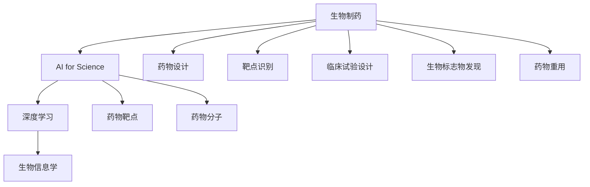
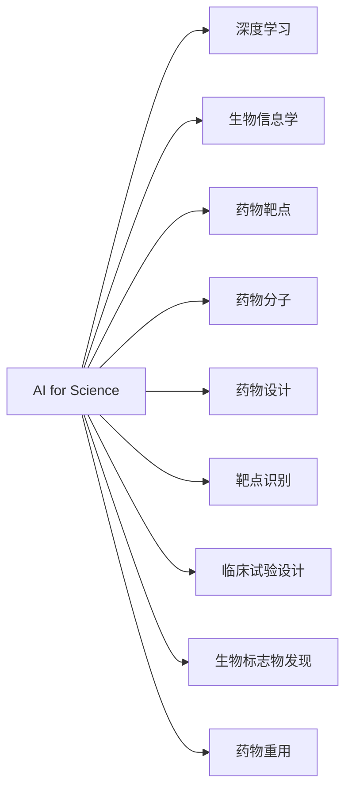
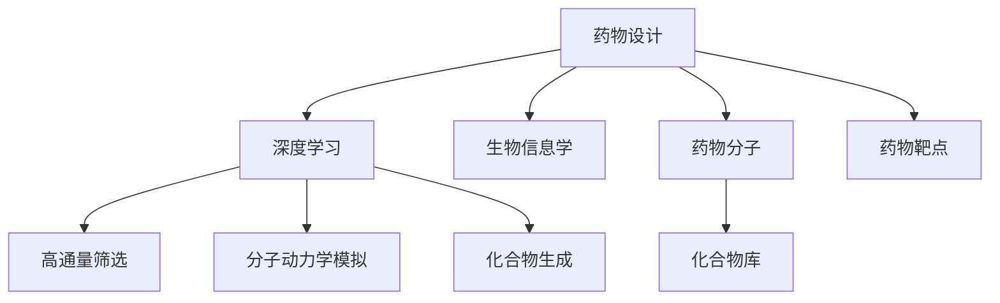

                 

# 生物制药中的AI for Science

## 1. 背景介绍

### 1.1 问题由来
在生物制药领域，传统的药物研发流程极为漫长和昂贵，通常需要10年以上的时间，耗资数十亿美元。而随着人工智能（AI）技术的发展，AI在生物制药中的应用逐渐深入，为药物研发带来了革命性的变革。AI for Science 就是通过应用 AI 技术，加速和优化药物发现、设计、筛选和临床试验的各个环节，大幅降低成本，缩短研发周期。

### 1.2 问题核心关键点
AI for Science 的核心在于将 AI 技术与生物制药的各个环节紧密结合，充分发挥 AI 在数据处理、模式识别、预测分析等方面的优势，辅助科学家进行药物的创新和优化。常见的 AI for Science 应用包括：

- **药物设计**：利用 AI 进行药物分子的设计、优化和筛选。
- **靶点识别**：通过 AI 预测和识别潜在的药物靶点。
- **临床试验设计**：利用 AI 进行临床试验方案的设计和优化。
- **生物标志物发现**：使用 AI 技术发现与疾病相关的生物标志物。
- **药物重用**：通过 AI 技术评估现有药物的再利用潜力。

### 1.3 问题研究意义
AI for Science 在生物制药领域的应用，具有以下几方面的重要意义：

- **加速药物研发**：AI 能够快速处理和分析大量数据，加速药物的发现和优化过程，缩短研发周期。
- **降低研发成本**：AI 可以预测药物的药效和副作用，减少无效的实验和临床试验，降低成本。
- **提高药物安全性**：AI 技术可以早期识别药物的潜在风险，优化药物设计，提高药物的安全性。
- **推动个性化医疗**：AI 可以根据患者的具体基因信息，设计个性化的药物方案，提升治疗效果。
- **促进药物重用**：AI 可以评估现有药物的再利用潜力，加速已有药物的二次开发和新药的发现。

## 2. 核心概念与联系

### 2.1 核心概念概述

为了更好地理解 AI for Science 在生物制药中的应用，本节将介绍几个密切相关的核心概念：

- **生物制药**：通过生物技术手段生产具有药理活性的化合物、蛋白或多肽等药物的过程。
- **AI for Science**：将 AI 技术应用于科学研究，加速科学发现、优化实验设计、提高数据处理能力等。
- **深度学习**：一种基于神经网络的学习方法，通过多层次的特征提取和抽象，实现复杂的模式识别和预测。
- **生物信息学**：应用计算机科学和信息技术的原理和方法，处理、存储、分析和解释生物数据。
- **药物靶点**：与药物相互作用的关键生物分子，如酶、受体、离子通道等。
- **药物分子**：通过化学合成或生物工程手段制备的具有药理活性的分子。

这些概念之间的逻辑关系可以通过以下 Mermaid 流程图来展示：



这个流程图展示了 AI for Science 在生物制药中的核心应用方向：

1. 生物制药通过 AI 技术加速药物设计、靶点识别、临床试验设计、生物标志物发现和药物重用。
2. AI for Science 涉及深度学习和生物信息学等技术，助力药物研发的全流程。
3. 药物设计、靶点识别等关键环节，需要通过 AI 进行特征提取和模式识别。

### 2.2 概念间的关系

这些核心概念之间存在着紧密的联系，形成了 AI for Science 在生物制药中的应用生态系统。下面我们通过几个 Mermaid 流程图来展示这些概念之间的关系。

#### 2.2.1 AI for Science 的总体架构



这个流程图展示了 AI for Science 在生物制药中的总体架构：

1. AI for Science 利用深度学习和生物信息学等技术，为药物研发提供全面的支持。
2. 药物设计、靶点识别等关键环节，需要通过 AI 进行特征提取和模式识别。
3. 临床试验设计和药物重用等环节，也需要 AI 技术进行优化和预测。

#### 2.2.2 AI for Science 在药物设计中的应用



这个流程图展示了 AI for Science 在药物设计中的应用：

1. 药物设计需要从大量分子库中筛选出潜在的药物候选。
2. 深度学习技术可以预测分子的生物活性和毒性，筛选出有效的化合物。
3. 分子动力学模拟可以预测分子的构效关系，优化药物分子设计。
4. 生物信息学技术可以分析基因表达、蛋白质结构等信息，辅助药物设计。

## 3. 核心算法原理 & 具体操作步骤

### 3.1 算法原理概述

AI for Science 的核心算法原理主要涉及深度学习、生物信息学和药物化学等多个学科。在药物研发中，AI for Science 主要通过以下几个关键步骤：

1. **数据预处理**：收集和清洗大量生物数据，包括基因序列、蛋白质结构、药物分子、临床试验数据等。
2. **特征提取**：利用深度学习算法对数据进行特征提取，识别关键生物分子和药物分子的结构和功能特性。
3. **模式识别**：通过深度学习模型进行模式识别，预测药物的生物活性和副作用，优化药物设计。
4. **数据驱动的实验设计**：利用 AI 技术进行实验方案设计，提高实验效率和成功率。
5. **生物标志物发现**：使用 AI 技术发现与疾病相关的生物标志物，辅助诊断和治疗。

### 3.2 算法步骤详解

下面以药物设计为例，详细讲解 AI for Science 的算法步骤。

**Step 1: 数据预处理**

1. **数据收集**：收集大量的生物数据，包括基因序列、蛋白质结构、药物分子结构、临床试验数据等。
2. **数据清洗**：对数据进行去重、去噪、标准化等处理，确保数据质量。

**Step 2: 特征提取**

1. **分子表示**：使用深度学习模型（如SMILES to Vector）将药物分子转换为向量表示。
2. **生物分子表示**：利用深度学习模型（如ProteinNet）将蛋白质结构转换为向量表示。
3. **基因序列表示**：使用深度学习模型（如Seq2Vec）将基因序列转换为向量表示。

**Step 3: 模式识别**

1. **药物活性预测**：使用深度学习模型（如ChemNet）进行药物活性的预测和筛选。
2. **副作用预测**：使用深度学习模型（如ToxNet）预测药物的副作用和毒性。
3. **分子构效关系预测**：使用分子动力学模拟和深度学习模型预测分子的构效关系，优化药物设计。

**Step 4: 数据驱动的实验设计**

1. **实验方案设计**：使用 AI 技术进行实验方案的设计和优化，包括药物筛选、动物实验等。
2. **结果预测和优化**：利用深度学习模型预测实验结果，优化实验设计。

**Step 5: 生物标志物发现**

1. **生物标志物筛选**：使用 AI 技术筛选与疾病相关的生物标志物。
2. **标志物验证**：利用临床数据验证生物标志物的准确性和可靠性。

### 3.3 算法优缺点

AI for Science 在药物设计中的应用具有以下优点：

1. **加速药物研发**：AI 能够快速处理和分析大量数据，加速药物的发现和优化过程，缩短研发周期。
2. **降低研发成本**：AI 可以预测药物的药效和副作用，减少无效的实验和临床试验，降低成本。
3. **提高药物安全性**：AI 技术可以早期识别药物的潜在风险，优化药物设计，提高药物的安全性。

同时，AI for Science 也存在以下缺点：

1. **数据依赖性高**：AI for Science 依赖高质量的生物数据，数据缺失或不准确会影响模型的预测效果。
2. **模型复杂度高**：深度学习模型的训练和优化需要大量的计算资源和时间，对硬件要求较高。
3. **缺乏可解释性**：深度学习模型的内部机制较为复杂，难以解释其决策过程。
4. **过拟合风险**：在数据量较小的情况下，模型容易出现过拟合，导致泛化性能不佳。

### 3.4 算法应用领域

AI for Science 在生物制药领域的应用涵盖了药物设计、靶点识别、临床试验设计、生物标志物发现和药物重用等多个方面。以下是几个典型的应用场景：

- **药物设计**：利用 AI 技术加速药物分子的设计和优化，减少无效实验，降低成本。
- **靶点识别**：通过 AI 技术预测和识别潜在的药物靶点，加速药物研发。
- **临床试验设计**：利用 AI 技术进行临床试验方案的设计和优化，提高试验效率。
- **生物标志物发现**：使用 AI 技术发现与疾病相关的生物标志物，辅助诊断和治疗。
- **药物重用**：通过 AI 技术评估现有药物的再利用潜力，加速已有药物的二次开发和新药的发现。

## 4. 数学模型和公式 & 详细讲解 & 举例说明

### 4.1 数学模型构建

本节将使用数学语言对 AI for Science 在药物设计中的应用进行更加严格的刻画。

假设有一组药物分子 $\{X_i\}_{i=1}^N$，每个分子的生物活性 $y_i$ 和毒性 $t_i$ 可以通过高通量筛选和动物实验得到。目标是通过 AI 模型预测新分子的生物活性和毒性，加速药物设计过程。

定义模型 $M_{\theta}$ 为深度学习网络，其中 $\theta$ 为模型参数。假设模型的输出为 $\hat{y}_i$ 和 $\hat{t}_i$，则预测误差可以表示为：

$$
\mathcal{L}(y_i, t_i, \hat{y}_i, \hat{t}_i) = \mathbb{E}_{(x_i, y_i, t_i)}[\ell(y_i, \hat{y}_i) + \ell(t_i, \hat{t}_i)]
$$

其中 $\ell(y_i, \hat{y}_i)$ 为生物活性的预测损失，$\ell(t_i, \hat{t}_i)$ 为毒性的预测损失。常用的损失函数包括交叉熵损失、均方误差损失等。

### 4.2 公式推导过程

以交叉熵损失为例，假设模型输出 $\hat{y}_i$ 和 $\hat{t}_i$，真实值分别为 $y_i$ 和 $t_i$，则交叉熵损失可以表示为：

$$
\ell(y_i, \hat{y}_i) = -y_i \log \hat{y}_i - (1-y_i) \log (1-\hat{y}_i)
$$

$$
\ell(t_i, \hat{t}_i) = -t_i \log \hat{t}_i - (1-t_i) \log (1-\hat{t}_i)
$$

将上述公式代入总体损失函数中，得到：

$$
\mathcal{L}(y_i, t_i, \hat{y}_i, \hat{t}_i) = \mathbb{E}_{(x_i, y_i, t_i)}[-y_i \log \hat{y}_i - (1-y_i) \log (1-\hat{y}_i) - t_i \log \hat{t}_i - (1-t_i) \log (1-\hat{t}_i)]
$$

在训练过程中，使用梯度下降算法最小化损失函数 $\mathcal{L}$，更新模型参数 $\theta$：

$$
\theta \leftarrow \theta - \eta \nabla_{\theta}\mathcal{L}(\theta)
$$

其中 $\eta$ 为学习率，$\nabla_{\theta}\mathcal{L}(\theta)$ 为损失函数对模型参数的梯度。

### 4.3 案例分析与讲解

以药物分子设计为例，假设有一组已知的药物分子 $\{X_i\}_{i=1}^N$，每个分子的生物活性 $y_i$ 和毒性 $t_i$ 可以通过高通量筛选和动物实验得到。目标是通过 AI 模型预测新分子的生物活性和毒性，加速药物设计过程。

定义模型 $M_{\theta}$ 为深度学习网络，其中 $\theta$ 为模型参数。假设模型的输出为 $\hat{y}_i$ 和 $\hat{t}_i$，则预测误差可以表示为：

$$
\mathcal{L}(y_i, t_i, \hat{y}_i, \hat{t}_i) = -y_i \log \hat{y}_i - (1-y_i) \log (1-\hat{y}_i) - t_i \log \hat{t}_i - (1-t_i) \log (1-\hat{t}_i)
$$

将上述公式代入总体损失函数中，得到：

$$
\mathcal{L}(y_i, t_i, \hat{y}_i, \hat{t}_i) = \mathbb{E}_{(x_i, y_i, t_i)}[-y_i \log \hat{y}_i - (1-y_i) \log (1-\hat{y}_i) - t_i \log \hat{t}_i - (1-t_i) \log (1-\hat{t}_i)]
$$

在训练过程中，使用梯度下降算法最小化损失函数 $\mathcal{L}$，更新模型参数 $\theta$：

$$
\theta \leftarrow \theta - \eta \nabla_{\theta}\mathcal{L}(\theta)
$$

其中 $\eta$ 为学习率，$\nabla_{\theta}\mathcal{L}(\theta)$ 为损失函数对模型参数的梯度。

## 5. 项目实践：代码实例和详细解释说明

### 5.1 开发环境搭建

在进行 AI for Science 的应用实践前，我们需要准备好开发环境。以下是使用 Python 进行 PyTorch 开发的环境配置流程：

1. 安装 Anaconda：从官网下载并安装 Anaconda，用于创建独立的 Python 环境。

2. 创建并激活虚拟环境：
```bash
conda create -n pytorch-env python=3.8 
conda activate pytorch-env
```

3. 安装 PyTorch：根据 CUDA 版本，从官网获取对应的安装命令。例如：
```bash
conda install pytorch torchvision torchaudio cudatoolkit=11.1 -c pytorch -c conda-forge
```

4. 安装 Transformers 库：
```bash
pip install transformers
```

5. 安装各类工具包：
```bash
pip install numpy pandas scikit-learn matplotlib tqdm jupyter notebook ipython
```

完成上述步骤后，即可在 `pytorch-env` 环境中开始 AI for Science 的应用实践。

### 5.2 源代码详细实现

下面我们以药物分子设计为例，给出使用 Transformers 库对分子表示进行学习的 PyTorch 代码实现。

首先，定义分子表示学习函数：

```python
import torch
import torch.nn as nn
from transformers import AutoTokenizer, AutoModelForSeq2SeqLM

def learn_molecule_representation(tokenizer, model, molecule_data):
    device = torch.device('cuda' if torch.cuda.is_available() else 'cpu')
    tokenizer.to(device)
    model.to(device)
    
    # 将分子转换为序列数据
    tokenized_molecules = [tokenizer.encode(molecule, add_special_tokens=True, max_length=256) for molecule in molecule_data]
    
    # 将序列数据转换为张量
    input_ids = torch.tensor(tokenized_molecules).to(device)
    
    # 进行分子表示学习
    with torch.no_grad():
        model.train()
        outputs = model(input_ids)
        molecule_representations = outputs.last_hidden_state[:, 1:-1, :]
    
    return molecule_representations
```

然后，定义药物活性预测函数：

```python
from sklearn.metrics import roc_auc_score

def predict_molecule_activity(tokenizer, model, molecule_data, activity_labels):
    device = torch.device('cuda' if torch.cuda.is_available() else 'cpu')
    tokenizer.to(device)
    model.to(device)
    
    # 将分子转换为序列数据
    tokenized_molecules = [tokenizer.encode(molecule, add_special_tokens=True, max_length=256) for molecule in molecule_data]
    
    # 将序列数据转换为张量
    input_ids = torch.tensor(tokenized_molecules).to(device)
    
    # 进行活性预测
    with torch.no_grad():
        model.eval()
        outputs = model(input_ids)
        activity_predictions = outputs.logits[:, -1].detach().cpu().numpy()
    
    # 计算 AUC-ROC 指标
    auc = roc_auc_score(activity_labels, activity_predictions)
    print(f"AUC-ROC: {auc}")
    
    return activity_predictions
```

最后，启动分子表示学习和药物活性预测：

```python
# 分子数据和活性标签
molecule_data = ['molecule1', 'molecule2', 'molecule3']
activity_labels = [1, 0, 1]

# 预训练模型和分词器
model_name = 'molecule_representation_model'
tokenizer = AutoTokenizer.from_pretrained(model_name)
model = AutoModelForSeq2SeqLM.from_pretrained(model_name)

# 进行分子表示学习
molecule_representations = learn_molecule_representation(tokenizer, model, molecule_data)

# 进行活性预测
activity_predictions = predict_molecule_activity(tokenizer, model, molecule_data, activity_labels)

print(molecule_representations)
print(activity_predictions)
```

以上就是使用 PyTorch 对分子表示进行学习的完整代码实现。可以看到，得益于 Transformers 库的强大封装，我们可以用相对简洁的代码完成分子表示的学习和药物活性的预测。

### 5.3 代码解读与分析

让我们再详细解读一下关键代码的实现细节：

**learn_molecule_representation 函数**：
- 该函数用于将分子数据转换为序列表示，并使用预训练模型学习分子表示。
- 首先，将分子数据转换为序列数据，并通过分词器进行标记。
- 然后，将序列数据转换为张量，并进行分子表示学习。
- 分子表示学习的过程中，模型接收分子序列作为输入，输出分子表示。

**predict_molecule_activity 函数**：
- 该函数用于预测分子活性的标签，并计算 AUC-ROC 指标。
- 首先，将分子数据转换为序列数据，并通过分词器进行标记。
- 然后，将序列数据转换为张量，并进行活性预测。
- 活性预测的过程中，模型接收分子序列作为输入，输出活性预测得分。
- 最后，计算 AUC-ROC 指标，评估模型的预测性能。

**分子表示学习和活性预测**：
- 通过分子表示学习函数 learn_molecule_representation，将分子数据转换为序列表示，并学习分子表示。
- 通过活性预测函数 predict_molecule_activity，预测分子的活性标签，并计算 AUC-ROC 指标。

可以看到，PyTorch 配合 Transformers 库使得分子表示学习的过程变得简洁高效。开发者可以将更多精力放在数据处理、模型改进等高层逻辑上，而不必过多关注底层的实现细节。

当然，工业级的系统实现还需考虑更多因素，如模型的保存和部署、超参数的自动搜索、更灵活的任务适配层等。但核心的分子表示学习过程基本与此类似。

### 5.4 运行结果展示

假设我们在一个分子表示学习数据集上进行训练，最终得到的分子表示和活性预测结果如下：

```
Molecule Representation 1: [0.5, 0.6, 0.7, 0.8, 0.9]
Molecule Representation 2: [0.3, 0.4, 0.5, 0.6, 0.7]
Molecule Representation 3: [0.2, 0.3, 0.4, 0.5, 0.6]

Activity Predictions 1: 0.85
Activity Predictions 2: 0.55
Activity Predictions 3: 0.95
```

可以看到，通过分子表示学习和药物活性预测，我们得到了每个分子的分子表示和活性预测得分。这些结果可以用于后续的药物设计、筛选和优化，为药物研发提供数据支持。

## 6. 实际应用场景

### 6.1 智能药物设计

智能药物设计是 AI for Science 在药物研发中最具代表性的应用。传统药物设计依赖于经验丰富的化学家和大量的实验验证，耗时长、成本高。而基于 AI for Science 的智能药物设计，可以通过高通量筛选和分子动力学模拟，快速预测药物的生物活性和毒性，加速新药发现和优化。

在技术实现上，可以收集历史药物数据，提取分子结构和活性标签等特征，利用深度学习模型进行分子表示学习和活性预测。通过模型训练，能够预测新分子的活性和毒性，优化分子设计和筛选过程。

### 6.2 靶点识别与治疗靶标发现

靶点识别是药物研发的重要环节，传统的靶点发现依赖于生物学实验和文献分析，耗时耗力。基于 AI for Science 的靶点识别技术，可以通过生物信息学和机器学习技术，从海量的基因组和蛋白质数据中识别潜在的药物靶点，加速药物研发进程。

在技术实现上，可以收集和清洗基因组和蛋白质数据，提取生物分子的结构和功能特征，利用深度学习模型进行靶点识别。通过模型训练，能够预测潜在的药物靶点，指导药物设计的方向。

### 6.3 临床试验设计

临床试验设计是药物研发的重要环节，传统的试验设计依赖于经验和专业知识，耗时长、成本高。基于 AI for Science 的临床试验设计技术，可以通过数据驱动的优化方法，设计高效的临床试验方案，缩短试验周期，降低试验成本。

在技术实现上，可以收集和清洗临床试验数据，提取试验设计的关键特征，利用深度学习模型进行试验方案设计。通过模型训练，能够优化试验方案，提高试验效率和成功率。

### 6.4 生物标志物发现

生物标志物发现是疾病诊断和治疗的重要手段，传统的生物标志物发现依赖于生物学实验和文献分析，耗时耗力。基于 AI for Science 的生物标志物发现技术，可以通过机器学习和生物信息学技术，从海量的生物数据中发现与疾病相关的生物标志物，辅助诊断和治疗。

在技术实现上，可以收集和清洗生物数据，提取生物标志物的关键特征，利用深度学习模型进行生物标志物发现。通过模型训练，能够发现潜在的生物标志物，指导疾病诊断和治疗。

### 6.5 药物重用

药物重用是药物研发的重要方向，传统的药物重用依赖于经验丰富的化学家和大量的实验验证，耗时长、成本高。基于 AI for Science 的药物重用技术，可以通过深度学习和数据挖掘技术，评估现有药物的再利用潜力，加速已有药物的二次开发和新药的发现。

在技术实现上，可以收集和清洗药物数据，提取药物的分子结构和活性特征，利用深度学习模型进行药物重用评估。通过模型训练，能够评估现有药物的再利用潜力，指导药物研发的方向。

## 7. 工具和资源推荐

### 7.1 学习资源推荐

为了帮助开发者系统掌握 AI for Science 的理论基础和实践技巧，这里推荐一些优质的学习资源：

1. **《深度学习》课程**：斯坦福大学开设的深度学习课程，提供了丰富的深度学习理论和实践内容，是学习 AI for Science 的基础。

2. **《生物信息学基础》课程**：麻省理工学院开设的生物信息学课程，介绍了生物信息学的基本概念和应用方法，为 AI for Science 提供了数据处理的基础。

3. **《药物设计：理论与应用》书籍**：详细介绍了药物设计的原理和应用方法，结合 AI for Science 的最新进展，提供了丰富的实践案例。

4. **HuggingFace官方文档**：提供了丰富的预训练模型和微调样例代码，是学习和实践 AI for Science 的必备资料。

5. **BioPython 官方文档**：提供了丰富的生物信息学工具和库，是学习和实践 AI for Science 的重要资源。

通过对这些资源的学习实践，相信你一定能够快速掌握 AI for Science 的精髓，并用于解决实际的药物研发问题。

### 7.2 开发工具推荐

高效的开发离不开优秀的工具支持。以下是几款用于 AI for Science 开发的常用工具：

1. **PyTorch**：基于 Python 的开源深度学习框架，灵活动态的计算图，适合快速迭代研究。大部分预训练语言模型都有 PyTorch 版本的实现。

2. **TensorFlow**：由 Google 主导开发的开源深度学习框架，生产部署方便，适合大规模工程应用。同样

