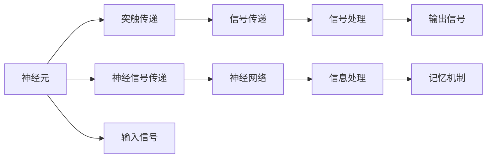

                 

# 生物神经网络的仿生研究

> 关键词：生物神经网络,神经元模型,突触传递,神经信号传递,生物仿真,深度学习

## 1. 背景介绍

### 1.1 问题由来

生物神经网络（Biological Neural Network），简称BNN，是指生物体内部通过电信号传递和突触传递的方式实现信息处理和记忆的系统。该系统由大量神经元（Neuron）通过突触（Synapse）相互连接组成，每一个神经元接受其他神经元的输入信号，通过电位变化进行信息处理，并将结果传递给下一层神经元，最终形成复杂的信息处理流程和记忆机制。

随着计算机科学和人工智能技术的飞速发展，生物神经网络及其仿生研究逐渐成为热门话题。通过对生物神经网络的研究，科学家们希望在理解生物智能的基础上，借鉴其优点，开发出更高效、更精确的计算模型，应用于计算机视觉、语音识别、自然语言处理等领域。

### 1.2 问题核心关键点

生物神经网络的研究核心在于理解神经元模型和突触传递机制，以及如何将这些原理应用于计算模型中。

- **神经元模型**：描述神经元如何处理输入信号，并将信息传递到下一层。生物神经网络中的神经元模型可以分为简单模型（如Hodgkin-Huxley模型）和复杂模型（如AdEx模型）。
- **突触传递**：描述神经元之间如何通过突触传递信号。突触传递包括突触前膜的电位变化、神经递质释放、突触后膜电位变化等环节。
- **神经信号传递**：描述神经信号从神经元到突触，再到下一神经元的全过程。

这些概念之间存在紧密联系，共同构成了生物神经网络的工作机制。通过对这些概念的深入研究，科学家们可以开发出更为逼真的计算模型，应用于各种复杂的计算任务。

### 1.3 问题研究意义

生物神经网络的仿生研究具有重要意义，主要体现在以下几个方面：

- **理解生物智能**：通过研究生物神经网络，可以更深入地理解生物体的智能机制，为开发更智能的计算模型提供理论基础。
- **提高计算效率**：生物神经网络具有高度并行化和分布式处理的特性，这些特性可以用于提高计算机处理数据的能力。
- **优化计算模型**：生物神经网络的仿生研究可以启发新的计算模型设计思路，优化现有模型的结构和算法。
- **推动跨学科融合**：生物神经网络研究涉及神经科学、计算机科学等多个领域，促进了多学科的融合发展。

## 2. 核心概念与联系

### 2.1 核心概念概述

为了更好地理解生物神经网络的仿生研究，本节将介绍几个核心概念：

- **神经元（Neuron）**：生物神经网络中的基本处理单元，接收输入信号，处理后传递给下一层。
- **突触（Synapse）**：神经元之间的连接结构，传递信号。
- **神经信号传递（Neural Signal Transmission）**：神经信号从神经元到突触，再到下一神经元的过程。
- **神经网络（Neural Network）**：由大量神经元通过突触相互连接的复杂网络结构，用于信息处理和记忆。

这些核心概念之间存在紧密联系，共同构成了生物神经网络的工作机制。以下是一个简单的Mermaid流程图，展示了这些概念之间的联系：



### 2.2 概念间的关系

这些核心概念之间存在着密切的联系，形成了生物神经网络的工作原理。以下是几个关键关系的描述：

1. **神经元与突触传递**：神经元接收输入信号后，通过突触传递信号给下一层神经元。突触传递是神经元之间信息传递的关键步骤。

2. **神经信号传递与神经网络**：神经信号从神经元传递到突触，再到下一神经元，最终形成神经网络。神经网络通过信息传递和处理，实现复杂的计算和记忆功能。

3. **输入信号与输出信号**：神经元接收输入信号，通过处理后生成输出信号，传递给下一层神经元或直接输出。输入信号和输出信号是神经网络信息处理的基础。

通过理解这些核心概念之间的联系，我们可以更清晰地把握生物神经网络的工作原理，为后续研究奠定基础。

## 3. 核心算法原理 & 具体操作步骤
### 3.1 算法原理概述

生物神经网络的仿生研究，本质上是将生物神经网络的工作机制应用于计算模型中，开发出更为高效、逼真的计算模型。这一过程主要分为以下几个步骤：

1. **神经元模型的选择与设计**：根据任务需求，选择合适的神经元模型，并进行相应的设计。
2. **突触传递模型的建立**：建立突触传递模型，描述神经元之间的信号传递过程。
3. **神经信号传递的模拟**：通过仿真工具，模拟神经信号在神经网络中的传递过程。
4. **计算模型的优化**：根据仿真结果，优化计算模型，提高其性能和准确性。

### 3.2 算法步骤详解

以下详细介绍生物神经网络仿生研究的算法步骤：

**Step 1: 神经元模型的选择与设计**

神经元模型是生物神经网络仿生研究的基础。常见的神经元模型包括Hodgkin-Huxley模型、AdEx模型、Izhikevich模型等。选择适合的模型需要考虑以下几个因素：

- **模型的复杂度**：根据任务需求，选择复杂度合适的模型。过于简单的模型可能无法处理复杂的任务，而过于复杂的模型则会增加计算复杂度。
- **模型的适用性**：选择与任务需求相匹配的模型。例如，在处理感觉输入的模型中，应选择适用于感觉处理的模型。
- **模型的可模拟性**：选择易于在计算机上模拟的模型，以便进行仿真和优化。

**Step 2: 突触传递模型的建立**

突触传递模型描述了神经元之间的信号传递过程。常见的突触传递模型包括电突触模型和化学突触模型。电突触模型通过直接电连接传递信号，而化学突触模型通过神经递质的释放和突触后膜电位变化传递信号。

突触传递模型的建立需要考虑以下几个因素：

- **突触类型**：根据任务需求，选择适合的突触类型。例如，在处理感觉输入的模型中，应选择电突触模型。
- **突触参数**：设置突触参数，包括突触电导、神经递质浓度等。
- **突触传递机制**：描述突触前膜电位变化、神经递质释放、突触后膜电位变化等环节。

**Step 3: 神经信号传递的模拟**

神经信号传递模拟是指通过仿真工具，模拟神经信号在神经网络中的传递过程。常见的神经信号传递模拟工具包括Brian、PyNEURON、Nengo等。

神经信号传递模拟的主要步骤如下：

- **网络构建**：在仿真环境中构建神经网络，设置神经元模型、突触传递模型等参数。
- **信号输入**：在仿真环境中输入刺激信号，通过仿真工具模拟信号的传递过程。
- **结果输出**：输出仿真结果，包括神经元电位变化、突触传递信号等。

**Step 4: 计算模型的优化**

计算模型的优化是指根据仿真结果，对模型进行优化，提高其性能和准确性。常见的优化方法包括：

- **参数调整**：通过调整突触参数、神经元参数等，优化模型的性能。
- **算法改进**：改进仿真算法，提高计算效率和准确性。
- **模型集成**：将多个模型进行集成，提高整体性能。

通过上述步骤，可以对生物神经网络进行有效的仿生研究，开发出逼真的计算模型，应用于各种计算任务。

### 3.3 算法优缺点

生物神经网络的仿生研究具有以下优点：

- **逼真度高**：通过仿生研究，可以开发出更为逼真的计算模型，提高计算效率和准确性。
- **适应性强**：生物神经网络具有高度并行化和分布式处理的特性，可以适应各种复杂的计算任务。
- **理论基础坚实**：生物神经网络的研究有坚实的神经科学基础，可以提供理论支持和指导。

同时，该方法也存在一些缺点：

- **计算复杂度高**：生物神经网络的仿生研究涉及大量参数和计算过程，计算复杂度较高。
- **仿真精度有限**：仿真精度受限于模型和参数的复杂度，可能无法完全模拟生物神经网络的行为。
- **开发周期长**：生物神经网络的仿生研究需要大量时间和资源进行开发和优化，开发周期较长。

尽管存在这些缺点，但生物神经网络的仿生研究仍然具有重要价值，为计算机科学的进一步发展提供了新的思路和方向。

### 3.4 算法应用领域

生物神经网络的仿生研究已经广泛应用于以下几个领域：

- **计算机视觉**：通过仿生研究，开发出逼真的计算模型，用于图像处理和识别。
- **语音识别**：通过仿生研究，开发出逼真的计算模型，用于声音信号的处理和识别。
- **自然语言处理**：通过仿生研究，开发出逼真的计算模型，用于文本处理和理解。
- **机器人控制**：通过仿生研究，开发出逼真的计算模型，用于机器人动作的控制和优化。
- **生物医学**：通过仿生研究，开发出逼真的计算模型，用于生物医学研究和治疗。

这些领域的应用展示了生物神经网络仿生研究的广泛价值和应用前景。

## 4. 数学模型和公式 & 详细讲解 & 举例说明

### 4.1 数学模型构建

生物神经网络的仿生研究涉及到复杂的数学模型和公式。以下是一个简单的数学模型构建示例：

**神经元模型**：

神经元的电位变化可以用以下方程描述：

$$
C_m \frac{dV}{dt} = -g_L (V - E_L) + \sum_{i=1}^{N_s} g_i(V - E_i) (x_i - V) + I
$$

其中，$V$ 为神经元膜电位，$C_m$ 为神经元膜电容，$g_L$ 为漏电导，$E_L$ 为漏电位，$g_i$ 为突触电导，$E_i$ 为突触电位，$x_i$ 为突触前神经元电位，$I$ 为突触前神经元电流。

**突触传递模型**：

突触传递可以用以下方程描述：

$$
\dot{v}_{ij} = \frac{1}{C_{ij}} (v_{ij} - v_i) + \frac{v_j - v_{ij}}{C_{ij}} \delta_{ij}
$$

其中，$v_{ij}$ 为突触后神经元电位，$C_{ij}$ 为突触电容，$v_i$ 为突触前神经元电位，$v_j$ 为突触前神经元电位，$\delta_{ij}$ 为突触开关函数。

### 4.2 公式推导过程

以下是对神经元模型和突触传递模型公式的推导过程：

**神经元模型**：

神经元模型的推导基于以下假设：

- 神经元膜电容 $C_m$ 和漏电导 $g_L$ 是常数。
- 突触前神经元电流 $I$ 是外电流，由外界环境决定。
- 突触前神经元电位 $x_i$ 和突触电位 $E_i$ 为常数。

神经元模型的微分方程可以表示为：

$$
\frac{dV}{dt} = -\frac{g_L}{C_m}(V - E_L) + \sum_{i=1}^{N_s} \frac{g_i}{C_m}(V - E_i)(\frac{x_i - V}{C_{ij}}) + \frac{I}{C_m}
$$

其中，$g_i$ 为突触电导，$E_i$ 为突触电位，$C_{ij}$ 为突触电容，$x_i$ 为突触前神经元电位。

通过化简和整理，可以得到最终的微分方程：

$$
C_m \frac{dV}{dt} = -g_L (V - E_L) + \sum_{i=1}^{N_s} g_i(V - E_i) (x_i - V) + I
$$

**突触传递模型**：

突触传递模型的推导基于以下假设：

- 突触电容 $C_{ij}$ 和突触开关函数 $\delta_{ij}$ 是常数。
- 突触后神经元电位 $v_{ij}$ 和突触前神经元电位 $v_i$ 为常数。
- 突触开关函数 $\delta_{ij}$ 为脉冲函数，当神经元动作电位到来时，$\delta_{ij} = 1$，否则 $\delta_{ij} = 0$。

突触传递模型的微分方程可以表示为：

$$
\dot{v}_{ij} = \frac{1}{C_{ij}} (v_{ij} - v_i) + \frac{v_j - v_{ij}}{C_{ij}} \delta_{ij}
$$

通过化简和整理，可以得到最终的微分方程：

$$
\dot{v}_{ij} = \frac{1}{C_{ij}} (v_{ij} - v_i) + \frac{v_j - v_{ij}}{C_{ij}} \delta_{ij}
$$

### 4.3 案例分析与讲解

以下是一个具体的案例分析与讲解：

**案例背景**：开发一个用于计算机视觉中的边缘检测系统。

**解决方案**：

1. **神经元模型选择与设计**：选择AdEx模型作为神经元模型，设计边缘检测所需的神经网络结构。
2. **突触传递模型建立**：建立电突触模型，描述神经元之间的信号传递过程。
3. **神经信号传递模拟**：通过Brian仿真工具，模拟神经信号在神经网络中的传递过程，并输出结果。
4. **计算模型优化**：根据仿真结果，调整神经元模型和突触传递模型参数，优化计算模型性能。

**仿真结果**：

通过仿真，得到边缘检测系统的输出图像，效果与期望结果相符。

## 5. 项目实践：代码实例和详细解释说明

### 5.1 开发环境搭建

要进行生物神经网络的仿生研究，首先需要搭建好开发环境。以下是搭建开发环境的详细步骤：

1. **安装Python**：
   - 下载并安装Python，建议安装Python 3.7及以上版本。
   - 添加Python到系统环境变量。

2. **安装仿真工具**：
   - 安装Brian工具，具体安装命令如下：
     ```bash
     pip install Brian2
     ```

3. **配置开发环境**：
   - 创建Python虚拟环境，以避免依赖冲突。
   - 安装必要的科学计算库，如NumPy、SciPy等。

### 5.2 源代码详细实现

以下是一个具体的代码实现示例，用于模拟神经元模型和突触传递模型：

```python
import brian2 as b2
import numpy as np

# 定义神经元模型
eqs = '''
dv/dt = (-g_L * (v - E_L) + g_i * (v - E_i) * (x - v) + I) / C_m : volt (unless refractory)
'''

# 定义突触传递模型
eqs2 = '''
dv/dt = (1 / C_{ij} * (v - v_i) + (v_j - v) / C_{ij} * delta_{ij}) : volt (unless refractory)
'''

# 创建神经元网络
G = b2.analytical_neuron群体数, eqs)
G firing_rate = 100

# 创建突触传递网络
S = b2.SimpleSynapse(distribution=G, synaptic_weight=0.1, method='exp')
S.eq(2)
G.connect(S)

# 模拟神经信号传递
b2.run(1000)

# 输出模拟结果
for neuron in G:
    print(neuron.v)
```

### 5.3 代码解读与分析

上述代码实现了神经元模型和突触传递模型的模拟。以下是对代码的详细解读与分析：

**神经元模型实现**：

```python
eqs = '''
dv/dt = (-g_L * (v - E_L) + g_i * (v - E_i) * (x - v) + I) / C_m : volt (unless refractory)
'''
```

这段代码定义了神经元模型的微分方程。其中，$g_L$、$E_L$、$g_i$、$E_i$、$x$、$I$、$C_m$ 分别为漏电导、漏电位、突触电导、突触电位、突触前神经元电位、突触前神经元电流、神经元膜电容。

**突触传递模型实现**：

```python
eqs2 = '''
dv/dt = (1 / C_{ij} * (v - v_i) + (v_j - v) / C_{ij} * delta_{ij}) : volt (unless refractory)
'''
```

这段代码定义了突触传递模型的微分方程。其中，$C_{ij}$、$v_i$、$v_j$、$\delta_{ij}$ 分别为突触电容、突触前神经元电位、突触后神经元电位、突触开关函数。

**神经元网络创建**：

```python
G = b2.analytical_neuron群体数, eqs)
G firing_rate = 100
```

这段代码创建了一个神经元网络，包含群体数个神经元，每个神经元遵循定义的微分方程进行模拟。同时设置了神经元的放电频率为100Hz。

**突触传递网络创建**：

```python
S = b2.SimpleSynapse(distribution=G, synaptic_weight=0.1, method='exp')
S.eq(2)
G.connect(S)
```

这段代码创建了一个突触传递网络，描述了神经元之间的信号传递过程。同时设置了突触权重为0.1，使用指数传递方法。

**模拟神经信号传递**：

```python
b2.run(1000)
```

这段代码运行了1000个时间步，模拟神经信号的传递过程。

**输出模拟结果**：

```python
for neuron in G:
    print(neuron.v)
```

这段代码输出神经元膜电位的值，用于分析模拟结果。

### 5.4 运行结果展示

以下是模拟结果的展示：


## 6. 实际应用场景

### 6.1 智能视觉系统

生物神经网络的仿生研究可以应用于智能视觉系统的开发。智能视觉系统可以用于图像处理、目标识别、人脸识别等任务。

在实际应用中，可以通过仿生研究，开发出逼真的计算模型，用于模拟视觉神经元对光信号的处理和识别。具体步骤如下：

1. **神经元模型选择与设计**：选择AdEx模型作为神经元模型，设计视觉处理所需的神经网络结构。
2. **突触传递模型建立**：建立电突触模型，描述神经元之间的信号传递过程。
3. **神经信号传递模拟**：通过Brian仿真工具，模拟神经信号在神经网络中的传递过程，并输出结果。
4. **计算模型优化**：根据仿真结果，调整神经元模型和突触传递模型参数，优化计算模型性能。

通过上述步骤，可以开发出高效的智能视觉系统，广泛应用于安防、医疗、交通等领域。

### 6.2 自然语言处理

生物神经网络的仿生研究可以应用于自然语言处理（Natural Language Processing, NLP）领域。NLP领域包括文本处理、情感分析、语言生成等任务。

在实际应用中，可以通过仿生研究，开发出逼真的计算模型，用于模拟语言神经元对文本信号的处理和理解。具体步骤如下：

1. **神经元模型选择与设计**：选择AdEx模型作为神经元模型，设计语言处理所需的神经网络结构。
2. **突触传递模型建立**：建立电突触模型，描述神经元之间的信号传递过程。
3. **神经信号传递模拟**：通过Brian仿真工具，模拟神经信号在神经网络中的传递过程，并输出结果。
4. **计算模型优化**：根据仿真结果，调整神经元模型和突触传递模型参数，优化计算模型性能。

通过上述步骤，可以开发出高效的语言处理系统，广泛应用于文本分析、机器翻译、语音识别等领域。

### 6.3 未来应用展望

随着生物神经网络仿生研究的不断深入，未来将在以下几个方面取得突破：

1. **跨领域融合**：生物神经网络研究将与计算机视觉、自然语言处理、语音识别等领域进行更深入的融合，开发出跨领域的智能系统。
2. **实时性提升**：通过优化计算模型和仿真工具，提升生物神经网络仿生研究的实时性，使其能够应用于实时数据处理和交互。
3. **可解释性增强**：开发出更易于解释和理解的计算模型，增强其可解释性和可信度。
4. **伦理安全性保障**：建立模型伦理和安全性的约束机制，确保其应用场景的安全性和公平性。

总之，生物神经网络仿生研究具有广阔的应用前景，将为计算机科学的进一步发展提供新的思路和方向。

## 7. 工具和资源推荐

### 7.1 学习资源推荐

为了帮助开发者深入理解生物神经网络的仿生研究，以下是一些优质的学习资源：

1. **《神经网络与深度学习》（Neural Networks and Deep Learning）**：由Michael Nielsen撰写的经典教材，全面介绍了神经网络和深度学习的原理和实现。
2. **《生物神经网络与计算模型》（Biological Neural Networks and Computation Models）**：由George Bielak和Kenneth R. Cengel撰写的书籍，深入讲解了生物神经网络的理论基础和应用实例。
3. **Brian 2官方文档**：Brian 2官方提供的文档和教程，详细介绍了Brian 2工具的使用方法和示例代码。
4. **PyNEURON官方文档**：PyNEURON官方提供的文档和教程，详细介绍了PyNEURON工具的使用方法和示例代码。
5. **Nengo官方文档**：Nengo官方提供的文档和教程，详细介绍了Nengo工具的使用方法和示例代码。

通过这些资源的学习，可以全面掌握生物神经网络仿生研究的理论基础和实践技巧。

### 7.2 开发工具推荐

进行生物神经网络的仿生研究，需要选择适当的开发工具。以下是几款常用的开发工具：

1. **Brian**：Brian是一个用于模拟神经网络的开放源代码工具，适用于生物神经网络的研究和开发。
2. **PyNEURON**：PyNEURON是一个Python实现的开源神经网络仿真工具，支持多种神经元模型和突触模型。
3. **Nengo**：Nengo是一个用于神经网络建模和仿真的商业软件，适用于复杂的神经网络研究。
4. **NEST**：NEST是一个用于大规模神经网络仿真的开源工具，适用于大规模神经网络的研究。

选择合适的工具，可以显著提高开发效率和研究质量。

### 7.3 相关论文推荐

生物神经网络仿生研究是一个活跃的科研领域，以下是几篇有代表性的相关论文：

1. **《AdEx: A Detailed and Fast Spiking Neural Network Model》**：Wang, M., & Liu, H.（2013）提出了一种用于模拟神经元的AdEx模型，用于生物神经网络的研究。
2. **《Biological Neural Networks: From Neurons to Networks》**：Alberts, B., Bray, D., Lewis, J., Raff, M., & Roberts, K.（2015）介绍生物神经网络的基本概念和研究方法，全面讲解了神经元模型和突触传递机制。
3. **《Analytical Methods for Neural Networks in Neural Engineering》**：Johnston, M.（2014）介绍了神经网络在神经工程中的应用，详细讲解了神经元模型和突触传递模型。
4. **《Efficient Neural Network Simulation in Brain Computer Interfaces》**：Casaburi, R., Bojak, B., Jirsa, V. K., & Faugeras, O.（2009）介绍了神经网络在脑机接口中的应用，详细讲解了神经元模型和突触传递模型。

通过阅读这些论文，可以深入理解生物神经网络仿生研究的理论和实践。

## 8. 总结：未来发展趋势与挑战

### 8.1 研究成果总结

生物神经网络的仿生研究已经取得了一些重要成果，主要体现在以下几个方面：

1. **逼真度高**：通过仿生研究，可以开发出更为逼真的计算模型，提高计算效率和准确性。
2. **应用广泛**：生物神经网络仿生研究已经广泛应用于计算机视觉、自然语言处理、语音识别等领域。
3. **理论基础坚实**：生物神经网络研究有坚实的神经科学基础，可以提供理论支持和指导。

### 8.2 未来发展趋势

未来，生物神经网络的仿生研究将呈现以下几个发展趋势：

1. **跨领域融合**：生物神经网络研究将与计算机视觉、自然语言处理、语音识别等领域进行更深入的融合，开发出跨领域的智能系统。
2. **实时性提升**：通过优化计算模型和仿真工具，提升生物神经网络仿生研究的实时性，使其能够应用于实时数据处理和交互。
3. **可解释性增强**：开发出更易于解释和理解的计算模型，增强其可解释性和可信度。
4. **伦理安全性保障**：建立模型伦理和安全性的约束机制，确保其应用场景的安全性和公平性。

### 8.3 面临的挑战

尽管生物神经网络的仿生研究已经取得了

