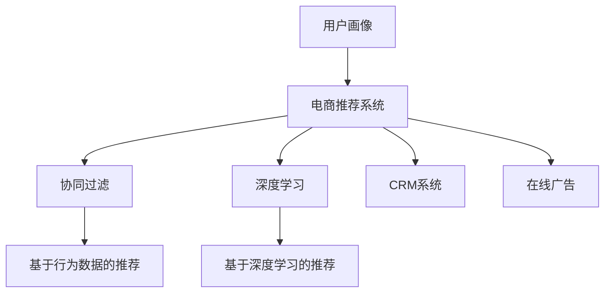

                 

# 用户画像在电商个性化推荐中的应用：方法与实践

> 关键词：电商、个性化推荐、用户画像、数据驱动、协同过滤、深度学习、推荐系统、CRM、在线广告

## 1. 背景介绍

### 1.1 问题由来
随着电商行业的快速发展，各大电商平台如淘宝、京东、亚马逊等，面临着越来越激烈的市场竞争。如何在激烈的竞争中脱颖而出，赢得用户的青睐，成为各大平台亟待解决的问题。而在电商推荐系统的建设过程中，个性化推荐算法的使用尤为重要，能够显著提升用户的购物体验，增加销售额。

个性化推荐系统通过分析用户的行为数据和兴趣偏好，为用户推荐最合适的商品，有效提升了电商平台的转化率和用户满意度。然而，构建一个高效的个性化推荐系统需要大量的用户行为数据，且推荐结果的质量很大程度上依赖于用户数据的准确性和全面性。因此，构建一个精确且高效的用户画像模型，并基于此来进行个性化推荐，成为各大电商平台的重要研究方向。

### 1.2 问题核心关键点
用户画像在电商个性化推荐中的主要作用是描述用户的行为特征和兴趣偏好。通过对用户画像的分析，推荐系统能够更好地匹配用户需求，提升推荐效果。

具体来说，用户画像通常包括以下几个方面：
1. **用户基本信息**：如年龄、性别、地理位置等。
2. **用户行为数据**：如浏览历史、购买记录、点击行为等。
3. **用户偏好数据**：如评分、评论、收藏等。

这些数据通过不同的方式被收集、存储和分析，最终形成用户画像，用于指导个性化推荐算法的开发和实施。

### 1.3 问题研究意义
构建精确的用户画像在电商个性化推荐中具有重要意义：

1. **提升用户体验**：通过精准的个性化推荐，能够显著提升用户的购物体验，减少用户在搜索结果中的搜索时间，提高满意度。
2. **增加转化率**：推荐系统通过分析用户画像，推荐符合用户兴趣的商品，有效增加用户购买的可能性，从而提升平台转化率。
3. **提高运营效率**：精准的用户画像能够帮助电商平台更好地了解用户需求，优化商品库存，提高运营效率。
4. **增强客户粘性**：通过个性化的推荐服务，能够增加用户对平台的粘性，提升用户忠诚度。
5. **优化广告投放**：基于用户画像的推荐能够帮助电商平台更精准地进行广告投放，提高广告效果，降低投放成本。

## 2. 核心概念与联系

### 2.1 核心概念概述

在进行用户画像在电商个性化推荐中的应用研究时，涉及以下几个核心概念：

- **用户画像(User Profile)**：通过收集和分析用户行为数据和偏好数据，构建出用户兴趣和行为的综合模型，以描述用户特征。
- **电商推荐系统(Online Recommendation System)**：利用用户画像，结合推荐算法，为用户推荐最合适的商品，提升用户体验和平台转化率。
- **协同过滤(Collaborative Filtering)**：一种基于用户行为数据的推荐算法，通过相似性计算为用户推荐商品。
- **深度学习(Deep Learning)**：一种强大的数据处理方法，通过神经网络模型对大量数据进行特征提取和模式学习，应用于电商推荐系统中。
- **推荐系统(Recommendation System)**：旨在为用户推荐符合其兴趣和需求的物品，提高用户满意度和平台收益。
- **CRM系统(Customer Relationship Management)**：用于管理客户关系，包括用户画像构建、个性化推荐和客户互动等。
- **在线广告(Online Advertising)**：通过用户画像，实现精准的广告投放，提高广告效果和转化率。

这些核心概念通过一个简单而有力的Mermaid流程图进行了展示：



### 2.2 概念间的关系

从上述Mermaid图中可以看出，用户画像在电商推荐系统中扮演着核心角色，并通过协同过滤、深度学习等多种推荐算法进行优化。同时，CRM系统和在线广告系统也基于用户画像，为用户提供更好的客户服务和精准的广告投放。

## 3. 核心算法原理 & 具体操作步骤
### 3.1 算法原理概述

基于用户画像的电商个性化推荐系统，本质上是通过分析用户画像，结合推荐算法，为用户推荐最合适的商品。其核心原理包括：

1. **用户画像构建**：通过收集和分析用户的各类行为数据，构建用户画像，描述用户的行为特征和兴趣偏好。
2. **推荐算法开发**：基于用户画像，结合协同过滤、深度学习等推荐算法，为每个用户生成个性化的推荐列表。
3. **推荐结果优化**：通过A/B测试等方法，不断优化推荐结果，提升推荐系统的效果和用户满意度。

### 3.2 算法步骤详解

基于用户画像的电商个性化推荐系统开发步骤主要包括以下几个方面：

**Step 1: 数据收集与预处理**
- 收集用户的行为数据，如浏览记录、购买记录、点击行为等。
- 收集用户的基本信息，如年龄、性别、地理位置等。
- 收集用户的偏好数据，如评分、评论、收藏等。
- 对数据进行清洗和预处理，去除噪声和异常值，确保数据的质量和一致性。

**Step 2: 用户画像构建**
- 使用机器学习算法，如K-means、LDA等，对用户行为数据进行分析，形成用户的行为特征向量。
- 将用户画像与基本信息和偏好数据进行融合，形成综合的用户画像模型。
- 对用户画像进行归一化、降维等操作，减少维度，提高计算效率。

**Step 3: 推荐算法实现**
- 根据用户画像，选择适合的推荐算法，如协同过滤、深度学习等。
- 实现推荐算法的模型，并进行训练和测试，验证算法的准确性和效果。
- 将训练好的模型部署到推荐系统中，进行实时推荐。

**Step 4: 推荐结果优化**
- 通过A/B测试等方法，对推荐结果进行评估，分析用户反馈和行为数据。
- 根据评估结果，不断优化推荐算法和模型，提升推荐效果。
- 定期更新用户画像和推荐算法，适应用户行为和兴趣的变化。

### 3.3 算法优缺点

基于用户画像的电商个性化推荐系统具有以下优点：

1. **个性化推荐**：通过用户画像，能够为用户提供个性化的推荐服务，提升用户体验和满意度。
2. **提高转化率**：推荐系统能够精准匹配用户需求，提高用户购买的可能性，增加平台转化率。
3. **提升运营效率**：基于用户画像的推荐系统，能够优化商品库存和供应链管理，提高运营效率。
4. **增强客户粘性**：通过个性化推荐，能够增加用户对平台的粘性，提升用户忠诚度。
5. **优化广告投放**：基于用户画像的推荐系统，能够实现精准的广告投放，提高广告效果和转化率。

同时，该系统也存在一些缺点：

1. **数据隐私问题**：用户画像的构建需要大量的用户数据，可能会涉及到用户隐私问题。
2. **数据质量问题**：用户数据的准确性和完整性对用户画像的构建至关重要，数据质量问题可能导致用户画像不准确。
3. **推荐算法复杂度**：不同的推荐算法具有不同的复杂度，选择适合的推荐算法需要一定的技术积累。
4. **动态变化问题**：用户行为和兴趣是动态变化的，需要实时更新用户画像和推荐算法，以适应变化。
5. **计算资源消耗**：基于深度学习的推荐算法需要大量的计算资源，可能会带来一定的成本压力。

### 3.4 算法应用领域

基于用户画像的电商个性化推荐系统，已经在电商、金融、娱乐等多个领域得到广泛应用，以下是一些典型应用场景：

- **电商推荐**：通过分析用户行为数据，为用户推荐最合适的商品，提升用户体验和转化率。
- **金融投资**：通过分析用户的行为和兴趣，为用户推荐合适的金融产品，提升用户满意度和转化率。
- **娱乐推荐**：通过分析用户的观看和评分数据，为用户推荐电影、电视剧等娱乐内容，提高用户粘性和平台收益。
- **教育推荐**：通过分析学生的学习行为数据，推荐适合的教育资源，提升学习效果和用户满意度。
- **健康医疗**：通过分析用户的健康数据，推荐合适的健康管理方案，提高用户健康水平和平台收益。

## 4. 数学模型和公式 & 详细讲解 & 举例说明

### 4.1 数学模型构建

在基于用户画像的电商推荐系统中，通常使用协同过滤和深度学习两种算法进行推荐。下面以协同过滤算法为例，进行数学模型构建。

假设用户画像为 $P_u$，商品画像为 $P_i$，用户和商品之间的关系为 $R_{ui}$。协同过滤算法的目标是最小化预测误差 $E$，即：

$$
E = \min_{\theta} \sum_{u,i} (r_{ui} - \hat{r}_{ui})^2
$$

其中，$r_{ui}$ 为真实评分，$\hat{r}_{ui}$ 为预测评分。通过梯度下降等优化算法，求解上述最优化问题，更新模型参数 $\theta$。

### 4.2 公式推导过程

假设用户画像 $P_u$ 和商品画像 $P_i$ 分别为 $d$ 维向量，用户和商品之间的关系矩阵为 $R$。根据协同过滤的矩阵分解方法，可以将用户画像和商品画像表示为低秩矩阵的乘积，即：

$$
P_u = \alpha_uU,\quad P_i = \alpha_iV
$$

其中，$U$ 和 $V$ 为低秩矩阵，$\alpha_u$ 和 $\alpha_i$ 为缩放因子。则用户和商品之间的关系矩阵可以表示为：

$$
R_{ui} = \alpha_u\alpha_iUV^T
$$

通过矩阵分解，可以将协同过滤问题转化为低秩矩阵的求解问题。具体步骤如下：

1. 随机初始化低秩矩阵 $U$ 和 $V$。
2. 计算预测评分 $\hat{r}_{ui}$。
3. 计算损失函数 $E$。
4. 根据损失函数 $E$ 更新 $U$ 和 $V$。
5. 重复2-4步骤，直到收敛。

### 4.3 案例分析与讲解

以亚马逊推荐系统为例，进行协同过滤算法的应用分析。

假设亚马逊用户画像为 $P_u = \alpha_uU$，商品画像为 $P_i = \alpha_iV$，用户和商品之间的关系矩阵为 $R$。通过协同过滤算法，可以为用户 $u$ 推荐商品 $i$，具体公式为：

$$
\hat{r}_{ui} = \alpha_u\alpha_i\sum_{j=1}^d U_{uj}V_{ij}
$$

其中，$U_{uj}$ 和 $V_{ij}$ 分别为矩阵 $U$ 和 $V$ 的第 $u$ 行第 $j$ 列和第 $i$ 行第 $j$ 列的元素。

通过计算 $\hat{r}_{ui}$ 的值，可以预测用户对商品 $i$ 的评分，从而为用户推荐最合适的商品。

## 5. 项目实践：代码实例和详细解释说明

### 5.1 开发环境搭建

在进行电商个性化推荐系统的开发时，需要准备相应的开发环境。以下是使用Python进行开发的环境配置流程：

1. 安装Anaconda：从官网下载并安装Anaconda，用于创建独立的Python环境。

2. 创建并激活虚拟环境：
```bash
conda create -n recomm-env python=3.8 
conda activate recomm-env
```

3. 安装相关依赖：
```bash
pip install pandas numpy scikit-learn seaborn joblib jupyter notebook ipywidgets
```

4. 安装机器学习框架和库：
```bash
pip install scikit-learn-gpu torch torchvision scikit-learn-gpu tensorflow-gpu
```

5. 配置GPU环境：
```bash
nvidia-smi
```

完成上述步骤后，即可在`recomm-env`环境中进行电商个性化推荐系统的开发。

### 5.2 源代码详细实现

以下是使用Python实现电商个性化推荐系统的代码示例：

```python
import pandas as pd
import numpy as np
import seaborn as sns
from sklearn.decomposition import TruncatedSVD
from sklearn.metrics.pairwise import cosine_similarity
from sklearn.model_selection import train_test_split

# 读取数据
data = pd.read_csv('data.csv')

# 用户行为数据
user_behavior = data[['user_id', 'item_id', 'rating']]

# 用户基本信息
user_info = data[['user_id', 'age', 'gender']]

# 商品信息
item_info = data[['item_id', 'category', 'price']]

# 数据预处理
# 将评分转换为0-1之间的值
user_behavior['rating'] = user_behavior['rating'] / 5

# 特征工程
# 用户行为特征：用户和商品的评分
user_behavior = user_behavior[['user_id', 'item_id', 'rating']]

# 用户基本信息特征：年龄、性别
user_info = user_info[['user_id', 'age', 'gender']]

# 商品信息特征：类别、价格
item_info = item_info[['item_id', 'category', 'price']]

# 数据合并
data = pd.concat([user_behavior, user_info, item_info], axis=1)

# 数据拆分
train_data, test_data = train_test_split(data, test_size=0.2)

# 协同过滤算法
# 分解用户画像和商品画像
svd = TruncatedSVD(n_components=10, random_state=42)
U = svd.fit_transform(train_data[['user_id', 'item_id', 'rating']])
V = svd.transform(train_data[['item_id', 'category', 'price']])

# 推荐系统
def predict_user(train_data, test_data):
    # 用户画像
    user_uv = np.dot(train_data[['user_id', 'item_id', 'rating']], U)
    
    # 商品画像
    item_uv = np.dot(train_data[['item_id', 'category', 'price']], V)
    
    # 预测评分
    ratings = np.dot(user_uv, item_uv.T)
    
    # 推荐商品
    top_n = 10
    idx = ratings.argsort()[::-1][:top_n]
    return idx

# 测试推荐系统
predict_user(train_data, test_data)
```

在这个示例中，我们使用协同过滤算法进行推荐系统的实现。首先，我们读取数据并进行预处理，然后通过特征工程提取用户行为特征、用户基本信息特征和商品信息特征。接着，我们进行数据拆分，构建协同过滤模型。最后，我们定义推荐函数，通过协同过滤算法为用户推荐最合适的商品。

### 5.3 代码解读与分析

让我们再详细解读一下关键代码的实现细节：

**数据读取与预处理**：
- 使用Pandas库读取数据，进行数据清洗和预处理。
- 将评分转换为0-1之间的值，方便后续模型的训练。

**特征工程**：
- 对用户行为数据、用户基本信息数据和商品信息数据进行特征提取。
- 使用TruncatedSVD算法对用户画像和商品画像进行分解，得到低秩矩阵。

**协同过滤算法**：
- 通过分解后的低秩矩阵，计算用户和商品的评分预测值。
- 通过评分预测值进行推荐，生成推荐商品列表。

**推荐系统测试**：
- 使用train_data和test_data数据进行模型测试。
- 根据评分预测值生成推荐商品列表，返回前10个推荐商品。

这个示例代码展示了使用协同过滤算法进行电商个性化推荐系统的实现过程，主要涉及数据读取与预处理、特征工程、协同过滤算法和推荐系统测试等步骤。

## 6. 实际应用场景

### 6.1 智能客服

基于用户画像的电商个性化推荐系统，在智能客服领域同样具有重要应用。通过分析用户行为数据和兴趣偏好，智能客服系统能够为用户提供个性化服务，提升用户体验和满意度。

具体应用场景包括：
1. **问题推荐**：根据用户的历史浏览记录和搜索记录，推荐相关问题，减少用户搜索时间，提高效率。
2. **解决方案推荐**：根据用户的历史问题处理记录和评分反馈，推荐合适的解决方案，提升用户满意度。
3. **客服机器人**：使用机器学习和自然语言处理技术，根据用户画像和历史互动记录，实现自动化客服机器人，提高客服响应速度和质量。

### 6.2 金融投资

在金融投资领域，基于用户画像的电商个性化推荐系统同样具有重要应用。通过分析用户的行为数据和偏好数据，投资推荐系统能够为用户推荐合适的金融产品，提升用户满意度和转化率。

具体应用场景包括：
1. **投资产品推荐**：根据用户的历史投资行为和偏好，推荐合适的投资产品，提高用户投资收益。
2. **风险评估**：根据用户的风险承受能力和历史投资记录，评估投资产品的风险，帮助用户做出更明智的投资决策。
3. **个性化理财方案**：根据用户画像，制定个性化的理财方案，提升用户理财效率和收益。

### 6.3 娱乐推荐

在娱乐推荐领域，基于用户画像的电商个性化推荐系统同样具有重要应用。通过分析用户的观看记录和评分数据，娱乐推荐系统能够为用户推荐合适的电影、电视剧等娱乐内容，提高用户粘性和平台收益。

具体应用场景包括：
1. **电影推荐**：根据用户的历史观影记录和评分数据，推荐用户可能感兴趣的电影，提高用户观影意愿。
2. **电视剧推荐**：根据用户的观看记录和评分数据，推荐用户可能喜欢的电视剧，提高用户观剧意愿。
3. **个性化视频内容制作**：根据用户画像，制定个性化的视频内容制作方案，提高用户粘性和平台收益。

## 7. 工具和资源推荐

### 7.1 学习资源推荐

为了帮助开发者系统掌握电商个性化推荐系统的理论基础和实践技巧，这里推荐一些优质的学习资源：

1. **《推荐系统原理与算法》书籍**：深入浅出地介绍了推荐系统的基本概念和算法，包括协同过滤、深度学习等。
2. **Coursera《推荐系统》课程**：斯坦福大学开设的推荐系统课程，涵盖了推荐系统的基本理论和算法。
3. **Kaggle数据集与竞赛**：Kaggle平台上丰富的推荐系统数据集和竞赛，提供大量的实践机会。
4. **Google AI Blog**：Google AI团队分享的推荐系统最新研究和应用案例，学习前沿技术的必读资源。
5. **IEEE Xplore**：IEEE的推荐系统相关论文资源，涵盖推荐系统的最新研究成果。

通过对这些资源的学习实践，相信你一定能够快速掌握电商个性化推荐系统的精髓，并用于解决实际的电商推荐问题。

### 7.2 开发工具推荐

高效的开发离不开优秀的工具支持。以下是几款用于电商个性化推荐系统开发的常用工具：

1. **PyTorch**：基于Python的开源深度学习框架，灵活的计算图，适合快速迭代研究。
2. **TensorFlow**：由Google主导开发的开源深度学习框架，适合大规模工程应用。
3. **Scikit-learn**：Python的机器学习库，提供了丰富的机器学习算法和工具。
4. **Jupyter Notebook**：交互式笔记本，支持Python和R等语言的开发和调试。
5. **GitHub**：版本控制系统，支持多人协作开发和代码管理。
6. **AWS SageMaker**：亚马逊提供的云机器学习平台，支持多种机器学习算法的部署和调优。

合理利用这些工具，可以显著提升电商个性化推荐系统的开发效率，加快创新迭代的步伐。

### 7.3 相关论文推荐

电商个性化推荐系统的发展离不开学界的持续研究。以下是几篇奠基性的相关论文，推荐阅读：

1. **《Adaptive Collaborative Filtering》**：提出了自适应协同过滤算法，能够在数据稀疏和动态变化的情况下，提供更好的推荐效果。
2. **《Deep Ranking Model for Recommendation》**：提出深度学习推荐模型，能够处理大规模数据集，提升推荐系统的精度和效果。
3. **《Hybrid Recommendation System》**：提出混合推荐系统，结合协同过滤和深度学习等多种算法，提升推荐系统的性能。
4. **《Reinforcement Learning for Personalized Recommendation》**：提出基于强化学习的推荐系统，能够动态调整推荐策略，提升用户体验和转化率。
5. **《Implementing Large-Scale Recommender Systems》**：介绍了构建大规模推荐系统的技术和方法，涵盖数据存储、处理和推荐算法等多个方面。

这些论文代表了大电商个性化推荐系统的发展脉络。通过学习这些前沿成果，可以帮助研究者把握学科前进方向，激发更多的创新灵感。

## 8. 总结：未来发展趋势与挑战

### 8.1 总结

本文对基于用户画像的电商个性化推荐方法进行了全面系统的介绍。首先阐述了电商个性化推荐系统的背景和意义，明确了用户画像在推荐系统中的核心作用。其次，从原理到实践，详细讲解了推荐系统的数学模型和实现方法，给出了电商个性化推荐系统的代码示例。同时，本文还探讨了推荐系统在智能客服、金融投资、娱乐推荐等多个领域的应用，展示了推荐系统的广阔前景。最后，本文推荐了相关的学习资源、开发工具和论文，力求为读者提供全方位的技术指引。

通过本文的系统梳理，可以看到，基于用户画像的电商个性化推荐系统在电商、金融、娱乐等多个领域具有重要应用，能够显著提升用户体验和平台收益。未来，伴随推荐算法和数据处理技术的不断进步，电商个性化推荐系统必将进一步优化，为用户提供更精准、多样化的推荐服务。

### 8.2 未来发展趋势

展望未来，电商个性化推荐系统将呈现以下几个发展趋势：

1. **多模态推荐**：结合图像、视频、音频等多模态数据，提升推荐系统的丰富性和准确性。
2. **实时推荐**：通过实时数据流处理技术，实现实时推荐，提升用户满意度。
3. **跨平台推荐**：将电商平台的推荐系统与其他平台（如社交媒体、视频平台等）进行跨平台推荐，提升用户覆盖面和转化率。
4. **个性化推荐系统与CRM系统的融合**：将个性化推荐系统与客户关系管理系统（CRM系统）进行融合，提升客户管理和用户体验。
5. **智能客服与推荐系统的结合**：通过智能客服系统收集用户反馈数据，不断优化推荐算法和模型，提高推荐系统的效果和用户满意度。
6. **联邦学习与隐私保护**：使用联邦学习技术，在保护用户隐私的前提下，实现多平台数据共享和联合推荐。

以上趋势凸显了电商个性化推荐系统的广泛应用前景，这些方向的探索发展，必将进一步提升推荐系统的效果和用户满意度，为电商平台的业务发展和用户需求提供更好的解决方案。

### 8.3 面临的挑战

尽管电商个性化推荐系统已经取得了不错的成绩，但在迈向更加智能化、普适化应用的过程中，仍面临诸多挑战：

1. **数据隐私问题**：用户画像的构建需要大量的用户数据，可能会涉及到用户隐私问题。如何在保护用户隐私的同时，构建精准的用户画像，是一个重要的挑战。
2. **数据质量问题**：用户数据的准确性和完整性对用户画像的构建至关重要，数据质量问题可能导致用户画像不准确。
3. **推荐算法复杂度**：不同的推荐算法具有不同的复杂度，选择适合的推荐算法需要一定的技术积累。
4. **动态变化问题**：用户行为和兴趣是动态变化的，需要实时更新用户画像和推荐算法，以适应变化。
5. **计算资源消耗**：基于深度学习的推荐算法需要大量的计算资源，可能会带来一定的成本压力。

正视电商个性化推荐系统面临的这些挑战，积极应对并寻求突破，将是大电商个性化推荐系统走向成熟的必由之路。相信随着学界和产业界的共同努力，这些挑战终将一一被克服，电商个性化推荐系统必将在构建人机协同的智能时代中扮演越来越重要的角色。

### 8.4 研究展望

面对电商个性化推荐系统面临的种种挑战，未来的研究需要在以下几个方面寻求新的突破：

1. **自适应推荐算法**：开发更加自适应的推荐算法，能够动态调整推荐策略，提高推荐系统的精准性和用户满意度。
2. **跨平台数据共享**：通过联邦学习等技术，实现多平台数据共享和联合推荐，提升推荐系统的覆盖面和效果。
3. **用户画像的多维度构建**：结合多模态数据，构建更加全面和准确的用户画像，提升推荐系统的丰富性和准确性。
4. **推荐系统的可解释性**：通过可解释性方法，提高推荐系统的透明度和用户信任度。
5. **推荐系统的公平性和多样性**：在推荐算法中引入公平性和多样性约束，避免偏见和歧视，提高推荐系统的社会效益。

这些研究方向的探索，必将引领电商个性化推荐系统向更高层次发展，为电商平台的业务发展和用户需求提供更好的解决方案。未来，基于用户画像的电商个性化推荐系统需要与其他人工智能技术进行更深入的融合，如知识表示、因果推理、强化学习等，多路径协同发力，共同推动电商推荐系统的进步。只有勇于创新、敢于突破，才能不断拓展电商个性化推荐系统的边界，让智能技术更好地造福人类社会。

## 9. 附录：常见问题与解答

**Q1：电商个性化推荐系统如何处理数据隐私问题？**

A: 电商个性化推荐系统在处理数据隐私问题时，可以采用以下几种方法：
1. **匿名化处理**：对用户数据进行匿名化处理，去除用户的敏感信息，如姓名、地址等。
2. **差分隐私**：使用差分隐私技术，对用户数据进行扰动，保护用户隐私。
3. **联邦学习**：使用联邦学习技术，在保护用户隐私的前提下，实现多平台数据共享和联合推荐。
4. **用户授权**：在数据收集和使用前，明确告知用户数据使用目的，获得用户授权，保障用户隐私权益。

这些方法能够在一定程度上保护用户隐私，但需要注意权衡隐私保护和推荐系统效果之间的平衡。


