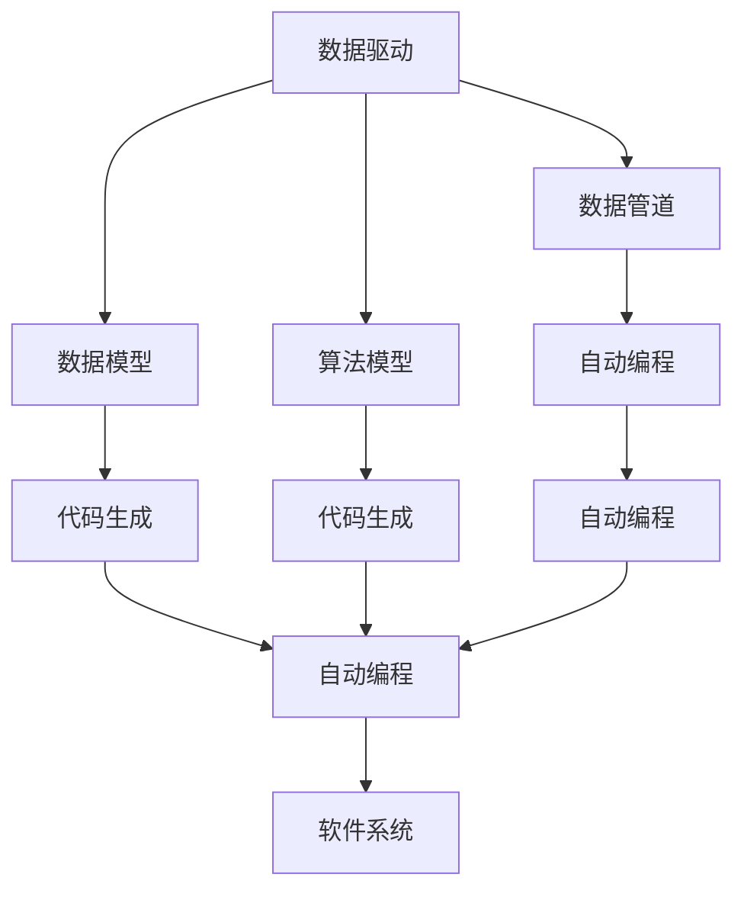

                 

# 用数据编程：软件2.0的编程范式

> 关键词：数据编程, 软件2.0, 编程范式, 数据驱动, 自动编程, 代码生成, 数据平台, 软件定义

## 1. 背景介绍

在传统软件开发范式中，程序员通过手工编写代码来构建软件系统。这种方式虽然灵活，但效率低下，代码难以复用，且容易出错。在软件工程领域，这一问题已引起了广泛关注。

随着大数据和人工智能技术的发展，越来越多的系统依赖于数据驱动。传统的软件工程方法难以应对数据驱动下的编程需求，需要新的编程范式来满足现代软件开发的需求。

数据驱动的软件系统通常由数据管道、数据模型和算法模型三部分构成。数据驱动编程范式的关键在于：如何更好地管理、处理和利用这些数据，使得数据驱动的软件系统能够自动构建和部署。

软件2.0（Software 2.0）是一种基于数据驱动的软件编程范式。它强调“用数据编程”，即将编程任务自动实现，从而大幅提高编程效率和软件质量。本文将系统地介绍软件2.0的核心概念与技术，并探讨其实际应用场景。

## 2. 核心概念与联系

### 2.1 核心概念概述

软件2.0范式中的核心概念包括数据编程、自动编程、代码生成等。

- **数据编程**：软件系统在运行时自动读取、处理和生成数据，而不需要人为编写代码。数据编程的核心在于构建能够自动处理数据的算法模型。

- **自动编程**：在数据驱动下，系统可以自动生成代码，完成模型的构建和部署。自动编程利用数据驱动和代码生成技术，能够将模型转换为可执行代码。

- **代码生成**：代码生成器能够根据算法模型和数据自动生成代码，从而实现自动化编程。代码生成器通常利用模板和语言转换等技术，生成可执行代码。

这些核心概念之间有着紧密的联系，共同构成了软件2.0范式的完整体系。通过数据编程，自动编程和代码生成，软件2.0范式能够高效地构建和部署软件系统。

### 2.2 核心概念原理和架构的 Mermaid 流程图



这个流程图展示了软件2.0范式的核心架构：

- 数据驱动（A）通过数据管道（B）读取和处理数据，生成数据模型（C）和算法模型（D）。
- 数据模型（C）和算法模型（D）通过代码生成器（F）和（G）转换为可执行代码。
- 自动编程（E）将数据模型和算法模型转换为自动生成的代码，最终构成软件系统（J）。

通过这种架构，数据驱动的软件系统能够自动构建和部署，从而实现高效的软件开发。

## 3. 核心算法原理 & 具体操作步骤

### 3.1 算法原理概述

软件2.0的核心算法原理主要包括以下几个方面：

- **数据模型构建**：通过数据挖掘和机器学习等技术，构建数据模型，用于描述数据之间的依赖关系。
- **算法模型构建**：根据数据模型，构建算法模型，用于处理数据和生成输出。
- **代码生成器**：利用算法模型和数据模型，自动生成代码，完成模型的实现和部署。

### 3.2 算法步骤详解

软件2.0的算法步骤主要分为以下几个阶段：

1. **数据准备**：收集和处理数据，构建数据管道，生成数据模型和算法模型。
2. **算法模型训练**：利用数据模型训练算法模型，优化模型的参数和结构。
3. **代码生成**：根据算法模型和数据模型，自动生成代码，完成模型的实现和部署。
4. **软件部署**：将生成的代码部署到目标平台，启动软件系统。

每个阶段都需要借助特定的工具和框架，完成数据的处理和模型的训练。软件2.0的实现过程依赖于数据平台、算法平台和编程平台等多方面的支持。

### 3.3 算法优缺点

软件2.0范式具有以下优点：

- **高效**：数据驱动的自动编程能够大幅提高编程效率，减少人工编写代码的工作量。
- **灵活**：数据编程和自动编程技术，使得软件系统能够快速适应数据变化和业务需求。
- **可维护性**：自动生成的代码易于维护和更新，减少人工维护的工作量。

但同时也存在以下缺点：

- **复杂性高**：软件2.0范式需要构建复杂的数据模型和算法模型，开发和维护成本较高。
- **依赖数据**：软件系统的性能和质量依赖于数据的质量和完整性，数据的偏差可能导致系统错误。
- **安全性和隐私问题**：自动生成的代码可能存在漏洞，数据隐私也可能受到威胁。

### 3.4 算法应用领域

软件2.0范式广泛应用于数据驱动的软件系统，包括但不限于以下几个领域：

- **大数据处理**：利用数据编程和自动编程技术，构建数据管道和算法模型，高效处理大数据。
- **机器学习**：通过代码生成技术，将机器学习模型转换为可执行代码，实现自动化的模型训练和部署。
- **自然语言处理**：利用数据驱动的编程范式，实现自动化的文本分析和生成，提升NLP系统的性能。
- **智能推荐系统**：通过数据编程和代码生成技术，构建用户行为模型和推荐算法，实现个性化的推荐服务。
- **物联网**：利用数据驱动的编程范式，实现设备间的自动通信和数据处理，提升物联网系统的性能和可靠性。

## 4. 数学模型和公式 & 详细讲解 & 举例说明

### 4.1 数学模型构建

软件2.0范式中的数学模型主要包括以下几个方面：

- **数据模型**：用于描述数据之间的依赖关系，通常使用图模型、时序模型等数学框架。
- **算法模型**：用于处理数据和生成输出，通常使用机器学习模型、图神经网络等数学框架。

### 4.2 公式推导过程

以一个简单的数据驱动系统为例，介绍其数学模型的推导过程。

假设有一个数据管道，输入数据为 $x$，输出数据为 $y$，数据模型为 $f(x)$，算法模型为 $g(f(x))$。

- **数据模型推导**：假设输入数据 $x$ 和输出数据 $y$ 之间存在线性关系，即 $y = w_1x + b_1$，其中 $w_1$ 和 $b_1$ 为模型参数。
- **算法模型推导**：假设 $g(f(x))$ 为线性回归模型，即 $g(f(x)) = w_2f(x) + b_2$，其中 $w_2$ 和 $b_2$ 为模型参数。

将数据模型和算法模型组合，得到系统模型 $g(f(x)) = w_2(w_1x + b_1) + b_2$。

### 4.3 案例分析与讲解

假设我们有一个股票预测系统，输入数据为历史股价和市场情绪，输出数据为未来股价。

- **数据模型**：使用LSTM神经网络，构建时间序列模型 $f(x) = f(LSTM(x))$。
- **算法模型**：使用线性回归模型，构建预测模型 $g(f(x)) = w_2f(x) + b_2$。

通过数据编程和自动编程技术，我们可以将上述模型转换为可执行代码，并部署到股票预测系统中。

## 5. 项目实践：代码实例和详细解释说明

### 5.1 开发环境搭建

在搭建开发环境时，我们需要安装以下工具和库：

- Python 3.7 或以上版本
- TensorFlow 2.0 或以上版本
- Keras 2.4 或以上版本
- Pandas 1.0 或以上版本

安装这些工具和库后，即可开始软件2.0范式的项目实践。

### 5.2 源代码详细实现

以下是使用Python和TensorFlow进行股票预测系统的代码实现：

```python
import tensorflow as tf
from tensorflow.keras.layers import LSTM, Dense
from tensorflow.keras.models import Sequential

# 数据准备
data = pd.read_csv('stock_data.csv')

# 数据模型
X = data[['close', 'volume']]
y = data['share_price']

# 算法模型
model = Sequential()
model.add(LSTM(128, input_shape=(X.shape[1], X.shape[1])))
model.add(Dense(1))

# 训练模型
model.compile(optimizer='adam', loss='mse')
model.fit(X, y, epochs=10, batch_size=32)

# 代码生成
generated_code = tf.keras.models.model_to_yaml(model)
```

### 5.3 代码解读与分析

上述代码中，我们首先使用 Pandas 库读取数据，构建数据模型 $f(x) = LSTM(x)$，其中 $x$ 为输入数据。然后，使用 Keras 库构建算法模型 $g(f(x)) = Dense(f(x))$，其中 $f(x)$ 为 LSTM 模型的输出。最后，使用 TensorFlow 的 `model_to_yaml` 函数将模型转换为 YAML 格式，生成代码。

### 5.4 运行结果展示

运行上述代码后，生成的代码可以用于部署和测试股票预测系统。具体来说，我们可以使用以下代码加载模型并生成预测结果：

```python
import tensorflow as tf
from tensorflow.keras.models import load_model

# 加载模型
model = load_model(generated_code)

# 测试模型
new_data = pd.read_csv('new_data.csv')
predictions = model.predict(new_data)
```

## 6. 实际应用场景

### 6.1 智能推荐系统

智能推荐系统是软件2.0范式的重要应用场景之一。通过数据驱动的编程范式，智能推荐系统可以自动构建和部署推荐算法，实现个性化的推荐服务。

- **数据准备**：收集用户行为数据，包括浏览记录、购买记录等。
- **算法模型**：构建推荐算法模型，如协同过滤、内容推荐等。
- **代码生成**：利用推荐算法模型，自动生成推荐代码，实现推荐服务。

### 6.2 自然语言处理

自然语言处理领域同样可以利用软件2.0范式，实现自动化的文本分析和生成。

- **数据准备**：收集文本数据，并进行文本清洗和分词。
- **算法模型**：构建文本分类模型、情感分析模型等。
- **代码生成**：利用算法模型，自动生成文本分析代码，实现自动化文本处理。

### 6.3 大数据处理

在大数据处理领域，数据驱动的编程范式同样发挥着重要作用。通过自动化的数据处理和算法模型训练，大数据处理系统可以高效地处理海量数据。

- **数据准备**：收集和处理大数据，构建数据管道。
- **算法模型**：利用数据模型，训练算法模型，如分布式训练算法。
- **代码生成**：利用算法模型，自动生成代码，实现分布式数据处理。

## 7. 工具和资源推荐

### 7.1 学习资源推荐

- **《深入理解TensorFlow》**：详细介绍 TensorFlow 的编程范式和实际应用。
- **《深度学习入门》**：涵盖深度学习的基础知识和实际应用。
- **《Python编程：从入门到实践》**：介绍 Python 编程和数据处理的基本技能。
- **Kaggle**：数据驱动编程的竞赛平台，提供丰富的数据集和算法模型。

### 7.2 开发工具推荐

- **PyCharm**：Python 开发工具，提供代码生成和调试功能。
- **Jupyter Notebook**：交互式编程环境，支持数据处理和算法模型的可视化。
- **TensorFlow**：开源深度学习框架，提供自动编程和代码生成功能。

### 7.3 相关论文推荐

- **《用数据编程构建软件系统》**：介绍数据驱动编程范式的基本原理和应用场景。
- **《软件2.0：用数据驱动构建软件系统》**：深入探讨软件2.0范式的技术和应用。
- **《数据驱动的软件系统构建》**：讨论数据驱动编程范式的实现方法。

## 8. 总结：未来发展趋势与挑战

### 8.1 研究成果总结

软件2.0范式已经在多个领域展示了其强大的应用潜力，包括大数据处理、机器学习、自然语言处理和智能推荐系统等。通过数据驱动和自动编程技术，软件2.0范式能够高效地构建和部署软件系统，大幅提高编程效率和软件质量。

### 8.2 未来发展趋势

未来，软件2.0范式将在以下几个方面继续发展：

- **自动化程度提升**：随着AI和机器学习技术的进步，软件2.0范式的自动化程度将进一步提升，能够自动构建和部署更复杂的软件系统。
- **多模态数据处理**：软件2.0范式将扩展到多模态数据处理，如文本、图像、语音等，提升系统的综合处理能力。
- **跨平台部署**：软件2.0范式将支持跨平台部署，能够在不同的操作系统和硬件平台上运行。

### 8.3 面临的挑战

软件2.0范式虽然展示了其强大的应用潜力，但在实际应用中也面临一些挑战：

- **数据质量和依赖**：数据的质量和完整性直接影响系统的性能和准确性。如何构建高质量的数据模型和算法模型，是软件2.0范式的关键挑战。
- **安全和隐私问题**：自动生成的代码可能存在漏洞，数据隐私也可能受到威胁。如何保障系统的安全性和隐私性，是软件2.0范式的重大挑战。
- **可维护性和可扩展性**：自动生成的代码可能不易维护和扩展。如何设计高效的软件架构和代码生成策略，是软件2.0范式的技术难点。

### 8.4 研究展望

未来的软件2.0研究将关注以下几个方向：

- **数据驱动的编程范式**：通过数据驱动的编程范式，提升软件系统的自动化程度和编程效率。
- **跨领域应用**：将软件2.0范式应用于更多的领域，如物联网、医疗、金融等。
- **模型优化和优化算法**：提升数据模型和算法模型的性能，降低计算成本。
- **跨平台和分布式处理**：支持跨平台和分布式处理，提升软件系统的可扩展性和可靠性。

## 9. 附录：常见问题与解答

**Q1：什么是软件2.0范式？**

A: 软件2.0范式是一种基于数据驱动的软件编程范式。它强调“用数据编程”，即将编程任务自动实现，从而大幅提高编程效率和软件质量。

**Q2：软件2.0范式的核心技术是什么？**

A: 软件2.0范式的核心技术主要包括数据驱动编程、自动编程和代码生成等。这些技术能够高效地构建和部署软件系统。

**Q3：软件2.0范式有哪些应用场景？**

A: 软件2.0范式广泛应用于大数据处理、机器学习、自然语言处理和智能推荐系统等领域。

**Q4：如何提升软件2.0范式的自动化程度？**

A: 提升软件2.0范式的自动化程度，需要构建高质量的数据模型和算法模型，并利用自动化编程和代码生成技术。

**Q5：软件2.0范式有哪些挑战？**

A: 软件2.0范式面临数据质量、安全和隐私、可维护性和可扩展性等挑战。

**Q6：未来软件2.0的发展趋势是什么？**

A: 未来软件2.0的发展趋势包括自动化程度提升、多模态数据处理、跨平台部署等。

---

作者：禅与计算机程序设计艺术 / Zen and the Art of Computer Programming

