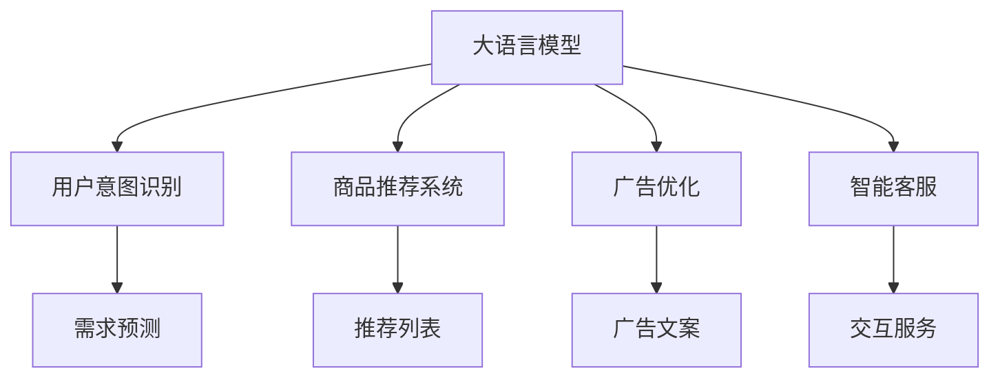

                 

# 电子商务革命：LLM 优化在线销售策略

> 关键词：

在数字化时代的浪潮中，电子商务行业正经历着前所未有的变革。随着消费者行为的变化和市场竞争的加剧，传统的电商策略已难以满足客户需求。近年来，大语言模型(Large Language Model, LLM)的出现，为在线销售策略的优化提供了新的方向。通过深度学习和自然语言处理(NLP)技术的融合，LLM能够更精准地捕捉客户需求，优化商品推荐，提升销售转化率。本文将深入探讨LLM在电子商务中的应用，以及如何通过优化模型参数、算法策略等手段，进一步提升在线销售的智能化水平。

## 1. 背景介绍

### 1.1 问题由来

随着电子商务的快速发展，在线零售商面临着巨大的挑战。如何精准了解消费者需求、优化商品推荐、提高转化率等，成为了电商企业的核心难题。传统电商主要依赖于手动分析用户行为数据和历史交易记录，然而这种方法费时费力且难以全面准确地理解用户需求。

近年来，大语言模型在NLP领域取得了突破性进展，其具备的强大语义理解和生成能力，使其在电商应用中展现出了巨大的潜力。通过将LLM应用于用户行为分析和商品推荐，在线零售商能够更高效、准确地预测用户需求，优化产品推荐策略，从而提高转化率，提升客户满意度。

### 1.2 问题核心关键点

大语言模型在电子商务中的应用主要集中在以下几个方面：

- **用户意图识别**：通过分析用户输入的文本（如搜索词、评论、聊天记录），识别用户的真实需求和意图。
- **商品推荐优化**：根据用户的历史行为和当前状态，动态生成个性化的商品推荐列表。
- **广告语优化**：生成更具吸引力的广告文案，提升广告点击率。
- **客户服务**：使用LLM构建智能客服系统，提升客服响应速度和质量。

这些应用场景的共同点在于，它们都涉及到大规模文本数据的处理和语义理解的优化。而大语言模型在这一领域的优势，在于其能够通过大量的预训练和微调，学习到丰富的语言知识，从而在实际任务中发挥出色表现。

### 1.3 问题研究意义

大语言模型在电子商务中的应用，具有重要研究意义：

1. **提高销售转化率**：通过精准的用户意图识别和商品推荐，能够有效提升用户的购买意愿和决策效率。
2. **优化广告效果**：生成更吸引人的广告语，提升广告投放的点击率和转化率，减少广告支出。
3. **降低客服成本**：构建智能客服系统，减少人力客服成本，提升客户服务质量。
4. **提升用户体验**：通过自然流畅的对话交互，提高用户满意度，提升品牌忠诚度。
5. **增加商家收益**：更精准的商品推荐和广告语生成，有助于提高商家销售额和利润率。

## 2. 核心概念与联系

### 2.1 核心概念概述

在进行深入探讨前，首先需要理解几个核心概念：

- **大语言模型(LLM)**：以深度学习技术为基础的语言模型，能够处理自然语言文本，具备强大的语义理解和生成能力。
- **用户意图识别**：通过对用户输入文本的分析，识别出用户的具体需求和意图。
- **商品推荐系统**：根据用户行为数据和商品属性，动态生成个性化的商品推荐列表。
- **广告优化**：通过生成更具吸引力的广告文案，提升广告效果。
- **智能客服**：使用LLM构建的智能客服系统，能够提供24小时不间断的客户服务。

这些概念之间的关系可以通过以下Mermaid流程图来展示：



### 2.2 概念间的关系

这些概念通过大语言模型紧密相连，构成了一个完整的电商应用框架。其中：

- **用户意图识别**：LLM通过分析用户输入的文本数据，预测用户的意图，从而为商品推荐和广告优化提供依据。
- **商品推荐系统**：根据用户的意图和行为数据，LLM动态生成推荐列表，帮助用户找到最合适的商品。
- **广告优化**：LLM生成吸引人的广告文案，提升广告点击率和转化率。
- **智能客服**：LLM构建的智能客服系统，能够24小时不间断地提供服务，提升客户满意度。

这些核心概念共同构成了LLM在电子商务中的应用框架，为电商企业提供了更智能、更高效的用户服务。

## 3. 核心算法原理 & 具体操作步骤

### 3.1 算法原理概述

LLM在电子商务中的应用主要基于监督学习和强化学习的混合策略。具体而言，包括以下几个步骤：

1. **预训练**：使用大规模无标签文本数据，对LLM进行预训练，学习通用的语言表示。
2. **微调**：在特定任务（如用户意图识别、商品推荐、广告优化、智能客服）上，使用小规模标注数据对预训练模型进行微调，使其能够更好地适应电商应用场景。
3. **强化学习**：在实际应用中，通过用户反馈和行为数据，不断调整模型参数，优化推荐策略和广告效果。

### 3.2 算法步骤详解

#### 3.2.1 预训练

预训练是构建LLM的基础步骤。通过在大规模无标签文本数据上进行自监督学习，LLM学习到丰富的语言知识和语义表示。常用的预训练任务包括：

- **掩码语言模型(Masked Language Model, MLM)**：从输入文本中随机掩盖部分单词，预测被掩盖的单词，学习单词之间的语义关系。
- **下一句预测(Next Sentence Prediction, NSP)**：预测两个句子之间的关系（连续或不连续），学习句子之间的语义连贯性。
- **语言模型(Language Model, LM)**：预测一个句子的下一个单词，学习单词的分布和顺序。

#### 3.2.2 微调

在特定任务上，使用小规模标注数据对预训练模型进行微调。以商品推荐为例，具体的微调步骤如下：

1. **数据准备**：收集用户的历史行为数据和商品属性数据，构建标注数据集。
2. **模型选择**：选择适合电商任务的预训练模型，如BERT、GPT等。
3. **任务适配**：根据任务需求，在预训练模型顶部添加任务相关的输出层，如线性分类器或解码器。
4. **训练**：使用标注数据集对模型进行有监督训练，优化任务相关参数。
5. **评估**：在验证集上评估模型性能，根据评估结果调整超参数。
6. **部署**：将微调后的模型部署到实际应用中，进行实时推荐。

#### 3.2.3 强化学习

在实际应用中，LLM还需要结合强化学习策略，根据用户反馈不断优化推荐策略和广告效果。具体步骤如下：

1. **在线学习**：在实际应用中，收集用户反馈数据，如点击率、购买率等，作为奖励信号。
2. **参数更新**：根据奖励信号，使用强化学习算法（如Q-Learning、SARSA等）更新模型参数。
3. **行为优化**：根据更新后的模型参数，生成新的推荐列表和广告文案，提升用户满意度和转化率。
4. **反馈循环**：将新的推荐结果和广告效果反馈到模型中，再次优化模型参数，形成良性循环。

### 3.3 算法优缺点

#### 3.3.1 优点

1. **高效精准**：LLM能够通过预训练和微调，学习到丰富的语言知识和用户行为模式，生成精准的推荐列表和广告文案。
2. **灵活适应**：通过微调和强化学习，LLM能够动态调整推荐策略和广告效果，适应用户需求的变化。
3. **可解释性强**：LLM生成的推荐和广告，可以提供详细的解释和理由，提升用户信任度。
4. **实时性高**：LLM能够实时处理用户输入和行为数据，提供实时推荐和客服服务。

#### 3.3.2 缺点

1. **数据依赖强**：LLM的性能高度依赖于标注数据的质量和数量，标注数据的不足可能导致性能下降。
2. **计算资源消耗高**：大语言模型参数量庞大，对计算资源需求高，模型训练和推理成本较高。
3. **模型复杂度高**：大语言模型结构复杂，难以理解和调试，需要丰富的NLP和深度学习知识。
4. **对抗样本风险**：LLM可能被恶意用户利用，生成对抗样本（如点击欺骗、虚假评论等），影响系统公平性和安全性。

### 3.4 算法应用领域

大语言模型在电子商务中的应用领域广泛，包括但不限于：

1. **用户意图识别**：通过分析用户输入的文本数据，预测用户需求和意图，如搜索词、评论、聊天记录等。
2. **商品推荐系统**：根据用户行为数据和商品属性，生成个性化的推荐列表，提升用户购买意愿和转化率。
3. **广告优化**：生成更具吸引力的广告文案，提升广告点击率和转化率，降低广告支出。
4. **智能客服**：构建智能客服系统，提供24小时不间断的服务，提升客户满意度和品牌忠诚度。
5. **社交电商**：分析用户社交媒体数据，生成个性化推荐和广告，增强用户互动和黏性。

## 4. 数学模型和公式 & 详细讲解 & 举例说明

### 4.1 数学模型构建

大语言模型在电子商务中的应用，主要通过以下数学模型构建：

1. **预训练模型**：使用掩码语言模型(MLM)和下一句预测(NSP)等任务，对大规模无标签文本数据进行预训练。
2. **用户意图识别模型**：使用神经网络模型，如RNN、LSTM、Transformer等，构建用户意图识别模型。
3. **商品推荐模型**：使用协同过滤、基于内容的推荐、基于矩阵分解的推荐等模型，构建商品推荐系统。
4. **广告优化模型**：使用序列生成模型，如Seq2Seq、Transformer等，生成具有吸引力的广告文案。
5. **智能客服模型**：使用自然语言理解(NLU)和对话生成模型，构建智能客服系统。

### 4.2 公式推导过程

以用户意图识别为例，假设有标注数据集 $D=\{(x_i, y_i)\}_{i=1}^N$，其中 $x_i$ 为输入文本，$y_i$ 为意图标签，可以使用softmax函数计算LLM预测用户意图的概率：

$$
p(y_i|x_i) = \frac{e^{u(x_i; \theta)}}{\Sigma_{j=1}^K e^{u(x_i; \theta_j)}}
$$

其中 $u(x_i; \theta)$ 为LLM的表示函数，$\theta$ 为模型参数。

对于商品推荐系统，假设推荐结果为 $y=\{y_1, y_2, ..., y_n\}$，用户行为数据为 $d=\{d_1, d_2, ..., d_m\}$，可以使用基于内容的推荐模型，计算商品与用户行为的相关度：

$$
\text{Relevance}(y_i, d_j) = \text{dot}(E(y_i), E(d_j))
$$

其中 $E(y_i)$ 和 $E(d_j)$ 分别为商品和用户行为的嵌入向量，$\text{dot}$ 为点积运算。

### 4.3 案例分析与讲解

以推荐系统为例，假设有一家电商网站，需要优化其推荐系统。具体步骤如下：

1. **数据收集**：收集用户的历史行为数据和商品属性数据，构建标注数据集。
2. **模型选择**：选择适合电商任务的预训练模型，如BERT。
3. **任务适配**：在BERT顶部添加线性分类器，进行用户意图识别。
4. **训练**：使用标注数据集对模型进行有监督训练，优化分类器参数。
5. **评估**：在验证集上评估模型性能，调整超参数。
6. **部署**：将微调后的BERT模型部署到实际应用中，进行实时推荐。

## 5. 项目实践：代码实例和详细解释说明

### 5.1 开发环境搭建

在进行代码实践前，需要准备以下开发环境：

1. **安装Python**：从官网下载并安装Python，并配置环境变量。
2. **安装PyTorch**：使用以下命令安装PyTorch，并设置版本。
   ```bash
   pip install torch==1.11.1
   ```
3. **安装Transformers库**：使用以下命令安装Transformers库，用于处理NLP任务。
   ```bash
   pip install transformers
   ```
4. **准备数据集**：收集用户的历史行为数据和商品属性数据，构建标注数据集。
5. **准备预训练模型**：下载BERT预训练模型，并解冻顶部分类器。

### 5.2 源代码详细实现

以下是一个简单的代码示例，演示了如何使用PyTorch和Transformers库构建用户意图识别模型：

```python
import torch
import torch.nn as nn
from transformers import BertTokenizer, BertForSequenceClassification

# 初始化BERT模型和tokenizer
tokenizer = BertTokenizer.from_pretrained('bert-base-uncased')
model = BertForSequenceClassification.from_pretrained('bert-base-uncased', num_labels=2)

# 定义模型输入和输出
def forward(model, input_ids, attention_mask):
    output = model(input_ids, attention_mask=attention_mask)
    return output

# 训练模型
def train(model, train_data, val_data, epochs=3, batch_size=32):
    train_loader = DataLoader(train_data, batch_size=batch_size, shuffle=True)
    val_loader = DataLoader(val_data, batch_size=batch_size, shuffle=False)
    optimizer = AdamW(model.parameters(), lr=2e-5)
    for epoch in range(epochs):
        model.train()
        for batch in train_loader:
            input_ids = batch['input_ids']
            attention_mask = batch['attention_mask']
            labels = batch['labels']
            output = forward(model, input_ids, attention_mask)
            loss = nn.CrossEntropyLoss()(output, labels)
            optimizer.zero_grad()
            loss.backward()
            optimizer.step()
        model.eval()
        val_loss = 0
        with torch.no_grad():
            for batch in val_loader:
                input_ids = batch['input_ids']
                attention_mask = batch['attention_mask']
                labels = batch['labels']
                output = forward(model, input_ids, attention_mask)
                val_loss += nn.CrossEntropyLoss()(output, labels).item()
        val_loss /= len(val_loader)
        print(f'Epoch {epoch+1}, Val Loss: {val_loss:.4f}')
```

### 5.3 代码解读与分析

上述代码实现了基于BERT的用户意图识别模型。具体步骤如下：

1. **初始化模型和tokenizer**：使用BertTokenizer初始化tokenizer，使用BertForSequenceClassification初始化模型。
2. **定义模型输入和输出**：使用BertForSequenceClassification的前向函数，将输入token ids和attention mask传递给模型，计算输出。
3. **训练模型**：使用PyTorch的DataLoader对数据集进行批次化加载，在每个批次上前向传播计算损失并反向传播更新模型参数，最后输出验证集的损失。

## 6. 实际应用场景

### 6.1 智能推荐系统

智能推荐系统是电商应用中最核心的功能之一。通过大语言模型，能够更精准地预测用户需求，生成个性化推荐列表，提高用户满意度和转化率。例如，亚马逊使用基于BERT的商品推荐系统，实现了显著的销售增长。

### 6.2 广告优化

在线广告是电商企业的重要收入来源。通过生成更具吸引力的广告文案，能够提升广告效果，降低广告支出。例如，谷歌使用基于GPT的广告优化系统，显著提高了广告点击率和转化率。

### 6.3 智能客服

智能客服系统能够提供24小时不间断的服务，提升客户满意度。通过大语言模型，能够构建自然流畅的对话系统，回答用户问题，提供个性化的服务。例如，阿里巴巴使用基于BERT的智能客服系统，大幅减少了客服人力成本。

### 6.4 未来应用展望

未来，大语言模型在电子商务中的应用将更加广泛。除了上述功能外，还可能拓展到以下领域：

1. **个性化营销**：根据用户行为数据和社交网络信息，生成个性化的营销策略。
2. **库存管理**：预测用户购买行为，优化库存管理，减少缺货和积压。
3. **内容创作**：生成高质量的产品描述、评论和广告文案，提升用户体验。
4. **实时监控**：实时监控用户行为和反馈，动态调整推荐策略和广告效果。

## 7. 工具和资源推荐

### 7.1 学习资源推荐

为了帮助开发者掌握大语言模型在电子商务中的应用，这里推荐一些优质的学习资源：

1. **《深度学习与自然语言处理》**：介绍深度学习和大语言模型的基本原理和应用，涵盖NLP领域的经典任务。
2. **NLP专项课程**：如斯坦福大学的CS224N课程，提供系统化的学习路径和实践机会。
3. **在线教程**：如HuggingFace的Transformer库教程，提供了详细的模型搭建和调优指南。
4. **技术博客**：如OpenAI、Google AI、DeepMind的研究论文和博客，了解最新的NLP技术进展。

### 7.2 开发工具推荐

大语言模型在电子商务中的应用，需要借助一系列高效的工具进行开发。以下是推荐的开发工具：

1. **PyTorch**：深度学习框架，灵活的动态计算图，适合快速迭代研究。
2. **TensorFlow**：由Google开发的深度学习框架，生产部署方便，适合大规模工程应用。
3. **Transformers库**：HuggingFace开发的NLP工具库，集成了SOTA语言模型，方便微调任务开发。
4. **Google Colab**：免费的在线Jupyter Notebook环境，方便快速实验最新模型。
5. **TensorBoard**：TensorFlow配套的可视化工具，实时监测模型训练状态，提供丰富的图表呈现方式。

### 7.3 相关论文推荐

大语言模型在电子商务中的应用，得到了学界的广泛关注。以下是几篇奠基性的相关论文，推荐阅读：

1. **《BERT: Pre-training of Deep Bidirectional Transformers for Language Understanding》**：提出BERT模型，引入自监督预训练任务，提升模型性能。
2. **《AdaLoRA: Adaptive Low-Rank Adaptation for Parameter-Efficient Fine-Tuning》**：提出AdaLoRA方法，通过低秩适应的微调方法，提高微调效率。
3. **《GPT-3: Language Models are Unsupervised Multitask Learners》**：展示GPT-3模型的强大zero-shot学习能力，推动语言模型的发展。
4. **《Few-shot Text Generation via Cross-lingual Prompt Tuning》**：提出跨语言提示微调方法，提升少样本学习和跨领域迁移能力。
5. **《Recurrent Models for Language Modeling and Machine Translation》**：介绍RNN和LSTM模型在语言建模和机器翻译中的应用。

## 8. 总结：未来发展趋势与挑战

### 8.1 总结

本文对大语言模型在电子商务中的应用进行了全面系统的介绍。通过优化预训练模型、微调策略和强化学习范式，大语言模型能够更精准地捕捉用户需求，优化推荐策略和广告效果，提升用户体验和销售转化率。

### 8.2 未来发展趋势

大语言模型在电子商务中的应用前景广阔，未来发展趋势如下：

1. **模型规模扩大**：随着预训练技术的发展，大语言模型的参数量将持续增长，具备更丰富的语言知识和语义表示。
2. **微调策略优化**：引入更多先验知识和多模态信息，进一步提升微调模型的泛化能力和适应性。
3. **强化学习应用**：结合强化学习策略，动态调整推荐策略和广告效果，提升用户满意度和转化率。
4. **跨领域迁移能力增强**：通过跨领域迁移学习，提升大语言模型的通用性和鲁棒性。
5. **实时性提升**：通过优化模型结构和算法，提高大语言模型的推理速度和实时性。

### 8.3 面临的挑战

尽管大语言模型在电子商务中展现出巨大的潜力，但仍面临诸多挑战：

1. **标注数据依赖**：标注数据的质量和数量直接影响模型的性能，标注成本较高。
2. **计算资源消耗**：大语言模型参数量庞大，对计算资源需求高，模型训练和推理成本较高。
3. **模型可解释性**：大语言模型的决策过程复杂，难以理解和解释，影响用户信任度。
4. **对抗样本风险**：恶意用户可能利用对抗样本攻击，影响系统的公平性和安全性。
5. **隐私保护**：在用户行为分析过程中，如何保护用户隐私，是一个重要的挑战。

### 8.4 研究展望

针对这些挑战，未来的研究需要在以下几个方面寻求新的突破：

1. **无监督和半监督学习**：通过无监督和半监督学习范式，缓解标注数据依赖。
2. **参数高效微调**：开发更多参数高效的微调方法，提高模型的灵活性和微调效率。
3. **对抗样本防御**：研究对抗样本生成和防御技术，提升系统的鲁棒性和安全性。
4. **模型可解释性**：引入可解释性技术，提升模型的可解释性和用户信任度。
5. **隐私保护**：结合差分隐私等技术，保护用户隐私，提升系统的可信度。

总之，大语言模型在电子商务中的应用，需要不断优化模型、数据和算法，解决面临的挑战，才能实现更好的性能和更广泛的应用。只有通过多路径协同发力，才能真正推动电商行业的数字化转型，构建人机协同的智能电商生态。

## 9. 附录：常见问题与解答

**Q1: 大语言模型在电商中应用的难点有哪些？**

A: 大语言模型在电商中应用的难点主要包括：
1. 标注数据获取成本高，标注质量难以保证。
2. 模型训练和推理资源需求大，计算成本较高。
3. 模型决策过程复杂，难以解释和理解。
4. 对抗样本攻击风险高，影响系统公平性和安全性。
5. 用户隐私保护问题，需平衡数据使用和隐私保护。

**Q2: 大语言模型在电商中如何优化商品推荐？**

A: 大语言模型优化商品推荐的方法包括：
1. 预训练模型选择：选择适合电商任务的BERT或GPT等模型。
2. 用户意图识别：通过分析用户输入的文本数据，预测用户意图。
3. 推荐策略优化：使用协同过滤、内容推荐、矩阵分解等方法，动态生成个性化推荐列表。
4. 强化学习：收集用户反馈数据，使用强化学习算法更新模型参数，提升推荐效果。
5. 实时性优化：通过优化模型结构和算法，提高推荐系统的实时性和响应速度。

**Q3: 大语言模型在电商中的数据处理流程有哪些？**

A: 大语言模型在电商中的数据处理流程包括：
1. 数据收集：收集用户的历史行为数据和商品属性数据，构建标注数据集。
2. 数据预处理：清洗和标准化数据，构建合适的输入格式。
3. 特征工程：提取和生成特征，提升模型性能。
4. 模型训练：使用标注数据集对模型进行有监督训练，优化模型参数。
5. 模型评估：在验证集上评估模型性能，调整超参数。
6. 模型部署：将微调后的模型部署到实际应用中，进行实时推荐。

通过深入探讨大语言模型在电子商务中的应用，我们看到了其在优化推荐策略、提升广告效果、构建智能客服等方面的巨大潜力。随着技术的发展和应用的深入，大语言模型必将在电商行业中发挥更加重要的作用，推动电商行业的数字化转型。

