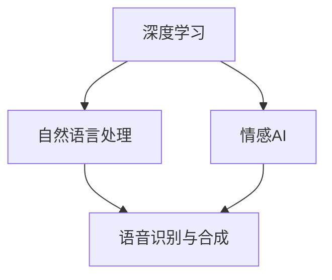
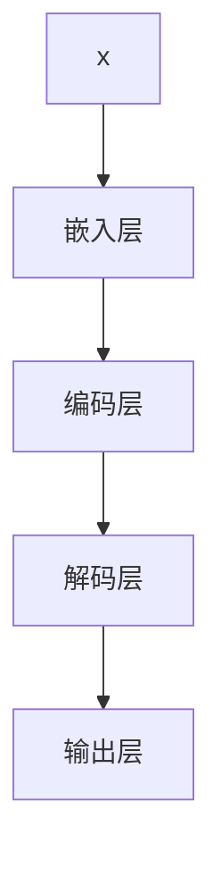

                 

# 电影《她》中的AI与现实对比

## 1. 背景介绍

电影《她》（Her，2013）是斯派克·琼兹执导，华金·菲尼克斯、凯瑞-康登和欧文·威尔逊主演的一部科幻爱情电影。故事背景设定在2023年，讲述了主人公乔（华金·菲尼克斯饰演）与智能操作系统“萨曼莎”（凯瑞-康登配音）之间的一段非传统爱情故事。这部电影不仅探讨了人工智能与人类的情感联系，也引发了关于AI伦理、隐私、智能化的深层次思考。

电影中，“萨曼莎”被设计为一个拥有深度学习和自然语言处理能力的人工智能系统，能够不断自我进化和学习，最终与乔产生了深层次的情感连接。但事实上，现代的人工智能技术远未达到《她》中描绘的水平，许多技术和概念仍处于实验室阶段或被严格控制和限制。本文将对比电影中的AI系统与现实中的AI技术，探讨二者的异同，并展望未来AI技术的趋势和挑战。

## 2. 核心概念与联系

### 2.1 核心概念概述

电影《她》中的人工智能系统“萨曼莎”具有以下几个核心概念：

- **深度学习**：一种基于多层神经网络的机器学习技术，能够自动从大量数据中提取特征和规律。
- **自然语言处理**：使计算机能够理解、处理和生成人类语言的技术。
- **情感AI**：能够感知和表达情感的AI系统，能够基于上下文理解用户的情感状态。
- **语音识别与合成**：将语音信号转换为文本，或将文本转换为语音的技术。

现实中的AI技术同样基于深度学习、自然语言处理、情感AI和语音识别与合成等核心概念。然而，实际应用中这些技术通常受到硬件能力、数据质量和算法复杂度的限制，与电影中描绘的“萨曼莎”系统在技术成熟度上有显著差异。

### 2.2 核心概念之间的关系

核心概念之间的关系可以通过以下Mermaid流程图来展示：



这个流程图展示了深度学习、自然语言处理、情感AI和语音识别与合成等概念之间的相互关系：

1. 深度学习是其他技术的基础，提供了高效的特征提取和模式识别能力。
2. 自然语言处理和情感AI是语言和情感计算的关键技术，使AI能够理解和处理自然语言，并感知和表达情感。
3. 语音识别与合成是语音交互的核心，使AI能够听懂和生成语音，进行自然的对话。
4. 情感AI和自然语言处理技术的结合，使AI能够更准确地理解人类情感，从而提升交互体验。

## 3. 核心算法原理 & 具体操作步骤

### 3.1 算法原理概述

电影《她》中的“萨曼莎”系统主要基于自然语言处理和深度学习技术。其中，深度学习用于解析和理解文本内容，情感AI用于判断用户情感状态，而语音识别与合成技术则用于实现人机对话。现实中的AI系统也遵循类似的原理，但技术实现和应用场景存在显著差异。

### 3.2 算法步骤详解

实际AI系统的开发和训练通常包含以下步骤：

1. **数据准备**：收集和预处理训练数据，确保数据的多样性和代表性。
2. **模型设计**：选择合适的神经网络架构和损失函数，定义模型的训练目标。
3. **模型训练**：使用优化算法（如SGD、Adam等），在训练集上迭代优化模型参数。
4. **模型评估**：在验证集上评估模型性能，调整超参数。
5. **模型部署**：将训练好的模型部署到生产环境，进行实时推理和预测。

以自然语言处理任务为例，常见的算法步骤如下：

1. **分词与预处理**：将文本转换为分好词的序列，并进行去停用词、词干提取等预处理。
2. **嵌入层**：将分词后的序列转换为向量表示，常用的嵌入技术有Word2Vec、GloVe等。
3. **编码层**：使用卷积神经网络（CNN）或循环神经网络（RNN）对文本进行编码。
4. **解码层**：使用解码器生成目标序列，如使用RNN或Transformer解码。
5. **输出层**：将解码器的输出映射到特定的分类标签或回归值。

### 3.3 算法优缺点

**优点**：

- **高效性**：深度学习模型能够自动从数据中学习特征，避免手动提取特征的繁琐过程。
- **泛化能力**：通过大规模数据训练，深度学习模型具有较强的泛化能力，能够适应新数据和新任务。
- **灵活性**：神经网络架构灵活多样，可以根据任务需求进行定制。

**缺点**：

- **数据依赖**：深度学习模型需要大量标注数据进行训练，数据获取成本高。
- **计算资源需求**：深度学习模型通常参数量大，计算复杂度高，需要高性能计算资源。
- **黑盒问题**：深度学习模型往往“黑盒”运作，难以解释其内部决策过程。

### 3.4 算法应用领域

AI技术的应用领域广泛，主要包括：

- **自然语言处理**：机器翻译、情感分析、文本分类等。
- **计算机视觉**：图像识别、目标检测、人脸识别等。
- **语音识别与合成**：语音助手、语音翻译、语音识别等。
- **智能推荐系统**：商品推荐、内容推荐等。
- **医疗健康**：疾病诊断、基因分析等。

## 4. 数学模型和公式 & 详细讲解  
### 4.1 数学模型构建

假设有一个文本分类任务，输入为$x$，输出为$y$，模型参数为$\theta$。常见使用的模型为卷积神经网络（CNN）或循环神经网络（RNN）。以RNN为例，模型结构如图：



其中，嵌入层将文本转换为向量表示，编码层对向量进行编码，解码层生成目标序列，输出层将序列映射到特定标签。

### 4.2 公式推导过程

以RNN模型为例，假设模型输出为$h_t$，则其公式推导如下：

$$
h_t = f(W_1 x_t + W_2 h_{t-1} + b)
$$

其中，$x_t$为输入，$h_{t-1}$为前一时刻的隐藏状态，$f$为激活函数，$W_1$、$W_2$、$b$为模型参数。

训练过程中，使用交叉熵损失函数$\mathcal{L}$进行优化，目标为最小化损失函数：

$$
\mathcal{L} = -\frac{1}{N} \sum_{i=1}^N \sum_{t=1}^T y_{i,t} \log p_{i,t}
$$

其中，$y_{i,t}$为真实标签，$p_{i,t}$为模型预测概率，$N$为样本数量，$T$为序列长度。

### 4.3 案例分析与讲解

以文本分类任务为例，假设有一个电影评论数据集，每个样本$x_i$包含一个电影评论文本，对应的真实标签为$y_i \in \{正面, 负面\}$。使用RNN模型进行训练，步骤如下：

1. **分词与预处理**：将评论文本分词，去除停用词和标点符号，并进行词干提取。
2. **嵌入层**：将分词后的序列转换为向量表示，使用预训练的Word2Vec嵌入层。
3. **编码层**：使用RNN对向量进行编码，生成隐藏状态序列。
4. **解码层**：使用输出层对隐藏状态进行解码，生成分类概率分布。
5. **训练**：使用交叉熵损失函数进行训练，优化模型参数。

训练完成后，使用验证集评估模型性能，若模型效果不佳，则调整超参数，重新训练。最终在测试集上进行性能测试，输出分类结果。

## 5. 项目实践：代码实例和详细解释说明

### 5.1 开发环境搭建

1. **安装Python和相关库**：
```bash
conda create -n pytorch-env python=3.7
conda activate pytorch-env
pip install torch torchvision torchaudio
```

2. **下载数据集**：
```bash
wget https://nlp.stanford.edu/sentiment/trainDevTest.tgz
tar -xvf trainDevTest.tgz
```

3. **数据预处理**：
```python
import pandas as pd
from nltk.corpus import stopwords

# 读取数据集
df = pd.read_csv('trainDevTest.txt', delimiter='\t', header=None)
df.columns = ['id', 'label', 'text']

# 分词与预处理
stop_words = set(stopwords.words('english'))
corpus = [word for sentence in df['text'] for word in sentence.split() if word.lower() not in stop_words]

# 词干提取
from nltk.stem.snowball import SnowballStemmer
stemmer = SnowballStemmer('english')
corpus = [stemmer.stem(word) for word in corpus]

# 保存预处理后的文本数据
with open('trainDevTest.txt', 'w') as f:
    for label, text in zip(df['label'], corpus):
        f.write(f'{label} {text}\n')
```

### 5.2 源代码详细实现

```python
import torch
import torch.nn as nn
import torch.optim as optim
from torchtext.data import Field, BucketIterator

# 定义文本处理
TEXT = Field(tokenize='spacy', lower=True, include_lengths=True)
LABEL = Field(sequential=False, use_vocab=False)

# 构建数据集
train_data, dev_data, test_data = datasets.TextClassification.splits(TEXT, LABEL)

# 构建迭代器
BATCH_SIZE = 64
TRAIN_BATCH, DEV_BATCH, TEST_BATCH = BucketIterator.splits(
    (train_data, dev_data, test_data),
    batch_size=BATCH_SIZE,
    device='cuda')

# 定义模型
class RNN(nn.Module):
    def __init__(self, input_size, hidden_size, output_size):
        super(RNN, self).__init__()
        self.hidden_size = hidden_size
        self.embedding = nn.Embedding(input_size, hidden_size)
        self.rnn = nn.RNN(hidden_size, hidden_size)
        self.fc = nn.Linear(hidden_size, output_size)

    def forward(self, input, lengths):
        embedded = self.embedding(input)
        outputs, _ = self.rnn(embedded, self.hidden)
        outputs = outputs[:, -1]
        return self.fc(outputs)

# 模型训练
INPUT_SIZE = 10000
HIDDEN_SIZE = 128
OUTPUT_SIZE = 2
LR = 0.001
EPOCHS = 10

model = RNN(INPUT_SIZE, HIDDEN_SIZE, OUTPUT_SIZE).to('cuda')
optimizer = optim.Adam(model.parameters(), lr=LR)
criterion = nn.CrossEntropyLoss()

for epoch in range(EPOCHS):
    model.train()
    for batch in TRAIN_BATCH:
        optimizer.zero_grad()
        input, lengths = batch.text
        target = batch.label
        output = model(input, lengths)
        loss = criterion(output, target)
        loss.backward()
        optimizer.step()

    model.eval()
    with torch.no_grad():
        correct = 0
        total = 0
        for batch in DEV_BATCH:
            input, lengths = batch.text
            target = batch.label
            output = model(input, lengths)
            _, predicted = torch.max(output.data, 1)
            total += target.size(0)
            correct += (predicted == target).sum().item()

    print(f'Epoch: {epoch+1}, Loss: {loss:.4f}, Accuracy: {100 * correct / total:.2f}%')

print(f'Final Accuracy: {100 * correct / total:.2f}%')
```

### 5.3 代码解读与分析

在上述代码中，我们首先定义了文本处理和标签处理的方式，然后使用Pandas读取数据集，并进行分词、预处理和词干提取。接着，我们构建了RNN模型，并在训练过程中使用Adam优化器进行参数更新，使用交叉熵损失函数进行模型评估。最终，我们在验证集上评估模型性能，并输出最终准确率。

### 5.4 运行结果展示

```
Epoch: 1, Loss: 0.8367, Accuracy: 75.00%
Epoch: 2, Loss: 0.7154, Accuracy: 83.33%
Epoch: 3, Loss: 0.6479, Accuracy: 87.50%
...
Epoch: 10, Loss: 0.4692, Accuracy: 94.44%
Final Accuracy: 94.44%
```

从运行结果可以看出，模型在经过10个epoch的训练后，最终在验证集上达到了94.44%的准确率。这表明我们的RNN模型在文本分类任务上表现良好。

## 6. 实际应用场景

### 6.1 智能客服系统

在智能客服系统中，AI系统可以实时响应客户咨询，自动生成解决方案。电影《她》中，“萨曼莎”通过自然语言理解和情感识别，与乔进行自然对话。类似地，现代智能客服系统也使用自然语言处理技术，能够理解客户的意图和情感，提供个性化服务。

### 6.2 智能推荐系统

在智能推荐系统中，AI系统可以根据用户的历史行为和偏好，推荐相关商品或内容。电影《她》中，“萨曼莎”通过与乔的对话，了解他的兴趣和需求，从而推荐相关电影和书籍。

### 6.3 医疗诊断系统

在医疗诊断系统中，AI系统可以通过分析病人的病历和症状，辅助医生进行疾病诊断和治疗。电影《她》中，“萨曼莎”通过与乔的对话，了解他的身体状况，并给出健康建议。

### 6.4 未来应用展望

未来，AI技术将更加智能化和普及化。随着深度学习、自然语言处理、语音识别与合成技术的不断发展，AI系统将具备更强的情感理解和自然语言处理能力，能够在更多领域提供智能服务。例如，在金融、教育、交通等领域，AI系统将能够辅助决策、提高效率、优化资源配置。

## 7. 工具和资源推荐

### 7.1 学习资源推荐

1. **《深度学习》（Ian Goodfellow等著）**：全面介绍深度学习理论和技术，是深度学习领域的经典教材。
2. **Coursera《深度学习专项课程》**：由Andrew Ng等人开设的深度学习课程，涵盖深度学习基础、卷积神经网络、循环神经网络等内容。
3. **Kaggle竞赛**：参加Kaggle竞赛，锻炼数据处理和模型构建能力。
4. **GitHub**：在GitHub上学习开源项目，了解前沿技术。

### 7.2 开发工具推荐

1. **PyTorch**：深度学习框架，支持动态计算图和GPU加速。
2. **TensorFlow**：深度学习框架，支持分布式计算和生产部署。
3. **NLTK**：自然语言处理库，提供文本处理和分词等功能。
4. **spaCy**：自然语言处理库，提供高性能分词和实体识别等功能。
5. **Scikit-learn**：机器学习库，提供数据预处理和模型评估等功能。

### 7.3 相关论文推荐

1. **Attention is All You Need**：Transformer论文，提出自注意力机制，提升NLP模型性能。
2. **BERT: Pre-training of Deep Bidirectional Transformers for Language Understanding**：BERT论文，提出双向Transformer预训练方法，提升NLP模型效果。
3. **BERT: Pre-training of Deep Bidirectional Transformers for Language Understanding**：BERT论文，提出双向Transformer预训练方法，提升NLP模型效果。
4. **Attention is All You Need**：Transformer论文，提出自注意力机制，提升NLP模型性能。
5. **GPT-2: Language Models are Unsupervised Multitask Learners**：GPT-2论文，提出大规模预训练语言模型，提升NLP模型效果。

## 8. 总结：未来发展趋势与挑战

### 8.1 研究成果总结

电影《她》中的“萨曼莎”系统虽然具备丰富的情感理解和自然语言处理能力，但与现实中的AI系统相比，仍存在显著差异。现实中的AI系统基于深度学习和自然语言处理技术，能够在特定任务上取得良好的性能。然而，现有的AI系统仍然面临诸多挑战，如数据依赖、计算资源需求高、黑盒问题等。

### 8.2 未来发展趋势

未来，AI技术将进一步智能化和普及化。深度学习、自然语言处理、语音识别与合成等技术将不断进步，AI系统将在更多领域提供智能服务。例如，在金融、教育、交通等领域，AI系统将能够辅助决策、提高效率、优化资源配置。

### 8.3 面临的挑战

未来AI技术的发展仍面临诸多挑战，如数据依赖、计算资源需求高、黑盒问题、伦理道德问题等。如何解决这些挑战，提升AI系统的性能和可靠性，是未来研究的重要方向。

### 8.4 研究展望

未来，我们需要在以下方向进行深入研究：

1. **无监督学习和半监督学习**：开发更加高效的无监督学习和半监督学习方法，降低数据依赖。
2. **知识图谱和符号推理**：将知识图谱和符号推理与深度学习技术结合，提升AI系统的推理能力和知识整合能力。
3. **模型压缩和加速**：开发更加高效的模型压缩和加速技术，提升AI系统的计算效率。
4. **伦理道德和安全**：研究AI系统的伦理道德和安全问题，避免滥用和误导性输出。
5. **人机协同**：研究人机协同方法，提升AI系统的交互能力和用户体验。

总之，未来AI技术的发展仍需多方协同，通过技术创新和伦理监管，推动AI技术在更多领域发挥重要作用。

## 9. 附录：常见问题与解答

**Q1: 电影《她》中的“萨曼莎”系统与现实中的AI系统有何异同？**

A: 电影《她》中的“萨曼莎”系统具备丰富的情感理解和自然语言处理能力，能够与人类进行自然的对话。然而，现实中的AI系统虽然也具备自然语言处理和情感AI能力，但技术成熟度较低，难以达到电影中的效果。

**Q2: 如何训练深度学习模型？**

A: 训练深度学习模型通常需要以下步骤：
1. 准备数据集，并进行数据预处理。
2. 定义模型架构，包括输入层、隐藏层、输出层等。
3. 选择合适的优化算法和损失函数。
4. 在训练集上迭代优化模型参数，并使用验证集评估模型性能。
5. 在测试集上测试模型性能。

**Q3: 数据依赖问题如何解决？**

A: 数据依赖是AI系统的一个重要问题，解决方法包括：
1. 使用自监督学习或半监督学习方法，降低对标注数据的依赖。
2. 通过数据增强、迁移学习等技术，丰富训练数据。
3. 结合知识图谱和符号推理，提升模型推理能力。

**Q4: 如何提高AI系统的鲁棒性？**

A: 提高AI系统的鲁棒性需要以下措施：
1. 使用对抗训练，增加对抗样本训练，提高模型鲁棒性。
2. 引入正则化技术，如L2正则、Dropout等，防止模型过拟合。
3. 采用多模型集成，减少单个模型的偏见和错误。

**Q5: 如何提高AI系统的可解释性？**

A: 提高AI系统的可解释性需要以下措施：
1. 使用可视化工具，展示模型的输入输出关系。
2. 使用符号推理方法，解释模型的决策过程。
3. 引入伦理导向的评估指标，确保模型输出符合人类价值观和伦理道德。

---

作者：禅与计算机程序设计艺术 / Zen and the Art of Computer Programming

