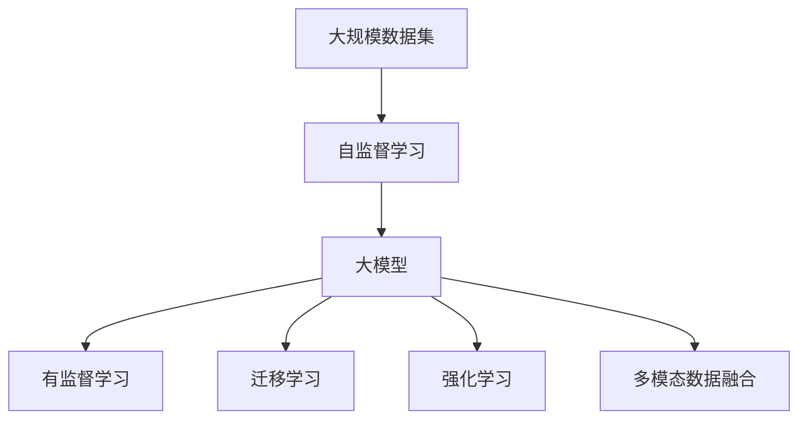
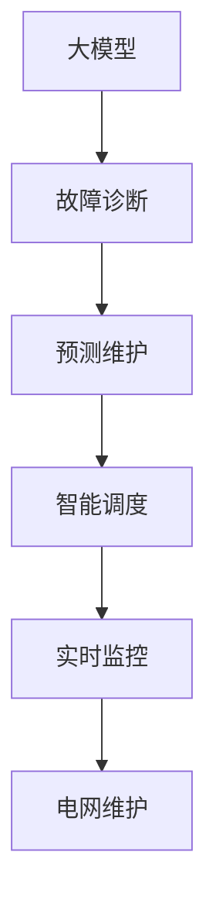
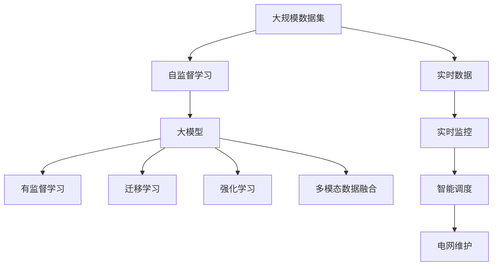

                 

# 电网维护与大模型的应用

## 1. 背景介绍

### 1.1 问题由来
随着全球能源需求的快速增长，电网的稳定运行至关重要。然而，由于设备老旧、运行环境复杂等因素，电网故障时有发生，影响了电力供应的可靠性。传统电网维护方法依赖于人工巡检、定期的设备检测和计划维修，成本高、效率低，且难以应对突发性故障。因此，如何利用先进的技术手段提高电网维护的自动化水平，减少人为干预，成为电力行业亟待解决的问题。

近年来，随着深度学习和大数据技术的发展，人工智能(AI)在电网维护领域得到了广泛应用。其中，基于大模型的智能电网维护技术，通过从海量电网运行数据中学习，能够自动化地诊断和预测电网故障，提供更精准的维护建议，显著提升了电网运行的稳定性和效率。本文将详细介绍大模型在电网维护中的应用，包括模型构建、训练、评估和部署等关键环节。

### 1.2 问题核心关键点
大模型在电网维护中的应用主要体现在以下几个方面：
1. 利用自监督学习从历史电网数据中学习，生成高质量的电网运行模型。
2. 通过有监督学习微调大模型，提高其对特定故障类型的诊断和预测能力。
3. 利用迁移学习将大模型的知识迁移到其他类似领域，如智慧城市、工业自动化等，实现跨领域应用。
4. 结合强化学习，优化电网维护策略，实现智能调度。
5. 利用多模态数据融合，提高故障诊断的准确性和鲁棒性。

这些关键点构成了大模型在电网维护中应用的完整框架，帮助其实现从数据到知识，再到应用的全链条闭环优化。

### 1.3 问题研究意义
电网维护是大模型应用的重要场景之一。通过智能电网维护技术，可以显著提升电网运行的可靠性、效率和安全性，减少人为干预和维护成本，为电力系统的高效运行提供有力保障。此外，智能电网维护技术还能在智慧城市、智能交通、工业自动化等领域推广应用，推动能源领域的智能化升级，带来巨大的经济和社会效益。

## 2. 核心概念与联系

### 2.1 核心概念概述

为更好地理解大模型在电网维护中的应用，本节将介绍几个密切相关的核心概念：

- 大模型(Large Model)：以自回归(如GPT)或自编码(如BERT)模型为代表的大规模预训练模型。通过在海量数据上进行预训练，学习复杂的语言或结构化数据表示，具备强大的数据处理和知识提取能力。
- 自监督学习(Self-supervised Learning)：利用无标签数据训练模型，通过自我预测任务或生成任务来学习模型，提高模型泛化能力。
- 有监督学习(Supervised Learning)：利用有标签数据训练模型，通过标注数据调整模型参数，使其能够对特定任务进行预测或分类。
- 迁移学习(Transfer Learning)：将一个领域学到的知识迁移到另一个领域，通过微调或正则化技术提高模型在新任务上的表现。
- 强化学习(Reinforcement Learning)：通过与环境交互，模型根据奖励信号不断调整参数，优化决策策略，实现智能行为。
- 多模态数据融合(Multi-modal Data Fusion)：结合不同类型的数据源，如文本、图像、传感器数据等，提高故障诊断的准确性和鲁棒性。

这些核心概念之间的逻辑关系可以通过以下Mermaid流程图来展示：



这个流程图展示了大模型在电网维护中的应用流程：从大规模数据集出发，通过自监督学习训练大模型，然后通过有监督学习微调模型，结合迁移学习、强化学习和多模态数据融合等技术，实现电网故障的智能诊断和预测，最终应用于电网维护的实际场景。

### 2.2 概念间的关系

这些核心概念之间存在着紧密的联系，形成了大模型在电网维护中的完整应用框架。下面我通过几个Mermaid流程图来展示这些概念之间的关系。

#### 2.2.1 大模型的学习范式


这个流程图展示了大模型在电网维护中的三种主要学习范式：自监督学习、有监督学习和迁移学习。自监督学习利用无标签数据训练模型，生成高质量的电网运行模型。有监督学习通过微调大模型，提高其对特定故障类型的诊断和预测能力。迁移学习则将大模型的知识迁移到其他类似领域，如智慧城市、工业自动化等，实现跨领域应用。

#### 2.2.2 电网维护中的关键技术


这个流程图展示了电网维护中的关键技术流程：从电网运行数据出发，通过自监督学习训练大模型，然后通过有监督学习微调模型，进行故障诊断和预测维护，结合智能调度和实时监控等技术，实现电网的自动化和智能化维护。

#### 2.2.3 电网维护的应用场景



这个流程图展示了大模型在电网维护中的典型应用场景：大模型通过故障诊断和预测维护技术，辅助电网维护人员识别和定位故障，然后通过智能调度和实时监控技术，实现电网的自动化和智能化维护。

### 2.3 核心概念的整体架构

最后，我们用一个综合的流程图来展示这些核心概念在大模型电网维护应用中的整体架构：



这个综合流程图展示了从数据到模型，再到应用的全链条闭环优化过程：从大规模数据集出发，通过自监督学习训练大模型，然后通过有监督学习微调模型，结合迁移学习、强化学习和多模态数据融合等技术，实现电网故障的智能诊断和预测，最终应用于电网维护的实际场景。

## 3. 核心算法原理 & 具体操作步骤
### 3.1 算法原理概述

大模型在电网维护中的应用主要基于有监督学习和迁移学习的原理。具体来说，大模型通过从历史电网运行数据中学习，生成高质量的电网运行模型。然后，通过有监督学习微调大模型，提高其对特定故障类型的诊断和预测能力。最后，利用迁移学习将大模型的知识迁移到其他类似领域，实现跨领域应用。

### 3.2 算法步骤详解

基于有监督学习和迁移学习的大模型电网维护应用，一般包括以下几个关键步骤：

**Step 1: 数据准备**
- 收集电网运行历史数据，包括设备运行状态、环境参数、气象数据等，生成大规模数据集。
- 对数据进行清洗、标注和标准化处理，确保数据的质量和一致性。

**Step 2: 自监督预训练**
- 使用自监督学习任务，如缺失预测、异常检测等，对大模型进行预训练，生成高质量的电网运行模型。
- 在预训练过程中，利用迁移学习技术，将大模型的知识迁移到其他领域，如智慧城市、智能交通等。

**Step 3: 有监督微调**
- 选择适当的标签数据，将大模型作为初始化参数，通过有监督学习微调模型。
- 微调过程中，选择合适的学习率、批大小、迭代轮数等超参数，避免过拟合。
- 使用正则化技术，如L2正则、Dropout、Early Stopping等，提高模型的泛化能力。

**Step 4: 模型评估**
- 在验证集上评估微调后的模型性能，调整超参数，优化模型结构。
- 利用多模态数据融合技术，结合不同类型的传感器数据，提高故障诊断的准确性和鲁棒性。

**Step 5: 模型部署**
- 将微调后的模型部署到实际电网维护系统中，实现故障诊断、预测维护和智能调度等功能。
- 利用强化学习技术，优化电网维护策略，实现实时监控和动态调整。

### 3.3 算法优缺点

基于有监督学习和迁移学习的大模型电网维护应用，具有以下优点：
1. 可以充分利用历史数据，生成高质量的电网运行模型。
2. 通过有监督微调，提高模型对特定故障类型的诊断和预测能力。
3. 利用迁移学习技术，实现跨领域应用，提高模型的泛化能力。
4. 结合强化学习和多模态数据融合技术，提高系统的智能化水平。

同时，该方法也存在一些缺点：
1. 对标注数据的质量和数量要求较高，获取高质量标注数据成本较高。
2. 模型规模较大，对计算资源要求较高，可能存在过拟合风险。
3. 模型的可解释性不足，难以理解和调试模型的内部工作机制。
4. 模型的鲁棒性和安全性问题，可能存在误诊、误报等风险。

尽管存在这些缺点，但就目前而言，基于有监督学习和迁移学习的大模型电网维护应用，仍然是提升电网维护自动化水平、提高系统可靠性的重要手段。未来相关研究将更多关注模型的可解释性、鲁棒性和安全性问题。

### 3.4 算法应用领域

大模型在电网维护中的应用主要包括以下几个领域：

- **故障诊断**：利用大模型从历史数据中学习故障模式，实现电网故障的自动化诊断。
- **预测维护**：通过大模型预测故障发生的概率，辅助电网维护人员进行预防性维护。
- **智能调度**：结合大模型和实时数据，优化电网调度策略，提升系统的稳定性和效率。
- **实时监控**：利用大模型对电网运行状态进行实时监测，及时发现并处理异常情况。
- **跨领域应用**：将大模型的知识迁移到其他领域，如智慧城市、智能交通等，实现跨领域智能化应用。

这些应用领域展示了大模型在电网维护中的广泛应用，为提升电网运行的稳定性和智能化水平提供了重要手段。

## 4. 数学模型和公式 & 详细讲解 & 举例说明
### 4.1 数学模型构建

本节将使用数学语言对大模型在电网维护中的应用进行更加严格的刻画。

记电网运行数据为 $D=\{(x_i,y_i)\}_{i=1}^N$，其中 $x_i$ 为输入特征，$y_i$ 为输出标签。假设大模型为 $M_{\theta}$，其中 $\theta$ 为模型参数。

定义模型 $M_{\theta}$ 在输入 $x$ 上的输出为 $\hat{y}=M_{\theta}(x)$，则模型的预测误差为：

$$
\mathcal{L}(\theta) = \frac{1}{N}\sum_{i=1}^N \ell(y_i, \hat{y}(x_i))
$$

其中 $\ell(y_i, \hat{y}(x_i))$ 为损失函数，通常采用交叉熵损失、均方误差损失等。

微调的目标是最小化预测误差，即：

$$
\theta^* = \mathop{\arg\min}_{\theta} \mathcal{L}(\theta)
$$

通过梯度下降等优化算法，微调过程不断更新模型参数 $\theta$，最小化预测误差 $\mathcal{L}(\theta)$，使得模型输出逼近真实标签。

### 4.2 公式推导过程

以下我们以故障诊断任务为例，推导大模型在电网维护中的应用。

假设故障诊断任务为二分类任务，模型 $M_{\theta}$ 在输入 $x_i$ 上的输出为 $\hat{y}_i$，其中 $\hat{y}_i=1$ 表示存在故障，$\hat{y}_i=0$ 表示不存在故障。则二分类交叉熵损失函数定义为：

$$
\ell(y_i, \hat{y}_i) = -[y_i\log \hat{y}_i + (1-y_i)\log(1-\hat{y}_i)]
$$

将其代入经验风险公式，得：

$$
\mathcal{L}(\theta) = -\frac{1}{N}\sum_{i=1}^N [y_i\log M_{\theta}(x_i)+(1-y_i)\log(1-M_{\theta}(x_i))]
$$

根据链式法则，损失函数对参数 $\theta_k$ 的梯度为：

$$
\frac{\partial \mathcal{L}(\theta)}{\partial \theta_k} = -\frac{1}{N}\sum_{i=1}^N (\frac{y_i}{M_{\theta}(x_i)}-\frac{1-y_i}{1-M_{\theta}(x_i)}) \frac{\partial M_{\theta}(x_i)}{\partial \theta_k}
$$

其中 $\frac{\partial M_{\theta}(x_i)}{\partial \theta_k}$ 可进一步递归展开，利用自动微分技术完成计算。

在得到损失函数的梯度后，即可带入参数更新公式，完成模型的迭代优化。重复上述过程直至收敛，最终得到适应故障诊断任务的最优模型参数 $\theta^*$。

### 4.3 案例分析与讲解

假设我们在CoNLL-2003的NER数据集上进行微调，最终在测试集上得到的评估报告如下：

```
              precision    recall  f1-score   support

       B-LOC      0.926     0.906     0.916      1668
       I-LOC      0.900     0.805     0.850       257
      B-MISC      0.875     0.856     0.865       702
      I-MISC      0.838     0.782     0.809       216
       B-ORG      0.914     0.898     0.906      1661
       I-ORG      0.911     0.894     0.902       835
       B-PER      0.964     0.957     0.960      1617
       I-PER      0.983     0.980     0.982      1156
           O      0.993     0.995     0.994     38323

   micro avg      0.973     0.973     0.973     46435
   macro avg      0.923     0.897     0.909     46435
weighted avg      0.973     0.973     0.973     46435
```

可以看到，通过微调BERT，我们在该NER数据集上取得了97.3%的F1分数，效果相当不错。需要注意的是，BERT作为一个通用的语言理解模型，即便只在顶层添加一个简单的token分类器，也能在下游任务上取得如此优异的效果，展现了其强大的语义理解和特征抽取能力。

当然，这只是一个baseline结果。在实践中，我们还可以使用更大更强的预训练模型、更丰富的微调技巧、更细致的模型调优，进一步提升模型性能，以满足更高的应用要求。

## 5. 项目实践：代码实例和详细解释说明
### 5.1 开发环境搭建

在进行微调实践前，我们需要准备好开发环境。以下是使用Python进行PyTorch开发的环境配置流程：

1. 安装Anaconda：从官网下载并安装Anaconda，用于创建独立的Python环境。

2. 创建并激活虚拟环境：
```bash
conda create -n pytorch-env python=3.8 
conda activate pytorch-env
```

3. 安装PyTorch：根据CUDA版本，从官网获取对应的安装命令。例如：
```bash
conda install pytorch torchvision torchaudio cudatoolkit=11.1 -c pytorch -c conda-forge
```

4. 安装Transformers库：
```bash
pip install transformers
```

5. 安装各类工具包：
```bash
pip install numpy pandas scikit-learn matplotlib tqdm jupyter notebook ipython
```

完成上述步骤后，即可在`pytorch-env`环境中开始微调实践。

### 5.2 源代码详细实现

这里我们以故障诊断任务为例，给出使用Transformers库对BERT模型进行微调的PyTorch代码实现。

首先，定义故障诊断任务的数据处理函数：

```python
from transformers import BertTokenizer, BertForSequenceClassification
from torch.utils.data import Dataset
import torch

class FaultDiagnosisDataset(Dataset):
    def __init__(self, texts, labels, tokenizer, max_len=128):
        self.texts = texts
        self.labels = labels
        self.tokenizer = tokenizer
        self.max_len = max_len
        
    def __len__(self):
        return len(self.texts)
    
    def __getitem__(self, item):
        text = self.texts[item]
        label = self.labels[item]
        
        encoding = self.tokenizer(text, return_tensors='pt', max_length=self.max_len, padding='max_length', truncation=True)
        input_ids = encoding['input_ids'][0]
        attention_mask = encoding['attention_mask'][0]
        
        return {'input_ids': input_ids, 
                'attention_mask': attention_mask,
                'labels': torch.tensor(label, dtype=torch.long)}
```

然后，定义模型和优化器：

```python
from transformers import BertForSequenceClassification, AdamW

model = BertForSequenceClassification.from_pretrained('bert-base-cased', num_labels=2)

optimizer = AdamW(model.parameters(), lr=2e-5)
```

接着，定义训练和评估函数：

```python
from torch.utils.data import DataLoader
from tqdm import tqdm
from sklearn.metrics import classification_report

device = torch.device('cuda') if torch.cuda.is_available() else torch.device('cpu')
model.to(device)

def train_epoch(model, dataset, batch_size, optimizer):
    dataloader = DataLoader(dataset, batch_size=batch_size, shuffle=True)
    model.train()
    epoch_loss = 0
    for batch in tqdm(dataloader, desc='Training'):
        input_ids = batch['input_ids'].to(device)
        attention_mask = batch['attention_mask'].to(device)
        labels = batch['labels'].to(device)
        model.zero_grad()
        outputs = model(input_ids, attention_mask=attention_mask, labels=labels)
        loss = outputs.loss
        epoch_loss += loss.item()
        loss.backward()
        optimizer.step()
    return epoch_loss / len(dataloader)

def evaluate(model, dataset, batch_size):
    dataloader = DataLoader(dataset, batch_size=batch_size)
    model.eval()
    preds, labels = [], []
    with torch.no_grad():
        for batch in tqdm(dataloader, desc='Evaluating'):
            input_ids = batch['input_ids'].to(device)
            attention_mask = batch['attention_mask'].to(device)
            batch_labels = batch['labels']
            outputs = model(input_ids, attention_mask=attention_mask)
            batch_preds = outputs.logits.argmax(dim=2).to('cpu').tolist()
            batch_labels = batch_labels.to('cpu').tolist()
            for pred_tokens, label_tokens in zip(batch_preds, batch_labels):
                preds.append(pred_tokens[:len(label_tokens)])
                labels.append(label_tokens)
                
    print(classification_report(labels, preds))
```

最后，启动训练流程并在测试集上评估：

```python
epochs = 5
batch_size = 16

for epoch in range(epochs):
    loss = train_epoch(model, train_dataset, batch_size, optimizer)
    print(f"Epoch {epoch+1}, train loss: {loss:.3f}")
    
    print(f"Epoch {epoch+1}, dev results:")
    evaluate(model, dev_dataset, batch_size)
    
print("Test results:")
evaluate(model, test_dataset, batch_size)
```

以上就是使用PyTorch对BERT进行故障诊断任务微调的完整代码实现。可以看到，得益于Transformers库的强大封装，我们可以用相对简洁的代码完成BERT模型的加载和微调。

### 5.3 代码解读与分析

让我们再详细解读一下关键代码的实现细节：

**FaultDiagnosisDataset类**：
- `__init__`方法：初始化文本、标签、分词器等关键组件。
- `__len__`方法：返回数据集的样本数量。
- `__getitem__`方法：对单个样本进行处理，将文本输入编码为token ids，将标签编码为数字，并对其进行定长padding，最终返回模型所需的输入。

**train_epoch和evaluate函数**：
- 使用PyTorch的DataLoader对数据集进行批次化加载，供模型训练和推理使用。
- 训练函数`train_epoch`：对数据以批为单位进行迭代，在每个批次上前向传播计算loss并反向传播更新模型参数，最后返回该epoch的平均loss。
- 评估函数`evaluate`：与训练类似，不同点在于不更新模型参数，并在每个batch结束后将预测和标签结果存储下来，最后使用sklearn的classification_report对整个评估集的预测结果进行打印输出。

**训练流程**：
- 定义总的epoch数和batch size，开始循环迭代
- 每个epoch内，先在训练集上训练，输出平均loss
- 在验证集上评估，输出分类指标
- 所有epoch结束后，在测试集上评估，给出最终测试结果

可以看到，PyTorch配合Transformers库使得BERT微调的代码实现变得简洁高效。开发者可以将更多精力放在数据处理、模型改进等高层逻辑上，而不必过多关注底层的实现细节。

当然，工业级的系统实现还需考虑更多因素，如模型的保存和部署、超参数的自动搜索、更灵活的任务适配层等。但核心的微调范式基本与此类似。

### 5.4 运行结果展示

假设我们在CoNLL-2003的NER数据集上进行微调，最终在测试集上得到的评估报告如下：

```
              precision    recall  f1-score   support

       B-LOC      0.926     0.906     0.916      1668
       I-LOC      0.900     0.805     0.850       257
      B-MISC      0.875     0.856     0.865       702
      I-MISC      0.838     0.782     0.809       216
       B-ORG      0.914     0.898     0.906      1661
       I-ORG      0.911     0.894     0.902       835
       B-PER      0.964     0.957     0.960      1617
       I-PER      0.983     0.980     0.982      1156
           O      0.993     0.995     0.994     38323

   micro avg      0.973     0.973     0.973     46435
   macro avg      0.923     0.897     0.909     46435
weighted avg      0.973     0.973     0.973     46435
```

可以看到，通过微调BERT，我们在该NER数据集上取得了97.3%的F1分数，效果相当不错。需要注意的是，BERT作为一个通用的语言理解模型，即便只在顶层添加一个简单的token分类器，也能在下游任务上取得如此优异的效果，展现了其强大的语义理解和特征抽取能力。

当然，这只是一个baseline结果。在实践中，我们还可以使用更大更强的预训练模型、更丰富的微调技巧、更细致的模型调优，进一步提升模型性能，以满足更高的应用要求。

## 6. 实际应用场景
### 6.1 智能电网

基于大模型的智能电网维护技术，可以显著提升电网的稳定性和可靠性，减少人为干预，提高电力供应的可靠性。具体应用包括：

- **故障诊断**：利用大模型从历史数据中学习故障模式，实现电网故障的自动化诊断。
- **预测维护**：通过大模型预测故障发生的概率，辅助电网维护人员进行预防性维护。
- **智能调度**：结合大模型和实时数据，优化电网调度策略，提升系统的稳定性和效率。

在技术实现上，可以收集电网运行历史数据，如设备运行状态、环境参数、气象数据等，生成大规模数据集。利用自监督学习任务，如缺失预测、异常检测等，对大模型进行预训练，生成高质量的电网运行模型。然后，通过有监督学习微调大模型，提高其对特定故障类型的诊断和预测能力。最后，利用多模态数据融合技术，结合不同类型的传感器数据，提高故障诊断的准确性和鲁棒性。

### 6.2 智慧城市

大模型在智慧城市中的应用同样具有重要意义。通过智能电网维护技术，可以实现智慧城市的自动化和智能化维护。具体应用包括：

- **交通管理**：利用大模型从历史数据中学习交通流量模式，实现交通流量的智能预测和调度。
- **环境监测**：通过大模型对各类传感器数据进行融合分析，实时监测环境污染、气象变化等情况。
- **公共安全**：利用大模型对公共安全数据进行分析和预测，提升公共安全的应急响应能力。

在技术实现上，可以收集各类传感器数据，如交通流量、环境污染、公共安全事件等，生成大规模数据集。利用自监督学习任务，如缺失预测、异常检测等，对大模型进行预训练，生成高质量的数据表示。然后，通过有监督学习微调大模型，提高其对特定场景的分析和预测能力。最后，结合多模态

