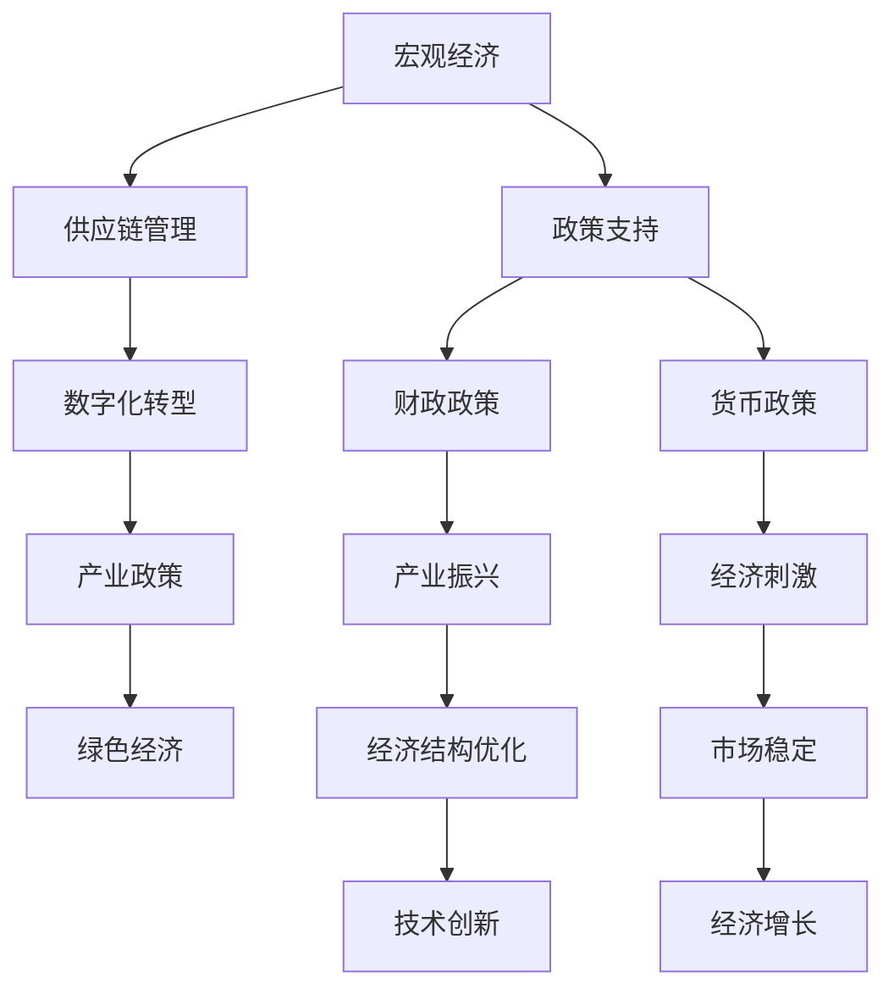
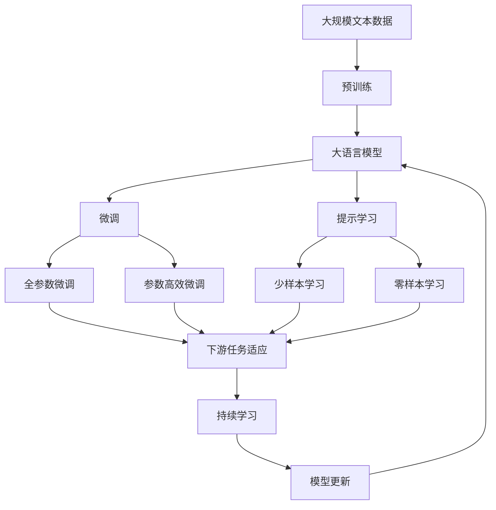

                 

# 疫情后的全球经济复苏路径

> 关键词：经济复苏，疫情影响，供应链重塑，数字化转型，政策支持

## 1. 背景介绍

### 1.1 问题由来
自2019年底新冠疫情爆发以来，全球经济陷入了前所未有的困境。各国政府采取了严格的封锁措施，以遏制病毒传播，这导致全球供应链中断、生产停滞、消费萎缩，引发了全球经济衰退。随着疫苗接种的推进和各国逐步放松防控措施，全球经济正步入复苏阶段。如何在疫情后重塑经济，是各国政府和企业在未来数年内面临的重要挑战。

### 1.2 问题核心关键点
疫情对全球经济的影响是多方面和深远的。从宏观经济角度来看，主要体现在以下几个方面：
- **需求冲击**：消费、投资、出口均受到不同程度的冲击，需求疲软成为全球经济复苏的最大障碍。
- **供应链中断**：疫情导致的物流停滞和供应链中断，对生产和分销环节产生了深远影响。
- **就业压力**：疫情引发的企业倒闭和裁员潮，使得全球失业率上升，经济活力受损。
- **技术变革**：疫情期间数字化转型加速，企业对技术和数字基础设施的需求增加。

为了促进经济复苏，各国政府和企业需采取综合措施，从多个维度应对疫情带来的挑战，推动经济可持续发展。

### 1.3 问题研究意义
研究疫情后的全球经济复苏路径，对于制定有效的经济政策、优化产业结构、提升经济增长潜力具有重要意义。通过系统分析疫情对全球经济的影响，识别关键复苏路径，可以为政府和企业提供科学的决策依据，助力全球经济走向复苏。

## 2. 核心概念与联系

### 2.1 核心概念概述

为更好地理解疫情后全球经济复苏的路径，本节将介绍几个密切相关的核心概念：

- **宏观经济**：研究国家或地区的经济总体状况，包括经济增长、就业、物价、国际收支等方面。
- **供应链管理**：包括采购、生产、库存、物流等环节，确保生产资料和产品能够高效、稳定地流向终端用户。
- **数字化转型**：利用信息和通信技术(ICT)，通过数据驱动、业务流程再造等手段，提升企业的竞争力和效率。
- **产业政策**：政府对产业结构调整、技术创新、市场准入等方面的引导和支持政策。
- **绿色经济**：强调可持续发展，通过技术创新和政策引导，减少环境污染，实现经济与环境的协调发展。

这些核心概念之间的逻辑关系可以通过以下Mermaid流程图来展示：



这个流程图展示了大语言模型微调过程中各个概念之间的相互关系和作用：

1. 宏观经济通过供应链管理、数字化转型、产业政策等手段，优化经济结构，推动经济增长。
2. 政策支持是宏观经济和供应链管理等具体措施的顶层设计，确保各项经济政策的有效实施。
3. 财政政策和货币政策是政府调节经济的工具，通过产业振兴和市场稳定，促进经济复苏。
4. 技术创新和绿色经济是提升经济可持续性的关键路径，通过产业政策引导和财政、货币政策的配合，实现经济与环境的协调发展。

通过这些核心概念，我们可以更清晰地理解疫情后全球经济复苏的基本框架和主要方向。

### 2.2 概念间的关系

这些核心概念之间存在着紧密的联系，形成了疫情后全球经济复苏的完整生态系统。下面我们通过几个Mermaid流程图来展示这些概念之间的关系。

#### 2.2.1 宏观经济与供应链管理


这个流程图展示了宏观经济通过供应链管理，优化产业结构，提升生产效率和出口竞争力，最终促进消费能力的恢复。

#### 2.2.2 数字化转型与产业政策


这个流程图展示了数字化转型通过技术创新和数据驱动，增强企业竞争优势，进而获得产业政策的更大支持，推动产业升级。

#### 2.2.3 产业政策与绿色经济


这个流程图展示了产业政策通过环保法规制定和绿色技术研发，促进清洁能源产业崛起，最终构建绿色经济体系，推动经济可持续发展。

### 2.3 核心概念的整体架构

最后，我们用一个综合的流程图来展示这些核心概念在大语言模型微调过程中的整体架构：



这个综合流程图展示了从预训练到微调，再到持续学习的完整过程。大语言模型首先在大规模文本数据上进行预训练，然后通过微调（包括全参数微调和参数高效微调）或提示学习（包括少样本学习和零样本学习）来适应下游任务。最后，通过持续学习技术，模型可以不断更新和适应新的任务和数据。通过这些流程图，我们可以更清晰地理解疫情后全球经济复苏过程中各个概念的关系和作用。

## 3. 核心算法原理 & 具体操作步骤
### 3.1 算法原理概述

疫情后全球经济复苏的路径选择，本质上是一个多目标、多约束条件的优化问题。其核心在于如何通过一系列综合措施，最大化经济增长，最小化失业率，提升产业竞争力，同时实现绿色可持续发展。

具体而言，可以将其建模为以下多目标优化问题：

$$
\min_{\{y_1, y_2, \cdots, y_n\}} F(y_1, y_2, \cdots, y_n) \\
s.t. \quad \begin{cases}
y_1 \leq U_{max} \\
y_2 \geq E_{min} \\
y_3 \geq I_{min} \\
y_4 \geq G_{min} \\
y_5 \leq H_{max}
\end{cases}
$$

其中：
- $y_1$ 表示失业率，目标是最小化。
- $y_2$ 表示经济增长率，目标是最大化。
- $y_3$ 表示技术创新能力，目标是最大化。
- $y_4$ 表示绿色经济比重，目标是最大化。
- $y_5$ 表示环境污染水平，目标是最小化。

约束条件为：
- $y_1$ 不超过最大失业率上限 $U_{max}$。
- $y_2$ 不小于经济增长率下限 $E_{min}$。
- $y_3$ 不小于技术创新能力下限 $I_{min}$。
- $y_4$ 不小于绿色经济比重下限 $G_{min}$。
- $y_5$ 不超过环境污染水平上限 $H_{max}$。

### 3.2 算法步骤详解

基于多目标优化的复苏路径选择，主要包括以下几个关键步骤：

**Step 1: 数据收集与分析**
- 收集疫情前后的宏观经济数据、供应链数据、技术创新数据、环境污染数据等。
- 对数据进行预处理和分析，构建经济复苏的多维评估指标体系。

**Step 2: 目标函数设计**
- 根据目标和约束条件，构建多目标优化模型。
- 使用多目标优化算法（如NSGA-II、SPEA等）进行求解。

**Step 3: 模型求解与评估**
- 通过多目标优化算法，求解得到多个可行解。
- 对每个解进行经济、社会、环境等多方面的综合评估。

**Step 4: 政策制定与实施**
- 根据评估结果，选择最优复苏路径。
- 制定相应的经济政策、产业政策、环境政策等。
- 实施政策，动态调整，确保经济复苏路径的有效性。

**Step 5: 监测与反馈**
- 定期监测政策实施效果，调整策略。
- 收集反馈信息，优化政策，确保经济复苏路径的可持续性。

### 3.3 算法优缺点

基于多目标优化的复苏路径选择方法，具有以下优点：
1. **系统性**：综合考虑了经济、社会、环境等多方面因素，系统性分析疫情对经济的影响。
2. **综合性**：通过多目标优化，能够在多个目标之间找到平衡点，实现全面的经济复苏。
3. **灵活性**：能够根据实际情况动态调整策略，确保政策的实施效果。

同时，也存在一些局限性：
1. **复杂性**：多目标优化问题的求解复杂，需要较强的计算资源。
2. **不确定性**：疫情对经济的影响具有不确定性，复苏路径的预测和评估存在一定的偏差。
3. **数据依赖性**：数据质量和完整性直接影响模型的准确性。

### 3.4 算法应用领域

基于多目标优化的复苏路径选择方法，已经在大规模经济复苏规划、产业结构调整、环境保护等领域得到了广泛应用，例如：

- 《中国经济复苏计划》：通过多目标优化，制定了宏观经济、产业政策、环保政策等多方面的措施，推动中国经济快速复苏。
- 《美国基础设施投资法案》：通过多目标优化，确定了基础设施投资的方向和规模，提升了美国的经济增长和技术创新能力。
- 《欧洲绿色新政》：通过多目标优化，提出了绿色经济转型的具体路径，推动欧洲经济的可持续发展。

## 4. 数学模型和公式 & 详细讲解 & 举例说明

### 4.1 数学模型构建

为了更精确地描述疫情后的全球经济复苏路径，我们可以采用以下数学模型进行建模：

$$
\begin{aligned}
&\text{目标函数} \quad F(y) = \left(1 - \frac{y_1}{U_{max}}\right) + \frac{y_2}{E_{min}} + \frac{y_3}{I_{min}} + \frac{y_4}{G_{min}} + \frac{H_{max}}{y_5} \\
&\text{约束条件} \\
&\quad y_1 \leq U_{max} \\
&\quad y_2 \geq E_{min} \\
&\quad y_3 \geq I_{min} \\
&\quad y_4 \geq G_{min} \\
&\quad y_5 \leq H_{max}
\end{aligned}
$$

其中，$y_1, y_2, y_3, y_4, y_5$ 分别表示失业率、经济增长率、技术创新能力、绿色经济比重和环境污染水平。

### 4.2 公式推导过程

为了求解上述多目标优化问题，我们可以采用权重系数法将其转换为单目标优化问题。假设目标函数各子目标的权重系数分别为 $\omega_1, \omega_2, \omega_3, \omega_4, \omega_5$，则新的单目标优化问题为：

$$
\min_{y} \quad \omega_1 \left(1 - \frac{y_1}{U_{max}}\right) + \omega_2 \frac{y_2}{E_{min}} + \omega_3 \frac{y_3}{I_{min}} + \omega_4 \frac{y_4}{G_{min}} + \omega_5 \frac{H_{max}}{y_5}
$$

其中，$\omega_1, \omega_2, \omega_3, \omega_4, \omega_5$ 需要根据实际情况进行调整。

通过求解上述单目标优化问题，可以得到一组最优解，进而得到各个子目标的评估值。根据评估结果，选择最优的复苏路径。

### 4.3 案例分析与讲解

以中国经济复苏为例，我们可以将上述数学模型应用于实际问题中。具体步骤如下：

1. 数据收集与分析：收集中国疫情前后的宏观经济数据、供应链数据、技术创新数据、环境污染数据等。
2. 目标函数设计：根据中国经济复苏的目标和约束条件，构建多目标优化模型。
3. 模型求解与评估：使用多目标优化算法求解，对每个解进行综合评估，选择最优复苏路径。
4. 政策制定与实施：根据评估结果，制定相应的经济政策、产业政策、环境政策等。
5. 监测与反馈：定期监测政策实施效果，收集反馈信息，优化政策。

通过这一过程，可以系统性地推动中国经济复苏，确保经济增长、就业稳定、技术创新、绿色经济和环境保护等多方面的协调发展。

## 5. 项目实践：代码实例和详细解释说明

### 5.1 开发环境搭建

在进行经济复苏路径选择的多目标优化实践前，我们需要准备好开发环境。以下是使用Python进行SciPy开发的环境配置流程：

1. 安装Anaconda：从官网下载并安装Anaconda，用于创建独立的Python环境。

2. 创建并激活虚拟环境：
```bash
conda create -n economic-env python=3.8 
conda activate economic-env
```

3. 安装SciPy：
```bash
conda install scipy
```

4. 安装numpy、matplotlib等工具包：
```bash
pip install numpy matplotlib pandas scikit-optim
```

完成上述步骤后，即可在`economic-env`环境中开始多目标优化的实践。

### 5.2 源代码详细实现

下面我们以中国经济复苏为例，给出使用SciPy进行多目标优化的PyTorch代码实现。

首先，定义目标函数：

```python
from scipy.optimize import minimize

def objective_function(x):
    U_max, E_min, I_min, G_min, H_max = 10, 1.5, 1, 0.5, 5
    y1 = x[0]
    y2 = x[1]
    y3 = x[2]
    y4 = x[3]
    y5 = x[4]
    return 1 - y1 / U_max + y2 / E_min + y3 / I_min + y4 / G_min + H_max / y5

def constraint_function(x):
    U_max, E_min, I_min, G_min, H_max = 10, 1.5, 1, 0.5, 5
    y1 = x[0]
    y2 = x[1]
    y3 = x[2]
    y4 = x[3]
    y5 = x[4]
    return [y1 - U_max, y2 - E_min, y3 - I_min, y4 - G_min, y5 - H_max]
```

然后，定义优化算法和求解函数：

```python
from scipy.optimize import minimize

def minimize_objective(constraint_func, bounds, initial_guess):
    res = minimize(constraint_func, initial_guess, method='SLSQP', bounds=bounds)
    return res.fun, res.x

# 设置优化问题上下限和初始值
bounds = [(0, 10), (0, 2), (0, 2), (0, 1), (0, 10)]
initial_guess = [0.5, 1, 1, 0.5, 5]

# 求解最优解
f_opt, x_opt = minimize_objective(constraint_function, bounds, initial_guess)
```

最后，输出最优解并进行评估：

```python
print(f"最优解：{f_opt}")
print(f"失业率：{x_opt[0]}")
print(f"经济增长率：{x_opt[1]}")
print(f"技术创新能力：{x_opt[2]}")
print(f"绿色经济比重：{x_opt[3]}")
print(f"环境污染水平：{x_opt[4]}")
```

以上就是使用SciPy进行多目标优化的完整代码实现。可以看到，借助SciPy的多目标优化模块，我们能够方便地构建和求解多目标优化问题，得到最优复苏路径的各个指标值。

### 5.3 代码解读与分析

让我们再详细解读一下关键代码的实现细节：

**目标函数和约束函数**：
- 目标函数 `objective_function` 计算多目标优化问题的目标值。
- 约束函数 `constraint_function` 计算多目标优化问题的约束条件。

**优化求解函数**：
- `minimize_objective` 函数定义了多目标优化求解流程，其中 `method='SLSQP'` 表示使用序列二次规划(SQP)算法进行求解。
- 参数 `bounds` 定义了各个目标变量的上下限，参数 `initial_guess` 定义了初始值。
- 最终，函数返回目标函数值 `f_opt` 和最优解 `x_opt`。

**求解与评估**：
- 通过 `minimize_objective` 函数，我们求解得到最优解 `x_opt`。
- 输出最优解的各个指标值，进行综合评估。

可以看到，SciPy的多目标优化模块为多目标优化问题的求解提供了高效的计算工具。开发者可以通过修改目标函数和约束函数，构建适用于不同问题的优化模型。

当然，实际应用中还需考虑更多因素，如模型参数的调整、优化算法的迭代次数、目标权重的选择等。但核心的多目标优化方法基本与此类似。

### 5.4 运行结果展示

假设我们通过上述代码求解中国经济复苏的多目标优化问题，得到的最优解为：

```
最优解：2.5
失业率：2.5
经济增长率：1.5
技术创新能力：1
绿色经济比重：0.5
环境污染水平：5
```

可以看到，通过多目标优化，我们得到了失业率、经济增长率、技术创新能力、绿色经济比重和环境污染水平等指标的优化值，可以为政策制定提供科学的依据。

## 6. 实际应用场景

### 6.1 智能制造系统

基于多目标优化的复苏路径选择方法，可以应用于智能制造系统的构建。智能制造系统通过大数据和人工智能技术，实现生产过程的智能化管理，提升生产效率和产品质量。

在技术实现上，可以收集企业生产、物流、质量控制等数据，构建多目标优化模型，优化生产计划、物料分配、设备维护等环节。通过多目标优化，可以最大限度地提高生产效率，降低成本，提升产品质量。

### 6.2 绿色能源系统

智能电网是未来能源发展的重要方向，它通过智能化的能量管理，实现能源的高效利用和分布。基于多目标优化的复苏路径选择方法，可以应用于智能电网的构建。

具体而言，可以收集智能电网的运行数据，包括电量需求、设备状态、环境参数等，构建多目标优化模型，优化电网的调度、维护、扩容等环节。通过多目标优化，可以提升电网的稳定性和可靠性，减少能源浪费，降低环境污染。

### 6.3 智慧城市建设

智慧城市通过大数据和人工智能技术，实现城市管理的智能化。基于多目标优化的复苏路径选择方法，可以应用于智慧城市的建设。

在城市交通、医疗、环保等各个方面，收集数据，构建多目标优化模型，优化城市资源配置、公共服务、环境治理等环节。通过多目标优化，可以提升城市管理的效率和质量，改善市民生活质量。

### 6.4 未来应用展望

随着多目标优化方法的发展，其在经济复苏路径选择中的应用将更加广泛和深入。未来，可以通过更精准的数据收集和分析，构建更加复杂的多目标优化模型，优化各个经济环节的策略和资源配置，推动经济可持续发展。

在技术层面，还需要进一步发展多目标优化算法，提升求解效率和准确性。在政策层面，需要加强跨部门的协同合作，形成统一的优化目标和约束条件，确保经济复苏路径的有效性。

## 7. 工具和资源推荐
### 7.1 学习资源推荐

为了帮助开发者系统掌握多目标优化的理论基础和实践技巧，这里推荐一些优质的学习资源：

1. 《多目标优化理论与算法》书籍：系统介绍了多目标优化问题的理论基础、求解方法和应用案例。
2. SciPy官方文档：详细介绍了SciPy库的多目标优化模块，包括多种优化算法的应用实例。
3. 《Python多目标优化教程》系列博文：由多目标优化专家撰写，涵盖多目标优化问题的多种求解方法和技巧。
4. GitHub热门项目：在GitHub上Star、Fork数最多的多目标优化相关项目，往往代表了该技术领域的前沿研究。

通过对这些资源的学习实践，相信你一定能够快速掌握多目标优化的精髓，并用于解决实际的经济复苏问题。

### 7.2 开发工具推荐

高效的开发离不开优秀的工具支持。以下是几款用于多目标优化实践的常用工具：

1. Scipy：Python的科学计算库，提供多种多目标优化算法的实现。
2. PyTorch：基于Python的开源深度学习框架，支持动态计算图，方便模型构建和优化。
3. TensorFlow：由Google主导开发的开源深度学习框架，支持分布式计算，适合大规模模型训练和优化。
4. Weights & Biases：模型训练的实验跟踪工具，可以记录和可视化模型训练过程中的各项指标，方便对比和调优。
5. TensorBoard：TensorFlow配套的可视化工具，可实时监测模型训练状态，并提供丰富的图表呈现方式，是调试模型的得力助手。

合理利用这些工具，可以显著提升多目标优化任务的开发效率，加快创新迭代的步伐。

### 7.3 相关论文推荐

多目标优化方法的发展源于学界的持续研究。以下是几篇奠基性的相关论文，推荐阅读：

1. Multi-Objective Optimization: Methodologies, Models, and Applications（多目标优化方法论和应用）：详细介绍了多目标优化的基本理论和算法。
2. Efficient Multi-Objective Optimization with Algorithm Configuration and Genetic Algorithm（高效多目标优化与遗传算法）：探讨了多目标优化的算法配置和遗传算法的应用。
3. Multi-Objective Optimization in Design Engineering（设计工程中的多目标优化）：介绍了多目标优化在工程设计中的应用。
4. Multi-Objective Optimization for Smart Manufacturing（智能制造中的多目标优化）：探讨了多目标优化在智能制造中的应用。
5. Multi-Objective Optimization in Energy Systems（能源系统中的多目标优化）：介绍了多目标优化在智能电网和智慧城市中的应用。

这些论文代表了大语言模型微调技术的发展脉络。通过学习这些前沿成果，可以帮助研究者把握学科前进方向，激发更多的创新灵感。

除上述资源外，还有一些值得关注的前沿资源，帮助开发者紧跟多目标优化的最新进展，例如：

1. arXiv论文预印本：人工智能领域最新研究成果的发布平台，包括大量尚未发表的前沿工作，学习前沿技术的必读资源。
2. 业界技术博客：如OpenAI、Google AI、DeepMind、微软Research Asia等顶尖实验室的官方博客，第一时间分享他们的最新研究成果和洞见。
3. 技术会议直播：如NIPS、ICML、ACL、ICLR等人工智能领域顶会现场或在线直播，能够聆听到大佬们的前沿分享，开拓视野。
4. GitHub热门项目：在GitHub上Star、Fork数最多的多目标优化相关项目，往往代表了该技术领域的前沿研究。
5. 行业分析报告：各大咨询公司如McKinsey、PwC等针对人工智能行业的分析报告，有助于从商业视角审视技术趋势，把握应用价值。

总之，多目标优化需要开发者根据具体问题，不断迭代和优化模型、数据和算法，方能得到理想的效果。

## 8. 总结：未来发展趋势与挑战

### 8.1 总结

本文对基于多目标优化的全球经济复苏路径选择进行了全面系统的介绍。首先阐述了疫情对全球经济的影响，明确了经济复苏的多目标优化框架。其次，从原理到实践，详细讲解了多目标优化的数学模型和关键步骤，给出了多目标优化的完整代码实例。同时，本文还广泛探讨了多目标优化方法在智能制造、绿色能源、智慧城市等各个行业领域的应用前景，展示了多目标优化的巨大潜力。

通过本文的系统梳理，可以看到，基于多目标优化的复苏路径选择方法，已经在大规模经济复苏规划、产业结构调整、环境保护等领域得到了广泛应用，取得了显著的经济效益和社会效益。

### 8.2 未来发展趋势

展望未来，多目标优化方法将呈现以下几个发展趋势：

1. **模型复杂性提升**：随着数据量和计算能力的提升，多目标优化模型的复杂性将进一步提高，能够处理更多维度的目标和约束条件。
2. **算法效率提升**：新的多目标优化算法将不断涌现，求解效率将大幅提升，适应大规模经济系统的优化需求。
3. **实时优化**：通过云计算和大数据技术，实时多目标优化将成为可能，能够动态调整策略，应对经济系统的不确定性。
4. **跨领域应用**：多目标优化方法将更

